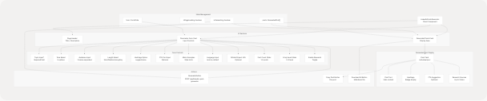

# LinkedIn Post Generator

* [frontend/app/dashboard/analysis/[id]/page.tsx](frontend/app/dashboard/analysis/%5Bid%5D/page.tsx)
* [frontend/app/dashboard/linkedin-posts/page.tsx](https://github.com/harleenkaur28/AI-Resume-Parser/blob/b2bbd83d/frontend/app/dashboard/linkedin-posts/page.tsx)
* [frontend/components/linkedin-posts-button.tsx](https://github.com/harleenkaur28/AI-Resume-Parser/blob/b2bbd83d/frontend/components/linkedin-posts-button.tsx)
* [frontend/lib/markdown-renderer.tsx](https://github.com/harleenkaur28/AI-Resume-Parser/blob/b2bbd83d/frontend/lib/markdown-renderer.tsx)

## Purpose and Scope

The LinkedIn Post Generator is a frontend interface that enables users to create AI-generated LinkedIn posts based on configurable parameters. This page documents the user interface, form handling, API integration, and post display features implemented in the `/dashboard/linkedin-posts` route.

For information about the backend service that powers this feature, including the LangChain integration and research agents, see [LinkedIn Services](/harleenkaur28/AI-Resume-Parser/3.6-linkedin-services). For the main dashboard that provides navigation to this feature, see [Main Dashboard](/harleenkaur28/AI-Resume-Parser/4.5.1-main-dashboard).

---

## Component Architecture

The LinkedIn Post Generator is implemented as a client-side React component at [frontend/app/dashboard/linkedin-posts/page.tsx](https://github.com/harleenkaur28/AI-Resume-Parser/blob/b2bbd83d/frontend/app/dashboard/linkedin-posts/page.tsx) It follows a two-column layout pattern with a configuration form on the left and generated posts displayed on the right.

### Component Structure Diagram


```

---

## Form State and Parameters

The component maintains a comprehensive form state object with 12 configurable parameters that control post generation behavior.

### Form State Structure

| Parameter | Type | Default | Description |
| --- | --- | --- | --- |
| `topic` | `string` | `""` | Main topic for the post (required) |
| `tone` | `string` | `"Professional"` | Writing tone: Professional, Conversational, Inspirational, Analytical, Friendly |
| `audience` | `string` | `""` | Target audience, comma-separated (e.g., "Developers, Engineering Managers") |
| `length` | `string` | `"Medium"` | Post length: Short, Medium, Long, Any |
| `hashtags_option` | `string` | `"suggest"` | Hashtag generation: "suggest" or "none" |
| `cta_text` | `string` | `""` | Optional call-to-action text |
| `mimic_examples` | `string` | `""` | Example posts to mimic writing style |
| `language` | `string` | `""` | Post language (auto-detected if empty) |
| `post_count` | `number` | `3` | Number of posts to generate (1-5) |
| `emoji_level` | `number` | `1` | Emoji usage level (0-3) |
| `github_project_url` | `string` | `""` | Optional GitHub project URL for context |
| `enable_research` | `boolean` | `true` | Enable web research for enhanced content |

### Parameter Update Pattern

The component uses a unified state update function for all form fields:

```
const update = (k: string, v: any) => setForm((f) => ({ ...f, [k]: v }));
```

This function is called by all input handlers to update specific fields while preserving the rest of the state.

---

## Post Generation Flow

### Generation Sequence Diagram


### Generation Function

The `generate()` function orchestrates the post creation process:

```
// Key steps:
// 1. Validate topic field is not empty
// 2. Set loading state and clear previous posts
// 3. POST form data to API endpoint
// 4. Handle response and update posts state
// 5. Display success/error toast notifications
```

**Validation**: The topic field is required. If empty, the function displays a destructive toast and returns early [frontend/app/dashboard/linkedin-posts/page.tsx65-72](https://github.com/harleenkaur28/AI-Resume-Parser/blob/b2bbd83d/frontend/app/dashboard/linkedin-posts/page.tsx#L65-L72)

**API Call**: The function POSTs the entire form state as JSON to `/api/linkedin-post-generator` [frontend/app/dashboard/linkedin-posts/page.tsx76-80](https://github.com/harleenkaur28/AI-Resume-Parser/blob/b2bbd83d/frontend/app/dashboard/linkedin-posts/page.tsx#L76-L80)

**Error Handling**: Network errors and non-success responses are caught and displayed via toast notifications [frontend/app/dashboard/linkedin-posts/page.tsx90-96](https://github.com/harleenkaur28/AI-Resume-Parser/blob/b2bbd83d/frontend/app/dashboard/linkedin-posts/page.tsx#L90-L96)

---

## Generated Post Data Model

Each generated post follows the `GeneratedPost` interface:

```
interface GeneratedPost {
    text: string;                              // Main post content
    hashtags?: string[];                       // Suggested hashtags
    cta_suggestion?: string;                   // Call-to-action text
    sources?: { title: string; link: string }[]; // Research sources
    github_project_name?: string;              // Detected project name
}
```

---

## Post Processing and Display

### Post Content Processing

The `processPostContent()` function performs intelligent post-processing to clean up the generated content:

**Hashtag Extraction**: The function identifies hashtags in the last paragraph of the post text and moves them to the `hashtags` array [frontend/app/dashboard/linkedin-posts/page.tsx101-140](https://github.com/harleenkaur28/AI-Resume-Parser/blob/b2bbd83d/frontend/app/dashboard/linkedin-posts/page.tsx#L101-L140)

**Algorithm**:

1. Split post text into paragraphs
2. Extract hashtags from the last paragraph using regex `/#[a-zA-Z0-9_]+/g`
3. Remove hashtags from the text
4. Clean up whitespace
5. Merge extracted hashtags with existing hashtags array
6. Remove duplicates using `Set`

This ensures hashtags are consistently displayed in the dedicated hashtag section rather than inline in the text.

### Post Card Components

Each generated post is rendered in a card with multiple sections:

#### Post Card Structure

```


**Card Styling**: Each post card uses glassmorphism effects with `backdrop-blur-sm`, hover animations, and border transitions [frontend/app/dashboard/linkedin-posts/page.tsx599-690](https://github.com/harleenkaur28/AI-Resume-Parser/blob/b2bbd83d/frontend/app/dashboard/linkedin-posts/page.tsx#L599-L690)

**Animation**: Posts animate in sequentially with a staggered delay using `framer-motion`:

```
initial={{ opacity: 0, y: 12 }}
animate={{ opacity: 1, y: 0 }}
transition={{ duration: 0.4, delay: i * 0.1 }}
```

---

## User Interactions

### Copy to Clipboard

The `copyPost()` function formats and copies a single post to the clipboard:

**Format**:

```
{post_text}

#{hashtag1} #{hashtag2} #{hashtag3}

CTA: {cta_suggestion}
```

**Implementation**: Uses the Web Clipboard API (`navigator.clipboard.writeText()`) with error handling [frontend/app/dashboard/linkedin-posts/page.tsx142-152](https://github.com/harleenkaur28/AI-Resume-Parser/blob/b2bbd83d/frontend/app/dashboard/linkedin-posts/page.tsx#L142-L152)

### Download All Posts

The `downloadAll()` function exports all generated posts as a markdown file:

**Filename**: `linkedin-posts.md`

**Format**: Posts are separated by horizontal rules with numbered headings:

```
Post 1:
{text}
Hashtags: #{tag1} #{tag2}
CTA: {cta}

-------------------------
Post 2:
...
```

**Implementation**: Creates a `Blob` object and triggers a download using a temporary anchor element [frontend/app/dashboard/linkedin-posts/page.tsx154-175](https://github.com/harleenkaur28/AI-Resume-Parser/blob/b2bbd83d/frontend/app/dashboard/linkedin-posts/page.tsx#L154-L175)

---

## UI Components and Styling

### Responsive Design

The page implements a mobile-first responsive layout:

| Breakpoint | Layout | Key Changes |
| --- | --- | --- |
| Mobile (< 640px) | Single column | Stacked form and results, smaller text, compact buttons |
| Tablet (640-1280px) | Single column | Larger text, more padding |
| Desktop (> 1280px) | Two columns | Side-by-side form and results (`xl:grid-cols-2`) |

**Container Classes**: The main container uses responsive padding:

```
className="container mx-auto px-4 sm:px-6 lg:px-8 py-4 sm:py-8"
```

### Form Section Layout

The form is organized into bordered sections with consistent spacing:

1. **Core Topic & Audience** [frontend/app/dashboard/linkedin-posts/page.tsx247-352](https://github.com/harleenkaur28/AI-Resume-Parser/blob/b2bbd83d/frontend/app/dashboard/linkedin-posts/page.tsx#L247-L352)

   * Topic input (required)
   * Tone selector
   * Audience input
   * Length and hashtag options grid
2. **CTA Configuration** [frontend/app/dashboard/linkedin-posts/page.tsx354-364](https://github.com/harleenkaur28/AI-Resume-Parser/blob/b2bbd83d/frontend/app/dashboard/linkedin-posts/page.tsx#L354-L364)

   * Optional CTA text input
3. **Style Customization** [frontend/app/dashboard/linkedin-posts/page.tsx365-388](https://github.com/harleenkaur28/AI-Resume-Parser/blob/b2bbd83d/frontend/app/dashboard/linkedin-posts/page.tsx#L365-L388)

   * Mimic examples textarea
   * Language input
4. **Advanced Settings** [frontend/app/dashboard/linkedin-posts/page.tsx389-451](https://github.com/harleenkaur28/AI-Resume-Parser/blob/b2bbd83d/frontend/app/dashboard/linkedin-posts/page.tsx#L389-L451)

   * GitHub project URL
   * Post count slider (1-5)
   * Emoji level slider (0-3)
   * Enable research toggle

Each section uses `border-t border-[#76ABAE]/10` to create visual separation.

### Generate Button States

The generate button has three distinct states:

1. **Idle State**: Shows "Generate Posts" with icon [frontend/app/dashboard/linkedin-posts/page.tsx493-498](https://github.com/harleenkaur28/AI-Resume-Parser/blob/b2bbd83d/frontend/app/dashboard/linkedin-posts/page.tsx#L493-L498)
2. **Generating State**: Displays spinner, pulsing background, and progress text [frontend/app/dashboard/linkedin-posts/page.tsx471-490](https://github.com/harleenkaur28/AI-Resume-Parser/blob/b2bbd83d/frontend/app/dashboard/linkedin-posts/page.tsx#L471-L490)
3. **Disabled State**: When topic is empty or already generating [frontend/app/dashboard/linkedin-posts/page.tsx460](https://github.com/harleenkaur28/AI-Resume-Parser/blob/b2bbd83d/frontend/app/dashboard/linkedin-posts/page.tsx#L460-L460)

**Visual Effects**:

* Animated background pulse during generation
* Shine effect on hover (`group-hover:translate-x-full`)
* Progress indicator at button bottom
* Multiple spinning loaders

---

## Loading States

### Page Loading

The component uses a `PageLoader` component during initial page load:

```
const [isPageLoading, setIsPageLoading] = useState(true);

useEffect(() => {
    const t = setTimeout(() => setIsPageLoading(false), 120);
    return () => clearTimeout(t);
}, []);
```

This creates a brief 120ms delay to allow for any data prefetch operations [frontend/app/dashboard/linkedin-posts/page.tsx58-62](https://github.com/harleenkaur28/AI-Resume-Parser/blob/b2bbd83d/frontend/app/dashboard/linkedin-posts/page.tsx#L58-L62)

### Generation Loading

Two loading indicators are used during post generation:

1. **LoadingOverlay**: Full-screen overlay with detailed progress message [frontend/app/dashboard/linkedin-posts/page.tsx702-708](https://github.com/harleenkaur28/AI-Resume-Parser/blob/b2bbd83d/frontend/app/dashboard/linkedin-posts/page.tsx#L702-L708)
2. **Inline Loader**: Displayed in the posts card area [frontend/app/dashboard/linkedin-posts/page.tsx573-594](https://github.com/harleenkaur28/AI-Resume-Parser/blob/b2bbd83d/frontend/app/dashboard/linkedin-posts/page.tsx#L573-L594)

The inline loader shows:

* Pulse animation loader
* Spinning ring indicator
* Status text: "Generating posts..." and "AI is crafting your LinkedIn content"

---

## Markdown Rendering

The component uses the `renderMarkdown()` utility function from `markdown-renderer.tsx` to display formatted content in CTA suggestions.

**Supported Features**:

* Bold text: `**text**`
* Links: `<FileRef file-url="https://github.com/harleenkaur28/AI-Resume-Parser/blob/b2bbd83d/text" undefined file-path="text">Hii</FileRef>`
* Lists: `* item` or `- item`
* Headings: `##` and `###`

**Usage**: Applied to `cta_suggestion` field [frontend/app/dashboard/linkedin-posts/page.tsx655-657](https://github.com/harleenkaur28/AI-Resume-Parser/blob/b2bbd83d/frontend/app/dashboard/linkedin-posts/page.tsx#L655-L657)

---

## Navigation Integration

### Entry Points

Users can navigate to the LinkedIn Post Generator from multiple locations:

1. **Main Dashboard**: Quick action buttons or feature grid
2. **Analysis Page**: Direct link from resume analysis results
3. **Floating Button**: The `LinkedInPostsButton` component provides a floating action button on desktop screens [frontend/components/linkedin-posts-button.tsx1-22](https://github.com/harleenkaur28/AI-Resume-Parser/blob/b2bbd83d/frontend/components/linkedin-posts-button.tsx#L1-L22)

### Floating Button Component

The `LinkedInPostsButton` is a fixed-position button that appears at the bottom center of the screen:

```
className="fixed bottom-5 left-1/2 -translate-x-1/2 z-50 hidden md:block"
```

**Visibility**: Only visible on medium and larger screens (`hidden md:block`).

**Styling**: Uses the application's primary color scheme with hover scaling effects.

### Back Navigation

The page includes a back button that navigates to `/dashboard`:

```
<Link href="/dashboard">
    <Button variant="ghost" size="sm" className="...">
        <ArrowLeft className="mr-2 h-4 w-4" />
        <span className="hidden sm:inline">Back to Dashboard</span>
        <span className="sm:hidden">Back</span>
    </Button>
</Link>
```

The button text is responsive, showing abbreviated text on mobile devices.

---

## API Integration

### Endpoint

The component communicates with the backend via:

**Route**: `POST /api/linkedin-post-generator`

**Request Body**: The entire form state object serialized as JSON [frontend/app/dashboard/linkedin-posts/page.tsx76-80](https://github.com/harleenkaur28/AI-Resume-Parser/blob/b2bbd83d/frontend/app/dashboard/linkedin-posts/page.tsx#L76-L80)

**Response Format**:

```
{
    success: boolean;
    posts: GeneratedPost[];  // Array of 1-5 posts
    message?: string;         // Error message if success=false
}
```

---

## Color Scheme and Theme

The page uses a consistent dark theme color palette:

| Element | Color Code | Usage |
| --- | --- | --- |
| Background gradient | `from-[#222831] via-[#31363F] to-[#222831]` | Main page background |
| Primary accent | `#76ABAE` | Buttons, highlights, borders |
| Text primary | `#EEEEEE` | Main text content |
| Text secondary | `#EEEEEE/60` to `#EEEEEE/80` | Descriptions, metadata |
| Card background | `bg-white/5` | Glassmorphism effect |
| Border | `border-white/10` | Card borders |
| Input background | `bg-[#222831]/50` | Form inputs |

**Glassmorphism**: Cards use `backdrop-blur-lg bg-white/5` for a frosted glass effect.

---

## Toast Notifications

The component uses the `useToast` hook to display feedback messages:

### Toast Types

1. **Success Toast** [frontend/app/dashboard/linkedin-posts/page.tsx86-89](https://github.com/harleenkaur28/AI-Resume-Parser/blob/b2bbd83d/frontend/app/dashboard/linkedin-posts/page.tsx#L86-L89)

   * Title: "Posts generated"
   * Description: Shows post count
2. **Validation Error** [frontend/app/dashboard/linkedin-posts/page.tsx66-71](https://github.com/harleenkaur28/AI-Resume-Parser/blob/b2bbd83d/frontend/app/dashboard/linkedin-posts/page.tsx#L66-L71)

   * Title: "Topic required"
   * Variant: "destructive"
3. **Generation Error** [frontend/app/dashboard/linkedin-posts/page.tsx91-95](https://github.com/harleenkaur28/AI-Resume-Parser/blob/b2bbd83d/frontend/app/dashboard/linkedin-posts/page.tsx#L91-L95)

   * Title: "Generation failed"
   * Description: Error message
   * Variant: "destructive"
4. **Copy Success** [frontend/app/dashboard/linkedin-posts/page.tsx148](https://github.com/harleenkaur28/AI-Resume-Parser/blob/b2bbd83d/frontend/app/dashboard/linkedin-posts/page.tsx#L148-L148)

   * Title: "Copied"
   * Description: "Post copied to clipboard"
5. **Copy Failure** [frontend/app/dashboard/linkedin-posts/page.tsx150](https://github.com/harleenkaur28/AI-Resume-Parser/blob/b2bbd83d/frontend/app/dashboard/linkedin-posts/page.tsx#L150-L150)

   * Title: "Copy failed"
   * Variant: "destructive"

---

## Component Dependencies

### External Libraries

| Package | Usage |
| --- | --- |
| `framer-motion` | Animations and transitions |
| `lucide-react` | Icon components (ArrowLeft, Copy, Download, Hash, Github) |
| `next/link` | Client-side navigation |

### Internal Components

| Component | Source | Purpose |
| --- | --- | --- |
| `Button` | `@/components/ui/button` | Action buttons |
| `Card` | `@/components/ui/card` | Container cards |
| `Input` | `@/components/ui/input` | Text inputs |
| `Select` | `@/components/ui/select` | Dropdown selectors |
| `Textarea` | `@/components/ui/textarea` | Multi-line text input |
| `Slider` | `@/components/ui/slider` | Range sliders |
| `Switch` | `@/components/ui/switch` | Boolean toggles |
| `Badge` | `@/components/ui/badge` | Hashtag display |
| `Label` | `@/components/ui/label` | Form labels |
| `Loader` | `@/components/ui/loader` | Loading indicators |
| `PageLoader` | `@/components/ui/page-loader` | Initial page load |
| `LoadingOverlay` | `@/components/cold-mail/LoadingOverlay` | Generation overlay |

### Utilities

* `useToast` - Toast notification hook [frontend/app/dashboard/linkedin-posts/page.tsx24](https://github.com/harleenkaur28/AI-Resume-Parser/blob/b2bbd83d/frontend/app/dashboard/linkedin-posts/page.tsx#L24-L24)
* `renderMarkdown` - Markdown rendering utility [frontend/app/dashboard/linkedin-posts/page.tsx26](https://github.com/harleenkaur28/AI-Resume-Parser/blob/b2bbd83d/frontend/app/dashboard/linkedin-posts/page.tsx#L26-L26)
