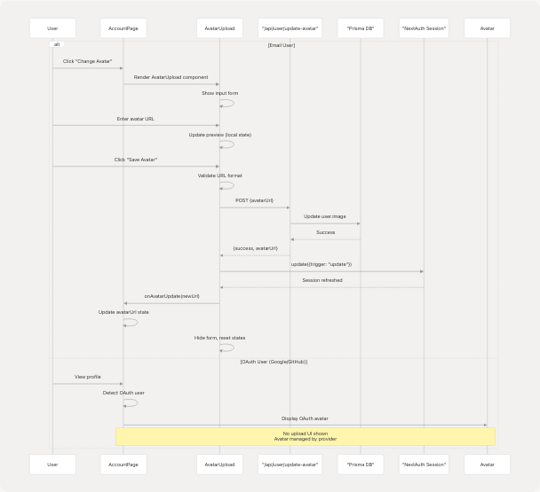
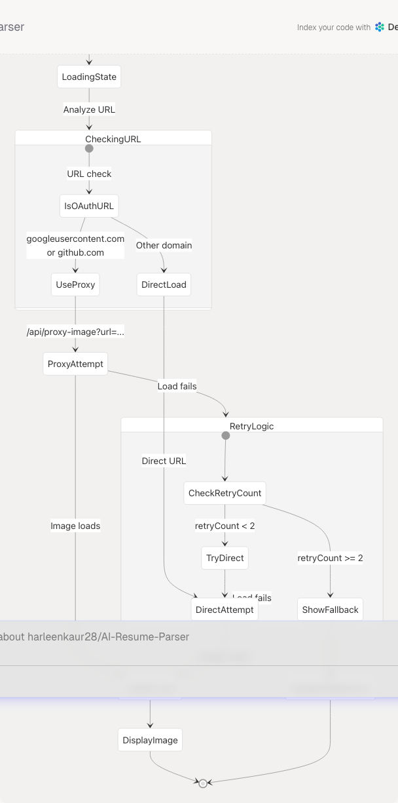
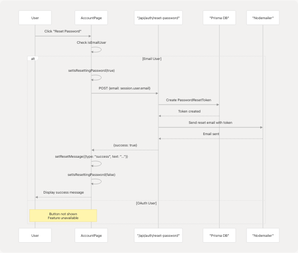
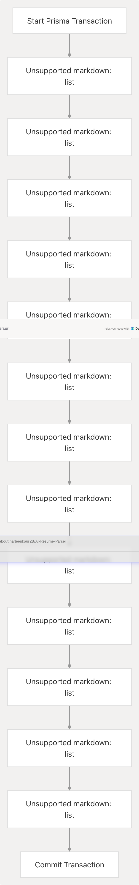

# Account Management

This document describes the Account Management page, a frontend component that allows users to view and manage their account settings, profile information, security settings, and account deletion. This page provides different functionality based on the user's authentication method (email/password vs OAuth providers like Google or GitHub).

For authentication flows and session management, see [Authentication System](4.2-authentication-system). For role-based access control, see [Role Selection & Management](4.2.4-role-selection-and-management).

## Purpose and Scope

The Account Management page serves as the central hub for user account operations. It provides:

* **Profile Information Display**: Shows user name, email, role, and profile picture
* **Avatar Management**: Upload/change profile pictures (email users only; OAuth users' avatars are managed by their provider)
* **Security Settings**: Password reset functionality for email-authenticated users
* **Account Deletion**: Complete account removal with cascading deletion of all associated data
* **Authentication Method Display**: Shows the active authentication method
* **Quick Actions**: Navigation shortcuts and sign-out functionality

**Sources:** [frontend/app/account/page.tsx1-792](https://github.com/harleenkaur28/AI-Resume-Parser/blob/b2bbd83d/frontend/app/account/page.tsx#L1-L792)

## Page Structure and Components

The Account Management page is implemented as a Next.js client component located at `/account`. It uses NextAuth for session management and displays different UI elements based on the user's authentication provider.

### Component Architecture Diagram

**Sources:** [frontend/app/account/page.tsx44-792](https://github.com/harleenkaur28/AI-Resume-Parser/blob/b2bbd83d/frontend/app/account/page.tsx#L44-L792) [frontend/components/avatar-upload.tsx1-179](https://github.com/harleenkaur28/AI-Resume-Parser/blob/b2bbd83d/frontend/components/avatar-upload.tsx#L1-L179) [frontend/components/ui/avatar.tsx1-121](https://github.com/harleenkaur28/AI-Resume-Parser/blob/b2bbd83d/frontend/components/ui/avatar.tsx#L1-L121)

### Authentication Method Detection

The page differentiates between email-authenticated users and OAuth users by examining the user's profile image URL:

**Sources:** [frontend/app/account/page.tsx58-63](https://github.com/harleenkaur28/AI-Resume-Parser/blob/b2bbd83d/frontend/app/account/page.tsx#L58-L63)

## Profile Information Management

### Profile Display

The Profile Information Card displays the user's basic account details including name, email, role, and profile picture. The role is displayed as "Recruiter" if the user's role is "Admin", otherwise it shows the actual role value.

| Field | Icon | Data Source | Display Logic |
| --- | --- | --- | --- |
| Profile Picture | Avatar | `session.user.image` or `avatarUrl` state | Different UI for email vs OAuth users |
| Name | User | `session.user.name` | Displayed as-is or "Not provided" |
| Email | Mail | `session.user.email` | Displayed as-is or "Not provided" |
| Role | Shield | `(session.user as any).role` | "Recruiter" if "Admin", else actual role or "Not assigned" |

**Sources:** [frontend/app/account/page.tsx226-295](https://github.com/harleenkaur28/AI-Resume-Parser/blob/b2bbd83d/frontend/app/account/page.tsx#L226-L295)

### Avatar Management Flow

The avatar management system behaves differently based on authentication method:

**Sources:** [frontend/app/account/page.tsx238-265](https://github.com/harleenkaur28/AI-Resume-Parser/blob/b2bbd83d/frontend/app/account/page.tsx#L238-L265) [frontend/components/avatar-upload.tsx22-178](https://github.com/harleenkaur28/AI-Resume-Parser/blob/b2bbd83d/frontend/components/avatar-upload.tsx#L22-L178)

### Avatar Component with Proxy Support

The Avatar component implements retry logic and CORS workaround for OAuth provider images:

**Sources:** [frontend/components/ui/avatar.tsx12-120](https://github.com/harleenkaur28/AI-Resume-Parser/blob/b2bbd83d/frontend/components/ui/avatar.tsx#L12-L120) [frontend/app/api/proxy-image/route.ts1-91](https://github.com/harleenkaur28/AI-Resume-Parser/blob/b2bbd83d/frontend/app/api/proxy-image/route.ts#L1-L91)

## Account Security

### Password Reset Flow

Password reset is only available to email-authenticated users. OAuth users' passwords are managed by their respective providers.

**Sources:** [frontend/app/account/page.tsx82-121](https://github.com/harleenkaur28/AI-Resume-Parser/blob/b2bbd83d/frontend/app/account/page.tsx#L82-L121) [frontend/app/account/page.tsx346-379](https://github.com/harleenkaur28/AI-Resume-Parser/blob/b2bbd83d/frontend/app/account/page.tsx#L346-L379)

### Authentication Method Display

The Account Security Card displays the active authentication method with appropriate labels:

| Authentication Type | Detection Logic | Display Label | Additional Features |
| --- | --- | --- | --- |
| Google OAuth | `session.user.image` contains "googleusercontent" | "Google OAuth" | No password reset |
| GitHub OAuth | `session.user.image` contains "github" | "GitHub OAuth" | No password reset |
| Email Sign-in | All other cases | "Email Sign-in" | Password reset available |

**Sources:** [frontend/app/account/page.tsx329-343](https://github.com/harleenkaur28/AI-Resume-Parser/blob/b2bbd83d/frontend/app/account/page.tsx#L329-L343)

## Account Deletion

### Deletion Confirmation Flow

Account deletion requires explicit user confirmation by typing "DELETE" to prevent accidental data loss:

**Sources:** [frontend/app/account/page.tsx123-157](https://github.com/harleenkaur28/AI-Resume-Parser/blob/b2bbd83d/frontend/app/account/page.tsx#L123-L157) [frontend/app/account/page.tsx636-789](https://github.com/harleenkaur28/AI-Resume-Parser/blob/b2bbd83d/frontend/app/account/page.tsx#L636-L789) [frontend/app/api/auth/delete-account/route.ts1-151](https://github.com/harleenkaur28/AI-Resume-Parser/blob/b2bbd83d/frontend/app/api/auth/delete-account/route.ts#L1-L151)

### Cascading Deletion Logic

The account deletion API implements a transactional cascading delete to maintain referential integrity:

**Sources:** [frontend/app/api/auth/delete-account/route.ts42-134](https://github.com/harleenkaur28/AI-Resume-Parser/blob/b2bbd83d/frontend/app/api/auth/delete-account/route.ts#L42-L134)

## Page Loading and Navigation

### Loading States

The page implements multiple loading states for better user experience:

| State Variable | Purpose | Duration | UI Effect |
| --- | --- | --- | --- |
| `status === "loading"` | NextAuth session loading | Until session resolved | Full-page "Loading..." message |
| `isPageLoading` | Initial page render | 100ms | Full-page loader with animation |
| `isResettingPassword` | Password reset in progress | API call duration | Disabled button with spinner |
| `isDeleting` | Account deletion in progress | API call + transaction | Disabled button with spinner |

**Sources:** [frontend/app/account/page.tsx47-76](https://github.com/harleenkaur28/AI-Resume-Parser/blob/b2bbd83d/frontend/app/account/page.tsx#L47-L76) [frontend/app/account/page.tsx159-187](https://github.com/harleenkaur28/AI-Resume-Parser/blob/b2bbd83d/frontend/app/account/page.tsx#L159-L187)

### Navigation and Quick Actions

The page provides navigation elements and quick actions:

**Sources:** [frontend/app/account/page.tsx196-206](https://github.com/harleenkaur28/AI-Resume-Parser/blob/b2bbd83d/frontend/app/account/page.tsx#L196-L206) [frontend/app/account/page.tsx419-433](https://github.com/harleenkaur28/AI-Resume-Parser/blob/b2bbd83d/frontend/app/account/page.tsx#L419-L433) [frontend/app/account/page.tsx78-80](https://github.com/harleenkaur28/AI-Resume-Parser/blob/b2bbd83d/frontend/app/account/page.tsx#L78-L80)

## Future Features (Coming Soon)

### BYOAW & Model Selector Card

The page includes a preview of an upcoming feature for "Bring Your Own AI Weights" (BYOAW) and model selection. This card is currently disabled with a "Coming Soon" overlay.

Planned features include:

* **AI Model Provider Selection**: OpenAI, Claude (Anthropic), Gemini (Google)
* **API Configuration**: Custom API keys and endpoints
* **Model Settings**: Temperature and max tokens configuration
* **Connection Testing**: Validate API credentials before saving

The UI structure is already implemented but overlaid with a disabled state:

**Sources:** [frontend/app/account/page.tsx438-629](https://github.com/harleenkaur28/AI-Resume-Parser/blob/b2bbd83d/frontend/app/account/page.tsx#L438-L629)

## Data Flow Summary

### Complete Account Management Data Flow

**Sources:** [frontend/app/account/page.tsx1-792](https://github.com/harleenkaur28/AI-Resume-Parser/blob/b2bbd83d/frontend/app/account/page.tsx#L1-L792) [frontend/components/avatar-upload.tsx1-179](https://github.com/harleenkaur28/AI-Resume-Parser/blob/b2bbd83d/frontend/components/avatar-upload.tsx#L1-L179) [frontend/app/api/auth/delete-account/route.ts1-151](https://github.com/harleenkaur28/AI-Resume-Parser/blob/b2bbd83d/frontend/app/api/auth/delete-account/route.ts#L1-L151) [frontend/app/api/proxy-image/route.ts1-91](https://github.com/harleenkaur28/AI-Resume-Parser/blob/b2bbd83d/frontend/app/api/proxy-image/route.ts#L1-L91)

## Key Code Entities

### Main Component

* **Component**: `AccountPage` [frontend/app/account/page.tsx44-792](https://github.com/harleenkaur28/AI-Resume-Parser/blob/b2bbd83d/frontend/app/account/page.tsx#L44-L792)
* **Route**: `/account` (Next.js App Router)
* **Hooks**: `useSession`, `useRouter`

### State Management

* `isPageLoading`: Initial page load animation state
* `avatarUrl`: Stores updated avatar URL after upload
* `isResettingPassword`: Password reset operation in progress
* `resetMessage`: Success/error messages for operations
* `showDeleteDialog`: Controls delete confirmation modal visibility
* `deleteConfirmation`: User input for deletion confirmation
* `isDeleting`: Account deletion operation in progress

### Helper Functions

* `isEmailUser` [frontend/app/account/page.tsx59-63](https://github.com/harleenkaur28/AI-Resume-Parser/blob/b2bbd83d/frontend/app/account/page.tsx#L59-L63): Determines if user authenticated with email (vs OAuth)
* `handleSignOut()` [frontend/app/account/page.tsx78-80](https://github.com/harleenkaur28/AI-Resume-Parser/blob/b2bbd83d/frontend/app/account/page.tsx#L78-L80): Signs out user and redirects to home
* `handlePasswordReset()` [frontend/app/account/page.tsx82-121](https://github.com/harleenkaur28/AI-Resume-Parser/blob/b2bbd83d/frontend/app/account/page.tsx#L82-L121): Initiates password reset flow
* `handleDeleteAccount()` [frontend/app/account/page.tsx123-157](https://github.com/harleenkaur28/AI-Resume-Parser/blob/b2bbd83d/frontend/app/account/page.tsx#L123-L157): Processes account deletion with validation

### API Routes

* `POST /api/user/update-avatar`: Updates user profile picture
* `POST /api/auth/reset-password`: Sends password reset email
* `DELETE /api/auth/delete-account`: Permanently deletes user account and data [frontend/app/api/auth/delete-account/route.ts6-150](https://github.com/harleenkaur28/AI-Resume-Parser/blob/b2bbd83d/frontend/app/api/auth/delete-account/route.ts#L6-L150)
* `GET /api/proxy-image`: Proxies OAuth provider images to avoid CORS [frontend/app/api/proxy-image/route.ts5-90](https://github.com/harleenkaur28/AI-Resume-Parser/blob/b2bbd83d/frontend/app/api/proxy-image/route.ts#L5-L90)

### Sub-Components

* `AvatarUpload` [frontend/components/avatar-upload.tsx22-178](https://github.com/harleenkaur28/AI-Resume-Parser/blob/b2bbd83d/frontend/components/avatar-upload.tsx#L22-L178): Avatar URL input and preview
* `Avatar` [frontend/components/ui/avatar.tsx12-120](https://github.com/harleenkaur28/AI-Resume-Parser/blob/b2bbd83d/frontend/components/ui/avatar.tsx#L12-L120): Profile picture display with fallback
* `Card` components: Various card layouts for different sections
* `Dialog`: Modal for delete confirmation

**Sources:** [frontend/app/account/page.tsx1-792](https://github.com/harleenkaur28/AI-Resume-Parser/blob/b2bbd83d/frontend/app/account/page.tsx#L1-L792) [frontend/components/avatar-upload.tsx1-179](https://github.com/harleenkaur28/AI-Resume-Parser/blob/b2bbd83d/frontend/components/avatar-upload.tsx#L1-L179) [frontend/components/ui/avatar.tsx1-121](https://github.com/harleenkaur28/AI-Resume-Parser/blob/b2bbd83d/frontend/components/ui/avatar.tsx#L1-L121) [frontend/app/api/auth/delete-account/route.ts1-151](https://github.com/harleenkaur28/AI-Resume-Parser/blob/b2bbd83d/frontend/app/api/auth/delete-account/route.ts#L1-L151) [frontend/app/api/proxy-image/route.ts1-91](https://github.com/harleenkaur28/AI-Resume-Parser/blob/b2bbd83d/frontend/app/api/proxy-image/route.ts#L1-L91)
