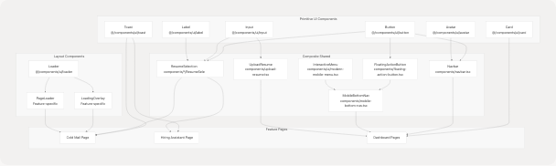
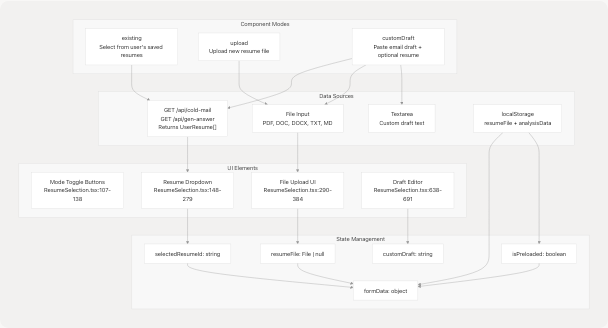
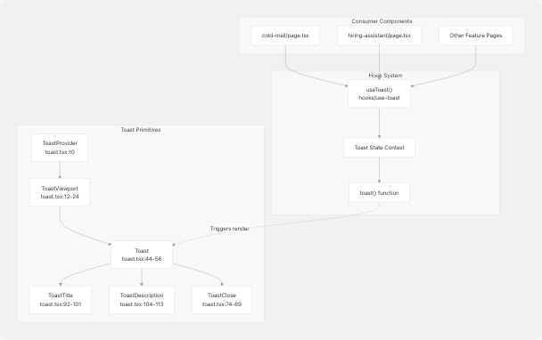
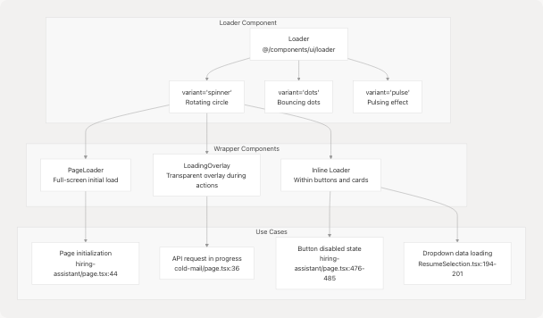
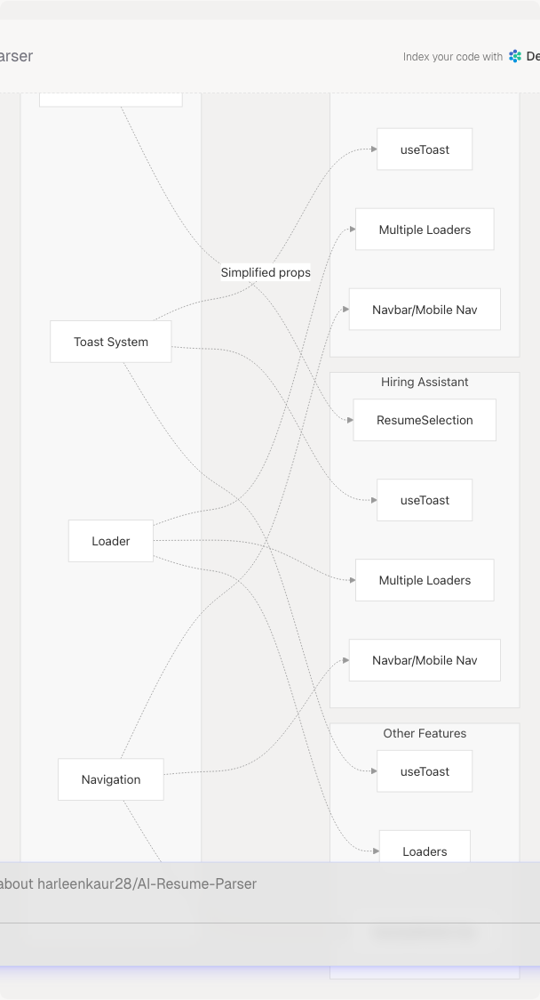

# Shared Components

Relevant source files

* [frontend/app/dashboard/cold-mail/page.tsx](https://github.com/harleenkaur28/AI-Resume-Parser/blob/b2bbd83d/frontend/app/dashboard/cold-mail/page.tsx)
* [frontend/app/dashboard/hiring-assistant/page.tsx](https://github.com/harleenkaur28/AI-Resume-Parser/blob/b2bbd83d/frontend/app/dashboard/hiring-assistant/page.tsx)
* [frontend/components/cold-mail/ResumeSelection.tsx](https://github.com/harleenkaur28/AI-Resume-Parser/blob/b2bbd83d/frontend/components/cold-mail/ResumeSelection.tsx)
* [frontend/components/example-action-pages.tsx](https://github.com/harleenkaur28/AI-Resume-Parser/blob/b2bbd83d/frontend/components/example-action-pages.tsx)
* [frontend/components/floating-action-button.tsx](https://github.com/harleenkaur28/AI-Resume-Parser/blob/b2bbd83d/frontend/components/floating-action-button.tsx)
* [frontend/components/mobile-bottom-nav.tsx](https://github.com/harleenkaur28/AI-Resume-Parser/blob/b2bbd83d/frontend/components/mobile-bottom-nav.tsx)
* [frontend/components/navbar.tsx](https://github.com/harleenkaur28/AI-Resume-Parser/blob/b2bbd83d/frontend/components/navbar.tsx)
* [frontend/components/ui/modern-mobile-menu.css](https://github.com/harleenkaur28/AI-Resume-Parser/blob/b2bbd83d/frontend/components/ui/modern-mobile-menu.css)
* [frontend/components/ui/modern-mobile-menu.tsx](https://github.com/harleenkaur28/AI-Resume-Parser/blob/b2bbd83d/frontend/components/ui/modern-mobile-menu.tsx)
* [frontend/components/ui/toast.tsx](https://github.com/harleenkaur28/AI-Resume-Parser/blob/b2bbd83d/frontend/components/ui/toast.tsx)
* [frontend/components/upload-resume.tsx](https://github.com/harleenkaur28/AI-Resume-Parser/blob/b2bbd83d/frontend/components/upload-resume.tsx)
* [frontend/lib/navigation.ts](https://github.com/harleenkaur28/AI-Resume-Parser/blob/b2bbd83d/frontend/lib/navigation.ts)
* [frontend/prisma/migrations/20250613172024\_replace\_file\_url\_with\_raw\_text/migration.sql](https://github.com/harleenkaur28/AI-Resume-Parser/blob/b2bbd83d/frontend/prisma/migrations/20250613172024_replace_file_url_with_raw_text/migration.sql)

## Purpose and Scope

This document covers the reusable UI components and utilities that are shared across multiple features in the TalentSync frontend application. These components provide consistent user experience patterns including navigation, file handling, user feedback, and loading states. For information about feature-specific components (Cold Mail, Hiring Assistant, etc.), see their respective sections under [4.5](/harleenkaur28/AI-Resume-Parser/4.5-dashboard-pages). For authentication-specific UI components, see [4.2](/harleenkaur28/AI-Resume-Parser/4.2-authentication-system). For the overall navigation architecture, see [4.3](/harleenkaur28/AI-Resume-Parser/4.3-navigation-system).

## Component Architecture Overview

The shared components in TalentSync follow a layered architecture where primitive UI components are composed into feature-level reusable components.

### Component Hierarchy


```

**Sources:** [frontend/components/navbar.tsx1-397](https://github.com/harleenkaur28/AI-Resume-Parser/blob/b2bbd83d/frontend/components/navbar.tsx#L1-L397) [frontend/components/mobile-bottom-nav.tsx1-209](https://github.com/harleenkaur28/AI-Resume-Parser/blob/b2bbd83d/frontend/components/mobile-bottom-nav.tsx#L1-L209) [frontend/components/floating-action-button.tsx1-109](https://github.com/harleenkaur28/AI-Resume-Parser/blob/b2bbd83d/frontend/components/floating-action-button.tsx#L1-L109) [frontend/components/cold-mail/ResumeSelection.tsx1-697](https://github.com/harleenkaur28/AI-Resume-Parser/blob/b2bbd83d/frontend/components/cold-mail/ResumeSelection.tsx#L1-L697)

---

## Navigation Components

### Desktop Sidebar Navigation

The `Navbar` component provides the primary navigation interface for desktop and tablet devices. It implements a collapsible sidebar with role-based menu items and user session management.

#### Component Structure

| Component Part | File Location | Purpose |
| --- | --- | --- |
| Main Container | [frontend/components/navbar.tsx41-236](https://github.com/harleenkaur28/AI-Resume-Parser/blob/b2bbd83d/frontend/components/navbar.tsx#L41-L236) | Desktop sidebar with collapse functionality |
| Tablet Navigation | [frontend/components/navbar.tsx239-391](https://github.com/harleenkaur28/AI-Resume-Parser/blob/b2bbd83d/frontend/components/navbar.tsx#L239-L391) | Top bar navigation for tablet breakpoint |
| Mobile Navigation | Delegated to `MobileBottomNav` | Bottom navigation for mobile devices |

#### Key Features

**Collapsible State Management:**

```
```
const { isCollapsed, setIsCollapsed } = useSidebar();
```
```

The sidebar uses a context provider to maintain collapse state across renders. Width transitions between `72px` (collapsed) and `288px` (expanded).

**Navigation Items:**
Navigation items are imported from [frontend/lib/navigation.ts25-46](https://github.com/harleenkaur28/AI-Resume-Parser/blob/b2bbd83d/frontend/lib/navigation.ts#L25-L46) and include:

* `navItems`: Main navigation links (Home, About, Job Seekers, Recruiters)
* `actionItems`: Quick action shortcuts with descriptions
* `mobileNavItems`: Mobile-specific navigation configuration

**Session-Based Rendering:**

```
```
const { data: session, status } = useSession();
```
```

The navigation adapts based on authentication state, showing different options for authenticated vs. unauthenticated users at [frontend/components/navbar.tsx146-234](https://github.com/harleenkaur28/AI-Resume-Parser/blob/b2bbd83d/frontend/components/navbar.tsx#L146-L234)

**Sources:** [frontend/components/navbar.tsx28-397](https://github.com/harleenkaur28/AI-Resume-Parser/blob/b2bbd83d/frontend/components/navbar.tsx#L28-L397) [frontend/lib/navigation.ts1-109](https://github.com/harleenkaur28/AI-Resume-Parser/blob/b2bbd83d/frontend/lib/navigation.ts#L1-L109)

---

### Mobile Bottom Navigation

The `MobileBottomNav` component provides a modern, interactive navigation bar at the bottom of the screen for mobile devices.

#### Interactive Menu Integration

```

```

#### Component Responsibilities

The mobile navigation system is split into three layers:

1. **MobileBottomNav** [frontend/components/mobile-bottom-nav.tsx23-64](https://github.com/harleenkaur28/AI-Resume-Parser/blob/b2bbd83d/frontend/components/mobile-bottom-nav.tsx#L23-L64)

   * Determines active route based on `pathname`
   * Handles navigation logic via `router.push()`
   * Manages visibility (hidden on screens ≥640px)
2. **InteractiveMenuWithNavigation** [frontend/components/mobile-bottom-nav.tsx100-206](https://github.com/harleenkaur28/AI-Resume-Parser/blob/b2bbd83d/frontend/components/mobile-bottom-nav.tsx#L100-L206)

   * Renders navigation buttons with active state
   * Manages `textRefs` and `itemRefs` for dynamic styling
   * Splits navigation into left items (0-1) and right items (2-3) with FAB spacer
3. **FloatingActionButton** [frontend/components/floating-action-button.tsx11-108](https://github.com/harleenkaur28/AI-Resume-Parser/blob/b2bbd83d/frontend/components/floating-action-button.tsx#L11-L108)

   * Expands to show `actionItems` from navigation config
   * Positioned in center gap between left/right nav items
   * Uses Framer Motion for animation effects

**Sources:** [frontend/components/mobile-bottom-nav.tsx1-209](https://github.com/harleenkaur28/AI-Resume-Parser/blob/b2bbd83d/frontend/components/mobile-bottom-nav.tsx#L1-L209) [frontend/components/floating-action-button.tsx1-109](https://github.com/harleenkaur28/AI-Resume-Parser/blob/b2bbd83d/frontend/components/floating-action-button.tsx#L1-L109) [frontend/components/ui/modern-mobile-menu.tsx1-121](https://github.com/harleenkaur28/AI-Resume-Parser/blob/b2bbd83d/frontend/components/ui/modern-mobile-menu.tsx#L1-L121)

---

### Floating Action Button

The FAB provides quick access to major features from any page on mobile devices.

#### Expansion Behavior

```

```

**Animation System:**

* Sub-actions animate in with staggered delays (100ms per item) at [frontend/components/floating-action-button.tsx36-43](https://github.com/harleenkaur28/AI-Resume-Parser/blob/b2bbd83d/frontend/components/floating-action-button.tsx#L36-L43)
* Main button rotates 45° when expanded at [frontend/components/floating-action-button.tsx84](https://github.com/harleenkaur28/AI-Resume-Parser/blob/b2bbd83d/frontend/components/floating-action-button.tsx#L84-L84)
* Backdrop provides visual separation and click-to-close functionality at [frontend/components/floating-action-button.tsx94-102](https://github.com/harleenkaur28/AI-Resume-Parser/blob/b2bbd83d/frontend/components/floating-action-button.tsx#L94-L102)

**Z-Index Layering:**

| Layer | Z-Index | Component |
| --- | --- | --- |
| Backdrop | 50 | Semi-transparent overlay |
| Main FAB | 60 | Plus/X button |
| Sub-actions | 70 | Expandable action buttons |

**Sources:** [frontend/components/floating-action-button.tsx1-109](https://github.com/harleenkaur28/AI-Resume-Parser/blob/b2bbd83d/frontend/components/floating-action-button.tsx#L1-L109) [frontend/lib/navigation.ts71-108](https://github.com/harleenkaur28/AI-Resume-Parser/blob/b2bbd83d/frontend/lib/navigation.ts#L71-L108)

---

## ResumeSelection Component

The `ResumeSelection` component is a complex, reusable component used in multiple features (Cold Mail Generator, Hiring Assistant) to provide consistent resume selection/upload functionality.

### Component Modes and Data Flow

```

```

**Sources:** [frontend/components/cold-mail/ResumeSelection.tsx54-696](https://github.com/harleenkaur28/AI-Resume-Parser/blob/b2bbd83d/frontend/components/cold-mail/ResumeSelection.tsx#L54-L696)

### Mode-Specific Behavior

#### Existing Resume Mode

When `resumeSelectionMode === "existing"`:

1. Fetches user resumes from API endpoint on mount at [frontend/app/dashboard/cold-mail/page.tsx75-93](https://github.com/harleenkaur28/AI-Resume-Parser/blob/b2bbd83d/frontend/app/dashboard/cold-mail/page.tsx#L75-L93)
2. Displays dropdown with resume metadata (customName, candidateName, predictedField, uploadDate)
3. Auto-populates form fields when resume is selected at [frontend/components/cold-mail/ResumeSelection.tsx210-227](https://github.com/harleenkaur28/AI-Resume-Parser/blob/b2bbd83d/frontend/components/cold-mail/ResumeSelection.tsx#L210-L227)

**Dropdown Implementation:**

* Uses `AnimatePresence` for smooth transitions at [frontend/components/cold-mail/ResumeSelection.tsx185-278](https://github.com/harleenkaur28/AI-Resume-Parser/blob/b2bbd83d/frontend/components/cold-mail/ResumeSelection.tsx#L185-L278)
* Max height of 256px with overflow scroll for large lists
* Shows `Loader` component during fetch at [frontend/components/cold-mail/ResumeSelection.tsx194-201](https://github.com/harleenkaur28/AI-Resume-Parser/blob/b2bbd83d/frontend/components/cold-mail/ResumeSelection.tsx#L194-L201)

#### Upload Mode

When `resumeSelectionMode === "upload"`:

1. Presents file input with drag-and-drop UI at [frontend/components/cold-mail/ResumeSelection.tsx290-363](https://github.com/harleenkaur28/AI-Resume-Parser/blob/b2bbd83d/frontend/components/cold-mail/ResumeSelection.tsx#L290-L363)
2. Validates file types: `.pdf`, `.doc`, `.docx`, `.txt`, `.md`
3. For text files, previews first 500 characters at [frontend/components/cold-mail/ResumeSelection.tsx88-92](https://github.com/harleenkaur28/AI-Resume-Parser/blob/b2bbd83d/frontend/components/cold-mail/ResumeSelection.tsx#L88-L92)
4. Handles pre-loaded files from localStorage (from analysis page) at [frontend/app/dashboard/cold-mail/page.tsx120-159](https://github.com/harleenkaur28/AI-Resume-Parser/blob/b2bbd83d/frontend/app/dashboard/cold-mail/page.tsx#L120-L159)

**File Upload UI States:**

| State | Visual Indicator | File Location |
| --- | --- | --- |
| Empty | Upload icon with supported formats | [ResumeSelection.tsx333-359](https://github.com/harleenkaur28/AI-Resume-Parser/blob/b2bbd83d/ResumeSelection.tsx#L333-L359) |
| File Selected | CheckCircle with filename | [ResumeSelection.tsx308-331](https://github.com/harleenkaur28/AI-Resume-Parser/blob/b2bbd83d/ResumeSelection.tsx#L308-L331) |
| Pre-loaded | "Pre-loaded from analysis" message | [ResumeSelection.tsx322-330](https://github.com/harleenkaur28/AI-Resume-Parser/blob/b2bbd83d/ResumeSelection.tsx#L322-L330) |

#### Custom Draft Mode

When `resumeSelectionMode === "customDraft"` (Cold Mail only):

1. User can select existing resume OR upload new file (both optional) at [frontend/components/cold-mail/ResumeSelection.tsx386-526](https://github.com/harleenkaur28/AI-Resume-Parser/blob/b2bbd83d/frontend/components/cold-mail/ResumeSelection.tsx#L386-L526)
2. Paste email draft in textarea at [frontend/components/cold-mail/ResumeSelection.tsx642-647](https://github.com/harleenkaur28/AI-Resume-Parser/blob/b2bbd83d/frontend/components/cold-mail/ResumeSelection.tsx#L642-L647)
3. Provide edit instructions at [frontend/components/cold-mail/ResumeSelection.tsx652-658](https://github.com/harleenkaur28/AI-Resume-Parser/blob/b2bbd83d/frontend/components/cold-mail/ResumeSelection.tsx#L652-L658)
4. Click "Edit My Draft" button to enhance draft at [frontend/components/cold-mail/ResumeSelection.tsx660-679](https://github.com/harleenkaur28/AI-Resume-Parser/blob/b2bbd83d/frontend/components/cold-mail/ResumeSelection.tsx#L660-L679)
5. Enhanced draft displayed in separate section at [frontend/components/cold-mail/ResumeSelection.tsx680-691](https://github.com/harleenkaur28/AI-Resume-Parser/blob/b2bbd83d/frontend/components/cold-mail/ResumeSelection.tsx#L680-L691)

**Sources:** [frontend/components/cold-mail/ResumeSelection.tsx1-697](https://github.com/harleenkaur28/AI-Resume-Parser/blob/b2bbd83d/frontend/components/cold-mail/ResumeSelection.tsx#L1-L697) [frontend/app/dashboard/cold-mail/page.tsx34-805](https://github.com/harleenkaur28/AI-Resume-Parser/blob/b2bbd83d/frontend/app/dashboard/cold-mail/page.tsx#L34-L805)

### Interface Definition

```
```
interface ResumeSelectionProps {
  resumeSelectionMode: "existing" | "upload" | "customDraft";
  setResumeSelectionMode: (mode) => void;
  userResumes: UserResume[];
  selectedResumeId: string;
  setSelectedResumeId: (id: string) => void;
  isLoadingResumes: boolean;
  showResumeDropdown: boolean;
  setShowResumeDropdown: (show: boolean) => void;
  resumeFile: File | null;
  setResumeFile: (file: File | null) => void;
  resumeText: string;
  setResumeText: (text: string) => void;
  isPreloaded: boolean;
  setIsPreloaded: (pre: boolean) => void;
  formData: any;
  setFormData: (cb: (prev: any) => any) => void;
  customDraft: string;
  setCustomDraft: (draft: string) => void;
  editInstructions: string;
  setEditInstructions: (instructions: string) => void;
  customDraftEdited: string;
  setCustomDraftEdited: (edited: string) => void;
  isEditing: boolean;
  handleCustomDraftEdit: () => void;
  handleInputChange: (field: string, value: string) => void;
}
```
```

**Note:** The Hiring Assistant version uses a simpler interface without `customDraft` props, as it only supports `existing` and `upload` modes at [frontend/app/dashboard/hiring-assistant/page.tsx59-61](https://github.com/harleenkaur28/AI-Resume-Parser/blob/b2bbd83d/frontend/app/dashboard/hiring-assistant/page.tsx#L59-L61)

**Sources:** [frontend/components/cold-mail/ResumeSelection.tsx26-52](https://github.com/harleenkaur28/AI-Resume-Parser/blob/b2bbd83d/frontend/components/cold-mail/ResumeSelection.tsx#L26-L52)

---

## Toast Notification System

The toast system provides user feedback for success, error, and informational messages using Radix UI primitives.

### Toast Architecture

```

```

**Sources:** [frontend/components/ui/toast.tsx1-131](https://github.com/harleenkaur28/AI-Resume-Parser/blob/b2bbd83d/frontend/components/ui/toast.tsx#L1-L131)

### Toast Variants and Styling

The toast component uses `class-variance-authority` for variant management:

| Variant | Background | Border | Use Case |
| --- | --- | --- | --- |
| `default` | `from-white/15 to-white/5` | `border-white/20` | Success, info messages |
| `destructive` | `from-red-500/20 to-red-600/10` | `border-red-400/30` | Error messages |

**Visual Properties:**

* Backdrop blur effect: `backdrop-blur-xl` at [frontend/components/ui/toast.tsx28](https://github.com/harleenkaur28/AI-Resume-Parser/blob/b2bbd83d/frontend/components/ui/toast.tsx#L28-L28)
* Rounded corners: `rounded-xl`
* Shadow: `shadow-2xl`
* Animation: Slide in from top on desktop, bottom on mobile at [frontend/components/ui/toast.tsx28-29](https://github.com/harleenkaur28/AI-Resume-Parser/blob/b2bbd83d/frontend/components/ui/toast.tsx#L28-L29)

### Usage Pattern

```
```
const { toast } = useToast();

// Success notification
toast({
  title: "Email Generated Successfully!",
  description: "Your cold email has been generated and is ready to use.",
});

// Error notification
toast({
  title: "Generation Failed",
  description: error instanceof Error ? error.message : "An error occurred.",
  variant: "destructive",
});
```
```

**Common Use Cases:**

* Resume upload success at [frontend/app/dashboard/cold-mail/page.tsx151-155](https://github.com/harleenkaur28/AI-Resume-Parser/blob/b2bbd83d/frontend/app/dashboard/cold-mail/page.tsx#L151-L155)
* API request errors at [frontend/app/dashboard/cold-mail/page.tsx336-344](https://github.com/harleenkaur28/AI-Resume-Parser/blob/b2bbd83d/frontend/app/dashboard/cold-mail/page.tsx#L336-L344)
* Validation failures at [frontend/app/dashboard/cold-mail/page.tsx195-199](https://github.com/harleenkaur28/AI-Resume-Parser/blob/b2bbd83d/frontend/app/dashboard/cold-mail/page.tsx#L195-L199)
* Clipboard operations at [frontend/app/dashboard/cold-mail/page.tsx350-357](https://github.com/harleenkaur28/AI-Resume-Parser/blob/b2bbd83d/frontend/app/dashboard/cold-mail/page.tsx#L350-L357)

**Sources:** [frontend/components/ui/toast.tsx1-131](https://github.com/harleenkaur28/AI-Resume-Parser/blob/b2bbd83d/frontend/components/ui/toast.tsx#L1-L131) [frontend/app/dashboard/cold-mail/page.tsx10](https://github.com/harleenkaur28/AI-Resume-Parser/blob/b2bbd83d/frontend/app/dashboard/cold-mail/page.tsx#L10-L10) [frontend/app/dashboard/hiring-assistant/page.tsx10](https://github.com/harleenkaur28/AI-Resume-Parser/blob/b2bbd83d/frontend/app/dashboard/hiring-assistant/page.tsx#L10-L10)

---

## Loader Components

The application uses multiple loader patterns to indicate processing states.

### Loader Variants and Usage

```

```

**Sources:** [frontend/app/dashboard/cold-mail/page.tsx9](https://github.com/harleenkaur28/AI-Resume-Parser/blob/b2bbd83d/frontend/app/dashboard/cold-mail/page.tsx#L9-L9) [frontend/app/dashboard/hiring-assistant/page.tsx9](https://github.com/harleenkaur28/AI-Resume-Parser/blob/b2bbd83d/frontend/app/dashboard/hiring-assistant/page.tsx#L9-L9) [frontend/components/cold-mail/ResumeSelection.tsx16](https://github.com/harleenkaur28/AI-Resume-Parser/blob/b2bbd83d/frontend/components/cold-mail/ResumeSelection.tsx#L16-L16)

### LoadingOverlay Implementation

Used in Cold Mail and Hiring Assistant pages to prevent interaction during API requests:

**Features:**

* Full-screen semi-transparent backdrop
* Centered spinner with status message
* Prevents user interaction via z-index layering
* Different messages for different states:
  + `isGenerating`: "Generating your email..." or "Generating answers..."
  + `isEditing`: "Editing..." or "Enhancing your draft..."

**Implementation Example:**

```
```
<LoadingOverlay isGenerating={isGenerating} isEditing={isEditing} />
```
```

The component conditionally renders based on boolean flags at [frontend/app/dashboard/cold-mail/page.tsx593](https://github.com/harleenkaur28/AI-Resume-Parser/blob/b2bbd83d/frontend/app/dashboard/cold-mail/page.tsx#L593-L593)

### PageLoader Implementation

Used for initial page load simulation:

**Behavior:**

* Shows full-screen loader for ~100ms on page mount
* Prevents flash of unstyled content
* Smoothly transitions to main content
* Pattern used at [frontend/app/dashboard/cold-mail/page.tsx35](https://github.com/harleenkaur28/AI-Resume-Parser/blob/b2bbd83d/frontend/app/dashboard/cold-mail/page.tsx#L35-L35) and [frontend/app/dashboard/hiring-assistant/page.tsx44](https://github.com/harleenkaur28/AI-Resume-Parser/blob/b2bbd83d/frontend/app/dashboard/hiring-assistant/page.tsx#L44-L44)

```
```
const [isPageLoading, setIsPageLoading] = useState(true);

useEffect(() => {
  const timer = setTimeout(() => setIsPageLoading(false), 100);
  return () => clearTimeout(timer);
}, []);
```
```

**Sources:** [frontend/app/dashboard/cold-mail/page.tsx35-36](https://github.com/harleenkaur28/AI-Resume-Parser/blob/b2bbd83d/frontend/app/dashboard/cold-mail/page.tsx#L35-L36) [frontend/app/dashboard/hiring-assistant/page.tsx44](https://github.com/harleenkaur28/AI-Resume-Parser/blob/b2bbd83d/frontend/app/dashboard/hiring-assistant/page.tsx#L44-L44)

### Inline Loader Usage

Inline loaders appear within buttons during form submission:

**Button Loading State Example:**

```
```
<Button disabled={isGenerating}>
  {isGenerating ? (
    <>
      <Loader variant="spinner" size="sm" className="mr-2" />
      Generating...
    </>
  ) : (
    <>
      <Send className="mr-3 h-5 w-5" />
      Generate Cold Email
    </>
  )}
</Button>
```
```

**Visual Enhancements:**

* Double spinner rings for emphasis at [frontend/app/dashboard/cold-mail/page.tsx728-735](https://github.com/harleenkaur28/AI-Resume-Parser/blob/b2bbd83d/frontend/app/dashboard/cold-mail/page.tsx#L728-L735)
* Animated background gradient at [frontend/app/dashboard/cold-mail/page.tsx719-721](https://github.com/harleenkaur28/AI-Resume-Parser/blob/b2bbd83d/frontend/app/dashboard/cold-mail/page.tsx#L719-L721)
* Progress indicator bar at bottom at [frontend/app/dashboard/cold-mail/page.tsx768-772](https://github.com/harleenkaur28/AI-Resume-Parser/blob/b2bbd83d/frontend/app/dashboard/cold-mail/page.tsx#L768-L772)

**Sources:** [frontend/app/dashboard/cold-mail/page.tsx701-774](https://github.com/harleenkaur28/AI-Resume-Parser/blob/b2bbd83d/frontend/app/dashboard/cold-mail/page.tsx#L701-L774) [frontend/app/dashboard/hiring-assistant/page.tsx456-512](https://github.com/harleenkaur28/AI-Resume-Parser/blob/b2bbd83d/frontend/app/dashboard/hiring-assistant/page.tsx#L456-L512)

---

## File Upload Components

### UploadResume Component

A standalone file upload component with form validation and progress indication.

**Component Interface:**

```
```
interface UploadResumeProps {
  onSuccess?: (result: any) => void;
  onError?: (error: string) => void;
}
```
```

**Form Fields:**

| Field | Type | Purpose | Validation |
| --- | --- | --- | --- |
| `file` | File | Resume file | Required, specific extensions |
| `customName` | string | User-defined name | Required, auto-filled from filename |
| `showInCentral` | boolean | Visibility toggle | Optional |

**File Handling Flow:**

1. User selects file via `<input type="file">` at [frontend/components/upload-resume.tsx88-95](https://github.com/harleenkaur28/AI-Resume-Parser/blob/b2bbd83d/frontend/components/upload-resume.tsx#L88-L95)
2. Extension extracted and default name set at [frontend/components/upload-resume.tsx22-24](https://github.com/harleenkaur28/AI-Resume-Parser/blob/b2bbd83d/frontend/components/upload-resume.tsx#L22-L24)
3. On submit, creates FormData with file and metadata at [frontend/components/upload-resume.tsx38-41](https://github.com/harleenkaur28/AI-Resume-Parser/blob/b2bbd83d/frontend/components/upload-resume.tsx#L38-L41)
4. Posts to `/api/analysis` endpoint at [frontend/components/upload-resume.tsx43-46](https://github.com/harleenkaur28/AI-Resume-Parser/blob/b2bbd83d/frontend/components/upload-resume.tsx#L43-L46)
5. Handles response and triggers callbacks at [frontend/components/upload-resume.tsx48-60](https://github.com/harleenkaur28/AI-Resume-Parser/blob/b2bbd83d/frontend/components/upload-resume.tsx#L48-L60)

**Loading State:**
The component displays a spinner during upload with "Analyzing..." text at [frontend/components/upload-resume.tsx142-165](https://github.com/harleenkaur28/AI-Resume-Parser/blob/b2bbd83d/frontend/components/upload-resume.tsx#L142-L165)

**Sources:** [frontend/components/upload-resume.tsx1-184](https://github.com/harleenkaur28/AI-Resume-Parser/blob/b2bbd83d/frontend/components/upload-resume.tsx#L1-L184)

---

## Design System Integration

### Color Palette

All shared components use the consistent color scheme:

| Color Variable | Hex Value | Usage |
| --- | --- | --- |
| Primary Accent | `#76ABAE` | Active states, buttons, highlights |
| Dark Background | `#222831` | Primary background |
| Secondary Background | `#31363F` | Cards, dropdowns |
| Light Text | `#EEEEEE` | Primary text |
| Muted Text | `#EEEEEE/70` | Secondary text |

**Component Consistency:**

* All interactive elements use `#76ABAE` for hover/active states
* Backdrop blur (`backdrop-blur-xl`) used consistently for glassmorphism effect
* Border color `border-white/10` or `border-white/20` for subtle separation
* Gradient backgrounds: `from-white/5 to-white/10` for cards

**Sources:** [frontend/components/navbar.tsx66](https://github.com/harleenkaur28/AI-Resume-Parser/blob/b2bbd83d/frontend/components/navbar.tsx#L66-L66) [frontend/components/floating-action-button.tsx67](https://github.com/harleenkaur28/AI-Resume-Parser/blob/b2bbd83d/frontend/components/floating-action-button.tsx#L67-L67) [frontend/components/cold-mail/ResumeSelection.tsx112](https://github.com/harleenkaur28/AI-Resume-Parser/blob/b2bbd83d/frontend/components/cold-mail/ResumeSelection.tsx#L112-L112)

### Animation Patterns

Shared animation library using Framer Motion:

**Standard Transitions:**

* Fade in: `initial={{ opacity: 0 }}` → `animate={{ opacity: 1 }}`
* Slide in: `initial={{ y: 20 }}` → `animate={{ y: 0 }}`
* Scale: `whileHover={{ scale: 1.01 }}`, `whileTap={{ scale: 0.99 }}`

**Duration Standards:**

* Quick transitions: 200-300ms
* Standard transitions: 300-500ms
* Complex animations: 800ms with stagger delays

**Example Usage:**

```
```
<motion.div
  initial={{ opacity: 0, y: 20 }}
  animate={{ opacity: 1, y: 0 }}
  transition={{ duration: 0.8, delay: 0.4 }}
>
  {/* Component content */}
</motion.div>
```
```

**Sources:** [frontend/app/dashboard/cold-mail/page.tsx597-602](https://github.com/harleenkaur28/AI-Resume-Parser/blob/b2bbd83d/frontend/app/dashboard/cold-mail/page.tsx#L597-L602) [frontend/components/floating-action-button.tsx36-52](https://github.com/harleenkaur28/AI-Resume-Parser/blob/b2bbd83d/frontend/components/floating-action-button.tsx#L36-L52)

---

## Component Reusability Analysis

### Cross-Feature Component Usage

```


**Component Adaptation Pattern:**
The `ResumeSelection` component demonstrates good reusability through:

1. **Conditional Features:** `customDraft` mode only in Cold Mail
2. **Prop Flexibility:** Different prop sets for different use cases
3. **Consistent Interface:** Core functionality (existing/upload) works identically
4. **Auto-population:** Intelligently fills form fields from resume metadata

**Sources:** [frontend/components/cold-mail/ResumeSelection.tsx26-52](https://github.com/harleenkaur28/AI-Resume-Parser/blob/b2bbd83d/frontend/components/cold-mail/ResumeSelection.tsx#L26-L52) [frontend/app/dashboard/cold-mail/page.tsx656-682](https://github.com/harleenkaur28/AI-Resume-Parser/blob/b2bbd83d/frontend/app/dashboard/cold-mail/page.tsx#L656-L682) [frontend/app/dashboard/hiring-assistant/page.tsx434-451](https://github.com/harleenkaur28/AI-Resume-Parser/blob/b2bbd83d/frontend/app/dashboard/hiring-assistant/page.tsx#L434-L451)

### Component Library Structure

| Component Category | Location | Reusability Level |
| --- | --- | --- |
| Primitive UI | `components/ui/*` | High - Used everywhere |
| Navigation | `components/navbar.tsx`, `components/mobile-bottom-nav.tsx` | High - Global layout |
| Feature-Shared | `components/{feature}/ResumeSelection.tsx` | Medium - 2-3 features |
| Feature-Specific | `components/{feature}/*Panel.tsx` | Low - Single feature |
| Layout Wrappers | `LoadingOverlay`, `PageLoader` | Medium - Multiple features |

**Design Principle:**
Components become more specialized as they move from `ui/` → root `components/` → `components/{feature}/`. The most reusable primitives (Button, Input, Card) are in `ui/`, while feature-specific compositions are nested deeper.

**Sources:** [frontend/components/navbar.tsx](https://github.com/harleenkaur28/AI-Resume-Parser/blob/b2bbd83d/frontend/components/navbar.tsx) [frontend/components/ui/toast.tsx](https://github.com/harleenkaur28/AI-Resume-Parser/blob/b2bbd83d/frontend/components/ui/toast.tsx) [frontend/components/cold-mail/ResumeSelection.tsx](https://github.com/harleenkaur28/AI-Resume-Parser/blob/b2bbd83d/frontend/components/cold-mail/ResumeSelection.tsx)