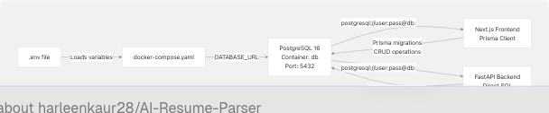
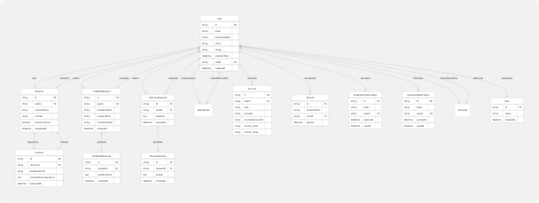
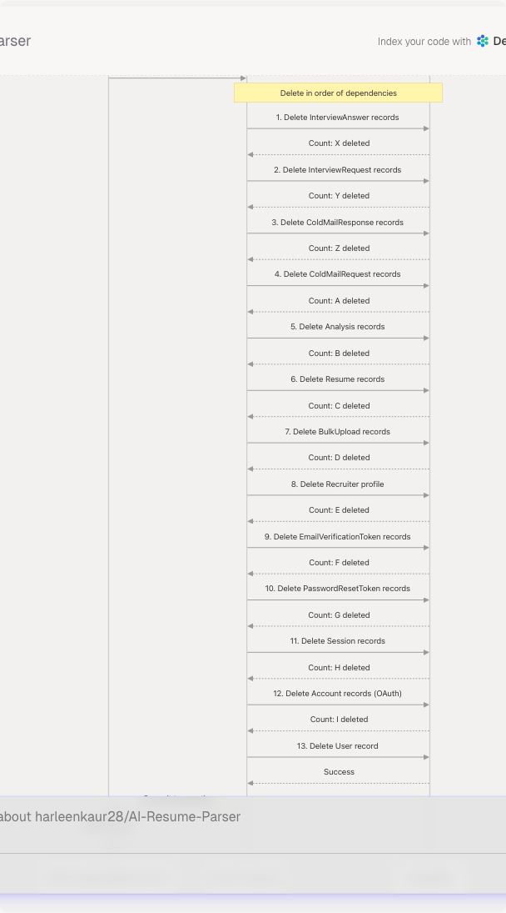
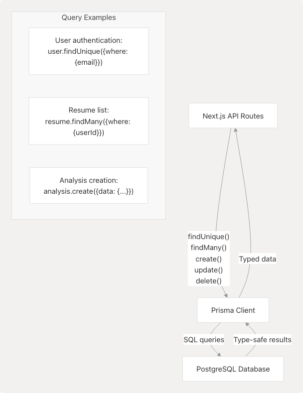

# Database & Data Models

## Purpose and Scope

This document describes the PostgreSQL database schema, Prisma ORM integration, and data models used throughout the TalentSync platform. It covers the database tables, their relationships, field definitions, and validation strategies employed on both the frontend (Prisma) and backend (Pydantic).

For information about how data flows through the system during specific operations, see [Data Flow Patterns](/harleenkaur28/AI-Resume-Parser/2.3-data-flow-patterns). For details about the Prisma ORM configuration and migrations, see [Prisma Schema](/harleenkaur28/AI-Resume-Parser/5.1-prisma-schema).

---

## Database Architecture

TalentSync uses **PostgreSQL 16** as its primary relational database, managed through **Prisma ORM** on the frontend and accessed via raw SQL queries from the backend when needed. The database is deployed as a Docker container and communicates with both the Next.js frontend and FastAPI backend through internal Docker networking.

### Database Connection Configuration

The database connection is established through environment variables defined in the Docker Compose configuration:


```

**Sources:** [docker-compose.yaml4-17](https://github.com/harleenkaur28/AI-Resume-Parser/blob/b2bbd83d/docker-compose.yaml#L4-L17) [docker-compose.yaml28](https://github.com/harleenkaur28/AI-Resume-Parser/blob/b2bbd83d/docker-compose.yaml#L28-L28) [docker-compose.yaml59](https://github.com/harleenkaur28/AI-Resume-Parser/blob/b2bbd83d/docker-compose.yaml#L59-L59)

The connection string follows this pattern:

```
postgresql://${POSTGRES_USER}:${POSTGRES_PASSWORD}@db:5432/${POSTGRES_DB}?schema=public
```

---

## Entity-Relationship Diagram

The database schema consists of 15+ interconnected tables organized around user authentication, resume management, and AI-generated content.



**Sources:** [frontend/app/api/auth/delete-account/route.ts42-134](https://github.com/harleenkaur28/AI-Resume-Parser/blob/b2bbd83d/frontend/app/api/auth/delete-account/route.ts#L42-L134) [frontend/prisma/migrations/20250613172024\_replace\_file\_url\_with\_raw\_text/migration.sql1-96](https://github.com/harleenkaur28/AI-Resume-Parser/blob/b2bbd83d/frontend/prisma/migrations/20250613172024_replace_file_url_with_raw_text/migration.sql#L1-L96)

---

## Core Data Models

### User Model

The `User` table is the central entity in the system, supporting both email/password and OAuth authentication through NextAuth.

| Field | Type | Constraints | Description |
| --- | --- | --- | --- |
| `id` | String | PRIMARY KEY | Unique user identifier (UUID) |
| `email` | String | UNIQUE, nullable | User's email address (nullable for OAuth) |
| `passwordHash` | String | nullable | Bcrypt hashed password (null for OAuth users) |
| `name` | String | nullable | User's display name |
| `image` | String | nullable | Profile picture URL |
| `emailVerified` | DateTime | nullable | Email verification timestamp |
| `roleId` | String | FOREIGN KEY, nullable | Reference to Role table |
| `createdAt` | DateTime | DEFAULT NOW() | Account creation timestamp |

**Authentication Methods:**

* **Email/Password:** `email` and `passwordHash` populated
* **Google OAuth:** `email`, `name`, `image` from Google, linked via `Account` table
* **GitHub OAuth:** `name`, `image` from GitHub, linked via `Account` table

**Sources:** [frontend/prisma/migrations/20250613172024\_replace\_file\_url\_with\_raw\_text/migration.sql16-21](https://github.com/harleenkaur28/AI-Resume-Parser/blob/b2bbd83d/frontend/prisma/migrations/20250613172024_replace_file_url_with_raw_text/migration.sql#L16-L21) [frontend/app/account/page.tsx59-63](https://github.com/harleenkaur28/AI-Resume-Parser/blob/b2bbd83d/frontend/app/account/page.tsx#L59-L63)

### Resume Model

The `Resume` table stores uploaded resume information with the actual text content instead of file URLs.

| Field | Type | Constraints | Description |
| --- | --- | --- | --- |
| `id` | String | PRIMARY KEY | Unique resume identifier |
| `userId` | String | FOREIGN KEY | Reference to User who uploaded |
| `customName` | String | NOT NULL | User-provided name for the resume |
| `rawText` | Text | NOT NULL | Extracted resume text content |
| `showInCentral` | Boolean | DEFAULT false | Display in central repository flag |
| `uploadedAt` | DateTime | DEFAULT NOW() | Upload timestamp |

**Migration History:** The schema was migrated from storing `fileUrl` to storing `rawText` directly in the database, eliminating the need for file system dependencies.

**Sources:** [frontend/prisma/migrations/20250613172024\_replace\_file\_url\_with\_raw\_text/migration.sql12-13](https://github.com/harleenkaur28/AI-Resume-Parser/blob/b2bbd83d/frontend/prisma/migrations/20250613172024_replace_file_url_with_raw_text/migration.sql#L12-L13) [frontend/components/upload-resume.tsx14](https://github.com/harleenkaur28/AI-Resume-Parser/blob/b2bbd83d/frontend/components/upload-resume.tsx#L14-L14) [frontend/components/upload-resume.tsx41](https://github.com/harleenkaur28/AI-Resume-Parser/blob/b2bbd83d/frontend/components/upload-resume.tsx#L41-L41)

### Analysis Model

The `Analysis` table stores the results of AI-powered resume analysis, including ML classification and LLM-generated comprehensive analysis.

| Field | Type | Constraints | Description |
| --- | --- | --- | --- |
| `id` | String | PRIMARY KEY | Unique analysis identifier |
| `resumeId` | String | FOREIGN KEY | Reference to analyzed Resume |
| `predictedField` | String | NOT NULL | ML-predicted job category (25 classes) |
| `comprehensiveAnalysis` | JSON | NOT NULL | Structured LLM analysis results |
| `analyzedAt` | DateTime | DEFAULT NOW() | Analysis timestamp |

**Comprehensive Analysis JSON Structure:**

```
{
  "skills": {
    "technical": ["Python", "React", "PostgreSQL"],
    "soft": ["Communication", "Leadership"]
  },
  "experience": [
    {
      "company": "Company Name",
      "role": "Job Title",
      "duration": "Jan 2020 - Present",
      "highlights": ["Achievement 1", "Achievement 2"]
    }
  ],
  "projects": [
    {
      "name": "Project Name",
      "description": "Brief description",
      "technologies": ["Tech1", "Tech2"]
    }
  ],
  "education": [
    {
      "degree": "Degree Name",
      "institution": "University",
      "year": "2019"
    }
  ]
}
```

**Sources:** Referenced from system architecture diagrams and backend processing logic

---

## Authentication & Session Models

### NextAuth Integration Tables

TalentSync uses NextAuth for authentication, which requires specific tables for OAuth and session management.

#### Account Table (OAuth)

| Field | Type | Description |
| --- | --- | --- |
| `id` | String | PRIMARY KEY |
| `userId` | String | FOREIGN KEY to User |
| `type` | String | OAuth type (e.g., "oauth") |
| `provider` | String | Provider name ("google" or "github") |
| `providerAccountId` | String | Provider's user ID |
| `access_token` | Text | OAuth access token |
| `refresh_token` | Text | OAuth refresh token |
| `expires_at` | Integer | Token expiration timestamp |
| `token_type` | String | Token type (e.g., "Bearer") |
| `scope` | String | OAuth scopes granted |
| `id_token` | Text | JWT ID token |

**Composite Unique Constraint:** `(provider, providerAccountId)`

**Sources:** [frontend/prisma/migrations/20250613172024\_replace\_file\_url\_with\_raw\_text/migration.sql36-51](https://github.com/harleenkaur28/AI-Resume-Parser/blob/b2bbd83d/frontend/prisma/migrations/20250613172024_replace_file_url_with_raw_text/migration.sql#L36-L51)

#### Session Table

| Field | Type | Description |
| --- | --- | --- |
| `id` | String | PRIMARY KEY |
| `sessionToken` | String | UNIQUE, session identifier |
| `userId` | String | FOREIGN KEY to User |
| `expires` | DateTime | Session expiration timestamp |

**Sources:** [frontend/prisma/migrations/20250613172024\_replace\_file\_url\_with\_raw\_text/migration.sql54-61](https://github.com/harleenkaur28/AI-Resume-Parser/blob/b2bbd83d/frontend/prisma/migrations/20250613172024_replace_file_url_with_raw_text/migration.sql#L54-L61)

### Token Management Tables

#### EmailVerificationToken

Stores tokens for email verification during registration.

| Field | Type | Description |
| --- | --- | --- |
| `id` | String | PRIMARY KEY |
| `token` | String | UNIQUE, verification token (UUID) |
| `userId` | String | FOREIGN KEY to User |
| `expiresAt` | DateTime | Token expiration (24 hours) |
| `usedAt` | DateTime | Timestamp when token was used |
| `createdAt` | DateTime | Token creation timestamp |

#### PasswordResetToken

Stores tokens for password reset requests.

| Field | Type | Description |
| --- | --- | --- |
| `id` | String | PRIMARY KEY |
| `token` | String | UNIQUE, reset token (UUID) |
| `userId` | String | FOREIGN KEY to User |
| `expiresAt` | DateTime | Token expiration (1 hour) |
| `usedAt` | DateTime | Timestamp when token was used |
| `createdAt` | DateTime | Token creation timestamp |

**Sources:** [frontend/prisma/migrations/20250613172024\_replace\_file\_url\_with\_raw\_text/migration.sql24-33](https://github.com/harleenkaur28/AI-Resume-Parser/blob/b2bbd83d/frontend/prisma/migrations/20250613172024_replace_file_url_with_raw_text/migration.sql#L24-L33) [frontend/app/account/page.tsx82-120](https://github.com/harleenkaur28/AI-Resume-Parser/blob/b2bbd83d/frontend/app/account/page.tsx#L82-L120)

---

## AI-Generated Content Models

### ColdMailRequest & ColdMailResponse

These tables store cold email generation requests and their AI-generated responses.

#### ColdMailRequest

| Field | Type | Description |
| --- | --- | --- |
| `id` | String | PRIMARY KEY |
| `userId` | String | FOREIGN KEY to User |
| `recipientName` | String | Target recipient name |
| `recipientRole` | String | Target recipient job title |
| `companyName` | String | Target company |
| `createdAt` | DateTime | Request timestamp |

#### ColdMailResponse

| Field | Type | Description |
| --- | --- | --- |
| `id` | String | PRIMARY KEY |
| `requestId` | String | FOREIGN KEY to ColdMailRequest |
| `emailContent` | Text | Generated email body |
| `createdAt` | DateTime | Generation timestamp |

**Sources:** [frontend/app/api/auth/delete-account/route.ts62-75](https://github.com/harleenkaur28/AI-Resume-Parser/blob/b2bbd83d/frontend/app/api/auth/delete-account/route.ts#L62-L75)

### InterviewRequest & InterviewAnswer

These tables store interview preparation questions and AI-generated answers.

#### InterviewRequest

| Field | Type | Description |
| --- | --- | --- |
| `id` | String | PRIMARY KEY |
| `userId` | String | FOREIGN KEY to User |
| `question` | Text | Interview question |
| `createdAt` | DateTime | Request timestamp |

#### InterviewAnswer

| Field | Type | Description |
| --- | --- | --- |
| `id` | String | PRIMARY KEY |
| `requestId` | String | FOREIGN KEY to InterviewRequest |
| `answer` | Text | AI-generated answer |
| `createdAt` | DateTime | Generation timestamp |

**Sources:** [frontend/app/api/auth/delete-account/route.ts46-59](https://github.com/harleenkaur28/AI-Resume-Parser/blob/b2bbd83d/frontend/app/api/auth/delete-account/route.ts#L46-L59)

---

## Database Operations & Transactions

### Cascade Deletion Strategy

When a user account is deleted, all associated data is removed in a specific order to respect foreign key constraints. This is implemented as a Prisma transaction in the delete account endpoint.



**Deletion Order:**

1. **InterviewAnswer** (child of InterviewRequest)
2. **InterviewRequest** (references User)
3. **ColdMailResponse** (child of ColdMailRequest)
4. **ColdMailRequest** (references User)
5. **Analysis** (child of Resume)
6. **Resume** (references User)
7. **BulkUpload** (references User as adminId)
8. **Recruiter** (references User as adminId)
9. **EmailVerificationToken** (references User)
10. **PasswordResetToken** (references User)
11. **Session** (references User)
12. **Account** (references User)
13. **User** (final deletion)

**Sources:** [frontend/app/api/auth/delete-account/route.ts42-134](https://github.com/harleenkaur28/AI-Resume-Parser/blob/b2bbd83d/frontend/app/api/auth/delete-account/route.ts#L42-L134) [frontend/app/account/page.tsx123-157](https://github.com/harleenkaur28/AI-Resume-Parser/blob/b2bbd83d/frontend/app/account/page.tsx#L123-L157)

---

## Data Validation & Type Safety

### Frontend: Prisma Client

The frontend uses Prisma Client for type-safe database operations. Prisma automatically generates TypeScript types from the schema, ensuring compile-time type checking.

**Example Prisma Operations:**

```
// User lookup with related data
const user = await prisma.user.findUnique({
  where: { id: userId },
  include: {
    _count: {
      select: {
        resumes: true,
        coldMailRequests: true,
        interviewRequests: true
      }
    }
  }
});

// Resume creation
const resume = await prisma.resume.create({
  data: {
    userId: session.user.id,
    customName: "My Resume",
    rawText: extractedText,
    showInCentral: false
  }
});

// Analysis with resume relation
const analysis = await prisma.analysis.create({
  data: {
    resumeId: resume.id,
    predictedField: "Java Developer",
    comprehensiveAnalysis: analysisJson
  }
});
```

**Sources:** [frontend/app/api/auth/delete-account/route.ts20-33](https://github.com/harleenkaur28/AI-Resume-Parser/blob/b2bbd83d/frontend/app/api/auth/delete-account/route.ts#L20-L33) [frontend/components/upload-resume.tsx27-74](https://github.com/harleenkaur28/AI-Resume-Parser/blob/b2bbd83d/frontend/components/upload-resume.tsx#L27-L74)

### Backend: Pydantic Models

The FastAPI backend uses Pydantic models for request/response validation and data serialization. While the backend primarily receives data via API calls rather than direct database access, it validates all incoming data structures.

**Request Validation Models:**

* `ResumeUploadRequest`: Validates resume file uploads
* `ColdMailGenerationRequest`: Validates email generation parameters
* `InterviewQuestionRequest`: Validates interview preparation inputs
* `ComprehensiveAnalysisData`: Validates LLM analysis output structure

**Response Models:**

* `ComprehensiveAnalysisResponse`: Structured resume analysis results
* `ATSEvaluationResponse`: ATS score and suggestions
* `ColdMailResponse`: Generated email content

These models ensure data consistency between frontend and backend services.

**Sources:** Referenced from backend architecture and service descriptions in system diagrams

---

## Database Initialization & Seeding

### Migration Management

Database schema changes are managed through Prisma migrations. The frontend container automatically runs migrations on startup:

```
bunx prisma migrate deploy && bun prisma/seed.ts && bun run start
```

**Migration Process:**

1. `prisma migrate deploy` applies pending migrations to the database
2. `bun prisma/seed.ts` runs the seed script to populate initial data
3. `bun run start` starts the Next.js application

**Sources:** [docker-compose.yaml63](https://github.com/harleenkaur28/AI-Resume-Parser/blob/b2bbd83d/docker-compose.yaml#L63-L63)

### Seed Data

The seed script (`prisma/seed.ts`) initializes:

* **Roles:** "User" and "Admin" roles for RBAC
* **Default Categories:** 25 job categories for resume classification

This ensures the database has required reference data before the application starts.

---

## Data Access Patterns

### Frontend → Database

```


**Key Patterns:**

* **Session Management:** NextAuth automatically handles Session and Account table operations
* **Resume Upload:** Creates Resume record, then Analysis record in sequence
* **Data Retrieval:** Uses Prisma's relation loading for efficient queries

**Sources:** [frontend/app/api/auth/delete-account/route.ts20-40](https://github.com/harleenkaur28/AI-Resume-Parser/blob/b2bbd83d/frontend/app/api/auth/delete-account/route.ts#L20-L40)

### Backend → Database

The FastAPI backend primarily receives processed data from the frontend API and doesn't directly access the database for most operations. However, it can connect to PostgreSQL using the `DATABASE_URL` environment variable when needed for batch operations or analytics.

**Sources:** [docker-compose.yaml28](https://github.com/harleenkaur28/AI-Resume-Parser/blob/b2bbd83d/docker-compose.yaml#L28-L28)

---

## Storage Considerations

### Text vs File Storage

**Current Approach:** Resume text content is stored directly in the `rawText` field of the Resume table.

**Advantages:**

* Eliminates file system dependencies
* Simplifies backup and replication
* Enables full-text search capabilities
* Reduces complexity in containerized deployments

**File Uploads Directory:** The backend maintains an `uploads` directory for temporary file processing, mounted as a Docker volume:

```
volumes:
  - ./backend/uploads:/app/uploads
```

**Sources:** [frontend/prisma/migrations/20250613172024\_replace\_file\_url\_with\_raw\_text/migration.sql12-13](https://github.com/harleenkaur28/AI-Resume-Parser/blob/b2bbd83d/frontend/prisma/migrations/20250613172024_replace_file_url_with_raw_text/migration.sql#L12-L13) [docker-compose.yaml34](https://github.com/harleenkaur28/AI-Resume-Parser/blob/b2bbd83d/docker-compose.yaml#L34-L34)

### JSON Data Storage

Complex structured data (like comprehensive analysis results) is stored as JSON in PostgreSQL, leveraging native JSON support for:

* Flexible schema evolution
* Efficient querying with JSON operators
* Reduced table complexity

---

## Performance & Indexing

### Indexed Fields

The following fields have indexes for query optimization:

**User Table:**

* `email` (UNIQUE index)
* `id` (PRIMARY KEY index)

**Session Table:**

* `sessionToken` (UNIQUE index)

**Account Table:**

* `(provider, providerAccountId)` (COMPOSITE UNIQUE index)

**Token Tables:**

* `token` (UNIQUE index) on EmailVerificationToken and PasswordResetToken

### Query Optimization

Prisma automatically generates optimized queries using:

* **Relation preloading:** `include` and `select` for efficient joins
* **Batch operations:** `createMany`, `updateMany`, `deleteMany`
* **Transactions:** `prisma.$transaction()` for atomic operations

**Sources:** [frontend/prisma/migrations/20250613172024\_replace\_file\_url\_with\_raw\_text/migration.sql70-83](https://github.com/harleenkaur28/AI-Resume-Parser/blob/b2bbd83d/frontend/prisma/migrations/20250613172024_replace_file_url_with_raw_text/migration.sql#L70-L83)

---

## Data Migration Example

The migration from file-based storage to text-based storage demonstrates the schema evolution process:

```
-- Remove file URL column
ALTER TABLE "Resume" DROP COLUMN "fileUrl";

-- Add raw text column
ALTER TABLE "Resume" ADD COLUMN "rawText" TEXT NOT NULL;

-- Make email and password optional for OAuth users
ALTER TABLE "User" ALTER COLUMN "email" DROP NOT NULL;
ALTER TABLE "User" ALTER COLUMN "passwordHash" DROP NOT NULL;

-- Add OAuth support fields
ALTER TABLE "User" ADD COLUMN "emailVerified" TIMESTAMP(3);
ALTER TABLE "User" ADD COLUMN "image" TEXT;
ALTER TABLE "User" ADD COLUMN "name" TEXT;
```

This migration enabled:

1. OAuth authentication support
2. Simplified resume storage
3. Improved data portability

**Sources:** [frontend/prisma/migrations/20250613172024\_replace\_file\_url\_with\_raw\_text/migration.sql1-21](https://github.com/harleenkaur28/AI-Resume-Parser/blob/b2bbd83d/frontend/prisma/migrations/20250613172024_replace_file_url_with_raw_text/migration.sql#L1-L21)
