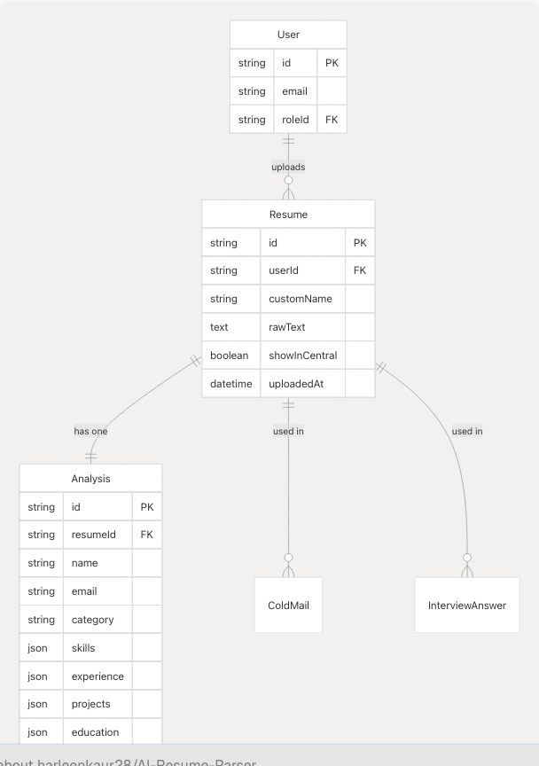

# Prisma Schema

## Purpose and Scope

This document provides a comprehensive reference for the Prisma schema used in TalentSync. The schema defines all database models, relationships, and constraints for the PostgreSQL database. It covers authentication models (User, Account, Session, VerificationToken), resume-related models (Resume, Analysis), and feature-specific models (ColdMail, InterviewAnswer).

For information about Pydantic data validation models used in the backend API, see [Data Models & Validation](5.2-data-models-and-validation). For deployment and database configuration, see [Environment Configuration](6.5-environment-configuration).

---

## Schema Overview

The Prisma schema is organized into three main categories: **Authentication & User Management**, **Resume Intelligence**, and **Feature Data Storage**. The schema uses PostgreSQL as the database provider and is located at [frontend/prisma/schema.prisma](https://github.com/harleenkaur28/AI-Resume-Parser/blob/b2bbd83d/frontend/prisma/schema.prisma)


**Sources:** [frontend/prisma/migrations/20250613172024\_replace\_file\_url\_with\_raw\_text/migration.sql](https://github.com/harleenkaur28/AI-Resume-Parser/blob/b2bbd83d/frontend/prisma/migrations/20250613172024_replace_file_url_with_raw_text/migration.sql)

---

## Core Authentication Models

### User Model

The `User` model serves as the central authentication entity, supporting both traditional email/password authentication and OAuth providers (Google, GitHub).

| Field | Type | Nullable | Description |
| --- | --- | --- | --- |
| `id` | String | No | Primary key (CUID) |
| `email` | String | Yes | User email (nullable for OAuth-only users) |
| `passwordHash` | String | Yes | Bcrypt password hash (null for OAuth users) |
| `emailVerified` | DateTime | Yes | Email verification timestamp |
| `name` | String | Yes | Display name (from OAuth or registration) |
| `image` | String | Yes | Profile image URL (from OAuth or upload) |
| `roleId` | String | Yes | Foreign key to Role table |
| `createdAt` | DateTime | No | Account creation timestamp |

**Key Characteristics:**

* Email and passwordHash are nullable to support OAuth-only users
* EmailVerified gates access to protected features (enforced in [frontend/middleware.ts](https://github.com/harleenkaur28/AI-Resume-Parser/blob/b2bbd83d/frontend/middleware.ts))
* Cascading deletes remove all related data (resumes, analyses, sessions, etc.)

**Sources:** [frontend/prisma/migrations/20250613172024\_replace\_file\_url\_with\_raw\_text/migration.sql16-21](https://github.com/harleenkaur28/AI-Resume-Parser/blob/b2bbd83d/frontend/prisma/migrations/20250613172024_replace_file_url_with_raw_text/migration.sql#L16-L21)

### Role Model

The `Role` model defines user types with two primary roles: **Seeker** (job seekers) and **Recruiter** (hiring managers).

| Field | Type | Description |
| --- | --- | --- |
| `id` | String | Primary key (CUID) |
| `name` | String | Role name ("Seeker" or "Recruiter") |
| `description` | String? | Role description |

**Role Assignment Flow:**

1. User registers/logs in without role
2. Middleware redirects to `/select-role` page
3. User selects role via API call to `/api/auth/update-role`
4. Session updated with role information
5. User redirected to appropriate dashboard

**Sources:** [frontend/prisma/migrations/20250613172024\_replace\_file\_url\_with\_raw\_text/migration.sql9](https://github.com/harleenkaur28/AI-Resume-Parser/blob/b2bbd83d/frontend/prisma/migrations/20250613172024_replace_file_url_with_raw_text/migration.sql#L9-L9) [frontend/prisma/migrations/20250613172024\_replace\_file\_url\_with\_raw\_text/migration.sql86](https://github.com/harleenkaur28/AI-Resume-Parser/blob/b2bbd83d/frontend/prisma/migrations/20250613172024_replace_file_url_with_raw_text/migration.sql#L86-L86)

### Account Model (OAuth)

The `Account` model stores OAuth provider credentials for Google and GitHub authentication via NextAuth.


| Field | Type | Description |
| --- | --- | --- |
| `provider` | String | OAuth provider ("google", "github") |
| `providerAccountId` | String | Unique identifier from provider |
| `access_token` | String? | OAuth access token |
| `refresh_token` | String? | OAuth refresh token |
| `expires_at` | Integer? | Token expiration timestamp |

**Unique Constraint:** `(provider, providerAccountId)` ensures one account per provider per user.

**Sources:** [frontend/prisma/migrations/20250613172024\_replace\_file\_url\_with\_raw\_text/migration.sql36-51](https://github.com/harleenkaur28/AI-Resume-Parser/blob/b2bbd83d/frontend/prisma/migrations/20250613172024_replace_file_url_with_raw_text/migration.sql#L36-L51) [frontend/prisma/migrations/20250613172024\_replace\_file\_url\_with\_raw\_text/migration.sql74](https://github.com/harleenkaur28/AI-Resume-Parser/blob/b2bbd83d/frontend/prisma/migrations/20250613172024_replace_file_url_with_raw_text/migration.sql#L74-L74)

### Session Model

The `Session` model manages NextAuth session tokens for authenticated users.

| Field | Type | Description |
| --- | --- | --- |
| `id` | String | Primary key (CUID) |
| `sessionToken` | String | Unique session identifier |
| `userId` | String | Foreign key to User |
| `expires` | DateTime | Session expiration timestamp |

**Session Lifecycle:**

* Created on successful login
* Validated on each authenticated request via [frontend/middleware.ts](https://github.com/harleenkaur28/AI-Resume-Parser/blob/b2bbd83d/frontend/middleware.ts)
* Automatically deleted on logout or expiration
* Cascading delete when user account is deleted

**Sources:** [frontend/prisma/migrations/20250613172024\_replace\_file\_url\_with\_raw\_text/migration.sql54-61](https://github.com/harleenkaur28/AI-Resume-Parser/blob/b2bbd83d/frontend/prisma/migrations/20250613172024_replace_file_url_with_raw_text/migration.sql#L54-L61) [frontend/prisma/migrations/20250613172024\_replace\_file\_url\_with\_raw\_text/migration.sql77](https://github.com/harleenkaur28/AI-Resume-Parser/blob/b2bbd83d/frontend/prisma/migrations/20250613172024_replace_file_url_with_raw_text/migration.sql#L77-L77)

### VerificationToken Model

The `VerificationToken` model handles email verification for new user registrations.

| Field | Type | Description |
| --- | --- | --- |
| `identifier` | String | User email or identifier |
| `token` | String | Verification token (UUID) |
| `expires` | DateTime | Token expiration (24 hours) |

**Unique Constraint:** `(identifier, token)` composite key ensures token uniqueness.

**Verification Flow:**

1. User registers with email/password
2. Token generated and emailed via Nodemailer
3. User clicks link: `/api/auth/verify-email?token={token}`
4. Token validated and `User.emailVerified` set
5. Token deleted after successful verification

**Sources:** [frontend/prisma/migrations/20250613172024\_replace\_file\_url\_with\_raw\_text/migration.sql64-68](https://github.com/harleenkaur28/AI-Resume-Parser/blob/b2bbd83d/frontend/prisma/migrations/20250613172024_replace_file_url_with_raw_text/migration.sql#L64-L68) [frontend/prisma/migrations/20250613172024\_replace\_file\_url\_with\_raw\_text/migration.sql80-83](https://github.com/harleenkaur28/AI-Resume-Parser/blob/b2bbd83d/frontend/prisma/migrations/20250613172024_replace_file_url_with_raw_text/migration.sql#L80-L83)

### PasswordResetToken Model

The `PasswordResetToken` model manages password reset requests for email/password users.

| Field | Type | Description |
| --- | --- | --- |
| `id` | String | Primary key (CUID) |
| `token` | String | Reset token (UUID) |
| `expiresAt` | DateTime | Token expiration (1 hour) |
| `userId` | String | Foreign key to User |
| `createdAt` | DateTime | Token creation timestamp |
| `usedAt` | DateTime? | Token usage timestamp |

**Reset Flow:**

1. User requests reset at `/auth/forgot-password`
2. Token generated via `/api/auth/forgot-password`
3. Email sent with reset link: `/auth/reset-password?token={token}`
4. Token validated, password updated
5. `usedAt` timestamp set to prevent reuse

**Sources:** [frontend/prisma/migrations/20250613172024\_replace\_file\_url\_with\_raw\_text/migration.sql24-33](https://github.com/harleenkaur28/AI-Resume-Parser/blob/b2bbd83d/frontend/prisma/migrations/20250613172024_replace_file_url_with_raw_text/migration.sql#L24-L33) [frontend/prisma/migrations/20250613172024\_replace\_file\_url\_with\_raw\_text/migration.sql71](https://github.com/harleenkaur28/AI-Resume-Parser/blob/b2bbd83d/frontend/prisma/migrations/20250613172024_replace_file_url_with_raw_text/migration.sql#L71-L71)

---

## Resume Intelligence Models

### Resume Model

The `Resume` model stores uploaded resume files as extracted raw text, replacing the previous file URL approach for improved performance and security.



| Field | Type | Description |
| --- | --- | --- |
| `id` | String | Primary key (CUID) |
| `userId` | String | Foreign key to User |
| `customName` | String | User-provided resume name |
| `rawText` | Text | Extracted text from PDF/DOCX/TXT |
| `showInCentral` | Boolean | Visibility in central repository |
| `uploadedAt` | DateTime | Upload timestamp |

**Text Extraction Process:**

1. File uploaded via [frontend/components/upload-resume.tsx38-46](https://github.com/harleenkaur28/AI-Resume-Parser/blob/b2bbd83d/frontend/components/upload-resume.tsx#L38-L46)
2. Backend extracts text using PyPDF2, python-docx, or direct read
3. Text stored in `rawText` field (migration from `fileUrl`)
4. Original file not persisted (privacy consideration)

**Design Decision:** The migration from `fileUrl` to `rawText` eliminates file storage requirements and enables faster text processing for subsequent AI operations.

**Sources:** [frontend/prisma/migrations/20250613172024\_replace\_file\_url\_with\_raw\_text/migration.sql12-13](https://github.com/harleenkaur28/AI-Resume-Parser/blob/b2bbd83d/frontend/prisma/migrations/20250613172024_replace_file_url_with_raw_text/migration.sql#L12-L13) [frontend/components/upload-resume.tsx38-46](https://github.com/harleenkaur28/AI-Resume-Parser/blob/b2bbd83d/frontend/components/upload-resume.tsx#L38-L46)

### Analysis Model

The `Analysis` model stores structured resume analysis results generated by the Resume Parser service, including ML classification and LLM-extracted fields.

| Field | Type | Description |
| --- | --- | --- |
| `id` | String | Primary key (CUID) |
| `resumeId` | String | Foreign key to Resume (1:1) |
| `name` | String? | Extracted candidate name |
| `email` | String? | Extracted contact email |
| `category` | String | ML-predicted job category (25 options) |
| `skills` | Json | Structured skills object |
| `experience` | Json | Work experience array |
| `projects` | Json | Projects array |
| `education` | Json | Education array |
| `createdAt` | DateTime | Analysis timestamp |

**Skills JSON Structure:**

```
{
  technical: string[],
  soft: string[],
  languages: string[],
  tools: string[]
}
```

**Experience JSON Structure:**

```
[{
  company: string,
  title: string,
  duration: string,
  description: string
}]
```

**Analysis Pipeline:**

1. Text extracted from resume
2. NLP cleaning (Spacy, NLTK) removes noise
3. TF-IDF vectorization + scikit-learn classifier predicts category
4. Regex patterns extract basic fields (name, email, skills)
5. Gemini 2.0 Flash generates comprehensive structured JSON
6. Analysis record created with foreign key to Resume

**Sources:** [frontend/prisma/migrations/20250613172024\_replace\_file\_url\_with\_raw\_text/migration.sql](https://github.com/harleenkaur28/AI-Resume-Parser/blob/b2bbd83d/frontend/prisma/migrations/20250613172024_replace_file_url_with_raw_text/migration.sql)

---

## Feature Data Models

### ColdMail Model

The `ColdMail` model stores generated cold emails for job applications, including recipient details and email content.

| Field | Type | Description |
| --- | --- | --- |
| `id` | String | Primary key (CUID) |
| `userId` | String | Foreign key to User |
| `resumeId` | String | Foreign key to Resume |
| `recipientName` | String | Hiring manager name |
| `recipientCompany` | String | Company name |
| `emailContent` | Text | Generated email body |
| `createdAt` | DateTime | Generation timestamp |

**Generation Flow:**

1. User selects resume at `/dashboard/cold-mail`
2. Provides recipient details (name, company, job description)
3. Backend generates email using Gemini + company research
4. Record saved for history and editing
5. User can regenerate or edit content

**Sources:** Architecture diagrams

### InterviewAnswer Model

The `InterviewAnswer` model stores AI-generated interview question responses from the Hiring Assistant feature.

| Field | Type | Description |
| --- | --- | --- |
| `id` | String | Primary key (CUID) |
| `userId` | String | Foreign key to User |
| `resumeId` | String | Foreign key to Resume |
| `question` | Text | Interview question |
| `answer` | Text | Generated answer |
| `roleName` | String? | Target role name |
| `companyName` | String? | Target company |
| `createdAt` | DateTime | Generation timestamp |

**Answer Generation:**

1. User enters question at `/dashboard/hiring-assistant`
2. Optionally provides role and company context
3. Backend uses resume data + Gemini to craft answer
4. Record saved for interview preparation reference

**Sources:** Architecture diagrams

---

## Database Relationships and Constraints

### Foreign Key Cascade Behavior

The schema implements cascading deletes to ensure data consistency when users or resumes are removed:


**Cascade Rules:**

* **User deletion:** All accounts, sessions, resumes, analyses, cold mails, and interview answers are automatically deleted
* **Resume deletion:** Associated analysis, cold mails, and interview answers are deleted
* **Role deletion:** User.roleId set to NULL (allows role cleanup without user deletion)
* **PasswordResetToken:** `ON DELETE RESTRICT` prevents user deletion with active reset tokens

**Sources:** [frontend/prisma/migrations/20250613172024\_replace\_file\_url\_with\_raw\_text/migration.sql86-95](https://github.com/harleenkaur28/AI-Resume-Parser/blob/b2bbd83d/frontend/prisma/migrations/20250613172024_replace_file_url_with_raw_text/migration.sql#L86-L95)

### Unique Constraints

| Model | Constraint | Purpose |
| --- | --- | --- |
| Account | `(provider, providerAccountId)` | One account per provider per user |
| Session | `sessionToken` | Unique session identification |
| VerificationToken | `token` | Unique verification tokens |
| VerificationToken | `(identifier, token)` | Composite key for token-email pair |
| PasswordResetToken | `token` | Unique reset tokens |

**Sources:** [frontend/prisma/migrations/20250613172024\_replace\_file\_url\_with\_raw\_text/migration.sql71-83](https://github.com/harleenkaur28/AI-Resume-Parser/blob/b2bbd83d/frontend/prisma/migrations/20250613172024_replace_file_url_with_raw_text/migration.sql#L71-L83)

---

## Data Types and Storage

### Text vs String Fields

The schema uses PostgreSQL `TEXT` type for large content fields:

| Model | Field | Type | Reason |
| --- | --- | --- | --- |
| Resume | `rawText` | TEXT | Full resume content (unlimited size) |
| ColdMail | `emailContent` | TEXT | Long email bodies |
| InterviewAnswer | `question` | TEXT | Multi-paragraph questions |
| InterviewAnswer | `answer` | TEXT | Detailed answers |

String fields are used for identifiers, names, and short text:

* User.email, User.name, User.image
* Resume.customName
* Analysis.name, Analysis.email, Analysis.category

**Sources:** [frontend/prisma/migrations/20250613172024\_replace\_file\_url\_with\_raw\_text/migration.sql12-13](https://github.com/harleenkaur28/AI-Resume-Parser/blob/b2bbd83d/frontend/prisma/migrations/20250613172024_replace_file_url_with_raw_text/migration.sql#L12-L13)

### JSON Fields for Structured Data

The `Analysis` model uses PostgreSQL JSON type for flexible structured data storage:

```
// skills: Json
{
  "technical": ["Python", "JavaScript", "React"],
  "soft": ["Leadership", "Communication"],
  "languages": ["English", "Spanish"],
  "tools": ["Git", "Docker", "AWS"]
}

// experience: Json
[
  {
    "company": "Tech Corp",
    "title": "Senior Developer",
    "duration": "2020-2023",
    "description": "Led team of 5 developers..."
  }
]

// projects: Json
[
  {
    "name": "E-commerce Platform",
    "description": "Built scalable microservices...",
    "technologies": ["Node.js", "MongoDB"]
  }
]

// education: Json
[
  {
    "degree": "BS Computer Science",
    "institution": "MIT",
    "year": "2019"
  }
]
```

**Advantages:**

* Flexible schema for varying resume structures
* Query support via PostgreSQL JSON operators
* No need for separate junction tables
* Direct mapping to frontend TypeScript types

**Sources:** Architecture diagrams

---

## Migration History

### Key Schema Evolution

**Migration: Replace fileUrl with rawText** (2025-06-13)

This migration represents a significant architectural change in how resumes are stored:

**Changes:**

1. **Resume table:** Dropped `fileUrl` column, added `rawText` TEXT column
2. **User table:** Added OAuth support fields (`emailVerified`, `image`, `name`)
3. **User table:** Made `email`, `passwordHash`, `roleId` nullable for OAuth users
4. **New tables:** Account, Session, VerificationToken for NextAuth integration
5. **New table:** PasswordResetToken for password reset functionality
6. **Foreign keys:** Updated User → Role relationship to `ON DELETE SET NULL`

**Rationale:**

* Eliminates file storage infrastructure requirements
* Improves text extraction performance (no file I/O)
* Enhances privacy (no persistent file storage)
* Simplifies deployment (no mounted volumes for uploads)
* Enables faster AI processing (direct text access)

**Sources:** [frontend/prisma/migrations/20250613172024\_replace\_file\_url\_with\_raw\_text/migration.sql1-96](https://github.com/harleenkaur28/AI-Resume-Parser/blob/b2bbd83d/frontend/prisma/migrations/20250613172024_replace_file_url_with_raw_text/migration.sql#L1-L96)

---

## Prisma Client Generation

The Prisma Client is generated during the build process and provides type-safe database access throughout the application.

**Generation Commands:**

```
# Generate Prisma Client
npx prisma generate

# Apply migrations
npx prisma migrate deploy

# Seed database
npx prisma db seed
```

**Client Usage in Frontend:**

```
// Import generated client
import { prisma } from '@/lib/prisma'

// Type-safe queries
const user = await prisma.user.findUnique({
  where: { id: userId },
  include: {
    resumes: {
      include: { analysis: true }
    }
  }
})
```

**Build Process Integration:**

* Frontend Dockerfile runs `prisma generate` during build
* NextAuth callbacks use Prisma Client for session/user lookups
* API routes use Prisma for all database operations

**Sources:** Architecture diagrams, [frontend/components/upload-resume.tsx43-46](https://github.com/harleenkaur28/AI-Resume-Parser/blob/b2bbd83d/frontend/components/upload-resume.tsx#L43-L46)
