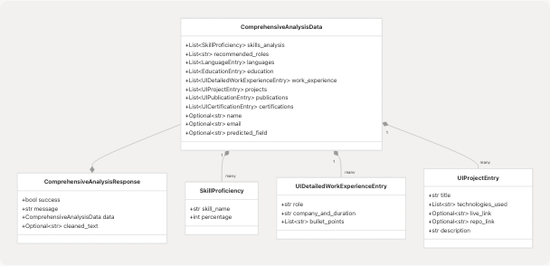
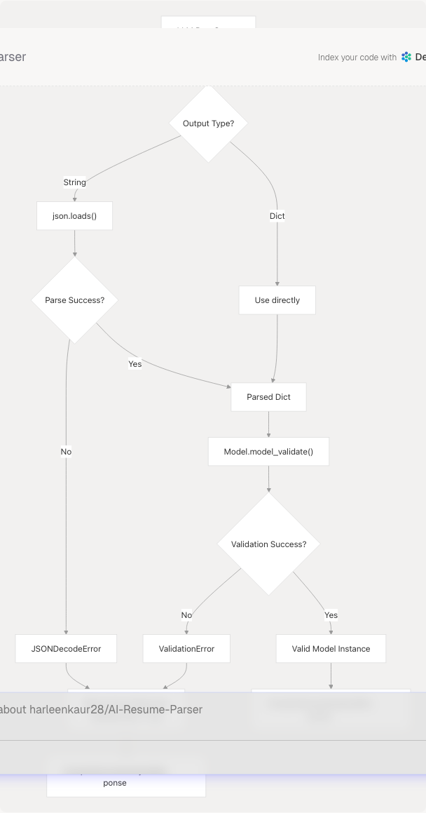
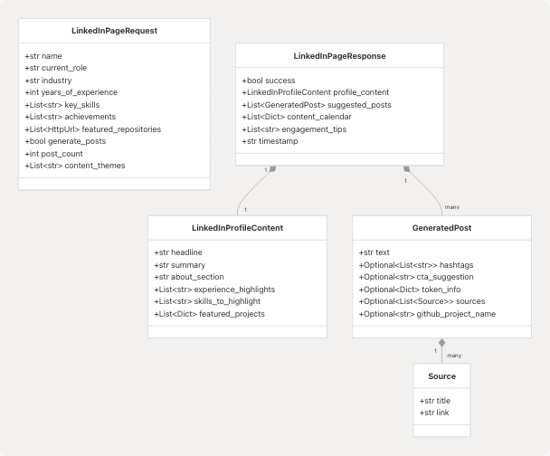

# Data Models & Validation

> Source: https://deepwiki.com/harleenkaur28/AI-Resume-Parser/5.2-data-models-and-validation

# Data Models & Validation

Relevant source files

* [backend/app/agents/\_\_init\_\_.py](https://github.com/harleenkaur28/AI-Resume-Parser/blob/b2bbd83d/backend/app/agents/__init__.py)
* [backend/app/agents/github\_agent.py](https://github.com/harleenkaur28/AI-Resume-Parser/blob/b2bbd83d/backend/app/agents/github_agent.py)
* [backend/app/models/schemas.py](https://github.com/harleenkaur28/AI-Resume-Parser/blob/b2bbd83d/backend/app/models/schemas.py)
* [backend/app/services/ats.py](https://github.com/harleenkaur28/AI-Resume-Parser/blob/b2bbd83d/backend/app/services/ats.py)
* [backend/app/services/linkedin\_profile.py](https://github.com/harleenkaur28/AI-Resume-Parser/blob/b2bbd83d/backend/app/services/linkedin_profile.py)
* [backend/app/services/tailored\_resume.py](https://github.com/harleenkaur28/AI-Resume-Parser/blob/b2bbd83d/backend/app/services/tailored_resume.py)
* [backend/pyproject.toml](https://github.com/harleenkaur28/AI-Resume-Parser/blob/b2bbd83d/backend/pyproject.toml)
* [backend/requirements.txt](https://github.com/harleenkaur28/AI-Resume-Parser/blob/b2bbd83d/backend/requirements.txt)
* [backend/server.py](https://github.com/harleenkaur28/AI-Resume-Parser/blob/b2bbd83d/backend/server.py)
* [backend/uv.lock](https://github.com/harleenkaur28/AI-Resume-Parser/blob/b2bbd83d/backend/uv.lock)

This document describes the Pydantic-based data models used throughout the TalentSync backend for request validation, response structuring, and internal data transfer. These models provide type safety, automatic validation, and JSON serialization across all API endpoints and service layers.

For database schema and Prisma models, see [Prisma Schema](/harleenkaur28/AI-Resume-Parser/5.1-prisma-schema). For API endpoint documentation, see [API Documentation](/harleenkaur28/AI-Resume-Parser/7.2-api-documentation).

---

## Overview

TalentSync uses Pydantic v2 as its validation framework, providing comprehensive data validation at API boundaries and between service layers. The system defines over 40 distinct models organized into functional categories, each serving specific validation and serialization requirements.

**Key Validation Points:**

* API request body validation
* LLM output parsing and structuring
* Inter-service data transfer
* Database query results normalization
* Response payload construction

Sources: [backend/app/models/schemas.py1-499](https://github.com/harleenkaur28/AI-Resume-Parser/blob/b2bbd83d/backend/app/models/schemas.py#L1-L499) [backend/pyproject.toml17](https://github.com/harleenkaur28/AI-Resume-Parser/blob/b2bbd83d/backend/pyproject.toml#L17-L17)

---

## Validation Framework Architecture


```

Sources: [backend/app/models/schemas.py1-499](https://github.com/harleenkaur28/AI-Resume-Parser/blob/b2bbd83d/backend/app/models/schemas.py#L1-L499) [backend/app/services/ats.py76-97](https://github.com/harleenkaur28/AI-Resume-Parser/blob/b2bbd83d/backend/app/services/ats.py#L76-L97) [backend/app/services/tailored\_resume.py80-85](https://github.com/harleenkaur28/AI-Resume-Parser/blob/b2bbd83d/backend/app/services/tailored_resume.py#L80-L85)

---

## Model Categories

### Resume Analysis Models

These models structure comprehensive resume parsing results from both traditional NLP and LLM-based analysis:

| Model | Purpose | Key Fields | Usage |
| --- | --- | --- | --- |
| `ComprehensiveAnalysisData` | Complete resume analysis structure | `skills_analysis`, `work_experience`, `projects`, `education` | LLM output parsing, frontend display |
| `ComprehensiveAnalysisResponse` | API response wrapper | `success`, `message`, `data`, `cleaned_text` | `/analyze_resume` endpoint |
| `ResumeAnalysis` | Basic resume metadata | `name`, `email`, `predicted_field`, `skills` | Legacy API compatibility |
| `SkillProficiency` | Skill with proficiency score | `skill_name`, `percentage` | Skill visualization |
| `UIDetailedWorkExperienceEntry` | Work experience with bullets | `role`, `company_and_duration`, `bullet_points` | Frontend rendering |
| `UIProjectEntry` | Project details | `title`, `technologies_used`, `description`, `repo_link` | Project showcase |

```

```

**Field Validation Examples:**

* `skills_analysis`: Default empty list via `Field(default_factory=list)`
* `percentage`: Integer (0-100) enforced by LLM prompt, not Pydantic constraint
* `bullet_points`: List of strings with no explicit length limit
* `repo_link`: Optional string (not HttpUrl validated)

Sources: [backend/app/models/schemas.py55-141](https://github.com/harleenkaur28/AI-Resume-Parser/blob/b2bbd83d/backend/app/models/schemas.py#L55-L141)

---

### Service Request/Response Models

Each major service defines paired request/response models for API contract enforcement:

#### ATS Evaluation

```
```
# backend/app/models/schemas.py:475-498
class JDEvaluatorRequest(BaseModel):
    company_name: Optional[str] = None
    company_website_content: Optional[str] = None
    jd: Optional[str] = Field(..., min_length=1)
    jd_link: Optional[str] = None
    resume: str = Field(..., min_length=1)

class JDEvaluatorResponse(BaseModel):
    success: bool = True
    message: str = "JD evaluation completed"
    score: int
    reasons_for_the_score: List[str] = Field(default_factory=list)
    suggestions: List[str] = Field(default_factory=list)
```
```

**Key Validation:**

* `jd` requires minimum 1 character when provided
* `resume` is required with minimum 1 character
* `score` is integer (range enforcement happens in service layer)
* Lists default to empty via `default_factory=list`

Sources: [backend/app/models/schemas.py475-498](https://github.com/harleenkaur28/AI-Resume-Parser/blob/b2bbd83d/backend/app/models/schemas.py#L475-L498) [backend/app/services/ats.py77-84](https://github.com/harleenkaur28/AI-Resume-Parser/blob/b2bbd83d/backend/app/services/ats.py#L77-L84)

#### Cold Mail Generation

```
```
# backend/app/models/schemas.py:241-286
class ColdMailRequest(BaseModel):
    recipient_name: str = Field(..., min_length=1)
    recipient_designation: str = Field(..., min_length=1)
    company_name: str = Field(..., min_length=1)
    sender_name: str = Field(..., min_length=1)
    sender_role_or_goal: str = Field(..., min_length=1)
    key_points_to_include: str = Field(..., min_length=10)
    additional_info_for_llm: Optional[str] = Field("")
    company_url: Optional[str] = None

class ColdMailResponse(BaseModel):
    success: bool = True
    message: str = "Cold email content generated successfully."
    subject: str
    body: str
```
```

**Key Validation:**

* All required fields enforce `min_length=1` or `min_length=10`
* `additional_info_for_llm` defaults to empty string
* `company_url` is optional string (not HttpUrl validated)

Sources: [backend/app/models/schemas.py241-286](https://github.com/harleenkaur28/AI-Resume-Parser/blob/b2bbd83d/backend/app/models/schemas.py#L241-L286)

#### Hiring Assistant

```
```
# backend/app/models/schemas.py:204-238
class HiringAssistantRequest(BaseModel):
    role: str = Field(..., min_length=1)
    questions: List[str] = Field(default_factory=list)
    company_name: str = Field(..., min_length=1)
    user_knowledge: Optional[str] = Field(default="")
    company_url: Optional[str] = None
    word_limit: Optional[int] = Field(150, ge=50, le=500)

class HiringAssistantResponse(BaseModel):
    success: bool = True
    message: str = "Answers generated successfully."
    data: Dict[str, str]
```
```

**Key Validation:**

* `word_limit` has range constraint: 50 ≤ value ≤ 500
* `questions` defaults to empty list
* `data` is flexible Dict[str, str] for question-answer pairs

Sources: [backend/app/models/schemas.py204-238](https://github.com/harleenkaur28/AI-Resume-Parser/blob/b2bbd83d/backend/app/models/schemas.py#L204-L238)

---

### LinkedIn Content Models

The LinkedIn service uses sophisticated models with enum types and URL validation:

```
```
# backend/app/models/schemas.py:360-402
class PostGenerationRequest(BaseModel):
    topic: str
    tone: Optional[str] = None
    audience: Optional[List[str]] = None
    length: Optional[Literal["Short", "Medium", "Long", "Any"]] = "Medium"
    hashtags_option: Optional[str] = "suggest"
    cta_text: Optional[str] = None
    mimic_examples: Optional[str] = None
    language: Optional[str] = None
    post_count: int = Field(default=3, ge=1, le=5)
    emoji_level: int = Field(default=1, ge=0, le=3)
    github_project_url: Optional[HttpUrl] = None
    enable_research: bool = Field(default=True)

class GeneratedPost(BaseModel):
    text: str
    hashtags: Optional[List[str]] = None
    cta_suggestion: Optional[str] = None
    token_info: Optional[Dict[str, Any]] = None
    sources: Optional[List[Source]] = None
    github_project_name: Optional[str] = None

class Source(BaseModel):
    title: str
    link: str
```
```

**Advanced Validation Features:**

* `Literal["Short", "Medium", "Long", "Any"]` for enum-like validation
* `HttpUrl` type from Pydantic for URL validation
* `ge` (greater-or-equal) and `le` (less-or-equal) constraints
* Nested model composition with `List[Source]`

Sources: [backend/app/models/schemas.py360-402](https://github.com/harleenkaur28/AI-Resume-Parser/blob/b2bbd83d/backend/app/models/schemas.py#L360-L402)

---

## Validation Patterns in Service Layer

### Pattern 1: Request Validation with Error Handling

```

```

**Code Example from ATS Service:**

```
```
# backend/app/services/ats.py:77-97
try:
    JDEvaluatorRequest(
        company_name=company_name,
        company_website_content=company_website,
        jd=jd_text,
        resume=resume_text,
    )
except ValidationError as ve:
    logger.warning(
        "ATS evaluation validation error",
        extra={"company_name": company_name, "error": str(ve)},
    )
    raise HTTPException(status_code=400, detail=str(ve))
```
```

Sources: [backend/app/services/ats.py77-97](https://github.com/harleenkaur28/AI-Resume-Parser/blob/b2bbd83d/backend/app/services/ats.py#L77-L97)

---

### Pattern 2: LLM Output Parsing with Fallback

```

```

**Code Example from Tailored Resume Service:**

```
```
# backend/app/services/tailored_resume.py:50-85
if isinstance(raw_result, str):
    try:
        parsed_result = json.loads(raw_result)
    except JSONDecodeError:
        return ComprehensiveAnalysisResponse(
            success=False,
            message="Failed to parse tailored resume output",
            data=ComprehensiveAnalysisData(),
            cleaned_text=raw_result,
        )
elif isinstance(raw_result, dict):
    parsed_result = raw_result
else:
    return ComprehensiveAnalysisResponse(
        success=False,
        message="Unexpected response type from resume generator",
        data=ComprehensiveAnalysisData(),
    )

try:
    analysis = ComprehensiveAnalysisData.model_validate(parsed_result)
except AttributeError:
    analysis = ComprehensiveAnalysisData.parse_obj(parsed_result)
```
```

**Dual Validation Methods:**

* `model_validate()`: Pydantic v2 method
* `parse_obj()`: Pydantic v1 compatibility fallback

Sources: [backend/app/services/tailored\_resume.py50-85](https://github.com/harleenkaur28/AI-Resume-Parser/blob/b2bbd83d/backend/app/services/tailored_resume.py#L50-L85)

---

### Pattern 3: Response Normalization with Type Coercion

The ATS service demonstrates defensive response construction with explicit type coercion:

```
```
# backend/app/services/ats.py:142-180
success = bool(analysis_json.get("success", True))
message = analysis_json.get("message", "") or ""
try:
    score = int(analysis_json.get("score", 0))
except Exception:
    score = 0

raw_reasons = analysis_json.get("reasons_for_the_score", []) or []
if isinstance(raw_reasons, list):
    reasons_for_the_score = [str(r) for r in raw_reasons]
else:
    reasons_for_the_score = [str(raw_reasons)]

raw_suggestions = analysis_json.get("suggestions", []) or []
if isinstance(raw_suggestions, list):
    suggestions = [str(s) for s in raw_suggestions]
else:
    suggestions = [str(raw_suggestions)]

response_payload = {
    "success": success,
    "message": str(message),
    "score": score,
    "reasons_for_the_score": reasons_for_the_score,
    "suggestions": suggestions,
}

return JDEvaluatorResponse(**response_payload)
```
```

**Key Techniques:**

* Explicit `bool()`, `int()`, `str()` conversions
* Fallback defaults on missing keys
* List vs non-list handling for flexible LLM output
* Validation happens at final `JDEvaluatorResponse` instantiation

Sources: [backend/app/services/ats.py142-191](https://github.com/harleenkaur28/AI-Resume-Parser/blob/b2bbd83d/backend/app/services/ats.py#L142-L191)

---

## Nested Models and Composition

Complex data structures use nested Pydantic models for hierarchical validation:

```

```

**Validation Flow:**

1. Top-level model validates its direct fields
2. Nested models validate recursively
3. List elements validate individually
4. ValidationError aggregates all failures

Sources: [backend/app/services/linkedin\_profile.py23-78](https://github.com/harleenkaur28/AI-Resume-Parser/blob/b2bbd83d/backend/app/services/linkedin_profile.py#L23-L78) [backend/app/models/schemas.py360-402](https://github.com/harleenkaur28/AI-Resume-Parser/blob/b2bbd83d/backend/app/models/schemas.py#L360-L402)

---

## Field Validators and Constraints

### Common Field Constraints

| Constraint | Syntax | Purpose | Example Usage |
| --- | --- | --- | --- |
| `min_length` | `Field(..., min_length=N)` | Minimum string length | `recipient_name: str = Field(..., min_length=1)` |
| `ge` | `Field(default=X, ge=N)` | Greater or equal (≥) | `word_limit: int = Field(150, ge=50)` |
| `le` | `Field(default=X, le=N)` | Less or equal (≤) | `word_limit: int = Field(150, le=500)` |
| `max_items` | `Field(max_items=N)` | Maximum list length | `key_skills: List[str] = Field(max_items=10)` |
| `default_factory` | `Field(default_factory=func)` | Mutable default | `projects: List[...] = Field(default_factory=list)` |
| `alias` | `Field(..., alias="name")` | Alternative field name | `portfolio: Optional[str] = Field(..., alias="personal_website")` |

**Type-Based Validation:**

```
```
# backend/app/models/schemas.py:362-374
class PostGenerationRequest(BaseModel):
    topic: str  # Required string
    tone: Optional[str] = None  # Optional string
    length: Optional[Literal["Short", "Medium", "Long", "Any"]] = "Medium"  # Enum
    post_count: int = Field(default=3, ge=1, le=5)  # Constrained integer
    emoji_level: int = Field(default=1, ge=0, le=3)  # Constrained integer
    github_project_url: Optional[HttpUrl] = None  # URL validation
    enable_research: bool = Field(default=True)  # Boolean with default
```
```

Sources: [backend/app/models/schemas.py3](https://github.com/harleenkaur28/AI-Resume-Parser/blob/b2bbd83d/backend/app/models/schemas.py#L3-L3) [backend/app/models/schemas.py204-374](https://github.com/harleenkaur28/AI-Resume-Parser/blob/b2bbd83d/backend/app/models/schemas.py#L204-L374)

---

## Model Usage Across Services

```

```

Sources: [backend/app/models/schemas.py1-499](https://github.com/harleenkaur28/AI-Resume-Parser/blob/b2bbd83d/backend/app/models/schemas.py#L1-L499) [backend/app/services/ats.py24-213](https://github.com/harleenkaur28/AI-Resume-Parser/blob/b2bbd83d/backend/app/services/ats.py#L24-L213) [backend/app/services/tailored\_resume.py20-89](https://github.com/harleenkaur28/AI-Resume-Parser/blob/b2bbd83d/backend/app/services/tailored_resume.py#L20-L89)

---

## Error Response Models

Standard error responses use a consistent structure:

```
```
# backend/app/models/schemas.py:198-201
class ErrorResponse(BaseModel):
    success: bool = False
    message: str
    error_detail: Optional[str] = None
```
```

**Error Handling Pattern:**

```
```
try:
    # Service logic
    result = await some_service(...)
    return SuccessResponse(data=result)
except ValidationError as ve:
    raise HTTPException(status_code=400, detail=str(ve))
except Exception as e:
    raise HTTPException(
        status_code=500,
        detail=f"Service failed: {e}"
    )
```
```

**Common Error Scenarios:**

* **400 Bad Request**: ValidationError from request model
* **422 Unprocessable Entity**: Pydantic validation failure (automatic)
* **500 Internal Server Error**: Service-level exceptions

Sources: [backend/app/models/schemas.py198-201](https://github.com/harleenkaur28/AI-Resume-Parser/blob/b2bbd83d/backend/app/models/schemas.py#L198-L201) [backend/app/services/ats.py193-213](https://github.com/harleenkaur28/AI-Resume-Parser/blob/b2bbd83d/backend/app/services/ats.py#L193-L213)

---

## Legacy vs Modern Model Patterns

The codebase contains both legacy models (in `server.py`) and modern models (in `app/models/schemas.py`):

### Legacy Models (server.py)

```
```
# backend/server.py:88-99
class WorkExperienceEntry(BaseModel):
    role: Optional[str] = None
    company: Optional[str] = None
    duration: Optional[str] = None
    description: Optional[str] = None

class ProjectEntry(BaseModel):
    title: Optional[str] = None
    technologies_used: Optional[List[str]] = Field(default_factory=list)
    description: Optional[str] = None
```
```

**Characteristics:**

* Minimal validation (all fields optional)
* Used in prompt templates for LLM
* Located in monolithic server.py file

### Modern Models (app/models/schemas.py)

```
```
# backend/app/models/schemas.py:6-18
class WorkExperienceEntry(BaseModel):
    role: Optional[str] = None
    company: Optional[str] = None
    duration: Optional[str] = None
    description: Optional[str] = None

class ProjectEntry(BaseModel):
    title: Optional[str] = None
    technologies_used: Optional[List[str]] = Field(default_factory=list)
    live_link: Optional[str] = None
    repo_link: Optional[str] = None
    description: Optional[str] = None
```
```

**Characteristics:**

* Extended with additional fields (`live_link`, `repo_link`)
* Organized in dedicated schemas module
* Used by modern service architecture

Sources: [backend/server.py88-99](https://github.com/harleenkaur28/AI-Resume-Parser/blob/b2bbd83d/backend/server.py#L88-L99) [backend/app/models/schemas.py6-18](https://github.com/harleenkaur28/AI-Resume-Parser/blob/b2bbd83d/backend/app/models/schemas.py#L6-L18)

---

## Default Value Strategies

### Mutable Defaults with default\_factory

```
```
# backend/app/models/schemas.py:114-126
class ComprehensiveAnalysisData(BaseModel):
    skills_analysis: List[SkillProficiency] = Field(default_factory=list)
    recommended_roles: List[str] = Field(default_factory=list)
    languages: List[LanguageEntry] = Field(default_factory=list)
    education: List[EducationEntry] = Field(default_factory=list)
    work_experience: List[UIDetailedWorkExperienceEntry] = Field(default_factory=list)
    projects: List[UIProjectEntry] = Field(default_factory=list)
    publications: List[UIPublicationEntry] = Field(default_factory=list)
    positions_of_responsibility: List[UIPositionOfResponsibilityEntry] = Field(
        default_factory=list
    )
    certifications: List[UICertificationEntry] = Field(default_factory=list)
    achievements: List[UIAchievementEntry] = Field(default_factory=list)
```
```

**Why default\_factory?**

* Prevents shared mutable default between instances
* Each instance gets fresh empty list
* Required by Pydantic for mutable types

### Timestamp Defaults

```
```
# backend/app/models/schemas.py:395-402
class StreamingEvent(BaseModel):
    type: str
    message: Optional[str] = None
    payload: Optional[Any] = None
    timestamp: str = Field(default_factory=lambda: datetime.now().isoformat())

class PostGenerationResponse(BaseModel):
    success: bool = True
    message: str = "Posts generated successfully"
    posts: List[GeneratedPost]
    timestamp: str = Field(default_factory=lambda: datetime.now().isoformat())
```

**Lambda Default Factories:**

* Generate timestamp at instantiation time
* Uses ISO 8601 format for JSON compatibility
* Avoids stale default values

Sources: [backend/app/models/schemas.py114-135](https://github.com/harleenkaur28/AI-Resume-Parser/blob/b2bbd83d/backend/app/models/schemas.py#L114-L135) [backend/app/models/schemas.py395-402](https://github.com/harleenkaur28/AI-Resume-Parser/blob/b2bbd83d/backend/app/models/schemas.py#L395-L402)

---

## Model Validation Summary

| Aspect | Implementation | Location |
| --- | --- | --- |
| **Framework** | Pydantic v2.11.5 | [backend/pyproject.toml69](https://github.com/harleenkaur28/AI-Resume-Parser/blob/b2bbd83d/backend/pyproject.toml#L69-L69) |
| **Primary Module** | `app.models.schemas` | [backend/app/models/schemas.py1](https://github.com/harleenkaur28/AI-Resume-Parser/blob/b2bbd83d/backend/app/models/schemas.py#L1-L1) |
| **Total Models** | 40+ distinct models | Throughout schemas.py |
| **Validation Methods** | `model_validate()`, `parse_obj()` | [backend/app/services/tailored\_resume.py81-85](https://github.com/harleenkaur28/AI-Resume-Parser/blob/b2bbd83d/backend/app/services/tailored_resume.py#L81-L85) |
| **Error Handling** | `ValidationError` → `HTTPException(400)` | [backend/app/services/ats.py86-97](https://github.com/harleenkaur28/AI-Resume-Parser/blob/b2bbd83d/backend/app/services/ats.py#L86-L97) |
| **Type Safety** | `Optional`, `List`, `Dict`, `Literal`, `HttpUrl` | Throughout schemas.py |
| **Constraint Types** | `min_length`, `ge`, `le`, `max_items` | Throughout schemas.py |
| **Default Strategies** | `default_factory`, lambda factories | Throughout schemas.py |

---

## Best Practices Observed

1. **Request/Response Pairs**: Each service defines matching request/response models for clear API contracts
2. **Nested Composition**: Complex structures use nested models rather than raw dicts
3. **Type-Safe Defaults**: `default_factory=list` for mutable defaults instead of `[]`
4. **Explicit Type Coercion**: Services defensively convert types before model instantiation
5. **Graceful Degradation**: LLM parsing failures return valid response models with `success=False`
6. **Field Documentation**: `Field(..., description="...")` provides API documentation
7. **Validation at Boundaries**: Models validate at API entry and LLM output parsing
8. **Backwards Compatibility**: Dual support for `model_validate()` and `parse_obj()`

Sources: [backend/app/models/schemas.py1-499](https://github.com/harleenkaur28/AI-Resume-Parser/blob/b2bbd83d/backend/app/models/schemas.py#L1-L499) [backend/app/services/ats.py24-213](https://github.com/harleenkaur28/AI-Resume-Parser/blob/b2bbd83d/backend/app/services/ats.py#L24-L213) [backend/app/services/tailored\_resume.py20-89](https://github.com/harleenkaur28/AI-Resume-Parser/blob/b2bbd83d/backend/app/services/tailored_resume.py#L20-L89)