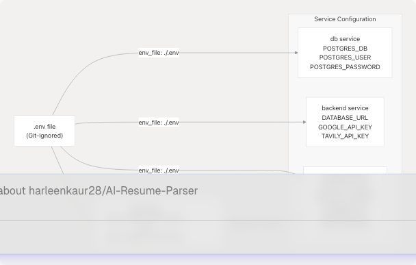
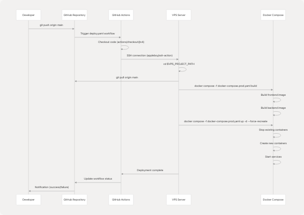
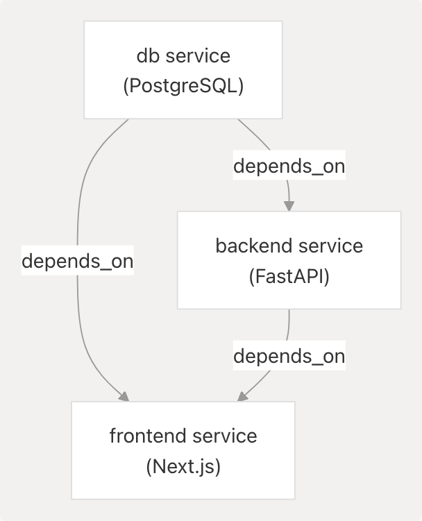

# Deployment & Infrastructure

> Source: https://deepwiki.com/harleenkaur28/AI-Resume-Parser/6-deployment-and-infrastructure

# Deployment & Infrastructure

Relevant source files

* [.github/workflows/deploy.yaml](https://github.com/harleenkaur28/AI-Resume-Parser/blob/b2bbd83d/.github/workflows/deploy.yaml)
* [backend/Dockerfile](https://github.com/harleenkaur28/AI-Resume-Parser/blob/b2bbd83d/backend/Dockerfile)
* [docker-compose.prod.yaml](https://github.com/harleenkaur28/AI-Resume-Parser/blob/b2bbd83d/docker-compose.prod.yaml)
* [docker-compose.yaml](https://github.com/harleenkaur28/AI-Resume-Parser/blob/b2bbd83d/docker-compose.yaml)
* [frontend/.dockerignore](https://github.com/harleenkaur28/AI-Resume-Parser/blob/b2bbd83d/frontend/.dockerignore)
* [frontend/Dockerfile](https://github.com/harleenkaur28/AI-Resume-Parser/blob/b2bbd83d/frontend/Dockerfile)
* [frontend/app/layout-content.tsx](https://github.com/harleenkaur28/AI-Resume-Parser/blob/b2bbd83d/frontend/app/layout-content.tsx)
* [frontend/components/pdf-resume/LoadingOverlay.tsx](https://github.com/harleenkaur28/AI-Resume-Parser/blob/b2bbd83d/frontend/components/pdf-resume/LoadingOverlay.tsx)
* [frontend/instrumentation-client.ts](https://github.com/harleenkaur28/AI-Resume-Parser/blob/b2bbd83d/frontend/instrumentation-client.ts)
* [frontend/public/sw.js](https://github.com/harleenkaur28/AI-Resume-Parser/blob/b2bbd83d/frontend/public/sw.js)
* [frontend/public/workbox-1bb06f5e.js](https://github.com/harleenkaur28/AI-Resume-Parser/blob/b2bbd83d/frontend/public/workbox-1bb06f5e.js)

This document describes the deployment strategy, containerization setup, CI/CD pipeline, Progressive Web App (PWA) implementation, and infrastructure configuration for the TalentSync platform. It covers how the application is packaged, deployed, and served in production environments.

For information about the database schema and migrations, see [Database & Data Models](/harleenkaur28/AI-Resume-Parser/5-database-and-data-models). For frontend and backend architecture details, see [System Architecture](/harleenkaur28/AI-Resume-Parser/2-system-architecture).

---

## Overview

The TalentSync platform uses a containerized deployment strategy with Docker Compose orchestrating three primary services: a PostgreSQL database, a Python FastAPI backend, and a Next.js frontend. The deployment is automated via GitHub Actions, which triggers on pushes to the main branch and deploys to a VPS. The frontend implements PWA features for offline capabilities and app-like experiences.

**Key Technologies:**

* **Containerization**: Docker with multi-stage builds
* **Orchestration**: Docker Compose with internal networking
* **CI/CD**: GitHub Actions with SSH deployment
* **Reverse Proxy**: Nginx Proxy Manager for SSL termination and domain routing
* **PWA**: Workbox-powered service worker with caching strategies
* **Analytics**: PostHog for user behavior tracking
* **Package Managers**: `uv` for Python, `bun` for Node.js

---

## Deployment Architecture

### Production Infrastructure


```

**Deployment Flow:**

1. Developer pushes code to `main` branch on GitHub
2. GitHub Actions workflow triggers automatically
3. SSH connection established to VPS using stored secrets
4. Latest code pulled from repository on VPS
5. Docker images rebuilt using `docker compose build`
6. Services recreated with `docker compose up -d --force-recreate`
7. Nginx Proxy Manager routes traffic to frontend container

**Sources:** [.github/workflows/deploy.yaml1-42](https://github.com/harleenkaur28/AI-Resume-Parser/blob/b2bbd83d/.github/workflows/deploy.yaml#L1-L42) [docker-compose.prod.yaml1-66](https://github.com/harleenkaur28/AI-Resume-Parser/blob/b2bbd83d/docker-compose.prod.yaml#L1-L66)

---

## Docker Compose Configuration

### Service Definitions

The application uses two Docker Compose files:

* `docker-compose.yaml` - Development environment with exposed ports
* `docker-compose.prod.yaml` - Production environment with network isolation

| Service | Image | Purpose | Networks | Volumes |
| --- | --- | --- | --- | --- |
| `db` | `postgres:16` | Database server | `talentsync_internal_network` | `postgres_data` |
| `backend` | Custom build | FastAPI + ML services | `talentsync_internal_network`, `nginxproxyman_network` | `backend/uploads` |
| `frontend` | Custom build | Next.js + Prisma | `talentsync_internal_network`, `nginxproxyman_network` | None |

**Sources:** [docker-compose.prod.yaml1-66](https://github.com/harleenkaur28/AI-Resume-Parser/blob/b2bbd83d/docker-compose.prod.yaml#L1-L66)

### Network Architecture

```

```

**Network Strategy:**

* **Internal Network**: `talentsync_internal_network` (bridge driver) for inter-service communication
* **External Network**: `nginxproxyman_network` connects frontend and backend to Nginx Proxy Manager
* **Isolation**: Database is NOT connected to external network, only accessible internally

**Sources:** [docker-compose.prod.yaml54-66](https://github.com/harleenkaur28/AI-Resume-Parser/blob/b2bbd83d/docker-compose.prod.yaml#L54-L66)

### Environment Variables Flow

```

```

**Key Environment Overrides in Production:**

* `NEXTAUTH_URL`: Set to `https://talentsync.tashif.codes` for production domain
* `DATABASE_URL`: Uses internal service name `db:5432` for database connection
* `BACKEND_URL`: Uses internal service name `http://backend:8000` for API calls
* `NODE_ENV`: Set to `production` for optimization

**Sources:** [docker-compose.prod.yaml38-48](https://github.com/harleenkaur28/AI-Resume-Parser/blob/b2bbd83d/docker-compose.prod.yaml#L38-L48)

---

## Docker Image Builds

### Frontend Image (Next.js)

```

```

**Multi-Stage Build Benefits:**

1. **Smaller Image**: Development dependencies excluded from final image
2. **Build Caching**: Dependencies cached separately from source code
3. **Security**: Source files and build tools not present in production image
4. **Performance**: Only production-ready artifacts included

**Key Dependencies Installed:**

* `openssl` - Required for Prisma
* `texlive-latex-*` - LaTeX packages for PDF resume generation
* Bun runtime for Next.js execution

**Build Arguments:**

* `NEXT_PUBLIC_POSTHOG_KEY` - PostHog project key (embedded at build time)
* `NEXT_PUBLIC_POSTHOG_UI_HOST` - PostHog UI host
* `NEXT_PUBLIC_POSTHOG_HOST` - PostHog API host

These `NEXT_PUBLIC_*` variables are baked into the client bundle during build and cannot be changed at runtime.

**Sources:** [frontend/Dockerfile1-125](https://github.com/harleenkaur28/AI-Resume-Parser/blob/b2bbd83d/frontend/Dockerfile#L1-L125) [docker-compose.prod.yaml34-40](https://github.com/harleenkaur28/AI-Resume-Parser/blob/b2bbd83d/docker-compose.prod.yaml#L34-L40)

### Backend Image (FastAPI)

```

```

**Single-Stage Build Rationale:**

* Backend has fewer dependencies than frontend
* ML models (`best_model.pkl`, `tfidf.pkl`) are pre-trained and copied as-is
* NLTK data downloaded at runtime if needed
* Simpler maintenance with single stage

**Package Manager: `uv`**

* Modern, fast Python package installer
* `--system` flag installs to global environment (no virtual env)
* `--no-cache` reduces image size
* `[dev]` group includes `uvicorn` for serving

**Sources:** [backend/Dockerfile1-33](https://github.com/harleenkaur28/AI-Resume-Parser/blob/b2bbd83d/backend/Dockerfile#L1-L33)

---

## CI/CD Pipeline

### GitHub Actions Workflow

```

```

**Workflow Configuration:**

| Step | Action | Purpose |
| --- | --- | --- |
| Checkout | `actions/checkout@v4` | Get latest code |
| SSH Deploy | `appleboy/ssh-action@v1.0.3` | Execute commands on VPS |

**SSH Action Secrets:**

* `VPS_HOST` - Server IP or domain
* `VPS_USER` - SSH username
* `VPS_PROJECT_PATH` - Project directory path on server
* `SSH_PRIVATE_KEY` - Private key for authentication

**Deployment Commands:**

```
```
cd $VPS_PROJECT_PATH
git pull origin main
docker compose -f docker-compose.prod.yaml build
docker compose -f docker-compose.prod.yaml up -d --force-recreate
```
```

**`--force-recreate` Flag:**

* Forces recreation of containers even if configuration hasn't changed
* Ensures new code is deployed
* Provides zero-downtime by overlapping old/new containers briefly

**Sources:** [.github/workflows/deploy.yaml1-42](https://github.com/harleenkaur28/AI-Resume-Parser/blob/b2bbd83d/.github/workflows/deploy.yaml#L1-L42)

### Startup Sequence

When containers start, the frontend executes a startup command:

```
```
sh -c "bunx prisma migrate deploy && bun prisma/seed.ts && bun run start"
```
```

**Startup Tasks:**

1. **`prisma migrate deploy`**: Apply pending database migrations
2. **`bun prisma/seed.ts`**: Seed initial data (idempotent)
3. **`bun run start`**: Start Next.js production server

**Sources:** [docker-compose.prod.yaml49](https://github.com/harleenkaur28/AI-Resume-Parser/blob/b2bbd83d/docker-compose.prod.yaml#L49-L49)

---

## Progressive Web App (PWA)

### Service Worker Architecture

```

```

**Service Worker Lifecycle:**

1. **Installation**: Precaches critical assets on first visit
2. **Activation**: Cleans up outdated caches
3. **Fetch Interception**: Routes requests through cache strategies

**Sources:** [frontend/public/sw.js1](https://github.com/harleenkaur28/AI-Resume-Parser/blob/b2bbd83d/frontend/public/sw.js#L1-L1) [frontend/public/workbox-1bb06f5e.js1](https://github.com/harleenkaur28/AI-Resume-Parser/blob/b2bbd83d/frontend/public/workbox-1bb06f5e.js#L1-L1)

### Caching Strategies

| Route Pattern | Strategy | Cache Name | Max Entries | Max Age |
| --- | --- | --- | --- | --- |
| `/` (start URL) | `NetworkFirst` | `start-url` | N/A | N/A |
| Google Fonts Webfonts | `CacheFirst` | `google-fonts-webfonts` | 4 | 365 days |
| Google Fonts Stylesheets | `StaleWhileRevalidate` | `google-fonts-stylesheets` | 4 | 7 days |
| Font files (`.woff2`, etc.) | `StaleWhileRevalidate` | `static-font-assets` | 4 | 7 days |
| Images (`.jpg`, `.png`, etc.) | `StaleWhileRevalidate` | `static-image-assets` | 64 | 1 day |
| Next.js images (`/_next/image`) | `StaleWhileRevalidate` | `next-image` | 64 | 1 day |
| JavaScript files | `StaleWhileRevalidate` | `static-js-assets` | 32 | 1 day |
| Stylesheets | `StaleWhileRevalidate` | `static-style-assets` | 32 | 1 day |
| Next.js data (`/_next/data/`) | `StaleWhileRevalidate` | `next-data` | 32 | 1 day |
| Static data (`.json`, `.xml`) | `NetworkFirst` | `static-data-assets` | 32 | 1 day |
| API routes (`/api/*`) | `NetworkFirst` (10s timeout) | `apis` | 16 | 1 day |
| Other same-origin | `NetworkFirst` (10s timeout) | `others` | 32 | 1 day |
| Cross-origin | `NetworkFirst` (10s timeout) | `cross-origin` | 32 | 1 hour |

**Strategy Descriptions:**

* **`NetworkFirst`**: Try network first, fall back to cache if offline
* **`CacheFirst`**: Serve from cache, fetch from network only if not cached
* **`StaleWhileRevalidate`**: Serve from cache immediately, update cache in background

**Precached Assets:**

* All Next.js build chunks (`/_next/static/chunks/`)
* App routes and pages
* Static images and icons
* PWA manifest and service worker itself

**Sources:** [frontend/public/sw.js1](https://github.com/harleenkaur28/AI-Resume-Parser/blob/b2bbd83d/frontend/public/sw.js#L1-L1)

### PWA Manifest

The PWA manifest is located at `/manifest.json` and defines the app metadata:

* **Icons**: 192x192 and 512x512 PNG icons
* **Display**: Standalone (app-like experience)
* **Start URL**: `/`
* **Theme Color**: Matches brand colors

**Sources:** [frontend/public/sw.js1](https://github.com/harleenkaur28/AI-Resume-Parser/blob/b2bbd83d/frontend/public/sw.js#L1-L1)

---

## Environment Configuration

### Variable Categories

```

```

### Security Considerations

**Public Variables (`NEXT_PUBLIC_*`):**

* Embedded in client bundle at build time
* Visible to all users in browser
* Safe for public keys (PostHog, public API endpoints)

**Private Variables:**

* Never include in `NEXT_PUBLIC_*` prefix
* Loaded at runtime from `.env` file
* Not accessible to client-side code
* Examples: API secrets, database credentials, OAuth secrets

**Docker Secrets Management:**

* `.env` file NOT copied into Docker images
* Variables passed at runtime via `env_file` in docker-compose
* Sensitive files excluded via `.dockerignore`

**Sources:** [frontend/Dockerfile9-18](https://github.com/harleenkaur28/AI-Resume-Parser/blob/b2bbd83d/frontend/Dockerfile#L9-L18) [docker-compose.prod.yaml42-48](https://github.com/harleenkaur28/AI-Resume-Parser/blob/b2bbd83d/docker-compose.prod.yaml#L42-L48) [frontend/.dockerignore7-11](https://github.com/harleenkaur28/AI-Resume-Parser/blob/b2bbd83d/frontend/.dockerignore#L7-L11)

### Environment Variable Mapping

| Variable | Frontend | Backend | Database | Purpose |
| --- | --- | --- | --- | --- |
| `POSTGRES_DB` | ✓ (in URL) | ✓ (in URL) | ✓ | Database name |
| `POSTGRES_USER` | ✓ (in URL) | ✓ (in URL) | ✓ | Database username |
| `POSTGRES_PASSWORD` | ✓ (in URL) | ✓ (in URL) | ✓ | Database password |
| `NEXTAUTH_URL` | ✓ | - | - | Auth callback URL |
| `NEXTAUTH_SECRET` | ✓ | - | - | JWT signing secret |
| `BACKEND_URL` | ✓ | - | - | Internal API URL |
| `GOOGLE_API_KEY` | - | ✓ | - | Gemini LLM access |
| `TAVILY_API_KEY` | - | ✓ | - | Web search access |
| `NEXT_PUBLIC_POSTHOG_KEY` | ✓ (build) | - | - | Analytics key |

**Sources:** [docker-compose.prod.yaml6-48](https://github.com/harleenkaur28/AI-Resume-Parser/blob/b2bbd83d/docker-compose.prod.yaml#L6-L48)

---

## Monitoring & Analytics

### PostHog Integration

```

```

**PostHog Configuration:**

The PostHog client is initialized on the client side:

```
```
// frontend/instrumentation-client.ts
posthog.init(key, {
  api_host: '/ph',      // Proxy to avoid CORS
  ui_host: 'https://eu.posthog.com'
})
```
```

**Proxy Strategy:**

* Client sends events to `/ph` (same origin)
* Next.js API route proxies to `eu.i.posthog.com`
* Avoids CORS issues and ad blockers

**Environment Variables:**

* `NEXT_PUBLIC_POSTHOG_KEY` - Project key (public)
* `NEXT_PUBLIC_POSTHOG_UI_HOST` - Dashboard URL (default: `https://eu.posthog.com`)
* `NEXT_PUBLIC_POSTHOG_HOST` - API host (default: `https://eu.i.posthog.com`)

**Sources:** [frontend/instrumentation-client.ts1-12](https://github.com/harleenkaur28/AI-Resume-Parser/blob/b2bbd83d/frontend/instrumentation-client.ts#L1-L12) [docker-compose.prod.yaml38-40](https://github.com/harleenkaur28/AI-Resume-Parser/blob/b2bbd83d/docker-compose.prod.yaml#L38-L40)

### Tracked Events

PostHog automatically tracks:

* Page views
* User sessions
* Feature usage
* User properties

Custom events can be tracked using:

```
```
posthog.capture('event_name', { property: 'value' })
```
```

**Sources:** [frontend/instrumentation-client.ts1-12](https://github.com/harleenkaur28/AI-Resume-Parser/blob/b2bbd83d/frontend/instrumentation-client.ts#L1-L12)

---

## Volume Persistence

### Persistent Storage Strategy

| Volume | Mount Point | Purpose | Backup Required |
| --- | --- | --- | --- |
| `postgres_data` | `/var/lib/postgresql/data` | Database storage | **Critical** |
| `backend/uploads` | `/app/uploads` | User-uploaded resumes | **Important** |

**Data Persistence:**

* Volumes survive container recreation
* Data persists across deployments
* Named volumes managed by Docker

**Backup Recommendations:**

* Database: Regular PostgreSQL dumps (`pg_dump`)
* Uploads: File system backup or S3 sync

**Sources:** [docker-compose.prod.yaml12-59](https://github.com/harleenkaur28/AI-Resume-Parser/blob/b2bbd83d/docker-compose.prod.yaml#L12-L59)

---

## Health Checks & Monitoring

### Container Health

Docker Compose does not define explicit health checks in the current configuration. However, Docker's restart policy ensures service availability:

```
```
restart: always
```
```

This policy:

* Restarts containers on failure
* Restarts after host reboot
* Maintains service uptime

### Service Dependencies

```


**Startup Order:**

1. Database starts first
2. Backend starts after database
3. Frontend starts after both (runs migrations)

**Note:** `depends_on` only ensures start order, not readiness. Frontend startup command includes retry logic for database connections.

**Sources:** [docker-compose.prod.yaml27-52](https://github.com/harleenkaur28/AI-Resume-Parser/blob/b2bbd83d/docker-compose.prod.yaml#L27-L52)

---

## Production Hardening

### Security Measures

1. **Network Isolation**: Database not exposed to external network
2. **Environment Separation**: Production variables in separate `.env` file
3. **Image Optimization**: Multi-stage builds reduce attack surface
4. **Non-Root User**: Frontend runs as `bun` user, not root
5. **SSL/TLS**: Nginx Proxy Manager handles certificate management
6. **Secret Management**: Credentials stored in GitHub Secrets, not in code

### Performance Optimizations

1. **Docker Layer Caching**: Dependencies cached separately from source code
2. **Frozen Lockfiles**: `--frozen-lockfile` ensures reproducible builds
3. **Production Dependencies Only**: Dev dependencies excluded from final images
4. **Bun Runtime**: Faster JavaScript execution compared to Node.js
5. **Service Worker Caching**: Reduces network requests for repeat visitors

**Sources:** [frontend/Dockerfile43-84](https://github.com/harleenkaur28/AI-Resume-Parser/blob/b2bbd83d/frontend/Dockerfile#L43-L84) [backend/Dockerfile20](https://github.com/harleenkaur28/AI-Resume-Parser/blob/b2bbd83d/backend/Dockerfile#L20-L20)

---

## Troubleshooting

### Common Deployment Issues

| Issue | Cause | Solution |
| --- | --- | --- |
| Build fails on VPS | Insufficient disk space | Clean up old Docker images: `docker system prune -a` |
| Frontend can't connect to backend | Wrong `BACKEND_URL` | Use internal service name: `http://backend:8000` |
| Database connection fails | Wrong `DATABASE_URL` | Use internal service name: `postgresql://...@db:5432/...` |
| Service worker not updating | Browser cache | Hard refresh (Ctrl+Shift+R) or increment cache version |
| PostHog events not tracking | Wrong API host | Verify `/ph` proxy endpoint in Next.js config |

### Viewing Logs

```
```
# All services
docker compose -f docker-compose.prod.yaml logs -f

# Specific service
docker compose -f docker-compose.prod.yaml logs -f frontend
docker compose -f docker-compose.prod.yaml logs -f backend
docker compose -f docker-compose.prod.yaml logs -f db
```
```

### Rebuilding Specific Service

```
```
# Rebuild and restart specific service
docker compose -f docker-compose.prod.yaml up -d --build --force-recreate frontend
```
```

**Sources:** [.github/workflows/deploy.yaml35-39](https://github.com/harleenkaur28/AI-Resume-Parser/blob/b2bbd83d/.github/workflows/deploy.yaml#L35-L39)

---

## Summary

The TalentSync deployment infrastructure provides a production-ready, containerized platform with:

* **Automated Deployments**: GitHub Actions triggers on every push to main
* **Network Isolation**: Internal network for service communication, external for public access
* **Data Persistence**: Volumes for database and file uploads
* **PWA Capabilities**: Service worker with advanced caching strategies
* **Scalability**: Docker Compose can be migrated to Kubernetes for horizontal scaling
* **Observability**: PostHog analytics for user behavior tracking

The architecture balances simplicity (Docker Compose) with production requirements (SSL, analytics, PWA), making it suitable for small to medium-scale deployments while providing a path to more robust orchestration platforms as needed.