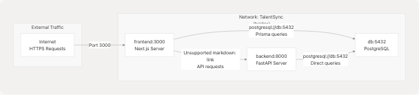
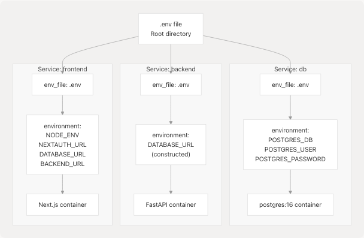

# Docker Compose Setup

Relevant source files

* [backend/Dockerfile](https://github.com/harleenkaur28/AI-Resume-Parser/blob/b2bbd83d/backend/Dockerfile)
* [docker-compose.yaml](https://github.com/harleenkaur28/AI-Resume-Parser/blob/b2bbd83d/docker-compose.yaml)
* [frontend/components/pdf-resume/LoadingOverlay.tsx](https://github.com/harleenkaur28/AI-Resume-Parser/blob/b2bbd83d/frontend/components/pdf-resume/LoadingOverlay.tsx)

## Purpose and Scope

This document describes the Docker Compose orchestration configuration for TalentSync, which defines the multi-container architecture that runs the complete application stack in production. The setup includes three primary services: PostgreSQL database (`db`), FastAPI backend (`backend`), and Next.js frontend (`frontend`). This page covers service definitions, networking, volume management, environment variable configuration, and inter-service dependencies.

For Docker image build details, see [Docker Images & Build Process](/harleenkaur28/AI-Resume-Parser/6.2-docker-images-and-build-process). For CI/CD deployment automation, see [CI/CD Pipeline](/harleenkaur28/AI-Resume-Parser/6.3-cicd-pipeline). For environment variable documentation, see [Environment Configuration](/harleenkaur28/AI-Resume-Parser/6.5-environment-configuration).

---

## Container Architecture Overview

The Docker Compose configuration defines a three-tier containerized application stack with shared networking and persistent storage.

**Diagram: Docker Compose Service Architecture**


```

**Sources:** [docker-compose.yaml1-78](https://github.com/harleenkaur28/AI-Resume-Parser/blob/b2bbd83d/docker-compose.yaml#L1-L78)

---

## Service Definitions

### Database Service (`db`)

The `db` service runs PostgreSQL 16 with persistent storage and automatic restart policies.

| Configuration | Value | Description |
| --- | --- | --- |
| **Service Name** | `db` | Internal DNS hostname for database access |
| **Image** | `postgres:16` | Official PostgreSQL image, version 16 |
| **Restart Policy** | `always` | Container automatically restarts on failure |
| **Port** | `5432` | Internal only, not exposed externally |
| **Volume** | `postgres_data:/var/lib/postgresql/data` | Persistent database storage |
| **Network** | `TalentSync` | Internal bridge network |

**Environment Variables:**

The database service requires three environment variables loaded from `.env`:

* `POSTGRES_DB` - Database name
* `POSTGRES_USER` - Database username
* `POSTGRES_PASSWORD` - Database password

These variables are passed both via `env_file` and explicitly in the `environment` section to ensure PostgreSQL image initialization works correctly.

**Sources:** [docker-compose.yaml4-17](https://github.com/harleenkaur28/AI-Resume-Parser/blob/b2bbd83d/docker-compose.yaml#L4-L17)

---

### Backend Service (`backend`)

The `backend` service builds a custom Python image containing the FastAPI application, ML models, and NLP processing libraries.

| Configuration | Value | Description |
| --- | --- | --- |
| **Service Name** | `backend` | Internal DNS hostname for API access |
| **Build Context** | `./backend` | Backend directory with Dockerfile |
| **Dockerfile** | `Dockerfile` | Multi-stage build configuration |
| **Base Image** | `python:3.13-slim` | Python 3.13 slim variant |
| **Restart Policy** | `always` | Container automatically restarts on failure |
| **Port** | `8000` | Internal only, accessed via frontend |
| **Volume** | `./backend/uploads:/app/uploads` | Persistent file upload storage |
| **Dependencies** | `db` | Waits for database before starting |
| **Network** | `TalentSync` | Internal bridge network |

**Environment Variables:**

The backend requires database connectivity and API keys:

* `DATABASE_URL` - Constructed as `postgresql://${POSTGRES_USER}:${POSTGRES_PASSWORD}@db:5432/${POSTGRES_DB}?schema=public`
* `GOOGLE_API_KEY` - For Google Gemini 2.0 Flash LLM
* `TAVILY_API_KEY` - For web search agent
* Additional variables loaded from `.env`

Note the use of `@db:5432` in the database URL, which references the `db` service name for internal DNS resolution.

**Command Execution:**

The backend service executes: `python -m uvicorn app.main:app --host 0.0.0.0 --port 8000`

**Sources:** [docker-compose.yaml19-40](https://github.com/harleenkaur28/AI-Resume-Parser/blob/b2bbd83d/docker-compose.yaml#L19-L40) [backend/Dockerfile1-33](https://github.com/harleenkaur28/AI-Resume-Parser/blob/b2bbd83d/backend/Dockerfile#L1-L33)

---

### Frontend Service (`frontend`)

The `frontend` service builds a custom Bun-based Next.js image that serves the web application and manages database migrations.

| Configuration | Value | Description |
| --- | --- | --- |
| **Service Name** | `frontend` | External-facing web server |
| **Build Context** | `./frontend` | Frontend directory with Dockerfile |
| **Dockerfile** | `Dockerfile` | Multi-stage build with Bun runtime |
| **Base Image** | `oven/bun:1-slim` | Bun JavaScript runtime |
| **Restart Policy** | `always` | Container automatically restarts on failure |
| **Port Mapping** | `3000:3000` | **Only externally exposed service** |
| **Dependencies** | `db`, `backend` | Waits for both services before starting |
| **Network** | `TalentSync` | Internal bridge network |

**Environment Variables:**

The frontend requires configuration for authentication, database access, and backend communication:

* `NODE_ENV` - Set to `production`
* `NEXTAUTH_URL` - Set to `https://talentsync.tashif.codes` for production domain
* `DATABASE_URL` - Same PostgreSQL connection string as backend
* `BACKEND_URL` - Set to `http://backend:8000` for internal service-to-service communication
* `NEXTAUTH_SECRET` - Loaded from `.env` for session encryption
* OAuth credentials (Google, GitHub) - Loaded from `.env`
* Email server settings - Loaded from `.env`

**Startup Command:**

The frontend executes a multi-step startup sequence:

```
```
sh -c "bunx prisma migrate deploy && bun prisma/seed.ts && bun run start"
```
```

This sequence performs:

1. `bunx prisma migrate deploy` - Apply pending database migrations
2. `bun prisma/seed.ts` - Seed initial data (if any)
3. `bun run start` - Start the Next.js production server

**Sources:** [docker-compose.yaml42-68](https://github.com/harleenkaur28/AI-Resume-Parser/blob/b2bbd83d/docker-compose.yaml#L42-L68)

---

## Network Configuration

**Diagram: Internal Service Communication**

```

```

The Docker Compose configuration creates a single user-defined bridge network named `TalentSync` that enables service discovery via DNS.

**Network Properties:**

| Property | Value | Behavior |
| --- | --- | --- |
| **Network Name** | `TalentSync` | Defined at [docker-compose.yaml75-76](https://github.com/harleenkaur28/AI-Resume-Parser/blob/b2bbd83d/docker-compose.yaml#L75-L76) |
| **Driver** | `bridge` | Standard Docker bridge networking |
| **DNS Resolution** | Enabled | Services can reference each other by service name |
| **Isolation** | Yes | Services are isolated from host network |

**Service Discovery:**

Each service is accessible via its service name as a hostname:

* `db` resolves to the database container's internal IP
* `backend` resolves to the backend container's internal IP
* `frontend` resolves to the frontend container's internal IP

This enables the frontend to make API calls using `http://backend:8000` and both services to connect to the database using `@db:5432` in connection strings.

**External Access:**

Only the frontend service exposes a port to the host (`3000:3000`). The backend and database are not directly accessible from outside the Docker network, providing security through network isolation. External traffic flows through the frontend, which proxies API requests to the backend via internal networking.

**Sources:** [docker-compose.yaml74-76](https://github.com/harleenkaur28/AI-Resume-Parser/blob/b2bbd83d/docker-compose.yaml#L74-L76) [docker-compose.yaml28](https://github.com/harleenkaur28/AI-Resume-Parser/blob/b2bbd83d/docker-compose.yaml#L28-L28) [docker-compose.yaml60](https://github.com/harleenkaur28/AI-Resume-Parser/blob/b2bbd83d/docker-compose.yaml#L60-L60)

---

## Volume Management

The Docker Compose stack defines two types of persistent storage for data that must survive container restarts.

**Diagram: Volume Mapping**

```

```

### Named Volume: `postgres_data`

The database uses a Docker-managed named volume for PostgreSQL data persistence.

| Property | Value |
| --- | --- |
| **Volume Name** | `postgres_data` |
| **Driver** | `local` |
| **Container Mount** | `/var/lib/postgresql/data` |
| **Lifecycle** | Persists even if containers are removed |
| **Location** | Managed by Docker (typically `/var/lib/docker/volumes/`) |

This volume ensures that database contents (tables, indexes, user data) survive container recreation, updates, and restarts. When the `db` service is recreated, it reattaches to the same volume, preserving all data.

**Sources:** [docker-compose.yaml14-15](https://github.com/harleenkaur28/AI-Resume-Parser/blob/b2bbd83d/docker-compose.yaml#L14-L15) [docker-compose.yaml70-72](https://github.com/harleenkaur28/AI-Resume-Parser/blob/b2bbd83d/docker-compose.yaml#L70-L72)

### Bind Mount: `./backend/uploads`

The backend service uses a bind mount to persist uploaded resume files on the host filesystem.

| Property | Value |
| --- | --- |
| **Host Path** | `./backend/uploads` (relative to docker-compose.yaml) |
| **Container Mount** | `/app/uploads` |
| **Purpose** | Store user-uploaded PDF, DOCX, and TXT files |
| **Lifecycle** | Directly accessible on host filesystem |

This bind mount allows uploaded files to be:

* Persisted across container restarts
* Backed up by standard filesystem backup tools
* Accessed directly from the host for debugging
* Shared across multiple backend container instances (if scaling horizontally)

**Sources:** [docker-compose.yaml34](https://github.com/harleenkaur28/AI-Resume-Parser/blob/b2bbd83d/docker-compose.yaml#L34-L34)

---

## Environment Variable Management

The Docker Compose configuration uses a hybrid approach for environment variable injection, combining `env_file` declarations with explicit `environment` overrides.

**Diagram: Environment Variable Flow**

```

```

### Environment File Loading

All three services declare `env_file: - ./.env`, which loads all variables from the root `.env` file into each container's environment. This provides baseline configuration including:

* API keys (`GOOGLE_API_KEY`, `TAVILY_API_KEY`)
* Authentication secrets (`NEXTAUTH_SECRET`, `JWT_SECRET`)
* OAuth credentials (`GOOGLE_CLIENT_ID`, `GOOGLE_CLIENT_SECRET`, `GITHUB_ID`, `GITHUB_SECRET`)
* Email server configuration (`EMAIL_SERVER_HOST`, `EMAIL_SERVER_PORT`, `EMAIL_FROM`)
* Database credentials (`POSTGRES_DB`, `POSTGRES_USER`, `POSTGRES_PASSWORD`)

**Sources:** [docker-compose.yaml7-8](https://github.com/harleenkaur28/AI-Resume-Parser/blob/b2bbd83d/docker-compose.yaml#L7-L8) [docker-compose.yaml24-25](https://github.com/harleenkaur28/AI-Resume-Parser/blob/b2bbd83d/docker-compose.yaml#L24-L25) [docker-compose.yaml53-54](https://github.com/harleenkaur28/AI-Resume-Parser/blob/b2bbd83d/docker-compose.yaml#L53-L54)

### Environment Overrides

The `environment` section in each service definition explicitly sets or overrides specific variables for Docker Compose networking:

**Database Service:**

```
```
environment:
  POSTGRES_DB: ${POSTGRES_DB}
  POSTGRES_USER: ${POSTGRES_USER}
  POSTGRES_PASSWORD: ${POSTGRES_PASSWORD}
```
```

These explicit declarations ensure the PostgreSQL image initializes correctly, as it requires these specific variable names.

**Backend Service:**

```
```
environment:
  DATABASE_URL: "postgresql://${POSTGRES_USER}:${POSTGRES_PASSWORD}@db:5432/${POSTGRES_DB}?schema=public"
```
```

The `DATABASE_URL` is constructed dynamically, using `@db:5432` to reference the database service by its Docker Compose service name.

**Frontend Service:**

```
```
environment:
  NODE_ENV: production
  NEXTAUTH_URL: https://talentsync.tashif.codes
  DATABASE_URL: "postgresql://${POSTGRES_USER}:${POSTGRES_PASSWORD}@db:5432/${POSTGRES_DB}?schema=public"
  BACKEND_URL: http://backend:8000
```
```

The frontend explicitly overrides networking URLs to use internal service names (`http://backend:8000`) and the production domain for NextAuth callbacks.

**Sources:** [docker-compose.yaml9-13](https://github.com/harleenkaur28/AI-Resume-Parser/blob/b2bbd83d/docker-compose.yaml#L9-L13) [docker-compose.yaml26-32](https://github.com/harleenkaur28/AI-Resume-Parser/blob/b2bbd83d/docker-compose.yaml#L26-L32) [docker-compose.yaml55-62](https://github.com/harleenkaur28/AI-Resume-Parser/blob/b2bbd83d/docker-compose.yaml#L55-L62)

---

## Service Dependencies and Startup Order

Docker Compose orchestrates the startup sequence using `depends_on` directives to ensure services start in the correct order.

**Diagram: Service Startup Dependency Graph**

```


### Dependency Declarations

The `depends_on` configuration defines service startup ordering:

**Backend depends on Database:**

```
```
backend:
  depends_on:
    - db
```
```

The backend service waits for the `db` service to start before launching. This ensures the database is available when the FastAPI application attempts to connect.

**Frontend depends on Database and Backend:**

```
```
frontend:
  depends_on:
    - db
    - backend
```
```

The frontend service waits for both `db` and `backend` to start before executing its startup command. This is critical because the frontend runs Prisma migrations (`bunx prisma migrate deploy`) that require database connectivity.

**Sources:** [docker-compose.yaml37-38](https://github.com/harleenkaur28/AI-Resume-Parser/blob/b2bbd83d/docker-compose.yaml#L37-L38) [docker-compose.yaml64-66](https://github.com/harleenkaur28/AI-Resume-Parser/blob/b2bbd83d/docker-compose.yaml#L64-L66)

### Startup Sequence

The complete startup sequence when running `docker compose up`:

1. **Database Initialization (3-5 seconds)**

   * PostgreSQL 16 container starts
   * Mounts `postgres_data` volume
   * Initializes database with `POSTGRES_DB`, `POSTGRES_USER`, `POSTGRES_PASSWORD`
   * Begins listening on port 5432
2. **Backend Initialization (5-10 seconds)**

   * Python 3.13 container starts
   * Loads ML models (`best_model.pkl`, `tfidf.pkl`)
   * Connects to database using `DATABASE_URL`
   * Starts Uvicorn server on port 8000
   * FastAPI application begins serving requests
3. **Frontend Initialization (10-15 seconds)**

   * Bun container starts
   * Executes `bunx prisma migrate deploy` to update database schema
   * Executes `bun prisma/seed.ts` to seed initial data
   * Executes `bun run start` to launch Next.js production server
   * Application becomes accessible on port 3000

**Important Note:** `depends_on` only ensures start order, not readiness. If the backend takes longer than expected to initialize, the frontend may attempt migrations before the backend is fully ready. However, Prisma's connection retry logic typically handles this gracefully.

**Sources:** [docker-compose.yaml63](https://github.com/harleenkaur28/AI-Resume-Parser/blob/b2bbd83d/docker-compose.yaml#L63-L63)

---

## Inter-Service Communication Patterns

The three services communicate using internal DNS resolution within the `TalentSync` network.

### Frontend → Backend Communication

The frontend makes HTTP requests to the backend for all AI/ML operations:

* **Connection URL:** `http://backend:8000`
* **Environment Variable:** `BACKEND_URL`
* **Usage Pattern:** Server-side API calls from Next.js API routes

Example communication flows:

* Resume analysis: `POST http://backend:8000/analyze_resume`
* ATS evaluation: `POST http://backend:8000/ats_evaluate`
* Cold mail generation: `POST http://backend:8000/generate_cold_mail`

The `backend` hostname resolves to the backend container's internal IP address within the Docker network.

**Sources:** [docker-compose.yaml60](https://github.com/harleenkaur28/AI-Resume-Parser/blob/b2bbd83d/docker-compose.yaml#L60-L60)

### Frontend → Database Communication

The frontend connects directly to PostgreSQL for user authentication and session management:

* **Connection URL:** `postgresql://${POSTGRES_USER}:${POSTGRES_PASSWORD}@db:5432/${POSTGRES_DB}?schema=public`
* **Environment Variable:** `DATABASE_URL`
* **Usage Pattern:** Prisma ORM queries from NextAuth and application code

The connection string uses `@db:5432` where `db` is the PostgreSQL service name.

**Sources:** [docker-compose.yaml59](https://github.com/harleenkaur28/AI-Resume-Parser/blob/b2bbd83d/docker-compose.yaml#L59-L59)

### Backend → Database Communication

The backend also connects to PostgreSQL, primarily for storing resume analysis results:

* **Connection URL:** Same as frontend, using `@db:5432`
* **Environment Variable:** `DATABASE_URL`
* **Usage Pattern:** Direct database operations (if any) and potential future features

Note that in the current architecture, the backend primarily performs stateless AI operations, with the frontend handling most database interactions through Prisma.

**Sources:** [docker-compose.yaml28](https://github.com/harleenkaur28/AI-Resume-Parser/blob/b2bbd83d/docker-compose.yaml#L28-L28)

### Communication Security

All inter-service communication occurs over the internal `TalentSync` bridge network, which is isolated from external networks. Only the frontend's port 3000 is exposed to the host, meaning:

* The backend API (`port 8000`) is **not accessible** from outside the Docker network
* The PostgreSQL database (`port 5432`) is **not accessible** from outside the Docker network
* All API keys and secrets remain within the Docker environment

This network isolation provides defense-in-depth security, ensuring that even if the frontend is compromised, attackers cannot directly access backend services or the database.

**Sources:** [docker-compose.yaml51-52](https://github.com/harleenkaur28/AI-Resume-Parser/blob/b2bbd83d/docker-compose.yaml#L51-L52) [docker-compose.yaml16-17](https://github.com/harleenkaur28/AI-Resume-Parser/blob/b2bbd83d/docker-compose.yaml#L16-L17) [docker-compose.yaml39-40](https://github.com/harleenkaur28/AI-Resume-Parser/blob/b2bbd83d/docker-compose.yaml#L39-L40)

---

## Operational Commands

### Starting the Stack

```
```
docker compose up -d
```
```

Starts all three services in detached mode. The `-d` flag runs containers in the background. Services start in dependency order: `db` → `backend` → `frontend`.

### Stopping the Stack

```
```
docker compose down
```
```

Stops and removes all containers. Volumes (`postgres_data` and `./backend/uploads`) are preserved.

### Rebuilding After Code Changes

```
```
docker compose build
docker compose up -d
```
```

Rebuilds container images from updated Dockerfiles and restarts services. This is necessary after code changes to the frontend or backend.

### Viewing Logs

```
```
# All services
docker compose logs -f

# Specific service
docker compose logs -f frontend
docker compose logs -f backend
docker compose logs -f db
```
```

The `-f` flag follows log output in real-time.

### Checking Service Status

```
```
docker compose ps
```
```

Shows running status, ports, and health of all services.

**Sources:** [docker-compose.yaml1-78](https://github.com/harleenkaur28/AI-Resume-Parser/blob/b2bbd83d/docker-compose.yaml#L1-L78)