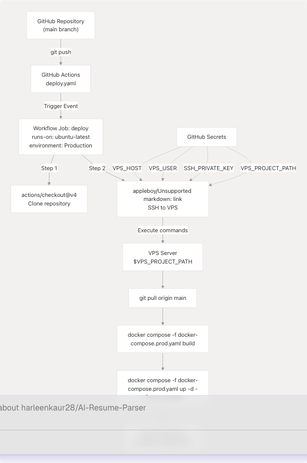
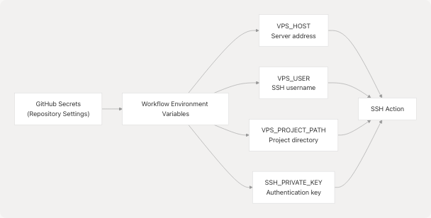
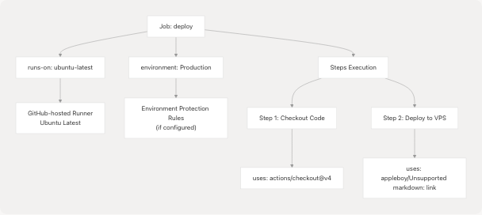
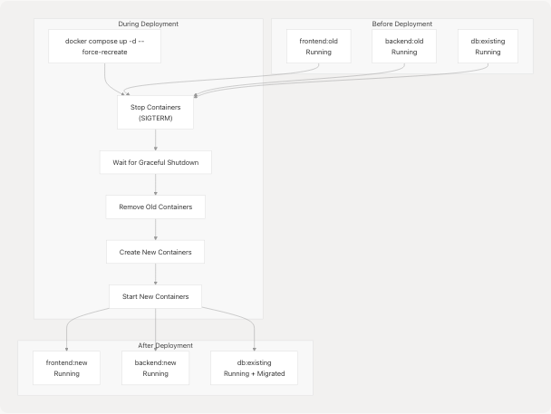
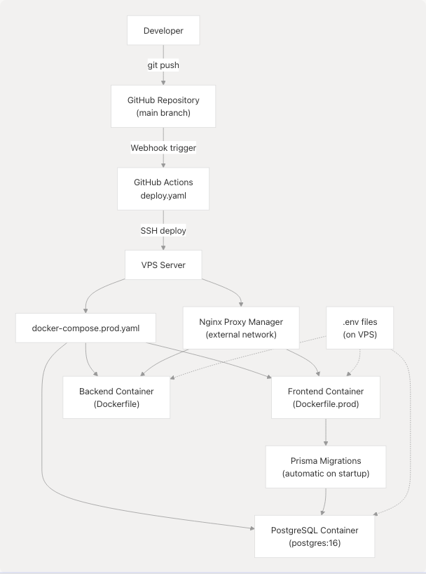

# CI/CD Pipeline

Relevant source files

* [.github/workflows/deploy.yaml](https://github.com/harleenkaur28/AI-Resume-Parser/blob/b2bbd83d/.github/workflows/deploy.yaml)
* [frontend/app/layout-content.tsx](https://github.com/harleenkaur28/AI-Resume-Parser/blob/b2bbd83d/frontend/app/layout-content.tsx)
* [frontend/public/sw.js](https://github.com/harleenkaur28/AI-Resume-Parser/blob/b2bbd83d/frontend/public/sw.js)
* [frontend/public/workbox-1bb06f5e.js](https://github.com/harleenkaur28/AI-Resume-Parser/blob/b2bbd83d/frontend/public/workbox-1bb06f5e.js)

This document describes the Continuous Integration and Continuous Deployment (CI/CD) pipeline for TalentSync. The pipeline automates the deployment process from code commits to production deployment on a VPS server using GitHub Actions.

For information about the Docker infrastructure that the CI/CD pipeline deploys, see [Docker Compose Setup](/harleenkaur28/AI-Resume-Parser/6.1-docker-compose-setup). For details on the build process and image configuration, see [Docker Images & Build Process](/harleenkaur28/AI-Resume-Parser/6.2-docker-images-and-build-process).

## Purpose and Scope

The CI/CD pipeline handles automated deployment of both frontend and backend services to production when code is pushed to the `main` branch. It orchestrates the complete deployment workflow including code retrieval, Docker image building, database migrations, and service updates with minimal downtime.

**Sources:** [.github/workflows/deploy.yaml1-42](https://github.com/harleenkaur28/AI-Resume-Parser/blob/b2bbd83d/.github/workflows/deploy.yaml#L1-L42)

---

## Workflow Overview

The deployment workflow is defined in a single GitHub Actions workflow file that executes on the VPS server via SSH. The process follows a linear sequence of steps that ensure the latest code is built and deployed consistently.


```

**Diagram: GitHub Actions Deployment Flow**

**Sources:** [.github/workflows/deploy.yaml1-42](https://github.com/harleenkaur28/AI-Resume-Parser/blob/b2bbd83d/.github/workflows/deploy.yaml#L1-L42)

---

## Trigger Configuration

The workflow is configured to trigger automatically on specific repository events.

### Push to Main Branch

The workflow triggers on every push to the `main` branch:

```
```
on:
  push:
    branches:
      - main
```
```

This configuration ensures that any code merged into `main` (typically via pull request) immediately triggers a production deployment. There is no manual approval step, implementing a continuous deployment strategy.

**Sources:** [.github/workflows/deploy.yaml4-7](https://github.com/harleenkaur28/AI-Resume-Parser/blob/b2bbd83d/.github/workflows/deploy.yaml#L4-L7)

---

## Environment Variables and Secrets

The workflow uses GitHub repository secrets and environment variables to securely configure the deployment target.

### Environment Configuration

```

```

**Diagram: Secrets and Variables Flow**

The workflow defines three environment variables at the workflow level:

| Variable | Source | Purpose |
| --- | --- | --- |
| `VPS_HOST` | `secrets.VPS_HOST` | VPS server IP address or hostname |
| `VPS_USER` | `secrets.VPS_USER` | SSH username for server access |
| `VPS_PROJECT_PATH` | `secrets.VPS_PROJECT_PATH` | Absolute path to project directory on VPS |

Additionally, `secrets.SSH_PRIVATE_KEY` is used directly in the SSH action for authentication.

**Sources:** [.github/workflows/deploy.yaml9-12](https://github.com/harleenkaur28/AI-Resume-Parser/blob/b2bbd83d/.github/workflows/deploy.yaml#L9-L12) [.github/workflows/deploy.yaml24-27](https://github.com/harleenkaur28/AI-Resume-Parser/blob/b2bbd83d/.github/workflows/deploy.yaml#L24-L27)

---

## Deployment Job Configuration

The deployment job runs on GitHub's `ubuntu-latest` runner and is assigned to the `Production` environment.

```

```

**Diagram: Job Configuration Structure**

The job configuration specifies:

* **Runner**: `ubuntu-latest` - a GitHub-hosted Linux runner
* **Environment**: `Production` - enables environment-specific secrets and protection rules
* **Steps**: Two sequential steps for code checkout and deployment

**Sources:** [.github/workflows/deploy.yaml14-18](https://github.com/harleenkaur28/AI-Resume-Parser/blob/b2bbd83d/.github/workflows/deploy.yaml#L14-L18)

---

## Deployment Steps

### Step 1: Code Checkout

```
```
- name: Checkout code
  uses: actions/checkout@v4
```
```

This step uses GitHub's official checkout action (v4) to clone the repository. While the code is available on the runner, it is not directly used in the deployment. Instead, it serves as verification that the workflow is running against the correct commit.

**Sources:** [.github/workflows/deploy.yaml19-20](https://github.com/harleenkaur28/AI-Resume-Parser/blob/b2bbd83d/.github/workflows/deploy.yaml#L19-L20)

### Step 2: SSH Deployment

The core deployment logic executes via SSH on the VPS server using the `appleboy/ssh-action` action.

```

```

**Diagram: SSH Deployment Sequence**

**Sources:** [.github/workflows/deploy.yaml22-41](https://github.com/harleenkaur28/AI-Resume-Parser/blob/b2bbd83d/.github/workflows/deploy.yaml#L22-L41)

---

## Deployment Command Execution

The SSH action executes a series of shell commands on the VPS server:

### Command 1: Navigate to Project Directory

```
```
cd ${{ env.VPS_PROJECT_PATH }}
```
```

Changes to the project directory specified by the `VPS_PROJECT_PATH` environment variable.

### Command 2: Pull Latest Code

```
```
git pull origin main
```
```

Fetches and merges the latest code from the `main` branch. This assumes:

* The VPS has Git installed
* The project directory is already a Git repository
* Git is configured with appropriate remote origin
* The VPS has network access to GitHub

### Command 3: Build Docker Images

```
```
docker compose -f docker-compose.prod.yaml build
```
```

Builds Docker images for all services defined in `docker-compose.prod.yaml`. This includes:

* **Frontend service**: Multi-stage build with Bun runtime
* **Backend service**: Multi-stage build with Python 3.13
* **Database service**: Uses pre-built PostgreSQL 16 image (no build required)

The build process leverages Docker layer caching to speed up subsequent builds when dependencies haven't changed.

### Command 4: Deploy Services

```
```
docker compose -f docker-compose.prod.yaml up -d --force-recreate
```
```

Deploys the services with the following flags:

* `-d`: Run containers in detached mode (background)
* `--force-recreate`: Recreate containers even if configuration/image hasn't changed

This command:

1. Stops existing containers gracefully
2. Removes old containers
3. Creates new containers from updated images
4. Starts new containers
5. Applies any configuration changes from `docker-compose.prod.yaml`

**Sources:** [.github/workflows/deploy.yaml28-39](https://github.com/harleenkaur28/AI-Resume-Parser/blob/b2bbd83d/.github/workflows/deploy.yaml#L28-L39)

---

## Container Orchestration Details

```

```

**Diagram: Container Recreation Process**

The `--force-recreate` flag ensures that even if the image hasn't changed, containers are recreated. This is important for:

* Applying environment variable changes
* Ensuring clean state
* Picking up volume or network configuration changes

**Sources:** [.github/workflows/deploy.yaml38-39](https://github.com/harleenkaur28/AI-Resume-Parser/blob/b2bbd83d/.github/workflows/deploy.yaml#L38-L39)

---

## Database Migration Integration

Database migrations are automatically executed as part of the frontend container startup process. This is configured in the Docker Compose file rather than the CI/CD workflow itself.

```

```

**Diagram: Automated Migration Flow on Startup**

The frontend container's entrypoint script runs:

1. `bunx prisma migrate deploy` - Applies all pending database migrations
2. `bunx prisma db seed` - Seeds the database with initial data
3. `bun run start` - Starts the Next.js application

This ensures the database schema is always up-to-date before the application starts accepting requests. The CI/CD pipeline doesn't need to explicitly trigger migrations; they happen automatically during the deployment process.

**Sources:** Referenced from Docker Compose configuration (not shown in provided files, but described in Diagram 4 and 6 of the architecture overview)

---

## Deployment Characteristics

### Zero-Downtime Considerations

While the workflow uses `--force-recreate`, which stops containers before starting new ones, the deployment is designed to minimize downtime:

1. **Fast Image Building**: Multi-stage builds and layer caching reduce build time
2. **Quick Container Startup**: Health checks ensure services are ready before accepting traffic
3. **Database Persistence**: PostgreSQL data persists in volumes across container recreations
4. **Nginx Proxy**: External Nginx Proxy Manager provides continuous routing during brief container restarts

### Deployment Failures

If any command in the SSH script fails (non-zero exit code), the GitHub Actions workflow fails and the deployment halts. This prevents partial deployments.

Common failure scenarios:

* Git pull conflicts (requires manual resolution)
* Docker build failures (syntax errors, missing dependencies)
* Docker Compose startup failures (port conflicts, missing environment variables)
* Database migration failures (schema conflicts, data integrity issues)

**Sources:** [.github/workflows/deploy.yaml22-41](https://github.com/harleenkaur28/AI-Resume-Parser/blob/b2bbd83d/.github/workflows/deploy.yaml#L22-L41)

---

## Security Considerations

### SSH Key Authentication

The workflow uses SSH key-based authentication rather than password authentication:

* Private key stored in `secrets.SSH_PRIVATE_KEY`
* Public key must be added to `~/.ssh/authorized_keys` on VPS
* Provides secure, non-interactive authentication

### Secret Management

All sensitive configuration is stored in GitHub repository secrets:

* Secrets are encrypted at rest
* Only visible to workflows in the repository
* Not exposed in workflow logs
* Can be scoped to specific environments

### VPS Access

The SSH user should have:

* Minimal required permissions (not root if possible)
* Docker group membership for Docker command execution
* Write access to project directory
* Git repository access

**Sources:** [.github/workflows/deploy.yaml24-27](https://github.com/harleenkaur28/AI-Resume-Parser/blob/b2bbd83d/.github/workflows/deploy.yaml#L24-L27)

---

## Workflow Execution Example

A typical workflow execution produces the following output structure:

```
Deploy Talentsync
└── deploy
    ├── Checkout code
    │   └── Run actions/checkout@v4
    └── Deploy to VPS
        ├── Establish SSH connection
        ├── Navigate to project directory
        ├── Pull latest code from Git
        ├── Rebuild Docker images
        ├── Deploy services
        └── Deployment complete
```

The entire process typically takes 3-5 minutes depending on:

* Code changes requiring rebuilds
* VPS server resources
* Network bandwidth for image layers
* Number of database migrations to apply

**Sources:** [.github/workflows/deploy.yaml1-42](https://github.com/harleenkaur28/AI-Resume-Parser/blob/b2bbd83d/.github/workflows/deploy.yaml#L1-L42)

---

## Integration with Related Systems

```


**Diagram: CI/CD Integration with Infrastructure**

The CI/CD pipeline integrates with:

* **Version Control**: GitHub repository and branch protection
* **Container Orchestration**: Docker Compose for multi-service deployment (see [Docker Compose Setup](/harleenkaur28/AI-Resume-Parser/6.1-docker-compose-setup))
* **Image Building**: Multi-stage Dockerfiles for frontend and backend (see [Docker Images & Build Process](/harleenkaur28/AI-Resume-Parser/6.2-docker-images-and-build-process))
* **Database Management**: Prisma migrations executed automatically
* **Reverse Proxy**: Nginx Proxy Manager routes traffic to containers
* **Environment Configuration**: `.env` files on VPS (see [Environment Configuration](/harleenkaur28/AI-Resume-Parser/6.5-environment-configuration))
* **Service Worker**: PWA service worker pre-cached during build (see [Progressive Web App](/harleenkaur28/AI-Resume-Parser/6.4-progressive-web-app-(pwa)))

**Sources:** [.github/workflows/deploy.yaml1-42](https://github.com/harleenkaur28/AI-Resume-Parser/blob/b2bbd83d/.github/workflows/deploy.yaml#L1-L42)

---

## Limitations and Considerations

### Current Limitations

1. **No Rollback Mechanism**: Failed deployments must be fixed with a new commit; no automated rollback
2. **No Testing Stage**: No automated tests run before deployment
3. **No Blue-Green Deployment**: Brief downtime occurs during container recreation
4. **Single Server**: No multi-server or load-balanced deployment
5. **Manual Secret Management**: Secrets on VPS must be manually configured

### Best Practices for This Pipeline

1. **Use Pull Requests**: All changes should go through PR review before merging to `main`
2. **Test Locally**: Test Docker builds locally before pushing to avoid deployment failures
3. **Monitor Deployments**: Watch GitHub Actions logs during deployment
4. **Database Backups**: Ensure regular backups before deploying schema changes
5. **Environment Parity**: Keep `.env` files on VPS synchronized with application requirements

**Sources:** [.github/workflows/deploy.yaml1-42](https://github.com/harleenkaur28/AI-Resume-Parser/blob/b2bbd83d/.github/workflows/deploy.yaml#L1-L42)

---

## Future Enhancements

Potential improvements to the CI/CD pipeline:

1. **Automated Testing**: Add test job before deployment
2. **Staging Environment**: Deploy to staging first, then production
3. **Rollback Capability**: Implement automated rollback on failure
4. **Health Checks**: Verify application health before completing deployment
5. **Deployment Notifications**: Send Slack/Discord notifications on success/failure
6. **Image Registry**: Push images to registry instead of building on VPS
7. **Kubernetes Migration**: Replace Docker Compose with Kubernetes for better orchestration

**Sources:** General CI/CD best practices, not file-specific