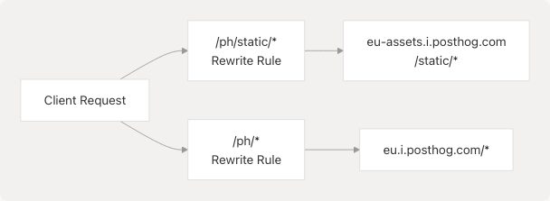
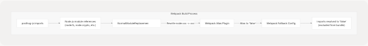

# Monitoring & Analytics

## Purpose and Scope

This document describes the monitoring and analytics infrastructure implemented in TalentSync. The system uses **PostHog** for product analytics and user behavior tracking. This page covers the client-side integration, proxy configuration, environment setup, and deployment considerations for the analytics system.

For information about deployment infrastructure, see [Deployment & Infrastructure](6-deployment-and-infrastructure). For environment configuration details, see [Environment Configuration](6.5-environment-configuration).

---

## Analytics Architecture Overview

TalentSync implements a privacy-focused analytics solution using PostHog EU Cloud, with a custom reverse proxy configuration to ensure reliable data collection by bypassing ad-blockers and tracking prevention mechanisms.


**Key Design Decisions:**

| Aspect | Implementation | Rationale |
| --- | --- | --- |
| **Analytics Provider** | PostHog EU Cloud | GDPR compliance, self-hostable alternative available |
| **Region** | EU (eu.i.posthog.com) | Data residency compliance for European users |
| **Proxy Strategy** | Next.js rewrites | Bypasses ad-blockers, first-party data collection |
| **SDK** | posthog-js v1.279.0 | Official client-side JavaScript SDK |
| **Initialization** | Client-side only | Browser-only analytics, no server-side tracking |

**Sources:** [frontend/package.json72](https://github.com/harleenkaur28/AI-Resume-Parser/blob/b2bbd83d/frontend/package.json#L72-L72) [frontend/instrumentation-client.ts1-12](https://github.com/harleenkaur28/AI-Resume-Parser/blob/b2bbd83d/frontend/instrumentation-client.ts#L1-L12) [frontend/next.config.js65-76](https://github.com/harleenkaur28/AI-Resume-Parser/blob/b2bbd83d/frontend/next.config.js#L65-L76)

---

## PostHog Client-Side Integration

### Initialization Configuration

PostHog is initialized on the client side using the `instrumentation-client.ts` file, which is automatically loaded by Next.js when the application starts in the browser.


**Implementation Details:**

The initialization occurs in [frontend/instrumentation-client.ts1-12](https://github.com/harleenkaur28/AI-Resume-Parser/blob/b2bbd83d/frontend/instrumentation-client.ts#L1-L12):

* **Browser-only initialization**: Uses `typeof window !== 'undefined'` check at line 3
* **API host**: Set to `/ph` (local proxy path) at line 5
* **UI host**: Set to `https://eu.posthog.com` at line 6
* **Project key**: Retrieved from `NEXT_PUBLIC_POSTHOG_KEY` environment variable at line 4

**Sources:** [frontend/instrumentation-client.ts1-12](https://github.com/harleenkaur28/AI-Resume-Parser/blob/b2bbd83d/frontend/instrumentation-client.ts#L1-L12)

---

## Proxy Configuration for Ad-Blocker Bypass

### Next.js Rewrite Rules

To ensure reliable analytics collection, TalentSync implements a reverse proxy using Next.js rewrites. This makes PostHog API calls appear as first-party requests, preventing ad-blockers from interfering.

**Proxy Routing Table:**

| Source Path | Destination | Purpose |
| --- | --- | --- |
| `/ph/static/:path*` | `https://eu-assets.i.posthog.com/static/:path*` | PostHog SDK static assets (JS files, etc.) |
| `/ph/:path*` | `https://eu.i.posthog.com/:path*` | Data ingestion API endpoints |

**Configuration:**



The rewrite configuration is defined in [frontend/next.config.js65-76](https://github.com/harleenkaur28/AI-Resume-Parser/blob/b2bbd83d/frontend/next.config.js#L65-L76):

* **Static assets rewrite** at lines 67-70: Handles PostHog SDK files and resources
* **API rewrite** at lines 71-74: Handles all data collection endpoints
* **Trailing slash support** at line 78: Required for PostHog API compatibility (`skipTrailingSlashRedirect: true`)

**Why This Matters:**

1. **Ad-blocker Evasion**: Requests to `/ph/*` appear as first-party, not blocked
2. **Performance**: Reduced DNS lookups, requests go through Next.js infrastructure
3. **Security**: Single domain origin, no CORS issues
4. **Privacy**: Data collection happens under your own domain

**Sources:** [frontend/next.config.js65-78](https://github.com/harleenkaur28/AI-Resume-Parser/blob/b2bbd83d/frontend/next.config.js#L65-L78)

---

## Environment Variables and Configuration

### Build-Time vs Runtime Variables

PostHog configuration uses **build-time environment variables** (prefixed with `NEXT_PUBLIC_`) that are embedded into the client-side JavaScript bundle during the Next.js build process.

**PostHog Environment Variables:**

| Variable | Type | Default | Purpose |
| --- | --- | --- | --- |
| `NEXT_PUBLIC_POSTHOG_KEY` | Build-time | *(required)* | PostHog project API key for authentication |
| `NEXT_PUBLIC_POSTHOG_HOST` | Build-time | `https://eu.i.posthog.com` | PostHog data ingestion endpoint |
| `NEXT_PUBLIC_POSTHOG_UI_HOST` | Build-time | `https://eu.posthog.com` | PostHog web UI dashboard URL |


### Docker Build Configuration

The Dockerfile explicitly declares these variables as build arguments to ensure they are available during the Next.js build:

**From [frontend/Dockerfile10-18](https://github.com/harleenkaur28/AI-Resume-Parser/blob/b2bbd83d/frontend/Dockerfile#L10-L18):**

* **ARG declarations** at lines 10-12: Define build arguments
* **ENV declarations** at lines 16-18: Make them available as environment variables during build
* These values are **baked into the client bundle** by Next.js

### Docker Compose Configuration

In production deployment, these values are passed during the Docker build process:

**From [docker-compose.prod.yaml37-40](https://github.com/harleenkaur28/AI-Resume-Parser/blob/b2bbd83d/docker-compose.prod.yaml#L37-L40):**

```
args:
  NEXT_PUBLIC_POSTHOG_KEY: ${NEXT_PUBLIC_POSTHOG_KEY}
  NEXT_PUBLIC_POSTHOG_UI_HOST: ${NEXT_PUBLIC_POSTHOG_UI_HOST:-https://eu.posthog.com}
  NEXT_PUBLIC_POSTHOG_HOST: ${NEXT_PUBLIC_POSTHOG_HOST:-https://eu.i.posthog.com}
```

**Sources:** [frontend/Dockerfile10-18](https://github.com/harleenkaur28/AI-Resume-Parser/blob/b2bbd83d/frontend/Dockerfile#L10-L18) [docker-compose.prod.yaml37-40](https://github.com/harleenkaur28/AI-Resume-Parser/blob/b2bbd83d/docker-compose.prod.yaml#L37-L40) [frontend/instrumentation-client.ts4-6](https://github.com/harleenkaur28/AI-Resume-Parser/blob/b2bbd83d/frontend/instrumentation-client.ts#L4-L6)

---

## Webpack Configuration for Browser Compatibility

PostHog's client-side SDK may attempt to import Node.js modules, which causes issues in browser builds. The Next.js configuration includes Webpack customizations to prevent these errors.



**Configuration Details from [frontend/next.config.js18-62](https://github.com/harleenkaur28/AI-Resume-Parser/blob/b2bbd83d/frontend/next.config.js#L18-L62):**

### Client-Side Build Only

The Webpack modifications apply only when `!isServer` (line 25), ensuring Node.js modules remain available in server-side builds.

### Three-Layer Protection

1. **Alias Configuration** (lines 28-37): Maps `node:*` imports to `false`

   * `node:child_process`, `node:fs`, `node:net`, `node:tls`, `node:crypto`, `node:path`
2. **Fallback Configuration** (lines 39-47): Provides fallbacks for plain module names

   * `child_process`, `fs`, `net`, `tls`, `crypto`, `path`
3. **Module Replacement Plugin** (lines 49-61): Rewrites `node:xxx` syntax to `xxx` syntax

   * Prevents Webpack's `UnhandledSchemeError` for `node:` URI scheme
   * Allows alias/fallback rules to apply correctly

**Why This Is Necessary:**

PostHog's JavaScript SDK may transitively depend on packages that check for Node.js module availability, causing build errors in browser environments. This configuration safely excludes those modules from the client bundle.

**Sources:** [frontend/next.config.js18-62](https://github.com/harleenkaur28/AI-Resume-Parser/blob/b2bbd83d/frontend/next.config.js#L18-L62)

---

## Analytics Data Flow

### Event Collection and Transmission


**Event Types Automatically Tracked:**

| Event Type | Description | Trigger |
| --- | --- | --- |
| `$pageview` | Page navigation | Automatic on route change |
| `$pageleave` | User leaves page | Automatic on navigation/close |
| `$autocapture` | Element interactions | Clicks, form submissions (if enabled) |
| Custom Events | Application-specific | Manual `posthog.capture()` calls |

**Session Management:**

* PostHog SDK maintains session state in browser localStorage
* Session includes: device type, browser, OS, referrer, UTM parameters
* User identity can be set via `posthog.identify(userId)`

**Sources:** [frontend/instrumentation-client.ts8-11](https://github.com/harleenkaur28/AI-Resume-Parser/blob/b2bbd83d/frontend/instrumentation-client.ts#L8-L11)

---

## Dependency Management

### PostHog SDK Package

The PostHog JavaScript SDK is declared as a production dependency in the frontend application:

**From [frontend/package.json72](https://github.com/harleenkaur28/AI-Resume-Parser/blob/b2bbd83d/frontend/package.json#L72-L72):**

```
"posthog-js": "^1.279.0"
```

**SDK Capabilities:**

* Event capture and batching
* Session recording (configurable)
* Feature flags support
* A/B testing infrastructure
* User identification and properties
* Automatic browser metadata collection

**Bundle Size Consideration:**

The PostHog SDK adds approximately **~50-60 KB** (minified + gzipped) to the client bundle. The proxy configuration ensures SDK scripts are cached effectively.

**Sources:** [frontend/package.json72](https://github.com/harleenkaur28/AI-Resume-Parser/blob/b2bbd83d/frontend/package.json#L72-L72) [frontend/bun.lock61](https://github.com/harleenkaur28/AI-Resume-Parser/blob/b2bbd83d/frontend/bun.lock#L61-L61)

---

## Production Deployment Configuration

### Multi-Stage Docker Build

The production Docker image ensures PostHog environment variables are available at build time:

**Build Stage ([frontend/Dockerfile1-48](https://github.com/harleenkaur28/AI-Resume-Parser/blob/b2bbd83d/frontend/Dockerfile#L1-L48)):**

1. **Builder stage** uses `oven/bun:1` base image
2. **Build arguments** declared at lines 10-12 for PostHog variables
3. **Environment variables** set at lines 16-18 to expose to Next.js build
4. **Next.js build** at line 48 embeds these values into client bundle

**Runtime Stage ([frontend/Dockerfile52-98](https://github.com/harleenkaur28/AI-Resume-Parser/blob/b2bbd83d/frontend/Dockerfile#L52-L98)):**

1. **Runner stage** uses `oven/bun:1-slim` for smaller image size
2. No runtime environment variables needed for PostHog (already embedded)
3. Application started with `bun run start` at line 98

### Docker Compose Integration

**From [docker-compose.prod.yaml33-55](https://github.com/harleenkaur28/AI-Resume-Parser/blob/b2bbd83d/docker-compose.prod.yaml#L33-L55):**

The frontend service configuration:

* **Build args** at lines 37-40: Pass PostHog variables from `.env` file
* **Environment** at line 45: Production Node environment
* **Networks** at lines 53-55: Connected to both internal network and nginx proxy

**Network Architecture:**


**Sources:** [frontend/Dockerfile10-18](https://github.com/harleenkaur28/AI-Resume-Parser/blob/b2bbd83d/frontend/Dockerfile#L10-L18) [frontend/Dockerfile52-98](https://github.com/harleenkaur28/AI-Resume-Parser/blob/b2bbd83d/frontend/Dockerfile#L52-L98) [docker-compose.prod.yaml33-55](https://github.com/harleenkaur28/AI-Resume-Parser/blob/b2bbd83d/docker-compose.prod.yaml#L33-L55)

---

## Security and Privacy Considerations

### Data Privacy

| Aspect | Implementation | Compliance |
| --- | --- | --- |
| **Data Region** | EU Cloud (eu.i.posthog.com) | GDPR-compliant data residency |
| **IP Anonymization** | Configurable in PostHog dashboard | Privacy-enhancing option |
| **PII Collection** | Not collected by default | Manual identification opt-in |
| **Data Retention** | Configurable per PostHog plan | Controlled retention periods |

### First-Party Data Collection

The proxy configuration at `/ph/*` ensures:

1. **Same-Origin Policy Compliance**: All requests appear to originate from `talentsync.tashif.codes`
2. **Cookie Scope**: PostHog cookies are first-party cookies under your domain
3. **Browser Storage**: localStorage and sessionStorage use your domain origin

### Client-Side Only Tracking

Analytics runs exclusively in the browser:

* **No server-side tracking**: Backend does not send events to PostHog
* **User control**: Users can disable JavaScript to prevent tracking
* **Transparency**: All analytics code is client-visible

**Configuration Check:**

From [frontend/instrumentation-client.ts3](https://github.com/harleenkaur28/AI-Resume-Parser/blob/b2bbd83d/frontend/instrumentation-client.ts#L3-L3):

```
if (typeof window !== 'undefined') {
  // PostHog only initialized in browser context
}
```

This guard ensures PostHog never attempts to initialize during server-side rendering.

**Sources:** [frontend/instrumentation-client.ts3-11](https://github.com/harleenkaur28/AI-Resume-Parser/blob/b2bbd83d/frontend/instrumentation-client.ts#L3-L11) [frontend/next.config.js65-76](https://github.com/harleenkaur28/AI-Resume-Parser/blob/b2bbd83d/frontend/next.config.js#L65-L76)

---

## Troubleshooting and Debugging

### Common Issues

| Issue | Cause | Solution |
| --- | --- | --- |
| PostHog not initializing | Missing `NEXT_PUBLIC_POSTHOG_KEY` | Ensure variable is set during build |
| Events not appearing | Ad-blocker interference | Verify `/ph/*` proxy is working |
| Build failures | Node.js module errors | Check Webpack config at [next.config.js18-62](https://github.com/harleenkaur28/AI-Resume-Parser/blob/b2bbd83d/next.config.js#L18-L62) |
| CORS errors | Incorrect proxy setup | Verify rewrite rules at [next.config.js65-76](https://github.com/harleenkaur28/AI-Resume-Parser/blob/b2bbd83d/next.config.js#L65-L76) |

### Verification Steps

1. **Check Environment Variables**:

   * Ensure `NEXT_PUBLIC_POSTHOG_KEY` is in `.env` file
   * Verify it's passed as build arg in `docker-compose.prod.yaml`
2. **Verify Proxy Configuration**:

   * Open browser DevTools → Network tab
   * Look for requests to `/ph/capture`
   * Should return 200 status, not 404 or CORS errors
3. **Confirm Initialization**:

   * Open browser console
   * Type `posthog` to inspect the initialized object
   * Should show PostHog instance with configuration
4. **Test Event Capture**:

   * Navigate between pages
   * Check PostHog dashboard for `$pageview` events
   * Verify events appear within 1-2 minutes

**Sources:** [frontend/instrumentation-client.ts1-12](https://github.com/harleenkaur28/AI-Resume-Parser/blob/b2bbd83d/frontend/instrumentation-client.ts#L1-L12) [frontend/next.config.js65-78](https://github.com/harleenkaur28/AI-Resume-Parser/blob/b2bbd83d/frontend/next.config.js#L65-L78)

---

## Summary

TalentSync's monitoring and analytics infrastructure provides:

* **Privacy-focused analytics** via PostHog EU Cloud with GDPR compliance
* **Reliable data collection** through first-party proxy configuration
* **Zero runtime configuration** with build-time environment embedding
* **Production-ready deployment** via Docker multi-stage builds
* **Ad-blocker resistant** tracking through Next.js rewrites

The system is designed for minimal overhead, strong privacy protection, and easy maintenance while providing comprehensive product analytics capabilities.
