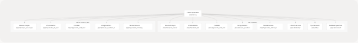
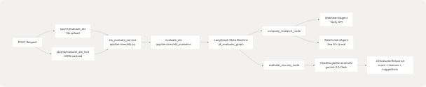
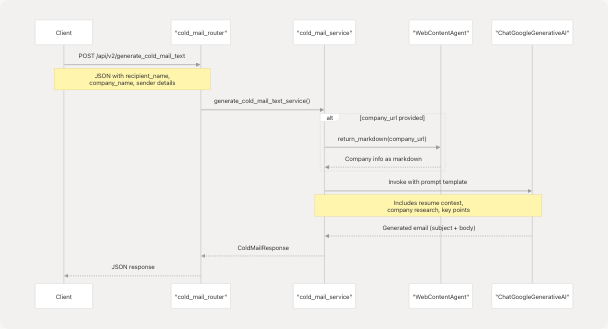

# API Documentation

Relevant source files

* [backend/app/agents/\_\_init\_\_.py](https://github.com/harleenkaur28/AI-Resume-Parser/blob/b2bbd83d/backend/app/agents/__init__.py)
* [backend/app/agents/github\_agent.py](https://github.com/harleenkaur28/AI-Resume-Parser/blob/b2bbd83d/backend/app/agents/github_agent.py)
* [backend/app/main.py](https://github.com/harleenkaur28/AI-Resume-Parser/blob/b2bbd83d/backend/app/main.py)
* [backend/app/models/schemas.py](https://github.com/harleenkaur28/AI-Resume-Parser/blob/b2bbd83d/backend/app/models/schemas.py)
* [backend/app/services/ats.py](https://github.com/harleenkaur28/AI-Resume-Parser/blob/b2bbd83d/backend/app/services/ats.py)
* [backend/app/services/linkedin\_profile.py](https://github.com/harleenkaur28/AI-Resume-Parser/blob/b2bbd83d/backend/app/services/linkedin_profile.py)
* [backend/app/services/tailored\_resume.py](https://github.com/harleenkaur28/AI-Resume-Parser/blob/b2bbd83d/backend/app/services/tailored_resume.py)
* [backend/experiment/exp.ipynb](https://github.com/harleenkaur28/AI-Resume-Parser/blob/b2bbd83d/backend/experiment/exp.ipynb)
* [backend/pyproject.toml](https://github.com/harleenkaur28/AI-Resume-Parser/blob/b2bbd83d/backend/pyproject.toml)
* [backend/requirements.txt](https://github.com/harleenkaur28/AI-Resume-Parser/blob/b2bbd83d/backend/requirements.txt)
* [backend/server.py](https://github.com/harleenkaur28/AI-Resume-Parser/blob/b2bbd83d/backend/server.py)
* [backend/uv.lock](https://github.com/harleenkaur28/AI-Resume-Parser/blob/b2bbd83d/backend/uv.lock)

This page provides comprehensive reference documentation for all backend API endpoints exposed by the TalentSync FastAPI server. It covers request/response formats, endpoint paths, HTTP methods, and Pydantic validation models. For information about the underlying AI services and processing logic, see [Backend Services](/harleenkaur28/AI-Resume-Parser/3-backend-services). For deployment configuration, see [Deployment & Infrastructure](/harleenkaur28/AI-Resume-Parser/6-deployment-and-infrastructure).

---

## API Architecture Overview

The TalentSync API is organized as a FastAPI application with modular routers. The main application is defined in `backend/app/main.py`, which includes multiple feature-specific routers under the `/api/v1` and `/api/v2` prefixes.

### Router Organization


```

**API Design Pattern**: The API provides two versions for most endpoints:

* **v1**: File-based endpoints that accept `multipart/form-data` with resume file uploads
* **v2**: Text-based endpoints that accept JSON payloads with resume text directly

Sources: [backend/app/main.py1-149](https://github.com/harleenkaur28/AI-Resume-Parser/blob/b2bbd83d/backend/app/main.py#L1-L149)

---

## Base Configuration

### FastAPI Application Setup

The main FastAPI application is configured with the following parameters:

```
```
app = FastAPI(
    title="TalentSync Normies API",
    description="API for analyzing resumes, extracting structured data, and providing tips for improvement.",
    version="1.5.8",
)
```
```

### CORS Configuration

All origins are allowed to facilitate frontend integration during development:

```
```
app.add_middleware(
    CORSMiddleware,
    allow_origins=["*"],
    allow_credentials=True,
    allow_methods=["*"],
    allow_headers=["*"],
)
```
```

Sources: [backend/app/main.py4-16](https://github.com/harleenkaur28/AI-Resume-Parser/blob/b2bbd83d/backend/app/main.py#L4-L16)

---

## Resume Analysis Endpoints

### File-Based Resume Analysis (v1)

**Endpoint**: `POST /api/v1/analyze_resume`  
**Content-Type**: `multipart/form-data`  
**Router**: `resume_file_based_router`

**Request Parameters**:

* `file` (UploadFile, required): Resume file (PDF, DOCX, TXT, or MD)
* Additional form fields as needed

**Response Model**: `ComprehensiveAnalysisResponse`

**Processing Flow**:

1. File text extraction via `process_document()` function
2. Text cleaning and NLP preprocessing with spaCy
3. TF-IDF vectorization and ML classification (predicts job category)
4. LLM-powered comprehensive analysis using `comprehensive_analysis_prompt_v2`
5. Structured data extraction (skills, experience, projects, education)

Sources: [backend/app/routes/resume\_analysis.py](https://github.com/harleenkaur28/AI-Resume-Parser/blob/b2bbd83d/backend/app/routes/resume_analysis.py) [backend/server.py764-899](https://github.com/harleenkaur28/AI-Resume-Parser/blob/b2bbd83d/backend/server.py#L764-L899)

---

### Text-Based Resume Analysis (v2)

**Endpoint**: `POST /api/v2/analyze_resume_text`  
**Content-Type**: `application/json`  
**Router**: `resume_text_based_router`

**Request Model**: JSON payload with:

* `resume_text` (string, required): Plain text of resume

**Response Model**: `FormattedAndAnalyzedResumeResponse`

**Response Structure**:

```
```
{
    "success": bool,
    "message": str,
    "cleaned_text": str,
    "analysis": {
        "name": str,
        "email": str,
        "contact": str,
        "predicted_field": str,
        "skills_analysis": [
            {
                "skill_name": str,
                "percentage": int  # 0-100
            }
        ],
        "recommended_roles": [str],
        "languages": [{"language": str}],
        "education": [{"education_detail": str}],
        "work_experience": [
            {
                "role": str,
                "company_and_duration": str,
                "bullet_points": [str]
            }
        ],
        "projects": [
            {
                "title": str,
                "technologies_used": [str],
                "description": str
            }
        ]
    }
}
```
```

Sources: [backend/app/routes/resume\_analysis.py](https://github.com/harleenkaur28/AI-Resume-Parser/blob/b2bbd83d/backend/app/routes/resume_analysis.py) [backend/app/models/schemas.py114-142](https://github.com/harleenkaur28/AI-Resume-Parser/blob/b2bbd83d/backend/app/models/schemas.py#L114-L142)

---

## ATS Evaluation Endpoints

### ATS Score Mapping to Code

```

```

### File-Based ATS Evaluation (v1)

**Endpoint**: `POST /api/v1/evaluate_ats`  
**Content-Type**: `multipart/form-data`

**Request Parameters**:

* `file` (UploadFile, required): Resume file
* `jd_text` (string, optional): Job description text
* `jd_link` (string, optional): Job description URL
* `company_name` (string, optional): Company name for research
* `company_website` (string, optional): Company website for context

**Note**: Either `jd_text` or `jd_link` must be provided.

Sources: [backend/app/routes/ats.py](https://github.com/harleenkaur28/AI-Resume-Parser/blob/b2bbd83d/backend/app/routes/ats.py)

---

### Text-Based ATS Evaluation (v2)

**Endpoint**: `POST /api/v2/evaluate_ats_text`  
**Content-Type**: `application/json`

**Request Model**: `JDEvaluatorRequest`

```
```
{
    "company_name": str,  # optional
    "company_website_content": str,  # optional
    "jd": str,  # required, min_length=1
    "jd_link": str,  # optional
    "resume": str  # required, min_length=1
}
```
```

**Response Model**: `JDEvaluatorResponse`

```
```
{
    "success": bool,
    "message": str,
    "score": int,  # 0-100
    "reasons_for_the_score": [str],
    "suggestions": [str]
}
```
```

**Processing Details**:

* If `jd_link` provided but no `jd_text`, fetches JD content via `WebContentAgent`
* Uses LangGraph state machine for multi-step workflow
* Optionally performs web research on company via `Tavily` search API
* Generates structured evaluation using Gemini 2.0 Flash LLM

Sources: [backend/app/services/ats.py24-214](https://github.com/harleenkaur28/AI-Resume-Parser/blob/b2bbd83d/backend/app/services/ats.py#L24-L214) [backend/app/models/schemas.py475-499](https://github.com/harleenkaur28/AI-Resume-Parser/blob/b2bbd83d/backend/app/models/schemas.py#L475-L499)

---

## Cold Mail Generator Endpoints

### Request/Response Flow

```

```

### File-Based Cold Mail (v1)

**Endpoint**: `POST /api/v1/generate_cold_mail`  
**Content-Type**: `multipart/form-data`

**Request Parameters**:

* `file` (UploadFile, required): Resume file
* `recipient_name` (string, required)
* `recipient_designation` (string, required)
* `company_name` (string, required)
* `sender_name` (string, required)
* `sender_role_or_goal` (string, required)
* `key_points_to_include` (string, required, min\_length=10)
* `additional_info_for_llm` (string, optional)
* `company_url` (string, optional)

Sources: [backend/app/routes/cold\_mail.py](https://github.com/harleenkaur28/AI-Resume-Parser/blob/b2bbd83d/backend/app/routes/cold_mail.py)

---

### Text-Based Cold Mail (v2)

**Endpoint**: `POST /api/v2/generate_cold_mail_text`  
**Content-Type**: `application/json`

**Request Model**: `ColdMailRequest` (extends base with resume\_text)

```
```
{
    "recipient_name": str,  # required
    "recipient_designation": str,  # required
    "company_name": str,  # required
    "sender_name": str,  # required
    "sender_role_or_goal": str,  # required
    "key_points_to_include": str,  # required, min 10 chars
    "additional_info_for_llm": str,  # optional
    "company_url": str,  # optional
    "resume_text": str  # required for v2
}
```
```

**Response Model**: `ColdMailResponse`

```
```
{
    "success": bool,
    "message": str,
    "subject": str,
    "body": str
}
```
```

**Features**:

* Automatic company research if `company_url` provided (via Jina AI r.jina.ai)
* Personalized email generation based on resume analysis
* Professional tone optimization
* Company-specific context integration

Sources: [backend/app/services/cold\_mail.py](https://github.com/harleenkaur28/AI-Resume-Parser/blob/b2bbd83d/backend/app/services/cold_mail.py) [backend/app/models/schemas.py241-287](https://github.com/harleenkaur28/AI-Resume-Parser/blob/b2bbd83d/backend/app/models/schemas.py#L241-L287)

---

## Hiring Assistant Endpoints

### File-Based Hiring Assistant (v1)

**Endpoint**: `POST /api/v1/answer_questions`  
**Content-Type**: `multipart/form-data`

**Request Parameters**:

* `file` (UploadFile, required): Resume file
* `role` (string, required, min\_length=1)
* `questions` (List[str], optional): Interview questions
* `company_name` (string, required, min\_length=1)
* `user_knowledge` (string, optional): User's existing knowledge
* `company_url` (string, optional): Company URL for research
* `word_limit` (int, optional, default=150, range: 50-500)

Sources: [backend/app/routes/hiring\_assistant.py](https://github.com/harleenkaur28/AI-Resume-Parser/blob/b2bbd83d/backend/app/routes/hiring_assistant.py)

---

### Text-Based Hiring Assistant (v2)

**Endpoint**: `POST /api/v2/answer_questions_text`  
**Content-Type**: `application/json`

**Request Model**: `HiringAssistantRequest` (extends base with resume\_text)

```
```
{
    "role": str,  # required
    "questions": [str],  # optional list
    "company_name": str,  # required
    "user_knowledge": str,  # optional
    "company_url": str,  # optional
    "word_limit": int,  # 50-500, default 150
    "resume_text": str  # required for v2
}
```
```

**Response Model**: `HiringAssistantResponse`

```
```
{
    "success": bool,
    "message": str,
    "data": {
        "question_1": str,
        "question_2": str,
        // ... one answer per question
    }
}
```
```

**Question Generation**: If no questions provided, default set includes:

* "Why do you want to work here?"
* "What are your strengths?"
* "Tell me about yourself"

**Processing Features**:

* Web research on company via `WebSearchAgent` (Tavily)
* Resume context integration
* Word-limited, role-specific answers
* STAR method formatting when appropriate

Sources: [backend/app/services/hiring\_assistant.py](https://github.com/harleenkaur28/AI-Resume-Parser/blob/b2bbd83d/backend/app/services/hiring_assistant.py) [backend/app/models/schemas.py204-239](https://github.com/harleenkaur28/AI-Resume-Parser/blob/b2bbd83d/backend/app/models/schemas.py#L204-L239)

---

## Tailored Resume Endpoints

### File-Based Tailored Resume (v1)

**Endpoint**: `POST /api/v1/generate_tailored_resume`  
**Content-Type**: `multipart/form-data`

**Request Parameters**:

* `file` (UploadFile, required): Resume file
* `job` (string, required): Target job role
* `company_name` (string, optional)
* `company_website` (string, optional)
* `job_description` (string, optional)

Sources: [backend/app/routes/tailored\_resume.py](https://github.com/harleenkaur28/AI-Resume-Parser/blob/b2bbd83d/backend/app/routes/tailored_resume.py)

---

### Text-Based Tailored Resume (v2)

**Endpoint**: `POST /api/v2/generate_tailored_resume_text`  
**Content-Type**: `application/json`

**Request Model**: `TailoredResumeRequest`

```
```
{
    "resume_text": str,  # required
    "job": str,  # required
    "company_name": str,  # optional
    "company_website": str,  # optional
    "job_description": str  # optional
}
```
```

**Response Model**: `ComprehensiveAnalysisResponse`

**LangGraph Workflow**:

```

```

**Features**:

* Job-specific optimization
* Company research integration via web search
* Keyword alignment with job description
* Maintains original achievements while reframing

Sources: [backend/app/services/tailored\_resume.py20-90](https://github.com/harleenkaur28/AI-Resume-Parser/blob/b2bbd83d/backend/app/services/tailored_resume.py#L20-L90) [backend/app/services/resume\_generator.py](https://github.com/harleenkaur28/AI-Resume-Parser/blob/b2bbd83d/backend/app/services/resume_generator.py)

---

## LinkedIn Services Endpoints

### LinkedIn Post Generation

**Endpoint**: `POST /api/v1/linkedin/generate-posts`  
**Content-Type**: `application/json`

**Request Model**: `PostGenerationRequest`

```
```
{
    "topic": str,  # required
    "tone": str,  # optional
    "audience": [str],  # optional
    "length": "Short" | "Medium" | "Long" | "Any",  # default: "Medium"
    "hashtags_option": str,  # default: "suggest"
    "cta_text": str,  # optional
    "mimic_examples": str,  # optional
    "language": str,  # optional
    "post_count": int,  # 1-5, default: 3
    "emoji_level": int,  # 0-3, default: 1
    "github_project_url": HttpUrl,  # optional
    "enable_research": bool  # default: true
}
```
```

**Response Model**: `PostGenerationResponse`

```
```
{
    "success": bool,
    "message": str,
    "posts": [
        {
            "text": str,
            "hashtags": [str],
            "cta_suggestion": str,
            "token_info": {},
            "sources": [
                {
                    "title": str,
                    "link": str
                }
            ],
            "github_project_name": str  # if GitHub URL provided
        }
    ],
    "timestamp": str
}
```
```

**Optional Features**:

* GitHub project analysis via `GitHubAgent` (uses `gitingest` library)
* Web research via `WebSearchAgent` (Tavily)
* Multi-post generation with varied angles
* Automatic hashtag suggestions

Sources: [backend/app/routes/linkedin.py](https://github.com/harleenkaur28/AI-Resume-Parser/blob/b2bbd83d/backend/app/routes/linkedin.py) [backend/app/services/linkedin\_post.py](https://github.com/harleenkaur28/AI-Resume-Parser/blob/b2bbd83d/backend/app/services/linkedin_post.py) [backend/app/models/schemas.py360-403](https://github.com/harleenkaur28/AI-Resume-Parser/blob/b2bbd83d/backend/app/models/schemas.py#L360-L403)

---

### GitHub Project Analysis

**Endpoint**: `POST /api/v1/linkedin/analyze-github`  
**Content-Type**: `application/json`

**Request Model**: `GitHubAnalysisRequest`

```
```
{
    "github_url": HttpUrl  # required
}
```
```

**Response Model**: `GitHubAnalysisResponse`

```
```
{
    "success": bool,
    "repository_info": {
        "name": str,
        "description": str,
        "stars": int,
        "language": str,
        "topics": [str],
        // ... more GitHub metadata
    },
    "linkedin_insights": {
        "key_achievement": str,
        "technical_highlights": str,
        "impact_statement": str,
        "linkedin_hooks": [str],
        "suggested_hashtags": [str],
        "project_stats": {}
    },
    "timestamp": str
}
```
```

**Data Sources**:

1. GitHub REST API v3 (public repository data)
2. `gitingest` library for deep repository analysis (optional)
3. LLM analysis for LinkedIn-specific insights

Sources: [backend/app/agents/github\_agent.py90-160](https://github.com/harleenkaur28/AI-Resume-Parser/blob/b2bbd83d/backend/app/agents/github_agent.py#L90-L160) [backend/app/agents/github\_agent.py224-333](https://github.com/harleenkaur28/AI-Resume-Parser/blob/b2bbd83d/backend/app/agents/github_agent.py#L224-L333)

---

## Tips Generator Endpoint

**Endpoint**: `POST /api/v1/tips`  
**Content-Type**: `application/json`

**Request Parameters** (JSON):

* `job_category` (string, optional): Job field/category
* `skills_list` (List[str], optional): User's key skills

**Response Model**: `TipsResponse`

```
```
{
    "success": bool,
    "message": str,
    "data": {
        "resume_tips": [
            {
                "category": str,  # e.g., "Content", "Keywords"
                "advice": str
            }
        ],
        "interview_tips": [
            {
                "category": str,  # e.g., "Preparation", "Answering Questions"
                "advice": str
            }
        ]
    }
}
```
```

**Tip Categories**:

* Resume: Content, Formatting, Keywords, Impact, Tailoring
* Interview: Preparation, Behavioral Questions, STAR Method, Follow-up

**Prompt Template**: Uses `tips_generator_prompt` with job category and skills context.

Sources: [backend/app/routes/tips.py](https://github.com/harleenkaur28/AI-Resume-Parser/blob/b2bbd83d/backend/app/routes/tips.py) [backend/server.py465-500](https://github.com/harleenkaur28/AI-Resume-Parser/blob/b2bbd83d/backend/server.py#L465-L500) [backend/app/models/schemas.py144-158](https://github.com/harleenkaur28/AI-Resume-Parser/blob/b2bbd83d/backend/app/models/schemas.py#L144-L158)

---

## Database Operations Endpoints

### Get All Resumes

**Endpoint**: `GET /api/v1/resumes`  
**Query Parameters**: None

**Response Model**: `ResumeListResponse`

```
```
{
    "success": bool,
    "message": str,
    "data": [
        {
            "name": str,
            "email": str,
            "predicted_field": str,
            "skills": [str],
            // ... full ResumeAnalysis object
        }
    ],
    "count": int
}
```
```

Sources: [backend/app/routes/postgres.py](https://github.com/harleenkaur28/AI-Resume-Parser/blob/b2bbd83d/backend/app/routes/postgres.py)

---

### Get Resume by ID

**Endpoint**: `GET /api/v1/resumes/{resume_id}`  
**Path Parameters**:

* `resume_id` (integer, required)

**Response**: Single `ResumeAnalysis` object or 404 if not found.

---

### Get Resumes by Category

**Endpoint**: `GET /api/v1/resumes/category/{category}`  
**Path Parameters**:

* `category` (string, required): Job category/field

**Response Model**: `ResumeCategoryResponse`

```
```
{
    "success": bool,
    "message": str,
    "data": [ResumeAnalysis],
    "count": int,
    "category": str
}
```
```

Sources: [backend/app/routes/postgres.py](https://github.com/harleenkaur28/AI-Resume-Parser/blob/b2bbd83d/backend/app/routes/postgres.py)

---

## Pydantic Request/Response Models

### Core Data Models Summary Table

| Model | Purpose | Key Fields | Source |
| --- | --- | --- | --- |
| `ComprehensiveAnalysisData` | Full resume analysis structure | skills\_analysis, work\_experience, projects, education | [schemas.py114-135](https://github.com/harleenkaur28/AI-Resume-Parser/blob/b2bbd83d/schemas.py#L114-L135) |
| `JDEvaluatorRequest` | ATS evaluation input | company\_name, jd, resume | [schemas.py475-486](https://github.com/harleenkaur28/AI-Resume-Parser/blob/b2bbd83d/schemas.py#L475-L486) |
| `JDEvaluatorResponse` | ATS evaluation output | score, reasons\_for\_the\_score, suggestions | [schemas.py488-499](https://github.com/harleenkaur28/AI-Resume-Parser/blob/b2bbd83d/schemas.py#L488-L499) |
| `ColdMailRequest` | Cold email generation input | recipient\_name, company\_name, key\_points\_to\_include | [schemas.py241-280](https://github.com/harleenkaur28/AI-Resume-Parser/blob/b2bbd83d/schemas.py#L241-L280) |
| `ColdMailResponse` | Cold email output | subject, body | [schemas.py282-287](https://github.com/harleenkaur28/AI-Resume-Parser/blob/b2bbd83d/schemas.py#L282-L287) |
| `HiringAssistantRequest` | Interview prep input | role, questions, company\_name | [schemas.py204-233](https://github.com/harleenkaur28/AI-Resume-Parser/blob/b2bbd83d/schemas.py#L204-L233) |
| `HiringAssistantResponse` | Interview prep output | data (question -> answer mapping) | [schemas.py235-239](https://github.com/harleenkaur28/AI-Resume-Parser/blob/b2bbd83d/schemas.py#L235-L239) |
| `PostGenerationRequest` | LinkedIn post input | topic, tone, post\_count, github\_project\_url | [schemas.py360-375](https://github.com/harleenkaur28/AI-Resume-Parser/blob/b2bbd83d/schemas.py#L360-L375) |
| `PostGenerationResponse` | LinkedIn post output | posts[], timestamp | [schemas.py398-403](https://github.com/harleenkaur28/AI-Resume-Parser/blob/b2bbd83d/schemas.py#L398-L403) |

### Nested Model: SkillProficiency

Used in `ComprehensiveAnalysisData.skills_analysis`:

```
```
{
    "skill_name": str,  # e.g., "Python"
    "percentage": int   # 0-100, proficiency level
}
```
```

Sources: [backend/app/models/schemas.py55-58](https://github.com/harleenkaur28/AI-Resume-Parser/blob/b2bbd83d/backend/app/models/schemas.py#L55-L58)

---

### Nested Model: UIDetailedWorkExperienceEntry

Used in `ComprehensiveAnalysisData.work_experience`:

```
```
{
    "role": str,
    "company_and_duration": str,  # e.g., "Google | 2020 - Present"
    "bullet_points": [str]  # list of achievements
}
```
```

Sources: [backend/app/models/schemas.py60-64](https://github.com/harleenkaur28/AI-Resume-Parser/blob/b2bbd83d/backend/app/models/schemas.py#L60-L64)

---

### Nested Model: UIProjectEntry

Used in `ComprehensiveAnalysisData.projects`:

```
```
{
    "title": str,
    "technologies_used": [str],
    "live_link": str,  # optional
    "repo_link": str,  # optional
    "description": str
}
```
```

Sources: [backend/app/models/schemas.py66-72](https://github.com/harleenkaur28/AI-Resume-Parser/blob/b2bbd83d/backend/app/models/schemas.py#L66-L72)

---

## Error Handling

### Standard Error Response

All endpoints return errors in a consistent format:

```
```
{
    "detail": str  # Error message
}
```
```

**HTTP Status Codes**:

* `400`: Bad Request (validation errors, missing required fields)
* `404`: Not Found (resource doesn't exist)
* `500`: Internal Server Error (processing failures, LLM errors)

### Common Error Scenarios

| Error Type | Status Code | Example |
| --- | --- | --- |
| Missing required field | 400 | `"detail": "Field required"` |
| Invalid file format | 400 | `"detail": "Unsupported file type"` |
| LLM API failure | 500 | `"detail": "ATS evaluation failed: API timeout"` |
| Resume not found | 404 | `"detail": "Resume with ID 123 not found"` |

**Validation Errors**: FastAPI automatically validates requests using Pydantic models and returns 422 Unprocessable Entity with detailed field-level errors.

Sources: [backend/app/services/ats.py192-213](https://github.com/harleenkaur28/AI-Resume-Parser/blob/b2bbd83d/backend/app/services/ats.py#L192-L213) [backend/app/routes/cold\_mail.py](https://github.com/harleenkaur28/AI-Resume-Parser/blob/b2bbd83d/backend/app/routes/cold_mail.py)

---

## ML Model Integration Details

### TF-IDF Classifier Pipeline

```

```

**Model Files**:

* `backend/app/model/best_model.pkl`: Pre-trained scikit-learn classifier
* `backend/app/model/tfidf.pkl`: TF-IDF vectorizer fitted on training data
* `backend/app/model/nltk_data/`: NLTK corpus data (stopwords, punkt)

**Job Categories**: The classifier predicts one of 25 job categories including "Java Developer", "Data Science", "HR", "Mechanical Engineer", etc.

Sources: [backend/server.py714-750](https://github.com/harleenkaur28/AI-Resume-Parser/blob/b2bbd83d/backend/server.py#L714-L750) [backend/server.py660-711](https://github.com/harleenkaur28/AI-Resume-Parser/blob/b2bbd83d/backend/server.py#L660-L711)

---

## LLM Configuration

### Google Gemini Integration

**Model**: `gemini-2.0-flash` (default) or `gemini-2.0-flash-lite`  
**Framework**: LangChain (`langchain-google-genai`)  
**Temperature**: 0.1 (low randomness for consistency)

**Initialization**:

```
```
from langchain_google_genai import ChatGoogleGenerativeAI

llm = ChatGoogleGenerativeAI(
    model="gemini-2.0-flash",
    google_api_key=os.getenv("GOOGLE_API_KEY"),
    temperature=0.1,
)
```

**Environment Variable**: `GOOGLE_API_KEY` must be set in `.env` file.

Sources: [backend/app/core/llm.py](https://github.com/harleenkaur28/AI-Resume-Parser/blob/b2bbd83d/backend/app/core/llm.py) [backend/server.py68-86](https://github.com/harleenkaur28/AI-Resume-Parser/blob/b2bbd83d/backend/server.py#L68-L86)

---

## External Service Dependencies

### Tavily Search API

**Usage**: Web research for company information, industry trends  
**Environment Variable**: `TAVILY_API_KEY`  
**Integration**: Via `langchain-tavily` package  
**Endpoints Using Tavily**:

* ATS Evaluation (company research)
* Hiring Assistant (company research)
* LinkedIn Post Generation (topic research)

Sources: [backend/app/agents/websearch\_agent.py](https://github.com/harleenkaur28/AI-Resume-Parser/blob/b2bbd83d/backend/app/agents/websearch_agent.py)

---

### Jina AI Web Content Extraction

**Usage**: Convert URLs to clean markdown text  
**API Endpoint**: `https://r.jina.ai/{url}`  
**No Auth Required**: Public API  
**Use Cases**:

* Job description extraction from URLs
* Company website content scraping
* CORS bypass for content access

**Implementation**:

```
```
def return_markdown(url: str) -> str:
    response = requests.get(
        f"https://r.jina.ai/{url}",
        headers={"X-Return-Format": "markdown"}
    )
    return response.text
```
```

Sources: [backend/app/agents/web\_content\_agent.py](https://github.com/harleenkaur28/AI-Resume-Parser/blob/b2bbd83d/backend/app/agents/web_content_agent.py)

---

## API Versioning Strategy

### v1 (File Upload Endpoints)

* Accept `multipart/form-data`
* Require file upload for resume
* Extract text server-side using PyPDF2, python-docx
* Suitable for direct user uploads from frontend

### v2 (Text-Based Endpoints)

* Accept `application/json`
* Require resume text as string field
* No file processing overhead
* Suitable for integrations where text is already extracted

**Recommendation**: Use v2 for better performance if resume text is already available. Use v1 for traditional file upload UX.

Sources: [backend/app/main.py38-148](https://github.com/harleenkaur28/AI-Resume-Parser/blob/b2bbd83d/backend/app/main.py#L38-L148)

---

## OpenAPI/Swagger Documentation

FastAPI automatically generates interactive API documentation:

* **Swagger UI**: Available at `/docs` when server is running
* **ReDoc**: Available at `/redoc` when server is running
* **OpenAPI JSON Schema**: Available at `/openapi.json`

The auto-generated documentation includes:

* All endpoint paths and methods
* Request/response schemas with examples
* Validation rules and constraints
* Interactive "Try it out" functionality

Sources: FastAPI framework defaults