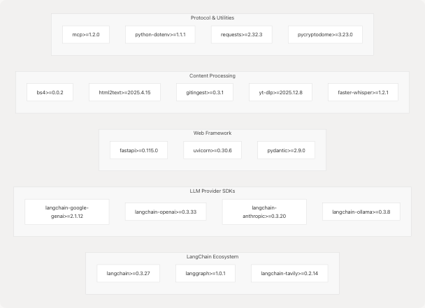

# Overview

- [.gitignore](https://github.com/tashifkhan/agentic-browser/blob/e94826c4/.gitignore)
- [.python-version](https://github.com/tashifkhan/agentic-browser/blob/e94826c4/.python-version)
- [LICENSE](https://github.com/tashifkhan/agentic-browser/blob/e94826c4/LICENSE)
- [README.md](https://github.com/tashifkhan/agentic-browser/blob/e94826c4/README.md)
- [core/config.py](https://github.com/tashifkhan/agentic-browser/blob/e94826c4/core/config.py)
- [main.py](https://github.com/tashifkhan/agentic-browser/blob/e94826c4/main.py)
- [pyproject.toml](https://github.com/tashifkhan/agentic-browser/blob/e94826c4/pyproject.toml)
- [routers/browser_use.py](https://github.com/tashifkhan/agentic-browser/blob/e94826c4/routers/browser_use.py)
- [tools/google_search/\_\_init\_\_.py](https://github.com/tashifkhan/agentic-browser/blob/e94826c4/tools/google_search/__init__.py)
- [tools/google_search/seach_agent.py](https://github.com/tashifkhan/agentic-browser/blob/e94826c4/tools/google_search/seach_agent.py)
- [uv.lock](https://github.com/tashifkhan/agentic-browser/blob/e94826c4/uv.lock)

## Purpose and Scope

This document provides a high-level introduction to the **Agentic Browser** system, a model-agnostic web automation platform that combines AI reasoning with browser interaction capabilities. The system operates in two distinct modes: as a FastAPI-based REST API server for HTTP-based interactions, and as an MCP (Model Context Protocol) server for agent orchestration. This page covers the system's architecture, operating modes, and core capabilities.

For detailed information about specific components:

- Installation and setup procedures: see [Getting Started](/tashifkhan/agentic-browser/2-getting-started)
- FastAPI backend implementation: see [Python Backend API](/tashifkhan/agentic-browser/3-python-backend-api)
- AI agent architecture and reasoning: see [Agent Intelligence System](/tashifkhan/agentic-browser/4-agent-intelligence-system)
- Browser extension implementation: see [Browser Extension](/tashifkhan/agentic-browser/5-browser-extension)

**Sources:** [README.md1-118](https://github.com/tashifkhan/agentic-browser/blob/e94826c4/README.md#L1-L118) [main.py1-58](https://github.com/tashifkhan/agentic-browser/blob/e94826c4/main.py#L1-L58) [pyproject.toml1-33](https://github.com/tashifkhan/agentic-browser/blob/e94826c4/pyproject.toml#L1-L33)

## System Architecture Overview

The Agentic Browser implements a modular architecture with three primary operational layers:

1. **Entry Layer**: Dual-mode entry points via `main.py` supporting both API server and MCP server modes
2. **Intelligence Layer**: LangGraph-based agent orchestration with 11+ specialized tools for web automation, content processing, and external service integration
3. **Execution Layer**: Browser extension with TypeScript frontend and Python Flask backend for DOM manipulation and web interaction

The system is designed around two key architectural principles:

- **Model Agnosticism**: Support for multiple LLM providers (Google Gemini, OpenAI, Anthropic, Ollama, Deepseek, OpenRouter) through a unified abstraction layer
- **Bring Your Own Keys (BYOKeys)**: No vendor lock-in; users supply their own API keys via environment variables

**Sources:** [main.py1-58](https://github.com/tashifkhan/agentic-browser/blob/e94826c4/main.py#L1-L58) [README.md20-33](https://github.com/tashifkhan/agentic-browser/blob/e94826c4/README.md#L20-L33) [pyproject.toml7-28](https://github.com/tashifkhan/agentic-browser/blob/e94826c4/pyproject.toml#L7-L28)

## System Entry Points and Modes


**Diagram: Entry Point Architecture**

The application entry point is defined in [main.py11-57](https://github.com/tashifkhan/agentic-browser/blob/e94826c4/main.py#L11-L57) with the following execution paths:

| Mode                    | Invocation             | Function Called           | Purpose                                   |
| ----------------------- | ---------------------- | ------------------------- | ----------------------------------------- |
| API Server              | `python main.py --api` | `api.run.run()`           | Starts FastAPI server with REST endpoints |
| MCP Server              | `python main.py --mcp` | `mcp_server.server.run()` | Starts Model Context Protocol server      |
| Interactive             | `python main.py`       | User prompted             | Prompts user to select mode               |
| Default Non-Interactive | `python main.py --yes` | `api.run.run()`           | Defaults to API mode                      |

**Sources:** [main.py11-57](https://github.com/tashifkhan/agentic-browser/blob/e94826c4/main.py#L11-L57) [pyproject.toml30-32](https://github.com/tashifkhan/agentic-browser/blob/e94826c4/pyproject.toml#L30-L32)

## Core Dependencies and Technology Stack



**Diagram: Dependency Graph by Category**

The system is built on the following technology stack:

| Category                | Technologies                                                                    | Purpose                                                    |
| ----------------------- | ------------------------------------------------------------------------------- | ---------------------------------------------------------- |
| **Agent Orchestration** | LangChain, LangGraph                                                            | Multi-step reasoning, tool orchestration, state management |
| **LLM Providers**       | langchain-google-genai, langchain-openai, langchain-anthropic, langchain-ollama | Model-agnostic LLM access                                  |
| **Web Framework**       | FastAPI, Uvicorn, Pydantic                                                      | REST API server, request validation                        |
| **Search & Retrieval**  | langchain-tavily, googlesearch-python                                           | Web search integration                                     |
| **Content Extraction**  | BeautifulSoup4, html2text, gitingest                                            | HTML parsing, repository crawling                          |
| **Media Processing**    | yt-dlp, faster-whisper                                                          | YouTube subtitle/transcript extraction                     |
| **Protocol**            | mcp                                                                             | Model Context Protocol compliance                          |
| **Security**            | pycryptodome, python-dotenv                                                     | Encryption, environment variable management                |

**Sources:** [pyproject.toml7-28](https://github.com/tashifkhan/agentic-browser/blob/e94826c4/pyproject.toml#L7-L28) [uv.lock10-58](https://github.com/tashifkhan/agentic-browser/blob/e94826c4/uv.lock#L10-L58)

## Dual-Mode Architecture

### API Server Mode

When launched with `--api`, the system starts a FastAPI application that exposes HTTP endpoints for:

- **Service Integration Routers**: GitHub repository analysis, YouTube video processing, website content extraction, Gmail operations, Google Calendar management, PyJIIT webportal access
- **Agent Routers**: React Agent for conversational AI with tool use, Browser Use Agent for script generation
- **Utility Routers**: Health monitoring, website validation for prompt injection detection

The API server listens on the host and port defined in environment variables `BACKEND_HOST` and `BACKEND_PORT` (defaults: `0.0.0.0:5454`).

**Sources:** [core/config.py8-11](https://github.com/tashifkhan/agentic-browser/blob/e94826c4/core/config.py#L8-L11) [README.md59-68](https://github.com/tashifkhan/agentic-browser/blob/e94826c4/README.md#L59-L68)

### MCP Server Mode

When launched with `--mcp`, the system starts a Model Context Protocol server that provides agent orchestration capabilities through the MCP framework. This mode is designed for integration with MCP-compliant clients and enables structured agent-to-agent communication.

**Sources:** [main.py43-44](https://github.com/tashifkhan/agentic-browser/blob/e94826c4/main.py#L43-L44) [README.md29](https://github.com/tashifkhan/agentic-browser/blob/e94826c4/README.md#L29-L29) [pyproject.toml20](https://github.com/tashifkhan/agentic-browser/blob/e94826c4/pyproject.toml#L20-L20)

## Core Capabilities


**Diagram: Core Capabilities by Category**

The system provides the following integrated capabilities:

### 1. AI-Assisted Web Automation

- **Conversational Agent**: React Agent with multi-turn reasoning using LangGraph state machines
- **Script Generation**: Browser Use Agent generates structured JSON action plans for browser automation
- **Tool Orchestration**: Dynamic tool selection based on available authentication context

### 2. Content Extraction and Processing

- **Web Search**: Integration with TavilySearch API for web search and content retrieval ([tools/google_search/seach_agent.py11-62](https://github.com/tashifkhan/agentic-browser/blob/e94826c4/tools/google_search/seach_agent.py#L11-L62))
- **Website Processing**: HTML to Markdown conversion with BeautifulSoup for content extraction
- **GitHub Repository Analysis**: Repository crawling and Q&A using gitingest
- **YouTube Video Processing**: Subtitle/transcript extraction using yt-dlp and faster-whisper

### 3. External Service Integration

- **Gmail**: Email reading, sending, and management via Google API with OAuth token handling
- **Google Calendar**: Event listing and creation
- **PyJIIT Webportal**: Encrypted session management and attendance data retrieval

### 4. Model-Agnostic LLM Support

The system implements a unified `LargeLanguageModel` abstraction layer supporting:

- Google Gemini (via `langchain-google-genai`)
- OpenAI GPT models (via `langchain-openai`)
- Anthropic Claude (via `langchain-anthropic`)
- Ollama local models (via `langchain-ollama`)
- Deepseek and OpenRouter (via OpenAI-compatible API)

All API keys are managed through environment variables defined in `.env` files, ensuring no vendor lock-in.

**Sources:** [pyproject.toml7-28](https://github.com/tashifkhan/agentic-browser/blob/e94826c4/pyproject.toml#L7-L28) [README.md34-55](https://github.com/tashifkhan/agentic-browser/blob/e94826c4/README.md#L34-L55) [tools/google_search/seach_agent.py1-84](https://github.com/tashifkhan/agentic-browser/blob/e94826c4/tools/google_search/seach_agent.py#L1-L84) [routers/browser_use.py1-51](https://github.com/tashifkhan/agentic-browser/blob/e94826c4/routers/browser_use.py#L1-L51)

## Configuration and Environment

The system loads configuration from environment variables using `python-dotenv`. Key configuration parameters include:

| Variable            | Purpose                              | Default                            | Source                                                                                                 |
| ------------------- | ------------------------------------ | ---------------------------------- | ------------------------------------------------------------------------------------------------------ |
| `ENV`               | Environment (development/production) | `development`                      | [core/config.py8](https://github.com/tashifkhan/agentic-browser/blob/e94826c4/core/config.py#L8-L8)    |
| `DEBUG`             | Debug logging level                  | `True` in development              | [core/config.py9](https://github.com/tashifkhan/agentic-browser/blob/e94826c4/core/config.py#L9-L9)    |
| `BACKEND_HOST`      | API server host                      | `0.0.0.0`                          | [core/config.py10](https://github.com/tashifkhan/agentic-browser/blob/e94826c4/core/config.py#L10-L10) |
| `BACKEND_PORT`      | API server port                      | `5454`                             | [core/config.py11](https://github.com/tashifkhan/agentic-browser/blob/e94826c4/core/config.py#L11-L11) |
| `GOOGLE_API_KEY`    | Google services API key              | Required for Gemini/Gmail/Calendar | [core/config.py14](https://github.com/tashifkhan/agentic-browser/blob/e94826c4/core/config.py#L14-L14) |
| `TAVILY_API_KEY`    | Web search API key                   | Required for web search            | Implicit in tavily-search                                                                              |
| `OPENAI_API_KEY`    | OpenAI API access                    | Required for GPT models            | LangChain convention                                                                                   |
| `ANTHROPIC_API_KEY` | Anthropic API access                 | Required for Claude models         | LangChain convention                                                                                   |

Logging is configured based on the `DEBUG` setting, with `logging.DEBUG` level in development and `logging.INFO` in production ([core/config.py17-18](https://github.com/tashifkhan/agentic-browser/blob/e94826c4/core/config.py#L17-L18)).

**Sources:** [core/config.py1-26](https://github.com/tashifkhan/agentic-browser/blob/e94826c4/core/config.py#L1-L26) [main.py7-8](https://github.com/tashifkhan/agentic-browser/blob/e94826c4/main.py#L7-L8)

## Repository Structure

The project follows a modular structure with clear separation of concerns:

```
agentic-browser/
├── main.py                     # CLI entry point with mode selection
├── pyproject.toml              # Project dependencies and metadata
├── uv.lock                     # Locked dependency versions
├── core/
│   └── config.py               # Configuration and logging setup
├── api/
│   ├── main.py                 # FastAPI application
│   └── run.py                  # API server runner
├── routers/                    # FastAPI route handlers
│   ├── browser_use.py          # Browser Use Agent endpoint
│   └── ...                     # Other routers (GitHub, Gmail, etc.)
├── services/                   # Business logic layer
│   ├── browser_use_service.py  # Script generation service
│   └── ...                     # Other services
├── tools/                      # Reusable tool modules
│   ├── google_search/          # Web search integration
│   └── ...                     # Other tools
├── models/                     # Pydantic data models
│   ├── requests/               # Request models
│   └── response/               # Response models
├── mcp_server/                 # MCP server implementation
│   └── server.py               # MCP server entry point
└── extension/                  # Browser extension
    ├── background/             # TypeScript background scripts
    ├── content/                # Content scripts
    └── backend_service.py      # Python Flask backend
```

The architecture follows a layered pattern:

1. **Entry Layer**: `main.py` → `api.run` or `mcp_server.server`
2. **Router Layer**: FastAPI routers in `routers/` directory
3. **Service Layer**: Business logic in `services/` directory
4. **Tool Layer**: Reusable utilities in `tools/` directory
5. **Model Layer**: Pydantic schemas in `models/` directory

**Sources:** [main.py1-58](https://github.com/tashifkhan/agentic-browser/blob/e94826c4/main.py#L1-L58) [routers/browser_use.py1-51](https://github.com/tashifkhan/agentic-browser/blob/e94826c4/routers/browser_use.py#L1-L51) [tools/google_search/seach_agent.py1-84](https://github.com/tashifkhan/agentic-browser/blob/e94826c4/tools/google_search/seach_agent.py#L1-L84)
