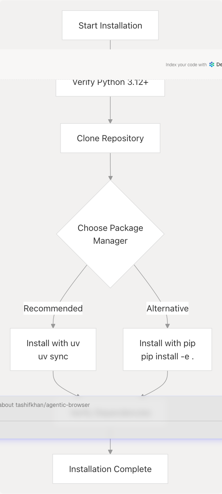
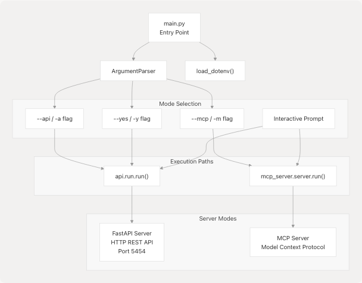

# Getting Started

Relevant source files

- [.python-version](https://github.com/tashifkhan/agentic-browser/blob/e94826c4/.python-version)
- [core/config.py](https://github.com/tashifkhan/agentic-browser/blob/e94826c4/core/config.py)
- [main.py](https://github.com/tashifkhan/agentic-browser/blob/e94826c4/main.py)
- [pyproject.toml](https://github.com/tashifkhan/agentic-browser/blob/e94826c4/pyproject.toml)
- [routers/browser_use.py](https://github.com/tashifkhan/agentic-browser/blob/e94826c4/routers/browser_use.py)
- [tools/google_search/\_\_init\_\_.py](https://github.com/tashifkhan/agentic-browser/blob/e94826c4/tools/google_search/__init__.py)
- [tools/google_search/seach_agent.py](https://github.com/tashifkhan/agentic-browser/blob/e94826c4/tools/google_search/seach_agent.py)
- [uv.lock](https://github.com/tashifkhan/agentic-browser/blob/e94826c4/uv.lock)

This guide walks you through the initial setup and execution of the Agentic Browser system. You will learn how to install dependencies, configure environment variables, and run the application in either API server mode or MCP (Model Context Protocol) server mode.

For detailed information about specific components:

- For dependency details and package management, see [Installation and Dependencies](/tashifkhan/agentic-browser/2.1-installation-and-dependencies)
- For comprehensive environment variable configuration, see [Configuration and Environment Variables](/tashifkhan/agentic-browser/2.2-configuration-and-environment-variables)
- For detailed runtime options and command-line arguments, see [Running the Application](/tashifkhan/agentic-browser/2.3-running-the-application)

---

## Prerequisites

The Agentic Browser requires Python 3.12 or higher. The project uses `uv` for dependency management, though standard `pip` installation is also supported.

**Required:**

- Python 3.12+ (specified in [.python-version1](https://github.com/tashifkhan/agentic-browser/blob/e94826c4/.python-version#L1-L1))
- Package manager: `uv` (recommended) or `pip`

**Recommended:**

- Git (for cloning the repository)
- API keys for LLM providers (at minimum one of: Google Gemini, OpenAI, Anthropic, or Ollama)

Sources: [.python-version1](https://github.com/tashifkhan/agentic-browser/blob/e94826c4/.python-version#L1-L1) [pyproject.toml6](https://github.com/tashifkhan/agentic-browser/blob/e94826c4/pyproject.toml#L6-L6)

---

## Installation Overview



### Quick Installation Steps

1. **Verify Python version:**

   ```

   python --version # Should be 3.12 or higher


   ```

2. **Clone the repository:**

   ```
   git clone https://github.com/tashifkhan/agentic-browser
   cd agentic-browser
   ```

   ```

   ```

3. **Install dependencies:**

   ```
   # Using uv (recommended)
   uv sync
   ```

   # OR using pip

   ```
   pip install -e .
   ```

The project defines 28 core dependencies in [pyproject.toml7-28](https://github.com/tashifkhan/agentic-browser/blob/e94826c4/pyproject.toml#L7-L28) including:

- FastAPI and Uvicorn for the API server
- LangChain and LangGraph for agent orchestration
- Multiple LLM provider integrations (Google, OpenAI, Anthropic, Ollama)
- Specialized tools (gitingest, yt-dlp, faster-whisper, BeautifulSoup)

For a complete dependency breakdown, see [Installation and Dependencies](/tashifkhan/agentic-browser/2.1-installation-and-dependencies).

Sources: [pyproject.toml1-33](https://github.com/tashifkhan/agentic-browser/blob/e94826c4/pyproject.toml#L1-L33) [uv.lock1-59](https://github.com/tashifkhan/agentic-browser/blob/e94826c4/uv.lock#L1-L59)

---

## Configuration Setup

### Environment Variable Configuration Flow


### Essential Configuration

Create a `.env` file in the project root with the following structure:

| Variable Category     | Variables                | Required           | Default                      |
| --------------------- | ------------------------ | ------------------ | ---------------------------- |
| **Application**       | `ENV`                    | No                 | `development`                |
|                       | `DEBUG`                  | No                 | `true` (dev), `false` (prod) |
|                       | `BACKEND_HOST`           | No                 | `0.0.0.0`                    |
|                       | `BACKEND_PORT`           | No                 | `5454`                       |
| **LLM Providers**     | `GOOGLE_API_KEY`         | Conditional        | -                            |
|                       | `OPENAI_API_KEY`         | Conditional        | -                            |
|                       | `ANTHROPIC_API_KEY`      | Conditional        | -                            |
|                       | `OLLAMA_BASE_URL`        | Conditional        | -                            |
| **External Services** | `TAVILY_API_KEY`         | For web search     | -                            |
|                       | Google OAuth credentials | For Gmail/Calendar | -                            |

**Minimal `.env` example:**

```
ENV=development
DEBUG=true
GOOGLE_API_KEY=your_gemini_api_key_here
TAVILY_API_KEY=your_tavily_key_here
```

The configuration system loads environment variables through [core/config.py5-6](https://github.com/tashifkhan/agentic-browser/blob/e94826c4/core/config.py#L5-L6) using `dotenv.load_dotenv()`, then exposes them via getter functions like [core/config.py22-25](https://github.com/tashifkhan/agentic-browser/blob/e94826c4/core/config.py#L22-L25) for logging configuration.

For complete environment variable documentation and service-specific configuration, see [Configuration and Environment Variables](/tashifkhan/agentic-browser/2.2-configuration-and-environment-variables).

Sources: [core/config.py1-26](https://github.com/tashifkhan/agentic-browser/blob/e94826c4/core/config.py#L1-L26) [main.py7-8](https://github.com/tashifkhan/agentic-browser/blob/e94826c4/main.py#L7-L8)

---

## Running the Application

### Application Entry Point Architecture



### Starting the Application

The application has two operational modes, selected via command-line arguments in [main.py11-57](https://github.com/tashifkhan/agentic-browser/blob/e94826c4/main.py#L11-L57):

**API Server Mode (HTTP REST):**

```


# Explicit flag
python main.py --api

# OR short form
python main.py -a


```

**MCP Server Mode:**

```

# Explicit flag

python main.py --mcp

# OR short form

python main.py -m

```

**Interactive Mode:**

# No flags - prompts for choice

```
python main.py

```

**Non-interactive Default (API):**

```


# Uses API mode by default without prompt

python main.py --yes

# OR

python main.py -y

```

### Mode Selection Logic

The [main.py39-53](https://github.com/tashifkhan/agentic-browser/blob/e94826c4/main.py#L39-L53) implements a priority-based decision tree:

1. If `--api` flag present → Start API server
2. Else if `--mcp` flag present → Start MCP server
3. Else if `--yes` flag present → Default to API server
4. Else → Prompt user interactively

Sources: [main.py1-58](https://github.com/tashifkhan/agentic-browser/blob/e94826c4/main.py#L1-L58)

---

## Verification

### API Server Mode Verification

Once the API server starts, verify it's running:

```

# Test health endpoint

curl http://localhost:5454/health

# Expected response:

# {"status": "ok"}


```

The API server exposes 11+ routers covering:

- Health monitoring
- GitHub repository analysis
- Website content processing
- YouTube video processing
- Google web search
- Gmail integration
- Calendar integration
- PyJIIT webportal access
- React Agent (conversational AI)
- Website validator
- Browser automation script generation

### MCP Server Mode Verification

The MCP server operates over stdio and integrates with Claude Desktop or other MCP-compatible clients. Verify by checking that the process starts without errors and accepts stdin/stdout communication.

### Configuration Verification


Verify configuration loading by checking the logs. The logging system configured in [core/config.py16-25](https://github.com/tashifkhan/agentic-browser/blob/e94826c4/core/config.py#L16-L25) will output:

- `DEBUG` level logs in development mode (`ENV=development`)
- `INFO` level logs in production mode (`ENV=production`)

Sources: [core/config.py8-25](https://github.com/tashifkhan/agentic-browser/blob/e94826c4/core/config.py#L8-L25) [main.py1-8](https://github.com/tashifkhan/agentic-browser/blob/e94826c4/main.py#L1-L8)

---

## Common Issues

### Missing Dependencies

If you encounter import errors:

```
# Reinstall dependencies
uv sync --reinstall
# OR
pip install -e . --force-reinstall
```

### Environment Variable Not Found

The application uses [core/config.py5-6](https://github.com/tashifkhan/agentic-browser/blob/e94826c4/core/config.py#L5-L6) to load `.env` files. Ensure:

1. `.env` file exists in project root
2. Variables are in `KEY=value` format (no quotes needed)
3. No spaces around `=` sign

### Port Already in Use

If port 5454 is occupied, set a different port:

```

BACKEND_PORT=8080 python main.py --api

```

The port configuration is read from [core/config.py11](https://github.com/tashifkhan/agentic-browser/blob/e94826c4/core/config.py#L11-L11) with default value `5454`.

---

## Next Steps

After successfully starting the application:

1. **Explore the API**: Review [FastAPI Application and Router Architecture](/tashifkhan/agentic-browser/3.2-fastapi-application-and-router-architecture) for available endpoints
2. **Configure Integrations**: See [Configuration and Environment Variables](/tashifkhan/agentic-browser/2.2-configuration-and-environment-variables) for service-specific setup
3. **Understand Agents**: Learn about the [Agent Intelligence System](/tashifkhan/agentic-browser/4-agent-intelligence-system) for AI capabilities
4. **Try the Extension**: Set up the [Browser Extension](/tashifkhan/agentic-browser/5-browser-extension) for frontend automation

Sources: [main.py1-58](https://github.com/tashifkhan/agentic-browser/blob/e94826c4/main.py#L1-L58) [core/config.py1-26](https://github.com/tashifkhan/agentic-browser/blob/e94826c4/core/config.py#L1-L26) [pyproject.toml1-33](https://github.com/tashifkhan/agentic-browser/blob/e94826c4/pyproject.toml#L1-L33)
