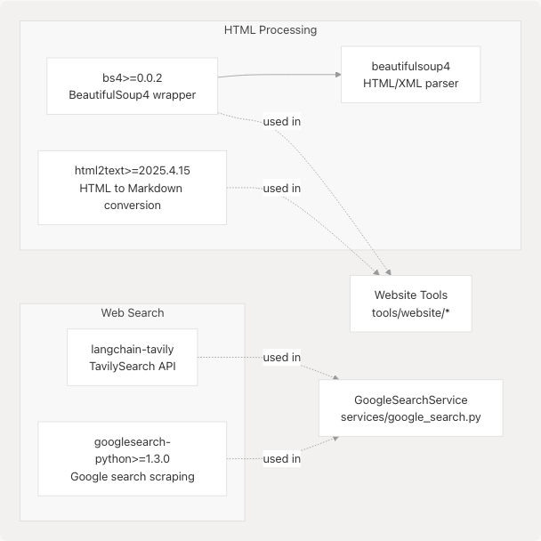
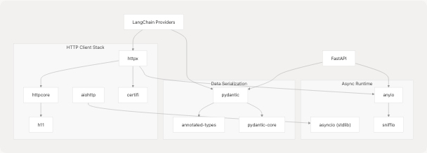

# Installation and Dependencies

Relevant source files

* [core/config.py](https://github.com/tashifkhan/agentic-browser/blob/e94826c4/core/config.py)
* [pyproject.toml](https://github.com/tashifkhan/agentic-browser/blob/e94826c4/pyproject.toml)
* [tools/google\_search/\_\_init\_\_.py](https://github.com/tashifkhan/agentic-browser/blob/e94826c4/tools/google_search/__init__.py)
* [tools/google\_search/seach\_agent.py](https://github.com/tashifkhan/agentic-browser/blob/e94826c4/tools/google_search/seach_agent.py)
* [uv.lock](https://github.com/tashifkhan/agentic-browser/blob/e94826c4/uv.lock)

## Purpose and Scope

This page documents the installation process and dependency requirements for the Agentic Browser project. It covers Python version requirements, the package management approach using `uv`, and the categorization of dependencies that support the system's multi-mode architecture (API server, MCP server, and browser extension backend).

For information about configuring environment variables and API keys after installation, see [Configuration and Environment Variables](/tashifkhan/agentic-browser/2.2-configuration-and-environment-variables). For instructions on running the application after installation, see [Running the Application](/tashifkhan/agentic-browser/2.3-running-the-application).

---

## Prerequisites

### Python Version Requirements

The Agentic Browser requires **Python 3.12 or higher**. This requirement is specified in [pyproject.toml6](https://github.com/tashifkhan/agentic-browser/blob/e94826c4/pyproject.toml#L6-L6):

```
```
requires-python = ">=3.12"
```
```

### Package Manager: uv

The project uses `uv` as its package manager and dependency resolver. The `uv.lock` file pins exact versions of all dependencies and their transitive dependencies, ensuring reproducible builds across environments. The lock file tracks dependencies for Python 3.12 and 3.13 with separate resolution markers [uv.lock1-7](https://github.com/tashifkhan/agentic-browser/blob/e94826c4/uv.lock#L1-L7)

Sources: [pyproject.toml6](https://github.com/tashifkhan/agentic-browser/blob/e94826c4/pyproject.toml#L6-L6) [uv.lock1-7](https://github.com/tashifkhan/agentic-browser/blob/e94826c4/uv.lock#L1-L7)

---

## Dependency Overview

### Core Dependency Categories

The project's dependencies fall into six primary categories:

| Category | Purpose | Key Dependencies |
| --- | --- | --- |
| **AI/LLM Integration** | Multi-provider LLM support and agent orchestration | `langchain`, `langchain-google-genai`, `langchain-openai`, `langchain-anthropic`, `langchain-ollama`, `langchain-tavily`, `langgraph` |
| **Web Framework** | HTTP API server and routing | `fastapi`, `uvicorn` |
| **Data Validation** | Request/response schemas and type safety | `pydantic[email]` |
| **Web Content Processing** | HTML parsing, content extraction, web search | `bs4`, `html2text`, `googlesearch-python` |
| **Media Processing** | YouTube video transcription and subtitle extraction | `yt-dlp`, `faster-whisper` |
| **Code Repository Analysis** | GitHub repository crawling | `gitingest` |
| **Security & Utilities** | Environment management, encryption, HTTP requests | `python-dotenv`, `pycryptodome`, `requests` |
| **MCP Server** | Model Context Protocol server mode | `mcp` |

Sources: [pyproject.toml7-28](https://github.com/tashifkhan/agentic-browser/blob/e94826c4/pyproject.toml#L7-L28)

---

### Complete Dependency List

The following dependencies are declared in `pyproject.toml` [pyproject.toml7-28](https://github.com/tashifkhan/agentic-browser/blob/e94826c4/pyproject.toml#L7-L28):


```

Sources: [pyproject.toml7-28](https://github.com/tashifkhan/agentic-browser/blob/e94826c4/pyproject.toml#L7-L28)

---

## LangChain Ecosystem Dependencies

The project heavily relies on the LangChain ecosystem for AI agent capabilities. The following diagram shows the relationship between LangChain core and provider-specific adapters:

```

```

**Key LangChain Components:**

* **`langchain`**: Core library providing abstractions for messages, prompts, chains, and tools
* **`langgraph`**: State machine framework for building complex agent workflows with conditional routing and cycles
* **Provider adapters**: Model-specific implementations conforming to LangChain's `BaseChatModel` interface
* **`langchain-tavily`**: Integration with Tavily web search API for real-time information retrieval

Sources: [pyproject.toml11-26](https://github.com/tashifkhan/agentic-browser/blob/e94826c4/pyproject.toml#L11-L26) [tools/google\_search/seach\_agent.py5-11](https://github.com/tashifkhan/agentic-browser/blob/e94826c4/tools/google_search/seach_agent.py#L5-L11)

---

## Specialized Tool Dependencies

### Web Content Processing Stack

```

```

**Purpose:**

* **`bs4`/`beautifulsoup4`**: Parse HTML documents and extract structured content from web pages
* **`html2text`**: Convert HTML to clean Markdown format for LLM consumption
* **`googlesearch-python`**: Perform Google searches programmatically (fallback/alternative search method)

Sources: [pyproject.toml8-23](https://github.com/tashifkhan/agentic-browser/blob/e94826c4/pyproject.toml#L8-L23)

---

### Media Processing Tools

```

```

**Purpose:**

* **`yt-dlp`**: Download YouTube videos, extract subtitles, and retrieve video metadata
* **`faster-whisper`**: High-performance OpenAI Whisper implementation for audio transcription
* **`av`** (transitive dependency via `faster-whisper`): Extract audio streams from video files

These dependencies power the YouTube integration that enables video content Q&A capabilities.

Sources: [pyproject.toml26-27](https://github.com/tashifkhan/agentic-browser/blob/e94826c4/pyproject.toml#L26-L27) [uv.lock219-259](https://github.com/tashifkhan/agentic-browser/blob/e94826c4/uv.lock#L219-L259)

---

### Repository Analysis

```

```

**Purpose:**

* **`gitingest`**: Efficiently crawl and extract repository contents for AI analysis, handling directory structures, file filtering, and content aggregation

Sources: [pyproject.toml9](https://github.com/tashifkhan/agentic-browser/blob/e94826c4/pyproject.toml#L9-L9)

---

## Security and Utility Dependencies

### Core Utilities

| Dependency | Version | Purpose | Usage Example |
| --- | --- | --- | --- |
| `python-dotenv` | >=1.1.1 | Load environment variables from `.env` files | [core/config.py3-6](https://github.com/tashifkhan/agentic-browser/blob/e94826c4/core/config.py#L3-L6) |
| `pycryptodome` | >=3.23.0 | AES encryption for PyJIIT session tokens | PyJIIT authentication |
| `requests` | >=2.32.3 | HTTP client for external API calls | Various service integrations |
| `pydantic[email]` | >=2.9.0 | Data validation and serialization with email validation support | All request/response models |
| `mcp` | >=1.2.0 | Model Context Protocol server implementation | MCP server mode |

**Configuration Loading Example:**

The `python-dotenv` dependency is used to load environment variables at application startup [core/config.py3-6](https://github.com/tashifkhan/agentic-browser/blob/e94826c4/core/config.py#L3-L6):

```
```
import dotenv
dotenv.load_dotenv()

ENV = os.getenv("ENV", "development")
DEBUG = os.getenv("DEBUG", True if ENV == "development" else False)
```
```

Sources: [pyproject.toml16-22](https://github.com/tashifkhan/agentic-browser/blob/e94826c4/pyproject.toml#L16-L22) [core/config.py3-11](https://github.com/tashifkhan/agentic-browser/blob/e94826c4/core/config.py#L3-L11)

---

## Installation Steps

### Step 1: Install uv

Install the `uv` package manager if not already installed:

```
```
# macOS/Linux
curl -LsSf https://astral.sh/uv/install.sh | sh

# Windows
powershell -c "irm https://astral.sh/uv/install.ps1 | iex"

# Using pip
pip install uv
```
```

### Step 2: Clone the Repository

```
```
git clone https://github.com/tashifkhan/agentic-browser.git
cd agentic-browser
```
```

### Step 3: Install Dependencies

Using `uv`, install all dependencies from the lock file:

```
```
uv sync
```
```

This command:

* Creates a virtual environment (if not exists)
* Installs all dependencies specified in `pyproject.toml`
* Respects the exact versions pinned in `uv.lock` for reproducibility
* Installs the project itself in editable mode

**Alternative: Manual Installation with pip**

If you prefer using pip:

```
```
pip install -e .
```
```

This installs dependencies from `pyproject.toml` but without version locking.

Sources: [pyproject.toml1-33](https://github.com/tashifkhan/agentic-browser/blob/e94826c4/pyproject.toml#L1-L33) [uv.lock1-7](https://github.com/tashifkhan/agentic-browser/blob/e94826c4/uv.lock#L1-L7)

---

### Step 4: Verify Installation

Check that the project scripts are available:

```
```
# Check API server entry point
agentic-api-run --help

# Check MCP server entry point  
agentic-mcp --help
```
```

These commands correspond to the console scripts defined in [pyproject.toml30-32](https://github.com/tashifkhan/agentic-browser/blob/e94826c4/pyproject.toml#L30-L32):

```
```
[project.scripts]
agentic-api-run = "app.run:run"
agentic-mcp = "mcp_server.server:run"
```
```

Sources: [pyproject.toml30-32](https://github.com/tashifkhan/agentic-browser/blob/e94826c4/pyproject.toml#L30-L32)

---

## Transitive Dependencies

The lock file [uv.lock](https://github.com/tashifkhan/agentic-browser/blob/e94826c4/uv.lock) tracks hundreds of transitive dependencies. Key transitive dependency chains include:

```


**Notable Transitive Dependencies:**

* **`httpx`**: Modern async HTTP client used by LangChain provider libraries
* **`aiohttp`**: Alternative async HTTP client, used by some integrations [uv.lock70-152](https://github.com/tashifkhan/agentic-browser/blob/e94826c4/uv.lock#L70-L152)
* **`anyio`**: Async I/O abstraction layer supporting both asyncio and trio
* **`pydantic-core`**: Rust-based core for Pydantic's validation performance
* **`certifi`**: Mozilla's CA bundle for HTTPS certificate verification [uv.lock296-302](https://github.com/tashifkhan/agentic-browser/blob/e94826c4/uv.lock#L296-L302)
* **`attrs`**: Class attribute definition library used throughout the ecosystem [uv.lock210-216](https://github.com/tashifkhan/agentic-browser/blob/e94826c4/uv.lock#L210-L216)

Sources: [uv.lock60-303](https://github.com/tashifkhan/agentic-browser/blob/e94826c4/uv.lock#L60-L303)

---

## Development vs. Production Dependencies

The `pyproject.toml` currently specifies all dependencies as production dependencies. There is no separate `[project.optional-dependencies]` section for development-only tools.

**Implied Development Requirements:**

While not explicitly listed, development typically requires:

* **Code formatting**: `black`, `ruff`, or similar
* **Type checking**: `mypy`
* **Testing**: `pytest`, `pytest-asyncio`
* **Linting**: `flake8` or `ruff`

These may be added in a future `[project.optional-dependencies.dev]` section.

Sources: [pyproject.toml1-33](https://github.com/tashifkhan/agentic-browser/blob/e94826c4/pyproject.toml#L1-L33)

---

## Platform-Specific Considerations

### Operating System Support

The lock file includes platform-specific wheels for:

* **macOS**: `macosx_10_13_universal2`, `macosx_11_0_x86_64`, `macosx_14_0_arm64`
* **Linux**: `manylinux2014_x86_64`, `manylinux2014_aarch64`, `musllinux_1_2_x86_64`
* **Windows**: `win32`, `win_amd64`

Example from [uv.lock84-101](https://github.com/tashifkhan/agentic-browser/blob/e94826c4/uv.lock#L84-L101) showing `aiohttp` wheels for multiple platforms.

### Special Requirements

* **`faster-whisper`**: Requires system-level audio libraries. On some systems, may need:

  ```
  ```
  # Ubuntu/Debian
  apt-get install libavcodec-dev libavformat-dev libavutil-dev

  # macOS
  brew install ffmpeg
  ```
  ```
* **`yt-dlp`**: Works best with `ffmpeg` installed for post-processing video/audio streams

Sources: [uv.lock84-259](https://github.com/tashifkhan/agentic-browser/blob/e94826c4/uv.lock#L84-L259)

---

## Summary

The Agentic Browser's dependency stack is organized into layered categories supporting its dual-mode architecture:

1. **AI Layer**: LangChain ecosystem for multi-provider LLM support and agent orchestration
2. **Web Layer**: FastAPI for HTTP APIs with Pydantic validation
3. **Tool Layer**: Specialized libraries for web content, media processing, and repository analysis
4. **Infrastructure**: Security, configuration, and utility dependencies

Installation is streamlined through `uv` for reproducible builds, with all dependencies tracked in a comprehensive lock file. The modular dependency structure enables the system to operate in API server mode, MCP server mode, or as a browser extension backend.

For next steps, proceed to [Configuration and Environment Variables](/tashifkhan/agentic-browser/2.2-configuration-and-environment-variables) to set up API keys and environment settings, then [Running the Application](/tashifkhan/agentic-browser/2.3-running-the-application) to start the server.

Sources: [pyproject.toml1-33](https://github.com/tashifkhan/agentic-browser/blob/e94826c4/pyproject.toml#L1-L33) [uv.lock1-59](https://github.com/tashifkhan/agentic-browser/blob/e94826c4/uv.lock#L1-L59)