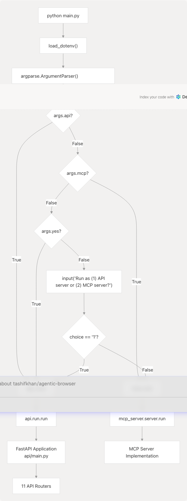
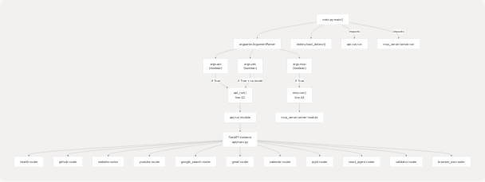

# Running the Application

## Purpose and Scope

This document explains how to start the Agentic Browser application using the `main.py` entry point. It covers the command-line interface, execution modes (API server vs MCP server), and the startup flow. For information about installing dependencies, see [Installation and Dependencies](2.1-installation-and-dependencies). For configuring API keys and environment variables, see [Configuration and Environment Variables](2.2-configuration-and-environment-variables).

**Sources:** [main.py1-58](https://github.com/tashifkhan/agentic-browser/blob/e94826c4/main.py#L1-L58)

## Prerequisites

Before running the application, ensure:

1. **Dependencies are installed** - All Python packages from `pyproject.toml` must be installed (see [Installation and Dependencies](2.1-installation-and-dependencies))
2. **Environment variables are configured** - A `.env` file with required API keys and configuration must exist (see [Configuration and Environment Variables](2.2-configuration-and-environment-variables))
3. **Python version** - Python 3.12 is required as specified in `.python-version`

**Sources:** [main.py7-8](https://github.com/tashifkhan/agentic-browser/blob/e94826c4/main.py#L7-L8) [.python-version1](https://github.com/tashifkhan/agentic-browser/blob/e94826c4/.python-version#L1-L1)

## Command-Line Interface

The application uses `main.py` as its entry point with the following command-line options:

| Flag | Long Form | Description |
| --- | --- | --- |
| `-a` | `--api` | Run as API server (FastAPI application) |
| `-m` | `--mcp` | Run as MCP server (Model Context Protocol) |
| `-y` | `--yes` | Non-interactive mode: defaults to API server if no mode specified |

These flags are mutually exclusive - you cannot specify both `-a` and `-m` simultaneously.

**Sources:** [main.py12-37](https://github.com/tashifkhan/agentic-browser/blob/e94826c4/main.py#L12-L37)

## Execution Modes

### API Server Mode

API server mode starts the FastAPI application with all HTTP routers enabled. This is the primary mode for:

* HTTP REST API interactions
* GitHub, YouTube, Gmail, Calendar integrations
* React Agent conversational AI
* Browser automation script generation
* Website validation and content processing

To start in API mode:

```
python main.py --api
```

or

```
python main.py -a
```

The application invokes `api_run()` from the `api.run` module, which initializes the FastAPI application defined in `api.main` with all registered routers.

**Sources:** [main.py2-42](https://github.com/tashifkhan/agentic-browser/blob/e94826c4/main.py#L2-L42)

### MCP Server Mode

MCP (Model Context Protocol) server mode starts the application as an MCP server for agent orchestration. This mode is used for:

* Integration with MCP-compatible clients
* Agent-to-agent communication
* Programmatic tool invocation

To start in MCP mode:

```
python main.py --mcp
```

or

```
python main.py -m
```

The application invokes `mcp.run()` from the `mcp_server.server` module, which starts the MCP server implementation.

**Sources:** [main.py1-44](https://github.com/tashifkhan/agentic-browser/blob/e94826c4/main.py#L1-L44)

### Interactive Mode

If no mode flag is provided, the application enters interactive mode and prompts the user to choose:

```
python main.py
```

The user is presented with:

```
Run as (1) API server or (2) MCP server? Enter 1 or 2:
```

* Entering `1` starts API server mode
* Entering `2` starts MCP server mode

**Sources:** [main.py49-53](https://github.com/tashifkhan/agentic-browser/blob/e94826c4/main.py#L49-L53)

### Non-Interactive Mode with Default

The `-y` or `--yes` flag enables non-interactive mode. When no mode is specified along with this flag, the application defaults to API server mode:

```
python main.py -y
```

This is useful for automated deployments or scripts where user input is not available.

**Sources:** [main.py32-47](https://github.com/tashifkhan/agentic-browser/blob/e94826c4/main.py#L32-L47)

## Application Startup Flow

### Execution Path Diagram



**Sources:** [main.py7-53](https://github.com/tashifkhan/agentic-browser/blob/e94826c4/main.py#L7-L53)

### Code Entity Mapping

The startup process involves the following code entities:



**Sources:** [main.py1-53](https://github.com/tashifkhan/agentic-browser/blob/e94826c4/main.py#L1-L53)

## Environment Variable Loading

The application loads environment variables from a `.env` file at startup using `load_dotenv()` from the `python-dotenv` library. This occurs **before** any command-line parsing or mode selection.

```
# Line 8 in main.py
load_dotenv()
```

This ensures all API keys, LLM provider credentials, and configuration settings are available regardless of which mode the application runs in. The `.env` file must contain:

* LLM provider API keys (Google, OpenAI, Anthropic, etc.)
* External service credentials (Tavily, GitHub, Google OAuth)
* Server configuration (host, port, log levels)

For detailed environment variable documentation, see [Configuration and Environment Variables](2.2-configuration-and-environment-variables).

**Sources:** [main.py5-8](https://github.com/tashifkhan/agentic-browser/blob/e94826c4/main.py#L5-L8)

## Common Execution Scenarios

### Scenario 1: Development with API Server

For local development with the REST API:

```
python main.py --api
```

This starts the FastAPI application, typically accessible at `http://localhost:8000` with interactive API documentation at `http://localhost:8000/docs`.

### Scenario 2: MCP Server for Agent Integration

For running as an MCP server to integrate with other agent systems:

```
python main.py --mcp
```

### Scenario 3: Automated Deployment

For CI/CD pipelines or containerized deployments where interactive prompts are not possible:

```
python main.py --yes
```

This defaults to API server mode without requiring user input.

### Scenario 4: First-Time Interactive Use

For users unsure which mode to use:

```
python main.py
```

The interactive prompt guides the user through mode selection.

**Sources:** [main.py41-53](https://github.com/tashifkhan/agentic-browser/blob/e94826c4/main.py#L41-L53)

## Entry Point Implementation Details

### Argument Parser Configuration

The `main()` function creates an `ArgumentParser` with a mutually exclusive group for mode selection:

```
parser = argparse.ArgumentParser(
    description="Start API or MCP server",
)

group = parser.add_mutually_exclusive_group()

group.add_argument("-a", "--api", action="store_true", help="Run as API server")
group.add_argument("-m", "--mcp", action="store_true", help="Run as MCP server")
parser.add_argument("-y", "--yes", action="store_true", 
                   help="Non-interactive: default to API if no mode provided")
```

The mutually exclusive group ensures that specifying both `--api` and `--mcp` simultaneously results in an error, preventing ambiguous mode selection.

**Sources:** [main.py11-37](https://github.com/tashifkhan/agentic-browser/blob/e94826c4/main.py#L11-L37)

### Mode Selection Logic

The decision tree for mode selection follows this priority:

1. **Explicit API mode** (`args.api == True`) → Execute `api_run()`
2. **Explicit MCP mode** (`args.mcp == True`) → Execute `mcp.run()`
3. **Non-interactive mode** (`args.yes == True` with no mode) → Execute `api_run()` (default)
4. **Interactive mode** (no flags) → Prompt user and execute based on input

```
if args.api:
    api_run()
elif args.mcp:
    mcp.run()
else:
    if args.yes:
        api_run()
    else:
        choice = input("Run as (1) API server or (2) MCP server? Enter 1 or 2: ")
        if choice == "1":
            api_run()
        else:
            mcp.run()
```

**Sources:** [main.py41-53](https://github.com/tashifkhan/agentic-browser/blob/e94826c4/main.py#L41-L53)

### Module Import Strategy

The entry point imports both server implementations at the module level:

```
from mcp_server import server as mcp
from api.run import run as api_run
```

This ensures:

* Import errors are detected immediately at startup
* Both codepaths are validated even if only one mode is used
* The entry point remains simple and readable

**Sources:** [main.py1-2](https://github.com/tashifkhan/agentic-browser/blob/e94826c4/main.py#L1-L2)

## Integration with Other Systems

### API Server Mode Integration

When running in API mode, the application exposes HTTP endpoints for:

* **React Agent** - Conversational AI with tool use (see [React Agent Architecture](4.1-react-agent-architecture))
* **Browser Use Agent** - Script generation for automation (see [Browser Use Agent and Script Generation](4.2-browser-use-agent-and-script-generation))
* **Service Integrations** - GitHub, YouTube, Gmail, Calendar, PyJIIT (see [API Routers](3.3-api-routers))
* **Web Processing** - Content extraction and validation (see [Web Search and Content Processing](3.3.2-web-search-and-content-processing))

### MCP Server Mode Integration

When running in MCP mode, the application provides agent orchestration capabilities for integration with MCP-compatible systems. The MCP protocol enables standardized communication between AI agents and tools.

**Sources:** Based on high-level architecture diagrams

## Troubleshooting

### Common Issues

| Issue | Symptom | Solution |
| --- | --- | --- |
| Missing `.env` file | API key errors or startup failures | Ensure `.env` file exists in project root (see [Configuration and Environment Variables](2.2-configuration-and-environment-variables)) |
| Port already in use | API server fails to bind | Change port in `.env` or stop conflicting process |
| Import errors | `ModuleNotFoundError` on startup | Verify all dependencies installed (see [Installation and Dependencies](2.1-installation-and-dependencies)) |
| Permission denied | Cannot execute `main.py` | Ensure file has execute permissions or use `python main.py` |

### Verifying Startup

For API mode, verify successful startup by accessing:

* Health check: `GET http://localhost:8000/api/health`
* API documentation: `http://localhost:8000/docs`

For MCP mode, verify logs indicate successful MCP server initialization.

**Sources:** Based on common deployment patterns
