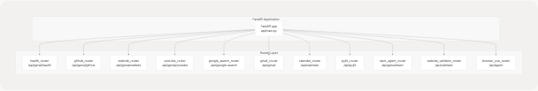
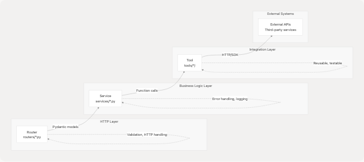
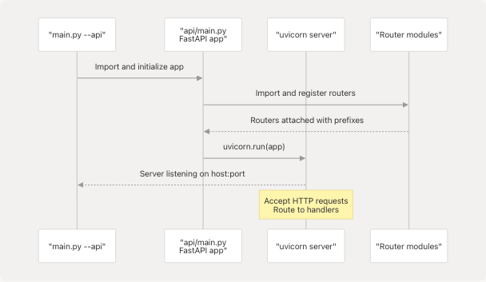

# Python Backend API

Relevant source files

* [api/main.py](https://github.com/tashifkhan/agentic-browser/blob/e94826c4/api/main.py)
* [core/config.py](https://github.com/tashifkhan/agentic-browser/blob/e94826c4/core/config.py)
* [pyproject.toml](https://github.com/tashifkhan/agentic-browser/blob/e94826c4/pyproject.toml)
* [routers/\_\_init\_\_.py](https://github.com/tashifkhan/agentic-browser/blob/e94826c4/routers/__init__.py)
* [tools/google\_search/\_\_init\_\_.py](https://github.com/tashifkhan/agentic-browser/blob/e94826c4/tools/google_search/__init__.py)
* [tools/google\_search/seach\_agent.py](https://github.com/tashifkhan/agentic-browser/blob/e94826c4/tools/google_search/seach_agent.py)
* [uv.lock](https://github.com/tashifkhan/agentic-browser/blob/e94826c4/uv.lock)

## Purpose and Scope

This document covers the Python backend API server built with FastAPI, including its architecture, router-service-tool layered design, and core dependencies. The backend provides HTTP endpoints for AI-assisted web automation, external service integrations, and agent orchestration.

For information about the agent intelligence system and LangGraph workflows, see [Agent Intelligence System](/tashifkhan/agentic-browser/4-agent-intelligence-system). For browser extension functionality, see [Browser Extension](/tashifkhan/agentic-browser/5-browser-extension). For running the application in different modes, see [Running the Application](/tashifkhan/agentic-browser/2.3-running-the-application).

---

## Overview

The Python backend is a FastAPI-based HTTP server that exposes REST endpoints for interacting with various external services and AI agents. It operates in **API mode** when launched with the `--api` flag via [main.py](https://github.com/tashifkhan/agentic-browser/blob/e94826c4/main.py)

The backend implements a clean three-tier architecture:

1. **Routers**: Handle HTTP request/response mechanics and input validation
2. **Services**: Encapsulate business logic and error handling
3. **Tools**: Provide reusable implementations for external API interactions

All components share a common configuration system and LLM abstraction layer, enabling model-agnostic AI capabilities across the application.

**Sources:** [api/main.py1-45](https://github.com/tashifkhan/agentic-browser/blob/e94826c4/api/main.py#L1-L45) high-level architecture diagrams

---

## FastAPI Application Structure

The main FastAPI application is defined in [api/main.py12](https://github.com/tashifkhan/agentic-browser/blob/e94826c4/api/main.py#L12-L12) with the title "Agentic Browser API" and version "0.1.0". The application includes 11 distinct routers, each handling a specific domain:


```

### Router Registration

Routers are imported from the `routers` package and included with specific URL prefixes:

| Router | Import Name | URL Prefix | Purpose |
| --- | --- | --- | --- |
| Health | `health_router` | `/api/genai/health` | Health checks and status |
| GitHub | `github_router` | `/api/genai/github` | Repository crawling and Q&A |
| Website | `website_router` | `/api/genai/website` | Web content extraction |
| YouTube | `youtube_router` | `/api/genai/youtube` | Video subtitle/transcript processing |
| Google Search | `google_search_router` | `/api/google-search` | Web search via Tavily |
| Gmail | `gmail_router` | `/api/gmail` | Email operations |
| Calendar | `calendar_router` | `/api/calendar` | Google Calendar integration |
| PyJIIT | `pyjiit_router` | `/api/pyjiit` | JIIT webportal access |
| React Agent | `react_agent_router` | `/api/genai/react` | Conversational AI with tool use |
| Validator | `website_validator_router` | `/api/validator` | Prompt injection detection |
| Browser Use | `browser_use_router` | `/api/agent` | Browser automation script generation |

The router registration happens at [api/main.py28-38](https://github.com/tashifkhan/agentic-browser/blob/e94826c4/api/main.py#L28-L38) using FastAPI's `include_router()` method.

**Sources:** [api/main.py12-45](https://github.com/tashifkhan/agentic-browser/blob/e94826c4/api/main.py#L12-L45) [routers/\_\_init\_\_.py1-30](https://github.com/tashifkhan/agentic-browser/blob/e94826c4/routers/__init__.py#L1-L30)

---

## Three-Tier Architecture Pattern

The backend follows a consistent three-tier pattern across all feature verticals:

```

```

### Layer Responsibilities

**Router Layer** ([routers/](https://github.com/tashifkhan/agentic-browser/blob/e94826c4/routers/))

* Define FastAPI route handlers with HTTP methods (GET, POST, etc.)
* Validate incoming requests using Pydantic models
* Handle HTTP-specific concerns (status codes, headers)
* Call service layer methods
* Transform service responses into HTTP responses

**Service Layer** ([services/](https://github.com/tashifkhan/agentic-browser/blob/e94826c4/services/))

* Implement business logic independent of HTTP concerns
* Coordinate multiple tool calls if needed
* Handle errors and exceptions
* Provide logging for debugging
* Abstract away implementation details from routers

**Tool Layer** ([tools/](https://github.com/tashifkhan/agentic-browser/blob/e94826c4/tools/))

* Provide reusable functions for external API interactions
* Implement protocol-specific logic (HTTP requests, SDK calls)
* Return data in consistent formats
* Can be used by both services and agent tools
* Independently testable

**Sources:** High-level architecture diagrams, general project structure

---

## Core Dependencies

The backend relies on several key Python packages defined in [pyproject.toml1-33](https://github.com/tashifkhan/agentic-browser/blob/e94826c4/pyproject.toml#L1-L33):

### Web Framework

* **fastapi** (>=0.115.0): Modern async web framework with automatic API documentation
* **uvicorn** (>=0.30.6): ASGI server for running FastAPI applications
* **pydantic[email]** (>=2.9.0): Data validation using Python type annotations

### AI and LangChain Ecosystem

* **langchain** (>=0.3.27): Framework for building LLM applications
* **langchain-google-genai** (>=2.1.12): Google Gemini integration
* **langchain-openai** (>=0.3.33): OpenAI GPT integration
* **langchain-anthropic** (>=0.3.20): Anthropic Claude integration
* **langchain-ollama** (>=0.3.8): Local LLM support via Ollama
* **langgraph** (>=1.0.1): State graph orchestration for agents
* **langchain-tavily** (>=0.2.14): Web search integration

### External Service Integrations

* **gitingest** (>=0.3.1): GitHub repository crawling
* **yt-dlp** (>=2025.12.8): YouTube video downloading and metadata extraction
* **faster-whisper** (>=1.2.1): Speech-to-text transcription
* **googlesearch-python** (>=1.3.0): Google search functionality

### Web Scraping and Processing

* **bs4** (>=0.0.2): BeautifulSoup for HTML parsing
* **html2text** (>=2025.4.15): HTML to Markdown conversion
* **requests** (>=2.32.3): HTTP client library

### Utilities

* **python-dotenv** (>=1.1.1): Environment variable management
* **pycryptodome** (>=3.23.0): Cryptographic operations for PyJIIT
* **mcp** (>=1.2.0): Model Context Protocol support

The full dependency tree with transitive dependencies is locked in [uv.lock](https://github.com/tashifkhan/agentic-browser/blob/e94826c4/uv.lock)

**Sources:** [pyproject.toml1-33](https://github.com/tashifkhan/agentic-browser/blob/e94826c4/pyproject.toml#L1-L33) [uv.lock1-58](https://github.com/tashifkhan/agentic-browser/blob/e94826c4/uv.lock#L1-L58)

---

## Configuration and Logging

The backend uses a centralized configuration system defined in [core/config.py](https://github.com/tashifkhan/agentic-browser/blob/e94826c4/core/config.py)

### Environment Variables

Configuration is loaded from `.env` files using `python-dotenv`:

```

```

Key configuration variables at [core/config.py8-14](https://github.com/tashifkhan/agentic-browser/blob/e94826c4/core/config.py#L8-L14):

* `ENV`: Environment name (default: "development")
* `DEBUG`: Debug mode flag (auto-set based on ENV)
* `BACKEND_HOST`: Server bind address (default: "0.0.0.0")
* `BACKEND_PORT`: Server port (default: 5454)
* `GOOGLE_API_KEY`: API key for Google services

### Logging System

The logging system provides consistent log formatting across all modules:

1. **Basic Configuration** ([core/config.py17-18](https://github.com/tashifkhan/agentic-browser/blob/e94826c4/core/config.py#L17-L18)):

   * Log level set to `DEBUG` in development, `INFO` in production
   * Global configuration via `logging.basicConfig()`
2. **Logger Factory** ([core/config.py22-25](https://github.com/tashifkhan/agentic-browser/blob/e94826c4/core/config.py#L22-L25)):

   * `get_logger(name)` function creates module-specific loggers
   * All loggers inherit the configured log level
   * Usage pattern: `logger = get_logger(__name__)`

Example usage in [tools/google\_search/seach\_agent.py6-8](https://github.com/tashifkhan/agentic-browser/blob/e94826c4/tools/google_search/seach_agent.py#L6-L8):

```
```
from core.config import get_logger
logger = get_logger(__name__)
```
```

**Sources:** [core/config.py1-26](https://github.com/tashifkhan/agentic-browser/blob/e94826c4/core/config.py#L1-L26)

---

## Entry Point and Application Startup

The FastAPI application can be started in API mode through the main entry point:

```

```

The application initialization sequence:

1. **Import Phase**: FastAPI app instance created at [api/main.py12](https://github.com/tashifkhan/agentic-browser/blob/e94826c4/api/main.py#L12-L12)
2. **Router Registration**: All routers imported and included at [api/main.py14-38](https://github.com/tashifkhan/agentic-browser/blob/e94826c4/api/main.py#L14-L38)
3. **Server Start**: Uvicorn launches the ASGI server with the app
4. **Request Handling**: Incoming HTTP requests routed to appropriate handlers

### Root Endpoint

A simple root endpoint is defined at [api/main.py42-44](https://github.com/tashifkhan/agentic-browser/blob/e94826c4/api/main.py#L42-L44) that returns application metadata:

* Returns JSON with `name` and `version` fields
* Accessible at `GET /`
* Useful for health checks and API discovery

**Sources:** [api/main.py1-45](https://github.com/tashifkhan/agentic-browser/blob/e94826c4/api/main.py#L1-L45)

---

## Example: Web Search Flow

To illustrate the three-tier architecture in action, here's how a web search request flows through the system:

```


The `web_search_pipeline` function at [tools/google\_search/seach\_agent.py14-62](https://github.com/tashifkhan/agentic-browser/blob/e94826c4/tools/google_search/seach_agent.py#L14-L62):

1. Initializes the `TavilySearch` tool from LangChain
2. Configures `max_results` parameter
3. Invokes the search with the query
4. Transforms Tavily's response format to match expected schema
5. Returns list of dictionaries with `url`, `md_body_content`, and `title` fields

This pattern demonstrates:

* **Separation of concerns**: Each layer has a distinct responsibility
* **Reusability**: The `web_search_pipeline` tool can be called by services or agent tools
* **Testability**: Each layer can be tested independently
* **Consistency**: All feature verticals follow this same pattern

**Sources:** [tools/google\_search/seach\_agent.py1-84](https://github.com/tashifkhan/agentic-browser/blob/e94826c4/tools/google_search/seach_agent.py#L1-L84) high-level architecture diagrams

---

## Related Documentation

For detailed information about specific components:

* **Router details**: See [API Routers](/tashifkhan/agentic-browser/3.3-api-routers) and its subsections
* **Service layer patterns**: See [Service Layer Architecture](/tashifkhan/agentic-browser/3.4-service-layer-architecture)
* **Tool implementations**: See [Tool Layer](/tashifkhan/agentic-browser/3.5-tool-layer)
* **Agent system**: See [Agent Intelligence System](/tashifkhan/agentic-browser/4-agent-intelligence-system) for React Agent and Browser Use Agent
* **LLM integration**: See [LLM Integration Layer](/tashifkhan/agentic-browser/4.5-llm-integration-layer) for multi-provider support
* **Project structure**: See [Project Structure and Dependencies](/tashifkhan/agentic-browser/3.1-project-structure-and-dependencies) for directory organization

**Sources:** Table of contents structure