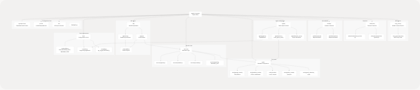
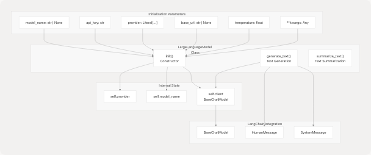

# Project Structure and Dependencies

> Source: https://deepwiki.com/tashifkhan/agentic-browser/3.1-project-structure-and-dependencies

# Project Structure and Dependencies

Relevant source files

* [api/main.py](https://github.com/tashifkhan/agentic-browser/blob/e94826c4/api/main.py)
* [core/config.py](https://github.com/tashifkhan/agentic-browser/blob/e94826c4/core/config.py)
* [pyproject.toml](https://github.com/tashifkhan/agentic-browser/blob/e94826c4/pyproject.toml)
* [routers/\_\_init\_\_.py](https://github.com/tashifkhan/agentic-browser/blob/e94826c4/routers/__init__.py)
* [tools/google\_search/\_\_init\_\_.py](https://github.com/tashifkhan/agentic-browser/blob/e94826c4/tools/google_search/__init__.py)
* [tools/google\_search/seach\_agent.py](https://github.com/tashifkhan/agentic-browser/blob/e94826c4/tools/google_search/seach_agent.py)
* [uv.lock](https://github.com/tashifkhan/agentic-browser/blob/e94826c4/uv.lock)

## Purpose and Scope

This page documents the Python backend project structure, dependency management system, and the core `LargeLanguageModel` abstraction layer that enables multi-provider LLM support. This covers the foundational configuration and infrastructure for the FastAPI backend. For details on the FastAPI application itself and its routers, see [FastAPI Application](/tashifkhan/agentic-browser/3.2-fastapi-application-and-router-architecture). For information about individual service integrations, see [Service Integration Routers](/tashifkhan/agentic-browser/3.3-api-routers).

## Project Structure Overview

The Python backend is organized as a standard Python package managed by `uv`, a modern Python package manager. The project root contains configuration files that define dependencies, scripts, and project metadata.

### Directory Structure


```

### API Router Organization

The [api/main.py](https://github.com/tashifkhan/agentic-browser/blob/e94826c4/api/main.py) file includes 11 routers at specific prefixes:

| Router | Prefix | Module | Purpose |
| --- | --- | --- | --- |
| `health_router` | `/api/genai/health` | `routers.health` | Health check endpoint |
| `github_router` | `/api/genai/github` | `routers.github` | Repository Q&A |
| `website_router` | `/api/genai/website` | `routers.website` | Web content extraction |
| `youtube_router` | `/api/genai/youtube` | `routers.youtube` | Video Q&A |
| `google_search_router` | `/api/google-search` | `routers.google_search` | Web search |
| `gmail_router` | `/api/gmail` | `routers.gmail` | Email operations |
| `calendar_router` | `/api/calendar` | `routers.calendar` | Calendar management |
| `pyjiit_router` | `/api/pyjiit` | `routers.pyjiit` | JIIT webportal |
| `react_agent_router` | `/api/genai/react` | `routers.react_agent` | Conversational AI |
| `website_validator_router` | `/api/validator` | `routers.website_validator` | Prompt injection detection |
| `browser_use_router` (as `agent_router`) | `/api/agent` | `routers.browser_use` | Script generation |

**Sources:** [api/main.py1-45](https://github.com/tashifkhan/agentic-browser/blob/e94826c4/api/main.py#L1-L45) [routers/\_\_init\_\_.py1-30](https://github.com/tashifkhan/agentic-browser/blob/e94826c4/routers/__init__.py#L1-L30)

## Dependency Management with uv

The project uses `uv` as its package manager, which provides fast dependency resolution and reproducible builds. Dependencies are declared in `pyproject.toml` and locked in `uv.lock`.

### Project Metadata

[pyproject.toml1-6](https://github.com/tashifkhan/agentic-browser/blob/e94826c4/pyproject.toml#L1-L6) defines the project metadata:

| Property | Value |
| --- | --- |
| **name** | `agentic-browser` |
| **version** | `0.1.0` |
| **requires-python** | `>=3.12` |

### Core Dependencies

The project has 26 direct dependencies organized by function:

#### LangChain Ecosystem (AI Orchestration)

| Package | Version | Purpose |
| --- | --- | --- |
| `langchain` | >=0.3.27 | Core LangChain framework for agent orchestration |
| `langgraph` | >=1.0.1 | State graph implementation for agent workflows |
| `langchain-google-genai` | >=2.1.12 | Google Gemini LLM integration |
| `langchain-openai` | >=0.3.33 | OpenAI GPT models integration |
| `langchain-anthropic` | >=0.3.20 | Anthropic Claude integration |
| `langchain-ollama` | >=0.3.8 | Ollama local models integration |

#### Web Framework (API Server)

| Package | Version | Purpose |
| --- | --- | --- |
| `fastapi` | >=0.115.0 | Async web framework for REST API |
| `uvicorn` | >=0.30.6 | ASGI server for FastAPI |
| `pydantic[email]` | >=2.9.0 | Data validation and serialization |

#### Data Processing & External Services

| Package | Version | Purpose |
| --- | --- | --- |
| `bs4` | >=0.0.2 | HTML parsing (BeautifulSoup4) |
| `html2text` | >=2025.4.15 | HTML to Markdown conversion |
| `langchain-tavily` | >=0.2.14 | Tavily web search integration |
| `yt-dlp` | >=2025.12.8 | YouTube video/subtitle extraction |
| `faster-whisper` | >=1.2.1 | Audio transcription (Whisper model) |
| `gitingest` | >=0.3.1 | GitHub repository ingestion |
| `googlesearch-python` | >=1.3.0 | Google search API wrapper |

#### Utilities

| Package | Version | Purpose |
| --- | --- | --- |
| `python-dotenv` | >=1.1.1 | Environment variable management |
| `requests` | >=2.32.3 | HTTP client library |
| `pycryptodome` | >=3.23.0 | Cryptographic utilities |
| `mcp` | >=1.2.0 | Model Context Protocol server support |

**Sources:** [pyproject.toml7-28](https://github.com/tashifkhan/agentic-browser/blob/e94826c4/pyproject.toml#L7-L28)

### Entry Point Scripts

The project defines two executable scripts in [pyproject.toml28-30](https://github.com/tashifkhan/agentic-browser/blob/e94826c4/pyproject.toml#L28-L30):

```
```
[project.scripts]
agentic-api-run = "app.run:run"
agentic-mcp = "mcp_server.server:run"
```
```

These scripts enable running the application in two modes:

* **API Mode**: `agentic-api-run` launches the FastAPI server
* **MCP Mode**: `agentic-mcp` launches the Model Context Protocol server

## LargeLanguageModel Abstraction Layer

The `LargeLanguageModel` class in [core/llm.py78-194](https://github.com/tashifkhan/agentic-browser/blob/e94826c4/core/llm.py#L78-L194) provides a unified interface for multiple LLM providers, abstracting away provider-specific initialization and API details.

### Provider Configuration Architecture

```

```

**Sources:** [core/llm.py21-75](https://github.com/tashifkhan/agentic-browser/blob/e94826c4/core/llm.py#L21-L75)

### Provider-Specific Configuration

The `PROVIDER_CONFIGS` dictionary at [core/llm.py21-75](https://github.com/tashifkhan/agentic-browser/blob/e94826c4/core/llm.py#L21-L75) defines configuration for each provider:

#### Google (Gemini)

```
```
"google": {
    "class": ChatGoogleGenerativeAI,
    "api_key_env": "GOOGLE_API_KEY",
    "default_model": "gemini-2.5-flash",
    "param_map": {"api_key": "google_api_key"},
}
```
```

#### OpenAI

```
```
"openai": {
    "class": ChatOpenAI,
    "api_key_env": "OPENAI_API_KEY",
    "default_model": "gpt-5-mini",
    "param_map": {
        "api_key": "openai_api_key",
        "base_url": "base_url",
    },
}
```
```

#### Anthropic (Claude)

```
```
"anthropic": {
    "class": ChatAnthropic,
    "api_key_env": "ANTHROPIC_API_KEY",
    "default_model": "claude-4-sonnet",
    "param_map": {
        "api_key": "anthropic_api_key",
        "base_url": "base_url",
    },
}
```
```

#### Ollama (Local Models)

```
```
"ollama": {
    "class": ChatOllama,
    "api_key_env": None,  # No API key required
    "base_url_env": "OLLAMA_BASE_URL",
    "default_model": "llama3",
    "param_map": {
        "base_url": "base_url",
    },
}
```
```

#### DeepSeek

```
```
"deepseek": {
    "class": ChatOpenAI,  # Uses OpenAI-compatible API
    "api_key_env": "DEEPSEEK_API_KEY",
    "base_url_override": "https://api.deepseek.com/v1",
    "default_model": "deepseek-chat",
    "param_map": {
        "api_key": "openai_api_key",
        "base_url": "base_url",
    },
}
```
```

#### OpenRouter

```
```
"openrouter": {
    "class": ChatOpenAI,  # Uses OpenAI-compatible API
    "api_key_env": "OPENROUTER_API_KEY",
    "base_url_override": "https://openrouter.ai/api/v1",
    "default_model": "mistralai/mistral-7b-instruct",
    "param_map": {
        "api_key": "openai_api_key",
        "base_url": "base_url",
    },
}
```
```

**Sources:** [core/llm.py21-75](https://github.com/tashifkhan/agentic-browser/blob/e94826c4/core/llm.py#L21-L75)

### LargeLanguageModel Class Interface

```

```

**Sources:** [core/llm.py78-194](https://github.com/tashifkhan/agentic-browser/blob/e94826c4/core/llm.py#L78-L194)

### Initialization Flow

The `__init__` method at [core/llm.py79-169](https://github.com/tashifkhan/agentic-browser/blob/e94826c4/core/llm.py#L79-L169) implements a sophisticated initialization flow:

1. **Provider Validation** [core/llm.py98-105](https://github.com/tashifkhan/agentic-browser/blob/e94826c4/core/llm.py#L98-L105): Validates the provider exists in `PROVIDER_CONFIGS`
2. **Model Resolution** [core/llm.py108-113](https://github.com/tashifkhan/agentic-browser/blob/e94826c4/core/llm.py#L108-L113): Uses provided model or falls back to default
3. **API Key Handling** [core/llm.py121-134](https://github.com/tashifkhan/agentic-browser/blob/e94826c4/core/llm.py#L121-L134): Retrieves API key from parameter or environment
4. **Base URL Resolution** [core/llm.py136-155](https://github.com/tashifkhan/agentic-browser/blob/e94826c4/core/llm.py#L136-L155): Determines base URL from parameter, config override, or environment
5. **Client Instantiation** [core/llm.py159-169](https://github.com/tashifkhan/agentic-browser/blob/e94826c4/core/llm.py#L159-L169): Creates the LangChain chat model instance

### Public Methods

#### generate\_text()

[core/llm.py171-190](https://github.com/tashifkhan/agentic-browser/blob/e94826c4/core/llm.py#L171-L190)

```
```
def generate_text(
    self,
    prompt: str,
    system_message: str | None = None,
) -> str
```
```

Generates text using the configured LLM:

1. Constructs a message list with optional `SystemMessage` [core/llm.py177-179](https://github.com/tashifkhan/agentic-browser/blob/e94826c4/core/llm.py#L177-L179)
2. Adds the user prompt as `HumanMessage` [core/llm.py181](https://github.com/tashifkhan/agentic-browser/blob/e94826c4/core/llm.py#L181-L181)
3. Invokes the LLM client [core/llm.py184](https://github.com/tashifkhan/agentic-browser/blob/e94826c4/core/llm.py#L184-L184)
4. Returns the string content [core/llm.py185](https://github.com/tashifkhan/agentic-browser/blob/e94826c4/core/llm.py#L185-L185)

#### summarize\_text()

[core/llm.py192-193](https://github.com/tashifkhan/agentic-browser/blob/e94826c4/core/llm.py#L192-L193)

```
```
def summarize_text(self, text: str) -> str
```
```

Placeholder method for text summarization. Currently returns a simple truncated summary.

**Sources:** [core/llm.py78-194](https://github.com/tashifkhan/agentic-browser/blob/e94826c4/core/llm.py#L78-L194)

## Core Module Configuration

The `core` module provides environment configuration and logging through [core/config.py1-26](https://github.com/tashifkhan/agentic-browser/blob/e94826c4/core/config.py#L1-L26)

### Configuration Variables

The [core/config.py](https://github.com/tashifkhan/agentic-browser/blob/e94826c4/core/config.py) module loads environment variables and exposes configuration:

```

```

| Variable | Default | Source | Purpose |
| --- | --- | --- | --- |
| `ENV` | `"development"` | `ENV` env var | Environment mode |
| `DEBUG` | `True` in dev | `DEBUG` env var | Debug logging flag |
| `BACKEND_HOST` | `"0.0.0.0"` | `BACKEND_HOST` env var | FastAPI bind address |
| `BACKEND_PORT` | `5454` | `BACKEND_PORT` env var | FastAPI bind port |
| `google_api_key` | `""` | `GOOGLE_API_KEY` env var | Google API credentials |

### Logger Configuration

The `get_logger(name)` function at [core/config.py22-25](https://github.com/tashifkhan/agentic-browser/blob/e94826c4/core/config.py#L22-L25) creates module-specific loggers with the appropriate logging level:

* **DEBUG mode**: `logging.DEBUG` for detailed output
* **Production mode**: `logging.INFO` for standard logging

**Sources:** [core/config.py1-26](https://github.com/tashifkhan/agentic-browser/blob/e94826c4/core/config.py#L1-L26)

## Tool Layer Organization

The `tools/` directory contains reusable components that services depend on. Each tool provides specific functionality for external integrations.

### Web Search with Tavily

The [tools/google\_search/seach\_agent.py](https://github.com/tashifkhan/agentic-browser/blob/e94826c4/tools/google_search/seach_agent.py) implements web search using the `TavilySearch` tool from LangChain:

```

```

**Key components:**

* **`tavily_tool`** [tools/google\_search/seach\_agent.py11](https://github.com/tashifkhan/agentic-browser/blob/e94826c4/tools/google_search/seach_agent.py#L11-L11): Global `TavilySearch` instance
* **`web_search_pipeline()`** [tools/google\_search/seach\_agent.py14-62](https://github.com/tashifkhan/agentic-browser/blob/e94826c4/tools/google_search/seach_agent.py#L14-L62): Main search function with configurable `max_results`
* **Result format**: Returns list of dicts with `url`, `md_body_content` (mapped from Tavily's `content`), and `title`

**Sources:** [tools/google\_search/seach\_agent.py1-84](https://github.com/tashifkhan/agentic-browser/blob/e94826c4/tools/google_search/seach_agent.py#L1-L84)

## Dependency Version Locking

The [uv.lock](https://github.com/tashifkhan/agentic-browser/blob/e94826c4/uv.lock) file provides deterministic dependency resolution. It uses a `version = 1` lock file format [uv.lock1](https://github.com/tashifkhan/agentic-browser/blob/e94826c4/uv.lock#L1-L1) and specifies `requires-python = ">=3.12"` [uv.lock3](https://github.com/tashifkhan/agentic-browser/blob/e94826c4/uv.lock#L3-L3)

### Lock File Structure

```


Each package entry includes:

* **name** and **version**: Package identification
* **source**: PyPI registry URL or virtual source for the project itself
* **dependencies**: Resolved dependency list with specific versions
* **sdist/wheels**: Distribution files with SHA256 hashes for integrity verification

The `agentic-browser` package itself is listed at [uv.lock10-34](https://github.com/tashifkhan/agentic-browser/blob/e94826c4/uv.lock#L10-L34) with all 26 direct dependencies locked to specific versions.

**Sources:** [uv.lock1-7](https://github.com/tashifkhan/agentic-browser/blob/e94826c4/uv.lock#L1-L7) [uv.lock10-34](https://github.com/tashifkhan/agentic-browser/blob/e94826c4/uv.lock#L10-L34) [uv.lock177-193](https://github.com/tashifkhan/agentic-browser/blob/e94826c4/uv.lock#L177-L193)

## Summary

The Python backend project structure follows these principles:

1. **Modern Package Management**: Uses `uv` for fast, reproducible dependency resolution
2. **Provider Abstraction**: The `LargeLanguageModel` class enables seamless switching between 6 LLM providers
3. **Configuration-Driven**: All provider-specific details are centralized in `PROVIDER_CONFIGS`
4. **Environment-Based Secrets**: API keys and URLs are loaded from environment variables
5. **Type Safety**: Uses Python 3.12+ type hints and Pydantic for validation
6. **Dual Entry Points**: Supports both API server and MCP server modes

This foundation enables the rest of the backend to focus on business logic without worrying about LLM provider differences or dependency management complexity.

**Sources:** [pyproject.toml1-31](https://github.com/tashifkhan/agentic-browser/blob/e94826c4/pyproject.toml#L1-L31) [core/llm.py1-204](https://github.com/tashifkhan/agentic-browser/blob/e94826c4/core/llm.py#L1-L204) [core/\_\_init\_\_.py1-15](https://github.com/tashifkhan/agentic-browser/blob/e94826c4/core/__init__.py#L1-L15) [uv.lock1-55](https://github.com/tashifkhan/agentic-browser/blob/e94826c4/uv.lock#L1-L55)