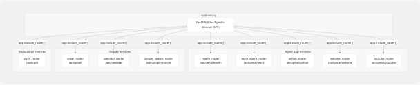
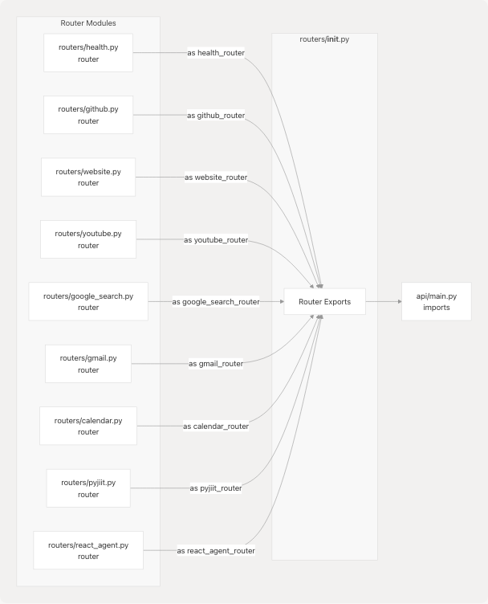
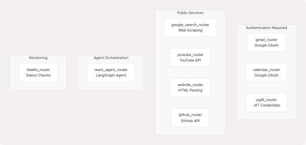

# FastAPI Application

## Purpose and Scope

This document details the main FastAPI application structure defined in [api/main.py](https://github.com/tashifkhan/agentic-browser/blob/e94826c4/api/main.py) It covers the application initialization, the modular router architecture, and how the 9 service-specific routers are mounted to create the API surface. For details on individual router implementations and the services they expose, see [Service Integration Routers](3.3-api-routers). For information about project dependencies and the `LargeLanguageModel` abstraction, see [Project Structure and Dependencies](3.1-project-structure-and-dependencies).

**Sources:** [api/main.py1-43](https://github.com/tashifkhan/agentic-browser/blob/e94826c4/api/main.py#L1-L43)

---

## Application Initialization

The FastAPI application is instantiated in [api/main.py13](https://github.com/tashifkhan/agentic-browser/blob/e94826c4/api/main.py#L13-L13) with basic metadata:

```
app = FastAPI(title="Agentic Browser API", version="0.1.0")
```

The application uses a logger configured through the `core.config` module ([api/main.py3-10](https://github.com/tashifkhan/agentic-browser/blob/e94826c4/api/main.py#L3-L10)). This logger instance is used throughout the application for consistent logging behavior.

**Sources:** [api/main.py1-13](https://github.com/tashifkhan/agentic-browser/blob/e94826c4/api/main.py#L1-L13)

---

## Router Architecture

### Modular Router Design

The application follows a modular router pattern where each service integration is implemented as a separate `APIRouter` instance in the `routers/` package. This design provides:

* **Separation of concerns**: Each router handles a distinct service domain
* **Independent development**: Routers can be developed and tested in isolation
* **Clean namespace organization**: URL prefixes clearly indicate service boundaries
* **Easy extensibility**: New services can be added by creating a new router module

The routers are imported from the `routers` package ([api/main.py16-26](https://github.com/tashifkhan/agentic-browser/blob/e94826c4/api/main.py#L16-L26)) and mounted onto the main application using the `include_router` method with distinct URL prefixes.

**Sources:** [api/main.py16-36](https://github.com/tashifkhan/agentic-browser/blob/e94826c4/api/main.py#L16-L36)

---

## Mounted Routers Overview

The application mounts 9 routers, each serving a specific integration or functionality:

| Router Variable | Module | URL Prefix | Purpose |
| --- | --- | --- | --- |
| `health_router` | `routers.health` | `/api/genai/health` | Health check endpoints for monitoring application status |
| `github_router` | `routers.github` | `/api/genai/github` | GitHub repository analysis and code crawling |
| `website_router` | `routers.website` | `/api/genai/website` | Website content extraction and markdown conversion |
| `youtube_router` | `routers.youtube` | `/api/genai/youtube` | YouTube video transcript and metadata retrieval |
| `google_search_router` | `routers.google_search` | `/api/google-search` | Google search integration and result processing |
| `gmail_router` | `routers.gmail` | `/api/gmail` | Gmail operations (list, send, mark read) |
| `calendar_router` | `routers.calendar` | `/api/calendar` | Google Calendar event management |
| `pyjiit_router` | `routers.pyjiit` | `/api/pyjiit` | JIIT student portal integration |
| `react_agent_router` | `routers.react_agent` | `/api/genai/react` | React agent orchestration and LLM interaction |

**Sources:** [api/main.py16-36](https://github.com/tashifkhan/agentic-browser/blob/e94826c4/api/main.py#L16-L36) [routers/\_\_init\_\_.py1-25](https://github.com/tashifkhan/agentic-browser/blob/e94826c4/routers/__init__.py#L1-L25)

---

## Router Mounting Structure

**Diagram: FastAPI Router Mounting Architecture**



Each router is mounted using the pattern:

```
app.include_router(router_instance, prefix="/api/path")
```

This creates a hierarchical URL structure where all endpoints defined in the router are automatically prefixed with the specified path.

**Sources:** [api/main.py28-36](https://github.com/tashifkhan/agentic-browser/blob/e94826c4/api/main.py#L28-L36)

---

## URL Prefix Convention

The application uses two primary URL prefix patterns:

### `/api/genai/*` Prefix

Routes under this prefix are AI/agent-centric services that typically involve LLM processing or intelligent automation:

* `/api/genai/health` - Application health monitoring
* `/api/genai/react` - React agent execution
* `/api/genai/github` - GitHub repository analysis
* `/api/genai/website` - Intelligent website content extraction
* `/api/genai/youtube` - YouTube content analysis

### `/api/<service>` Prefix

Routes under this pattern are direct service integrations without AI mediation:

* `/api/gmail` - Gmail API operations
* `/api/calendar` - Google Calendar operations
* `/api/google-search` - Web search functionality
* `/api/pyjiit` - JIIT portal operations

**Sources:** [api/main.py28-36](https://github.com/tashifkhan/agentic-browser/blob/e94826c4/api/main.py#L28-L36)

---

## Router Module Organization

**Diagram: Router Package Structure**



The `routers/__init__.py` module ([routers/\_\_init\_\_.py1-25](https://github.com/tashifkhan/agentic-browser/blob/e94826c4/routers/__init__.py#L1-L25)) serves as a central export point that:

1. Imports the `router` instance from each router module
2. Aliases each router with a descriptive suffix (e.g., `router as github_router`)
3. Exports all routers through the `__all__` list for clean imports

This pattern allows the main application to import all routers in a single statement:

```
from routers import (
    github_router,
    health_router,
    # ... other routers
)
```

**Sources:** [routers/\_\_init\_\_.py1-25](https://github.com/tashifkhan/agentic-browser/blob/e94826c4/routers/__init__.py#L1-L25) [api/main.py16-26](https://github.com/tashifkhan/agentic-browser/blob/e94826c4/api/main.py#L16-L26)

---

## Root Endpoint

The application provides a simple root endpoint at `/` ([api/main.py40-42](https://github.com/tashifkhan/agentic-browser/blob/e94826c4/api/main.py#L40-L42)):

```
@app.get("/")
def root():
    return {"name": app.title, "version": app.version}
```

This endpoint returns basic application metadata and can be used for quick connectivity checks.

**Sources:** [api/main.py40-42](https://github.com/tashifkhan/agentic-browser/blob/e94826c4/api/main.py#L40-L42)

---

## Request Flow Architecture

**Diagram: HTTP Request Processing Flow**


The request processing follows this pattern:

1. **Route Matching**: FastAPI matches the incoming URL to a router prefix
2. **Router Dispatch**: The request is handed to the appropriate router
3. **Request Validation**: Pydantic models validate incoming request bodies
4. **Tool Invocation**: Router calls the appropriate tool/service function
5. **External Integration**: Tool functions interact with external services
6. **Response Serialization**: Results are formatted using response models
7. **JSON Response**: FastAPI serializes and returns the response

**Sources:** [api/main.py28-36](https://github.com/tashifkhan/agentic-browser/blob/e94826c4/api/main.py#L28-L36) [routers/gmail.py37-60](https://github.com/tashifkhan/agentic-browser/blob/e94826c4/routers/gmail.py#L37-L60)

---

## Router Implementation Pattern

Each router module follows a consistent structure. Example from the Gmail router ([routers/gmail.py1-60](https://github.com/tashifkhan/agentic-browser/blob/e94826c4/routers/gmail.py#L1-L60)):

**Request Models**: Define input schemas using Pydantic

```
class UnreadRequest(TokenRequest):
    access_token: str
    max_results: Optional[int] = 10
```

**Endpoint Definition**: Use FastAPI decorators and dependency injection

```
@router.post("/unread", response_model=dict)
async def list_unread_messages(request: UnreadRequest):
    # Implementation
```

**Error Handling**: Catch exceptions and return appropriate HTTP errors

```
except Exception as e:
    logger.exception("Error listing unread messages: %s", e)
    raise HTTPException(status_code=500, detail=str(e))
```

**Tool Integration**: Delegate to service-specific tool functions

```
results = list_unread(request.access_token, max_results=request.max_results)
```

This pattern ensures consistency across all routers while allowing flexibility in implementation details.

**Sources:** [routers/gmail.py1-60](https://github.com/tashifkhan/agentic-browser/blob/e94826c4/routers/gmail.py#L1-L60) [routers/pyjiit.py1-54](https://github.com/tashifkhan/agentic-browser/blob/e94826c4/routers/pyjiit.py#L1-L54)

---

## Service Integration Categories

**Diagram: Router Service Categories**



The routers are organized into functional categories:

**Authentication-Required Services**: Require user credentials or OAuth tokens

* `gmail_router`: Requires Google OAuth access token in request body
* `calendar_router`: Requires Google OAuth access token in request body
* `pyjiit_router`: Requires JIIT webportal credentials

**Public Services**: Can be called without user authentication

* `google_search_router`: Web search and scraping
* `youtube_router`: Public video metadata and transcripts
* `website_router`: HTML to Markdown conversion
* `github_router`: Public repository analysis

**Agent Orchestration**: Coordinates LLM-based intelligent task execution

* `react_agent_router`: Executes React agent pattern with dynamic tool selection

**Monitoring**: Application health and status

* `health_router`: Health check endpoints

**Sources:** [api/main.py28-36](https://github.com/tashifkhan/agentic-browser/blob/e94826c4/api/main.py#L28-L36) [routers/gmail.py15-34](https://github.com/tashifkhan/agentic-browser/blob/e94826c4/routers/gmail.py#L15-L34) [routers/pyjiit.py17-38](https://github.com/tashifkhan/agentic-browser/blob/e94826c4/routers/pyjiit.py#L17-L38)

---

## Extension Points

The modular router architecture provides clear extension points:

**Adding New Routers**:

1. Create a new router module in `routers/` (e.g., `routers/new_service.py`)
2. Define an `APIRouter` instance named `router`
3. Implement endpoints with appropriate request/response models
4. Export the router in `routers/__init__.py` with a descriptive alias
5. Mount the router in [api/main.py](https://github.com/tashifkhan/agentic-browser/blob/e94826c4/api/main.py) using `app.include_router()`

**Extending Existing Routers**:

* Add new endpoint functions to the router module
* Define additional Pydantic models for new request/response schemas
* Implement corresponding tool functions in the `tools/` package

This architecture keeps the main application file minimal and maintainable while allowing unlimited service expansion.

**Sources:** [api/main.py16-36](https://github.com/tashifkhan/agentic-browser/blob/e94826c4/api/main.py#L16-L36) [routers/\_\_init\_\_.py1-25](https://github.com/tashifkhan/agentic-browser/blob/e94826c4/routers/__init__.py#L1-L25)
