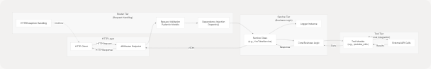
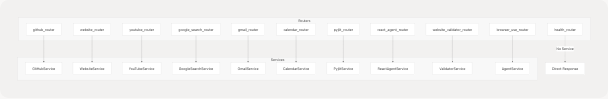

# API Routers

Relevant source files

* [api/\_\_init\_\_.py](https://github.com/tashifkhan/agentic-browser/blob/e94826c4/api/__init__.py)
* [api/main.py](https://github.com/tashifkhan/agentic-browser/blob/e94826c4/api/main.py)
* [api/run.py](https://github.com/tashifkhan/agentic-browser/blob/e94826c4/api/run.py)
* [models/\_\_init\_\_.py](https://github.com/tashifkhan/agentic-browser/blob/e94826c4/models/__init__.py)
* [models/yt.py](https://github.com/tashifkhan/agentic-browser/blob/e94826c4/models/yt.py)
* [routers/\_\_init\_\_.py](https://github.com/tashifkhan/agentic-browser/blob/e94826c4/routers/__init__.py)
* [routers/calendar.py](https://github.com/tashifkhan/agentic-browser/blob/e94826c4/routers/calendar.py)
* [routers/github.py](https://github.com/tashifkhan/agentic-browser/blob/e94826c4/routers/github.py)
* [routers/gmail.py](https://github.com/tashifkhan/agentic-browser/blob/e94826c4/routers/gmail.py)
* [routers/google\_search.py](https://github.com/tashifkhan/agentic-browser/blob/e94826c4/routers/google_search.py)
* [routers/health.py](https://github.com/tashifkhan/agentic-browser/blob/e94826c4/routers/health.py)
* [routers/website.py](https://github.com/tashifkhan/agentic-browser/blob/e94826c4/routers/website.py)
* [routers/youtube.py](https://github.com/tashifkhan/agentic-browser/blob/e94826c4/routers/youtube.py)
* [tools/youtube\_utils/get\_info.py](https://github.com/tashifkhan/agentic-browser/blob/e94826c4/tools/youtube_utils/get_info.py)

This document provides a comprehensive overview of all FastAPI routers exposed by the Agentic Browser API server. It covers router registration, URL path mapping, architectural patterns, and the request/response flow common to all routers. For detailed information about specific router implementations, see subsections [3.3.1](/tashifkhan/agentic-browser/3.3.1-gmail-and-calendar-integration) through [3.3.6](/tashifkhan/agentic-browser/3.3.6-website-validator). For information about the service layer that routers depend on, see [3.4](/tashifkhan/agentic-browser/3.4-service-layer-architecture).

## Router Registration and Organization

The FastAPI application in `api/main.py` serves as the central point where all routers are imported and registered with URL prefixes. The application exposes 11 distinct routers, each handling a specific domain of functionality.

**Diagram: Router Registration Flow**


```

Sources: [api/main.py14-38](https://github.com/tashifkhan/agentic-browser/blob/e94826c4/api/main.py#L14-L38) [routers/\_\_init\_\_.py1-29](https://github.com/tashifkhan/agentic-browser/blob/e94826c4/routers/__init__.py#L1-L29)

The router registration follows this pattern:

1. Individual router modules define an `APIRouter` instance named `router`
2. The `routers/__init__.py` package exports each router with a descriptive alias (e.g., `health_router`, `github_router`)
3. The main application imports all routers and registers them with `app.include_router()`, assigning URL prefixes

## Complete Router Inventory

The following table provides a complete reference of all routers, their URL prefixes, primary endpoints, and functional domains:

| Router Name | URL Prefix | Primary Endpoints | Functional Domain | Sub-Section Reference |
| --- | --- | --- | --- | --- |
| `health_router` | `/api/genai/health` | `GET /` | System health monitoring | N/A |
| `github_router` | `/api/genai/github` | `POST /` | GitHub repository Q&A and analysis | [3.3.4](/tashifkhan/agentic-browser/3.3.4-github-integration) |
| `website_router` | `/api/genai/website` | `POST /` | Web page content analysis and Q&A | [3.3.2](/tashifkhan/agentic-browser/3.3.2-web-search-and-content-processing) |
| `youtube_router` | `/api/genai/youtube` | `POST /` | YouTube video transcript Q&A | [3.3.3](/tashifkhan/agentic-browser/3.3.3-youtube-integration) |
| `google_search_router` | `/api/google-search` | `GET /` | Web search via Tavily API | [3.3.2](/tashifkhan/agentic-browser/3.3.2-web-search-and-content-processing) |
| `gmail_router` | `/api/gmail` | `POST /unread` `POST /latest` `POST /mark_read` `POST /send` | Gmail operations with OAuth | [3.3.1](/tashifkhan/agentic-browser/3.3.1-gmail-and-calendar-integration) |
| `calendar_router` | `/api/calendar` | `POST /events` `POST /create` | Google Calendar operations with OAuth | [3.3.1](/tashifkhan/agentic-browser/3.3.1-gmail-and-calendar-integration) |
| `pyjiit_router` | `/api/pyjiit` | Multiple endpoints | JIIT Webportal integration | [3.3.5](/tashifkhan/agentic-browser/3.3.5-pyjiit-webportal-integration) |
| `react_agent_router` | `/api/genai/react` | `POST /` | Conversational AI with tool use | [4.1](/tashifkhan/agentic-browser/4.1-react-agent-architecture) |
| `website_validator_router` | `/api/validator` | `POST /` | Prompt injection detection | [3.3.6](/tashifkhan/agentic-browser/3.3.6-website-validator) |
| `browser_use_router` | `/api/agent` | `POST /` | Browser automation script generation | [4.2](/tashifkhan/agentic-browser/4.2-browser-use-agent-and-script-generation) |

Sources: [api/main.py28-38](https://github.com/tashifkhan/agentic-browser/blob/e94826c4/api/main.py#L28-L38) [routers/\_\_init\_\_.py17-29](https://github.com/tashifkhan/agentic-browser/blob/e94826c4/routers/__init__.py#L17-L29)

## Router Architecture Pattern

All routers in the application follow a consistent three-tier architecture pattern: **Router → Service → Tool**. This separation of concerns enables maintainability, testability, and reusability.

**Diagram: Three-Tier Router Architecture**

```

```

Sources: [routers/youtube.py1-58](https://github.com/tashifkhan/agentic-browser/blob/e94826c4/routers/youtube.py#L1-L58) [routers/github.py1-47](https://github.com/tashifkhan/agentic-browser/blob/e94826c4/routers/github.py#L1-L47) [routers/website.py1-42](https://github.com/tashifkhan/agentic-browser/blob/e94826c4/routers/website.py#L1-L42)

### Router Tier Responsibilities

The router tier handles HTTP-level concerns:

* **Request validation**: Pydantic models parse and validate incoming JSON [routers/youtube.py15-17](https://github.com/tashifkhan/agentic-browser/blob/e94826c4/routers/youtube.py#L15-L17)
* **Dependency injection**: Services are injected via FastAPI's `Depends()` mechanism [routers/youtube.py10-17](https://github.com/tashifkhan/agentic-browser/blob/e94826c4/routers/youtube.py#L10-L17)
* **Error handling**: All exceptions are caught and converted to appropriate `HTTPException` responses [routers/youtube.py50-58](https://github.com/tashifkhan/agentic-browser/blob/e94826c4/routers/youtube.py#L50-L58)
* **Response formatting**: Results are serialized to JSON with type-safe response models

Example from YouTube router:

```
```
@router.post("/", response_model=dict)
async def ask(
    request: AskRequest, service: YouTubeService = Depends(get_youtube_service)
):
```
```

Sources: [routers/youtube.py15-17](https://github.com/tashifkhan/agentic-browser/blob/e94826c4/routers/youtube.py#L15-L17)

### Service Tier Responsibilities

The service tier encapsulates business logic:

* **Orchestration**: Coordinates multiple tool calls
* **Data transformation**: Converts between external formats and internal models [routers/youtube.py24-32](https://github.com/tashifkhan/agentic-browser/blob/e94826c4/routers/youtube.py#L24-L32)
* **Logging**: Structured logging at debug and info levels [routers/youtube.py40-44](https://github.com/tashifkhan/agentic-browser/blob/e94826c4/routers/youtube.py#L40-L44)
* **Error handling**: Service-specific error handling and recovery

Example pattern from YouTube router showing chat history transformation:

```
```
chat_history_str = ""
if chat_history_list:
    for entry in chat_history_list:
        if isinstance(entry, dict):
            role = entry.get("role", "")
            content = entry.get("content", "")
            chat_history_str += f"{role}: {content}\n"
```
```

Sources: [routers/youtube.py24-32](https://github.com/tashifkhan/agentic-browser/blob/e94826c4/routers/youtube.py#L24-L32)

### Tool Tier Responsibilities

The tool tier provides reusable, testable implementations:

* **External API integration**: Direct communication with third-party services
* **Data extraction**: Parsing and processing external data formats
* **Caching**: Optional caching of expensive operations
* **Error recovery**: Graceful handling of external service failures

## Common Request/Response Patterns

### Authentication Patterns

Routers requiring external service authentication follow one of two patterns:

**OAuth Token Pattern** (Gmail, Calendar):

```
```
class TokenRequest(BaseModel):
    access_token: str
```
```

All Gmail and Calendar endpoints require an `access_token` field in the request body, validated at the router level before service invocation [routers/gmail.py12-14](https://github.com/tashifkhan/agentic-browser/blob/e94826c4/routers/gmail.py#L12-L14) [routers/calendar.py13-15](https://github.com/tashifkhan/agentic-browser/blob/e94826c4/routers/calendar.py#L13-L15)

**Session-Based Pattern** (PyJIIT):
The PyJIIT router uses an encrypted session token obtained through a separate authentication flow. Details in [3.3.5](/tashifkhan/agentic-browser/3.3.5-pyjiit-webportal-integration).

Sources: [routers/gmail.py12-14](https://github.com/tashifkhan/agentic-browser/blob/e94826c4/routers/gmail.py#L12-L14) [routers/calendar.py13-15](https://github.com/tashifkhan/agentic-browser/blob/e94826c4/routers/calendar.py#L13-L15)

### Q&A Content Pattern

Multiple routers (GitHub, Website, YouTube) implement a Q&A pattern for content analysis:

**Common Request Structure**:

```
```
class AskRequest(BaseModel):
    url: str
    question: str
    chat_history: Optional[List[Dict[str, str]]] = None
```
```

This pattern enables:

* **URL-based content**: Content is fetched from the provided URL
* **Natural language queries**: Users ask questions in plain text
* **Conversation context**: Optional chat history maintains context across multiple turns

Sources: [routers/youtube.py16-17](https://github.com/tashifkhan/agentic-browser/blob/e94826c4/routers/youtube.py#L16-L17) [routers/github.py17-18](https://github.com/tashifkhan/agentic-browser/blob/e94826c4/routers/github.py#L17-L18) [routers/website.py14-16](https://github.com/tashifkhan/agentic-browser/blob/e94826c4/routers/website.py#L14-L16)

### Error Handling Pattern

All routers implement a consistent error handling strategy:

1. **Validation errors** return 400 status codes with descriptive messages
2. **Service errors** are caught and logged, then returned as 500 status codes
3. **HTTPException** instances are re-raised without modification to preserve status codes

Example from Gmail router:

```
```
try:
    if not request.access_token:
        raise HTTPException(status_code=400, detail="access_token is required")

    results = service.list_unread_messages(
        request.access_token, max_results=request.max_results
    )
    return {"messages": results}

except HTTPException:
    raise

except Exception as e:
    raise HTTPException(status_code=500, detail=str(e))
```
```

Sources: [routers/gmail.py38-65](https://github.com/tashifkhan/agentic-browser/blob/e94826c4/routers/gmail.py#L38-L65)

## Endpoint Multiplicity Patterns

Some routers expose multiple endpoints for related operations:

### Gmail Router Endpoints

| Endpoint | Method | Purpose | Required Fields |
| --- | --- | --- | --- |
| `/unread` | POST | List unread messages | `access_token`, optional `max_results` |
| `/latest` | POST | Fetch latest messages | `access_token`, optional `max_results` |
| `/mark_read` | POST | Mark message as read | `access_token`, `message_id` |
| `/send` | POST | Send email | `access_token`, `to`, `subject`, `body` |

Sources: [routers/gmail.py38-148](https://github.com/tashifkhan/agentic-browser/blob/e94826c4/routers/gmail.py#L38-L148)

### Calendar Router Endpoints

| Endpoint | Method | Purpose | Required Fields |
| --- | --- | --- | --- |
| `/events` | POST | List upcoming events | `access_token`, optional `max_results` |
| `/create` | POST | Create calendar event | `access_token`, `summary`, `start_time`, `end_time` |

The Calendar router includes validation for ISO 8601 datetime formats in event creation [routers/calendar.py59-91](https://github.com/tashifkhan/agentic-browser/blob/e94826c4/routers/calendar.py#L59-L91)

Sources: [routers/calendar.py32-112](https://github.com/tashifkhan/agentic-browser/blob/e94826c4/routers/calendar.py#L32-L112)

## Health Check Router

The `health_router` is unique in its simplicity, providing a lightweight endpoint for monitoring system availability:

```
```
@router.get("/", response_model=HealthResponse)
async def health_handler():
    return HealthResponse(
        status="healthy",
        message="Agentic Browser API is running smoothly.",
    )
```
```

This endpoint requires no authentication and returns a simple JSON response indicating the API server is operational.

Sources: [routers/health.py7-12](https://github.com/tashifkhan/agentic-browser/blob/e94826c4/routers/health.py#L7-L12)

## Service Dependency Injection

All routers (except health) use FastAPI's dependency injection system to obtain service instances:

**Pattern**:

```
```
def get_youtube_service():
    return YouTubeService()

@router.post("/", response_model=dict)
async def ask(
    request: AskRequest, service: YouTubeService = Depends(get_youtube_service)
):
```
```

This pattern enables:

* **Testability**: Services can be mocked in unit tests by overriding dependencies
* **Lazy initialization**: Service instances are created only when endpoints are called
* **Scope management**: Each request gets its own service instance
* **Future extensibility**: Service construction can be enhanced (e.g., connection pooling, caching) without changing router code

Sources: [routers/youtube.py10-17](https://github.com/tashifkhan/agentic-browser/blob/e94826c4/routers/youtube.py#L10-L17) [routers/github.py12-18](https://github.com/tashifkhan/agentic-browser/blob/e94826c4/routers/github.py#L12-L18) [routers/website.py10-16](https://github.com/tashifkhan/agentic-browser/blob/e94826c4/routers/website.py#L10-L16) [routers/gmail.py34-40](https://github.com/tashifkhan/agentic-browser/blob/e94826c4/routers/gmail.py#L34-L40) [routers/calendar.py28-34](https://github.com/tashifkhan/agentic-browser/blob/e94826c4/routers/calendar.py#L28-L34)

## Agent-Related Routers

Two routers provide AI agent capabilities and are documented in detail in [Chapter 4](/tashifkhan/agentic-browser/4-agent-intelligence-system):

* **React Agent Router** (`/api/genai/react`): Implements conversational AI with dynamic tool selection using LangGraph orchestration. See [4.1](/tashifkhan/agentic-browser/4.1-react-agent-architecture).
* **Browser Use Router** (`/api/agent`): Generates structured JSON action plans for browser automation. See [4.2](/tashifkhan/agentic-browser/4.2-browser-use-agent-and-script-generation).

These routers represent the intelligence layer of the system, leveraging the LLM abstraction layer documented in [4.5](/tashifkhan/agentic-browser/4.5-llm-integration-layer).

Sources: [api/main.py36-38](https://github.com/tashifkhan/agentic-browser/blob/e94826c4/api/main.py#L36-L38) [routers/\_\_init\_\_.py11-15](https://github.com/tashifkhan/agentic-browser/blob/e94826c4/routers/__init__.py#L11-L15)

**Diagram: Complete Router-to-Service Mapping**

```


Sources: [api/main.py14-38](https://github.com/tashifkhan/agentic-browser/blob/e94826c4/api/main.py#L14-L38) [routers/\_\_init\_\_.py1-29](https://github.com/tashifkhan/agentic-browser/blob/e94826c4/routers/__init__.py#L1-L29)