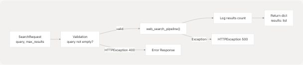
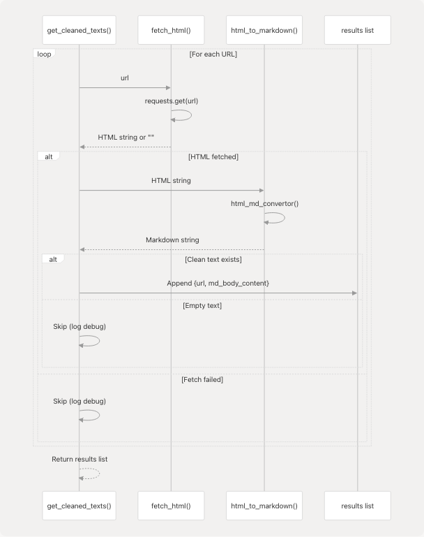
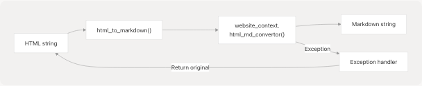

# Google Search and Web Scraping

## Purpose and Scope

This document covers the Google Search and Web Scraping functionality of the Agentic Browser system. This service provides the ability to query Google search, retrieve result URLs, fetch HTML content from those URLs, and convert the HTML to clean markdown format for downstream processing by AI agents.

The system consists of two main components:

1. **FastAPI Router** ([routers/google\_search.py](https://github.com/tashifkhan/agentic-browser/blob/e94826c4/routers/google_search.py)) - HTTP endpoint for search requests
2. **Search Pipeline** ([tools/google\_search/seach\_agent.py](https://github.com/tashifkhan/agentic-browser/blob/e94826c4/tools/google_search/seach_agent.py)) - Core search and extraction logic

For information about how this integrates with the agent intelligence system, see [Agent Intelligence System](/tashifkhan/agentic-browser/4-agent-intelligence-system). For details on the LLM abstraction used with this data, see [LLM Integration](/tashifkhan/agentic-browser/4.3-agent-tool-system).

---

## Architecture Overview

The Google Search and Web Scraping system follows a multi-stage pipeline architecture that transforms user queries into structured markdown content extracted from web pages.

### System Flow Diagram


```

**Sources:** [routers/google\_search.py](https://github.com/tashifkhan/agentic-browser/blob/e94826c4/routers/google_search.py) [tools/google\_search/seach\_agent.py](https://github.com/tashifkhan/agentic-browser/blob/e94826c4/tools/google_search/seach_agent.py)

---

## API Router Endpoint

The router exposes a single GET endpoint at `/api/google-search/` that accepts search parameters and returns structured results.

### Request Model

| Field | Type | Default | Description |
| --- | --- | --- | --- |
| `query` | `str` | Required | The search query string |
| `max_results` | `int` | `5` | Maximum number of results to return |

The `SearchRequest` model is defined at [routers/google\_search.py12-14](https://github.com/tashifkhan/agentic-browser/blob/e94826c4/routers/google_search.py#L12-L14)

### Endpoint Handler



The endpoint handler at [routers/google\_search.py17-47](https://github.com/tashifkhan/agentic-browser/blob/e94826c4/routers/google_search.py#L17-L47) performs:

1. **Validation** - Checks if `query` is provided, raises `HTTPException(400)` if missing
2. **Logging** - Logs request parameters using the `logger` instance
3. **Pipeline Invocation** - Calls `web_search_pipeline()` with query and max\_results
4. **Result Processing** - Wraps results in a dictionary with key `"results"`
5. **Error Handling** - Catches exceptions and converts to `HTTPException(500)`

**Sources:** [routers/google\_search.py17-47](https://github.com/tashifkhan/agentic-browser/blob/e94826c4/routers/google_search.py#L17-L47)

---

## Web Search Pipeline

The `web_search_pipeline()` function at [tools/google\_search/seach\_agent.py138-162](https://github.com/tashifkhan/agentic-browser/blob/e94826c4/tools/google_search/seach_agent.py#L138-L162) orchestrates the complete search-to-markdown workflow.

### Pipeline Stages


### Stage 1: URL Discovery

The `search_urls()` function at [tools/google\_search/seach\_agent.py57-66](https://github.com/tashifkhan/agentic-browser/blob/e94826c4/tools/google_search/seach_agent.py#L57-L66) and its underlying implementation `search_and_get_urls()` at [tools/google\_search/seach\_agent.py23-54](https://github.com/tashifkhan/agentic-browser/blob/e94826c4/tools/google_search/seach_agent.py#L23-L54) use the `googlesearch` library to query Google.

**Key implementation details:**

* Uses `googlesearch.search()` generator with parameters:
  + `query` - User's search query
  + `num_results` - Number of results to fetch
  + `lang="en"` - Search language set to English
* Iterates through results and collects URLs into a list
* Implements error handling for rate limiting exceptions
* Logs search progress and final URL count

**Sources:** [tools/google\_search/seach\_agent.py23-66](https://github.com/tashifkhan/agentic-browser/blob/e94826c4/tools/google_search/seach_agent.py#L23-L66)

### Stage 2: Content Extraction

The `get_cleaned_texts()` function at [tools/google\_search/seach\_agent.py105-126](https://github.com/tashifkhan/agentic-browser/blob/e94826c4/tools/google_search/seach_agent.py#L105-L126) processes the URL list to extract and clean content.

**Processing flow:**



**Sources:** [tools/google\_search/seach\_agent.py105-126](https://github.com/tashifkhan/agentic-browser/blob/e94826c4/tools/google_search/seach_agent.py#L105-L126)

---

## HTML Fetching

The `fetch_html()` function at [tools/google\_search/seach\_agent.py69-89](https://github.com/tashifkhan/agentic-browser/blob/e94826c4/tools/google_search/seach_agent.py#L69-L89) retrieves raw HTML content from web pages.

### Implementation Details

| Aspect | Implementation |
| --- | --- |
| HTTP Library | `requests` |
| Timeout | 30 seconds |
| User-Agent | Mozilla/5.0 Chrome 91.0 |
| Error Handling | Returns empty string `""` on failure |
| Status Check | `response.raise_for_status()` |

**Key features:**

* **User-Agent Spoofing** - Uses a realistic browser user-agent string to avoid bot detection ([tools/google\_search/seach\_agent.py74-76](https://github.com/tashifkhan/agentic-browser/blob/e94826c4/tools/google_search/seach_agent.py#L74-L76))
* **Timeout Protection** - 30-second timeout prevents indefinite hanging ([tools/google\_search/seach\_agent.py82](https://github.com/tashifkhan/agentic-browser/blob/e94826c4/tools/google_search/seach_agent.py#L82-L82))
* **Exception Safety** - All exceptions are caught and logged, returning empty string instead of propagating errors ([tools/google\_search/seach\_agent.py87-89](https://github.com/tashifkhan/agentic-browser/blob/e94826c4/tools/google_search/seach_agent.py#L87-L89))

**Sources:** [tools/google\_search/seach\_agent.py69-89](https://github.com/tashifkhan/agentic-browser/blob/e94826c4/tools/google_search/seach_agent.py#L69-L89)

---

## Markdown Conversion

The system converts fetched HTML to markdown format using the `html_md_convertor` function from the `website_context` module.

### Conversion Function



The `html_to_markdown()` function at [tools/google\_search/seach\_agent.py92-102](https://github.com/tashifkhan/agentic-browser/blob/e94826c4/tools/google_search/seach_agent.py#L92-L102) serves as a wrapper around the actual conversion logic.

**Error handling strategy:**

* If conversion fails, returns the original HTML string instead of markdown
* Logs exception details for debugging
* Ensures the pipeline never fails due to conversion errors

There is also a standalone `extract_text_from_url()` function at [tools/google\_search/seach\_agent.py129-135](https://github.com/tashifkhan/agentic-browser/blob/e94826c4/tools/google_search/seach_agent.py#L129-L135) that combines fetching and conversion for single-URL extraction.

**Sources:** [tools/google\_search/seach\_agent.py92-135](https://github.com/tashifkhan/agentic-browser/blob/e94826c4/tools/google_search/seach_agent.py#L92-L135)

---

## Integration with Agent System

The Google Search functionality integrates with the broader agent system through both direct API calls and as an agent tool.

### Usage Patterns


The `web_search_pipeline()` function is used as the core implementation for:

1. **Direct HTTP API** - Via the `/api/google-search/` endpoint
2. **Agent Tool** - As part of the `websearch_agent` tool in the agent system (see [Tool System](/tashifkhan/agentic-browser/4.2-browser-use-agent-and-script-generation))

**Sources:** [routers/google\_search.py](https://github.com/tashifkhan/agentic-browser/blob/e94826c4/routers/google_search.py) [tools/google\_search/seach\_agent.py](https://github.com/tashifkhan/agentic-browser/blob/e94826c4/tools/google_search/seach_agent.py)

---

## Error Handling and Logging

The system implements comprehensive error handling and logging at multiple levels.

### Logging Architecture


### Error Scenarios

| Component | Error Type | Handling Strategy | User Impact |
| --- | --- | --- | --- |
| Router | Missing query | Raise `HTTPException(400)` | Immediate error response |
| Router | Pipeline exception | Raise `HTTPException(500)` with details | Error response with message |
| Search | Rate limiting | Log warning, return partial results | Reduced result count |
| Search | Network error | Log exception, return empty list | Empty results, no crash |
| Fetch | HTTP error | Log exception, return `""` | Skip URL, continue pipeline |
| Fetch | Timeout | Log exception, return `""` | Skip URL, continue pipeline |
| Convert | Conversion error | Log exception, return original HTML | Less clean output, no crash |

**Key principles:**

* **Graceful degradation** - Individual URL failures don't break the entire pipeline
* **Detailed logging** - All errors logged with full context for debugging
* **Empty result handling** - System distinguishes between "no results found" (valid) and "error occurred" (logged)
* **Exception propagation** - Only router-level exceptions propagate to client as HTTP errors

**Sources:** [routers/google\_search.py17-47](https://github.com/tashifkhan/agentic-browser/blob/e94826c4/routers/google_search.py#L17-L47) [tools/google\_search/seach\_agent.py23-162](https://github.com/tashifkhan/agentic-browser/blob/e94826c4/tools/google_search/seach_agent.py#L23-L162) [core/config.py22-25](https://github.com/tashifkhan/agentic-browser/blob/e94826c4/core/config.py#L22-L25)

---

## Command-Line Interface

The search agent includes a standalone CLI for testing at [tools/google\_search/seach\_agent.py165-182](https://github.com/tashifkhan/agentic-browser/blob/e94826c4/tools/google_search/seach_agent.py#L165-L182)

**Usage:**

```
```
if __name__ == "__main__":
    search_query = input("Enter your search query: ")
    number_of_urls = int(input("How many URLs do you want? (e.g., 10): "))
    results = web_search_pipeline(search_query, max_results=number_of_urls)
```

This allows developers to test the search pipeline independently without running the full API server.

**Sources:** [tools/google\_search/seach\_agent.py165-182](https://github.com/tashifkhan/agentic-browser/blob/e94826c4/tools/google_search/seach_agent.py#L165-L182)
