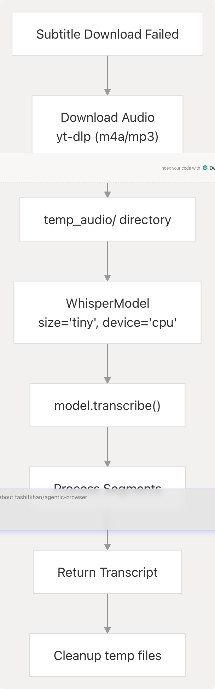

# YouTube Integration

> Source: https://deepwiki.com/tashifkhan/agentic-browser/3.3.3-youtube-integration

# YouTube Integration

Relevant source files

* [api/\_\_init\_\_.py](https://github.com/tashifkhan/agentic-browser/blob/e94826c4/api/__init__.py)
* [api/run.py](https://github.com/tashifkhan/agentic-browser/blob/e94826c4/api/run.py)
* [models/\_\_init\_\_.py](https://github.com/tashifkhan/agentic-browser/blob/e94826c4/models/__init__.py)
* [models/yt.py](https://github.com/tashifkhan/agentic-browser/blob/e94826c4/models/yt.py)
* [routers/calendar.py](https://github.com/tashifkhan/agentic-browser/blob/e94826c4/routers/calendar.py)
* [routers/github.py](https://github.com/tashifkhan/agentic-browser/blob/e94826c4/routers/github.py)
* [routers/gmail.py](https://github.com/tashifkhan/agentic-browser/blob/e94826c4/routers/gmail.py)
* [routers/google\_search.py](https://github.com/tashifkhan/agentic-browser/blob/e94826c4/routers/google_search.py)
* [routers/health.py](https://github.com/tashifkhan/agentic-browser/blob/e94826c4/routers/health.py)
* [routers/website.py](https://github.com/tashifkhan/agentic-browser/blob/e94826c4/routers/website.py)
* [routers/youtube.py](https://github.com/tashifkhan/agentic-browser/blob/e94826c4/routers/youtube.py)
* [tools/youtube\_utils/\_\_init\_\_.py](https://github.com/tashifkhan/agentic-browser/blob/e94826c4/tools/youtube_utils/__init__.py)
* [tools/youtube\_utils/extract\_id.py](https://github.com/tashifkhan/agentic-browser/blob/e94826c4/tools/youtube_utils/extract_id.py)
* [tools/youtube\_utils/get\_info.py](https://github.com/tashifkhan/agentic-browser/blob/e94826c4/tools/youtube_utils/get_info.py)
* [tools/youtube\_utils/get\_subs.py](https://github.com/tashifkhan/agentic-browser/blob/e94826c4/tools/youtube_utils/get_subs.py)
* [tools/youtube\_utils/transcript\_generator/\_\_init\_\_.py](https://github.com/tashifkhan/agentic-browser/blob/e94826c4/tools/youtube_utils/transcript_generator/__init__.py)
* [tools/youtube\_utils/transcript\_generator/clean.py](https://github.com/tashifkhan/agentic-browser/blob/e94826c4/tools/youtube_utils/transcript_generator/clean.py)
* [tools/youtube\_utils/transcript\_generator/duplicate.py](https://github.com/tashifkhan/agentic-browser/blob/e94826c4/tools/youtube_utils/transcript_generator/duplicate.py)
* [tools/youtube\_utils/transcript\_generator/srt.py](https://github.com/tashifkhan/agentic-browser/blob/e94826c4/tools/youtube_utils/transcript_generator/srt.py)
* [tools/youtube\_utils/transcript\_generator/timestamp.py](https://github.com/tashifkhan/agentic-browser/blob/e94826c4/tools/youtube_utils/transcript_generator/timestamp.py)

## Purpose and Scope

This document covers the YouTube integration subsystem, which enables video content extraction and Q&A capabilities. The integration provides:

* REST API endpoint for asking questions about YouTube videos
* Video metadata extraction using `yt-dlp`
* Subtitle/caption retrieval with automatic fallback to audio transcription using `faster-whisper`
* Multi-stage transcript cleaning and deduplication pipeline
* LLM-powered question answering over video content

For information about the YouTube agent tool used in the React Agent system, see [Agent Tool System](/tashifkhan/agentic-browser/4.3-agent-tool-system). For general web search capabilities, see [Web Search and Content Processing](/tashifkhan/agentic-browser/3.3.2-web-search-and-content-processing).

**Sources:** [routers/youtube.py1-59](https://github.com/tashifkhan/agentic-browser/blob/e94826c4/routers/youtube.py#L1-L59) [tools/youtube\_utils/get\_info.py1-77](https://github.com/tashifkhan/agentic-browser/blob/e94826c4/tools/youtube_utils/get_info.py#L1-L77) [tools/youtube\_utils/get\_subs.py1-178](https://github.com/tashifkhan/agentic-browser/blob/e94826c4/tools/youtube_utils/get_subs.py#L1-L178)

## System Architecture

The YouTube integration follows the standard three-tier router-service-tool pattern:


```

**Sources:** [routers/youtube.py1-59](https://github.com/tashifkhan/agentic-browser/blob/e94826c4/routers/youtube.py#L1-L59) [tools/youtube\_utils/\_\_init\_\_.py1-14](https://github.com/tashifkhan/agentic-browser/blob/e94826c4/tools/youtube_utils/__init__.py#L1-L14) [tools/youtube\_utils/transcript\_generator/\_\_init\_\_.py1-22](https://github.com/tashifkhan/agentic-browser/blob/e94826c4/tools/youtube_utils/transcript_generator/__init__.py#L1-L22)

## API Endpoint

### POST /youtube

The YouTube router exposes a single endpoint that accepts video URLs and questions.

**Request Model:**

```
```
class AskRequest(BaseModel):
    url: str
    question: str
    chat_history: Optional[List] = []
```
```

**Response:**

```
```
{
    "answer": "string"
}
```
```

The router performs validation, converts chat history to string format, and delegates to `YouTubeService.generate_answer()`:

[routers/youtube.py14-59](https://github.com/tashifkhan/agentic-browser/blob/e94826c4/routers/youtube.py#L14-L59)

| Parameter | Required | Description |
| --- | --- | --- |
| `url` | Yes | YouTube video URL (youtube.com or youtu.be format) |
| `question` | Yes | User question about the video content |
| `chat_history` | No | List of previous conversation messages for context |

**Sources:** [routers/youtube.py14-59](https://github.com/tashifkhan/agentic-browser/blob/e94826c4/routers/youtube.py#L14-L59) [models/requests/ask.py](https://github.com/tashifkhan/agentic-browser/blob/e94826c4/models/requests/ask.py) (referenced but not provided)

## Video Information Extraction

The `get_video_info()` function extracts comprehensive metadata from YouTube videos:

```

```

**Extracted Metadata:**

[models/yt.py5-17](https://github.com/tashifkhan/agentic-browser/blob/e94826c4/models/yt.py#L5-L17) defines the `YTVideoInfo` model with fields:

| Field | Type | Description |
| --- | --- | --- |
| `title` | str | Video title |
| `description` | str | Video description |
| `duration` | int | Duration in seconds |
| `uploader` | str | Channel/uploader name |
| `upload_date` | str | Upload date |
| `view_count` | int | Number of views |
| `like_count` | int | Number of likes |
| `tags` | List[str] | Video tags |
| `categories` | List[str] | Video categories |
| `transcript` | Optional[str] | Cleaned transcript text |

The function uses `yt-dlp` with options to skip video download and extract only metadata: [tools/youtube\_utils/get\_info.py14-22](https://github.com/tashifkhan/agentic-browser/blob/e94826c4/tools/youtube_utils/get_info.py#L14-L22)

**Error Handling:** The function detects error messages from subtitle extraction and sets `transcript` to `None` if known error patterns are found: [tools/youtube\_utils/get\_info.py43-70](https://github.com/tashifkhan/agentic-browser/blob/e94826c4/tools/youtube_utils/get_info.py#L43-L70)

**Sources:** [tools/youtube\_utils/get\_info.py11-76](https://github.com/tashifkhan/agentic-browser/blob/e94826c4/tools/youtube_utils/get_info.py#L11-L76) [models/yt.py5-17](https://github.com/tashifkhan/agentic-browser/blob/e94826c4/models/yt.py#L5-L17)

## Subtitle and Transcript Extraction

The system employs a two-phase approach with automatic fallback:

### Phase 1: Subtitle Download

The `get_subtitle_content()` function attempts to download existing subtitles or captions:

```

```

**Configuration:** [tools/youtube\_utils/get\_subs.py14-25](https://github.com/tashifkhan/agentic-browser/blob/e94826c4/tools/youtube_utils/get_subs.py#L14-L25)

* Writes both manual and auto-generated subtitles
* Supports subtitle languages via `subtitleslangs` parameter
* Formats: VTT, SRT, or best available
* Skips video download (`skip_download: True`)

**Sources:** [tools/youtube\_utils/get\_subs.py8-100](https://github.com/tashifkhan/agentic-browser/blob/e94826c4/tools/youtube_utils/get_subs.py#L8-L100)

### Phase 2: Audio Transcription Fallback

If subtitles are unavailable, `download_audio_and_transcribe()` uses `faster-whisper`:

```

```

**Audio Download Options:** [tools/youtube\_utils/get\_subs.py117-132](https://github.com/tashifkhan/agentic-browser/blob/e94826c4/tools/youtube_utils/get_subs.py#L117-L132)

* Format: `m4a/bestaudio/best`
* FFmpeg post-processing to MP3 (192 kbps)
* Custom User-Agent header for compatibility

**Transcription Configuration:** [tools/youtube\_utils/get\_subs.py148-164](https://github.com/tashifkhan/agentic-browser/blob/e94826c4/tools/youtube_utils/get_subs.py#L148-L164)

* Model: `tiny` (lightweight, fast)
* Device: `cpu` (no GPU required)
* Compute type: `int8` (quantized for efficiency)
* Beam size: 5

The transcription segments are joined into a single text string and returned.

**Sources:** [tools/youtube\_utils/get\_subs.py102-178](https://github.com/tashifkhan/agentic-browser/blob/e94826c4/tools/youtube_utils/get_subs.py#L102-L178)

## Transcript Processing Pipeline

Raw subtitle/transcript text undergoes four sequential cleaning stages to remove formatting artifacts:

```

```

### Stage 1: clean\_transcript()

[tools/youtube\_utils/transcript\_generator/clean.py22-66](https://github.com/tashifkhan/agentic-browser/blob/e94826c4/tools/youtube_utils/transcript_generator/clean.py#L22-L66)

Removes:

* Full timestamp lines matching `HH:MM:SS.mmm --> HH:MM:SS.mmm`
* VTT headers: `WEBVTT`, `Kind:`, `Language:`
* VTT metadata: `NOTE`, `STYLE`, `REGION`, `::cue`
* Speaker tags: `<v Speaker Name>content</v>`
* Inline timestamps: `<HH:MM:SS.mmm>`
* Cue tags: `<c>`, `</c>`, etc.
* VTT alignment directives: `align:start position:0%`

Groups consecutive non-empty lines into paragraphs separated by blank lines.

### Stage 2: clean\_srt\_text()

[tools/youtube\_utils/transcript\_generator/srt.py4-29](https://github.com/tashifkhan/agentic-browser/blob/e94826c4/tools/youtube_utils/transcript_generator/srt.py#L4-L29)

Removes:

* Full SRT timestamp blocks with trailing `\n\n`
* Inline time codes
* Alignment directives
* Converts literal `\n` sequences to actual newlines

### Stage 3: clean\_timestamps\_and\_dedupe()

[tools/youtube\_utils/transcript\_generator/timestamp.py10-31](https://github.com/tashifkhan/agentic-browser/blob/e94826c4/tools/youtube_utils/transcript_generator/timestamp.py#L10-L31)

Removes:

* Timestamp arrow patterns: `HH:MM:SS.mmm --> HH:MM:SS.mmm`
* Inline cue markers: `<HH:MM:SS.mmm>`

Deduplicates lines using a set to track seen content.

### Stage 4: remove\_sentence\_repeats()

[tools/youtube\_utils/transcript\_generator/duplicate.py4-25](https://github.com/tashifkhan/agentic-browser/blob/e94826c4/tools/youtube_utils/transcript_generator/duplicate.py#L4-L25)

Collapses consecutive duplicate sentences. Uses a forward-looking check: if the current line is a prefix of the next line, it's considered a repeat and removed.

**Pipeline Orchestration:** [tools/youtube\_utils/transcript\_generator/\_\_init\_\_.py11-16](https://github.com/tashifkhan/agentic-browser/blob/e94826c4/tools/youtube_utils/transcript_generator/__init__.py#L11-L16)
```
def processed_transcript(text: str) -> str:
    cleaned_text = remove_sentence_repeats(
        clean_timestamps_and_dedupe(
            clean_srt_text(
                clean_transcript(text)
            )
        )
    )
    return cleaned_text
```
```

**Sources:** [tools/youtube\_utils/transcript\_generator/\_\_init\_\_.py11-16](https://github.com/tashifkhan/agentic-browser/blob/e94826c4/tools/youtube_utils/transcript_generator/__init__.py#L11-L16) [tools/youtube\_utils/transcript\_generator/clean.py22-66](https://github.com/tashifkhan/agentic-browser/blob/e94826c4/tools/youtube_utils/transcript_generator/clean.py#L22-L66) [tools/youtube\_utils/transcript\_generator/srt.py4-29](https://github.com/tashifkhan/agentic-browser/blob/e94826c4/tools/youtube_utils/transcript_generator/srt.py#L4-L29) [tools/youtube\_utils/transcript\_generator/timestamp.py10-31](https://github.com/tashifkhan/agentic-browser/blob/e94826c4/tools/youtube_utils/transcript_generator/timestamp.py#L10-L31) [tools/youtube\_utils/transcript\_generator/duplicate.py4-25](https://github.com/tashifkhan/agentic-browser/blob/e94826c4/tools/youtube_utils/transcript_generator/duplicate.py#L4-L25)

## Video ID Extraction

The `extract_video_id()` utility handles multiple YouTube URL formats:

[tools/youtube\_utils/extract\_id.py8-23](https://github.com/tashifkhan/agentic-browser/blob/e94826c4/tools/youtube_utils/extract_id.py#L8-L23)

| URL Format | Hostname | Extraction Method |
| --- | --- | --- |
| `https://www.youtube.com/watch?v=VIDEO_ID` | `www.youtube.com` or `youtube.com` | Parse query parameter `v` |
| `https://youtu.be/VIDEO_ID` | `youtu.be` | Extract from path (skip first `/`) |

Returns `None` if extraction fails or URL is invalid.

**Sources:** [tools/youtube\_utils/extract\_id.py8-23](https://github.com/tashifkhan/agentic-browser/blob/e94826c4/tools/youtube_utils/extract_id.py#L8-L23)

## Integration with Agent System

The YouTube integration is exposed to the React Agent system through the `youtube_agent` tool, allowing agents to autonomously query video content as part of multi-step reasoning workflows. See [Agent Tool System](/tashifkhan/agentic-browser/4.3-agent-tool-system) for details on tool registration and usage patterns.

**Sources:** [routers/youtube.py1-59](https://github.com/tashifkhan/agentic-browser/blob/e94826c4/routers/youtube.py#L1-L59)

## Error Handling

The system implements comprehensive error handling at multiple levels:

### Router Level

[routers/youtube.py34-58](https://github.com/tashifkhan/agentic-browser/blob/e94826c4/routers/youtube.py#L34-L58)

* Returns HTTP 400 for missing required parameters
* Returns HTTP 500 for internal errors
* Preserves HTTPException from service layer

### Tool Level

**Subtitle Extraction:** [tools/youtube\_utils/get\_subs.py73-89](https://github.com/tashifkhan/agentic-browser/blob/e94826c4/tools/youtube_utils/get_subs.py#L73-L89)

* Catches `yt_dlp.utils.DownloadError`
* Returns specific error messages for known cases:
  + "Video unavailable."
  + "Subtitles not available for the specified language."

**Video Info:** [tools/youtube\_utils/get\_info.py54-70](https://github.com/tashifkhan/agentic-browser/blob/e94826c4/tools/youtube_utils/get_info.py#L54-L70)

* Detects error messages from subtitle extraction
* Sets `transcript` field to `None` on errors
* Logs warnings for unavailable transcripts

**Transcription Fallback:** [tools/youtube\_utils/get\_subs.py166-168](https://github.com/tashifkhan/agentic-browser/blob/e94826c4/tools/youtube_utils/get_subs.py#L166-L168)

* Returns error message string if transcription fails
* Logs detailed error information

### Cleanup Guarantees

Both subtitle download and audio transcription use `finally` blocks to ensure temporary files are removed: [tools/youtube\_utils/get\_subs.py91-99](https://github.com/tashifkhan/agentic-browser/blob/e94826c4/tools/youtube_utils/get_subs.py#L91-L99) [tools/youtube\_utils/get\_subs.py170-177](https://github.com/tashifkhan/agentic-browser/blob/e94826c4/tools/youtube_utils/get_subs.py#L170-L177)

**Sources:** [routers/youtube.py34-58](https://github.com/tashifkhan/agentic-browser/blob/e94826c4/routers/youtube.py#L34-L58) [tools/youtube\_utils/get\_subs.py73-99](https://github.com/tashifkhan/agentic-browser/blob/e94826c4/tools/youtube_utils/get_subs.py#L73-L99) [tools/youtube\_utils/get\_subs.py166-177](https://github.com/tashifkhan/agentic-browser/blob/e94826c4/tools/youtube_utils/get_subs.py#L166-L177) [tools/youtube\_utils/get\_info.py54-70](https://github.com/tashifkhan/agentic-browser/blob/e94826c4/tools/youtube_utils/get_info.py#L54-L70)

## Dependencies

| Library | Purpose | Configuration |
| --- | --- | --- |
| `yt-dlp` | Video metadata extraction and subtitle download | Configured via `ydl_opts` dict |
| `faster-whisper` | Audio transcription when subtitles unavailable | `tiny` model, CPU/INT8 compute |
| `BeautifulSoup` | (Indirect) HTML parsing in related tools | N/A |

**Sources:** [tools/youtube\_utils/get\_subs.py2](https://github.com/tashifkhan/agentic-browser/blob/e94826c4/tools/youtube_utils/get_subs.py#L2-L2) [tools/youtube\_utils/get\_subs.py108](https://github.com/tashifkhan/agentic-browser/blob/e94826c4/tools/youtube_utils/get_subs.py#L108-L108) [tools/youtube\_utils/get\_info.py5](https://github.com/tashifkhan/agentic-browser/blob/e94826c4/tools/youtube_utils/get_info.py#L5-L5)