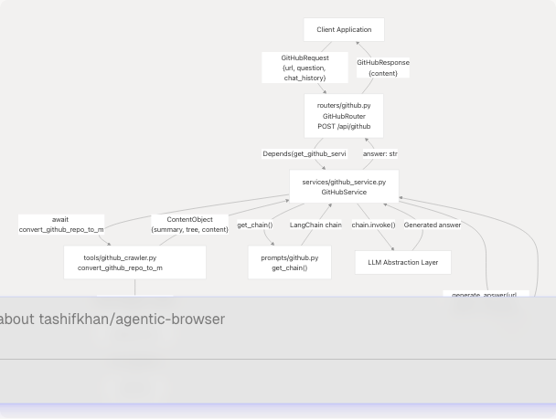
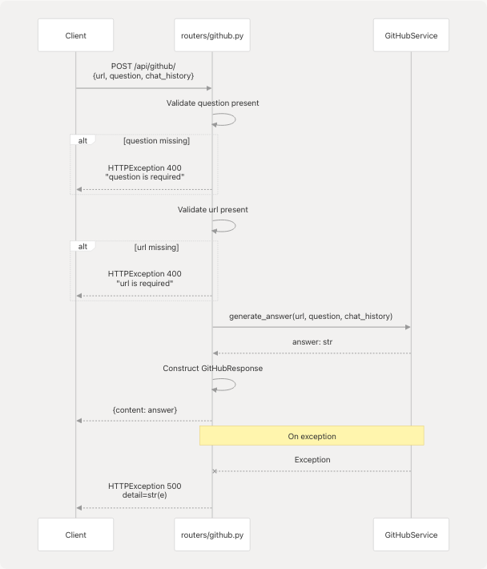
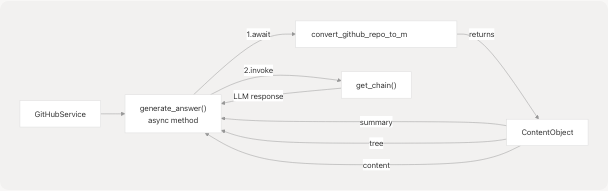
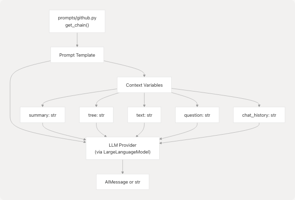
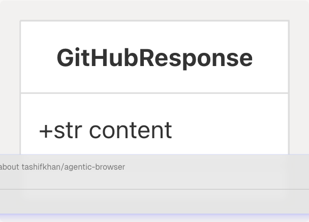
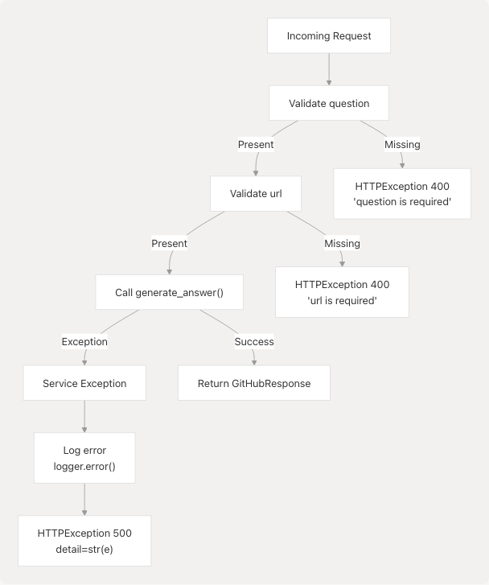

# GitHub Integration

## Purpose and Scope

This document describes the GitHub integration subsystem, which provides repository crawling and question-answering capabilities using the gitingest library. The system follows the standard router-service-tool architecture pattern, exposing a FastAPI endpoint that processes GitHub repository URLs and answers questions about the codebase using LLM-based analysis.

For information about other API routers, see [API Routers](/tashifkhan/agentic-browser/3.3-api-routers). For details on the LLM integration used by this service, see [LLM Integration Layer](/tashifkhan/agentic-browser/4.5-llm-integration-layer).

## Architecture Overview

The GitHub integration follows a three-tier architecture where the router handles HTTP concerns, the service implements business logic, and the tool layer interacts with external systems.


```

**Sources:** [routers/github.py1-48](https://github.com/tashifkhan/agentic-browser/blob/e94826c4/routers/github.py#L1-L48) [services/github\_service.py1-40](https://github.com/tashifkhan/agentic-browser/blob/e94826c4/services/github_service.py#L1-L40)

## API Endpoint

The GitHub router exposes a single POST endpoint at `/api/github/` that accepts repository analysis requests.

### Endpoint Specification

| Property | Value |
| --- | --- |
| **Path** | `/api/github/` |
| **Method** | POST |
| **Request Model** | `GitHubRequest` |
| **Response Model** | `GitHubResponse` |
| **Service Injection** | `Depends(get_github_service)` |

### Router Implementation

The router performs input validation and delegates processing to the `GitHubService`:



The router implementation at [routers/github.py16-47](https://github.com/tashifkhan/agentic-browser/blob/e94826c4/routers/github.py#L16-L47) follows this flow:

1. Extract `question`, `chat_history`, and `url` from the `GitHubRequest`
2. Validate that `question` is not empty
3. Validate that `url` is not empty
4. Convert `url` string to `HttpUrl` type
5. Call `service.generate_answer()` with validated parameters
6. Return response wrapped in `GitHubResponse` model
7. Catch exceptions and convert to HTTP 500 errors

**Sources:** [routers/github.py1-48](https://github.com/tashifkhan/agentic-browser/blob/e94826c4/routers/github.py#L1-L48)

## Service Layer

The `GitHubService` class encapsulates the business logic for repository analysis and question answering.

### Service Architecture



### generate\_answer Method

The core method signature is:

```
async def generate_answer(
    self,
    url: HttpUrl,
    question: str,
    chat_history: list[dict] = [],
) -> str
```

Implementation flow at [services/github\_service.py11-39](https://github.com/tashifkhan/agentic-browser/blob/e94826c4/services/github_service.py#L11-L39):

1. **Repository Conversion**: Calls `await convert_github_repo_to_markdown(url)` to fetch repository content
2. **Chain Creation**: Calls `get_chain()` to obtain a configured LangChain prompt chain
3. **Chain Invocation**: Invokes the chain with parameters:
   * `summary`: Repository summary from ContentObject
   * `tree`: File tree structure from ContentObject
   * `text`: Full content from ContentObject
   * `question`: User's question
   * `chat_history`: Conversation history (empty string if not provided)
4. **Response Extraction**: Returns `response.content` if response is not a string, otherwise returns the response directly
5. **Error Handling**: Catches all exceptions, logs them, and returns a friendly error message

**Sources:** [services/github\_service.py1-40](https://github.com/tashifkhan/agentic-browser/blob/e94826c4/services/github_service.py#L1-L40)

## Repository Crawling with gitingest

The `convert_github_repo_to_markdown()` function in the tool layer uses the gitingest library to analyze GitHub repositories.

### Crawling Process


The gitingest library provides:

* **Automated Cloning**: Clones the repository to analyze its structure
* **File Tree Generation**: Creates a hierarchical representation of the repository structure
* **Content Extraction**: Extracts and combines file contents into a single markdown document
* **Summary Generation**: Provides a high-level overview of the repository

The returned `ContentObject` contains three key fields:

* `summary`: Brief description of the repository
* `tree`: ASCII tree representation of the file structure
* `content`: Concatenated markdown of all relevant files

**Sources:** [services/github\_service.py19](https://github.com/tashifkhan/agentic-browser/blob/e94826c4/services/github_service.py#L19-L19)

## LLM-Based Question Answering

The service uses a LangChain prompt chain to answer questions about the repository using the extracted content.

### Prompt Chain Flow



### Chain Invocation

The chain is invoked at [services/github\_service.py22-30](https://github.com/tashifkhan/agentic-browser/blob/e94826c4/services/github_service.py#L22-L30) with a dictionary containing:

| Parameter | Source | Description |
| --- | --- | --- |
| `summary` | `content_obj.summary` | Repository overview from gitingest |
| `tree` | `content_obj.tree` | Directory structure |
| `text` | `content_obj.content` | Full file contents in markdown |
| `question` | Function parameter | User's question about the repository |
| `chat_history` | Function parameter | Previous conversation context (empty string if none) |

The prompt template (defined in `prompts/github.py`) structures these inputs to guide the LLM in providing accurate answers based on the repository content.

**Sources:** [services/github\_service.py11-39](https://github.com/tashifkhan/agentic-browser/blob/e94826c4/services/github_service.py#L11-L39)

## Request and Response Models

The API uses Pydantic models for type-safe request/response handling.

### GitHubRequest Model


Defined in [models/requests/github.py](https://github.com/tashifkhan/agentic-browser/blob/e94826c4/models/requests/github.py) this model requires:

* `url`: GitHub repository URL (validated as string, converted to `HttpUrl` in router)
* `question`: The question to answer about the repository
* `chat_history`: Optional list of previous conversation messages

### GitHubResponse Model



Defined in [models/response/gihub.py](https://github.com/tashifkhan/agentic-browser/blob/e94826c4/models/response/gihub.py) this model contains:

* `content`: The generated answer from the LLM

**Sources:** [routers/github.py4-5](https://github.com/tashifkhan/agentic-browser/blob/e94826c4/routers/github.py#L4-L5)

## Error Handling

The GitHub integration implements comprehensive error handling at both the router and service layers.

### Error Handling Strategy



### Router-Level Error Handling

At [routers/github.py20-47](https://github.com/tashifkhan/agentic-browser/blob/e94826c4/routers/github.py#L20-L47):

* **Validation Errors**: Returns HTTP 400 with descriptive error messages for missing required fields
* **Service Exceptions**: Catches all exceptions, logs them, and returns HTTP 500 with exception details

### Service-Level Error Handling

At [services/github\_service.py37-39](https://github.com/tashifkhan/agentic-browser/blob/e94826c4/services/github_service.py#L37-L39):

* **Exception Logging**: Uses `logger.error()` to record all errors with full details
* **Friendly Error Messages**: Returns a user-friendly message instead of exposing internal errors
* **Exception Re-raising**: Allows router to handle HTTP status codes while service focuses on logging

### Error Response Pattern

All errors follow the FastAPI standard HTTPException pattern:

```
{
  "detail": "Error description string"
}
```

**Sources:** [routers/github.py20-47](https://github.com/tashifkhan/agentic-browser/blob/e94826c4/routers/github.py#L20-L47) [services/github\_service.py37-39](https://github.com/tashifkhan/agentic-browser/blob/e94826c4/services/github_service.py#L37-L39)

## Dependency Injection

The router uses FastAPI's dependency injection system to obtain service instances.

### Dependency Function

The `get_github_service()` function at [routers/github.py12-13](https://github.com/tashifkhan/agentic-browser/blob/e94826c4/routers/github.py#L12-L13) provides a factory for `GitHubService` instances:

```
def get_github_service():
    return GitHubService()
```

This dependency is injected into the endpoint handler at [routers/github.py18](https://github.com/tashifkhan/agentic-browser/blob/e94826c4/routers/github.py#L18-L18):

```
async def github_crawler(
    request: GitHubRequest, 
    service: GitHubService = Depends(get_github_service)
):
```

This pattern enables:

* **Testability**: Easy to mock service in unit tests
* **Separation of Concerns**: Router doesn't manage service lifecycle
* **Consistency**: Follows the same pattern as other routers (Gmail, Calendar, YouTube, etc.)

**Sources:** [routers/github.py12-18](https://github.com/tashifkhan/agentic-browser/blob/e94826c4/routers/github.py#L12-L18)

## Integration with Agent System

The GitHub functionality is also exposed as an agent tool for use by the React Agent system (see [Agent Tool System](/tashifkhan/agentic-browser/4.3-agent-tool-system)).

```


The `github_agent` tool wraps the same service logic, allowing the React Agent to autonomously analyze GitHub repositories as part of multi-step reasoning workflows.

**Sources:** [services/github\_service.py1-40](https://github.com/tashifkhan/agentic-browser/blob/e94826c4/services/github_service.py#L1-L40)
