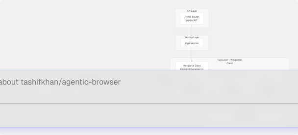
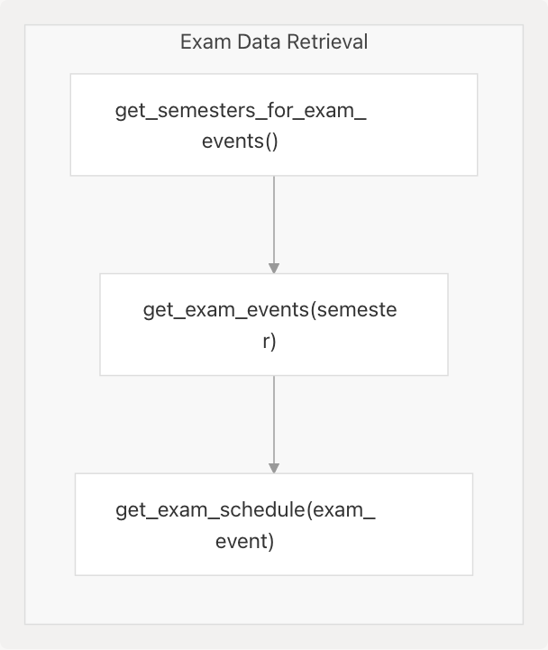

# PyJIIT Webportal Integration

## Purpose and Scope

This document covers the PyJIIT webportal integration system, which provides programmatic access to the JIIT (Jaypee Institute of Information Technology) student webportal. The system implements a comprehensive client library for authentication, attendance tracking, grade retrieval, exam schedules, and other student-related data from `https://webportal.jiit.ac.in:6011/StudentPortalAPI`.

For information about how PyJIIT is used as an agent tool within the React Agent system, see [Agent Tool System](4.3-agent-tool-system). For details on the PyJIIT router's role in the overall API architecture, see [API Routers](3.3-api-routers).

**Sources:** [tools/pyjiit/wrapper.py1-646](https://github.com/tashifkhan/agentic-browser/blob/e94826c4/tools/pyjiit/wrapper.py#L1-L646) [routers/pyjiit.py1-93](https://github.com/tashifkhan/agentic-browser/blob/e94826c4/routers/pyjiit.py#L1-L93)

---

## System Architecture

The PyJIIT integration follows the standard three-tier architecture pattern: Router → Service → Tool. The router handles HTTP request/response, the service layer manages business logic and error handling, and the tool layer provides the low-level client implementation with encryption.



**Sources:** [routers/pyjiit.py1-93](https://github.com/tashifkhan/agentic-browser/blob/e94826c4/routers/pyjiit.py#L1-L93) [tools/pyjiit/wrapper.py1-646](https://github.com/tashifkhan/agentic-browser/blob/e94826c4/tools/pyjiit/wrapper.py#L1-L646) [tools/pyjiit/encryption.py1-60](https://github.com/tashifkhan/agentic-browser/blob/e94826c4/tools/pyjiit/encryption.py#L1-L60)

---

## API Endpoints

The PyJIIT router exposes three primary endpoints for webportal operations:

| Endpoint | Method | Purpose | Request Model | Response Model |
| --- | --- | --- | --- | --- |
| `/api/pyjiit/login` | POST | Authenticate and obtain session | `BasicAuthRequest` | `dict` (WebportalSession) |
| `/api/pyjiit/semesters` | POST | List available semesters | `session_payload: Dict` | `List[Dict[str, Any]]` |
| `/api/pyjiit/attendence` | POST | Retrieve attendance data | `session_payload: Dict`, `registration_code: Optional[str]` | `List[Dict[str, Any]]` |

### Login Endpoint


The login flow [routers/pyjiit.py39-51](https://github.com/tashifkhan/agentic-browser/blob/e94826c4/routers/pyjiit.py#L39-L51) handles authentication by:

1. Accepting username and password via `BasicAuthRequest`
2. Fetching a captcha token (currently uses default captcha)
3. Performing two-step authentication with the JIIT API
4. Returning a `WebportalSession` object containing authentication tokens

**Sources:** [routers/pyjiit.py12-51](https://github.com/tashifkhan/agentic-browser/blob/e94826c4/routers/pyjiit.py#L12-L51) [tools/pyjiit/wrapper.py162-199](https://github.com/tashifkhan/agentic-browser/blob/e94826c4/tools/pyjiit/wrapper.py#L162-L199)

### Semesters Endpoint

The `/semesters` endpoint [routers/pyjiit.py54-72](https://github.com/tashifkhan/agentic-browser/blob/e94826c4/routers/pyjiit.py#L54-L72) initializes a `Webportal` session from the login response payload and retrieves the list of registered semesters. Each semester contains `registration_id` and `registration_code` fields required for subsequent operations.

**Sources:** [routers/pyjiit.py54-72](https://github.com/tashifkhan/agentic-browser/blob/e94826c4/routers/pyjiit.py#L54-L72) [tools/pyjiit/wrapper.py309-330](https://github.com/tashifkhan/agentic-browser/blob/e94826c4/tools/pyjiit/wrapper.py#L309-L330)

### Attendance Endpoint

The `/attendence` endpoint [routers/pyjiit.py75-92](https://github.com/tashifkhan/agentic-browser/blob/e94826c4/routers/pyjiit.py#L75-L92) (note the intentional spelling matching the user's requirement) retrieves attendance data for a specific semester. If no `registration_code` is provided, it defaults to the latest semester from attendance metadata.

**Sources:** [routers/pyjiit.py75-92](https://github.com/tashifkhan/agentic-browser/blob/e94826c4/routers/pyjiit.py#L75-L92) [tools/pyjiit/wrapper.py234-282](https://github.com/tashifkhan/agentic-browser/blob/e94826c4/tools/pyjiit/wrapper.py#L234-L282)

---

## Authentication and Encryption

### Payload Encryption

All API requests to the JIIT webportal require encrypted payloads using AES-256 in CBC mode. The encryption system generates daily-rotating keys based on the current date.


**Encryption Details:**

* **Algorithm:** AES-256-CBC
* **Initialization Vector (IV):** Fixed value `dcek9wb8frty1pnm` [tools/pyjiit/encryption.py7](https://github.com/tashifkhan/agentic-browser/blob/e94826c4/tools/pyjiit/encryption.py#L7-L7)
* **Key Generation:** `"qa8y" + date_seq + "ty1pn"` [tools/pyjiit/encryption.py10-12](https://github.com/tashifkhan/agentic-browser/blob/e94826c4/tools/pyjiit/encryption.py#L10-L12)
* **Key Rotation:** Daily at 0000 hrs IST
* **Functions:**
  + `serialize_payload(payload: dict) -> str` - Encrypts dict to base64 string [tools/pyjiit/encryption.py48-53](https://github.com/tashifkhan/agentic-browser/blob/e94826c4/tools/pyjiit/encryption.py#L48-L53)
  + `deserialize_payload(payload: str) -> dict` - Decrypts base64 string to dict [tools/pyjiit/encryption.py40-45](https://github.com/tashifkhan/agentic-browser/blob/e94826c4/tools/pyjiit/encryption.py#L40-L45)

**Sources:** [tools/pyjiit/encryption.py1-60](https://github.com/tashifkhan/agentic-browser/blob/e94826c4/tools/pyjiit/encryption.py#L1-L60)

### HTTP Headers

Every request to the JIIT API requires two headers:

| Header | Purpose | Generation |
| --- | --- | --- |
| `Authorization` | Bearer token for authenticated requests | `Bearer {session.token}` [tools/pyjiit/wrapper.py114](https://github.com/tashifkhan/agentic-browser/blob/e94826c4/tools/pyjiit/wrapper.py#L114-L114) |
| `LocalName` | Client identification, encrypted timestamp | Base64(AES-encrypt(random + date\_seq + random)) [tools/pyjiit/encryption.py15-23](https://github.com/tashifkhan/agentic-browser/blob/e94826c4/tools/pyjiit/encryption.py#L15-L23) |

The `LocalName` header contains an encrypted random string combined with a date sequence, regenerated for each request.

**Sources:** [tools/pyjiit/wrapper.py109-116](https://github.com/tashifkhan/agentic-browser/blob/e94826c4/tools/pyjiit/wrapper.py#L109-L116) [tools/pyjiit/encryption.py15-23](https://github.com/tashifkhan/agentic-browser/blob/e94826c4/tools/pyjiit/encryption.py#L15-L23)

---

## WebportalSession Model

The `WebportalSession` class [tools/pyjiit/wrapper.py49-117](https://github.com/tashifkhan/agentic-browser/blob/e94826c4/tools/pyjiit/wrapper.py#L49-L117) is a Pydantic model that encapsulates authentication state and session information.

### Session Fields

| Field | Type | Description |
| --- | --- | --- |
| `raw_response` | `dict` | Complete API response from login |
| `regdata` | `dict` | Registration data containing tokens and IDs |
| `institute` | `str` | Institute label (e.g., "JIIT-62") |
| `instituteid` | `str` | Institute identifier |
| `memberid` | `str` | Student member ID |
| `userid` | `str` | User ID |
| `token` | `str` | JWT-like authentication token |
| `expiry` | `datetime` | Token expiration timestamp |
| `clientid` | `str | None` | Client identifier |
| `membertype` | `str | None` | Member type (typically "S" for student) |
| `name` | `str | None` | Student name |

### Session Initialization

The `WebportalSession` constructor [tools/pyjiit/wrapper.py70-107](https://github.com/tashifkhan/agentic-browser/blob/e94826c4/tools/pyjiit/wrapper.py#L70-L107) performs the following operations:

1. Extracts institute information from `regdata["institutelist"][0]`
2. Parses the JWT-like token to extract expiration timestamp
3. Decodes the base64-encoded token payload (handling URL-safe encoding without padding)
4. Falls back to current time if token parsing fails

**Sources:** [tools/pyjiit/wrapper.py49-117](https://github.com/tashifkhan/agentic-browser/blob/e94826c4/tools/pyjiit/wrapper.py#L49-L117)

---

## Webportal Client

### Core Class Structure


**Sources:** [tools/pyjiit/wrapper.py119-646](https://github.com/tashifkhan/agentic-browser/blob/e94826c4/tools/pyjiit/wrapper.py#L119-L646)

### Authentication Decorator

The `@authenticated` decorator [tools/pyjiit/wrapper.py27-46](https://github.com/tashifkhan/agentic-browser/blob/e94826c4/tools/pyjiit/wrapper.py#L27-L46) ensures that methods requiring authentication have a valid session:

1. Checks if `self.session` is not `None` (raises `NotLoggedIn` if missing)
2. Session expiry checks are commented out due to API bugs returning incorrect expiry times
3. Wraps any method that requires authenticated access

**Sources:** [tools/pyjiit/wrapper.py27-46](https://github.com/tashifkhan/agentic-browser/blob/e94826c4/tools/pyjiit/wrapper.py#L27-L46)

### Private HTTP Method

The `__hit()` method [tools/pyjiit/wrapper.py131-160](https://github.com/tashifkhan/agentic-browser/blob/e94826c4/tools/pyjiit/wrapper.py#L131-L160) is the central HTTP request handler:

**Features:**

* Accepts custom exception types via `exception` kwarg (defaults to `APIError`)
* Automatically adds authentication headers when `authenticated=True`
* Generates `LocalName` header for all requests
* Validates response status and raises appropriate exceptions:
  + `SessionExpired` when status code is 401
  + Custom exception when `responseStatus != "Success"`

**Sources:** [tools/pyjiit/wrapper.py131-160](https://github.com/tashifkhan/agentic-browser/blob/e94826c4/tools/pyjiit/wrapper.py#L131-L160)

---

## Attendance System

The attendance retrieval system involves multiple steps and data models:


### Attendance Methods

| Method | Endpoint | Returns | Purpose |
| --- | --- | --- | --- |
| `get_attendance_meta()` | `/StudentClassAttendance/getstudentInforegistrationforattendence` | `AttendanceMeta` | Retrieve metadata including headers [tools/pyjiit/wrapper.py233-254](https://github.com/tashifkhan/agentic-browser/blob/e94826c4/tools/pyjiit/wrapper.py#L233-L254) |
| `get_attendance(header, semester)` | `/StudentClassAttendance/getstudentattendancedetail` | `dict` | Get detailed attendance for semester [tools/pyjiit/wrapper.py256-282](https://github.com/tashifkhan/agentic-browser/blob/e94826c4/tools/pyjiit/wrapper.py#L256-L282) |
| `get_registered_semesters()` | `/reqsubfaculty/getregistrationList` | `List[Semester]` | List all registered semesters [tools/pyjiit/wrapper.py308-330](https://github.com/tashifkhan/agentic-browser/blob/e94826c4/tools/pyjiit/wrapper.py#L308-L330) |

### Data Models

**AttendanceHeader:** Contains `stynumber` field required for attendance queries [tools/pyjiit/wrapper.py15](https://github.com/tashifkhan/agentic-browser/blob/e94826c4/tools/pyjiit/wrapper.py#L15-L15)

**Semester:** Contains `registration_id` and `registration_code` fields required for semester-specific queries [tools/pyjiit/wrapper.py15](https://github.com/tashifkhan/agentic-browser/blob/e94826c4/tools/pyjiit/wrapper.py#L15-L15)

**AttendanceMeta:** Aggregates attendance headers and semester information [tools/pyjiit/wrapper.py15](https://github.com/tashifkhan/agentic-browser/blob/e94826c4/tools/pyjiit/wrapper.py#L15-L15)

**Sources:** [tools/pyjiit/wrapper.py233-330](https://github.com/tashifkhan/agentic-browser/blob/e94826c4/tools/pyjiit/wrapper.py#L233-L330) [tools/pyjiit/attendance.py](https://github.com/tashifkhan/agentic-browser/blob/e94826c4/tools/pyjiit/attendance.py) (imported at line 15)

---

## Academic Records

The webportal client provides comprehensive access to academic records:

### Examination System



**Exam Methods:**

| Method | Endpoint | Returns |
| --- | --- | --- |
| `get_semesters_for_exam_events()` | `/studentcommonsontroller/getsemestercode-withstudentexamevents` | `List[Semester]` [tools/pyjiit/wrapper.py357-382](https://github.com/tashifkhan/agentic-browser/blob/e94826c4/tools/pyjiit/wrapper.py#L357-L382) |
| `get_exam_events(semester)` | `/studentcommonsontroller/getstudentexamevents` | `List[ExamEvent]` [tools/pyjiit/wrapper.py384-408](https://github.com/tashifkhan/agentic-browser/blob/e94826c4/tools/pyjiit/wrapper.py#L384-L408) |
| `get_exam_schedule(exam_event)` | `/studentsttattview/getstudent-examschedule` | `dict` [tools/pyjiit/wrapper.py410-433](https://github.com/tashifkhan/agentic-browser/blob/e94826c4/tools/pyjiit/wrapper.py#L410-L433) |

**Sources:** [tools/pyjiit/wrapper.py357-433](https://github.com/tashifkhan/agentic-browser/blob/e94826c4/tools/pyjiit/wrapper.py#L357-L433)

### Grades and Marks

**Methods for Grade Retrieval:**

| Method | Endpoint | Purpose |
| --- | --- | --- |
| `get_semesters_for_marks()` | `/studentcommonsontroller/getsemestercode-exammarks` | List semesters with marks [tools/pyjiit/wrapper.py435-456](https://github.com/tashifkhan/agentic-browser/blob/e94826c4/tools/pyjiit/wrapper.py#L435-L456) |
| `download_marks(semester)` | `/studentsexamview/printstudent-exammarks/{instituteid}/{registration_id}/{registration_code}` | Download PDF of marks [tools/pyjiit/wrapper.py458-479](https://github.com/tashifkhan/agentic-browser/blob/e94826c4/tools/pyjiit/wrapper.py#L458-L479) |
| `get_semesters_for_grade_card()` | `/studentgradecard/getregistrationList` | List semesters with grade cards [tools/pyjiit/wrapper.py481-500](https://github.com/tashifkhan/agentic-browser/blob/e94826c4/tools/pyjiit/wrapper.py#L481-L500) |
| `get_grade_card(semester)` | `/studentgradecard/showstudentgradecard` | Retrieve grade card data [tools/pyjiit/wrapper.py529-553](https://github.com/tashifkhan/agentic-browser/blob/e94826c4/tools/pyjiit/wrapper.py#L529-L553) |
| `get_sgpa_cgpa(stynumber)` | `/studentsgpacgpa/getallsemesterdata` | Get SGPA/CGPA for semester [tools/pyjiit/wrapper.py555-577](https://github.com/tashifkhan/agentic-browser/blob/e94826c4/tools/pyjiit/wrapper.py#L555-L577) |

The `download_marks()` method [tools/pyjiit/wrapper.py458-479](https://github.com/tashifkhan/agentic-browser/blob/e94826c4/tools/pyjiit/wrapper.py#L458-L479) returns raw PDF bytes, while other methods return structured dictionaries.

**Sources:** [tools/pyjiit/wrapper.py435-577](https://github.com/tashifkhan/agentic-browser/blob/e94826c4/tools/pyjiit/wrapper.py#L435-L577)

---

## Additional Functionality

### Registration and Subject Management

| Method | Endpoint | Purpose |
| --- | --- | --- |
| `get_registered_subjects_and_faculties(semester)` | `/reqsubfaculty/getfaculties` | Get subjects and faculty for semester [tools/pyjiit/wrapper.py332-355](https://github.com/tashifkhan/agentic-browser/blob/e94826c4/tools/pyjiit/wrapper.py#L332-L355) |
| `get_subject_choices(semester)` | `/studentchoiceprint/getsubjectpreference` | Get subject preferences/choices [tools/pyjiit/wrapper.py623-645](https://github.com/tashifkhan/agentic-browser/blob/e94826c4/tools/pyjiit/wrapper.py#L623-L645) |

**Sources:** [tools/pyjiit/wrapper.py332-355](https://github.com/tashifkhan/agentic-browser/blob/e94826c4/tools/pyjiit/wrapper.py#L332-L355) [tools/pyjiit/wrapper.py623-645](https://github.com/tashifkhan/agentic-browser/blob/e94826c4/tools/pyjiit/wrapper.py#L623-L645)

### Financial Information

| Method | Endpoint | Purpose |
| --- | --- | --- |
| `get_fee_summary()` | `/studentfeeledger/loadfeesummary` | Retrieve fee summary [tools/pyjiit/wrapper.py603-621](https://github.com/tashifkhan/agentic-browser/blob/e94826c4/tools/pyjiit/wrapper.py#L603-L621) |
| `get_fines_msc_charges()` | `/collectionpendingpayments/getpendingpaymentsdata` | Get pending fines/charges [tools/pyjiit/wrapper.py579-601](https://github.com/tashifkhan/agentic-browser/blob/e94826c4/tools/pyjiit/wrapper.py#L579-L601) |
| `get_student_bank_info()` | `/studentbankdetails/getstudentbankinfo` | Get bank details [tools/pyjiit/wrapper.py212-231](https://github.com/tashifkhan/agentic-browser/blob/e94826c4/tools/pyjiit/wrapper.py#L212-L231) |

**Note:** The `get_fines_msc_charges()` method returns an API error "NO APPROVED REQUEST FOUND" when there are no pending payments [tools/pyjiit/wrapper.py583-586](https://github.com/tashifkhan/agentic-browser/blob/e94826c4/tools/pyjiit/wrapper.py#L583-L586)

**Sources:** [tools/pyjiit/wrapper.py212-231](https://github.com/tashifkhan/agentic-browser/blob/e94826c4/tools/pyjiit/wrapper.py#L212-L231) [tools/pyjiit/wrapper.py579-621](https://github.com/tashifkhan/agentic-browser/blob/e94826c4/tools/pyjiit/wrapper.py#L579-L621)

### Account Management

The `set_password()` method [tools/pyjiit/wrapper.py284-306](https://github.com/tashifkhan/agentic-browser/blob/e94826c4/tools/pyjiit/wrapper.py#L284-L306) allows password changes:

```
# Changes student password
# Requires: old_pswd, new_pswd
# Endpoint: /clxuser/changepassword
# Exception: AccountAPIError
```

**Sources:** [tools/pyjiit/wrapper.py284-306](https://github.com/tashifkhan/agentic-browser/blob/e94826c4/tools/pyjiit/wrapper.py#L284-L306)

---

## Exception Hierarchy

The system defines custom exceptions for error handling:

| Exception | Purpose | Raised When |
| --- | --- | --- |
| `APIError` | Generic API error | API returns non-Success status [tools/pyjiit/wrapper.py9](https://github.com/tashifkhan/agentic-browser/blob/e94826c4/tools/pyjiit/wrapper.py#L9-L9) |
| `LoginError` | Authentication failure | Login endpoints fail [tools/pyjiit/wrapper.py10](https://github.com/tashifkhan/agentic-browser/blob/e94826c4/tools/pyjiit/wrapper.py#L10-L10) |
| `NotLoggedIn` | Missing session | Method called without session [tools/pyjiit/wrapper.py11](https://github.com/tashifkhan/agentic-browser/blob/e94826c4/tools/pyjiit/wrapper.py#L11-L11) |
| `SessionExpired` | Token expiration | API returns 401 status [tools/pyjiit/wrapper.py12](https://github.com/tashifkhan/agentic-browser/blob/e94826c4/tools/pyjiit/wrapper.py#L12-L12) |
| `AccountAPIError` | Account operation failure | Account-related operations fail [tools/pyjiit/wrapper.py13](https://github.com/tashifkhan/agentic-browser/blob/e94826c4/tools/pyjiit/wrapper.py#L13-L13) |

**Sources:** [tools/pyjiit/wrapper.py8-14](https://github.com/tashifkhan/agentic-browser/blob/e94826c4/tools/pyjiit/wrapper.py#L8-L14)

---

## Integration with Agent System

The PyJIIT client is exposed as an agent tool `pyjiit_agent` within the React Agent system. The tool requires a `pyjiit_login_response` context parameter containing the `WebportalSession` data obtained from the `/login` endpoint.

For details on how the PyJIIT tool is constructed and used within the agent workflow, see [Agent Tool System](4.3-agent-tool-system) and [Dynamic Tool Construction and Context Management](4.4-dynamic-tool-construction-and-context-management).

**Sources:** Referenced from high-level architecture diagrams
