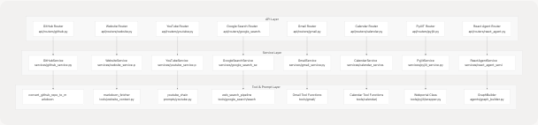
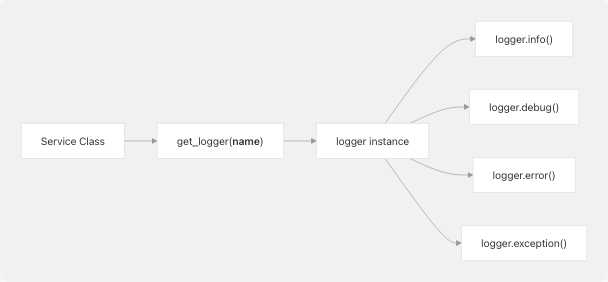
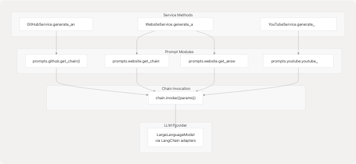

# Service Layer Architecture

## Purpose and Scope

This document explains the Service Layer pattern used throughout the Agentic Browser backend. Services encapsulate business logic, coordinate between API routers and tool modules, and provide consistent error handling and logging. This layer sits between the FastAPI routers (documented in [3.3](3.3-api-routers)) and the reusable tool modules (documented in [3.5](3.5-tool-layer)).

For information about agent-specific service orchestration, see the React Agent Architecture ([4.1](4.1-react-agent-architecture)).

## Service Layer Role

The service layer implements a three-tier architecture pattern:



**Sources:** [services/github\_service.py1-40](https://github.com/tashifkhan/agentic-browser/blob/e94826c4/services/github_service.py#L1-L40) [services/website\_service.py1-53](https://github.com/tashifkhan/agentic-browser/blob/e94826c4/services/website_service.py#L1-L53) [services/youtube\_service.py1-35](https://github.com/tashifkhan/agentic-browser/blob/e94826c4/services/youtube_service.py#L1-L35) [services/google\_search\_service.py1-31](https://github.com/tashifkhan/agentic-browser/blob/e94826c4/services/google_search_service.py#L1-L31) [services/gmail\_service.py1-56](https://github.com/tashifkhan/agentic-browser/blob/e94826c4/services/gmail_service.py#L1-L56) [services/calendar\_service.py1-38](https://github.com/tashifkhan/agentic-browser/blob/e94826c4/services/calendar_service.py#L1-L38) [services/pyjiit\_service.py1-125](https://github.com/tashifkhan/agentic-browser/blob/e94826c4/services/pyjiit_service.py#L1-L125) [services/react\_agent\_service.py1-92](https://github.com/tashifkhan/agentic-browser/blob/e94826c4/services/react_agent_service.py#L1-L92)

### Separation of Concerns

| Layer | Responsibility | Example Code Entity |
| --- | --- | --- |
| **Router** | HTTP request/response handling, input validation, authentication checks | `@router.post("/answer")` |
| **Service** | Business logic orchestration, error handling, logging, data transformation | `GitHubService.generate_answer()` |
| **Tool** | Reusable operations, external API calls, data processing | `convert_github_repo_to_markdown()` |

This separation enables:

* **Testability**: Services can be unit tested independently of FastAPI infrastructure
* **Reusability**: Tools can be shared across services and agent tools
* **Maintainability**: Changes to business logic don't affect HTTP handling
* **Composability**: Services coordinate multiple tools for complex workflows

## Service Class Structure

### Common Service Pattern

All services follow a consistent structure:


**Sources:** [services/github\_service.py10-40](https://github.com/tashifkhan/agentic-browser/blob/e94826c4/services/github_service.py#L10-L40) [services/website\_service.py8-53](https://github.com/tashifkhan/agentic-browser/blob/e94826c4/services/website_service.py#L8-L53) [services/youtube\_service.py7-35](https://github.com/tashifkhan/agentic-browser/blob/e94826c4/services/youtube_service.py#L7-L35) [services/google\_search\_service.py7-31](https://github.com/tashifkhan/agentic-browser/blob/e94826c4/services/google_search_service.py#L7-L31) [services/gmail\_service.py10-56](https://github.com/tashifkhan/agentic-browser/blob/e94826c4/services/gmail_service.py#L10-L56) [services/calendar\_service.py8-38](https://github.com/tashifkhan/agentic-browser/blob/e94826c4/services/calendar_service.py#L8-L38) [services/pyjiit\_service.py13-125](https://github.com/tashifkhan/agentic-browser/blob/e94826c4/services/pyjiit_service.py#L13-L125) [services/react\_agent\_service.py14-92](https://github.com/tashifkhan/agentic-browser/blob/e94826c4/services/react_agent_service.py#L14-L92)

### Service Categories

Services can be categorized by their interaction patterns:

| Category | Services | Tool Integration | LLM Integration |
| --- | --- | --- | --- |
| **LLM-Driven Q&A** | `GitHubService`, `WebsiteService`, `YouTubeService` | Content extraction tools | Prompt chains with `get_chain()` or similar |
| **Direct API Wrapper** | `GmailService`, `CalendarService`, `GoogleSearchService` | Tool functions that wrap external APIs | None (agent tools use LLM separately) |
| **Session Management** | `PyjiitService` | Custom API client with encryption | None |
| **Agent Orchestration** | `ReactAgentService` | Agent tools via `GraphBuilder` | LLM called by LangGraph |

## Error Handling and Logging

### Structured Logging Pattern

All services obtain a logger using the `get_logger(__name__)` pattern from the core module:



**Example: GitHubService logging**

* [services/github\_service.py3](https://github.com/tashifkhan/agentic-browser/blob/e94826c4/services/github_service.py#L3-L3) imports `get_logger`
* [services/github\_service.py7](https://github.com/tashifkhan/agentic-browser/blob/e94826c4/services/github_service.py#L7-L7) creates logger: `logger = get_logger(__name__)`
* [services/github\_service.py38](https://github.com/tashifkhan/agentic-browser/blob/e94826c4/services/github_service.py#L38-L38) logs errors: `logger.error(f"Error generating answer with LLM: {e}")`

**Example: ReactAgentService logging**

* [services/react\_agent\_service.py8](https://github.com/tashifkhan/agentic-browser/blob/e94826c4/services/react_agent_service.py#L8-L8) imports `get_logger`
* [services/react\_agent\_service.py11](https://github.com/tashifkhan/agentic-browser/blob/e94826c4/services/react_agent_service.py#L11-L11) creates logger
* [services/react\_agent\_service.py63-73](https://github.com/tashifkhan/agentic-browser/blob/e94826c4/services/react_agent_service.py#L63-L73) logs detailed message history with structured info
* [services/react\_agent\_service.py82](https://github.com/tashifkhan/agentic-browser/blob/e94826c4/services/react_agent_service.py#L82-L82) logs response content
* [services/react\_agent\_service.py86](https://github.com/tashifkhan/agentic-browser/blob/e94826c4/services/react_agent_service.py#L86-L86) logs exceptions

**Sources:** [services/github\_service.py3-38](https://github.com/tashifkhan/agentic-browser/blob/e94826c4/services/github_service.py#L3-L38) [services/website\_service.py1-51](https://github.com/tashifkhan/agentic-browser/blob/e94826c4/services/website_service.py#L1-L51) [services/youtube\_service.py1-33](https://github.com/tashifkhan/agentic-browser/blob/e94826c4/services/youtube_service.py#L1-L33) [services/google\_search\_service.py1-29](https://github.com/tashifkhan/agentic-browser/blob/e94826c4/services/google_search_service.py#L1-L29) [services/gmail\_service.py1-54](https://github.com/tashifkhan/agentic-browser/blob/e94826c4/services/gmail_service.py#L1-L54) [services/calendar\_service.py1-36](https://github.com/tashifkhan/agentic-browser/blob/e94826c4/services/calendar_service.py#L1-L36) [services/pyjiit\_service.py4-123](https://github.com/tashifkhan/agentic-browser/blob/e94826c4/services/pyjiit_service.py#L4-L123) [services/react\_agent\_service.py8-86](https://github.com/tashifkhan/agentic-browser/blob/e94826c4/services/react_agent_service.py#L8-L86)

### Exception Handling Pattern

Services implement a consistent try/except pattern:


**Q&A Services** (GitHub, Website, YouTube) return graceful error messages:

* [services/github\_service.py37-39](https://github.com/tashifkhan/agentic-browser/blob/e94826c4/services/github_service.py#L37-L39): Returns `"I apologize, but I encountered an error processing your question about the GitHub repository. Please try again."`
* [services/website\_service.py50-52](https://github.com/tashifkhan/agentic-browser/blob/e94826c4/services/website_service.py#L50-L52): Returns `"I apologize, but I encountered an error processing your question. Please try again."`
* [services/youtube\_service.py32-34](https://github.com/tashifkhan/agentic-browser/blob/e94826c4/services/youtube_service.py#L32-L34): Returns `"I apologize, but I encountered an error processing your question about the video. Please try again."`
* [services/react\_agent\_service.py85-91](https://github.com/tashifkhan/agentic-browser/blob/e94826c4/services/react_agent_service.py#L85-L91): Returns `"I apologize, but I encountered an error processing your question. Please try again."`

**API Wrapper Services** (Gmail, Calendar, GoogleSearch, PyJIIT) propagate exceptions to routers:

* [services/gmail\_service.py17-20](https://github.com/tashifkhan/agentic-browser/blob/e94826c4/services/gmail_service.py#L17-L20): `logger.exception()` then `raise`
* [services/calendar\_service.py15-17](https://github.com/tashifkhan/agentic-browser/blob/e94826c4/services/calendar_service.py#L15-L17): `logger.exception()` then `raise`
* [services/google\_search\_service.py28-30](https://github.com/tashifkhan/agentic-browser/blob/e94826c4/services/google_search_service.py#L28-L30): `logger.exception()` then `raise`
* [services/pyjiit\_service.py20-22](https://github.com/tashifkhan/agentic-browser/blob/e94826c4/services/pyjiit_service.py#L20-L22): `logger.exception()` then `raise`

**Sources:** [services/github\_service.py37-39](https://github.com/tashifkhan/agentic-browser/blob/e94826c4/services/github_service.py#L37-L39) [services/website\_service.py50-52](https://github.com/tashifkhan/agentic-browser/blob/e94826c4/services/website_service.py#L50-L52) [services/youtube\_service.py32-34](https://github.com/tashifkhan/agentic-browser/blob/e94826c4/services/youtube_service.py#L32-L34) [services/react\_agent\_service.py85-91](https://github.com/tashifkhan/agentic-browser/blob/e94826c4/services/react_agent_service.py#L85-L91) [services/gmail\_service.py17-20](https://github.com/tashifkhan/agentic-browser/blob/e94826c4/services/gmail_service.py#L17-L20) [services/calendar\_service.py15-17](https://github.com/tashifkhan/agentic-browser/blob/e94826c4/services/calendar_service.py#L15-L17) [services/google\_search\_service.py28-30](https://github.com/tashifkhan/agentic-browser/blob/e94826c4/services/google_search_service.py#L28-L30) [services/pyjiit\_service.py20-22](https://github.com/tashifkhan/agentic-browser/blob/e94826c4/services/pyjiit_service.py#L20-L22)

## Integration with Tool Layer

Services delegate specific operations to tool modules, maintaining a clear dependency hierarchy:


**Sources:** [services/github\_service.py5-19](https://github.com/tashifkhan/agentic-browser/blob/e94826c4/services/github_service.py#L5-L19) [services/website\_service.py3-22](https://github.com/tashifkhan/agentic-browser/blob/e94826c4/services/website_service.py#L3-L22) [services/youtube\_service.py2-17](https://github.com/tashifkhan/agentic-browser/blob/e94826c4/services/youtube_service.py#L2-L17) [services/google\_search\_service.py2-15](https://github.com/tashifkhan/agentic-browser/blob/e94826c4/services/google_search_service.py#L2-L15) [services/gmail\_service.py2-50](https://github.com/tashifkhan/agentic-browser/blob/e94826c4/services/gmail_service.py#L2-L50) [services/calendar\_service.py2-34](https://github.com/tashifkhan/agentic-browser/blob/e94826c4/services/calendar_service.py#L2-L34) [services/pyjiit\_service.py8-60](https://github.com/tashifkhan/agentic-browser/blob/e94826c4/services/pyjiit_service.py#L8-L60)

### Service-to-Tool Call Patterns

| Service | Tool Import | Tool Function Call | Line Reference |
| --- | --- | --- | --- |
| `GitHubService` | `from tools.github_crawler import convert_github_repo_to_markdown` | `await convert_github_repo_to_markdown(url)` | [services/github\_service.py5-19](https://github.com/tashifkhan/agentic-browser/blob/e94826c4/services/github_service.py#L5-L19) |
| `WebsiteService` | `from tools.website_context import markdown_fetcher` | `markdown_fetcher(url)` | [services/website\_service.py3-22](https://github.com/tashifkhan/agentic-browser/blob/e94826c4/services/website_service.py#L3-L22) |
| `YouTubeService` | `from prompts.youtube import youtube_chain` | `youtube_chain.invoke({...})` | [services/youtube\_service.py2-17](https://github.com/tashifkhan/agentic-browser/blob/e94826c4/services/youtube_service.py#L2-L17) |
| `GoogleSearchService` | `from tools.google_search.seach_agent import web_search_pipeline` | `web_search_pipeline(query, max_results=max_results)` | [services/google\_search\_service.py2-15](https://github.com/tashifkhan/agentic-browser/blob/e94826c4/services/google_search_service.py#L2-L15) |
| `GmailService` | `from tools.gmail.list_unread_emails import list_unread` | `list_unread(access_token, max_results=max_results)` | [services/gmail\_service.py3-13](https://github.com/tashifkhan/agentic-browser/blob/e94826c4/services/gmail_service.py#L3-L13) |
| `CalendarService` | `from tools.calendar.get_calender_events import get_calendar_events` | `get_calendar_events(access_token, max_results=max_results)` | [services/calendar\_service.py3-11](https://github.com/tashifkhan/agentic-browser/blob/e94826c4/services/calendar_service.py#L3-L11) |
| `PyjiitService` | `from tools.pyjiit.wrapper import Webportal, WebportalSession` | `Webportal().student_login(...)` | [services/pyjiit\_service.py8-16](https://github.com/tashifkhan/agentic-browser/blob/e94826c4/services/pyjiit_service.py#L8-L16) |

## Integration with Prompt and LLM Layer

Q&A-oriented services integrate with prompt chains to generate responses:



**Sources:** [services/github\_service.py4-30](https://github.com/tashifkhan/agentic-browser/blob/e94826c4/services/github_service.py#L4-L30) [services/website\_service.py2-43](https://github.com/tashifkhan/agentic-browser/blob/e94826c4/services/website_service.py#L2-L43) [services/youtube\_service.py2-23](https://github.com/tashifkhan/agentic-browser/blob/e94826c4/services/youtube_service.py#L2-L23)

### Chain Construction and Initialization

**GitHubService**: Obtains chain on-demand per request

* [services/github\_service.py21](https://github.com/tashifkhan/agentic-browser/blob/e94826c4/services/github_service.py#L21-L21): `chain = get_chain()` called within `generate_answer()`
* [services/github\_service.py22-30](https://github.com/tashifkhan/agentic-browser/blob/e94826c4/services/github_service.py#L22-L30): Invokes chain with `summary`, `tree`, `text`, `question`, `chat_history` parameters

**WebsiteService**: Constructs chain during initialization

* [services/website\_service.py9-10](https://github.com/tashifkhan/agentic-browser/blob/e94826c4/services/website_service.py#L9-L10): `__init__()` creates `self.chain = get_chain()`
* [services/website\_service.py38-43](https://github.com/tashifkhan/agentic-browser/blob/e94826c4/services/website_service.py#L38-L43): Uses `get_answer(self.chain, question, markdown_page_info, chat_history_str)` helper function

**YouTubeService**: Uses pre-built chain module

* [services/youtube\_service.py2](https://github.com/tashifkhan/agentic-browser/blob/e94826c4/services/youtube_service.py#L2-L2): Imports `youtube_chain` directly
* [services/youtube\_service.py17-23](https://github.com/tashifkhan/agentic-browser/blob/e94826c4/services/youtube_service.py#L17-L23): Invokes with `url`, `question`, `chat_history` parameters

### Response Handling Pattern

All LLM-driven services handle responses consistently:

```
# Pattern: Check if response is string or has .content attribute
if isinstance(response, str):
    return response
return response.content
```

* [services/github\_service.py32-35](https://github.com/tashifkhan/agentic-browser/blob/e94826c4/services/github_service.py#L32-L35): Implements this pattern
* [services/website\_service.py45-48](https://github.com/tashifkhan/agentic-browser/blob/e94826c4/services/website_service.py#L45-L48): Implements this pattern
* [services/youtube\_service.py27-30](https://github.com/tashifkhan/agentic-browser/blob/e94826c4/services/youtube_service.py#L27-L30): Implements this pattern

**Sources:** [services/github\_service.py32-35](https://github.com/tashifkhan/agentic-browser/blob/e94826c4/services/github_service.py#L32-L35) [services/website\_service.py45-48](https://github.com/tashifkhan/agentic-browser/blob/e94826c4/services/website_service.py#L45-L48) [services/youtube\_service.py27-30](https://github.com/tashifkhan/agentic-browser/blob/e94826c4/services/youtube_service.py#L27-L30)

## Context Management and Authentication

Services handle authentication context differently based on their requirements:


**Sources:** [services/react\_agent\_service.py18-34](https://github.com/tashifkhan/agentic-browser/blob/e94826c4/services/react_agent_service.py#L18-L34) [services/gmail\_service.py11-47](https://github.com/tashifkhan/agentic-browser/blob/e94826c4/services/gmail_service.py#L11-L47) [services/calendar\_service.py9-27](https://github.com/tashifkhan/agentic-browser/blob/e94826c4/services/calendar_service.py#L9-L27) [services/pyjiit\_service.py14-124](https://github.com/tashifkhan/agentic-browser/blob/e94826c4/services/pyjiit_service.py#L14-L124)

### ReactAgentService Context Building

`ReactAgentService` builds a context dictionary for conditional tool availability:


**Implementation:**

* [services/react\_agent\_service.py23](https://github.com/tashifkhan/agentic-browser/blob/e94826c4/services/react_agent_service.py#L23-L23): Initialize empty context dict
* [services/react\_agent\_service.py25-26](https://github.com/tashifkhan/agentic-browser/blob/e94826c4/services/react_agent_service.py#L25-L26): Add `google_access_token` if provided
* [services/react\_agent\_service.py28-34](https://github.com/tashifkhan/agentic-browser/blob/e94826c4/services/react_agent_service.py#L28-L34): Add `pyjiit_login_response`, handling both Pydantic models and dicts
* [services/react\_agent\_service.py36](https://github.com/tashifkhan/agentic-browser/blob/e94826c4/services/react_agent_service.py#L36-L36): Pass context to `GraphBuilder`

The `GraphBuilder` uses this context to determine which tools to make available in the agent's tool list. For example, Gmail and Calendar tools are only available when `google_access_token` is present.

**Sources:** [services/react\_agent\_service.py23-36](https://github.com/tashifkhan/agentic-browser/blob/e94826c4/services/react_agent_service.py#L23-L36)

### API Wrapper Services Authentication

Services that wrap external APIs accept authentication tokens as method parameters:

**GmailService:**

* [services/gmail\_service.py11](https://github.com/tashifkhan/agentic-browser/blob/e94826c4/services/gmail_service.py#L11-L11): `list_unread_messages(access_token, ...)`
* [services/gmail\_service.py22](https://github.com/tashifkhan/agentic-browser/blob/e94826c4/services/gmail_service.py#L22-L22): `fetch_latest_messages(access_token, ...)`
* [services/gmail\_service.py33](https://github.com/tashifkhan/agentic-browser/blob/e94826c4/services/gmail_service.py#L33-L33): `mark_message_read(access_token, ...)`
* [services/gmail\_service.py44](https://github.com/tashifkhan/agentic-browser/blob/e94826c4/services/gmail_service.py#L44-L44): `send_message(access_token, ...)`

**CalendarService:**

* [services/calendar\_service.py9](https://github.com/tashifkhan/agentic-browser/blob/e94826c4/services/calendar_service.py#L9-L9): `list_events(access_token, ...)`
* [services/calendar\_service.py19](https://github.com/tashifkhan/agentic-browser/blob/e94826c4/services/calendar_service.py#L19-L19): `create_event(access_token, ...)`

**PyjiitService Session Management:**

* [services/pyjiit\_service.py14](https://github.com/tashifkhan/agentic-browser/blob/e94826c4/services/pyjiit_service.py#L14-L14): `login()` returns `session.model_dump()` as dict
* [services/pyjiit\_service.py24-44](https://github.com/tashifkhan/agentic-browser/blob/e94826c4/services/pyjiit_service.py#L24-L44): `get_semesters()` accepts `session_payload` dict and reconstructs `WebportalSession`
* [services/pyjiit\_service.py46-124](https://github.com/tashifkhan/agentic-browser/blob/e94826c4/services/pyjiit_service.py#L46-L124): `get_attendance()` handles nested dict structures with `"session_payload"` and `"raw_response"` keys

**Sources:** [services/gmail\_service.py11-44](https://github.com/tashifkhan/agentic-browser/blob/e94826c4/services/gmail_service.py#L11-L44) [services/calendar\_service.py9-19](https://github.com/tashifkhan/agentic-browser/blob/e94826c4/services/calendar_service.py#L9-L19) [services/pyjiit\_service.py14-60](https://github.com/tashifkhan/agentic-browser/blob/e94826c4/services/pyjiit_service.py#L14-L60)

## Common Service Patterns

### Asynchronous vs Synchronous Methods

Services use async methods when calling async tools:

| Service | Method Type | Reason |
| --- | --- | --- |
| `GitHubService.generate_answer()` | `async` | Calls `await convert_github_repo_to_markdown()` |
| `WebsiteService.generate_answer()` | `async` | Chain invocation may be async |
| `YouTubeService.generate_answer()` | `async` | Chain invocation may be async |
| `ReactAgentService.generate_answer()` | `async` | Calls `await graph.ainvoke()` |
| `GmailService.*` | Synchronous | Wraps synchronous tool functions |
| `CalendarService.*` | Synchronous | Wraps synchronous tool functions |
| `GoogleSearchService.search()` | Synchronous | Wraps synchronous tool functions |
| `PyjiitService.*` | Synchronous | Wraps synchronous tool functions |

**Sources:** [services/github\_service.py11-16](https://github.com/tashifkhan/agentic-browser/blob/e94826c4/services/github_service.py#L11-L16) [services/website\_service.py12-17](https://github.com/tashifkhan/agentic-browser/blob/e94826c4/services/website_service.py#L12-L17) [services/youtube\_service.py8-13](https://github.com/tashifkhan/agentic-browser/blob/e94826c4/services/youtube_service.py#L8-L13) [services/react\_agent\_service.py15-21](https://github.com/tashifkhan/agentic-browser/blob/e94826c4/services/react_agent_service.py#L15-L21) [services/gmail\_service.py11-44](https://github.com/tashifkhan/agentic-browser/blob/e94826c4/services/gmail_service.py#L11-L44) [services/calendar\_service.py9-19](https://github.com/tashifkhan/agentic-browser/blob/e94826c4/services/calendar_service.py#L9-L19) [services/google\_search\_service.py8](https://github.com/tashifkhan/agentic-browser/blob/e94826c4/services/google_search_service.py#L8-L8) [services/pyjiit\_service.py14-46](https://github.com/tashifkhan/agentic-browser/blob/e94826c4/services/pyjiit_service.py#L14-L46)

### Parameter Consistency

Services maintain consistent parameter naming:

**Common Parameters:**

* `url`: String or `HttpUrl` for web resources
* `question`: User query string
* `chat_history`: List of previous messages (format varies by service)
* `access_token`: OAuth token for Google services
* `max_results`: Result count limit (default varies)

**Chat History Formats:**

* `GitHubService`: `list[dict]` with default `[]` ([services/github\_service.py15](https://github.com/tashifkhan/agentic-browser/blob/e94826c4/services/github_service.py#L15-L15))
* `WebsiteService`: `list` of any format ([services/website\_service.py16](https://github.com/tashifkhan/agentic-browser/blob/e94826c4/services/website_service.py#L16-L16))
* `YouTubeService`: `str` with default `""` ([services/youtube\_service.py12](https://github.com/tashifkhan/agentic-browser/blob/e94826c4/services/youtube_service.py#L12-L12))
* `ReactAgentService`: `list[dict[str, Any]] | None` ([services/react\_agent\_service.py18](https://github.com/tashifkhan/agentic-browser/blob/e94826c4/services/react_agent_service.py#L18-L18))

### Data Transformation Patterns

**Chat History Conversion in ReactAgentService:**

[services/react\_agent\_service.py38-56](https://github.com/tashifkhan/agentic-browser/blob/e94826c4/services/react_agent_service.py#L38-L56) converts dict-based chat history to LangChain message objects:

```
messages_list: list = []
if chat_history:
    for entry in chat_history:
        if isinstance(entry, dict):
            role = (entry.get("role") or "").lower()
            content = entry.get("content", "")

            if role == "user":
                messages_list.append(HumanMessage(content=content))
            elif role in {"assistant", "bot", "ai"}:
                messages_list.append(AIMessage(content=content))
```

**Chat History String Building in WebsiteService:**

[services/website\_service.py28-36](https://github.com/tashifkhan/agentic-browser/blob/e94826c4/services/website_service.py#L28-L36) concatenates chat history into a string:

```
chat_history_str = ""
if chat_history:
    for entry in chat_history:
        if isinstance(entry, dict):
            role = entry.get("role", "")
            content = entry.get("content", "")
            chat_history_str += f"{role}: {content}\n"
```

**PyjiitService Data Processing:**

[services/pyjiit\_service.py104-118](https://github.com/tashifkhan/agentic-browser/blob/e94826c4/services/pyjiit_service.py#L104-L118) extracts and cleans attendance data using regex:

```
for item in raw_list:
    subj = item.get("subjectcode", "") or ""
    # Extract code in parentheses
    m = re.search(r"\(([^)]+)\)\s*$", subj)
    code = m.group(1) if m else ""
    # Strip trailing bracketed code
    subject_no_bracket = re.sub(r"\s*\([^)]*\)\s*$", "", subj).strip()
```

**Sources:** [services/react\_agent\_service.py38-56](https://github.com/tashifkhan/agentic-browser/blob/e94826c4/services/react_agent_service.py#L38-L56) [services/website\_service.py28-36](https://github.com/tashifkhan/agentic-browser/blob/e94826c4/services/website_service.py#L28-L36) [services/pyjiit\_service.py104-118](https://github.com/tashifkhan/agentic-browser/blob/e94826c4/services/pyjiit_service.py#L104-L118)

### Return Value Patterns

Services return different data structures based on their purpose:

| Service | Return Type | Example Value |
| --- | --- | --- |
| Q&A Services | `str` | Answer text or error message |
| `GoogleSearchService` | List of search results | `[{...}]` from Tavily |
| `GmailService.list_unread_messages()` | List of email dicts | `[{"id": ..., "subject": ...}]` |
| `CalendarService.list_events()` | List of event dicts | `[{"summary": ..., "start": ...}]` |
| `PyjiitService.login()` | `Dict[str, Any]` | Serialized `WebportalSession` |
| `PyjiitService.get_attendance()` | `List[Dict[str, Any]]` | Attendance records |

## Service Instantiation and Dependency Injection

Services are instantiated by routers, typically as singletons or per-request instances:


Most services are stateless and can be instantiated without parameters:

```
service = GitHubService()
service = YouTubeService()
service = GoogleSearchService()
# etc.
```

**Exception: WebsiteService**

[services/website\_service.py9-10](https://github.com/tashifkhan/agentic-browser/blob/e94826c4/services/website_service.py#L9-L10) initializes a chain during construction:

```
def __init__(self):
    self.chain = get_chain()
```

This allows reusing the same chain instance across multiple requests, improving performance.

**Sources:** All service files show parameter-free constructors except [services/website\_service.py9-10](https://github.com/tashifkhan/agentic-browser/blob/e94826c4/services/website_service.py#L9-L10)
