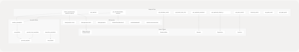
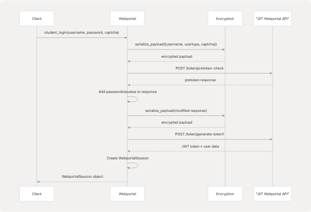

# Tool Layer

Relevant source files

* [tools/calendar/\_\_init\_\_.py](https://github.com/tashifkhan/agentic-browser/blob/e94826c4/tools/calendar/__init__.py)
* [tools/calendar/create\_calender\_events.py](https://github.com/tashifkhan/agentic-browser/blob/e94826c4/tools/calendar/create_calender_events.py)
* [tools/calendar/get\_calender\_events.py](https://github.com/tashifkhan/agentic-browser/blob/e94826c4/tools/calendar/get_calender_events.py)
* [tools/gmail/\_\_init\_\_.py](https://github.com/tashifkhan/agentic-browser/blob/e94826c4/tools/gmail/__init__.py)
* [tools/gmail/fetch\_latest\_mails.py](https://github.com/tashifkhan/agentic-browser/blob/e94826c4/tools/gmail/fetch_latest_mails.py)
* [tools/pyjiit/\_\_init\_\_.py](https://github.com/tashifkhan/agentic-browser/blob/e94826c4/tools/pyjiit/__init__.py)
* [tools/pyjiit/default.py](https://github.com/tashifkhan/agentic-browser/blob/e94826c4/tools/pyjiit/default.py)
* [tools/pyjiit/encryption.py](https://github.com/tashifkhan/agentic-browser/blob/e94826c4/tools/pyjiit/encryption.py)
* [tools/pyjiit/wrapper.py](https://github.com/tashifkhan/agentic-browser/blob/e94826c4/tools/pyjiit/wrapper.py)
* [tools/youtube\_utils/\_\_init\_\_.py](https://github.com/tashifkhan/agentic-browser/blob/e94826c4/tools/youtube_utils/__init__.py)
* [tools/youtube\_utils/extract\_id.py](https://github.com/tashifkhan/agentic-browser/blob/e94826c4/tools/youtube_utils/extract_id.py)
* [tools/youtube\_utils/get\_subs.py](https://github.com/tashifkhan/agentic-browser/blob/e94826c4/tools/youtube_utils/get_subs.py)
* [tools/youtube\_utils/transcript\_generator/\_\_init\_\_.py](https://github.com/tashifkhan/agentic-browser/blob/e94826c4/tools/youtube_utils/transcript_generator/__init__.py)
* [tools/youtube\_utils/transcript\_generator/clean.py](https://github.com/tashifkhan/agentic-browser/blob/e94826c4/tools/youtube_utils/transcript_generator/clean.py)
* [tools/youtube\_utils/transcript\_generator/duplicate.py](https://github.com/tashifkhan/agentic-browser/blob/e94826c4/tools/youtube_utils/transcript_generator/duplicate.py)
* [tools/youtube\_utils/transcript\_generator/srt.py](https://github.com/tashifkhan/agentic-browser/blob/e94826c4/tools/youtube_utils/transcript_generator/srt.py)
* [tools/youtube\_utils/transcript\_generator/timestamp.py](https://github.com/tashifkhan/agentic-browser/blob/e94826c4/tools/youtube_utils/transcript_generator/timestamp.py)

The Tool Layer provides reusable, testable implementations for external API interactions and data processing. These modules sit below the Service Layer and encapsulate low-level operations for Gmail, Calendar, YouTube, GitHub, PyJIIT webportal access, and web content processing. Tools are designed to be stateless and composable, handling authentication, API calls, data transformation, and error handling.

For information about how the Service Layer uses these tools, see [Service Layer Architecture](/tashifkhan/agentic-browser/3.4-service-layer-architecture). For agent-specific tool wrappers used by the React Agent, see [Agent Tool System](/tashifkhan/agentic-browser/4.3-agent-tool-system).

## Tool Layer Architecture


```

**Sources:** [tools/gmail/\_\_init\_\_.py1-12](https://github.com/tashifkhan/agentic-browser/blob/e94826c4/tools/gmail/__init__.py#L1-L12) [tools/calendar/\_\_init\_\_.py1-8](https://github.com/tashifkhan/agentic-browser/blob/e94826c4/tools/calendar/__init__.py#L1-L8) [tools/youtube\_utils/\_\_init\_\_.py1-14](https://github.com/tashifkhan/agentic-browser/blob/e94826c4/tools/youtube_utils/__init__.py#L1-L14) [tools/pyjiit/\_\_init\_\_.py1-2](https://github.com/tashifkhan/agentic-browser/blob/e94826c4/tools/pyjiit/__init__.py#L1-L2)

## Gmail Tools

The Gmail tools provide OAuth-based access to Gmail API operations. All functions accept an `access_token` parameter for authentication.

| Function | Module | Purpose |
| --- | --- | --- |
| `list_unread()` | `tools.gmail.list_unread_emails` | Fetch unread emails with metadata |
| `mark_read()` | `tools.gmail.mark_email_read` | Mark specific message as read |
| `send_email()` | `tools.gmail.send_email` | Send email via Gmail API |
| `get_latest_emails()` | `tools.gmail.fetch_latest_mails` | Fetch most recent inbox messages |

### Gmail API Integration

The `get_latest_emails()` function demonstrates the typical pattern:

[tools/gmail/fetch\_latest\_mails.py4-42](https://github.com/tashifkhan/agentic-browser/blob/e94826c4/tools/gmail/fetch_latest_mails.py#L4-L42)

**Key characteristics:**

* Uses Gmail REST API v1 endpoints (`/users/me/messages`)
* Requires Bearer token authentication via `Authorization` header
* Fetches message list, then retrieves full details per message
* Extracts headers (Subject, From, Date) and snippet from payload
* Returns structured list of email dictionaries

**Sources:** [tools/gmail/\_\_init\_\_.py1-12](https://github.com/tashifkhan/agentic-browser/blob/e94826c4/tools/gmail/__init__.py#L1-L12) [tools/gmail/fetch\_latest\_mails.py1-61](https://github.com/tashifkhan/agentic-browser/blob/e94826c4/tools/gmail/fetch_latest_mails.py#L1-L61)

## Calendar Tools

The Calendar tools provide Google Calendar API access for event management.

### Event Retrieval

[tools/calendar/get\_calender\_events.py6-23](https://github.com/tashifkhan/agentic-browser/blob/e94826c4/tools/calendar/get_calender_events.py#L6-L23)

**Features:**

* Fetches upcoming events via `/calendars/primary/events` endpoint
* Uses `timeMin` parameter with current UTC timestamp to filter future events
* Orders results by `startTime` with `singleEvents=True` for recurring event expansion
* Returns list of event items from API response

### Event Creation

[tools/calendar/create\_calender\_events.py6-40](https://github.com/tashifkhan/agentic-browser/blob/e94826c4/tools/calendar/create_calender_events.py#L6-L40)

**Implementation details:**

* Requires `summary`, `start_time`, `end_time` in ISO 8601 format
* Supports optional `description` field
* Uses UTC timezone for all timestamps
* Returns created event JSON including `htmlLink` for calendar view

**Sources:** [tools/calendar/get\_calender\_events.py1-52](https://github.com/tashifkhan/agentic-browser/blob/e94826c4/tools/calendar/get_calender_events.py#L1-L52) [tools/calendar/create\_calender\_events.py1-70](https://github.com/tashifkhan/agentic-browser/blob/e94826c4/tools/calendar/create_calender_events.py#L1-L70) [tools/calendar/\_\_init\_\_.py1-8](https://github.com/tashifkhan/agentic-browser/blob/e94826c4/tools/calendar/__init__.py#L1-L8)

## YouTube Tools

The YouTube tools provide video metadata extraction, subtitle retrieval, and audio transcription fallback.

```

```

### Video ID Extraction

[tools/youtube\_utils/extract\_id.py8-23](https://github.com/tashifkhan/agentic-browser/blob/e94826c4/tools/youtube_utils/extract_id.py#L8-L23)

**Supported formats:**

* Standard YouTube URLs: `youtube.com/watch?v=VIDEO_ID`
* Short URLs: `youtu.be/VIDEO_ID`
* Handles both `www.youtube.com` and `youtube.com` hostnames

### Subtitle and Transcription Pipeline

[tools/youtube\_utils/get\_subs.py8-89](https://github.com/tashifkhan/agentic-browser/blob/e94826c4/tools/youtube_utils/get_subs.py#L8-L89)

**Process flow:**

1. **Primary path**: Uses `yt-dlp` to download subtitles (auto-generated or manual)

   * Configures `writesubtitles=True`, `writeautomaticsub=True`
   * Requests VTT/SRT formats with language preference
   * Skips video download with `skip_download=True`
2. **Fallback path**: If subtitles unavailable, transcribes audio

   * Downloads audio using `yt-dlp` with `FFmpegExtractAudio` postprocessor
   * Converts to MP3 format for compatibility
   * Uses `faster-whisper` with `tiny` model on CPU with INT8 quantization
   * Returns full transcript text

### Transcript Cleaning Pipeline

[tools/youtube\_utils/transcript\_generator/\_\_init\_\_.py11-16](https://github.com/tashifkhan/agentic-browser/blob/e94826c4/tools/youtube_utils/transcript_generator/__init__.py#L11-L16)

**Multi-stage processing:**

1. **`clean_transcript()`** [tools/youtube\_utils/transcript\_generator/clean.py22-66](https://github.com/tashifkhan/agentic-browser/blob/e94826c4/tools/youtube_utils/transcript_generator/clean.py#L22-L66)

   * Removes VTT/SRT timestamp lines matching `\d{2}:\d{2}:\d{2}[.,]\d{3} --> \d{2}:\d{2}:\d{2}[.,]\d{3}`
   * Strips VTT headers (`WEBVTT`, `Kind:`, `Language:`)
   * Removes inline timestamps `<\d{2}:\d{2}:\d{2}[.,]\d{3}>`
   * Removes cue tags `</?c.*?>` and speaker tags `<v ...></v>`
   * Deduplicates consecutive identical lines
   * Merges lines into paragraphs separated by blank lines
2. **`clean_srt_text()`** [tools/youtube\_utils/transcript\_generator/srt.py4-29](https://github.com/tashifkhan/agentic-browser/blob/e94826c4/tools/youtube_utils/transcript_generator/srt.py#L4-L29)

   * Removes full timestamp lines with literal `\\n\\n` sequences
   * Strips align directives like `align:start position:0%`
   * Converts literal backslash-n (`\\n`) to real newlines
3. **`clean_timestamps_and_dedupe()`** [tools/youtube\_utils/transcript\_generator/timestamp.py10-31](https://github.com/tashifkhan/agentic-browser/blob/e94826c4/tools/youtube_utils/transcript_generator/timestamp.py#L10-L31)

   * Removes timestamp arrow patterns
   * Removes inline cue timestamps
   * Deduplicates lines using set tracking
4. **`remove_sentence_repeats()`** [tools/youtube\_utils/transcript\_generator/duplicate.py4-25](https://github.com/tashifkhan/agentic-browser/blob/e94826c4/tools/youtube_utils/transcript_generator/duplicate.py#L4-L25)

   * Collapses consecutive repeated sentences
   * Handles partial matches where line N is prefix of line N+1

**Sources:** [tools/youtube\_utils/get\_subs.py1-178](https://github.com/tashifkhan/agentic-browser/blob/e94826c4/tools/youtube_utils/get_subs.py#L1-L178) [tools/youtube\_utils/extract\_id.py1-24](https://github.com/tashifkhan/agentic-browser/blob/e94826c4/tools/youtube_utils/extract_id.py#L1-L24) [tools/youtube\_utils/transcript\_generator/\_\_init\_\_.py1-22](https://github.com/tashifkhan/agentic-browser/blob/e94826c4/tools/youtube_utils/transcript_generator/__init__.py#L1-L22) [tools/youtube\_utils/transcript\_generator/clean.py1-67](https://github.com/tashifkhan/agentic-browser/blob/e94826c4/tools/youtube_utils/transcript_generator/clean.py#L1-L67) [tools/youtube\_utils/transcript\_generator/srt.py1-30](https://github.com/tashifkhan/agentic-browser/blob/e94826c4/tools/youtube_utils/transcript_generator/srt.py#L1-L30) [tools/youtube\_utils/transcript\_generator/timestamp.py1-32](https://github.com/tashifkhan/agentic-browser/blob/e94826c4/tools/youtube_utils/transcript_generator/timestamp.py#L1-L32) [tools/youtube\_utils/transcript\_generator/duplicate.py1-26](https://github.com/tashifkhan/agentic-browser/blob/e94826c4/tools/youtube_utils/transcript_generator/duplicate.py#L1-L26)

## PyJIIT Webportal Tools

The PyJIIT tools provide a comprehensive client for the JIIT Webportal API, including authentication, encryption, and academic data retrieval.

### Architecture Components

```

```

### Webportal Class

[tools/pyjiit/wrapper.py119-127](https://github.com/tashifkhan/agentic-browser/blob/e94826c4/tools/pyjiit/wrapper.py#L119-L127)

The `Webportal` class is the main entry point for all webportal operations. It maintains a `WebportalSession` instance for authentication state.

**Authentication decorator:**

[tools/pyjiit/wrapper.py27-46](https://github.com/tashifkhan/agentic-browser/blob/e94826c4/tools/pyjiit/wrapper.py#L27-L46)

The `@authenticated` decorator ensures methods are called with valid session, checking for `NotLoggedIn` exception.

### Session Management

[tools/pyjiit/wrapper.py49-117](https://github.com/tashifkhan/agentic-browser/blob/e94826c4/tools/pyjiit/wrapper.py#L49-L117)

**`WebportalSession` (Pydantic model):**

* Stores authentication tokens and user metadata
* Parses response JSON to extract: `token`, `memberid`, `userid`, `instituteid`, `clientid`
* Decodes JWT token to extract expiry timestamp (with fallback on error)
* Provides `get_headers()` method returning `Authorization: Bearer {token}` and `LocalName` header

### Encryption System

The webportal requires AES encryption for all payloads and a dynamic `LocalName` header.

[tools/pyjiit/encryption.py10-23](https://github.com/tashifkhan/agentic-browser/blob/e94826c4/tools/pyjiit/encryption.py#L10-L23)

**Key generation:**

* Format: `qa8y{DATE_SEQ}ty1pn` where `DATE_SEQ` is date-derived
* Uses AES CBC mode with fixed IV: `dcek9wb8frty1pnm`
* Key rotates daily at 0000 hrs IST

**LocalName header:**

* Format: Base64-encoded encrypted value of `{RANDOM_4}{DATE_SEQ}{RANDOM_5}`
* Required for every HTTP request
* Generated per-request to prevent replay attacks

[tools/pyjiit/encryption.py48-53](https://github.com/tashifkhan/agentic-browser/blob/e94826c4/tools/pyjiit/encryption.py#L48-L53)

**Payload serialization:**

* Converts Python dict → JSON string → encrypted bytes → Base64 string
* Used for login credentials and sensitive query parameters

### Authentication Flow

```

```

### Key API Methods

| Method | Purpose | Returns |
| --- | --- | --- |
| `get_attendance_meta()` | Fetch attendance metadata | `AttendanceMeta` with semesters and headers |
| `get_attendance(header, semester)` | Get detailed attendance for semester | Dict with subject-wise attendance |
| `get_registered_semesters()` | List all registered semesters | List of `Semester` objects |
| `get_registered_subjects_and_faculties(semester)` | Get subjects and faculty for semester | `Registrations` object |
| `get_exam_events(semester)` | Get exam events for semester | List of `ExamEvent` objects |
| `get_exam_schedule(exam_event)` | Get exam timetable | Dict with exam schedule |
| `download_marks(semester)` | Download marks PDF | Raw PDF bytes |
| `get_grade_card(semester)` | Get grade card | Dict with grades |
| `get_sgpa_cgpa(stynumber)` | Get SGPA/CGPA | Dict with GPA data |

**All authenticated methods:**

* Use `@authenticated` decorator to validate session
* Add `Authorization: Bearer {token}` and `LocalName` headers automatically
* Raise `SessionExpired` on 401 status
* Raise `APIError` on non-Success response status

[tools/pyjiit/wrapper.py256-282](https://github.com/tashifkhan/agentic-browser/blob/e94826c4/tools/pyjiit/wrapper.py#L256-L282)

**Example: get\_attendance()** demonstrates typical pattern:

1. Build payload with session identifiers and query parameters
2. Serialize payload using encryption module
3. Make POST request with authenticated headers
4. Return parsed response

**Sources:** [tools/pyjiit/wrapper.py1-646](https://github.com/tashifkhan/agentic-browser/blob/e94826c4/tools/pyjiit/wrapper.py#L1-L646) [tools/pyjiit/encryption.py1-60](https://github.com/tashifkhan/agentic-browser/blob/e94826c4/tools/pyjiit/encryption.py#L1-L60) [tools/pyjiit/default.py1-9](https://github.com/tashifkhan/agentic-browser/blob/e94826c4/tools/pyjiit/default.py#L1-L9) [tools/pyjiit/\_\_init\_\_.py1-2](https://github.com/tashifkhan/agentic-browser/blob/e94826c4/tools/pyjiit/__init__.py#L1-L2)

## Tool Integration Patterns

### Context-Based Authentication

Tools requiring authentication accept credential parameters directly:

```
```
# Gmail/Calendar: OAuth token
get_calendar_events(access_token="...")
send_email(access_token="...", ...)

# PyJIIT: Session object
webportal = Webportal(session=pyjiit_session)
webportal.get_attendance(...)
```

Services inject credentials from request context or persistent storage.

### Error Handling

Tools raise domain-specific exceptions for API errors:

| Module | Exception Types |
| --- | --- |
| PyJIIT | `NotLoggedIn`, `SessionExpired`, `LoginError`, `APIError`, `AccountAPIError` |
| YouTube | `yt_dlp.utils.DownloadError`, generic `Exception` with error messages |
| Gmail/Calendar | Generic `Exception` with HTTP status and response text |

Services catch and transform these into HTTP error responses.

### Stateless Design

Tools maintain no internal state beyond constructor parameters:

* **Gmail/Calendar**: Pure functions accepting tokens per-call
* **YouTube**: Pure functions accepting URLs per-call
* **PyJIIT**: `Webportal` class stores `WebportalSession` but no mutable state
  + Session is immutable after construction
  + Each method call is independent

This enables:

* Easy testing with mock credentials
* Concurrent usage across multiple requests
* Clean separation from service layer business logic

**Sources:** [tools/gmail/fetch\_latest\_mails.py4-42](https://github.com/tashifkhan/agentic-browser/blob/e94826c4/tools/gmail/fetch_latest_mails.py#L4-L42) [tools/calendar/get\_calender\_events.py6-23](https://github.com/tashifkhan/agentic-browser/blob/e94826c4/tools/calendar/get_calender_events.py#L6-L23) [tools/youtube\_utils/get\_subs.py8-89](https://github.com/tashifkhan/agentic-browser/blob/e94826c4/tools/youtube_utils/get_subs.py#L8-L89) [tools/pyjiit/wrapper.py119-127](https://github.com/tashifkhan/agentic-browser/blob/e94826c4/tools/pyjiit/wrapper.py#L119-L127)