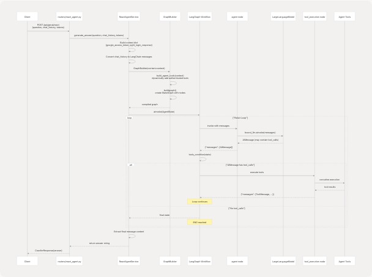

# Agent Intelligence System

> Source: https://deepwiki.com/tashifkhan/agentic-browser/4-agent-intelligence-system

# Agent Intelligence System

Relevant source files

* [agents/\_\_init\_\_.py](https://github.com/tashifkhan/agentic-browser/blob/e94826c4/agents/__init__.py)
* [agents/react\_agent.py](https://github.com/tashifkhan/agentic-browser/blob/e94826c4/agents/react_agent.py)
* [agents/react\_tools.py](https://github.com/tashifkhan/agentic-browser/blob/e94826c4/agents/react_tools.py)
* [models/requests/\_\_init\_\_.py](https://github.com/tashifkhan/agentic-browser/blob/e94826c4/models/requests/__init__.py)
* [models/response/\_\_init\_\_.py](https://github.com/tashifkhan/agentic-browser/blob/e94826c4/models/response/__init__.py)
* [models/response/react\_agent.py](https://github.com/tashifkhan/agentic-browser/blob/e94826c4/models/response/react_agent.py)
* [routers/react\_agent.py](https://github.com/tashifkhan/agentic-browser/blob/e94826c4/routers/react_agent.py)
* [services/google\_search\_service.py](https://github.com/tashifkhan/agentic-browser/blob/e94826c4/services/google_search_service.py)
* [services/pyjiit\_service.py](https://github.com/tashifkhan/agentic-browser/blob/e94826c4/services/pyjiit_service.py)
* [services/react\_agent\_service.py](https://github.com/tashifkhan/agentic-browser/blob/e94826c4/services/react_agent_service.py)
* [services/website\_service.py](https://github.com/tashifkhan/agentic-browser/blob/e94826c4/services/website_service.py)
* [services/youtube\_service.py](https://github.com/tashifkhan/agentic-browser/blob/e94826c4/services/youtube_service.py)

The Agent Intelligence System is the core AI orchestration layer of the Agentic Browser. It provides two primary agent workflows: the **React Agent** for conversational AI with dynamic tool selection, and the **Browser Use Agent** for generating structured browser automation scripts. This document focuses on the React Agent architecture, tool system, and LLM integration. For Browser Use Agent implementation details, see [Browser Use Agent and Script Generation](/tashifkhan/agentic-browser/4.2-browser-use-agent-and-script-generation). For individual tool implementations, see [Agent Tool System](/tashifkhan/agentic-browser/4.3-agent-tool-system).

---

## System Architecture Overview

The Agent Intelligence System is built around LangGraph's state machine framework, which enables the ReAct (Reason + Act) pattern where the LLM iteratively decides whether to call tools or provide a final answer.


```

**Sources:** [agents/react\_agent.py](https://github.com/tashifkhan/agentic-browser/blob/e94826c4/agents/react_agent.py) [agents/react\_tools.py](https://github.com/tashifkhan/agentic-browser/blob/e94826c4/agents/react_tools.py) [services/react\_agent\_service.py](https://github.com/tashifkhan/agentic-browser/blob/e94826c4/services/react_agent_service.py) [routers/react\_agent.py](https://github.com/tashifkhan/agentic-browser/blob/e94826c4/routers/react_agent.py)

---

## React Agent Workflow

### LangGraph State Machine

The React Agent uses a cyclic graph with two nodes: `agent` (LLM reasoning) and `tool_execution` (tool invocation). The `tools_condition` function determines whether the LLM's response contains tool calls.

```

```

**Implementation Details:**

The `GraphBuilder` class constructs the workflow in [agents/react\_agent.py138-176](https://github.com/tashifkhan/agentic-browser/blob/e94826c4/agents/react_agent.py#L138-L176):

```
```
class GraphBuilder:
    def buildgraph(self):
        agent_node = _create_agent_node(self.tools)

        workflow = StateGraph(AgentState)
        workflow.add_node("agent", agent_node)
        workflow.add_node("tool_execution", ToolNode(self.tools))
        workflow.add_edge(START, "agent")
        workflow.add_conditional_edges(
            "agent",
            tools_condition,
            {
                "tools": "tool_execution",
                END: END,
            },
        )
        workflow.add_edge("tool_execution", "agent")
        return workflow.compile()
```
```

The `agent` node is created by `_create_agent_node()` [agents/react\_agent.py123-136](https://github.com/tashifkhan/agentic-browser/blob/e94826c4/agents/react_agent.py#L123-L136) which binds the tool schemas to the LLM:

```
```
def _create_agent_node(tools: Sequence[StructuredTool]):
    bound_llm = _llm.bind_tools(list(tools))

    async def _agent_node(state: AgentState, **_):
        messages = list(state["messages"])
        if not messages or not isinstance(messages[0], SystemMessage):
            messages = [_system_message] + messages
        response = await bound_llm.ainvoke(messages)
        return {"messages": [response]}

    return _agent_node
```
```

**Sources:** [agents/react\_agent.py123-176](https://github.com/tashifkhan/agentic-browser/blob/e94826c4/agents/react_agent.py#L123-L176)

---

## Agent State and Message Management

### AgentState TypedDict

The workflow state is defined as a TypedDict with a single field: `messages`, which is a sequence of LangChain `BaseMessage` objects. The `add_messages` reducer automatically appends new messages.

[agents/react\_agent.py40-41](https://github.com/tashifkhan/agentic-browser/blob/e94826c4/agents/react_agent.py#L40-L41):

```
```
class AgentState(TypedDict):
    messages: Annotated[Sequence[BaseMessage], add_messages]
```
```

### Message Conversion System

The system converts between API-friendly message dictionaries and LangChain message objects:

**API Message Format (`AgentMessagePayload`):**

| Field | Type | Description |
| --- | --- | --- |
| `role` | `"system"`, `"user"`, `"assistant"`, `"tool"` | Message role |
| `content` | `str` | Message content |
| `name` | `str` (optional) | Speaker/tool name |
| `tool_call_id` | `str` (optional) | For tool messages |
| `tool_calls` | `list[dict]` (optional) | For assistant messages with tool invocations |

**Conversion Functions:**

* `_payload_to_langchain()` [agents/react\_agent.py61-77](https://github.com/tashifkhan/agentic-browser/blob/e94826c4/agents/react_agent.py#L61-L77): Converts API payloads to LangChain messages (`HumanMessage`, `AIMessage`, `ToolMessage`, `SystemMessage`)
* `_langchain_to_payload()` [agents/react\_agent.py80-120](https://github.com/tashifkhan/agentic-browser/blob/e94826c4/agents/react_agent.py#L80-L120): Converts LangChain messages back to API payloads
* `_normalise_content()` [agents/react\_agent.py52-58](https://github.com/tashifkhan/agentic-browser/blob/e94826c4/agents/react_agent.py#L52-L58): Ensures message content is always a string (JSON-encodes complex objects)

**Sources:** [agents/react\_agent.py40-120](https://github.com/tashifkhan/agentic-browser/blob/e94826c4/agents/react_agent.py#L40-L120)

---

## Agent Tools System

### Core Tool Definitions

All agent tools are defined as `StructuredTool` instances in [agents/react\_tools.py](https://github.com/tashifkhan/agentic-browser/blob/e94826c4/agents/react_tools.py) Each tool has:

* A unique name (e.g., `github_agent`)
* A description for the LLM to understand when to use it
* An async coroutine implementation
* A Pydantic `args_schema` for input validation

**Complete Tool Registry:**

| Tool Name | Purpose | Input Schema | Requires Auth |
| --- | --- | --- | --- |
| `github_agent` | Answer questions about GitHub repositories | `GitHubToolInput` | No |
| `websearch_agent` | Search the web and summarize top results | `WebSearchToolInput` | No |
| `website_agent` | Fetch and analyze web pages | `WebsiteToolInput` | No |
| `youtube_agent` | Answer questions about YouTube videos | `YouTubeToolInput` | No |
| `gmail_agent` | Fetch recent Gmail messages | `GmailToolInput` | Yes (Google token) |
| `gmail_send_email` | Send emails via Gmail | `GmailSendEmailInput` | Yes (Google token) |
| `gmail_list_unread` | List unread Gmail messages | `GmailListUnreadInput` | Yes (Google token) |
| `gmail_mark_read` | Mark Gmail messages as read | `GmailMarkReadInput` | Yes (Google token) |
| `calendar_agent` | Retrieve Google Calendar events | `CalendarToolInput` | Yes (Google token) |
| `calendar_create_event` | Create new calendar events | `CalendarCreateEventInput` | Yes (Google token) |
| `pyjiit_agent` | Fetch attendance from JIIT webportal | `PyjiitAttendanceInput` | Yes (PyJIIT session) |
| `browser_action_agent` | Execute browser automation actions | (defined in `tools/browser_use`) | No |

### Tool Input Schemas

Each tool uses Pydantic models for type-safe input validation. Example schemas:

**GitHubToolInput** [agents/react\_tools.py61-67](https://github.com/tashifkhan/agentic-browser/blob/e94826c4/agents/react_tools.py#L61-L67):

```
```
class GitHubToolInput(BaseModel):
    url: HttpUrl = Field(..., description="Full URL to a public GitHub repository.")
    question: str = Field(..., description="Question about the repository.")
    chat_history: Optional[list[dict[str, Any]]] = Field(
        default=None,
        description="Optional chat history as a list of {role, content} maps.",
    )
```
```

**GmailSendEmailInput** [agents/react\_tools.py114-124](https://github.com/tashifkhan/agentic-browser/blob/e94826c4/agents/react_tools.py#L114-L124):

```
```
class GmailSendEmailInput(BaseModel):
    to: EmailStr = Field(..., description="Recipient email address.")
    subject: str = Field(..., min_length=1, description="Email subject line.")
    body: str = Field(..., min_length=1, description="Plain-text body content.")
    access_token: Optional[str] = Field(
        default=None,
        description="OAuth access token with Gmail send scope. "
                   "If omitted, a pre-configured token will be used when available.",
    )
```
```

**Sources:** [agents/react\_tools.py61-210](https://github.com/tashifkhan/agentic-browser/blob/e94826c4/agents/react_tools.py#L61-L210)

---

## Dynamic Tool Construction

### Context-Based Tool Assembly

The `build_agent_tools()` function dynamically constructs the tool list based on the authentication context provided by the user. This allows the agent to access Gmail, Calendar, and PyJIIT tools only when credentials are available.

```

```

**Implementation** [agents/react\_tools.py609-699](https://github.com/tashifkhan/agentic-browser/blob/e94826c4/agents/react_tools.py#L609-L699):

```
```
def build_agent_tools(context: Optional[Dict[str, Any]] = None) -> list[StructuredTool]:
    ctx: Dict[str, Any] = dict(context or {})
    google_token = ctx.get("google_access_token") or ctx.get("google_acces_token")
    pyjiit_payload = ctx.get("pyjiit_login_response") or ctx.get("pyjiit_login_responce")

    tools: list[StructuredTool] = [
        github_agent,
        websearch_agent,
        website_agent,
        youtube_agent,
        browser_action_agent,
    ]

    if google_token:
        tools.append(
            StructuredTool(
                name=gmail_agent.name,
                description=gmail_agent.description,
                coroutine=partial(_gmail_tool, _default_token=google_token),
                args_schema=GmailToolInput,
            )
        )
        # ... similar pattern for other Google tools

    if pyjiit_payload:
        tools.append(
            StructuredTool(
                name=pyjiit_agent.name,
                description=pyjiit_agent.description,
                coroutine=partial(_pyjiit_attendance_tool, _default_payload=pyjiit_payload),
                args_schema=PyjiitAttendanceInput,
            )
        )

    return tools
```
```

### functools.partial Pattern

The system uses `functools.partial` to "bake in" authentication credentials as default arguments to tool coroutines. This allows the LLM to call authenticated tools without needing to pass tokens explicitly in every invocation.

For example, `_gmail_tool` [agents/react\_tools.py279-300](https://github.com/tashifkhan/agentic-browser/blob/e94826c4/agents/react_tools.py#L279-L300) accepts an `_default_token` keyword argument:

```
```
async def _gmail_tool(
    access_token: Optional[str] = None,
    max_results: int = 5,
    *,
    _default_token: Optional[str] = None,
) -> str:
    token = access_token or _default_token
    if not token:
        return "Unable to fetch Gmail messages because no Google access token was provided."
    # ... rest of implementation
```
```

When `build_agent_tools()` creates the Gmail tool for a user with a token, it uses `partial(_gmail_tool, _default_token=google_token)` [agents/react\_tools.py629](https://github.com/tashifkhan/agentic-browser/blob/e94826c4/agents/react_tools.py#L629-L629) so the LLM doesn't need to provide the token.

**Sources:** [agents/react\_tools.py609-699](https://github.com/tashifkhan/agentic-browser/blob/e94826c4/agents/react_tools.py#L609-L699) [agents/react\_tools.py279-300](https://github.com/tashifkhan/agentic-browser/blob/e94826c4/agents/react_tools.py#L279-L300)

---

## Tool Implementations

### GitHub Tool

**Tool Name:** `github_agent`

**Implementation:** [agents/react\_tools.py217-230](https://github.com/tashifkhan/agentic-browser/blob/e94826c4/agents/react_tools.py#L217-L230)

The GitHub tool converts a repository URL to markdown using `convert_github_repo_to_markdown()` from [tools/github\_crawler/convertor.py](https://github.com/tashifkhan/agentic-browser/blob/e94826c4/tools/github_crawler/convertor.py) then invokes an LLM chain with the repository content, tree structure, and summary.

```
```
async def _github_tool(url: HttpUrl, question: str, chat_history: Optional[list[dict]] = None) -> str:
    repo_data = await convert_github_repo_to_markdown(url)
    history = _format_chat_history(chat_history)
    payload = {
        "question": question,
        "text": repo_data.content,
        "tree": repo_data.tree,
        "summary": repo_data.summary,
        "chat_history": history,
    }
    response = await asyncio.to_thread(github_chain.invoke, payload)
    return _ensure_text(response)
```
```

### Web Search Tool

**Tool Name:** `websearch_agent`

**Implementation:** [agents/react\_tools.py233-247](https://github.com/tashifkhan/agentic-browser/blob/e94826c4/agents/react_tools.py#L233-L247)

Uses the Tavily search API via `web_search_pipeline()` from [tools/google\_search/seach\_agent.py](https://github.com/tashifkhan/agentic-browser/blob/e94826c4/tools/google_search/seach_agent.py) to fetch and summarize web results:

```
```
async def _websearch_tool(query: str, max_results: int = 5) -> str:
    bounded = max(1, min(10, max_results))
    results = await asyncio.to_thread(web_search_pipeline, query, None, bounded)
    if not results:
        return "No web results were found."

    snippets: list[str] = []
    for item in results[:bounded]:
        url = item.get("url", "")
        text = (item.get("md_body_content") or "").strip().replace("\n", " ")
        if len(text) > 320:
            text = text[:320].rstrip() + "..."
        snippets.append(f"URL: {url}\nSummary: {text}")

    return "\n\n".join(snippets)
```
```

### Website Tool

**Tool Name:** `website_agent`

**Implementation:** [agents/react\_tools.py250-262](https://github.com/tashifkhan/agentic-browser/blob/e94826c4/agents/react_tools.py#L250-L262)

Fetches a web page, converts it to markdown using `markdown_fetcher()`, and answers questions about it:

```
```
async def _website_tool(url: HttpUrl, question: str, chat_history: Optional[list[dict]] = None) -> str:
    markdown = await asyncio.to_thread(markdown_fetcher, str(url))
    history = _format_chat_history(chat_history)
    response = await asyncio.to_thread(
        get_website_answer,
        website_chain,
        question,
        markdown,
        history,
    )
    return _ensure_text(response)
```
```

### YouTube Tool

**Tool Name:** `youtube_agent`

**Implementation:** [agents/react\_tools.py265-276](https://github.com/tashifkhan/agentic-browser/blob/e94826c4/agents/react_tools.py#L265-L276)

Extracts video transcripts and answers questions using the `youtube_chain`:

```
```
async def _youtube_tool(url: HttpUrl, question: str, chat_history: Optional[list[dict]] = None) -> str:
    history = _format_chat_history(chat_history)
    response = await asyncio.to_thread(
        get_youtube_answer,
        youtube_chain,
        question,
        str(url),
        history,
    )
    return _ensure_text(response)
```
```

### Gmail Tools

**Tool Names:** `gmail_agent`, `gmail_send_email`, `gmail_list_unread`, `gmail_mark_read`

**Implementations:** [agents/react\_tools.py279-375](https://github.com/tashifkhan/agentic-browser/blob/e94826c4/agents/react_tools.py#L279-L375)

All Gmail tools follow the same pattern:

1. Accept an optional `access_token` parameter
2. Fall back to `_default_token` (injected via `functools.partial`)
3. Return an error message if no token is available
4. Call the appropriate Gmail function from [tools/gmail/](https://github.com/tashifkhan/agentic-browser/blob/e94826c4/tools/gmail/)

Example: `_gmail_tool` [agents/react\_tools.py279-300](https://github.com/tashifkhan/agentic-browser/blob/e94826c4/agents/react_tools.py#L279-L300):

```
```
async def _gmail_tool(
    access_token: Optional[str] = None,
    max_results: int = 5,
    *,
    _default_token: Optional[str] = None,
) -> str:
    token = access_token or _default_token
    if not token:
        return "Unable to fetch Gmail messages because no Google access token was provided."

    bounded = max(1, min(25, max_results))

    try:
        messages = await asyncio.to_thread(get_latest_emails, token, max_results=bounded)
        return _ensure_text({"messages": messages})
    except Exception as exc:
        return f"Failed to fetch Gmail messages: {exc}"
```
```

### Calendar Tools

**Tool Names:** `calendar_agent`, `calendar_create_event`

**Implementations:** [agents/react\_tools.py378-435](https://github.com/tashifkhan/agentic-browser/blob/e94826c4/agents/react_tools.py#L378-L435)

Calendar tools use the Google Calendar API via [tools/calendar/](https://github.com/tashifkhan/agentic-browser/blob/e94826c4/tools/calendar/) functions. They follow the same authentication pattern as Gmail tools.

### PyJIIT Tool

**Tool Name:** `pyjiit_agent`

**Implementation:** [agents/react\_tools.py438-521](https://github.com/tashifkhan/agentic-browser/blob/e94826c4/agents/react_tools.py#L438-L521)

The PyJIIT tool fetches attendance data from the JIIT webportal. It:

1. Accepts an optional `session_payload` parameter or uses `_default_payload`
2. Constructs a `WebportalSession` from the payload
3. Fetches attendance metadata and hardcoded semester mappings
4. Returns processed attendance data with subject codes and percentages

```
```
async def _pyjiit_attendance_tool(
    registration_code: Optional[str] = None,
    session_payload: Optional[Dict[str, Any]] = None,
    *,
    _default_payload: Optional[Dict[str, Any]] = None,
) -> str:
    payload = session_payload or _default_payload
    if not payload:
        return "Unable to fetch attendance because no PyJIIT login session was provided."

    # ... session construction and attendance fetching logic
```
```

**Sources:** [agents/react\_tools.py217-521](https://github.com/tashifkhan/agentic-browser/blob/e94826c4/agents/react_tools.py#L217-L521)

---

## LLM Integration

The agent system uses the `LargeLanguageModel` abstraction from [core/llm.py](https://github.com/tashifkhan/agentic-browser/blob/e94826c4/core/llm.py) to support multiple LLM providers. The LLM client is instantiated once and reused across all agent invocations.

**Initialization** [agents/react\_agent.py36](https://github.com/tashifkhan/agentic-browser/blob/e94826c4/agents/react_agent.py#L36-L36):

```
```
_llm = LargeLanguageModel().client
```
```

**System Prompt** [agents/react\_agent.py25-34](https://github.com/tashifkhan/agentic-browser/blob/e94826c4/agents/react_agent.py#L25-L34):

```
```
DEFAULT_SYSTEM_PROMPT = (
    "You are a helpful AI assistant that maintains conversation context and "
    "remembers useful information shared by users. Use the available tools "
    "when they can improve the answer, otherwise reply directly. "
    "Credentials such as Google access tokens and PyJIIT login sessions are provided "
    "automatically; never request them from the user. If a request involves JIIT "
    "attendance or portal data, call the 'pyjiit_agent' tool immediately using the "
    "existing session. If that session fails, report that the login session expired "
    "and ask the user to refresh it via the secure flow—do not ask for usernames or passwords."
)
```
```

The system prompt is prepended to every conversation [agents/react\_agent.py130-131](https://github.com/tashifkhan/agentic-browser/blob/e94826c4/agents/react_agent.py#L130-L131):

```
```
if not messages or not isinstance(messages[0], SystemMessage):
    messages = [_system_message] + messages
```
```

For LLM provider configuration and multi-provider support details, see [LLM Integration Layer](/tashifkhan/agentic-browser/4.5-llm-integration-layer).

**Sources:** [agents/react\_agent.py25-36](https://github.com/tashifkhan/agentic-browser/blob/e94826c4/agents/react_agent.py#L25-L36) [agents/react\_agent.py126-133](https://github.com/tashifkhan/agentic-browser/blob/e94826c4/agents/react_agent.py#L126-L133)

---

## Complete Execution Flow

The following sequence diagram shows the complete flow from HTTP request to agent response:

```

```

**Key Steps:**

1. **Request Handling** [routers/react\_agent.py18-36](https://github.com/tashifkhan/agentic-browser/blob/e94826c4/routers/react_agent.py#L18-L36): The router receives the request and extracts `question`, `chat_history`, and authentication tokens
2. **Context Construction** [services/react\_agent\_service.py23-34](https://github.com/tashifkhan/agentic-browser/blob/e94826c4/services/react_agent_service.py#L23-L34): The service builds a context dictionary with `google_access_token` and `pyjiit_login_response`
3. **Graph Building** [services/react\_agent\_service.py36](https://github.com/tashifkhan/agentic-browser/blob/e94826c4/services/react_agent_service.py#L36-L36): Creates a `GraphBuilder` with the context, which dynamically assembles the tool list
4. **Message Conversion** [services/react\_agent\_service.py40-56](https://github.com/tashifkhan/agentic-browser/blob/e94826c4/services/react_agent_service.py#L40-L56): Converts API-style chat history to LangChain messages
5. **Agent Invocation** [services/react\_agent\_service.py75](https://github.com/tashifkhan/agentic-browser/blob/e94826c4/services/react_agent_service.py#L75-L75): Invokes the compiled graph with the initial state
6. **ReAct Loop**: The graph cycles between the `agent` node (LLM reasoning) and `tool_execution` node (tool invocation) until the LLM provides a final answer
7. **Response Extraction** [services/react\_agent\_service.py77-80](https://github.com/tashifkhan/agentic-browser/blob/e94826c4/services/react_agent_service.py#L77-L80): Extracts the content of the final message from the output state

**Sources:** [routers/react\_agent.py18-36](https://github.com/tashifkhan/agentic-browser/blob/e94826c4/routers/react_agent.py#L18-L36) [services/react\_agent\_service.py15-91](https://github.com/tashifkhan/agentic-browser/blob/e94826c4/services/react_agent_service.py#L15-L91) [agents/react\_agent.py138-176](https://github.com/tashifkhan/agentic-browser/blob/e94826c4/agents/react_agent.py#L138-L176)

---

## Error Handling

### Tool-Level Error Handling

Each tool implementation wraps its logic in a try-except block and returns error messages as strings rather than raising exceptions. This allows the LLM to see the error and potentially retry or adjust its approach.

Example from [agents/react\_tools.py294-300](https://github.com/tashifkhan/agentic-browser/blob/e94826c4/agents/react_tools.py#L294-L300):

```
```
try:
    messages = await asyncio.to_thread(get_latest_emails, token, max_results=bounded)
    return _ensure_text({"messages": messages})
except Exception as exc:
    return f"Failed to fetch Gmail messages: {exc}"
```
```

### Service-Level Error Handling

The `ReactAgentService` catches all exceptions and returns a user-friendly error message [services/react\_agent\_service.py85-91](https://github.com/tashifkhan/agentic-browser/blob/e94826c4/services/react_agent_service.py#L85-L91):

```
```
except Exception as exc:
    logger.error("Error generating react agent answer: %s", exc)
    return (
        "I apologize, but I encountered an error processing your question. "
        "Please try again."
    )
```

This ensures that the API always returns a 200 OK response with an error message string, rather than raising HTTP exceptions.

**Sources:** [agents/react\_tools.py294-300](https://github.com/tashifkhan/agentic-browser/blob/e94826c4/agents/react_tools.py#L294-L300) [services/react\_agent\_service.py85-91](https://github.com/tashifkhan/agentic-browser/blob/e94826c4/services/react_agent_service.py#L85-L91)

---

## Integration Points

### API Endpoint

**Route:** `POST /api/genai/react`

**Handler:** [routers/react\_agent.py18-54](https://github.com/tashifkhan/agentic-browser/blob/e94826c4/routers/react_agent.py#L18-L54)

**Request Model:** `CrawlerRequest` from [models/requests/crawller.py](https://github.com/tashifkhan/agentic-browser/blob/e94826c4/models/requests/crawller.py)

**Response Model:** `CrawllerResponse` from [models/response/crawller.py](https://github.com/tashifkhan/agentic-browser/blob/e94826c4/models/response/crawller.py)

### Service Layer

**Class:** `ReactAgentService` from [services/react\_agent\_service.py14-92](https://github.com/tashifkhan/agentic-browser/blob/e94826c4/services/react_agent_service.py#L14-L92)

**Primary Method:** `generate_answer(question, chat_history, google_access_token, pyjiit_login_response)`

### Agent Module

**Classes:**

* `GraphBuilder` [agents/react\_agent.py138-176](https://github.com/tashifkhan/agentic-browser/blob/e94826c4/agents/react_agent.py#L138-L176): Constructs the LangGraph workflow
* `AgentState` [agents/react\_agent.py40-41](https://github.com/tashifkhan/agentic-browser/blob/e94826c4/agents/react_agent.py#L40-L41): TypedDict defining the workflow state

**Functions:**

* `build_agent_tools()` [agents/react\_tools.py609-699](https://github.com/tashifkhan/agentic-browser/blob/e94826c4/agents/react_tools.py#L609-L699): Dynamic tool construction based on context
* `_create_agent_node()` [agents/react\_agent.py123-136](https://github.com/tashifkhan/agentic-browser/blob/e94826c4/agents/react_agent.py#L123-L136): Creates the agent node with bound LLM

**Sources:** [routers/react\_agent.py](https://github.com/tashifkhan/agentic-browser/blob/e94826c4/routers/react_agent.py) [services/react\_agent\_service.py](https://github.com/tashifkhan/agentic-browser/blob/e94826c4/services/react_agent_service.py) [agents/react\_agent.py](https://github.com/tashifkhan/agentic-browser/blob/e94826c4/agents/react_agent.py) [agents/react\_tools.py](https://github.com/tashifkhan/agentic-browser/blob/e94826c4/agents/react_tools.py)