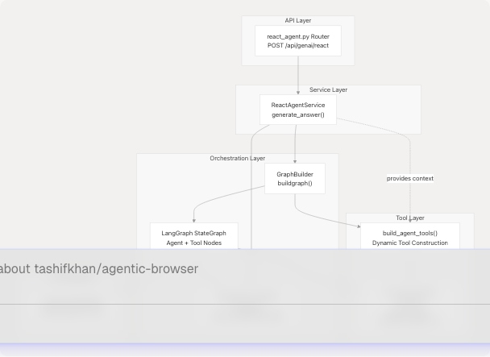
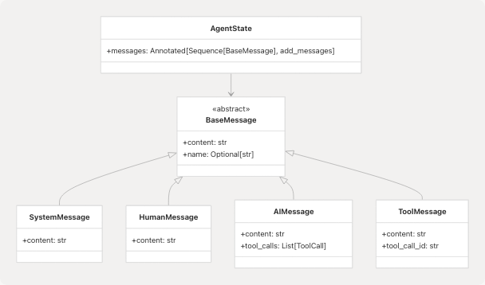
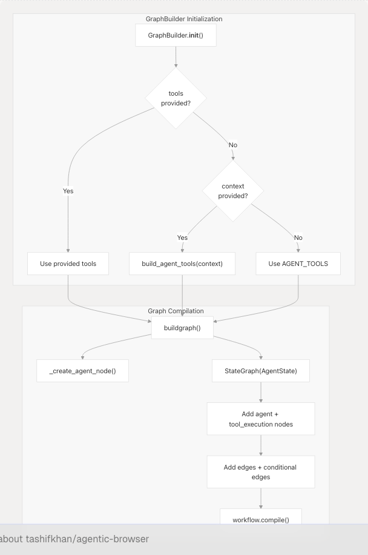
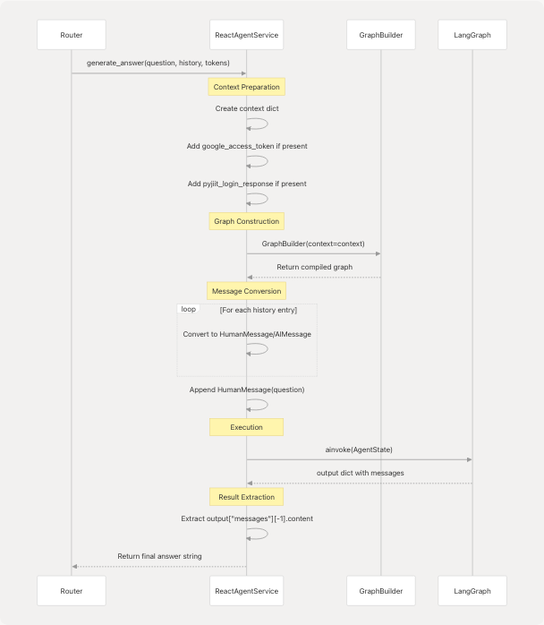

# React Agent Architecture

Relevant source files

* [agents/\_\_init\_\_.py](https://github.com/tashifkhan/agentic-browser/blob/e94826c4/agents/__init__.py)
* [agents/react\_agent.py](https://github.com/tashifkhan/agentic-browser/blob/e94826c4/agents/react_agent.py)
* [agents/react\_tools.py](https://github.com/tashifkhan/agentic-browser/blob/e94826c4/agents/react_tools.py)
* [models/requests/\_\_init\_\_.py](https://github.com/tashifkhan/agentic-browser/blob/e94826c4/models/requests/__init__.py)
* [models/response/\_\_init\_\_.py](https://github.com/tashifkhan/agentic-browser/blob/e94826c4/models/response/__init__.py)
* [models/response/react\_agent.py](https://github.com/tashifkhan/agentic-browser/blob/e94826c4/models/response/react_agent.py)
* [routers/react\_agent.py](https://github.com/tashifkhan/agentic-browser/blob/e94826c4/routers/react_agent.py)
* [services/google\_search\_service.py](https://github.com/tashifkhan/agentic-browser/blob/e94826c4/services/google_search_service.py)
* [services/pyjiit\_service.py](https://github.com/tashifkhan/agentic-browser/blob/e94826c4/services/pyjiit_service.py)
* [services/react\_agent\_service.py](https://github.com/tashifkhan/agentic-browser/blob/e94826c4/services/react_agent_service.py)
* [services/website\_service.py](https://github.com/tashifkhan/agentic-browser/blob/e94826c4/services/website_service.py)
* [services/youtube\_service.py](https://github.com/tashifkhan/agentic-browser/blob/e94826c4/services/youtube_service.py)

## Purpose and Scope

This document describes the React Agent system, which implements a conversational AI agent using LangGraph orchestration and the ReAct (Reason + Act) pattern. The React Agent can dynamically select and execute from 11+ specialized tools to answer complex, multi-step questions while maintaining conversation context.

For information about the individual tools available to the agent, see [Agent Tool System](/tashifkhan/agentic-browser/4.3-agent-tool-system). For the Browser Use Agent that generates automation scripts, see [Browser Use Agent and Script Generation](/tashifkhan/agentic-browser/4.2-browser-use-agent-and-script-generation). For LLM provider configuration, see [LLM Integration Layer](/tashifkhan/agentic-browser/4.5-llm-integration-layer).

**Sources:** [agents/react\_agent.py1-191](https://github.com/tashifkhan/agentic-browser/blob/e94826c4/agents/react_agent.py#L1-L191) [agents/react\_tools.py1-721](https://github.com/tashifkhan/agentic-browser/blob/e94826c4/agents/react_tools.py#L1-L721) [services/react\_agent\_service.py1-92](https://github.com/tashifkhan/agentic-browser/blob/e94826c4/services/react_agent_service.py#L1-L92)

---

## System Architecture Overview

The React Agent system consists of four main layers: the API router, the service layer, the orchestration layer (GraphBuilder + LangGraph), and the tool execution layer.


```

**Architecture Layers:**

| Layer | Component | Purpose |
| --- | --- | --- |
| **API** | `routers/react_agent.py` | HTTP endpoint accepting `CrawlerRequest` |
| **Service** | `ReactAgentService` | Context preparation, message conversion, orchestration |
| **Orchestration** | `GraphBuilder` + `StateGraph` | LangGraph workflow compilation and execution |
| **Tool** | `build_agent_tools()` | Dynamic tool assembly based on authentication context |
| **LLM** | `LargeLanguageModel` | Provider-agnostic AI model interface |

**Sources:** [agents/react\_agent.py1-191](https://github.com/tashifkhan/agentic-browser/blob/e94826c4/agents/react_agent.py#L1-L191) [agents/react\_tools.py609-699](https://github.com/tashifkhan/agentic-browser/blob/e94826c4/agents/react_tools.py#L609-L699) [services/react\_agent\_service.py1-92](https://github.com/tashifkhan/agentic-browser/blob/e94826c4/services/react_agent_service.py#L1-L92) [routers/react\_agent.py1-55](https://github.com/tashifkhan/agentic-browser/blob/e94826c4/routers/react_agent.py#L1-L55)

---

## Agent State and Message Model

### AgentState TypedDict

The `AgentState` is the core state container passed through the LangGraph workflow. It uses LangGraph's `add_messages` reducer to accumulate conversation history.

```

```

The `AgentState` is defined at [agents/react\_agent.py40-41](https://github.com/tashifkhan/agentic-browser/blob/e94826c4/agents/react_agent.py#L40-L41) as:

```
```
class AgentState(TypedDict):
    messages: Annotated[Sequence[BaseMessage], add_messages]
```
```

The `add_messages` reducer from LangGraph automatically appends new messages to the existing list, enabling stateful conversation flow.

**Sources:** [agents/react\_agent.py40-41](https://github.com/tashifkhan/agentic-browser/blob/e94826c4/agents/react_agent.py#L40-L41)

### Message Conversion Layer

The agent uses two conversion functions to bridge API format and LangChain format:

| Function | Direction | Purpose |
| --- | --- | --- |
| `_payload_to_langchain()` | API → LangChain | Converts `AgentMessagePayload` dict to `BaseMessage` subclass |
| `_langchain_to_payload()` | LangChain → API | Converts `BaseMessage` to serializable dict |

**API Message Format (`AgentMessagePayload`):**

```
```
class AgentMessagePayload(TypedDict, total=False):
    role: Literal["system", "user", "assistant", "tool"]
    content: str
    name: str
    tool_call_id: str
    tool_calls: list[dict[str, Any]]
```
```

The conversion functions handle normalization of content (JSON serialization if needed), extraction of tool calls from `AIMessage`, and preservation of tool execution metadata from `ToolMessage`.

**Message Type Mapping:**

| `role` Value | LangChain Class | Usage |
| --- | --- | --- |
| `"system"` | `SystemMessage` | System prompt injection |
| `"user"` | `HumanMessage` | User questions |
| `"assistant"` | `AIMessage` | Agent responses and tool calls |
| `"tool"` | `ToolMessage` | Tool execution results |

**Sources:** [agents/react\_agent.py44-121](https://github.com/tashifkhan/agentic-browser/blob/e94826c4/agents/react_agent.py#L44-L121)

---

## Graph Construction with GraphBuilder

### GraphBuilder Class

The `GraphBuilder` class compiles the LangGraph workflow and manages tool selection based on provided context.

```

```

**Initialization Logic ([agents/react\_agent.py138-152](https://github.com/tashifkhan/agentic-browser/blob/e94826c4/agents/react_agent.py#L138-L152)):**

1. If `tools` list provided → use those tools
2. Else if `context` dict provided → call `build_agent_tools(context)` for dynamic tool selection
3. Else → use default `AGENT_TOOLS` (5 base tools without authentication)

**Graph Structure ([agents/react\_agent.py154-170](https://github.com/tashifkhan/agentic-browser/blob/e94826c4/agents/react_agent.py#L154-L170)):**

The compiled graph has two nodes:

| Node Name | Type | Function |
| --- | --- | --- |
| `"agent"` | Custom async function | Invokes LLM with bound tools to get next action |
| `"tool_execution"` | `ToolNode` | Executes tools selected by agent |

**Edge Configuration:**

```

```

The `tools_condition` examines the `AIMessage` returned by the agent. If `tool_calls` are present, it routes to `"tool_execution"`. Otherwise, it ends the conversation.

**Sources:** [agents/react\_agent.py138-176](https://github.com/tashifkhan/agentic-browser/blob/e94826c4/agents/react_agent.py#L138-L176)

### Agent Node Construction

The `_create_agent_node()` function creates the agent reasoning node:

```

```

Key behavior at [agents/react\_agent.py123-135](https://github.com/tashifkhan/agentic-browser/blob/e94826c4/agents/react_agent.py#L123-L135):

1. Binds tools to LLM using `_llm.bind_tools(list(tools))`
2. Ensures `SystemMessage` is first message (injects if missing)
3. Invokes LLM with full message history
4. Returns LLM response as state update

The system prompt ([agents/react\_agent.py25-34](https://github.com/tashifkhan/agentic-browser/blob/e94826c4/agents/react_agent.py#L25-L34)) instructs the agent to:

* Maintain conversation context
* Use tools when they improve the answer
* Never request Google or PyJIIT credentials from users (they're provided automatically)
* Report session expiration rather than asking for passwords

**Sources:** [agents/react\_agent.py25-135](https://github.com/tashifkhan/agentic-browser/blob/e94826c4/agents/react_agent.py#L25-L135)

---

## The ReAct Execution Loop

The React Agent implements the ReAct (Reason + Act) pattern through LangGraph's conditional edges.

```

```

**Execution Flow Breakdown:**

1. **Service Preparation ([services/react\_agent\_service.py22-36](https://github.com/tashifkhan/agentic-browser/blob/e94826c4/services/react_agent_service.py#L22-L36))**:

   * Build context dict from `google_access_token` and `pyjiit_login_response`
   * Instantiate `GraphBuilder(context=context)`
   * Convert chat history to `HumanMessage` / `AIMessage` objects
2. **Graph Invocation ([services/react\_agent\_service.py58-75](https://github.com/tashifkhan/agentic-browser/blob/e94826c4/services/react_agent_service.py#L58-L75))**:

   * Construct `AgentState` with messages list
   * Call `graph.ainvoke(state)` to start workflow
3. **Agent Reasoning**:

   * LLM receives messages with tool descriptions
   * Decides to either: (a) call one or more tools, or (b) respond directly
4. **Tool Execution (if needed)**:

   * `ToolNode` executes selected tools in parallel
   * Results appended as `ToolMessage` objects
   * Flow returns to agent node
5. **Loop Continuation**:

   * Agent re-evaluates with updated context
   * May call additional tools or provide final answer
   * Loop terminates when agent produces response without tool calls
6. **Result Extraction ([services/react\_agent\_service.py77-83](https://github.com/tashifkhan/agentic-browser/blob/e94826c4/services/react_agent_service.py#L77-L83))**:

   * Extract last message content from output state
   * Return as string to API layer

**Sources:** [services/react\_agent\_service.py14-92](https://github.com/tashifkhan/agentic-browser/blob/e94826c4/services/react_agent_service.py#L14-L92) [agents/react\_agent.py154-170](https://github.com/tashifkhan/agentic-browser/blob/e94826c4/agents/react_agent.py#L154-L170)

---

## Dynamic Tool Construction

### Tool Registry

The system defines 11+ base tools in [agents/react\_tools.py](https://github.com/tashifkhan/agentic-browser/blob/e94826c4/agents/react_tools.py):

| Tool Name | Input Schema | Requires Auth | Description |
| --- | --- | --- | --- |
| `github_agent` | `GitHubToolInput` | No | Repository analysis using gitingest |
| `websearch_agent` | `WebSearchToolInput` | No | Web search via TavilySearch |
| `website_agent` | `WebsiteToolInput` | No | Webpage to markdown + Q&A |
| `youtube_agent` | `YouTubeToolInput` | No | Video transcript analysis |
| `browser_action_agent` | (see 4.3) | No | Browser DOM manipulation |
| `gmail_agent` | `GmailToolInput` | Yes | Fetch recent emails |
| `gmail_send_email` | `GmailSendEmailInput` | Yes | Send email |
| `gmail_list_unread` | `GmailListUnreadInput` | Yes | List unread messages |
| `gmail_mark_read` | `GmailMarkReadInput` | Yes | Mark message as read |
| `calendar_agent` | `CalendarToolInput` | Yes | Fetch calendar events |
| `calendar_create_event` | `CalendarCreateEventInput` | Yes | Create calendar event |
| `pyjiit_agent` | `PyjiitAttendanceInput` | Yes | JIIT attendance data |

**Sources:** [agents/react\_tools.py524-607](https://github.com/tashifkhan/agentic-browser/blob/e94826c4/agents/react_tools.py#L524-L607)

### Context-Based Tool Selection

The `build_agent_tools()` function at [agents/react\_tools.py609-699](https://github.com/tashifkhan/agentic-browser/blob/e94826c4/agents/react_tools.py#L609-L699) implements dynamic tool selection:

```

```

**Implementation Pattern ([agents/react\_tools.py609-699](https://github.com/tashifkhan/agentic-browser/blob/e94826c4/agents/react_tools.py#L609-L699))**:

1. **Base Tools**: Always included (no authentication required)
2. **Google Tools**: Added if `google_access_token` in context
   * Uses `functools.partial` to bind `_default_token` parameter
   * Tools can still accept token in their input schema (overrides default)
3. **PyJIIT Tool**: Added if `pyjiit_login_response` in context
   * Binds `_default_payload` to tool function

**Partial Application Example:**

When `google_access_token` is provided, the service creates Gmail tools like:

```
```
StructuredTool(
    name=gmail_agent.name,
    description=gmail_agent.description,
    coroutine=partial(_gmail_tool, _default_token=google_token),
    args_schema=GmailToolInput,
)
```
```

This allows the LLM to call `gmail_agent()` without specifying the token, but users can still override by passing `access_token` in the call.

**Sources:** [agents/react\_tools.py609-699](https://github.com/tashifkhan/agentic-browser/blob/e94826c4/agents/react_tools.py#L609-L699)

---

## Service Layer Integration

### ReactAgentService

The `ReactAgentService` class at [services/react\_agent\_service.py14-92](https://github.com/tashifkhan/agentic-browser/blob/e94826c4/services/react_agent_service.py#L14-L92) bridges the API router and the agent system.

**Key Responsibilities:**

| Method | Parameters | Returns | Purpose |
| --- | --- | --- | --- |
| `generate_answer()` | `question`, `chat_history`, `google_access_token`, `pyjiit_login_response` | `str` | Orchestrate agent execution and return final answer |

**Detailed Flow ([services/react\_agent\_service.py22-91](https://github.com/tashifkhan/agentic-browser/blob/e94826c4/services/react_agent_service.py#L22-L91))**:

```

```

**Error Handling:**

The service wraps execution in try-except ([services/react\_agent\_service.py85-91](https://github.com/tashifkhan/agentic-browser/blob/e94826c4/services/react_agent_service.py#L85-L91)):

* Logs exceptions with full context
* Returns user-friendly error message instead of raising
* Prevents sensitive error details from leaking to client

**Chat History Conversion ([services/react\_agent\_service.py40-55](https://github.com/tashifkhan/agentic-browser/blob/e94826c4/services/react_agent_service.py#L40-L55))**:

Accepts flexible history format:

* Looks for `"role"` key with values: `"user"`, `"assistant"`, `"bot"`, `"ai"`
* Converts to appropriate LangChain message type
* Skips entries that don't match expected format

**Sources:** [services/react\_agent\_service.py14-92](https://github.com/tashifkhan/agentic-browser/blob/e94826c4/services/react_agent_service.py#L14-L92)

---

## API Entry Point

### Router Endpoint

The FastAPI router at [routers/react\_agent.py1-55](https://github.com/tashifkhan/agentic-browser/blob/e94826c4/routers/react_agent.py#L1-L55) exposes the agent as HTTP endpoint.

**Endpoint Definition:**

```
```
@router.post("/", response_model=CrawllerResponse)
async def agent_bhai(
    request: CrawlerRequest,
    service: ReactAgentService = Depends(get_react_agent_service),
) -> CrawllerResponse:
```
```

**Request Model (`CrawlerRequest`):**

| Field | Type | Required | Description |
| --- | --- | --- | --- |
| `question` | `str` | Yes | User's question or instruction |
| `chat_history` | `list[dict]` | No | Previous conversation turns |
| `google_access_token` | `str` | No | OAuth token for Gmail/Calendar |
| `pyjiit_login_response` | `PyjiitLoginResponse` | No | JIIT webportal session |

**Response Model (`CrawllerResponse`):**

| Field | Type | Description |
| --- | --- | --- |
| `answer` | `str` | Agent's final response |

**Validation ([routers/react\_agent.py27-28](https://github.com/tashifkhan/agentic-browser/blob/e94826c4/routers/react_agent.py#L27-L28))**:

* Raises `HTTPException(400)` if `question` is empty
* Dependency injection provides `ReactAgentService` instance
* Service errors caught and converted to `HTTPException(500)`

**Full Request-Response Flow:**

```

```

**Sources:** [routers/react\_agent.py1-55](https://github.com/tashifkhan/agentic-browser/blob/e94826c4/routers/react_agent.py#L1-L55) [models/requests/crawller.py](https://github.com/tashifkhan/agentic-browser/blob/e94826c4/models/requests/crawller.py) [models/response/crawller.py](https://github.com/tashifkhan/agentic-browser/blob/e94826c4/models/response/crawller.py)

---

## Configuration and Caching

### LLM Singleton

The agent uses a module-level LLM instance ([agents/react\_agent.py36](https://github.com/tashifkhan/agentic-browser/blob/e94826c4/agents/react_agent.py#L36-L36)):

```
```
_llm = LargeLanguageModel().client
```
```

This ensures all agent executions share the same configured LLM client, avoiding redundant initialization.

### System Message

A default system prompt is defined at [agents/react\_agent.py25-34](https://github.com/tashifkhan/agentic-browser/blob/e94826c4/agents/react_agent.py#L25-L34) and injected as a module-level `SystemMessage`:

```
```
_system_message = SystemMessage(content=DEFAULT_SYSTEM_PROMPT)
```
```

The prompt emphasizes:

1. Maintaining conversation context
2. Using tools when beneficial
3. Not requesting credentials from users (they're auto-provided)
4. Reporting session expiration without asking for passwords

### Graph Caching

A cached graph builder is available via `_compiled_graph()` at [agents/react\_agent.py178-180](https://github.com/tashifkhan/agentic-browser/blob/e94826c4/agents/react_agent.py#L178-L180):

```
```
@lru_cache(maxsize=1)
def _compiled_graph():
    return GraphBuilder()()
```

This caches the default (no-context) graph compilation. However, the `ReactAgentService` typically creates a fresh `GraphBuilder` with context, so this cache is primarily for the standalone `run_react_agent()` function.

**Sources:** [agents/react\_agent.py25-36](https://github.com/tashifkhan/agentic-browser/blob/e94826c4/agents/react_agent.py#L25-L36) [agents/react\_agent.py178-180](https://github.com/tashifkhan/agentic-browser/blob/e94826c4/agents/react_agent.py#L178-L180)

---

## Summary

The React Agent Architecture implements a sophisticated conversational AI system with:

1. **Stateful Orchestration**: LangGraph manages multi-turn conversations with the `AgentState` container
2. **ReAct Pattern**: Agent alternates between reasoning (LLM invocation) and acting (tool execution)
3. **Dynamic Tool Selection**: Tools conditionally included based on authentication context
4. **Message Abstraction**: Clean conversion between API and LangChain message formats
5. **Layered Design**: Router → Service → GraphBuilder → LangGraph provides separation of concerns

The system supports 11+ specialized tools including web search, repository analysis, video processing, Gmail, Calendar, and institutional data access. Tools requiring authentication use `functools.partial` to bind credentials without exposing them in the LLM's tool schema.

**Key Files:**

* [agents/react\_agent.py1-191](https://github.com/tashifkhan/agentic-browser/blob/e94826c4/agents/react_agent.py#L1-L191) - Core orchestration logic
* [agents/react\_tools.py1-721](https://github.com/tashifkhan/agentic-browser/blob/e94826c4/agents/react_tools.py#L1-L721) - Tool definitions and dynamic construction
* [services/react\_agent\_service.py1-92](https://github.com/tashifkhan/agentic-browser/blob/e94826c4/services/react_agent_service.py#L1-L92) - Service layer integration
* [routers/react\_agent.py1-55](https://github.com/tashifkhan/agentic-browser/blob/e94826c4/routers/react_agent.py#L1-L55) - HTTP API endpoint