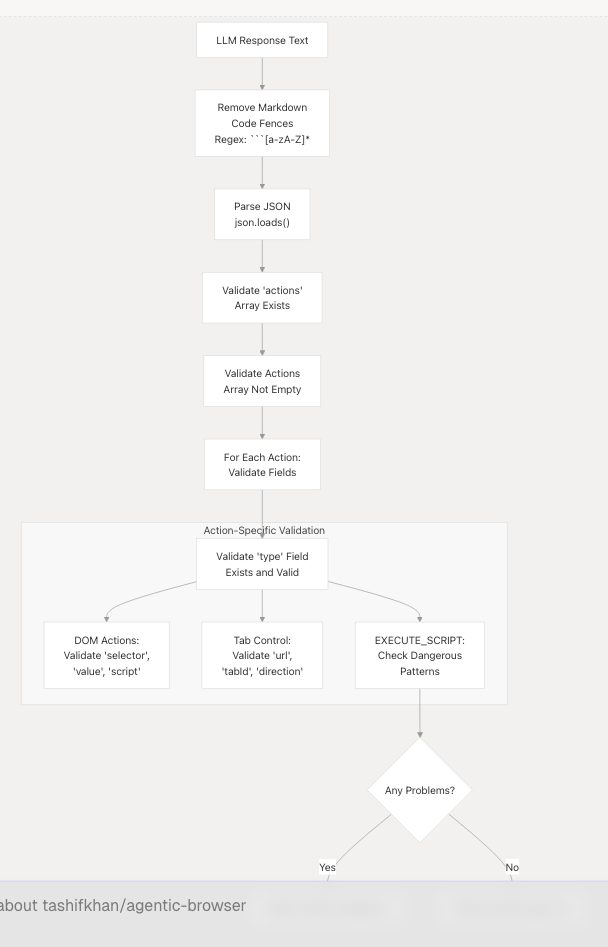
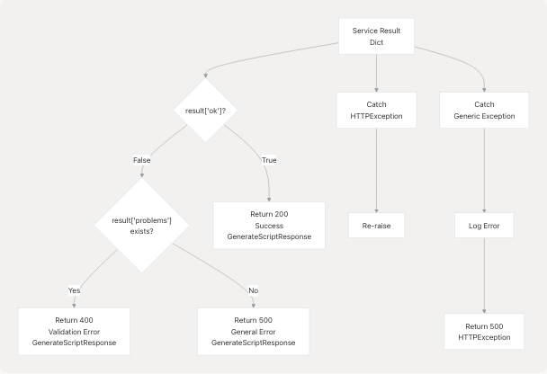

# Browser Use Agent and Script Generation

This document describes the Browser Use Agent system, which generates structured JSON action plans for browser automation. The system accepts natural language goals and optional DOM context, then uses an LLM to produce validated, executable browser automation scripts. These scripts are consumed by the Browser Extension (see [5](5-browser-extension)) to perform automated web interactions.

For conversational AI agent capabilities with dynamic tool selection, see [React Agent Architecture](4.1-react-agent-architecture). For the browser extension that executes these generated scripts, see [Browser Extension](5-browser-extension).

## Purpose and Architecture

The Browser Use Agent is a stateless script generation service that translates user goals into structured action sequences. Unlike the React Agent which engages in multi-turn reasoning with tool calls, the Browser Use Agent performs single-shot generation of complete automation plans.


**Sources:** [routers/browser\_use.py1-51](https://github.com/tashifkhan/agentic-browser/blob/e94826c4/routers/browser_use.py#L1-L51) [services/browser\_use\_service.py1-96](https://github.com/tashifkhan/agentic-browser/blob/e94826c4/services/browser_use_service.py#L1-L96) [prompts/browser\_use.py1-138](https://github.com/tashifkhan/agentic-browser/blob/e94826c4/prompts/browser_use.py#L1-L138) [utils/agent\_sanitizer.py1-119](https://github.com/tashifkhan/agentic-browser/blob/e94826c4/utils/agent_sanitizer.py#L1-L119)

## Request Flow and API Contract

The Browser Use Agent exposes a single endpoint at `/generate-script` that accepts a `GenerateScriptRequest` and returns a `GenerateScriptResponse`.

### Request Model

| Field | Type | Required | Description |
| --- | --- | --- | --- |
| `goal` | string | Yes | Natural language description of the automation task |
| `target_url` | string | No | Starting URL for the automation (default: "") |
| `dom_structure` | dict | No | Parsed DOM information from the current page |
| `constraints` | dict | No | Additional constraints or parameters |

The `dom_structure` dictionary, when provided, contains:

* `url`: Current page URL
* `title`: Page title
* `interactive`: Array of interactive elements with attributes (`tag`, `id`, `class`, `type`, `placeholder`, `name`, `ariaLabel`, `text`)

**Sources:** [models/requests/agent.py1-10](https://github.com/tashifkhan/agentic-browser/blob/e94826c4/models/requests/agent.py#L1-L10)

### Response Model

| Field | Type | Description |
| --- | --- | --- |
| `ok` | bool | Whether generation succeeded |
| `action_plan` | dict | Structured JSON action plan (if successful) |
| `error` | string | Error message (if failed) |
| `problems` | list[string] | Validation problems (if validation failed) |
| `raw_response` | string | Truncated LLM response for debugging (if validation failed) |

**Sources:** [models/response/agent.py1-11](https://github.com/tashifkhan/agentic-browser/blob/e94826c4/models/response/agent.py#L1-L11)

### Endpoint Implementation


The router at [routers/browser\_use.py16-51](https://github.com/tashifkhan/agentic-browser/blob/e94826c4/routers/browser_use.py#L16-L51) performs initial validation, then delegates to `AgentService`. The service returns a dictionary that the router transforms into a `GenerateScriptResponse`. The router distinguishes between validation failures (problems present) and general errors.

**Sources:** [routers/browser\_use.py16-51](https://github.com/tashifkhan/agentic-browser/blob/e94826c4/routers/browser_use.py#L16-L51)

## Service Layer: AgentService

The `AgentService` class in [services/browser\_use\_service.py](https://github.com/tashifkhan/agentic-browser/blob/e94826c4/services/browser_use_service.py) implements the core script generation logic in its `generate_script` method.

### DOM Structure Formatting

The service formats the `dom_structure` dictionary into a human-readable text block for the LLM prompt:

```
=== PAGE INFORMATION ===
URL: [url]
Title: [title]

=== INTERACTIVE ELEMENTS (N found) ===

1. input id="email" type="email" placeholder="Enter email"
   Text: [text content]

2. button class="submit-btn" type="submit"
   Text: Submit
```

The service limits interactive elements to 30 to avoid exceeding token limits [services/browser\_use\_service.py34-51](https://github.com/tashifkhan/agentic-browser/blob/e94826c4/services/browser_use_service.py#L34-L51) Each element displays relevant attributes: `tag`, `id`, `class`, `type`, `placeholder`, `name`, `ariaLabel`, and truncated text content.

**Sources:** [services/browser\_use\_service.py22-52](https://github.com/tashifkhan/agentic-browser/blob/e94826c4/services/browser_use_service.py#L22-L52)

### Prompt Construction

The service constructs a detailed user prompt that includes:

1. **Goal and Context**: The user's goal, target URL, and constraints
2. **DOM Information**: Formatted interactive elements (if provided)
3. **Action Type Guidance**: Instructions to analyze whether the goal requires DOM actions, tab control actions, or both
4. **Search-Specific Instructions**: Critical guidance for handling search queries using direct URL construction

The prompt explicitly warns against opening `chrome://newtab` or `about:blank` and then attempting DOM actions, as these pages do not support scripting [services/browser\_use\_service.py53-69](https://github.com/tashifkhan/agentic-browser/blob/e94826c4/services/browser_use_service.py#L53-L69)

**Sources:** [services/browser\_use\_service.py53-69](https://github.com/tashifkhan/agentic-browser/blob/e94826c4/services/browser_use_service.py#L53-L69)

### LLM Invocation

The service uses a LangChain chain composition pattern:

```
chain = SCRIPT_PROMPT | llm
response = await chain.ainvoke({"input": user_prompt})
```

The `SCRIPT_PROMPT` is a `ChatPromptTemplate` that combines system instructions with the user prompt. The `llm` object is the global LLM instance from `core.llm` [services/browser\_use\_service.py74-77](https://github.com/tashifkhan/agentic-browser/blob/e94826c4/services/browser_use_service.py#L74-L77) The chain asynchronously invokes the LLM and extracts the content from the response.

**Sources:** [services/browser\_use\_service.py72-77](https://github.com/tashifkhan/agentic-browser/blob/e94826c4/services/browser_use_service.py#L72-L77)

## Prompt Engineering

The `SCRIPT_PROMPT` in [prompts/browser\_use.py](https://github.com/tashifkhan/agentic-browser/blob/e94826c4/prompts/browser_use.py) is a comprehensive `ChatPromptTemplate` that provides detailed instructions for the LLM. The prompt is structured in multiple sections:

### Action Categories

The prompt defines two distinct action categories:


**Sources:** [prompts/browser\_use.py14-27](https://github.com/tashifkhan/agentic-browser/blob/e94826c4/prompts/browser_use.py#L14-L27) [utils/agent\_sanitizer.py4-17](https://github.com/tashifkhan/agentic-browser/blob/e94826c4/utils/agent_sanitizer.py#L4-L17)

### JSON Format Examples

The prompt provides concrete examples for common scenarios:

1. **DOM Action Example**: Typing into a textarea using a specific selector
2. **Tab Control Example**: Opening a new tab with a search URL
3. **Search Example (Preferred)**: Direct URL construction for search queries
4. **Combined Example**: Opening a real website followed by DOM interactions

Each example demonstrates proper JSON structure with required fields (`type`, `selector`, `value`, `url`, etc.) and optional `description` fields [prompts/browser\_use.py28-88](https://github.com/tashifkhan/agentic-browser/blob/e94826c4/prompts/browser_use.py#L28-L88)

**Sources:** [prompts/browser\_use.py28-88](https://github.com/tashifkhan/agentic-browser/blob/e94826c4/prompts/browser_use.py#L28-L88)

### Critical Rules

The prompt defines critical rules in four categories:

| Rule Category | Key Points |
| --- | --- |
| Intent Analysis | Distinguish between tab control needs vs. DOM interaction needs |
| DOM Action Rules | Study DOM structure carefully; prefer IDs > data attributes > classes; never use DOM actions on `chrome://` URLs |
| Tab Control Rules | Specify required/optional fields for each tab control action type |
| Search Handling | **Critical**: Construct full search URL in `OPEN_TAB` action; never open blank tab then type (fails on `chrome://` pages) |

The search handling rules are emphasized as critical because attempting DOM actions on `chrome://newtab` will fail [prompts/browser\_use.py89-116](https://github.com/tashifkhan/agentic-browser/blob/e94826c4/prompts/browser_use.py#L89-L116)

**Sources:** [prompts/browser\_use.py89-119](https://github.com/tashifkhan/agentic-browser/blob/e94826c4/prompts/browser_use.py#L89-L119)

### Selector Strategy

The prompt instructs the LLM to use the provided DOM structure to craft precise selectors, with a preference hierarchy:

```
IDs > data attributes > specific classes > tag+type combinations
```

It also recommends using `placeholder`, `name`, or `aria-label` attributes when available for more robust selection [prompts/browser\_use.py95-99](https://github.com/tashifkhan/agentic-browser/blob/e94826c4/prompts/browser_use.py#L95-L99)

**Sources:** [prompts/browser\_use.py95-99](https://github.com/tashifkhan/agentic-browser/blob/e94826c4/prompts/browser_use.py#L95-L99)

## Action Validation and Sanitization

The `sanitize_json_actions` function in [utils/agent\_sanitizer.py](https://github.com/tashifkhan/agentic-browser/blob/e94826c4/utils/agent_sanitizer.py) performs comprehensive validation of the LLM-generated action plan.

### Validation Process



**Sources:** [utils/agent\_sanitizer.py20-96](https://github.com/tashifkhan/agentic-browser/blob/e94826c4/utils/agent_sanitizer.py#L20-L96)

### Validation Rules

The validator enforces different rules based on action type:

| Action Type | Required Fields | Additional Validation |
| --- | --- | --- |
| `CLICK`, `TYPE`, `SELECT` | `selector` | `TYPE` also requires `value` |
| `EXECUTE_SCRIPT` | `script` | Checks for dangerous patterns: `eval(`, `new Function`, `innerHTML =`, `outerHTML =` |
| `OPEN_TAB`, `NAVIGATE` | `url` | - |
| `SWITCH_TAB` | `tabId` OR `direction` | - |
| `CLOSE_TAB`, `RELOAD_TAB`, `DUPLICATE_TAB` | - | Fields are optional |

The validator maintains two constant lists defining valid action types:

* `DOM_ACTIONS` [utils/agent\_sanitizer.py5](https://github.com/tashifkhan/agentic-browser/blob/e94826c4/utils/agent_sanitizer.py#L5-L5): Actions requiring page context
* `TAB_CONTROL_ACTIONS` [utils/agent\_sanitizer.py8-15](https://github.com/tashifkhan/agentic-browser/blob/e94826c4/utils/agent_sanitizer.py#L8-L15): Browser-level actions

**Sources:** [utils/agent\_sanitizer.py4-90](https://github.com/tashifkhan/agentic-browser/blob/e94826c4/utils/agent_sanitizer.py#L4-L90)

### Security Checks

For `EXECUTE_SCRIPT` actions, the validator performs basic security checks for dangerous patterns [utils/agent\_sanitizer.py63-74](https://github.com/tashifkhan/agentic-browser/blob/e94826c4/utils/agent_sanitizer.py#L63-L74):

```
dangerous = ["eval(", "new Function", "innerHTML =", "outerHTML ="]
```

If any of these patterns are detected in the script, a problem is added to the validation results. This provides a basic layer of protection against code injection, though the primary security boundary is the browser extension's execution context.

**Sources:** [utils/agent\_sanitizer.py63-74](https://github.com/tashifkhan/agentic-browser/blob/e94826c4/utils/agent_sanitizer.py#L63-L74)

## Response Generation and Error Handling

The service returns structured responses that the router transforms into `GenerateScriptResponse` objects.

### Success Response

When validation succeeds, the service returns:

```
{
    "ok": True,
    "action_plan": {
        "actions": [
            {"type": "CLICK", "selector": "...", "description": "..."},
            # ... more actions
        ]
    }
}
```

**Sources:** [services/browser\_use\_service.py91](https://github.com/tashifkhan/agentic-browser/blob/e94826c4/services/browser_use_service.py#L91-L91)

### Validation Failure Response

When the action plan fails validation, the service returns:

```
{
    "ok": False,
    "error": "Action plan failed validation.",
    "problems": [
        "Action 0: missing 'selector' field",
        "Action 2: invalid type 'INVALID_ACTION'"
    ],
    "raw_response": "[first 1000 chars of LLM response]"
}
```

The `raw_response` is truncated to 1000 characters for debugging purposes [services/browser\_use\_service.py83-89](https://github.com/tashifkhan/agentic-browser/blob/e94826c4/services/browser_use_service.py#L83-L89)

**Sources:** [services/browser\_use\_service.py82-89](https://github.com/tashifkhan/agentic-browser/blob/e94826c4/services/browser_use_service.py#L82-L89)

### Exception Response

When an exception occurs during generation, the service returns:

```
{
    "ok": False,
    "error": "[exception message]"
}
```

The service logs the full exception with traceback using `logger.exception()` [services/browser\_use\_service.py93-95](https://github.com/tashifkhan/agentic-browser/blob/e94826c4/services/browser_use_service.py#L93-L95)

**Sources:** [services/browser\_use\_service.py93-95](https://github.com/tashifkhan/agentic-browser/blob/e94826c4/services/browser_use_service.py#L93-L95)

### Router Error Handling

The router distinguishes between different error types and returns appropriate HTTP status codes:



However, the current implementation at [routers/browser\_use.py32-44](https://github.com/tashifkhan/agentic-browser/blob/e94826c4/routers/browser_use.py#L32-L44) returns the `GenerateScriptResponse` with the error fields populated rather than raising HTTP exceptions for validation errors. This allows clients to programmatically access the `problems` array.

**Sources:** [routers/browser\_use.py20-50](https://github.com/tashifkhan/agentic-browser/blob/e94826c4/routers/browser_use.py#L20-L50)

## Integration with Browser Extension

The generated action plans are consumed by the Browser Extension's background script, which executes the actions sequentially. The extension interprets the JSON action plan and dispatches each action to the appropriate handler.

For DOM actions (`CLICK`, `TYPE`, `SCROLL`, `WAIT`, `SELECT`, `EXECUTE_SCRIPT`), the extension uses `browser.scripting.executeScript` to inject and execute code in the page context. For tab control actions (`OPEN_TAB`, `CLOSE_TAB`, `SWITCH_TAB`, `NAVIGATE`, `RELOAD_TAB`, `DUPLICATE_TAB`), the extension uses `browser.tabs` API methods.

See [Browser Extension](5-browser-extension) for details on how the extension executes these generated scripts.

**Sources:** Based on high-level architecture diagrams; specific extension implementation details are in the Browser Extension section

## LLM Provider Flexibility

The Browser Use Agent uses the global `llm` instance from `core.llm` [services/browser\_use\_service.py4](https://github.com/tashifkhan/agentic-browser/blob/e94826c4/services/browser_use_service.py#L4-L4) which is a `LargeLanguageModel` instance that abstracts over multiple providers. The system can use any configured provider (Google Gemini, OpenAI, Anthropic, Ollama, Deepseek, OpenRouter) without changes to the Browser Use Agent code.

See [LLM Integration Layer](4.5-llm-integration-layer) for details on the multi-provider abstraction.

**Sources:** [services/browser\_use\_service.py4](https://github.com/tashifkhan/agentic-browser/blob/e94826c4/services/browser_use_service.py#L4-L4) high-level architecture diagrams
