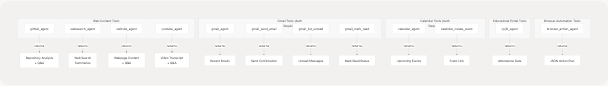
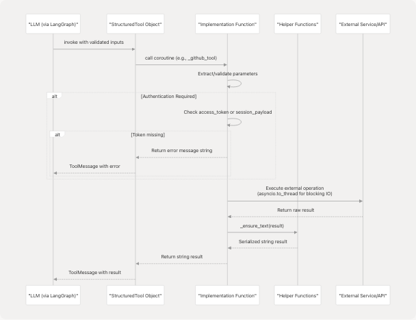
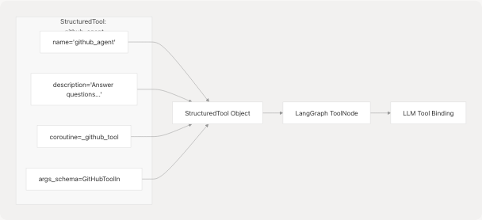
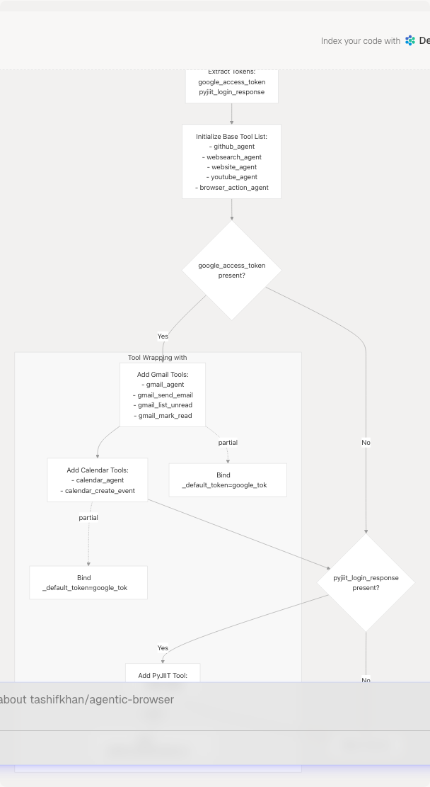

# Agent Tool System

Relevant source files

* [agents/react\_agent.py](https://github.com/tashifkhan/agentic-browser/blob/e94826c4/agents/react_agent.py)
* [agents/react\_tools.py](https://github.com/tashifkhan/agentic-browser/blob/e94826c4/agents/react_tools.py)
* [routers/react\_agent.py](https://github.com/tashifkhan/agentic-browser/blob/e94826c4/routers/react_agent.py)
* [tools/browser\_use/\_\_init\_\_.py](https://github.com/tashifkhan/agentic-browser/blob/e94826c4/tools/browser_use/__init__.py)
* [tools/browser\_use/tool.py](https://github.com/tashifkhan/agentic-browser/blob/e94826c4/tools/browser_use/tool.py)

## Purpose and Scope

This document describes the agent tool system that provides the React Agent with capabilities to interact with external services and data sources. The system is implemented in [agents/react\_tools.py](https://github.com/tashifkhan/agentic-browser/blob/e94826c4/agents/react_tools.py) and includes 11+ specialized tools for web search, GitHub analysis, email management, calendar operations, and browser automation. Each tool is defined as a LangChain `StructuredTool` with a Pydantic input schema and an async implementation function.

For information about how these tools are integrated into the React Agent workflow, see [React Agent Architecture](/tashifkhan/agentic-browser/4.1-react-agent-architecture). For details on how tools are dynamically assembled based on authentication context, see [Dynamic Tool Construction and Context Management](/tashifkhan/agentic-browser/4.4-dynamic-tool-construction-and-context-management).

---

## Tool Architecture Overview

The agent tool system follows a three-layer pattern: **Input Schema → Implementation Function → StructuredTool Registration**. Each tool is defined by a Pydantic model that validates inputs, an async function that executes the tool's logic, and a `StructuredTool` object that binds them together for LangChain integration.

**Diagram: Tool Architecture Layers**


```

**Sources:** [agents/react\_tools.py1-720](https://github.com/tashifkhan/agentic-browser/blob/e94826c4/agents/react_tools.py#L1-L720)

---

## Tool Categories and Catalog

The system provides 11+ tools organized into five functional categories:

**Diagram: Tool Taxonomy by Function**

```

```

**Sources:** [agents/react\_tools.py524-720](https://github.com/tashifkhan/agentic-browser/blob/e94826c4/agents/react_tools.py#L524-L720)

### Tool Catalog Table

| Tool Name | Category | Authentication | Primary Function |
| --- | --- | --- | --- |
| `github_agent` | Web Content | None | Answer questions about GitHub repositories |
| `websearch_agent` | Web Content | None | Search web and summarize top results |
| `website_agent` | Web Content | None | Fetch webpage, convert to markdown, answer questions |
| `youtube_agent` | Web Content | None | Answer questions about YouTube videos using transcripts |
| `gmail_agent` | Gmail | Google OAuth | Fetch recent Gmail messages |
| `gmail_send_email` | Gmail | Google OAuth | Send plain-text emails |
| `gmail_list_unread` | Gmail | Google OAuth | List unread messages with metadata |
| `gmail_mark_read` | Gmail | Google OAuth | Mark message as read by ID |
| `calendar_agent` | Calendar | Google OAuth | Retrieve upcoming calendar events |
| `calendar_create_event` | Calendar | Google OAuth | Create new calendar event |
| `pyjiit_agent` | Educational | PyJIIT Session | Fetch attendance data from JIIT webportal |
| `browser_action_agent` | Browser | None | Generate JSON action plan for browser automation |

**Sources:** [agents/react\_tools.py524-720](https://github.com/tashifkhan/agentic-browser/blob/e94826c4/agents/react_tools.py#L524-L720)

---

## Tool Input Schemas

Each tool defines its input parameters using Pydantic `BaseModel` classes. These schemas provide type validation, default values, and descriptive field metadata that LLMs use to understand tool usage.

**Diagram: Input Schema Hierarchy**

```

```

**Sources:** [agents/react\_tools.py61-210](https://github.com/tashifkhan/agentic-browser/blob/e94826c4/agents/react_tools.py#L61-L210) [tools/browser\_use/tool.py12-25](https://github.com/tashifkhan/agentic-browser/blob/e94826c4/tools/browser_use/tool.py#L12-L25)

### Key Schema Patterns

1. **URL Tools** (`GitHubToolInput`, `WebsiteToolInput`, `YouTubeToolInput`): Accept `HttpUrl` for validation, `question` string, and optional `chat_history` list.
2. **Gmail Tools**: All include optional `access_token` field. If omitted, the tool attempts to use a pre-configured token provided during tool construction via `functools.partial`.
3. **Calendar Tools**: Similar to Gmail, include optional `access_token` and use bounded `max_results` parameters.
4. **PyJIIT Tool**: Accepts optional `registration_code` (semester identifier) and `session_payload` (encrypted login session).
5. **Browser Tool**: Accepts freeform `goal` string, optional `target_url`, and structured `dom_structure`/`constraints` dictionaries.

**Sources:** [agents/react\_tools.py61-210](https://github.com/tashifkhan/agentic-browser/blob/e94826c4/agents/react_tools.py#L61-L210) [tools/browser\_use/tool.py12-25](https://github.com/tashifkhan/agentic-browser/blob/e94826c4/tools/browser_use/tool.py#L12-L25)

---

## Tool Implementation Pattern

All tool implementations follow a consistent async pattern with error handling and context management.

**Diagram: Tool Execution Flow**

```

```

**Sources:** [agents/react\_tools.py217-522](https://github.com/tashifkhan/agentic-browser/blob/e94826c4/agents/react_tools.py#L217-L522)

### Implementation Function Structure

Each implementation function follows this pattern:

```
```
async def _<tool_name>_tool(
    # Required parameters
    param1: Type,
    # Optional parameters with defaults
    param2: Type = default,
    # Context parameters (injected via partial)
    *,
    _default_token: Optional[str] = None,
) -> str:
    # 1. Resolve authentication/context
    token = param_token or _default_token
    if not token:
        return "Error: authentication required..."

    # 2. Validate/bound numeric parameters
    bounded = max(min_val, min(max_val, param2))

    # 3. Execute blocking IO in thread pool
    try:
        result = await asyncio.to_thread(external_function, ...)
        return _ensure_text(result)
    except Exception as exc:
        return f"Failed to ...: {exc}"
```
```

**Key Implementation Details:**

1. **Authentication Resolution** [agents/react\_tools.py285-290](https://github.com/tashifkhan/agentic-browser/blob/e94826c4/agents/react_tools.py#L285-L290): Tools check `access_token` or `session_payload` parameter first, falling back to `_default_token` or `_default_payload` injected via `functools.partial`.
2. **Error Handling** [agents/react\_tools.py294-300](https://github.com/tashifkhan/agentic-browser/blob/e94826c4/agents/react_tools.py#L294-L300): All exceptions are caught and returned as descriptive error strings rather than raised. This allows the LLM to understand failures and potentially retry or ask for clarification.
3. **Blocking IO Management** [agents/react\_tools.py229](https://github.com/tashifkhan/agentic-browser/blob/e94826c4/agents/react_tools.py#L229-L229): Blocking operations (LLM chain invocations, API calls) are wrapped in `asyncio.to_thread()` to avoid blocking the event loop.
4. **Result Serialization** [agents/react\_tools.py35-44](https://github.com/tashifkhan/agentic-browser/blob/e94826c4/agents/react_tools.py#L35-L44): The `_ensure_text()` helper converts any result type (strings, dicts, objects) into JSON or string representation for LLM consumption.
5. **Chat History Formatting** [agents/react\_tools.py47-58](https://github.com/tashifkhan/agentic-browser/blob/e94826c4/agents/react_tools.py#L47-L58): The `_format_chat_history()` helper normalizes conversation history from various formats into a consistent string representation.

**Sources:** [agents/react\_tools.py35-58](https://github.com/tashifkhan/agentic-browser/blob/e94826c4/agents/react_tools.py#L35-L58) [agents/react\_tools.py217-522](https://github.com/tashifkhan/agentic-browser/blob/e94826c4/agents/react_tools.py#L217-L522)

---

## Tool-Specific Implementation Details

### Web Content Tools

**GitHub Agent** [agents/react\_tools.py217-230](https://github.com/tashifkhan/agentic-browser/blob/e94826c4/agents/react_tools.py#L217-L230):

* Calls `convert_github_repo_to_markdown()` to fetch and process repository
* Passes repository content, tree structure, and summary to `github_chain` LLM
* Formats chat history and invokes chain in thread pool

**Web Search Agent** [agents/react\_tools.py233-247](https://github.com/tashifkhan/agentic-browser/blob/e94826c4/agents/react_tools.py#L233-L247):

* Executes `web_search_pipeline()` with bounded `max_results` (1-10)
* Formats results as URL + snippet pairs
* Returns concatenated summaries (max 320 chars per snippet)

**Website Agent** [agents/react\_tools.py250-262](https://github.com/tashifkhan/agentic-browser/blob/e94826c4/agents/react_tools.py#L250-L262):

* Fetches webpage via `markdown_fetcher()` (HTML to Markdown)
* Invokes `website_chain` with question and markdown content
* Supports chat history for contextual Q&A

**YouTube Agent** [agents/react\_tools.py265-276](https://github.com/tashifkhan/agentic-browser/blob/e94826c4/agents/react_tools.py#L265-L276):

* Delegates to `get_youtube_answer()` with URL and question
* Uses `youtube_chain` to analyze video transcripts
* Formats chat history for context

### Gmail Tools

**Gmail Fetch** [agents/react\_tools.py279-300](https://github.com/tashifkhan/agentic-browser/blob/e94826c4/agents/react_tools.py#L279-L300):

* Retrieves recent emails via `get_latest_emails()`
* Bounds `max_results` to 1-25
* Returns JSON structure with message list

**Gmail Send** [agents/react\_tools.py303-331](https://github.com/tashifkhan/agentic-browser/blob/e94826c4/agents/react_tools.py#L303-L331):

* Validates recipient email via `EmailStr` type
* Calls `gmail_send_email()` with token, recipient, subject, body
* Returns message ID on success

**Gmail List Unread** [agents/react\_tools.py334-355](https://github.com/tashifkhan/agentic-browser/blob/e94826c4/agents/react_tools.py#L334-L355):

* Calls `list_unread()` with bounded `max_results` (1-50)
* Returns empty message if no unread emails found

**Gmail Mark Read** [agents/react\_tools.py358-375](https://github.com/tashifkhan/agentic-browser/blob/e94826c4/agents/react_tools.py#L358-L375):

* Takes `message_id` parameter
* Calls `mark_read()` API function
* Returns confirmation message

### Calendar Tools

**Calendar Get Events** [agents/react\_tools.py378-399](https://github.com/tashifkhan/agentic-browser/blob/e94826c4/agents/react_tools.py#L378-L399):

* Fetches upcoming events via `get_calendar_events()`
* Bounds `max_results` to 1-25
* Returns JSON structure with event list

**Calendar Create Event** [agents/react\_tools.py402-435](https://github.com/tashifkhan/agentic-browser/blob/e94826c4/agents/react_tools.py#L402-L435):

* Validates ISO 8601 datetime strings via Pydantic schema
* Calls `create_calendar_event()` with summary, times, description
* Returns event `htmlLink` on success

### PyJIIT Tool

**PyJIIT Attendance** [agents/react\_tools.py438-521](https://github.com/tashifkhan/agentic-browser/blob/e94826c4/agents/react_tools.py#L438-L521):

* Extracts `raw_response` from nested session payload structure
* Creates `WebportalSession` and `Webportal` instances
* Uses hardcoded semester mapping dictionary (2026EVESEM → JIRUM25100000001, etc.)
* Defaults to `2025ODDSEM` if no registration code specified
* Fetches attendance meta, constructs `Semester` object, retrieves attendance data
* Processes `studentattendancelist` to extract subject codes and percentages
* Strips bracketed codes from subject names using regex

### Browser Action Tool

**Browser Action Agent** [tools/browser\_use/tool.py27-40](https://github.com/tashifkhan/agentic-browser/blob/e94826c4/tools/browser_use/tool.py#L27-L40):

* Instantiates `AgentService` from `services.browser_use_service`
* Calls `generate_script()` with goal, URL, DOM structure, constraints
* Returns structured JSON action plan for browser automation
* See [Browser Use Agent and Script Generation](/tashifkhan/agentic-browser/4.2-browser-use-agent-and-script-generation) for details

**Sources:** [agents/react\_tools.py217-521](https://github.com/tashifkhan/agentic-browser/blob/e94826c4/agents/react_tools.py#L217-L521) [tools/browser\_use/tool.py1-49](https://github.com/tashifkhan/agentic-browser/blob/e94826c4/tools/browser_use/tool.py#L1-L49)

---

## StructuredTool Registration

Each tool is registered as a LangChain `StructuredTool` object that binds the input schema to the implementation coroutine.

**Tool Registration Pattern:**

```
```
# Example: github_agent registration
github_agent = StructuredTool(
    name="github_agent",
    description="Answer questions about a GitHub repository using repository contents.",
    coroutine=_github_tool,
    args_schema=GitHubToolInput,
)
```
```

**Diagram: StructuredTool Components**

```

```

**Tool Definitions:**

| Variable Name | Name String | Lines |
| --- | --- | --- |
| `github_agent` | `"github_agent"` | [agents/react\_tools.py524-529](https://github.com/tashifkhan/agentic-browser/blob/e94826c4/agents/react_tools.py#L524-L529) |
| `websearch_agent` | `"websearch_agent"` | [agents/react\_tools.py531-536](https://github.com/tashifkhan/agentic-browser/blob/e94826c4/agents/react_tools.py#L531-L536) |
| `website_agent` | `"website_agent"` | [agents/react\_tools.py538-543](https://github.com/tashifkhan/agentic-browser/blob/e94826c4/agents/react_tools.py#L538-L543) |
| `youtube_agent` | `"youtube_agent"` | [agents/react\_tools.py545-550](https://github.com/tashifkhan/agentic-browser/blob/e94826c4/agents/react_tools.py#L545-L550) |
| `gmail_agent` | `"gmail_agent"` | [agents/react\_tools.py553-558](https://github.com/tashifkhan/agentic-browser/blob/e94826c4/agents/react_tools.py#L553-L558) |
| `gmail_send_agent` | `"gmail_send_email"` | [agents/react\_tools.py561-566](https://github.com/tashifkhan/agentic-browser/blob/e94826c4/agents/react_tools.py#L561-L566) |
| `gmail_list_unread_agent` | `"gmail_list_unread"` | [agents/react\_tools.py569-574](https://github.com/tashifkhan/agentic-browser/blob/e94826c4/agents/react_tools.py#L569-L574) |
| `gmail_mark_read_agent` | `"gmail_mark_read"` | [agents/react\_tools.py577-582](https://github.com/tashifkhan/agentic-browser/blob/e94826c4/agents/react_tools.py#L577-L582) |
| `calendar_agent` | `"calendar_agent"` | [agents/react\_tools.py585-590](https://github.com/tashifkhan/agentic-browser/blob/e94826c4/agents/react_tools.py#L585-L590) |
| `calendar_create_event_agent` | `"calendar_create_event"` | [agents/react\_tools.py593-598](https://github.com/tashifkhan/agentic-browser/blob/e94826c4/agents/react_tools.py#L593-L598) |
| `pyjiit_agent` | `"pyjiit_agent"` | [agents/react\_tools.py601-606](https://github.com/tashifkhan/agentic-browser/blob/e94826c4/agents/react_tools.py#L601-L606) |
| `browser_action_agent` | `"browser_action_agent"` | [tools/browser\_use/tool.py43-48](https://github.com/tashifkhan/agentic-browser/blob/e94826c4/tools/browser_use/tool.py#L43-L48) |

**Sources:** [agents/react\_tools.py524-606](https://github.com/tashifkhan/agentic-browser/blob/e94826c4/agents/react_tools.py#L524-L606) [tools/browser\_use/tool.py43-48](https://github.com/tashifkhan/agentic-browser/blob/e94826c4/tools/browser_use/tool.py#L43-L48)

---

## Dynamic Tool Assembly with build\_agent\_tools()

The `build_agent_tools()` function dynamically constructs the tool list based on available authentication context. Tools requiring credentials are only included when those credentials are provided.

**Function Signature:**

```
```
def build_agent_tools(context: Optional[Dict[str, Any]] = None) -> list[StructuredTool]
```
```

**Diagram: Dynamic Tool Construction Logic**

```


**Implementation Details:**

1. **Context Extraction** [agents/react\_tools.py610-614](https://github.com/tashifkhan/agentic-browser/blob/e94826c4/agents/react_tools.py#L610-L614):

   * Extracts `google_access_token` (with typo fallback `google_acces_token`)
   * Extracts `pyjiit_login_response` (with typo fallback `pyjiit_login_responce`)
2. **Base Tools** [agents/react\_tools.py616-622](https://github.com/tashifkhan/agentic-browser/blob/e94826c4/agents/react_tools.py#L616-L622):

   * Always includes: `github_agent`, `websearch_agent`, `website_agent`, `youtube_agent`, `browser_action_agent`
   * These tools require no authentication
3. **Conditional Gmail Tools** [agents/react\_tools.py624-665](https://github.com/tashifkhan/agentic-browser/blob/e94826c4/agents/react_tools.py#L624-L665):

   * If `google_token` present, creates new `StructuredTool` instances wrapping original tools
   * Uses `functools.partial` to inject `_default_token=google_token` into implementation coroutines
   * Preserves original name, description, and args\_schema
4. **Conditional Calendar Tools** [agents/react\_tools.py666-684](https://github.com/tashifkhan/agentic-browser/blob/e94826c4/agents/react_tools.py#L666-L684):

   * Same pattern as Gmail tools
   * Requires same `google_token` for Google Calendar API access
5. **Conditional PyJIIT Tool** [agents/react\_tools.py686-697](https://github.com/tashifkhan/agentic-browser/blob/e94826c4/agents/react_tools.py#L686-L697):

   * If `pyjiit_payload` present, wraps `pyjiit_agent` with `_default_payload=pyjiit_payload`
6. **Default Tool List** [agents/react\_tools.py702](https://github.com/tashifkhan/agentic-browser/blob/e94826c4/agents/react_tools.py#L702-L702):

   * `AGENT_TOOLS = build_agent_tools()` creates default list with no authentication

**Example Usage:**

```
```
# No authentication - only base tools
tools = build_agent_tools()  # 5 tools

# With Google OAuth token - adds Gmail + Calendar
tools = build_agent_tools({
    "google_access_token": "ya29.a0..."
})  # 11 tools

# With PyJIIT session - adds PyJIIT
tools = build_agent_tools({
    "pyjiit_login_response": {"session_payload": {...}}
})  # 6 tools

# With both - full tool set
tools = build_agent_tools({
    "google_access_token": "ya29.a0...",
    "pyjiit_login_response": {"session_payload": {...}}
})  # 12 tools
```
```

**Sources:** [agents/react\_tools.py609-699](https://github.com/tashifkhan/agentic-browser/blob/e94826c4/agents/react_tools.py#L609-L699)

---

## Module Exports and Integration

The module exports all tools and the builder function via `__all__` [agents/react\_tools.py704-720](https://github.com/tashifkhan/agentic-browser/blob/e94826c4/agents/react_tools.py#L704-L720):

```
```
__all__ = [
    "AGENT_TOOLS",           # Default tool list
    "build_agent_tools",     # Dynamic builder function
    "github_agent",          # Individual tool exports...
    "websearch_agent",
    "website_agent",
    "youtube_agent",
    "gmail_agent",
    "gmail_send_agent",
    "gmail_list_unread_agent",
    "gmail_mark_read_agent",
    "calendar_agent",
    "calendar_create_event_agent",
    "pyjiit_agent",
    "browser_action_agent",
]
```
```

**Integration Points:**

1. **GraphBuilder** [agents/react\_agent.py138-151](https://github.com/tashifkhan/agentic-browser/blob/e94826c4/agents/react_agent.py#L138-L151):

   * Calls `build_agent_tools(context)` when context dictionary provided
   * Falls back to `AGENT_TOOLS` constant if no context
   * Passes tool list to `_create_agent_node()` for LLM binding
2. **ReactAgentService** [routers/react\_agent.py30-35](https://github.com/tashifkhan/agentic-browser/blob/e94826c4/routers/react_agent.py#L30-L35):

   * Constructs context dictionary with `google_access_token` and `pyjiit_login_response`
   * Passes context to `GraphBuilder` for dynamic tool construction
   * See [React Agent Architecture](/tashifkhan/agentic-browser/4.1-react-agent-architecture) for details

**Sources:** [agents/react\_tools.py704-720](https://github.com/tashifkhan/agentic-browser/blob/e94826c4/agents/react_tools.py#L704-L720) [agents/react\_agent.py138-151](https://github.com/tashifkhan/agentic-browser/blob/e94826c4/agents/react_agent.py#L138-L151) [routers/react\_agent.py18-36](https://github.com/tashifkhan/agentic-browser/blob/e94826c4/routers/react_agent.py#L18-L36)