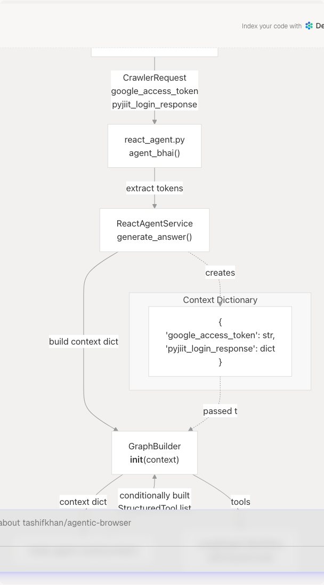
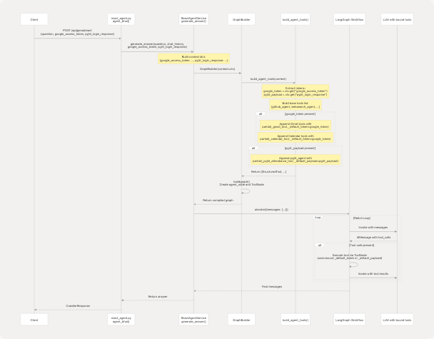

# Dynamic Tool Construction and Context Management

## Purpose and Scope

This document explains the dynamic tool construction system that enables the React Agent to conditionally expose tools based on user authentication context. When a user provides OAuth tokens or session credentials, the agent automatically gains access to protected tools (Gmail, Calendar, PyJIIT) without requiring the user to manage credentials directly.

For information about the overall React Agent architecture and LangGraph orchestration, see [React Agent Architecture](4.1-react-agent-architecture). For details about individual tool implementations, see [Agent Tool System](4.3-agent-tool-system).

**Sources:** [agents/react\_tools.py1-721](https://github.com/tashifkhan/agentic-browser/blob/e94826c4/agents/react_tools.py#L1-L721)

---

## Authentication Context Overview

The system supports two primary authentication contexts that unlock protected tools:

| Context Key | Description | Unlocked Tools | Source |
| --- | --- | --- | --- |
| `google_access_token` | OAuth 2.0 token with Gmail and Calendar scopes | `gmail_agent`, `gmail_send_email`, `gmail_list_unread`, `gmail_mark_read`, `calendar_agent`, `calendar_create_event` | User OAuth flow |
| `pyjiit_login_response` | Encrypted session payload from JIIT Webportal | `pyjiit_agent` | PyJIIT webportal authentication |

These context values are passed from the API request through the service layer to the `build_agent_tools` function, which constructs the appropriate tool set.

**Sources:** [agents/react\_tools.py609-699](https://github.com/tashifkhan/agentic-browser/blob/e94826c4/agents/react_tools.py#L609-L699) [routers/react\_agent.py30-35](https://github.com/tashifkhan/agentic-browser/blob/e94826c4/routers/react_agent.py#L30-L35)

---

## System Architecture: Context Flow



**Diagram: Context Propagation from Request to Tool Binding**

This diagram shows how authentication credentials flow from the HTTP request through the service layer to dynamically construct the tool set. The `build_agent_tools` function receives a context dictionary and returns a customized list of tools.

**Sources:** [routers/react\_agent.py18-36](https://github.com/tashifkhan/agentic-browser/blob/e94826c4/routers/react_agent.py#L18-L36) [agents/react\_agent.py138-152](https://github.com/tashifkhan/agentic-browser/blob/e94826c4/agents/react_agent.py#L138-L152) [agents/react\_tools.py609-699](https://github.com/tashifkhan/agentic-browser/blob/e94826c4/agents/react_tools.py#L609-L699)

---

## The build\_agent\_tools Function

The core of dynamic tool construction is the `build_agent_tools` function at [agents/react\_tools.py609-699](https://github.com/tashifkhan/agentic-browser/blob/e94826c4/agents/react_tools.py#L609-L699) This function implements a three-phase process:

### Phase 1: Context Extraction and Normalization

```
def build_agent_tools(context: Optional[Dict[str, Any]] = None) -> list[StructuredTool]:
    ctx: Dict[str, Any] = dict(context or {})
    google_token = ctx.get("google_access_token") or ctx.get("google_acces_token")
    pyjiit_payload = ctx.get("pyjiit_login_response") or ctx.get("pyjiit_login_responce")
```

The function normalizes common typos in context keys (`google_acces_token`, `pyjiit_login_responce`) to ensure robustness. This handles historical API inconsistencies.

### Phase 2: Base Tool Set Assembly

```
    tools: list[StructuredTool] = [
        github_agent,
        websearch_agent,
        website_agent,
        youtube_agent,
        browser_action_agent,
    ]
```

Five tools are **always available** regardless of authentication:

* `github_agent`: Repository analysis
* `websearch_agent`: Web search via Tavily
* `website_agent`: HTML to Markdown conversion and analysis
* `youtube_agent`: Video transcript extraction and Q&A
* `browser_action_agent`: Browser automation commands

These tools do not require user-specific credentials.

### Phase 3: Conditional Tool Binding

The function conditionally appends authenticated tools using `functools.partial` to bind default credentials.

**Sources:** [agents/react\_tools.py609-699](https://github.com/tashifkhan/agentic-browser/blob/e94826c4/agents/react_tools.py#L609-L699)

---

## Tool Binding with functools.partial

The system uses `functools.partial` to inject authentication credentials into tool functions without modifying their signatures. This preserves the tool's input schema while providing a default credential source.

### Gmail Tool Binding Pattern


**Diagram: functools.partial Binding Mechanism**

When `google_token` is present in context, the system creates new `StructuredTool` instances with partially applied functions:

```
if google_token:
    tools.append(
        StructuredTool(
            name=gmail_agent.name,
            description=gmail_agent.description,
            coroutine=partial(_gmail_tool, _default_token=google_token),
            args_schema=GmailToolInput,
        )
    )
```

The `partial` call binds `_default_token=google_token` as a keyword argument. Inside `_gmail_tool`, the implementation uses fallback logic:

```
async def _gmail_tool(
    access_token: Optional[str] = None,
    max_results: int = 5,
    *,
    _default_token: Optional[str] = None,
) -> str:
    token = access_token or _default_token
    if not token:
        return "Unable to fetch Gmail messages because no Google access token was provided..."
```

**Sources:** [agents/react\_tools.py624-632](https://github.com/tashifkhan/agentic-browser/blob/e94826c4/agents/react_tools.py#L624-L632) [agents/react\_tools.py279-301](https://github.com/tashifkhan/agentic-browser/blob/e94826c4/agents/react_tools.py#L279-L301)

---

## Conditional Tool Availability Matrix

The following table documents which tools are added based on available authentication context:

| Tool Name | Always Available | Requires `google_access_token` | Requires `pyjiit_login_response` | Implementation |
| --- | --- | --- | --- | --- |
| `github_agent` | ✓ |  |  | [agents/react\_tools.py217-230](https://github.com/tashifkhan/agentic-browser/blob/e94826c4/agents/react_tools.py#L217-L230) |
| `websearch_agent` | ✓ |  |  | [agents/react\_tools.py233-247](https://github.com/tashifkhan/agentic-browser/blob/e94826c4/agents/react_tools.py#L233-L247) |
| `website_agent` | ✓ |  |  | [agents/react\_tools.py250-262](https://github.com/tashifkhan/agentic-browser/blob/e94826c4/agents/react_tools.py#L250-L262) |
| `youtube_agent` | ✓ |  |  | [agents/react\_tools.py265-276](https://github.com/tashifkhan/agentic-browser/blob/e94826c4/agents/react_tools.py#L265-L276) |
| `browser_action_agent` | ✓ |  |  | [tools/browser\_use1-999](https://github.com/tashifkhan/agentic-browser/blob/e94826c4/tools/browser_use#L1-L999) |
| `gmail_agent` |  | ✓ |  | [agents/react\_tools.py624-632](https://github.com/tashifkhan/agentic-browser/blob/e94826c4/agents/react_tools.py#L624-L632) |
| `gmail_send_email` |  | ✓ |  | [agents/react\_tools.py633-643](https://github.com/tashifkhan/agentic-browser/blob/e94826c4/agents/react_tools.py#L633-L643) |
| `gmail_list_unread` |  | ✓ |  | [agents/react\_tools.py644-654](https://github.com/tashifkhan/agentic-browser/blob/e94826c4/agents/react_tools.py#L644-L654) |
| `gmail_mark_read` |  | ✓ |  | [agents/react\_tools.py655-665](https://github.com/tashifkhan/agentic-browser/blob/e94826c4/agents/react_tools.py#L655-L665) |
| `calendar_agent` |  | ✓ |  | [agents/react\_tools.py666-673](https://github.com/tashifkhan/agentic-browser/blob/e94826c4/agents/react_tools.py#L666-L673) |
| `calendar_create_event` |  | ✓ |  | [agents/react\_tools.py674-684](https://github.com/tashifkhan/agentic-browser/blob/e94826c4/agents/react_tools.py#L674-L684) |
| `pyjiit_agent` |  |  | ✓ | [agents/react\_tools.py686-697](https://github.com/tashifkhan/agentic-browser/blob/e94826c4/agents/react_tools.py#L686-L697) |

**Sources:** [agents/react\_tools.py609-699](https://github.com/tashifkhan/agentic-browser/blob/e94826c4/agents/react_tools.py#L609-L699)

---

## Google OAuth Tool Binding Details

Six tools depend on Google OAuth tokens with appropriate scopes:


**Diagram: Google OAuth Token Distribution**

Each tool function signature includes `_default_token: Optional[str] = None` as a keyword-only parameter. The `build_agent_tools` function binds this parameter using `partial(_tool_function, _default_token=google_token)`.

The tool implementations all follow this pattern:

1. Accept an optional `access_token` parameter in the input schema
2. Use fallback logic: `token = access_token or _default_token`
3. Return an error message if both are `None`

**Sources:** [agents/react\_tools.py279-301](https://github.com/tashifkhan/agentic-browser/blob/e94826c4/agents/react_tools.py#L279-L301) [agents/react\_tools.py303-331](https://github.com/tashifkhan/agentic-browser/blob/e94826c4/agents/react_tools.py#L303-L331) [agents/react\_tools.py334-355](https://github.com/tashifkhan/agentic-browser/blob/e94826c4/agents/react_tools.py#L334-L355) [agents/react\_tools.py358-375](https://github.com/tashifkhan/agentic-browser/blob/e94826c4/agents/react_tools.py#L358-L375) [agents/react\_tools.py378-399](https://github.com/tashifkhan/agentic-browser/blob/e94826c4/agents/react_tools.py#L378-L399) [agents/react\_tools.py402-435](https://github.com/tashifkhan/agentic-browser/blob/e94826c4/agents/react_tools.py#L402-L435)

---

## PyJIIT Session Tool Binding

The PyJIIT tool requires a more complex session payload containing encrypted authentication data:

```
if pyjiit_payload:
    tools.append(
        StructuredTool(
            name=pyjiit_agent.name,
            description=pyjiit_agent.description,
            coroutine=partial(
                _pyjiit_attendance_tool,
                _default_payload=pyjiit_payload,
            ),
            args_schema=PyjiitAttendanceInput,
        )
    )
```

The `_pyjiit_attendance_tool` function at [agents/react\_tools.py438-521](https://github.com/tashifkhan/agentic-browser/blob/e94826c4/agents/react_tools.py#L438-L521) implements:

1. Payload extraction and normalization (handles nested `session_payload` and `raw_response` keys)
2. `WebportalSession` construction from the encrypted payload
3. Hardcoded semester ID mapping (e.g., `"2025ODDSEM" -> "JIRUM25030000001"`)
4. Attendance data fetching and processing

**Sources:** [agents/react\_tools.py686-697](https://github.com/tashifkhan/agentic-browser/blob/e94826c4/agents/react_tools.py#L686-L697) [agents/react\_tools.py438-521](https://github.com/tashifkhan/agentic-browser/blob/e94826c4/agents/react_tools.py#L438-L521)

---

## Error Handling for Missing Credentials

When tools are invoked without required credentials, they return user-friendly error messages instead of raising exceptions:

### Gmail Tool Error Response

```
async def _gmail_tool(
    access_token: Optional[str] = None,
    max_results: int = 5,
    *,
    _default_token: Optional[str] = None,
) -> str:
    token = access_token or _default_token
    if not token:
        return (
            "Unable to fetch Gmail messages because no Google access token was provided. "
            "Provide 'google_access_token' or include it in the tool call."
        )
```

### PyJIIT Tool Error Response

```
async def _pyjiit_attendance_tool(
    registration_code: Optional[str] = None,
    session_payload: Optional[Dict[str, Any]] = None,
    *,
    _default_payload: Optional[Dict[str, Any]] = None,
) -> str:
    payload = session_payload or _default_payload
    if not payload:
        return (
            "Unable to fetch attendance because no PyJIIT login session was provided. "
            "The user must be logged in to access attendance data."
        )
```

These error messages are returned as tool output, allowing the LLM to:

1. Understand that authentication is required
2. Inform the user appropriately
3. Continue the conversation without crashing

**Sources:** [agents/react\_tools.py285-290](https://github.com/tashifkhan/agentic-browser/blob/e94826c4/agents/react_tools.py#L285-L290) [agents/react\_tools.py444-449](https://github.com/tashifkhan/agentic-browser/blob/e94826c4/agents/react_tools.py#L444-L449)

---

## Integration with GraphBuilder

The `GraphBuilder` class at [agents/react\_agent.py138-175](https://github.com/tashifkhan/agentic-browser/blob/e94826c4/agents/react_agent.py#L138-L175) uses `build_agent_tools` to construct the tool set before compiling the LangGraph workflow:

```
class GraphBuilder:
    def __init__(
        self,
        tools: Sequence[StructuredTool] | None = None,
        context: dict[str, Any] | None = None,
    ) -> None:
        if tools is not None:
            self.tools = list(tools)
        elif context:
            self.tools = build_agent_tools(context)
        else:
            self.tools = list(AGENT_TOOLS)
        self._compiled: Any | None = None
```

The constructor accepts either:

* An explicit `tools` list (for custom tool sets)
* A `context` dictionary (delegates to `build_agent_tools`)
* Neither (defaults to `AGENT_TOOLS`, which is `build_agent_tools()` with no context)

The compiled graph binds these tools to the LLM using `_llm.bind_tools(list(tools))` at [agents/react\_agent.py126](https://github.com/tashifkhan/agentic-browser/blob/e94826c4/agents/react_agent.py#L126-L126)

**Sources:** [agents/react\_agent.py138-175](https://github.com/tashifkhan/agentic-browser/blob/e94826c4/agents/react_agent.py#L138-L175)

---

## Complete Context Flow Sequence



**Diagram: Complete Authentication Context Flow Sequence**

This sequence demonstrates how authentication credentials flow from the HTTP request through the service layer, enabling dynamic tool construction, and ultimately being available to tool execution during the ReAct loop.

**Sources:** [routers/react\_agent.py18-36](https://github.com/tashifkhan/agentic-browser/blob/e94826c4/routers/react_agent.py#L18-L36) [agents/react\_agent.py138-175](https://github.com/tashifkhan/agentic-browser/blob/e94826c4/agents/react_agent.py#L138-L175) [agents/react\_tools.py609-699](https://github.com/tashifkhan/agentic-browser/blob/e94826c4/agents/react_tools.py#L609-L699)

---

## Key Design Patterns

### Pattern 1: Keyword-Only Default Parameters

Tool functions use keyword-only parameters (after `*`) for default credentials:

```
async def _gmail_tool(
    access_token: Optional[str] = None,
    max_results: int = 5,
    *,  # Forces keyword-only parameters after this
    _default_token: Optional[str] = None,
) -> str:
```

This prevents accidental positional argument passing and clearly separates user-provided parameters from injected defaults.

### Pattern 2: Fallback Chain

```
token = access_token or _default_token
if not token:
    return "Error message explaining missing credentials..."
```

Tools check both the explicit parameter (from tool call arguments) and the injected default, allowing the LLM to optionally override the default token.

### Pattern 3: New StructuredTool Instance

Rather than modifying existing tool objects, `build_agent_tools` creates **new** `StructuredTool` instances:

```
tools.append(
    StructuredTool(
        name=gmail_agent.name,  # Reuse metadata
        description=gmail_agent.description,
        coroutine=partial(_gmail_tool, _default_token=google_token),  # New coroutine
        args_schema=GmailToolInput,  # Same schema
    )
)
```

This ensures thread-safety and allows multiple concurrent agent instances with different credentials.

**Sources:** [agents/react\_tools.py279-301](https://github.com/tashifkhan/agentic-browser/blob/e94826c4/agents/react_tools.py#L279-L301) [agents/react\_tools.py624-632](https://github.com/tashifkhan/agentic-browser/blob/e94826c4/agents/react_tools.py#L624-L632)

---

## Default AGENT\_TOOLS Constant

The module exports a default tool list at [agents/react\_tools.py702](https://github.com/tashifkhan/agentic-browser/blob/e94826c4/agents/react_tools.py#L702-L702):

```
AGENT_TOOLS = build_agent_tools()
```

This is called with no context, producing the base five tools (GitHub, web search, website, YouTube, browser). The default system prompt at [agents/react\_agent.py25-34](https://github.com/tashifkhan/agentic-browser/blob/e94826c4/agents/react_agent.py#L25-L34) instructs the LLM:

> "Credentials such as Google access tokens and PyJIIT login sessions are provided automatically; never request them from the user."

This ensures the LLM understands that authenticated tools may become available mid-conversation without explicit credential handling.

**Sources:** [agents/react\_tools.py702](https://github.com/tashifkhan/agentic-browser/blob/e94826c4/agents/react_tools.py#L702-L702) [agents/react\_agent.py25-34](https://github.com/tashifkhan/agentic-browser/blob/e94826c4/agents/react_agent.py#L25-L34)
