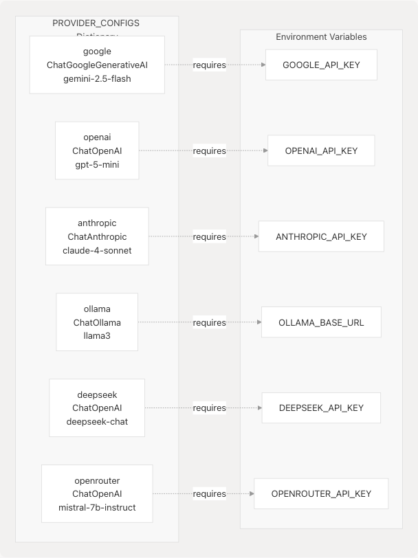
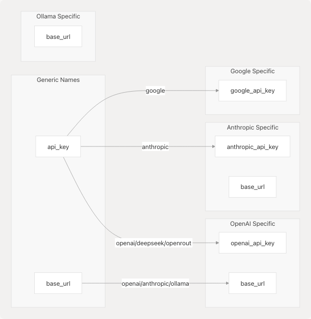
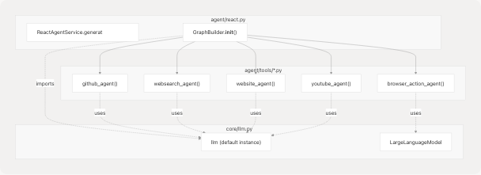

# LLM Integration Layer

Relevant source files

* [core/\_\_init\_\_.py](https://github.com/tashifkhan/agentic-browser/blob/e94826c4/core/__init__.py)
* [core/llm.py](https://github.com/tashifkhan/agentic-browser/blob/e94826c4/core/llm.py)

## Purpose and Scope

The LLM Integration Layer provides a unified, model-agnostic abstraction for interacting with multiple Large Language Model providers. This layer enables the Agentic Browser to seamlessly switch between different LLM providers (Google Gemini, OpenAI, Anthropic Claude, Ollama, Deepseek, OpenRouter) without modifying application code. It wraps LangChain chat model adapters and manages provider-specific configuration, API key handling, and parameter mapping.

This document covers the `LargeLanguageModel` class and the `PROVIDER_CONFIGS` registry. For environment variable configuration details, see [Configuration and Environment Variables](/tashifkhan/agentic-browser/2.2-configuration-and-environment-variables). For usage within agent systems, see [React Agent Architecture](/tashifkhan/agentic-browser/4.1-react-agent-architecture) and [Browser Use Agent](/tashifkhan/agentic-browser/4.2-browser-use-agent-and-script-generation).

**Sources:** [core/llm.py1-215](https://github.com/tashifkhan/agentic-browser/blob/e94826c4/core/llm.py#L1-L215)

---

## Architecture Overview

The LLM Integration Layer implements a provider abstraction pattern that decouples application logic from LLM provider implementations. The architecture consists of three key components:

1. **Provider Configuration Registry** (`PROVIDER_CONFIGS`): A dictionary mapping provider names to their LangChain adapter classes, API key requirements, default models, and parameter mappings
2. **Abstraction Class** (`LargeLanguageModel`): A wrapper that instantiates the appropriate LangChain chat model based on provider selection
3. **LangChain Adapters**: Provider-specific chat model implementations (`ChatGoogleGenerativeAI`, `ChatOpenAI`, `ChatAnthropic`, `ChatOllama`)


```

**Sources:** [core/llm.py1-215](https://github.com/tashifkhan/agentic-browser/blob/e94826c4/core/llm.py#L1-L215)

---

## Provider Configuration System

The `PROVIDER_CONFIGS` dictionary serves as the central registry for all supported LLM providers. Each provider entry defines the LangChain adapter class, API key environment variable, default model, and parameter name mappings.

### PROVIDER\_CONFIGS Structure

| Field | Type | Description |
| --- | --- | --- |
| `class` | `Type[BaseChatModel]` | LangChain chat model class to instantiate |
| `api_key_env` | `str | None` | Environment variable name for API key |
| `base_url_env` | `str | None` | Environment variable name for base URL (optional) |
| `base_url_override` | `str | None` | Hardcoded base URL override (for OpenAI-compatible APIs) |
| `default_model` | `str` | Default model identifier |
| `param_map` | `dict[str, str]` | Mapping from standard parameter names to provider-specific names |

### Supported Providers

```

```

#### Google Provider

```
```
"google": {
    "class": ChatGoogleGenerativeAI,
    "api_key_env": "GOOGLE_API_KEY",
    "default_model": "gemini-2.5-flash",
    "param_map": {"api_key": "google_api_key"},
}
```
```

Uses the native Google Gemini adapter with parameter name `google_api_key`.

**Sources:** [core/llm.py22-27](https://github.com/tashifkhan/agentic-browser/blob/e94826c4/core/llm.py#L22-L27)

#### OpenAI Provider

```
```
"openai": {
    "class": ChatOpenAI,
    "api_key_env": "OPENAI_API_KEY",
    "default_model": "gpt-5-mini",
    "param_map": {
        "api_key": "openai_api_key",
        "base_url": "base_url",
    },
}
```
```

Standard OpenAI implementation supporting custom base URLs.

**Sources:** [core/llm.py28-36](https://github.com/tashifkhan/agentic-browser/blob/e94826c4/core/llm.py#L28-L36)

#### Anthropic Provider

```
```
"anthropic": {
    "class": ChatAnthropic,
    "api_key_env": "ANTHROPIC_API_KEY",
    "default_model": "claude-4-sonnet",
    "param_map": {
        "api_key": "anthropic_api_key",
        "base_url": "base_url",
    },
}
```
```

Anthropic Claude integration with support for custom endpoints.

**Sources:** [core/llm.py37-45](https://github.com/tashifkhan/agentic-browser/blob/e94826c4/core/llm.py#L37-L45)

#### Ollama Provider

```
```
"ollama": {
    "class": ChatOllama,
    "api_key_env": None,
    "base_url_env": "OLLAMA_BASE_URL",
    "default_model": "llama3",
    "param_map": {
        "base_url": "base_url",
    },
}
```
```

Local Ollama deployment support. No API key required; only base URL configuration needed.

**Sources:** [core/llm.py46-54](https://github.com/tashifkhan/agentic-browser/blob/e94826c4/core/llm.py#L46-L54)

#### Deepseek Provider

```
```
"deepseek": {
    "class": ChatOpenAI,
    "api_key_env": "DEEPSEEK_API_KEY",
    "base_url_override": "https://api.deepseek.com/v1",
    "default_model": "deepseek-chat",
    "param_map": {
        "api_key": "openai_api_key",
        "base_url": "base_url",
    },
}
```
```

Leverages OpenAI API compatibility by reusing `ChatOpenAI` adapter with hardcoded base URL override.

**Sources:** [core/llm.py55-64](https://github.com/tashifkhan/agentic-browser/blob/e94826c4/core/llm.py#L55-L64)

#### OpenRouter Provider

```
```
"openrouter": {
    "class": ChatOpenAI,
    "api_key_env": "OPENROUTER_API_KEY",
    "base_url_override": "https://openrouter.ai/api/v1",
    "default_model": "mistralai/mistral-7b-instruct",
    "param_map": {
        "api_key": "openai_api_key",
        "base_url": "base_url",
    },
}
```
```

OpenRouter gateway supporting multiple models through OpenAI-compatible API.

**Sources:** [core/llm.py65-74](https://github.com/tashifkhan/agentic-browser/blob/e94826c4/core/llm.py#L65-L74)

---

## LargeLanguageModel Class

The `LargeLanguageModel` class is the primary interface for LLM interactions. It handles provider selection, configuration resolution, credential management, and client instantiation.

### Class Signature

```
```
class LargeLanguageModel:
    def __init__(
        self,
        model_name: str | None = "gemini-2.5-flash",
        api_key: str = google_api_key,
        provider: Literal[
            "google",
            "openai",
            "anthropic",
            "ollama",
            "deepseek",
            "openrouter",
        ] = "google",
        base_url: str | None = None,
        temperature: float = 0.4,
        **kwargs: Any,
    ):
        # Implementation details...
```
```

**Sources:** [core/llm.py78-94](https://github.com/tashifkhan/agentic-browser/blob/e94826c4/core/llm.py#L78-L94)

### Initialization Parameters

| Parameter | Type | Default | Description |
| --- | --- | --- | --- |
| `model_name` | `str | None` | `"gemini-2.5-flash"` | Model identifier (uses provider's default if `None`) |
| `api_key` | `str` | `google_api_key` | API key (can be overridden by environment variable) |
| `provider` | `Literal[...]` | `"google"` | Provider selection from supported list |
| `base_url` | `str | None` | `None` | Custom base URL for API endpoint |
| `temperature` | `float` | `0.4` | Sampling temperature for generation |
| `**kwargs` | `Any` | - | Additional provider-specific parameters |

### Initialization Flow

```

```

**Sources:** [core/llm.py95-169](https://github.com/tashifkhan/agentic-browser/blob/e94826c4/core/llm.py#L95-L169)

### Configuration Resolution Logic

The initialization process follows this precedence order:

1. **Provider Validation**: Checks if `provider` exists in `PROVIDER_CONFIGS` [core/llm.py98-105](https://github.com/tashifkhan/agentic-browser/blob/e94826c4/core/llm.py#L98-L105)
2. **Model Name Resolution**: Uses provided `model_name` or falls back to `config["default_model"]` [core/llm.py108-113](https://github.com/tashifkhan/agentic-browser/blob/e94826c4/core/llm.py#L108-L113)
3. **API Key Resolution**:
   * Uses provided `api_key` parameter
   * Falls back to environment variable specified in `config["api_key_env"]`
   * Raises `ValueError` if required but not found [core/llm.py121-129](https://github.com/tashifkhan/agentic-browser/blob/e94826c4/core/llm.py#L121-L129)
4. **Base URL Resolution**:
   * Uses provided `base_url` parameter
   * Falls back to `config["base_url_override"]` (hardcoded)
   * Falls back to environment variable from `config["base_url_env"]`
   * Raises `ValueError` if required but not found [core/llm.py136-155](https://github.com/tashifkhan/agentic-browser/blob/e94826c4/core/llm.py#L136-L155)
5. **Parameter Mapping**: Maps generic parameter names to provider-specific names using `config["param_map"]` [core/llm.py128-149](https://github.com/tashifkhan/agentic-browser/blob/e94826c4/core/llm.py#L128-L149)

**Sources:** [core/llm.py95-169](https://github.com/tashifkhan/agentic-browser/blob/e94826c4/core/llm.py#L95-L169)

---

## Methods

### generate\_text()

Primary method for text generation with optional system message support.

```
```
def generate_text(
    self,
    prompt: str,
    system_message: str | None = None,
) -> str:
    messages: list[BaseMessage] = []
    if system_message:
        messages.append(SystemMessage(content=system_message))

    messages.append(HumanMessage(content=prompt))

    try:
        response = self.client.invoke(messages)
        return str(response.content)

    except Exception as e:
        raise RuntimeError(
            f"Error generating text with {self.provider} ({self.model_name}): {e}"
        )
```
```

**Parameters:**

* `prompt` (`str`): User message to send to the LLM
* `system_message` (`str | None`): Optional system prompt for context

**Returns:** Generated text content as string

**Raises:** `RuntimeError` if generation fails

**Sources:** [core/llm.py171-190](https://github.com/tashifkhan/agentic-browser/blob/e94826c4/core/llm.py#L171-L190)

### summarize\_text()

Placeholder method for text summarization (currently returns truncated text).

```
```
def summarize_text(self, text: str) -> str:
    return f"Summary of the text: {text[:50]}..."
```
```

**Sources:** [core/llm.py192-193](https://github.com/tashifkhan/agentic-browser/blob/e94826c4/core/llm.py#L192-L193)

---

## Default LLM Instance

The module provides a pre-initialized default LLM instance for convenience:

```
```
# Initialize default LLM instance for application use
try:
    _model = LargeLanguageModel()
    llm = _model.client
except Exception as e:
    print(f"Failed to initialize default LLM: {e}")
    raise e
```
```

This creates:

* `_model`: Complete `LargeLanguageModel` wrapper instance
* `llm`: Direct reference to the underlying LangChain chat model client

The default instance uses:

* Provider: `"google"`
* Model: `"gemini-2.5-flash"`
* API Key: From `google_api_key` (imported from `core.config`)
* Temperature: `0.4`

This `llm` client is imported by various modules for direct LangChain integration, particularly in agent tools and services.

**Sources:** [core/llm.py197-205](https://github.com/tashifkhan/agentic-browser/blob/e94826c4/core/llm.py#L197-L205)

---

## Parameter Mapping System

The `param_map` dictionary in each provider config translates generic parameter names to provider-specific parameter names. This abstraction allows the `LargeLanguageModel` class to use consistent naming while adapting to different LangChain adapter APIs.

### Common Mappings

```

```

### Example: OpenAI-Compatible Providers

Both Deepseek and OpenRouter reuse the `ChatOpenAI` adapter class but map to different base URLs:

```
```
# Deepseek configuration
"deepseek": {
    "class": ChatOpenAI,  # Reuse OpenAI adapter
    "base_url_override": "https://api.deepseek.com/v1",
    "param_map": {
        "api_key": "openai_api_key",  # Maps to openai_api_key parameter
        "base_url": "base_url",
    },
}

# OpenRouter configuration
"openrouter": {
    "class": ChatOpenAI,  # Reuse OpenAI adapter
    "base_url_override": "https://openrouter.ai/api/v1",
    "param_map": {
        "api_key": "openai_api_key",
        "base_url": "base_url",
    },
}
```
```

This demonstrates the extensibility of the system: any OpenAI-compatible API can be integrated by adding a new provider config with a `base_url_override`.

**Sources:** [core/llm.py55-74](https://github.com/tashifkhan/agentic-browser/blob/e94826c4/core/llm.py#L55-L74)

---

## Usage Patterns

### Basic Instantiation

```
```
from core.llm import LargeLanguageModel

# Use default Google Gemini
llm = LargeLanguageModel()

# Specify provider and model
llm = LargeLanguageModel(
    provider="anthropic",
    model_name="claude-4-sonnet",
    temperature=0.7
)

# Use local Ollama
llm = LargeLanguageModel(
    provider="ollama",
    model_name="llama3",
    base_url="http://localhost:11434"
)
```
```

### Integration with LangChain

The `.client` attribute exposes the underlying LangChain `BaseChatModel` for direct use in LangChain workflows:

```
```
from core.llm import LargeLanguageModel
from langchain_core.messages import HumanMessage

llm = LargeLanguageModel(provider="openai", model_name="gpt-4")
messages = [HumanMessage(content="Explain quantum computing")]
response = llm.client.invoke(messages)
```
```

### Usage in React Agent

```

```

Agent tools import the default `llm` instance directly:

```
```
from core.llm import llm

@tool
def github_agent(repo_url: str, question: str) -> str:
    # ... code ...
    result = llm.invoke(messages)
    # ... code ...
```
```

**Sources:** [core/llm.py197-205](https://github.com/tashifkhan/agentic-browser/blob/e94826c4/core/llm.py#L197-L205)

### Usage in Browser Use Agent

The Browser Use Agent creates custom instances for script generation:

```
```
from core.llm import LargeLanguageModel

async def generate_script(request: GenerateScriptRequest):
    llm = LargeLanguageModel(
        model_name=request.model_name or "gemini-2.0-flash-exp",
        provider="google",
        temperature=0.3,
    )
    response = llm.generate_text(
        prompt=script_generation_prompt,
        system_message=system_instructions
    )
```
```

**Sources:** [core/llm.py78-190](https://github.com/tashifkhan/agentic-browser/blob/e94826c4/core/llm.py#L78-L190)

---

## Error Handling

The `LargeLanguageModel` class implements comprehensive error handling at multiple stages:

### Initialization Errors

| Error Type | Trigger Condition | Error Message Pattern |
| --- | --- | --- |
| `ValueError` | Invalid provider name | `"Unsupported LLM provider: '{provider}'. Please choose from..."` |
| `ValueError` | No model name provided or found | `"No model_name provided and no default_model set for '{provider}'."` |
| `ValueError` | Required API key missing | `"API key for '{provider}' not found. Please provide it directly or set the '{env_var}' environment variable."` |
| `ValueError` | Required base URL missing | `"Base URL for '{provider}' not found. Please provide it directly or set the '{env_var}' environment variable."` |
| `RuntimeError` | LangChain adapter instantiation fails | `"Failed to initialize LLM for '{provider}' with model '{model_name}'. Details: {e}..."` |

**Sources:** [core/llm.py101-169](https://github.com/tashifkhan/agentic-browser/blob/e94826c4/core/llm.py#L101-L169)

### Runtime Errors

```
```
def generate_text(self, prompt: str, system_message: str | None = None) -> str:
    try:
        response = self.client.invoke(messages)
        return str(response.content)
    except Exception as e:
        raise RuntimeError(
            f"Error generating text with {self.provider} ({self.model_name}): {e}"
        )
```
```

All generation errors are wrapped in `RuntimeError` with context about the provider and model being used.

**Sources:** [core/llm.py183-190](https://github.com/tashifkhan/agentic-browser/blob/e94826c4/core/llm.py#L183-L190)

---

## Configuration Dependencies

The LLM Integration Layer depends on environment variables and configuration from `core.config`:

```
```
from .config import google_api_key
```
```

The module imports `google_api_key` which is read from the `GOOGLE_API_KEY` environment variable in the config module. This serves as the default API key when no explicit key is provided.

For detailed environment variable configuration, see [Configuration and Environment Variables](/tashifkhan/agentic-browser/2.2-configuration-and-environment-variables).

**Sources:** [core/llm.py2](https://github.com/tashifkhan/agentic-browser/blob/e94826c4/core/llm.py#L2-L2) [core/\_\_init\_\_.py1-15](https://github.com/tashifkhan/agentic-browser/blob/e94826c4/core/__init__.py#L1-L15)

---

## Extension Points

### Adding New Providers

To add support for a new LLM provider:

1. **Add LangChain adapter dependency** to `pyproject.toml`
2. **Import adapter class** in `core/llm.py`
3. **Register in PROVIDER\_CONFIGS**:

   ```
   ```
   "new_provider": {
       "class": ChatNewProvider,
       "api_key_env": "NEW_PROVIDER_API_KEY",
       "default_model": "model-name",
       "param_map": {
           "api_key": "provider_specific_key_param",
       },
   }
   ```
   ```
4. **Update type hints** in `provider` parameter Literal type
5. **Add environment variable** to `.env.example`

### OpenAI-Compatible API Integration

For APIs following OpenAI specifications (like Deepseek, OpenRouter):

```
```
"custom_provider": {
    "class": ChatOpenAI,  # Reuse OpenAI adapter
    "api_key_env": "CUSTOM_API_KEY",
    "base_url_override": "https://api.custom-provider.com/v1",
    "default_model": "custom-model-name",
    "param_map": {
        "api_key": "openai_api_key",
        "base_url": "base_url",
    },
}
```
```

**Sources:** [core/llm.py21-75](https://github.com/tashifkhan/agentic-browser/blob/e94826c4/core/llm.py#L21-L75)

---

## Testing and Validation

The module includes a `__main__` block for basic testing:

```
```
if __name__ == "__main__":
    llm = LargeLanguageModel(
        model_name="gemini-2.5-flash",
        provider="google",
        temperature=0.3,
    )
    response = llm.generate_text("Hello, how are you?")
    print(response)
```

This validates:

* Provider initialization
* Configuration resolution
* Basic text generation
* Response handling

**Sources:** [core/llm.py207-214](https://github.com/tashifkhan/agentic-browser/blob/e94826c4/core/llm.py#L207-L214)

---

## Key Design Principles

1. **Provider Agnosticism**: Application code remains independent of LLM provider implementation details
2. **Configuration-Driven**: All provider-specific logic is data-driven through `PROVIDER_CONFIGS`
3. **Graceful Degradation**: Clear error messages guide users to fix configuration issues
4. **LangChain Integration**: Seamless compatibility with LangChain's ecosystem
5. **Extensibility**: New providers can be added without modifying core logic
6. **Type Safety**: Type hints and Literal types prevent invalid provider selection at development time
7. **Credential Management**: Secure handling of API keys through environment variables with fallback support

**Sources:** [core/llm.py1-215](https://github.com/tashifkhan/agentic-browser/blob/e94826c4/core/llm.py#L1-L215)