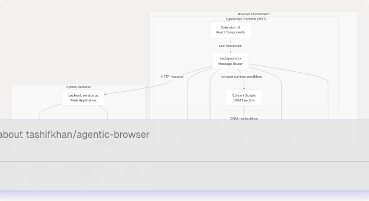
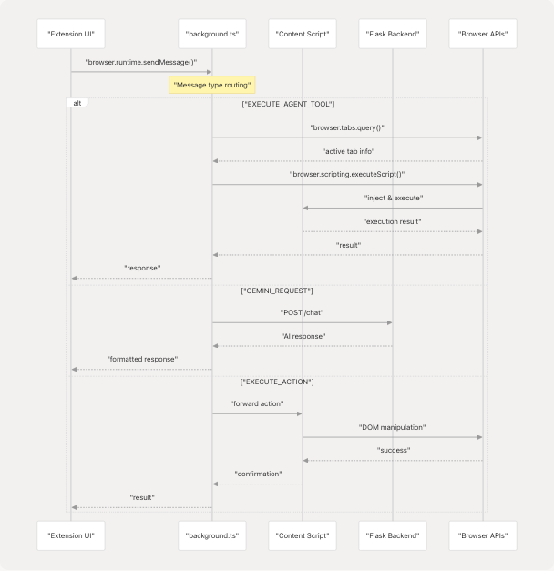
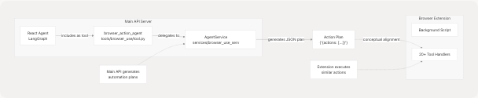
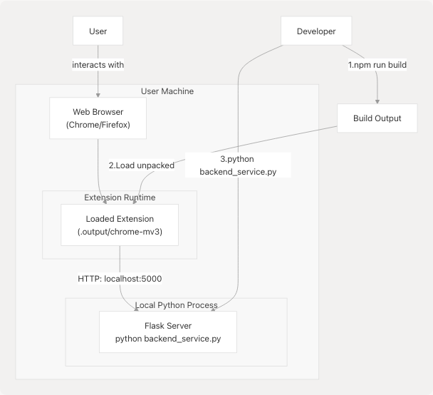

# Extension Architecture Overview

## Purpose and Scope

This document provides an architectural overview of the browser extension component of the Agentic Browser system. The extension operates as a standalone subsystem that provides frontend browser automation capabilities through a TypeScript-based browser extension (built with WXT framework) paired with a Python Flask backend service.

The extension enables users to perform AI-assisted browser automation directly from the browser UI, independent of the main API server. For detailed information about specific components:

* Background script message handling: see [5.2](/tashifkhan/agentic-browser/5.2-background-script-and-message-handling)
* Browser automation tool implementations: see [5.3](/tashifkhan/agentic-browser/5.3-browser-automation-tools)
* Flask backend service details: see [5.4](/tashifkhan/agentic-browser/5.4-extension-backend-service)

This page focuses on the overall architecture, component relationships, and how the extension integrates with the broader Agentic Browser ecosystem.

## High-Level Component Architecture

The browser extension follows a three-tier architecture: a TypeScript frontend running in the browser, a message-passing system for inter-component communication, and a Python Flask backend providing AI and authentication services.


```

**Sources:** High-level system diagrams (Diagram 4: Browser Extension System)

## Frontend Architecture (TypeScript/WXT)

The extension frontend is built using the WXT framework, which provides a modern development experience for cross-browser extensions. The architecture consists of three primary components:

### Background Script

The background script ([extension/background.ts](https://github.com/tashifkhan/agentic-browser/blob/e94826c4/extension/background.ts)) serves as the central message router and orchestrator for the extension. It runs persistently in the browser's background context and handles:

* **Message Dispatching**: Routes incoming messages from the UI to appropriate handlers
* **Browser API Coordination**: Manages interactions with `browser.tabs`, `browser.scripting`, and `browser.storage` APIs
* **Agent Tool Execution**: Dispatches execution requests to specialized tool handlers
* **State Management**: Maintains extension-wide state using browser storage APIs

The background script processes six primary message types:

* `EXECUTE_AGENT_TOOL`: Execute specific browser automation tools
* `ACTIVATE_AI_FRAME`: Enable AI assistant UI overlay
* `GET_ACTIVE_TAB`: Retrieve current tab information
* `EXECUTE_ACTION`: Execute DOM manipulation actions
* `GEMINI_REQUEST`: Forward requests to Flask backend
* `RUN_GENERATED_AGENT`: Execute generated automation scripts

### Content Scripts

Content scripts ([extension/content/](https://github.com/tashifkhan/agentic-browser/blob/e94826c4/extension/content/)) are injected into web pages and provide the bridge between the background script and the DOM. They:

* **DOM Access**: Execute JavaScript in the context of web pages
* **Element Manipulation**: Perform clicks, form fills, and other DOM operations
* **Page Information Extraction**: Retrieve page content, URLs, and structural information
* **Security Boundary**: Operate with restricted permissions for safe execution

Content scripts are injected dynamically using `browser.scripting.executeScript` to maintain security and avoid persistent injection overhead.

### UI Layer

The extension UI ([extension/entrypoints/](https://github.com/tashifkhan/agentic-browser/blob/e94826c4/extension/entrypoints/)) is built with React and provides:

* **User Interface**: Extension popup and side panels
* **User Input Collection**: Forms for goals, constraints, and configuration
* **Result Display**: Visualization of automation results and agent responses
* **Settings Management**: Configuration for API keys and preferences

**Sources:** High-level system diagrams (Diagram 4), [extension/.gitignore1-27](https://github.com/tashifkhan/agentic-browser/blob/e94826c4/extension/.gitignore#L1-L27)

## Backend Service Architecture (Python/Flask)

The Python Flask backend ([extension/backend\_service.py](https://github.com/tashifkhan/agentic-browser/blob/e94826c4/extension/backend_service.py)) operates independently from the main API server and provides specialized services for the extension:


### Key Responsibilities

| Component | Purpose | Dependencies |
| --- | --- | --- |
| `/chat` endpoint | Process natural language queries using Gemini | `GEMINI_API_KEY` environment variable |
| `/auth/google/*` | Google OAuth flow for Gmail/Calendar access | Google OAuth 2.0 credentials |
| `/auth/github/*` | GitHub OAuth flow for repository access | GitHub OAuth credentials |
| API Key Management | Secure storage and validation of API keys | Flask session management |

The backend runs as a separate process from the main API server, typically on a different port (e.g., `http://localhost:5000`). This separation provides:

* **Independent Deployment**: Extension backend can run without the main API server
* **Simplified Authentication**: Direct API key management without complex token systems
* **Resource Isolation**: Extension operations don't impact main server performance
* **Security Boundary**: Separate security context for browser-specific operations

**Sources:** High-level system diagrams (Diagram 4), [extension/backend\_service.py](https://github.com/tashifkhan/agentic-browser/blob/e94826c4/extension/backend_service.py) (inferred)

## Message Passing System

The extension uses Chrome's message passing API (`browser.runtime.sendMessage`) to enable communication between components. The message flow follows a request-response pattern:



### Message Type Taxonomy

| Message Type | Handler Location | Purpose |
| --- | --- | --- |
| `EXECUTE_AGENT_TOOL` | Background Script | Execute browser automation tools (20+ handlers) |
| `ACTIVATE_AI_FRAME` | Background Script | Toggle AI assistant overlay |
| `GET_ACTIVE_TAB` | Background Script | Retrieve current tab metadata |
| `EXECUTE_ACTION` | Content Script | Perform DOM operations |
| `GEMINI_REQUEST` | Flask Backend | Process AI queries |
| `RUN_GENERATED_AGENT` | Background Script | Execute generated automation scripts |

**Sources:** High-level system diagrams (Diagram 4: Browser Extension System)

## Integration with Main System

While the extension operates independently, it shares conceptual alignment with the main Agentic Browser system through the `browser_action_agent` tool:



The `browser_action_agent` tool ([tools/browser\_use/tool.py43-48](https://github.com/tashifkhan/agentic-browser/blob/e94826c4/tools/browser_use/tool.py#L43-L48)) in the main API system generates structured action plans that conceptually align with the tool handlers implemented in the extension:

* **Main API**: Generates JSON action plans using LLM reasoning
* **Extension**: Executes actions directly in the browser
* **Shared Vocabulary**: Both use similar action types (click, type, navigate, fill\_form, etc.)

However, these systems operate independently:

* The extension does not consume action plans from the main API
* The extension has its own Flask backend for AI operations
* Tool handlers in the extension are independently implemented

**Sources:** [tools/browser\_use/tool.py1-49](https://github.com/tashifkhan/agentic-browser/blob/e94826c4/tools/browser_use/tool.py#L1-L49) [tools/browser\_use/\_\_init\_\_.py1-4](https://github.com/tashifkhan/agentic-browser/blob/e94826c4/tools/browser_use/__init__.py#L1-L4)

## Technology Stack

### Frontend Stack

| Technology | Purpose | Version/Details |
| --- | --- | --- |
| **WXT Framework** | Browser extension development framework | Modern, TypeScript-first |
| **TypeScript** | Type-safe JavaScript | Strict mode enabled |
| **React** | UI component framework | For extension popup/panels |
| **Browser APIs** | Native browser functionality | WebExtensions API (Chrome/Firefox compatible) |

### Backend Stack

| Technology | Purpose | Configuration |
| --- | --- | --- |
| **Python** | Backend runtime | 3.10+ |
| **Flask** | Web framework | Lightweight HTTP server |
| **Google Generative AI** | LLM integration | Gemini API client |
| **Requests** | HTTP client | For OAuth flows |

### Build and Development

The extension uses modern JavaScript tooling:

* **Package Manager**: npm/pnpm
* **Build Output**: `.output` directory ([extension/.gitignore11](https://github.com/tashifkhan/agentic-browser/blob/e94826c4/extension/.gitignore#L11-L11))
* **Development Server**: WXT dev server with hot reload
* **Build Artifacts**: `.wxt` directory ([extension/.gitignore14](https://github.com/tashifkhan/agentic-browser/blob/e94826c4/extension/.gitignore#L14-L14))
* **Configuration**: `web-ext.config.ts` ([extension/.gitignore15](https://github.com/tashifkhan/agentic-browser/blob/e94826c4/extension/.gitignore#L15-L15))

**Sources:** [extension/.gitignore1-27](https://github.com/tashifkhan/agentic-browser/blob/e94826c4/extension/.gitignore#L1-L27)

## Deployment Model

The extension follows a two-process deployment model:

```


**Installation Steps:**

1. **Build Extension**: Run `npm run build` to compile TypeScript and bundle extension
2. **Load Extension**: Load unpacked extension from `.output/chrome-mv3` in browser
3. **Start Backend**: Run `python extension/backend_service.py` to start Flask server
4. **Configure**: Set API keys in extension settings or environment variables

This deployment model allows:

* **Development Mode**: Hot reload with `npm run dev`
* **Production Mode**: Optimized build with minification
* **Cross-Browser Support**: Separate builds for Chrome and Firefox
* **Backend Flexibility**: Flask backend can run on any port/host

**Sources:** [extension/.gitignore11-15](https://github.com/tashifkhan/agentic-browser/blob/e94826c4/extension/.gitignore#L11-L15)

## Security Considerations

The extension implements several security boundaries:

| Security Layer | Implementation | Purpose |
| --- | --- | --- |
| **Content Security Policy** | Manifest restrictions | Limit script execution sources |
| **Message Validation** | Type checking in background.ts | Prevent malicious message injection |
| **API Key Storage** | Browser storage API (encrypted) | Secure credential management |
| **OAuth Flows** | Server-side token exchange | Avoid exposing client secrets |
| **Script Injection** | `browser.scripting.executeScript` | Controlled DOM access |
| **CORS Policies** | Flask backend configuration | Restrict cross-origin requests |

The separation between frontend (browser context) and backend (local server) provides defense in depth: even if the extension is compromised, API keys in the Flask backend remain protected by operating system security boundaries.

**Sources:** High-level system diagrams (Diagram 4)
