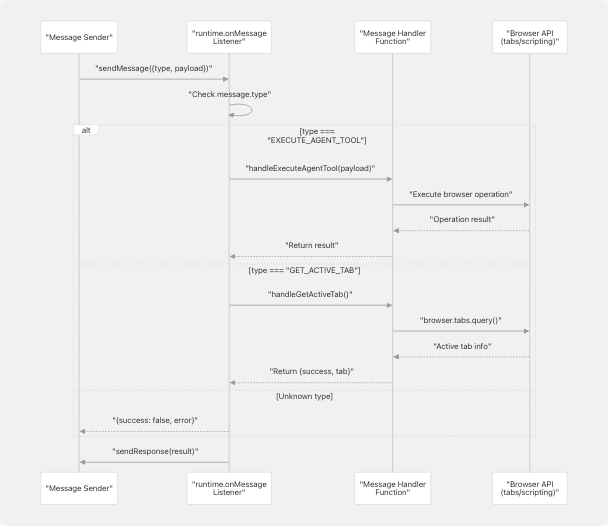
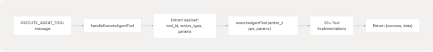
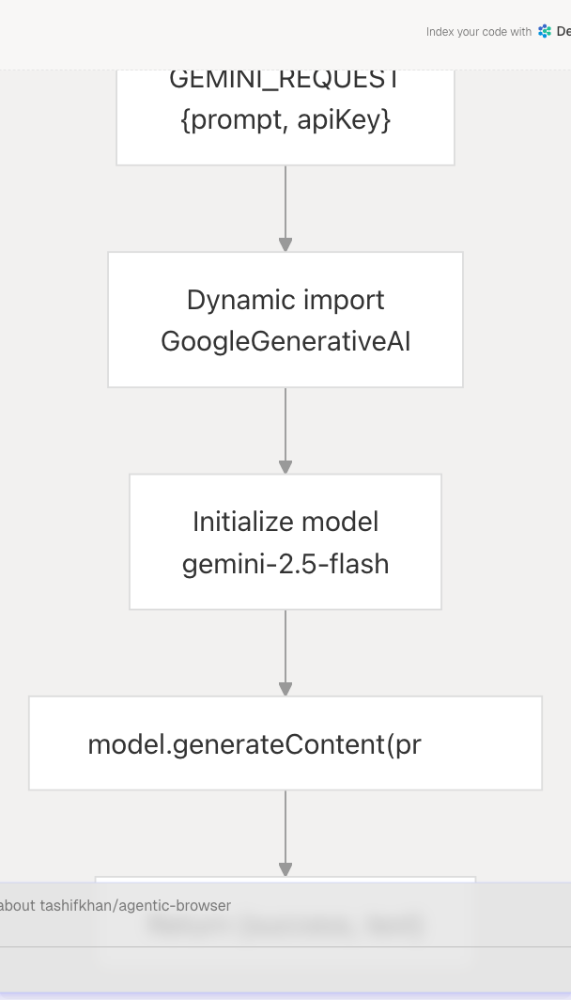
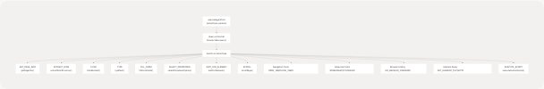
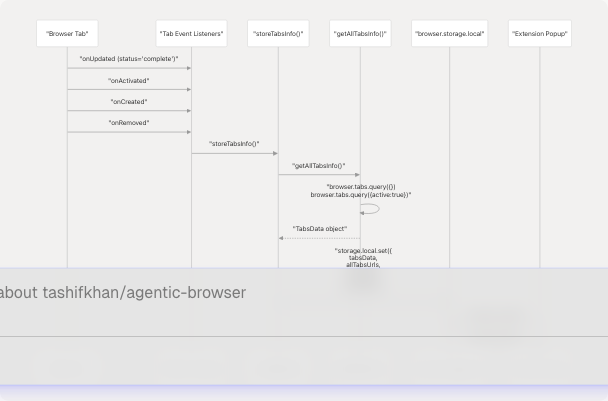

# Background Script and Message Handling

## Purpose and Scope

This document describes the TypeScript background script (`background.ts`) that serves as the central message routing hub for the browser extension. The background script runs persistently in the browser extension environment and coordinates all communication between the extension UI, content scripts, and external services. It implements a message dispatch system that handles 7+ distinct message types, executes browser automation tools, manages tab state, and interfaces with the Python Flask backend for OAuth and AI services.

For information about the browser automation tools themselves and their implementations, see [Browser Automation Tools](5.3-browser-automation-tools). For details on the Python Flask backend service that the background script communicates with, see [Extension Backend Service](5.4-extension-backend-service).

---

## Background Script Architecture

The background script is initialized using WXT's `defineBackground` wrapper and establishes a persistent message listener that processes incoming messages from the extension UI and content scripts. The architecture follows a command pattern where each message type is routed to a specific handler function.


**Core Initialization Flow**

---

## Message Types and Dispatch System

The background script implements a centralized message dispatcher that listens for messages via `browser.runtime.onMessage` and routes them based on the `type` field. Each handler returns a promise and uses `sendResponse` to communicate results back to the sender.

### Message Type Table

| Message Type | Purpose | Priority | Handler Function |
| --- | --- | --- | --- |
| `EXECUTE_AGENT_TOOL` | Execute sophisticated browser automation tools requested by AI agent | Highest | `handleExecuteAgentTool` |
| `ACTIVATE_AI_FRAME` | Inject visual AI activity indicator overlay | Normal | `handleActivateAIFrame` |
| `DEACTIVATE_AI_FRAME` | Remove AI activity overlay | Normal | `handleDeactivateAIFrame` |
| `GET_ACTIVE_TAB` | Retrieve currently active tab information | Normal | `handleGetActiveTab` |
| `GET_ALL_TABS` | Retrieve all open tabs | Normal | `handleGetAllTabs` |
| `EXECUTE_ACTION` | Execute single browser action (legacy) | Normal | `handleExecuteAction` |
| `GEMINI_REQUEST` | Send prompt to Gemini API (client-side) | Normal | `handleGeminiRequest` |
| `RUN_GENERATED_AGENT` | Execute multi-step action plan from AI | Normal | `handleRunGeneratedAgent` |

### Message Dispatch Implementation

The message listener uses a priority-check pattern where `EXECUTE_AGENT_TOOL` is evaluated first due to its critical role in agent orchestration:



The dispatcher returns `true` from the listener to keep the messaging channel open for async responses, which is required for all handlers that return promises.

---

## Message Handler Functions

### EXECUTE\_AGENT\_TOOL Handler

This is the most sophisticated handler, responsible for routing AI agent tool requests to specific browser automation implementations. It receives a structured payload containing `tool_id`, `action_type`, and `params`, then dispatches to the `executeAgentTool` function.



The handler includes extensive logging for debugging agent behavior:

### Tab and Window Control Handlers

**GET\_ACTIVE\_TAB**: Queries the browser for the currently active tab using `browser.tabs.query({active: true, currentWindow: true})` and returns tab metadata including `id`, `url`, `title`, and `favIconUrl`.

**GET\_ALL\_TABS**: Retrieves all open tabs across all windows using `browser.tabs.query({})`.

### EXECUTE\_ACTION Handler

Executes a single browser action by injecting the content script and sending the action payload to it. This is a legacy handler maintained for backward compatibility; newer implementations use `EXECUTE_AGENT_TOOL` directly.

### GEMINI\_REQUEST Handler

Provides client-side Gemini API access by dynamically importing `@google/generative-ai` and generating responses directly from the background script. The handler accepts a `prompt` and `apiKey` in the payload.



### RUN\_GENERATED\_AGENT Handler

Executes a multi-step action plan generated by the AI agent. The payload contains an `action_plan` object with an `actions` array and a target `tabId`. The handler iterates through each action sequentially, calling `executeAction` for each step and collecting results.

---

## Agent Tool Execution System

The `executeAgentTool` function serves as a dispatcher for 20+ sophisticated browser automation tools. It first retrieves the active tab, then uses a switch statement to route to the appropriate tool implementation.

### Tool Dispatch Architecture



### Tool Categories

**DOM Interaction Tools**: Execute DOM operations by injecting scripts via `browser.scripting.executeScript`. Examples include `CLICK`, `TYPE`, `SCROLL`, `HOVER`. These tools receive CSS selectors or element identifiers and manipulate the page programmatically.

**Tab Management Tools**: Control browser tabs and windows using `browser.tabs` API. Examples include `OPEN_TAB`, `CLOSE_TAB`, `SWITCH_TAB`, `NAVIGATE`, `RELOAD_TAB`, `DUPLICATE_TAB`.

**Information Extraction Tools**: Retrieve page and element information. Examples include `GET_PAGE_INFO`, `EXTRACT_DOM`, `GET_ELEMENT_TEXT`, `GET_ELEMENT_ATTRIBUTES`, `FIND_ELEMENTS`.

**State Management Tools**: Access browser storage and cookies. Examples include `GET_COOKIES`, `SET_COOKIE`, `GET_LOCAL_STORAGE`, `SET_LOCAL_STORAGE`.

**Advanced Automation Tools**: Complex operations like `SCREENSHOT`, `WAIT_FOR_ELEMENT`, `FILL_FORM`, `EXECUTE_SCRIPT`.

---

## executeAction Function

The `executeAction` function implements specific action logic and is called by both `handleExecuteAction` and `handleRunGeneratedAgent`. It handles 15+ action types divided into two categories: tab/window control actions and DOM manipulation actions.

### Tab Control Actions Flow


**Tab Control Actions**: `OPEN_TAB`, `CLOSE_TAB`, `SWITCH_TAB`, `NAVIGATE`, `RELOAD_TAB`, `DUPLICATE_TAB` operate directly on browser tabs without requiring content script injection. They use `browser.tabs.create()`, `browser.tabs.remove()`, `browser.tabs.update()`, and include synchronization logic to wait for tab loading completion.

**DOM Manipulation Actions**: `CLICK`, `TYPE`, `SCROLL`, `WAIT`, `SELECT`, `EXECUTE_SCRIPT` inject JavaScript into the active tab using `browser.scripting.executeScript()`. The `TYPE` action includes special handling for contenteditable elements and various input types, dispatching appropriate events (`input`, `change`, `keydown`, `keyup`) to ensure framework reactivity.

---

## Browser API Integration

The background script extensively uses Chrome/Firefox extension APIs to implement functionality:

### API Usage Patterns

| Browser API | Usage | Key Methods |
| --- | --- | --- |
| `browser.tabs` | Tab lifecycle management, queries, navigation | `.query()`, `.create()`, `.update()`, `.remove()`, `.duplicate()`, `.reload()` |
| `browser.scripting` | Code injection into pages | `.executeScript({target, func, args})` |
| `browser.storage` | Persistent state storage for tab tracking | `.local.set()`, `.local.get()` |
| `browser.runtime` | Message passing between components | `.onMessage.addListener()`, `.sendMessage()` |

### Script Injection Pattern

The background script uses a functional approach for code injection, passing serialized functions and arguments to `browser.scripting.executeScript`:


This pattern ensures code runs in the page's JavaScript context with access to the DOM and window object while maintaining type safety.

---

## Tab Tracking System

The background script implements automatic tab state tracking for the extension popup by listening to tab lifecycle events and storing aggregated information in `browser.storage.local`.

### Tab Events and Storage Flow



### TabsData Interface

The tracking system uses structured interfaces to ensure type safety:

* **TabInfo**: Represents individual tab metadata (`id`, `url`, `title`, `favIconUrl`)
* **TabsData**: Aggregated tab information including `allTabs` array, `activeTab` object, `totalTabs` count, and `lastUpdated` timestamp

The system registers four event listeners (`onUpdated`, `onActivated`, `onCreated`, `onRemoved`) that trigger `storeTabsInfo()` whenever tab state changes, ensuring the popup always has fresh data.

---

## Communication with Backend Service

While most message handling occurs within the browser extension environment, the background script can also communicate with the Python Flask backend for services requiring secure API key storage.

### Backend Endpoints Used

The background script does not directly call the Flask backend in the current implementation; instead, the extension UI components make direct fetch requests. However, the `GEMINI_REQUEST` handler demonstrates the pattern for future integration:

1. **Gemini Chat**: Client-side implementation using dynamic import
2. **OAuth Token Exchange**: Would be handled via fetch to `/exchange-code` or `/github/exchange-code`
3. **Token Refresh**: Would call `/refresh-token` endpoint

The separation ensures sensitive API keys (stored in backend environment variables) are never exposed to the extension code.

---

## Error Handling and Logging

The background script implements comprehensive error handling and logging throughout the message dispatch system:

**Logging Strategy**: Each handler includes detailed console logging with emoji prefixes for visual debugging (`🔔` for messages, `✅` for success, `❌` for errors, `🎬` for priority actions).

**Error Response Format**: All handlers return a consistent error response structure:

```
{ success: false, error: string }
```

**Async Channel Management**: All message handlers return `true` from the listener to keep the response channel open for async operations. Failure to do so results in "message port closed" errors.

**Try-Catch Wrapping**: Each handler function wraps its logic in try-catch blocks to prevent unhandled promise rejections from crashing the background script.
