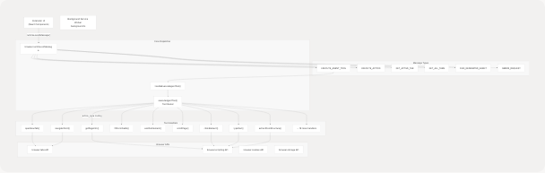
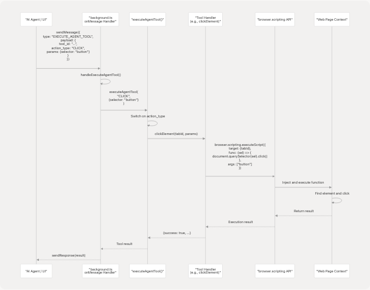
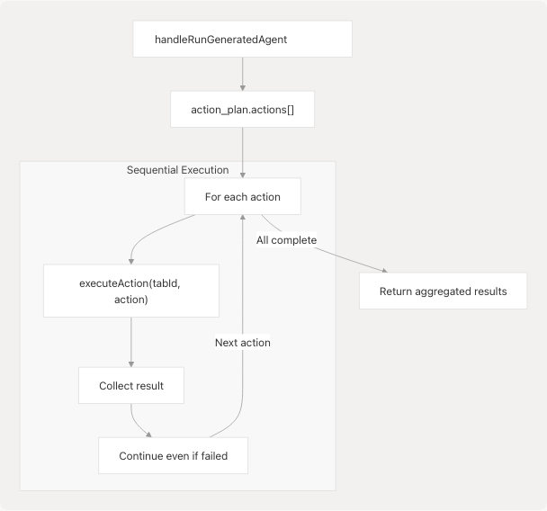

# Browser Automation Tools

Relevant source files

* [extension/.env.example](https://github.com/tashifkhan/agentic-browser/blob/e94826c4/extension/.env.example)
* [extension/README.md](https://github.com/tashifkhan/agentic-browser/blob/e94826c4/extension/README.md)
* [extension/assets/react.svg](https://github.com/tashifkhan/agentic-browser/blob/e94826c4/extension/assets/react.svg)
* [extension/backend\_service.py](https://github.com/tashifkhan/agentic-browser/blob/e94826c4/extension/backend_service.py)
* [extension/chat-example.md](https://github.com/tashifkhan/agentic-browser/blob/e94826c4/extension/chat-example.md)
* [extension/entrypoints/background.ts](https://github.com/tashifkhan/agentic-browser/blob/e94826c4/extension/entrypoints/background.ts)
* [tools/browser\_use/\_\_init\_\_.py](https://github.com/tashifkhan/agentic-browser/blob/e94826c4/tools/browser_use/__init__.py)
* [tools/browser\_use/tool.py](https://github.com/tashifkhan/agentic-browser/blob/e94826c4/tools/browser_use/tool.py)

This page documents the browser automation tool system implemented in the browser extension's background script. These tools provide programmatic control over browser tabs, DOM elements, and page state, enabling AI agents to interact with web pages. For information about the React Agent that uses these tools, see [Agent Tool System](/tashifkhan/agentic-browser/4.3-agent-tool-system). For the browser extension backend service, see [Extension Backend Service](/tashifkhan/agentic-browser/5.4-extension-backend-service).

**Sources**: [extension/entrypoints/background.ts1-2701](https://github.com/tashifkhan/agentic-browser/blob/e94826c4/extension/entrypoints/background.ts#L1-L2701)

## System Overview

The browser automation tools are implemented in TypeScript within the extension's background service worker. The system provides 27+ distinct tools organized into six categories: DOM manipulation, tab/window control, information extraction, storage/cookies, navigation, and advanced interactions. All tools execute through the `executeAgentTool` dispatcher function which routes action types to specific handler implementations.

**Sources**: [extension/entrypoints/background.ts886-1026](https://github.com/tashifkhan/agentic-browser/blob/e94826c4/extension/entrypoints/background.ts#L886-L1026)

## Tool Categories and Capabilities

The following table summarizes all available automation tools:

| Category | Tool Name | Action Type | Purpose |
| --- | --- | --- | --- |
| **Information Extraction** | Get Page Info | `GET_PAGE_INFO` | Extract page metadata, interactive elements, media presence |
|  | Extract DOM | `EXTRACT_DOM` | Build structured DOM tree with selectors |
|  | Get Element Text | `GET_ELEMENT_TEXT` | Retrieve text content from specific element |
|  | Get Element Attributes | `GET_ELEMENT_ATTRIBUTES` | Fetch all attributes from element |
|  | Find Elements | `FIND_ELEMENTS` | Query multiple elements with detailed info |
|  | Get All Tabs | `GET_ALL_TABS` | List all open browser tabs |
|  | Screenshot | `SCREENSHOT` | Capture visible page area |
| **DOM Manipulation** | Click | `CLICK` | Click element by selector |
|  | Type | `TYPE` | Input text into fields (supports contenteditable) |
|  | Fill Form | `FILL_FORM` | Populate multiple form fields at once |
|  | Select Dropdown | `SELECT_DROPDOWN` | Choose dropdown option |
|  | Hover | `HOVER` | Trigger hover state on element |
|  | Scroll | `SCROLL` | Scroll page or to specific element |
|  | Wait for Element | `WAIT_FOR_ELEMENT` | Poll for element visibility |
| **Tab/Window Control** | Open Tab | `OPEN_TAB` | Create new tab with URL |
|  | Close Tab | `CLOSE_TAB` | Close current or specified tab |
|  | Switch Tab | `SWITCH_TAB` | Change active tab by ID or direction |
|  | Navigate | `NAVIGATE` | Load URL in current/specified tab |
|  | Reload Tab | `RELOAD_TAB` | Refresh page with optional cache bypass |
|  | Duplicate Tab | `DUPLICATE_TAB` | Clone existing tab |
| **Navigation** | Go Back | `GO_BACK` | Navigate to previous page in history |
|  | Go Forward | `GO_FORWARD` | Navigate to next page in history |
| **Storage/Cookies** | Get Cookies | `GET_COOKIES` | Retrieve cookies for URL/domain |
|  | Set Cookie | `SET_COOKIE` | Create or update cookie |
|  | Get Local Storage | `GET_LOCAL_STORAGE` | Read localStorage items |
|  | Set Local Storage | `SET_LOCAL_STORAGE` | Write to localStorage |
| **Advanced** | Execute Script | `EXECUTE_SCRIPT` | Run arbitrary JavaScript code |

**Sources**: [extension/entrypoints/background.ts893-1026](https://github.com/tashifkhan/agentic-browser/blob/e94826c4/extension/entrypoints/background.ts#L893-L1026) [extension/entrypoints/background.ts541-826](https://github.com/tashifkhan/agentic-browser/blob/e94826c4/extension/entrypoints/background.ts#L541-L826)

## Message Dispatch Architecture


```

**Sources**: [extension/entrypoints/background.ts24-128](https://github.com/tashifkhan/agentic-browser/blob/e94826c4/extension/entrypoints/background.ts#L24-L128) [extension/entrypoints/background.ts516-539](https://github.com/tashifkhan/agentic-browser/blob/e94826c4/extension/entrypoints/background.ts#L516-L539) [extension/entrypoints/background.ts893-1026](https://github.com/tashifkhan/agentic-browser/blob/e94826c4/extension/entrypoints/background.ts#L893-L1026)

The message dispatch system uses the `browser.runtime.onMessage` listener to handle six primary message types. The `EXECUTE_AGENT_TOOL` message type is the primary entry point for AI agents, routing through `handleExecuteAgentTool` to `executeAgentTool`, which contains a 27-case switch statement mapping action types to specific tool implementations.

## DOM Manipulation Tools

### Click Element Tool

The `clickElement` function locates elements via CSS selectors and triggers click events. It supports optional click count for double/triple clicks and click modifiers (Ctrl, Alt, Shift, Meta).

**Implementation**: [extension/entrypoints/background.ts1157-1177](https://github.com/tashifkhan/agentic-browser/blob/e94826c4/extension/entrypoints/background.ts#L1157-L1177)

```
```
// Simplified structure
async function clickElement(tabId: number, params: any) {
  return await browser.scripting.executeScript({
    target: { tabId },
    func: (selector: string, count: number, modifiers: any) => {
      const el = document.querySelector(selector);
      // Triggers multiple clicks with modifiers
      for (let i = 0; i < count; i++) {
        (el as HTMLElement).click();
      }
    },
    args: [params.selector, params.count || 1, params.modifiers]
  });
}
```
```

**Sources**: [extension/entrypoints/background.ts1157-1177](https://github.com/tashifkhan/agentic-browser/blob/e94826c4/extension/entrypoints/background.ts#L1157-L1177)

### Type Text Tool

The `typeText` function handles text input for standard inputs, textareas, and contenteditable elements. It includes special handling for React/framework-driven inputs by dispatching multiple event types.

**Key Features**:

* Supports contenteditable elements (e.g., ChatGPT prompt box)
* Triggers input, change, keydown, and keyup events
* Auto-focuses target element before typing

**Implementation**: [extension/entrypoints/background.ts1179-1243](https://github.com/tashifkhan/agentic-browser/blob/e94826c4/extension/entrypoints/background.ts#L1179-L1243)

```
```
// Handles three element types:
// 1. contenteditable elements: sets innerText/textContent
// 2. input/textarea: sets value property
// 3. other elements: fallback to value property
```
```

### Fill Form Fields Tool

The `fillFormFields` function populates multiple form inputs in a single operation. It accepts a mapping of CSS selectors to values and processes them sequentially.

**Example Payload**:

```
```
{
  "fields": {
    "#email": "user@example.com",
    "#password": "secretpass",
    "#age": "25"
  }
}
```
```

**Implementation**: [extension/entrypoints/background.ts1245-1308](https://github.com/tashifkhan/agentic-browser/blob/e94826c4/extension/entrypoints/background.ts#L1245-L1308)

**Sources**: [extension/entrypoints/background.ts1245-1308](https://github.com/tashifkhan/agentic-browser/blob/e94826c4/extension/entrypoints/background.ts#L1245-L1308)

### Wait for Element Tool

The `waitForElement` function polls for element visibility with configurable timeout and interval. Returns success when element appears or timeout error after maximum wait time.

**Parameters**:

* `selector`: CSS selector to wait for
* `timeout`: Maximum wait time in milliseconds (default: 10000)
* `interval`: Polling interval in milliseconds (default: 100)

**Implementation**: [extension/entrypoints/background.ts1335-1375](https://github.com/tashifkhan/agentic-browser/blob/e94826c4/extension/entrypoints/background.ts#L1335-L1375)

**Sources**: [extension/entrypoints/background.ts1335-1375](https://github.com/tashifkhan/agentic-browser/blob/e94826c4/extension/entrypoints/background.ts#L1335-L1375)

### Scroll Page Tool

The `scrollPage` function provides directional scrolling and element-targeting scroll. Supports four modes: up, down, top, bottom, plus scroll-to-element.

**Implementation**: [extension/entrypoints/background.ts1377-1407](https://github.com/tashifkhan/agentic-browser/blob/e94826c4/extension/entrypoints/background.ts#L1377-L1407)

**Sources**: [extension/entrypoints/background.ts1377-1407](https://github.com/tashifkhan/agentic-browser/blob/e94826c4/extension/entrypoints/background.ts#L1377-L1407)

## Tab and Window Control Tools

```

```

**Sources**: [extension/entrypoints/background.ts1409-1771](https://github.com/tashifkhan/agentic-browser/blob/e94826c4/extension/entrypoints/background.ts#L1409-L1771)

### Open Tab Tool

Creates a new browser tab with specified URL and activation state. Waits for tab load completion if URL is provided and tab is active.

**Parameters**:

* `url`: Target URL (optional, defaults to "about:blank")
* `active`: Whether to activate new tab (default: true)

**Implementation**: [extension/entrypoints/background.ts1409-1436](https://github.com/tashifkhan/agentic-browser/blob/e94826c4/extension/entrypoints/background.ts#L1409-L1436)

**Sources**: [extension/entrypoints/background.ts1409-1436](https://github.com/tashifkhan/agentic-browser/blob/e94826c4/extension/entrypoints/background.ts#L1409-L1436)

### Switch Tab Tool

Changes the active tab either by tab ID or relative direction (next/previous). Direction-based switching cycles through tabs in current window.

**Parameters**:

* `tabId`: Specific tab ID to activate (optional)
* `direction`: "next" or "previous" for relative switching (optional)

**Implementation**: [extension/entrypoints/background.ts1449-1484](https://github.com/tashifkhan/agentic-browser/blob/e94826c4/extension/entrypoints/background.ts#L1449-L1484)

**Sources**: [extension/entrypoints/background.ts1449-1484](https://github.com/tashifkhan/agentic-browser/blob/e94826c4/extension/entrypoints/background.ts#L1449-L1484)

### Navigate Tool

Loads a URL in the current or specified tab and waits for navigation completion using the `tabs.onUpdated` listener with status "complete" detection.

**Implementation**: [extension/entrypoints/background.ts1486-1523](https://github.com/tashifkhan/agentic-browser/blob/e94826c4/extension/entrypoints/background.ts#L1486-L1523)

**Sources**: [extension/entrypoints/background.ts1486-1523](https://github.com/tashifkhan/agentic-browser/blob/e94826c4/extension/entrypoints/background.ts#L1486-L1523)

## Information Extraction Tools

### Get Page Info Tool

```

```

**Sources**: [extension/entrypoints/background.ts1030-1070](https://github.com/tashifkhan/agentic-browser/blob/e94826c4/extension/entrypoints/background.ts#L1030-L1070)

The `getPageInfo` tool extracts comprehensive page metadata including media presence, element counts, and optionally a list of interactive elements with their attributes. Limits interactive element extraction to 50 items for performance.

**Parameters**:

* `include_dom`: Whether to include DOM structure (not fully implemented)
* `extract_interactive`: Whether to extract interactive element details

**Implementation**: [extension/entrypoints/background.ts1030-1070](https://github.com/tashifkhan/agentic-browser/blob/e94826c4/extension/entrypoints/background.ts#L1030-L1070)

### Extract DOM Structure Tool

The `extractDomStructure` function builds a hierarchical tree representation of page DOM, including element tags, IDs, classes, and text content. Implements depth limiting to prevent excessive data collection.

**Parameters**:

* `max_depth`: Maximum tree depth (default: 5)
* `include_text`: Whether to include text content

**Return Structure**:

```
```
{
  "success": true,
  "dom": {
    "tag": "body",
    "id": "",
    "classes": ["main-content"],
    "text": "...",
    "children": [...]
  }
}
```
```

**Implementation**: [extension/entrypoints/background.ts1072-1155](https://github.com/tashifkhan/agentic-browser/blob/e94826c4/extension/entrypoints/background.ts#L1072-L1155)

**Sources**: [extension/entrypoints/background.ts1072-1155](https://github.com/tashifkhan/agentic-browser/blob/e94826c4/extension/entrypoints/background.ts#L1072-L1155)

### Get Element Text Tool

Retrieves the text content of a specific element via CSS selector. Returns `innerText` (visible text) if available, falling back to `textContent`.

**Implementation**: [extension/entrypoints/background.ts1562-1581](https://github.com/tashifkhan/agentic-browser/blob/e94826c4/extension/entrypoints/background.ts#L1562-L1581)

**Sources**: [extension/entrypoints/background.ts1562-1581](https://github.com/tashifkhan/agentic-browser/blob/e94826c4/extension/entrypoints/background.ts#L1562-L1581)

### Get Element Attributes Tool

Extracts all attributes from a target element, returning them as a key-value object along with the element's tag name.

**Return Example**:

```
```
{
  "success": true,
  "tag": "input",
  "attributes": {
    "type": "text",
    "id": "username",
    "class": "form-control",
    "placeholder": "Enter username"
  }
}
```
```

**Implementation**: [extension/entrypoints/background.ts1583-1611](https://github.com/tashifkhan/agentic-browser/blob/e94826c4/extension/entrypoints/background.ts#L1583-L1611)

**Sources**: [extension/entrypoints/background.ts1583-1611](https://github.com/tashifkhan/agentic-browser/blob/e94826c4/extension/entrypoints/background.ts#L1583-L1611)

### Find Elements Tool

The `findElements` function queries for multiple elements matching a selector and returns detailed information about each (tag, text, attributes, computed style).

**Parameters**:

* `selector`: CSS selector
* `limit`: Maximum elements to return (default: 50)

**Implementation**: [extension/entrypoints/background.ts1809-1879](https://github.com/tashifkhan/agentic-browser/blob/e94826c4/extension/entrypoints/background.ts#L1809-L1879)

**Sources**: [extension/entrypoints/background.ts1809-1879](https://github.com/tashifkhan/agentic-browser/blob/e94826c4/extension/entrypoints/background.ts#L1809-L1879)

### Get All Tabs Tool

Lists all open browser tabs with their IDs, URLs, titles, and active state.

**Implementation**: [extension/entrypoints/background.ts1525-1544](https://github.com/tashifkhan/agentic-browser/blob/e94826c4/extension/entrypoints/background.ts#L1525-L1544)

**Sources**: [extension/entrypoints/background.ts1525-1544](https://github.com/tashifkhan/agentic-browser/blob/e94826c4/extension/entrypoints/background.ts#L1525-L1544)

### Screenshot Tool

Captures the visible area of a tab using `browser.tabs.captureVisibleTab`. Returns a base64-encoded PNG image.

**Implementation**: [extension/entrypoints/background.ts1546-1560](https://github.com/tashifkhan/agentic-browser/blob/e94826c4/extension/entrypoints/background.ts#L1546-L1560)

**Sources**: [extension/entrypoints/background.ts1546-1560](https://github.com/tashifkhan/agentic-browser/blob/e94826c4/extension/entrypoints/background.ts#L1546-L1560)

## Storage and Cookie Tools

### Cookie Management

The cookie tools provide CRUD operations for browser cookies:

**Get Cookies** (`GET_COOKIES`): Retrieves all cookies for a specified URL or domain. Uses `browser.cookies.getAll()`.

**Set Cookie** (`SET_COOKIE`): Creates or updates a cookie with specified name, value, domain, path, and expiration. Uses `browser.cookies.set()`.

**Implementation**: [extension/entrypoints/background.ts1634-1669](https://github.com/tashifkhan/agentic-browser/blob/e94826c4/extension/entrypoints/background.ts#L1634-L1669)

**Sources**: [extension/entrypoints/background.ts1634-1669](https://github.com/tashifkhan/agentic-browser/blob/e94826c4/extension/entrypoints/background.ts#L1634-L1669)

### Local Storage Tools

The local storage tools execute scripts in page context to access `window.localStorage`:

**Get Local Storage** (`GET_LOCAL_STORAGE`): Retrieves specific key or all localStorage items.

**Set Local Storage** (`SET_LOCAL_STORAGE`): Writes key-value pairs to localStorage.

**Implementation**: [extension/entrypoints/background.ts1671-1713](https://github.com/tashifkhan/agentic-browser/blob/e94826c4/extension/entrypoints/background.ts#L1671-L1713)

**Sources**: [extension/entrypoints/background.ts1671-1713](https://github.com/tashifkhan/agentic-browser/blob/e94826c4/extension/entrypoints/background.ts#L1671-L1713)

## Navigation History Tools

### Go Back and Go Forward

These tools manipulate browser history using `window.history` API:

**Go Back** (`GO_BACK`): Navigates to previous page via `history.back()`.

**Go Forward** (`GO_FORWARD`): Navigates to next page via `history.forward()`.

Both tools wait 500ms after navigation for page load.

**Implementation**: [extension/entrypoints/background.ts1773-1807](https://github.com/tashifkhan/agentic-browser/blob/e94826c4/extension/entrypoints/background.ts#L1773-L1807)

**Sources**: [extension/entrypoints/background.ts1773-1807](https://github.com/tashifkhan/agentic-browser/blob/e94826c4/extension/entrypoints/background.ts#L1773-L1807)

## Advanced Tools

### Execute Custom Script Tool

The `executeCustomScript` function allows arbitrary JavaScript execution in page context. The script parameter is wrapped in an async function for flexibility.

**Security Note**: This tool should be used carefully as it can execute any code in the page context.

**Parameters**:

* `script`: JavaScript code string to execute

**Implementation**: [extension/entrypoints/background.ts1613-1632](https://github.com/tashifkhan/agentic-browser/blob/e94826c4/extension/entrypoints/background.ts#L1613-L1632)

**Sources**: [extension/entrypoints/background.ts1613-1632](https://github.com/tashifkhan/agentic-browser/blob/e94826c4/extension/entrypoints/background.ts#L1613-L1632)

### Hover Element Tool

Simulates mouse hover by dispatching `mouseover` and `mouseenter` events on the target element.

**Implementation**: [extension/entrypoints/background.ts1715-1741](https://github.com/tashifkhan/agentic-browser/blob/e94826c4/extension/entrypoints/background.ts#L1715-L1741)

**Sources**: [extension/entrypoints/background.ts1715-1741](https://github.com/tashifkhan/agentic-browser/blob/e94826c4/extension/entrypoints/background.ts#L1715-L1741)

### Select Dropdown Tool

Handles `<select>` dropdown elements by setting the value and triggering change events. Supports both value and text-based selection.

**Implementation**: [extension/entrypoints/background.ts1310-1333](https://github.com/tashifkhan/agentic-browser/blob/e94826c4/extension/entrypoints/background.ts#L1310-L1333)

**Sources**: [extension/entrypoints/background.ts1310-1333](https://github.com/tashifkhan/agentic-browser/blob/e94826c4/extension/entrypoints/background.ts#L1310-L1333)

## Tool Execution Flow

```

```

**Sources**: [extension/entrypoints/background.ts516-539](https://github.com/tashifkhan/agentic-browser/blob/e94826c4/extension/entrypoints/background.ts#L516-L539) [extension/entrypoints/background.ts893-1026](https://github.com/tashifkhan/agentic-browser/blob/e94826c4/extension/entrypoints/background.ts#L893-L1026)

All tools follow a consistent execution pattern: the background script receives a message, routes it through the dispatcher, invokes the appropriate handler, and uses `browser.scripting.executeScript` or tab APIs to perform the action. Most DOM manipulation tools inject functions into the page context for direct element access.

## Action Execution for Generated Plans

The background script also supports executing complete action plans generated by the Browser Use Agent (see [Browser Use Agent and Script Generation](/tashifkhan/agentic-browser/4.2-browser-use-agent-and-script-generation)). The `handleRunGeneratedAgent` function processes action arrays sequentially:

```

```

**Sources**: [extension/entrypoints/background.ts470-514](https://github.com/tashifkhan/agentic-browser/blob/e94826c4/extension/entrypoints/background.ts#L470-L514)

The `executeAction` function (lines 541-826) handles both tab control actions (OPEN\_TAB, CLOSE\_TAB, NAVIGATE, etc.) and DOM actions (CLICK, TYPE, SCROLL, etc.). This dual-purpose handler supports both direct agent tool invocation and action plan execution.

**Implementation**: [extension/entrypoints/background.ts541-826](https://github.com/tashifkhan/agentic-browser/blob/e94826c4/extension/entrypoints/background.ts#L541-L826)

## Integration with Browser Use Agent

The browser automation tools integrate with the Python backend's Browser Use Agent through the `browser_action_agent` tool:

**Tool Definition**: [tools/browser\_use/tool.py1-49](https://github.com/tashifkhan/agentic-browser/blob/e94826c4/tools/browser_use/tool.py#L1-L49)

```
```
# Simplified structure
async def _browser_action_tool(
    goal: str,
    target_url: str = "",
    dom_structure: Dict[str, Any] = {},
    constraints: Dict[str, Any] = {},
) -> Dict[str, Any]:
    service = AgentService()
    result = await service.generate_script(...)
    return result

browser_action_agent = StructuredTool(
    name="browser_action_agent",
    description="Generate a JSON action plan to key elements...",
    coroutine=_browser_action_tool,
    args_schema=BrowserActionInput,
)
```

The agent generates a JSON action plan (see [Browser Use Agent and Script Generation](/tashifkhan/agentic-browser/4.2-browser-use-agent-and-script-generation)) which the extension executes through the `RUN_GENERATED_AGENT` message type. This creates a bridge between AI planning (Python backend) and execution (TypeScript extension).

**Sources**: [tools/browser\_use/tool.py1-49](https://github.com/tashifkhan/agentic-browser/blob/e94826c4/tools/browser_use/tool.py#L1-L49) [extension/entrypoints/background.ts470-514](https://github.com/tashifkhan/agentic-browser/blob/e94826c4/extension/entrypoints/background.ts#L470-L514)

## Error Handling and Validation

All tool handlers wrap their execution in try-catch blocks and return standardized response objects:

```
```
// Success response
{
  success: true,
  data: { /* tool-specific data */ },
  message: "Action description"
}

// Error response
{
  success: false,
  error: "Error message",
  stack: "Error stack trace" // in development
}
```
```

Element-not-found errors are the most common failure case for DOM manipulation tools. The system throws descriptive errors including the selector used to help with debugging.

**Sources**: [extension/entrypoints/background.ts893-1026](https://github.com/tashifkhan/agentic-browser/blob/e94826c4/extension/entrypoints/background.ts#L893-L1026) [extension/entrypoints/background.ts1021-1025](https://github.com/tashifkhan/agentic-browser/blob/e94826c4/extension/entrypoints/background.ts#L1021-L1025)