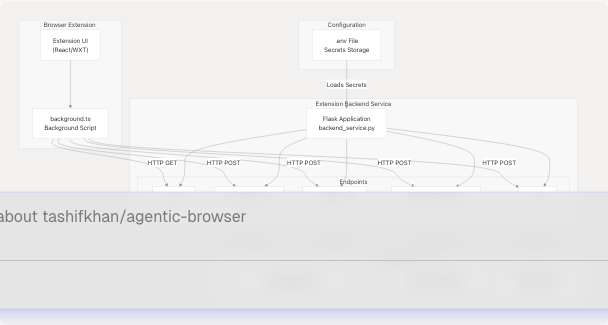
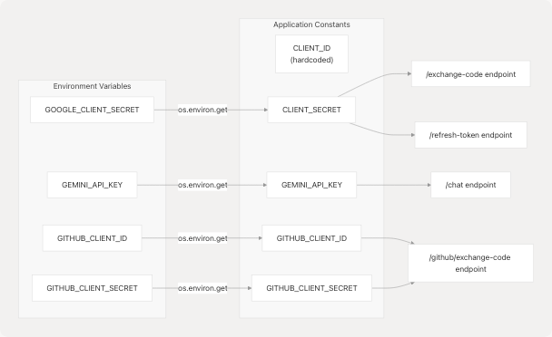
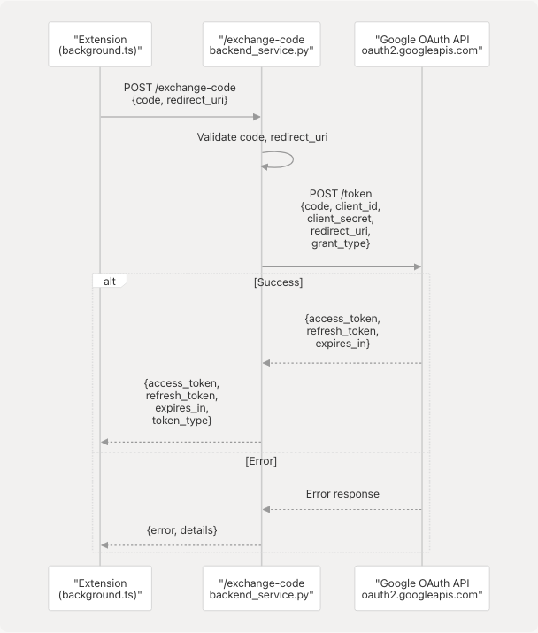
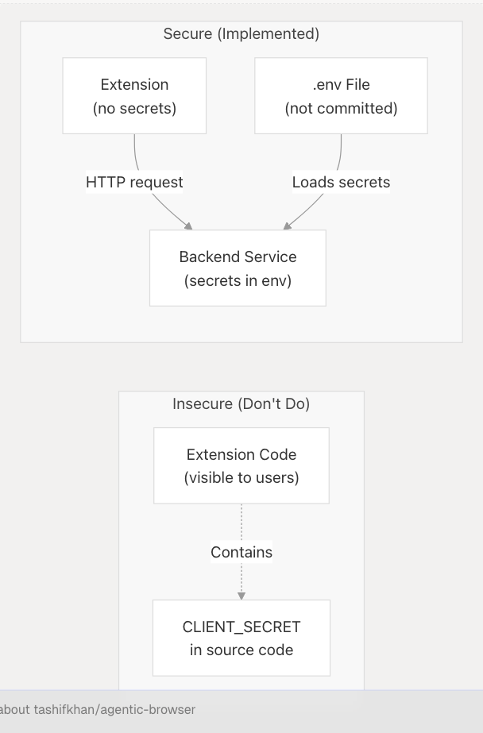

# Extension Backend Service

Relevant source files

* [extension/.env.example](https://github.com/tashifkhan/agentic-browser/blob/e94826c4/extension/.env.example)
* [extension/README.md](https://github.com/tashifkhan/agentic-browser/blob/e94826c4/extension/README.md)
* [extension/assets/react.svg](https://github.com/tashifkhan/agentic-browser/blob/e94826c4/extension/assets/react.svg)
* [extension/backend\_service.py](https://github.com/tashifkhan/agentic-browser/blob/e94826c4/extension/backend_service.py)
* [extension/chat-example.md](https://github.com/tashifkhan/agentic-browser/blob/e94826c4/extension/chat-example.md)
* [extension/entrypoints/background.ts](https://github.com/tashifkhan/agentic-browser/blob/e94826c4/extension/entrypoints/background.ts)

## Purpose and Scope

The Extension Backend Service is a Python Flask application that provides secure backend functionality for the browser extension. This service runs independently on `localhost:5000` and handles sensitive operations that cannot be performed directly in the browser, including OAuth token exchange flows and LLM API key management.

For information about the extension's frontend architecture and background script, see [Background Script and Message Handling](/tashifkhan/agentic-browser/5.2-background-script-and-message-handling). For browser automation tools that interact with the extension, see [Browser Automation Tools](/tashifkhan/agentic-browser/5.3-browser-automation-tools).

**Sources:** [extension/backend\_service.py1-229](https://github.com/tashifkhan/agentic-browser/blob/e94826c4/extension/backend_service.py#L1-L229)

---

## Architecture Overview

The Extension Backend Service operates as a standalone Flask server that the browser extension communicates with via HTTP requests. It serves as a security boundary, keeping sensitive credentials (OAuth client secrets, API keys) server-side while exposing safe endpoints to the extension.

### System Context


```

**Sources:** [extension/backend\_service.py1-229](https://github.com/tashifkhan/agentic-browser/blob/e94826c4/extension/backend_service.py#L1-L229) [extension/entrypoints/background.ts451-468](https://github.com/tashifkhan/agentic-browser/blob/e94826c4/extension/entrypoints/background.ts#L451-L468) [extension/chat-example.md1-172](https://github.com/tashifkhan/agentic-browser/blob/e94826c4/extension/chat-example.md#L1-L172)

---

## Flask Application Structure

The backend service is implemented as a minimal Flask application with CORS enabled to allow cross-origin requests from the browser extension.

### Application Initialization

The Flask app is initialized with the following configuration:

| Component | Implementation | Purpose |
| --- | --- | --- |
| **Flask Instance** | `app = Flask(__name__)` | Main application instance |
| **CORS** | `CORS(app)` | Enables extension to call server from `chrome-extension://` origin |
| **Environment Loading** | `load_dotenv()` | Loads credentials from `.env` file |
| **Gemini Configuration** | `genai.configure(api_key=GEMINI_API_KEY)` | Initializes Google Generative AI SDK |

**Sources:** [extension/backend\_service.py1-27](https://github.com/tashifkhan/agentic-browser/blob/e94826c4/extension/backend_service.py#L1-L27)

### Credential Management

The service loads and manages several OAuth credentials and API keys:

```

```

**Sources:** [extension/backend\_service.py12-26](https://github.com/tashifkhan/agentic-browser/blob/e94826c4/extension/backend_service.py#L12-L26)

---

## OAuth Endpoints

The backend service provides secure OAuth token exchange endpoints, keeping client secrets server-side to prevent exposure in the browser extension code.

### Google OAuth Flow

#### Token Exchange Endpoint

The `/exchange-code` endpoint exchanges an authorization code for access and refresh tokens.

**Endpoint:** `POST /exchange-code`

**Request Body:**

```
```
{
  "code": "authorization_code_from_oauth_redirect",
  "redirect_uri": "chrome-extension://extension-id/callback"
}
```
```

**Implementation Flow:**

```

```

**Sources:** [extension/backend\_service.py36-74](https://github.com/tashifkhan/agentic-browser/blob/e94826c4/extension/backend_service.py#L36-L74)

#### Token Refresh Endpoint

The `/refresh-token` endpoint obtains a new access token using a refresh token when the access token expires.

**Endpoint:** `POST /refresh-token`

**Request Body:**

```
```
{
  "refresh_token": "stored_refresh_token"
}
```
```

**Response Body:**

```
```
{
  "access_token": "new_access_token",
  "expires_in": 3600,
  "token_type": "Bearer"
}
```
```

**Sources:** [extension/backend\_service.py77-112](https://github.com/tashifkhan/agentic-browser/blob/e94826c4/extension/backend_service.py#L77-L112)

### GitHub OAuth Flow

The `/github/exchange-code` endpoint handles GitHub OAuth token exchange.

**Endpoint:** `POST /github/exchange-code`

**Request Body:**

```
```
{
  "code": "github_authorization_code"
}
```
```

**Implementation Details:**

| Step | Action | Code Reference |
| --- | --- | --- |
| 1. Validate Request | Check for `code` parameter | [extension/backend\_service.py119-122](https://github.com/tashifkhan/agentic-browser/blob/e94826c4/extension/backend_service.py#L119-L122) |
| 2. Verify Configuration | Ensure `GITHUB_CLIENT_ID` and `GITHUB_CLIENT_SECRET` are set | [extension/backend\_service.py124-125](https://github.com/tashifkhan/agentic-browser/blob/e94826c4/extension/backend_service.py#L124-L125) |
| 3. Exchange Code | POST to `https://github.com/login/oauth/access_token` | [extension/backend\_service.py128-136](https://github.com/tashifkhan/agentic-browser/blob/e94826c4/extension/backend_service.py#L128-L136) |
| 4. Parse Response | Extract `access_token`, `token_type`, `scope` | [extension/backend\_service.py145-156](https://github.com/tashifkhan/agentic-browser/blob/e94826c4/extension/backend_service.py#L145-L156) |

**Sources:** [extension/backend\_service.py115-159](https://github.com/tashifkhan/agentic-browser/blob/e94826c4/extension/backend_service.py#L115-L159)

---

## Gemini Chat Integration

The `/chat` endpoint provides a proxy to Google's Gemini API, allowing the extension to chat with LLM models without exposing the API key in client-side code.

### Chat Endpoint

**Endpoint:** `POST /chat`

**Request Model:**

```
```
{
  "message": "user question or prompt",
  "model": "gemini-2.5-pro",
  "history": [
    {
      "role": "user",
      "content": "previous user message"
    },
    {
      "role": "model",
      "content": "previous model response"
    }
  ]
}
```
```

**Response Model:**

```
```
{
  "response": "AI generated response text",
  "model": "gemini-2.5-pro",
  "success": true
}
```
```

### Implementation Architecture

**Sources:** [extension/backend\_service.py162-202](https://github.com/tashifkhan/agentic-browser/blob/e94826c4/extension/backend_service.py#L162-L202) [extension/chat-example.md1-87](https://github.com/tashifkhan/agentic-browser/blob/e94826c4/extension/chat-example.md#L1-L87)

### Conversation History Format

The chat endpoint supports maintaining conversation context by accepting a `history` array. Each history item is converted to the Gemini SDK format:

```
```
# Input format (from extension)
{
  "role": "user",  # or "model"
  "content": "message text"
}

# Converted to Gemini SDK format
{
  "role": "user",
  "parts": ["message text"]
}
```
```

**Sources:** [extension/backend\_service.py181-187](https://github.com/tashifkhan/agentic-browser/blob/e94826c4/extension/backend_service.py#L181-L187)

### Supported Models

The endpoint defaults to `gemini-2.5-pro` but accepts any Gemini model name:

* `gemini-2.5-pro` - Most capable model
* `gemini-2.5-flash` - Faster, lighter model (used in background script)
* `gemini-1.5-flash` - Previous generation fast model
* `gemini-1.5-pro` - Previous generation capable model

**Sources:** [extension/backend\_service.py167](https://github.com/tashifkhan/agentic-browser/blob/e94826c4/extension/backend_service.py#L167-L167) [extension/chat-example.md169-171](https://github.com/tashifkhan/agentic-browser/blob/e94826c4/extension/chat-example.md#L169-L171) [extension/entrypoints/background.ts458](https://github.com/tashifkhan/agentic-browser/blob/e94826c4/extension/entrypoints/background.ts#L458-L458)

---

## Configuration and Environment Variables

The backend service requires environment variables for secure credential storage. These are loaded from a `.env` file using `python-dotenv`.

### Required Environment Variables

| Variable | Purpose | Used By | Required For |
| --- | --- | --- | --- |
| `GOOGLE_CLIENT_SECRET` | Google OAuth client secret | `/exchange-code`, `/refresh-token` | Google OAuth flows |
| `GEMINI_API_KEY` | Google Gemini API key | `/chat` | LLM chat functionality |
| `GITHUB_CLIENT_ID` | GitHub OAuth client ID | `/github/exchange-code` | GitHub OAuth flow |
| `GITHUB_CLIENT_SECRET` | GitHub OAuth client secret | `/github/exchange-code` | GitHub OAuth flow |

### Configuration Validation

The application validates configuration on startup and provides detailed warnings:

```

```

**Sources:** [extension/backend\_service.py207-229](https://github.com/tashifkhan/agentic-browser/blob/e94826c4/extension/backend_service.py#L207-L229)

---

## API Reference

### Complete Endpoint Summary

| Endpoint | Method | Purpose | Auth Required | Request Body | Response |
| --- | --- | --- | --- | --- | --- |
| `/` | GET | Health check (HTML) | No | None | `<h2>Backend running successfully 🚀</h2>` |
| `/health` | GET | Health check (JSON) | No | None | `{"status": "ok", "message": "..."}` |
| `/exchange-code` | POST | Exchange Google OAuth code | No | `{code, redirect_uri}` | `{access_token, refresh_token, expires_in, token_type}` |
| `/refresh-token` | POST | Refresh Google access token | No | `{refresh_token}` | `{access_token, expires_in, token_type}` |
| `/github/exchange-code` | POST | Exchange GitHub OAuth code | No | `{code}` | `{access_token, token_type, scope}` |
| `/chat` | POST | Chat with Gemini LLM | No | `{message, model?, history?}` | `{response, model, success}` |

### Error Response Format

All endpoints return errors in a consistent format:

```
```
{
  "error": "Error message description",
  "details": "Additional error details (optional)",
  "success": false
}
```
```

**Sources:** [extension/backend\_service.py28-202](https://github.com/tashifkhan/agentic-browser/blob/e94826c4/extension/backend_service.py#L28-L202)

---

## Usage Examples

### Calling from Extension Background Script

The extension's `background.ts` includes a `handleGeminiRequest` function that demonstrates direct Gemini API usage, but the `/chat` endpoint can be called via standard HTTP:

```
```
// Example from extension code
const response = await fetch('http://localhost:5000/chat', {
  method: 'POST',
  headers: {
    'Content-Type': 'application/json',
  },
  body: JSON.stringify({
    message: 'What is the capital of France?',
    model: 'gemini-1.5-flash',
  }),
});

const data = await response.json();
if (data.success) {
  console.log('AI Response:', data.response);
}
```
```

**Sources:** [extension/chat-example.md19-51](https://github.com/tashifkhan/agentic-browser/blob/e94826c4/extension/chat-example.md#L19-L51)

### Chat with Conversation History

```
```
const conversationHistory = [
  { role: 'user', content: 'Hello, who are you?' },
  { role: 'model', content: 'I am Gemini, a helpful AI assistant.' },
];

const response = await fetch('http://localhost:5000/chat', {
  method: 'POST',
  headers: { 'Content-Type': 'application/json' },
  body: JSON.stringify({
    message: 'Can you summarize our conversation?',
    history: conversationHistory,
    model: 'gemini-1.5-flash',
  }),
});
```
```

**Sources:** [extension/chat-example.md56-87](https://github.com/tashifkhan/agentic-browser/blob/e94826c4/extension/chat-example.md#L56-L87)

---

## Error Handling

The backend service implements consistent error handling across all endpoints.

### Error Handling Patterns

```

```

### Common Error Scenarios

| Scenario | HTTP Status | Error Message | Example Endpoint |
| --- | --- | --- | --- |
| Missing required field | 400 | `"Missing code or redirect_uri"` | `/exchange-code` |
| Missing configuration | 500 | `"GEMINI_API_KEY not configured"` | `/chat` |
| External API failure | 500 | `"Token exchange failed"` | `/exchange-code` |
| Invalid token | 400 | Token-specific error from OAuth provider | `/refresh-token` |
| Python exception | 500 | Exception message string | All endpoints |

**Sources:** [extension/backend\_service.py36-202](https://github.com/tashifkhan/agentic-browser/blob/e94826c4/extension/backend_service.py#L36-L202)

---

## Security Considerations

The Extension Backend Service implements several security best practices:

### Credential Isolation

**Problem:** Browser extensions cannot securely store OAuth client secrets or API keys because extension code is visible to users.

**Solution:** The backend service runs as a separate server process, keeping credentials in environment variables that are never exposed to the extension.

```


**Sources:** [extension/backend\_service.py12-26](https://github.com/tashifkhan/agentic-browser/blob/e94826c4/extension/backend_service.py#L12-L26)

### CORS Configuration

CORS is enabled to allow the extension to call the backend, but this means the service should only run locally and not be exposed to the internet.

**Current Configuration:**

* `CORS(app)` - Allows all origins (development-friendly)

**Production Recommendation:**

* Restrict CORS to specific extension origins
* Use HTTPS for production deployments

**Sources:** [extension/backend\_service.py10](https://github.com/tashifkhan/agentic-browser/blob/e94826c4/extension/backend_service.py#L10-L10)

### OAuth Token Flow Security

The service implements the OAuth 2.0 authorization code flow correctly:

1. **Authorization Code Exchange:** Extension receives code from OAuth provider → Backend exchanges code for tokens using client secret
2. **Token Storage:** Refresh tokens should be stored securely by the extension (e.g., in `chrome.storage.local`)
3. **Token Refresh:** When access token expires, extension uses refresh token via `/refresh-token` endpoint

**Sources:** [extension/backend\_service.py36-112](https://github.com/tashifkhan/agentic-browser/blob/e94826c4/extension/backend_service.py#L36-L112)

---

## Running the Service

### Starting the Backend

```
```
# Set environment variables
export GOOGLE_CLIENT_SECRET='your-secret'
export GEMINI_API_KEY='your-api-key'
export GITHUB_CLIENT_ID='your-client-id'
export GITHUB_CLIENT_SECRET='your-client-secret'

# Run the service
python backend_service.py
```
```

The service starts on `http://localhost:5000` with debug mode enabled.

### Startup Output

```
Using CLIENT_ID: 95116700360-13ege5jmfrjjt4vmd86oh00eu5jlei5e.apps.googleusercontent.com
Using CLIENT_SECRET: your-secret
Using GITHUB_CLIENT_ID: your-client-id

============================================================
✅ Backend service starting on http://localhost:5000
============================================================
```

**Sources:** [extension/backend\_service.py207-229](https://github.com/tashifkhan/agentic-browser/blob/e94826c4/extension/backend_service.py#L207-L229)

### Startup Warnings

If any credentials are missing, the service prints warnings but continues to run with reduced functionality:

```
⚠️  WARNING: GOOGLE_CLIENT_SECRET environment variable not set!
   Google OAuth features will not work.

⚠️  WARNING: GITHUB_CLIENT_ID or GITHUB_CLIENT_SECRET not set!
   GitHub OAuth features will not work.

⚠️  WARNING: GEMINI_API_KEY environment variable not set!
   Chat features will not work.
```

The service only exits if **no credentials** are configured at all.

**Sources:** [extension/backend\_service.py208-224](https://github.com/tashifkhan/agentic-browser/blob/e94826c4/extension/backend_service.py#L208-L224)