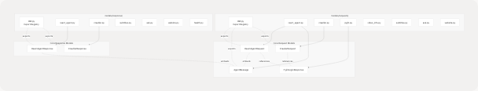
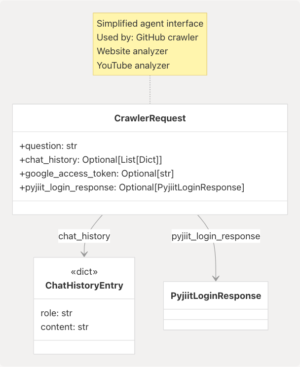

# Data Models and API Contracts

> Source: https://deepwiki.com/tashifkhan/agentic-browser/6-data-models-and-api-contracts

# Data Models and API Contracts

Relevant source files

* [agents/\_\_init\_\_.py](https://github.com/tashifkhan/agentic-browser/blob/e94826c4/agents/__init__.py)
* [models/requests/\_\_init\_\_.py](https://github.com/tashifkhan/agentic-browser/blob/e94826c4/models/requests/__init__.py)
* [models/requests/agent.py](https://github.com/tashifkhan/agentic-browser/blob/e94826c4/models/requests/agent.py)
* [models/requests/crawller.py](https://github.com/tashifkhan/agentic-browser/blob/e94826c4/models/requests/crawller.py)
* [models/requests/pyjiit.py](https://github.com/tashifkhan/agentic-browser/blob/e94826c4/models/requests/pyjiit.py)
* [models/requests/react\_agent.py](https://github.com/tashifkhan/agentic-browser/blob/e94826c4/models/requests/react_agent.py)
* [models/response/\_\_init\_\_.py](https://github.com/tashifkhan/agentic-browser/blob/e94826c4/models/response/__init__.py)
* [models/response/agent.py](https://github.com/tashifkhan/agentic-browser/blob/e94826c4/models/response/agent.py)
* [models/response/react\_agent.py](https://github.com/tashifkhan/agentic-browser/blob/e94826c4/models/response/react_agent.py)
* [prompts/browser\_use.py](https://github.com/tashifkhan/agentic-browser/blob/e94826c4/prompts/browser_use.py)
* [services/browser\_use\_service.py](https://github.com/tashifkhan/agentic-browser/blob/e94826c4/services/browser_use_service.py)
* [utils/agent\_sanitizer.py](https://github.com/tashifkhan/agentic-browser/blob/e94826c4/utils/agent_sanitizer.py)

## Purpose and Scope

This document catalogs the Pydantic models that define the API contracts for all endpoints in the Agentic Browser backend. These models provide runtime validation, serialization, and type safety for requests and responses flowing between the browser extension and the Python backend services.

For information about how these models are consumed by API endpoints, see [Service Integration Routers](/tashifkhan/agentic-browser/3.3-api-routers). For details on the agent execution flow that uses these models, see [React Agent Architecture](/tashifkhan/agentic-browser/4.1-react-agent-architecture).

---

## Model Architecture Overview

The data models are organized into two primary categories: request models that validate incoming payloads, and response models that structure outgoing data. All models inherit from Pydantic's `BaseModel` and leverage field validation, alias resolution, and serialization configuration.


```

**Sources:** [models/requests/\_\_init\_\_.py1-21](https://github.com/tashifkhan/agentic-browser/blob/e94826c4/models/requests/__init__.py#L1-L21) [models/response/\_\_init\_\_.py1-20](https://github.com/tashifkhan/agentic-browser/blob/e94826c4/models/response/__init__.py#L1-L20)

---

## Request Models

### AgentMessage

The `AgentMessage` model represents a single message in a conversation thread. It supports all standard message roles defined by the OpenAI chat completions format, with extensions for tool calling.

```

```

**Field Specifications:**

| Field | Type | Constraints | Description |
| --- | --- | --- | --- |
| `role` | `Literal["system", "user", "assistant", "tool"]` | Required | Message author type |
| `content` | `str` | `min_length=1` | Message text content |
| `name` | `Optional[str]` | - | Optional sender identifier |
| `tool_call_id` | `Optional[str]` | Alias: `toolCallId` | Associates tool results with calls |
| `tool_calls` | `Optional[List[Dict]]` | Alias: `toolCalls` | Tool invocations from assistant |

**Configuration:** The model uses `populate_by_name=True` to accept both snake\_case and camelCase field names, and `str_strip_whitespace=True` to clean input strings.

**Sources:** [models/requests/react\_agent.py10-25](https://github.com/tashifkhan/agentic-browser/blob/e94826c4/models/requests/react_agent.py#L10-L25)

---

### ReactAgentRequest

The `ReactAgentRequest` model defines the contract for the primary agent endpoint at `/api/genai/react`. It carries conversation history and optional authentication context for Google services and PyJIIT.

```

```

**Field Specifications:**

| Field | Type | Constraints | Aliases | Purpose |
| --- | --- | --- | --- | --- |
| `messages` | `List[AgentMessage]` | `min_length=1` | - | Conversation history including user query |
| `google_access_token` | `Optional[str]` | - | `google_acces_token` | OAuth token for Gmail/Calendar tools |
| `pyjiit_login_response` | `Optional[PyjiitLoginResponse]` | - | `pyjiit_login_responce` | PyJIIT session for student portal tools |

**Alias Resilience:** The model uses `AliasChoices` to handle common typos (`google_acces_token`, `pyjiit_login_responce`) while enforcing canonical serialization names. This prevents client-side typos from breaking API calls.

**Usage Context:** This model is consumed by the React agent router at [api/genai/react.py](https://github.com/tashifkhan/agentic-browser/blob/e94826c4/api/genai/react.py) which passes the credentials to `build_agent_tools()` for conditional tool loading.

**Sources:** [models/requests/react\_agent.py27-44](https://github.com/tashifkhan/agentic-browser/blob/e94826c4/models/requests/react_agent.py#L27-L44)

---

### CrawlerRequest

The `CrawlerRequest` model serves specialized crawling endpoints (GitHub, website analysis) that require a single question rather than full conversation context.

```

```

**Field Specifications:**

| Field | Type | Default | Description |
| --- | --- | --- | --- |
| `question` | `str` | Required | Single query to be answered |
| `chat_history` | `Optional[List[Dict]]` | `[]` | Optional prior conversation for context |
| `google_access_token` | `Optional[str]` | `None` | OAuth token (same aliases as `ReactAgentRequest`) |
| `pyjiit_login_response` | `Optional[PyjiitLoginResponse]` | `None` | PyJIIT session (same aliases as `ReactAgentRequest`) |

**Design Rationale:** The simplified `question` field (vs. full `messages` list) is optimized for single-turn interactions where the agent performs a specific analysis task rather than multi-turn conversation.

**Sources:** [models/requests/crawller.py1-27](https://github.com/tashifkhan/agentic-browser/blob/e94826c4/models/requests/crawller.py#L1-L27)

---

### PyJIIT Authentication Models

The PyJIIT integration requires a complex nested authentication payload returned by the JIIT student portal login API. These models deserialize and validate the portal's response structure.

#### PyjiitLoginResponse

The top-level response container that normalizes the portal's authentication data:

| Field | Type | Description |
| --- | --- | --- |
| `raw_response` | `PyjiitRawResponse` | Unmodified portal JSON |
| `regdata` | `PyjiitRegData` | Extracted registration metadata |
| `institute` | `Optional[str]` | Selected institute display name |
| `instituteid` | `Optional[str]` | Institute identifier |
| `memberid` | `Optional[str]` | Member ID bound to session |
| `userid` | `Optional[str]` | User identifier |
| `token` | `Optional[str]` | JWT session token |
| `expiry` | `Optional[datetime]` | Parsed token expiration |
| `clientid` | `Optional[str]` | Client session identifier |
| `membertype` | `Optional[str]` | Member type code (e.g., `"S"` for student) |
| `name` | `Optional[str]` | User display name |

#### PyjiitRegData

Nested registration metadata containing session credentials:

| Field | Type | Description |
| --- | --- | --- |
| `bypass` | `str` | Bypass flag |
| `clientid` | `str` | Client identifier |
| `userDOB` | `Optional[str]` | Date of birth (YYYY-MM-DD) |
| `name` | `Optional[str]` | Full name |
| `lastvisitdate` | `Optional[str]` | Last login timestamp |
| `membertype` | `Optional[str]` | Member type code |
| `enrollmentno` | `Optional[str]` | Enrollment number |
| `userid` | `Optional[str]` | User ID |
| `expiredpassword` | `Optional[str]` | Password expiry flag |
| `institutelist` | `List[PyjiitInstituteEntry]` | Available institutes |
| `memberid` | `Optional[str]` | Member ID |
| `token` | `Optional[str]` | JWT token |

#### PyjiitInstituteEntry

Represents a single institute in the user's available institute list:

```
```
class PyjiitInstituteEntry(BaseModel):
    label: str  # Display name
    value: str  # Institution identifier
```
```

**Sources:** [models/requests/pyjiit.py1-91](https://github.com/tashifkhan/agentic-browser/blob/e94826c4/models/requests/pyjiit.py#L1-L91)

---

### Additional Request Models

The system defines several other request models for specific services:

| Model | File | Purpose |
| --- | --- | --- |
| `VideoInfoRequest` | `video_info.py` | YouTube video metadata requests |
| `SubtitlesRequest` | `subtitles.py` | YouTube transcript extraction |
| `AskRequest` | `ask.py` | Question-answering over video transcripts |
| `WebsiteRequest` | `website.py` | Website content extraction requests |

**Sources:** [models/requests/\_\_init\_\_.py5-16](https://github.com/tashifkhan/agentic-browser/blob/e94826c4/models/requests/__init__.py#L5-L16)

---

## Response Models

### ReactAgentResponse

The `ReactAgentResponse` model packages the agent's final conversation state after tool execution and LLM response generation.

**Field Specifications:**

| Field | Type | Description |
| --- | --- | --- |
| `messages` | `List[AgentMessage]` | Complete conversation history including tool calls and results |
| `output` | `str` | Content of the final assistant message (convenience extraction) |

**Message Flow:** The `messages` array contains the full execution trace:

1. Original user message(s) from the request
2. Assistant's tool invocation message (if tools were called)
3. Tool result messages with `role="tool"`
4. Final assistant response synthesizing the results

The `output` field duplicates the `content` of the last assistant message for convenience, allowing clients to display just the response without parsing the message array.

**Sources:** [models/response/react\_agent.py1-15](https://github.com/tashifkhan/agentic-browser/blob/e94826c4/models/response/react_agent.py#L1-L15)

---

### Additional Response Models

Other response models follow similar patterns, wrapping service-specific outputs:

| Model | File | Purpose |
| --- | --- | --- |
| `SubtitlesResponse` | `subtitles.py` | YouTube transcript data |
| `AskResponse` | `ask.py` | LLM answer over video content |
| `HealthResponse` | `health.py` | Service health check status |
| `WebsiteResponse` | `website.py` | Extracted website markdown |
| `CrawllerResponse` | `crawller.py` | GitHub repository analysis results |

**Sources:** [models/response/\_\_init\_\_.py5-18](https://github.com/tashifkhan/agentic-browser/blob/e94826c4/models/response/__init__.py#L5-L18)

---

## API Contract Patterns

### Request Validation Flow

```

```

**Validation Stages:**

1. **Alias Resolution:** `AliasChoices` maps multiple input names to canonical field names
2. **Type Checking:** Pydantic enforces declared types and converts where possible
3. **Constraint Validation:** Field validators check `min_length`, `Literal` values, etc.
4. **Nested Model Validation:** Recursively validates embedded models like `PyjiitLoginResponse`
5. **String Normalization:** `str_strip_whitespace` cleans input strings

**Sources:** [models/requests/react\_agent.py27-44](https://github.com/tashifkhan/agentic-browser/blob/e94826c4/models/requests/react_agent.py#L27-L44) [models/requests/crawller.py8-27](https://github.com/tashifkhan/agentic-browser/blob/e94826c4/models/requests/crawller.py#L8-L27)

---

### Credential Context Propagation

Both `ReactAgentRequest` and `CrawlerRequest` accept optional credential payloads that enable conditional tool availability:

**Credential Handling:**

* **Google OAuth Token:** Passed directly to Gmail and Calendar API clients
* **PyJIIT Session:** Deserialized into `WebportalSession` for JIIT portal requests
* **Absence Behavior:** If credentials are missing, related tools are excluded from the agent's tool set

**Sources:** [models/requests/react\_agent.py29-40](https://github.com/tashifkhan/agentic-browser/blob/e94826c4/models/requests/react_agent.py#L29-L40) [models/requests/crawller.py13-24](https://github.com/tashifkhan/agentic-browser/blob/e94826c4/models/requests/crawller.py#L13-L24)

---

## Model Configuration

### Pydantic Settings

All models leverage Pydantic v2 configuration via `model_config` dictionaries:

```
```
# Common configuration pattern
model_config = {
    "populate_by_name": True,  # Accept both field names and aliases
    "str_strip_whitespace": True,  # Clean string inputs
}
```
```

**Configuration Options in Use:**

| Setting | Models | Effect |
| --- | --- | --- |
| `populate_by_name` | `AgentMessage`, `ReactAgentRequest`, `CrawlerRequest`, `PyjiitLoginResponse` | Allows clients to use either `tool_call_id` or `toolCallId` |
| `str_strip_whitespace` | `AgentMessage` | Removes leading/trailing whitespace from content |

**Sources:** [models/requests/react\_agent.py21-24](https://github.com/tashifkhan/agentic-browser/blob/e94826c4/models/requests/react_agent.py#L21-L24) [models/requests/react\_agent.py42-44](https://github.com/tashifkhan/agentic-browser/blob/e94826c4/models/requests/react_agent.py#L42-L44)

---

### Alias Resolution Strategy

The system uses three levels of alias handling:

1. **Simple Aliases:** Direct mapping using `Field(alias="...")`

   ```
   ```
   tool_call_id: Optional[str] = Field(default=None, alias="toolCallId")
   ```
   ```
2. **Multiple Alias Choices:** Fallback chain for common typos

   ```
   ```
   google_access_token: Optional[str] = Field(
       validation_alias=AliasChoices("google_access_token", "google_acces_token"),
       serialization_alias="google_access_token"
   )
   ```
   ```
3. **Bidirectional Naming:** Accept both forms, serialize to one

   ```
   ```
   # Model accepts: google_access_token OR google_acces_token
   # Model outputs: google_access_token (canonical)
   ```
   ```

**Design Rationale:** The alias system provides backward compatibility and typo resilience without sacrificing output consistency. This is particularly important for the extension-to-backend contract where JavaScript camelCase conventions meet Python snake\_case.

**Sources:** [models/requests/react\_agent.py14](https://github.com/tashifkhan/agentic-browser/blob/e94826c4/models/requests/react_agent.py#L14-L14) [models/requests/react\_agent.py29-34](https://github.com/tashifkhan/agentic-browser/blob/e94826c4/models/requests/react_agent.py#L29-L34) [models/requests/crawller.py13-17](https://github.com/tashifkhan/agentic-browser/blob/e94826c4/models/requests/crawller.py#L13-L17)

---

## Field Validation Rules

### String Constraints

```
```
# Minimum length enforcement
content: str = Field(..., min_length=1)

# Description metadata
google_access_token: Optional[str] = Field(
    default=None,
    description="OAuth access token with Gmail/Calendar scope."
)
```
```

### List Constraints

```
```
# Minimum element count
messages: List[AgentMessage] = Field(..., min_length=1)

# Default factory for optional lists
chat_history: Optional[list[dict[str, Any]]] = Field(
    default_factory=list,
    description="Optional chat transcript for context."
)
```

### Literal Types

```
```
# Enum-like constraint
role: Literal["system", "user", "assistant", "tool"]
```
```

**Sources:** [models/requests/react\_agent.py12](https://github.com/tashifkhan/agentic-browser/blob/e94826c4/models/requests/react_agent.py#L12-L12) [models/requests/react\_agent.py28](https://github.com/tashifkhan/agentic-browser/blob/e94826c4/models/requests/react_agent.py#L28-L28) [models/requests/crawller.py10-12](https://github.com/tashifkhan/agentic-browser/blob/e94826c4/models/requests/crawller.py#L10-L12)

---

## Type Safety and IDE Support

All models use explicit type hints compatible with Python 3.10+ type checkers:

```
```
from typing import Any, List, Literal, Optional
from pydantic import BaseModel, Field

class AgentMessage(BaseModel):
    role: Literal["system", "user", "assistant", "tool"]  # Exhaustive options
    content: str = Field(..., min_length=1)  # Required, non-empty
    tool_calls: Optional[List[Dict[str, Any]]] = None  # Nullable
```
```

**IDE Benefits:**

* Autocomplete for `role` values
* Type errors when passing wrong types to fields
* Null-safety checks via `Optional` markers
* Inline documentation from `Field(description="...")`

**Sources:** [models/requests/react\_agent.py10-19](https://github.com/tashifkhan/agentic-browser/blob/e94826c4/models/requests/react_agent.py#L10-L19)