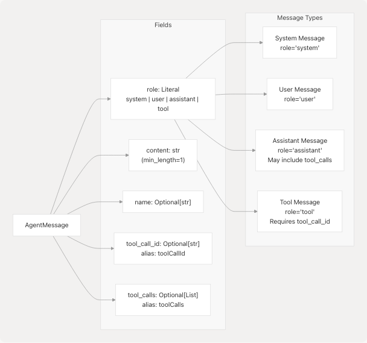
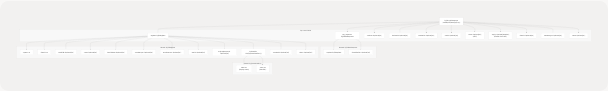

# Request Models

This page documents the Pydantic request models that define type-safe API contracts for the Agentic Browser system. These models validate and deserialize incoming HTTP request bodies across all API routers, ensuring data integrity and providing clear schemas for client implementations.

For response models, see [Response Models](6.2-response-models). For the API routers that consume these models, see [API Routers](3.3-api-routers).

---

## Overview

The request models are organized in the `models/requests/` directory and implement validation using Pydantic v2. All models use strict type checking, field validation, and alias support to handle variations in client-side field naming conventions (e.g., camelCase vs snake\_case).


**Sources:** [models/requests/react\_agent.py1-45](https://github.com/tashifkhan/agentic-browser/blob/e94826c4/models/requests/react_agent.py#L1-L45) [models/requests/crawller.py1-27](https://github.com/tashifkhan/agentic-browser/blob/e94826c4/models/requests/crawller.py#L1-L27) [models/requests/pyjiit.py1-91](https://github.com/tashifkhan/agentic-browser/blob/e94826c4/models/requests/pyjiit.py#L1-L91)

---

## React Agent Request Models

### ReactAgentRequest

The `ReactAgentRequest` model defines the input schema for the React Agent endpoint at `POST /api/genai/react`. This model supports conversational AI with tool use, including optional authentication for Gmail, Calendar, and PyJIIT integrations.

| Field | Type | Required | Description |
| --- | --- | --- | --- |
| `messages` | `List[AgentMessage]` | Yes | Conversation history with minimum 1 message |
| `google_access_token` | `Optional[str]` | No | OAuth token for Gmail/Calendar access |
| `pyjiit_login_response` | `Optional[PyjiitLoginResponse]` | No | PyJIIT session for webportal queries |

**Field Aliases:**

* `google_access_token` accepts `google_acces_token` (typo tolerance)
* `pyjiit_login_response` accepts `pyjiit_login_responce` (typo tolerance)

The model uses Pydantic's `AliasChoices` to support common misspellings, improving client compatibility. The `populate_by_name` configuration allows both the primary name and aliases during deserialization.

**Sources:** [models/requests/react\_agent.py27-44](https://github.com/tashifkhan/agentic-browser/blob/e94826c4/models/requests/react_agent.py#L27-L44)

### AgentMessage

The `AgentMessage` model represents individual messages in the conversation history. It supports four message roles aligned with the LangChain message types used by the React Agent system.



**Key Behaviors:**

* `content` is always required and must be non-empty after whitespace stripping
* `tool_call_id` is serialized as `toolCallId` for JSON responses (camelCase)
* `tool_calls` is serialized as `toolCalls` and contains structured tool invocation data
* The `str_strip_whitespace` configuration automatically removes leading/trailing spaces

**Tool Message Pattern:**
When the React Agent's LLM decides to invoke tools, it generates an `assistant` message with `tool_calls` populated. After tool execution, the results are appended as `tool` messages with matching `tool_call_id` values. This enables the ReAct loop described in [React Agent Architecture](4.1-react-agent-architecture).

**Sources:** [models/requests/react\_agent.py10-24](https://github.com/tashifkhan/agentic-browser/blob/e94826c4/models/requests/react_agent.py#L10-L24)

---

## Crawler Request Model

### CrawlerRequest

The `CrawlerRequest` model defines the input schema for the Browser Use Agent endpoint at `POST /api/agent`. This endpoint generates structured JSON action plans for browser automation tasks.

| Field | Type | Required | Description |
| --- | --- | --- | --- |
| `question` | `str` | Yes | User task description for script generation |
| `chat_history` | `Optional[list[dict[str, Any]]]` | No | Previous conversation context (default: empty list) |
| `google_access_token` | `Optional[str]` | No | OAuth token for Gmail/Calendar access |
| `pyjiit_login_response` | `Optional[PyjiitLoginResponse]` | No | PyJIIT session for webportal queries |

**Structural Similarity:**
Notice that `CrawlerRequest` shares the authentication fields (`google_access_token`, `pyjiit_login_response`) with `ReactAgentRequest`, including identical alias configurations. This consistency enables tool reuse across both agent systems.

**Differences from ReactAgentRequest:**

1. Uses `question: str` instead of `messages: List[AgentMessage]` for simpler single-turn interactions
2. `chat_history` uses raw dictionaries instead of typed `AgentMessage` objects
3. Primarily used for script generation rather than conversational tool use

**Sources:** [models/requests/crawller.py8-26](https://github.com/tashifkhan/agentic-browser/blob/e94826c4/models/requests/crawller.py#L8-L26)

---

## PyJIIT Authentication Models

The PyJIIT models represent the authentication state for JIIT (Jaypee Institute of Information Technology) webportal access. These models are nested within `ReactAgentRequest` and `CrawlerRequest` to enable authenticated queries to student data.

### Model Hierarchy



**Sources:** [models/requests/pyjiit.py9-91](https://github.com/tashifkhan/agentic-browser/blob/e94826c4/models/requests/pyjiit.py#L9-L91)

### PyjiitLoginResponse

The top-level authentication model containing both the raw webportal response and flattened convenience fields.

**Key Fields:**

* `raw_response`: Complete webportal response preserved for debugging
* `regdata`: Registration metadata duplicated at top level for convenience
* `token`: JWT token required for authenticated API calls
* `expiry`: Automatically parsed from the JWT payload for session management
* `institute` / `instituteid`: Selected campus for multi-institute accounts

**Usage Pattern:**
After successful PyJIIT authentication through the OAuth flow (see [PyJIIT Webportal Integration](3.3.5-pyjiit-webportal-integration)), the client receives a `PyjiitLoginResponse`. This entire object is then passed to subsequent agent requests (`ReactAgentRequest` or `CrawlerRequest`) to enable the `pyjiit_agent` tool.

**Sources:** [models/requests/pyjiit.py54-90](https://github.com/tashifkhan/agentic-browser/blob/e94826c4/models/requests/pyjiit.py#L54-L90)

### PyjiitRegData

Contains the registration and session metadata returned by the webportal's authentication endpoint.

**Critical Fields:**

* `clientid`: Session identifier used in subsequent API calls
* `token`: JWT token for authentication
* `memberid`: Unique member identifier
* `userid`: User identifier (often enrollment number)
* `institutelist`: Available campuses for multi-institute accounts
* `membertype`: User role (e.g., 'S' for student)

**Sources:** [models/requests/pyjiit.py14-44](https://github.com/tashifkhan/agentic-browser/blob/e94826c4/models/requests/pyjiit.py#L14-L44)

### PyjiitRawResponse

Wrapper for the raw JSON response from the webportal, containing `regdata` and optional linking identifiers.

**Sources:** [models/requests/pyjiit.py47-51](https://github.com/tashifkhan/agentic-browser/blob/e94826c4/models/requests/pyjiit.py#L47-L51)

### PyjiitInstituteEntry

Represents a single institute option in multi-campus scenarios.

| Field | Description |
| --- | --- |
| `label` | Human-readable institute name (e.g., "JIIT Noida") |
| `value` | Institute identifier code used in API requests |

**Sources:** [models/requests/pyjiit.py9-11](https://github.com/tashifkhan/agentic-browser/blob/e94826c4/models/requests/pyjiit.py#L9-L11)

---

## Common Patterns and Design Decisions

### Field Aliasing Strategy

Both `ReactAgentRequest` and `CrawlerRequest` implement typo-tolerant field aliasing using Pydantic's `AliasChoices`:

```
# Tolerates: google_access_token, google_acces_token
google_access_token: Optional[str] = Field(
    default=None,
    validation_alias=AliasChoices("google_access_token", "google_acces_token"),
    serialization_alias="google_access_token",
)

# Tolerates: pyjiit_login_response, pyjiit_login_responce
pyjiit_login_response: Optional[PyjiitLoginResponse] = Field(
    default=None,
    validation_alias=AliasChoices("pyjiit_login_response", "pyjiit_login_responce"),
    serialization_alias="pyjiit_login_response",
)
```

This design prevents client errors due to common spelling mistakes while maintaining canonical field names for serialization.

**Sources:** [models/requests/react\_agent.py29-40](https://github.com/tashifkhan/agentic-browser/blob/e94826c4/models/requests/react_agent.py#L29-L40) [models/requests/crawller.py13-24](https://github.com/tashifkhan/agentic-browser/blob/e94826c4/models/requests/crawller.py#L13-L24)

### Authentication Context Pattern

The shared authentication fields create a consistent pattern for tool availability:


This pattern enables dynamic tool construction in the agent system. If authentication context is absent, the corresponding tools are excluded from the agent's tool list. See [Dynamic Tool Construction and Context Management](4.4-dynamic-tool-construction-and-context-management) for implementation details.

**Sources:** [models/requests/react\_agent.py29-40](https://github.com/tashifkhan/agentic-browser/blob/e94826c4/models/requests/react_agent.py#L29-L40) [models/requests/crawller.py13-24](https://github.com/tashifkhan/agentic-browser/blob/e94826c4/models/requests/crawller.py#L13-L24)

### Whitespace Normalization

Models use `str_strip_whitespace: True` in their configuration to automatically clean user input:

```
model_config = {
    "populate_by_name": True,
    "str_strip_whitespace": True,
}
```

This prevents validation errors from accidental leading/trailing spaces in text fields.

**Sources:** [models/requests/react\_agent.py21-24](https://github.com/tashifkhan/agentic-browser/blob/e94826c4/models/requests/react_agent.py#L21-L24)

---

## Request Model Flow Through System


**Key Points:**

1. FastAPI automatically deserializes JSON bodies using type hints
2. Pydantic validation occurs before any service logic executes
3. Validation errors produce detailed 422 responses with field-level error messages
4. Services receive fully validated model instances with normalized data

**Sources:** [models/requests/react\_agent.py1-45](https://github.com/tashifkhan/agentic-browser/blob/e94826c4/models/requests/react_agent.py#L1-L45) [models/requests/crawller.py1-27](https://github.com/tashifkhan/agentic-browser/blob/e94826c4/models/requests/crawller.py#L1-L27)

---

## Summary Table

| Model | File | Primary Consumers | Key Features |
| --- | --- | --- | --- |
| `ReactAgentRequest` | [models/requests/react\_agent.py27-44](https://github.com/tashifkhan/agentic-browser/blob/e94826c4/models/requests/react_agent.py#L27-L44) | React Agent Router | Typed message list, conversation history |
| `AgentMessage` | [models/requests/react\_agent.py10-24](https://github.com/tashifkhan/agentic-browser/blob/e94826c4/models/requests/react_agent.py#L10-L24) | `ReactAgentRequest` | 4 role types, tool call support |
| `CrawlerRequest` | [models/requests/crawller.py8-26](https://github.com/tashifkhan/agentic-browser/blob/e94826c4/models/requests/crawller.py#L8-L26) | Browser Use Agent Router | Simple question string, raw chat history |
| `PyjiitLoginResponse` | [models/requests/pyjiit.py54-90](https://github.com/tashifkhan/agentic-browser/blob/e94826c4/models/requests/pyjiit.py#L54-L90) | Both agent requests | JWT token, session metadata, expiry tracking |
| `PyjiitRegData` | [models/requests/pyjiit.py14-44](https://github.com/tashifkhan/agentic-browser/blob/e94826c4/models/requests/pyjiit.py#L14-L44) | `PyjiitLoginResponse` | Registration data, institute list |
| `PyjiitRawResponse` | [models/requests/pyjiit.py47-51](https://github.com/tashifkhan/agentic-browser/blob/e94826c4/models/requests/pyjiit.py#L47-L51) | `PyjiitLoginResponse` | Raw webportal response wrapper |
| `PyjiitInstituteEntry` | [models/requests/pyjiit.py9-11](https://github.com/tashifkhan/agentic-browser/blob/e94826c4/models/requests/pyjiit.py#L9-L11) | `PyjiitRegData` | Institute selection data |

**Sources:** [models/requests/react\_agent.py1-45](https://github.com/tashifkhan/agentic-browser/blob/e94826c4/models/requests/react_agent.py#L1-L45) [models/requests/crawller.py1-27](https://github.com/tashifkhan/agentic-browser/blob/e94826c4/models/requests/crawller.py#L1-L27) [models/requests/pyjiit.py1-91](https://github.com/tashifkhan/agentic-browser/blob/e94826c4/models/requests/pyjiit.py#L1-L91)
