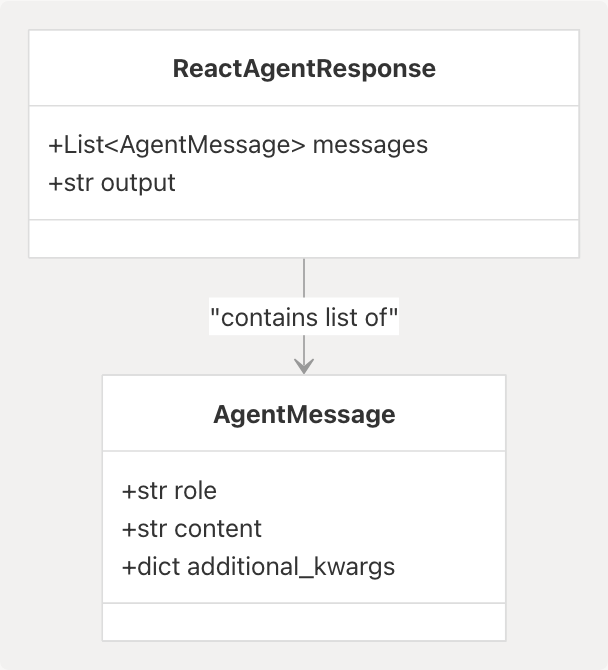
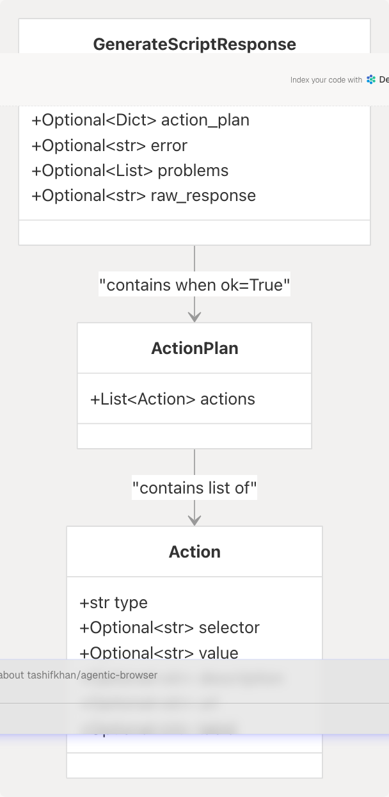
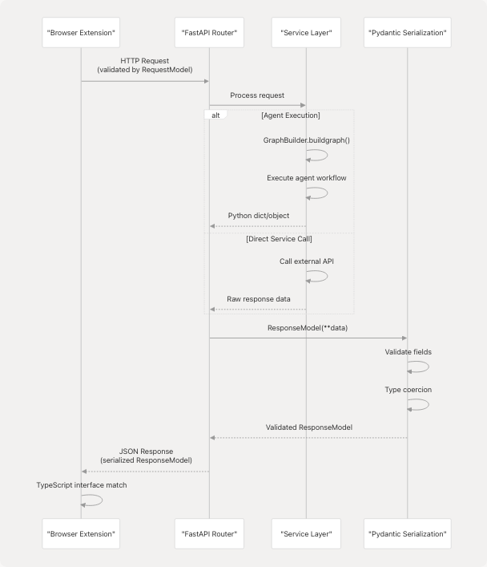
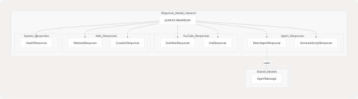
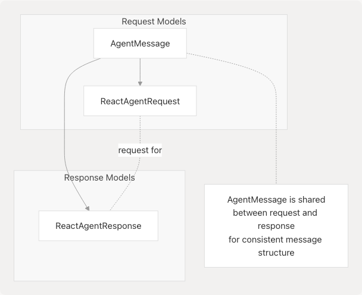

# Response Models

## Purpose and Scope

This page documents the Pydantic response models used throughout the Agentic Browser backend to serialize and validate data returned from API endpoints. These models define the structure of responses sent from the FastAPI application back to the browser extension and other clients.

The two primary agent response models are:

* **`ReactAgentResponse`**: Conversational AI results from the React Agent system
* **`GenerateScriptResponse`**: Browser automation action plans from the Browser Use Agent

For information about incoming request structures, see page 6.1. For details on the FastAPI routers that utilize these models, see page 3.2 and page 3.3.

**Sources:** [models/response/\_\_init\_\_.py1-20](https://github.com/tashifkhan/agentic-browser/blob/e94826c4/models/response/__init__.py#L1-L20) [models/response/agent.py1-11](https://github.com/tashifkhan/agentic-browser/blob/e94826c4/models/response/agent.py#L1-L11)

---

## Response Model Architecture

The response models are centrally defined in the `models/response/` package and provide type-safe serialization for all API outputs. Each service integration router returns its corresponding response model to ensure consistent data structures across the system.

### Response Model Registry


```

**Sources:** [models/response/\_\_init\_\_.py1-20](https://github.com/tashifkhan/agentic-browser/blob/e94826c4/models/response/__init__.py#L1-L20) [models/response/agent.py1-11](https://github.com/tashifkhan/agentic-browser/blob/e94826c4/models/response/agent.py#L1-L11)

---

## Response Model Catalog

The following table summarizes all response models in the `models/response` package:

| Model Class | Purpose | Primary Router | Key Fields |
| --- | --- | --- | --- |
| `ReactAgentResponse` | React Agent conversation results | `POST /api/genai/react` | `messages`, `output` |
| `GenerateScriptResponse` | Browser automation action plan | `POST /api/agent` | `ok`, `action_plan`, `error`, `problems` |
| `SubtitlesResponse` | YouTube transcript data | `POST /api/genai/youtube/subtitles` | Video subtitle content |
| `AskResponse` | YouTube Q&A answers | `POST /api/genai/youtube/ask` | AI-generated answers |
| `WebsiteResponse` | Processed web content | `POST /api/genai/website` | Markdown conversion |
| `CrawllerResponse` | GitHub repository analysis | `POST /api/genai/github` | Code structure data |
| `HealthResponse` | System health check | `GET /api/genai/health` | Service status |

**Sources:** [models/response/\_\_init\_\_.py5-18](https://github.com/tashifkhan/agentic-browser/blob/e94826c4/models/response/__init__.py#L5-L18) [models/response/agent.py1-11](https://github.com/tashifkhan/agentic-browser/blob/e94826c4/models/response/agent.py#L1-L11)

---

## ReactAgentResponse

The `ReactAgentResponse` model returns conversational AI results from the React Agent system via `POST /api/genai/react`. This model represents the output of LangGraph workflow execution with tool use.

### Structure



### Field Definitions

| Field | Type | Required | Description |
| --- | --- | --- | --- |
| `messages` | `List[AgentMessage]` | Yes | Complete conversation history including user messages, agent reasoning, and tool invocations |
| `output` | `str` | Yes | Content of the final assistant message extracted for direct access |

The `messages` field preserves the full `AgentState` from LangGraph's `StateGraph`, enabling stateful multi-turn conversations. The `output` field provides the agent's final answer without requiring message list parsing.

### Implementation

The model is defined at [models/response/react\_agent.py10-15](https://github.com/tashifkhan/agentic-browser/blob/e94826c4/models/response/react_agent.py#L10-L15):

```
class ReactAgentResponse(BaseModel):
    messages: List[AgentMessage] = Field(
        ..., description="Final conversation state including the agent reply."
    )
    output: str = Field(..., description="Content of the latest assistant message.")
```

**Sources:** [models/response/react\_agent.py1-15](https://github.com/tashifkhan/agentic-browser/blob/e94826c4/models/response/react_agent.py#L1-L15) [models/requests/\_\_init\_\_.py10](https://github.com/tashifkhan/agentic-browser/blob/e94826c4/models/requests/__init__.py#L10-L10)

---

## GenerateScriptResponse

The `GenerateScriptResponse` model returns browser automation action plans from the Browser Use Agent via `POST /api/agent`. This model wraps the structured JSON action plan generated by the LLM and validated by `sanitize_json_actions()`.

### Structure



### Field Definitions

| Field | Type | Required | Description |
| --- | --- | --- | --- |
| `ok` | `bool` | Yes | Success indicator: `True` if action plan generated successfully |
| `action_plan` | `Optional[Dict[str, Any]]` | No | Validated JSON action plan with `actions` array |
| `error` | `Optional[str]` | No | Error message if generation or validation failed |
| `problems` | `Optional[List[str]]` | No | List of validation problems from `sanitize_json_actions()` |
| `raw_response` | `Optional[str]` | No | First 1000 characters of LLM response (debugging) |

### Response States

The response follows two distinct patterns:

**Success Response (`ok=True`)**:

```
{
  "ok": true,
  "action_plan": {
    "actions": [
      {
        "type": "OPEN_TAB",
        "url": "https://www.google.com/search?q=flights",
        "active": true,
        "description": "Open new tab and search for flights"
      }
    ]
  }
}
```

**Failure Response (`ok=False`)**:

```
{
  "ok": false,
  "error": "Action plan failed validation.",
  "problems": [
    "Action 0: missing 'selector' field",
    "Action 1: invalid type 'INVALID_ACTION'"
  ],
  "raw_response": "{\"actions\": <FileRef file-url="https://github.com/tashifkhan/agentic-browser/blob/e94826c4/{\\\"type\\\"#LNaN-LNaN" NaN  file-path="{\\\"type\\\"">Hii</FileRef>:
- **DOM Actions**: `CLICK`, `TYPE`, `SCROLL`, `WAIT`, `SELECT`, `EXECUTE_SCRIPT`
- **Tab Control Actions**: `OPEN_TAB`, `CLOSE_TAB`, `SWITCH_TAB`, `NAVIGATE`, `RELOAD_TAB`, `DUPLICATE_TAB`

### Implementation

The model is defined at <FileRef file-url="https://github.com/tashifkhan/agentic-browser/blob/e94826c4/models/response/agent.py#L5-L11" min=5 max=11 file-path="models/response/agent.py">Hii</FileRef>:

```python
class GenerateScriptResponse(BaseModel):
    ok: bool
    action_plan: Optional[Dict[str, Any]] = None
    error: Optional[str] = None
    problems: Optional[List[str]] = None
    raw_response: Optional[str] = None
```

### Generation and Validation Flow


The `AgentService.generate_script()` method at [services/browser\_use\_service.py12-96](https://github.com/tashifkhan/agentic-browser/blob/e94826c4/services/browser_use_service.py#L12-L96) constructs the response by:

1. Formatting DOM structure information for the LLM prompt
2. Invoking the LLM with `SCRIPT_PROMPT` from [prompts/browser\_use.py5-123](https://github.com/tashifkhan/agentic-browser/blob/e94826c4/prompts/browser_use.py#L5-L123)
3. Sanitizing the raw LLM response with `sanitize_json_actions()` from [utils/agent\_sanitizer.py20-96](https://github.com/tashifkhan/agentic-browser/blob/e94826c4/utils/agent_sanitizer.py#L20-L96)
4. Returning a dictionary matching `GenerateScriptResponse` structure

### Validation Rules

The `sanitize_json_actions()` function validates:

* JSON structure has `actions` array
* Each action has valid `type` field
* DOM actions (CLICK, TYPE) require `selector` field
* TYPE actions require `value` field
* Tab control actions (OPEN\_TAB, NAVIGATE) require `url` field
* EXECUTE\_SCRIPT actions checked for dangerous patterns
* SWITCH\_TAB actions require `tabId` or `direction` field

Validation problems are returned in the `problems` field, allowing the client to diagnose LLM output issues.

**Sources:** [models/response/agent.py1-11](https://github.com/tashifkhan/agentic-browser/blob/e94826c4/models/response/agent.py#L1-L11) [services/browser\_use\_service.py12-96](https://github.com/tashifkhan/agentic-browser/blob/e94826c4/services/browser_use_service.py#L12-L96) [utils/agent\_sanitizer.py20-96](https://github.com/tashifkhan/agentic-browser/blob/e94826c4/utils/agent_sanitizer.py#L20-L96)

---

## Response Data Flow

The following diagram illustrates how response models fit into the request-response cycle of the Agentic Browser system:



**Sources:** [models/response/\_\_init\_\_.py1-20](https://github.com/tashifkhan/agentic-browser/blob/e94826c4/models/response/__init__.py#L1-L20) [models/response/react\_agent.py1-15](https://github.com/tashifkhan/agentic-browser/blob/e94826c4/models/response/react_agent.py#L1-L15)

---

## Response Model Features

### Pydantic Field Validation

All response models inherit from `pydantic.BaseModel`, providing automatic validation and serialization:

* **Type enforcement**: Fields are type-checked at runtime
* **JSON serialization**: Automatic conversion to JSON via FastAPI
* **Field descriptions**: Using `Field(..., description="...")` for API documentation
* **Default values**: Optional fields can specify defaults
* **Nested models**: Response models can contain other Pydantic models (e.g., `AgentMessage` within `ReactAgentResponse`)

### FastAPI Integration

FastAPI automatically:

1. Serializes response model instances to JSON
2. Generates OpenAPI schema documentation from model definitions
3. Includes field descriptions in API documentation
4. Validates response structure before sending to client

**Sources:** [models/response/react\_agent.py5-14](https://github.com/tashifkhan/agentic-browser/blob/e94826c4/models/response/react_agent.py#L5-L14)

---

## Response Model Organization



Response models are logically grouped by functionality:

* **Agent responses**: `ReactAgentResponse` (LangGraph workflow), `GenerateScriptResponse` (browser automation)
* **YouTube responses**: Video transcription and analysis results
* **Web responses**: HTML-to-markdown conversion and GitHub crawling
* **System responses**: Health checks and service status

**Sources:** [models/response/\_\_init\_\_.py5-18](https://github.com/tashifkhan/agentic-browser/blob/e94826c4/models/response/__init__.py#L5-L18) [models/response/agent.py1-11](https://github.com/tashifkhan/agentic-browser/blob/e94826c4/models/response/agent.py#L1-L11)

---

## Usage Patterns

### Router Implementation Patterns

**Pattern 1: Direct Model Instantiation**

Routers return response model instances directly with `response_model` parameter:

```
# ReactAgentResponse example
@router.post("/api/genai/react", response_model=ReactAgentResponse)
async def react_agent(request: ReactAgentRequest):
    result = await service.generate_answer(request)
    return ReactAgentResponse(
        messages=result["messages"],
        output=result["output"]
    )
```

**Pattern 2: Service-Level Dictionary Return**

The Browser Use Agent returns a raw dictionary from the service layer, which FastAPI validates against the response model:

```
# GenerateScriptResponse example at services/browser_use_service.py
async def generate_script(self, goal, target_url, dom_structure, constraints):
    # ... LLM generation and validation ...
    return {
        "ok": True,
        "action_plan": action_plan
    }
    # or
    return {
        "ok": False,
        "error": "Validation failed",
        "problems": problems,
        "raw_response": result[:1000]
    }
```

FastAPI automatically:

* Validates return values match the `response_model` structure
* Serializes models to JSON
* Includes model schemas in OpenAPI documentation
* Coerces dictionary returns to response model instances

### Client-Side Consumption

The browser extension receives strongly-typed JSON responses matching the Pydantic model structure:

```
// TypeScript interface mirrors ReactAgentResponse
interface ReactAgentResponse {
  messages: AgentMessage[];
  output: string;
}

// Fetch and parse response
const response = await fetch('/api/genai/react', {
  method: 'POST',
  body: JSON.stringify(request)
});
const data: ReactAgentResponse = await response.json();
```

**Sources:** [models/response/react\_agent.py10-15](https://github.com/tashifkhan/agentic-browser/blob/e94826c4/models/response/react_agent.py#L10-L15)

---

## Model Relationships

### Cross-Model Dependencies

```


The `AgentMessage` model is imported from `models.requests.react_agent` and reused in `ReactAgentResponse`, ensuring consistency between the conversation history sent in requests and received in responses. This allows the agent system to maintain stateful conversations across multiple API calls.

**Sources:** [models/response/react\_agent.py7](https://github.com/tashifkhan/agentic-browser/blob/e94826c4/models/response/react_agent.py#L7-L7) [models/requests/\_\_init\_\_.py10-19](https://github.com/tashifkhan/agentic-browser/blob/e94826c4/models/requests/__init__.py#L10-L19)

---

## Summary

Response models in the Agentic Browser system provide:

1. **Type Safety**: Pydantic validation ensures all API responses conform to expected structures
2. **Consistency**: Standardized response formats across all service integrations
3. **Documentation**: Automatic OpenAPI schema generation from model definitions
4. **Maintainability**: Centralized model definitions in `models/response/` package
5. **Client Integration**: Direct mapping to TypeScript interfaces in the browser extension

The six response models (`ReactAgentResponse`, `SubtitlesResponse`, `AskResponse`, `WebsiteResponse`, `CrawllerResponse`, `HealthResponse`) cover all API endpoints, with `ReactAgentResponse` serving as the primary interface for agent intelligence interactions.

**Sources:** [models/response/\_\_init\_\_.py1-20](https://github.com/tashifkhan/agentic-browser/blob/e94826c4/models/response/__init__.py#L1-L20) [models/response/react\_agent.py1-15](https://github.com/tashifkhan/agentic-browser/blob/e94826c4/models/response/react_agent.py#L1-L15)
