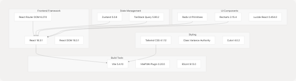
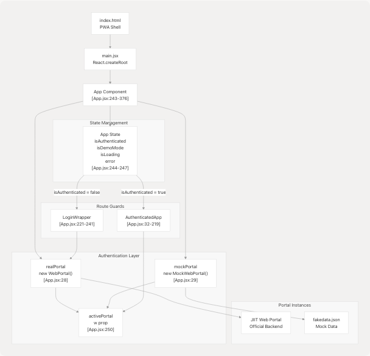
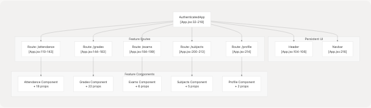

# Overview

Relevant source files

* [README.md](https://github.com/codeblech/jportal/blob/4df0fde4/README.md)
* [jportal/package-lock.json](https://github.com/codeblech/jportal/blob/4df0fde4/jportal/package-lock.json)
* [jportal/package.json](https://github.com/codeblech/jportal/blob/4df0fde4/jportal/package.json)
* [jportal/src/App.jsx](https://github.com/codeblech/jportal/blob/4df0fde4/jportal/src/App.jsx)
* [jportal/src/components/Login.jsx](https://github.com/codeblech/jportal/blob/4df0fde4/jportal/src/components/Login.jsx)
* [screenshots/mobile-8.png](https://github.com/codeblech/jportal/blob/4df0fde4/screenshots/mobile-8.png)

## Purpose and Scope

This document introduces JPortal, a Progressive Web Application (PWA) that serves as a modern replacement for the JIIT Web Portal. It covers the application's purpose, key features, technology stack, and high-level architecture.

For detailed setup and deployment instructions, see [Getting Started](/codeblech/jportal/2-getting-started). For in-depth architecture discussions, see [Architecture Overview](/codeblech/jportal/3-architecture-overview). For information about individual features, see [Feature Modules](/codeblech/jportal/4-feature-modules).

## What is JPortal

JPortal is a client-side Progressive Web App designed to provide JIIT students with an improved interface for accessing academic information. Unlike the official JIIT Web Portal, JPortal offers:

* **No CAPTCHA authentication** - Uses the `jsjiit` library to bypass CAPTCHA requirements
* **Modern UI** - Built with React and Radix UI primitives
* **Offline capability** - PWA features enable offline access
* **Customizable themes** - Extensive theming system with 15+ presets
* **Demo mode** - Test the application without credentials using mock data
* **Cross-platform** - Installable on Android, iOS, and Windows

The application is hosted on GitHub Pages at `https://codeblech.github.io/jportal` and deployed automatically via GitHub Actions.

**Sources:** [README.md1-61](https://github.com/codeblech/jportal/blob/4df0fde4/README.md#L1-L61) [jportal/package.json1-67](https://github.com/codeblech/jportal/blob/4df0fde4/jportal/package.json#L1-L67)

## Key Features

JPortal provides five primary feature modules accessible to authenticated users:

| Feature | Description | Key Functionality |
| --- | --- | --- |
| **Attendance** | Class attendance tracking | Overview/daily tabs, attendance goals, subject-level details, attendance prediction |
| **Grades** | Academic performance | SGPA/CGPA trends, grade cards, marks with PDF parsing |
| **Exams** | Examination schedules | Semester/event selection, schedule display |
| **Subjects** | Registered courses | Course information, credits, faculty details |
| **Profile** | Student information | Personal, academic, contact, family, and address data |
| **Analytics** | Usage statistics | Cloudflare analytics dashboard (public access) |

### Authentication Modes

The application supports two authentication modes, managed through the `App` component:

1. **Real Mode** - Authenticates against the official JIIT Web Portal using the `WebPortal` class from `jsjiit` library
2. **Demo Mode** - Uses `MockWebPortal` with static data from `fakedata.json` for testing and demonstration

**Sources:** [jportal/src/App.jsx1-377](https://github.com/codeblech/jportal/blob/4df0fde4/jportal/src/App.jsx#L1-L377) [README.md22-55](https://github.com/codeblech/jportal/blob/4df0fde4/README.md#L22-L55)

## Technology Stack

### Core Framework


```

**Key Dependencies Table**

| Category | Package | Version | Purpose |
| --- | --- | --- | --- |
| Authentication | `jsjiit` | 0.0.20 | JIIT Web Portal API client (CDN) |
| Forms | `react-hook-form` | 7.53.1 | Form state management |
| Validation | `zod` | 3.23.8 | Schema validation |
| Date Handling | `date-fns` | 3.6.0 | Date manipulation |
| Toast Notifications | `sonner` | 2.0.7 | Toast notifications |
| PDF Parsing | Pyodide + PyMuPDF | - | Client-side PDF processing |

**Sources:** [jportal/package.json15-44](https://github.com/codeblech/jportal/blob/4df0fde4/jportal/package.json#L15-L44)

## High-Level Architecture

### Application Entry Point and Authentication Flow

```

```

The `App` component ([App.jsx243-376](https://github.com/codeblech/jportal/blob/4df0fde4/App.jsx#L243-L376)) serves as the authentication gatekeeper:

1. On mount, attempts auto-login using stored credentials via `localStorage` ([App.jsx252-288](https://github.com/codeblech/jportal/blob/4df0fde4/App.jsx#L252-L288))
2. Renders `LoginWrapper` for unauthenticated users
3. Renders `AuthenticatedApp` for authenticated users
4. Passes the appropriate portal instance (`realPortal` or `mockPortal`) as the `w` prop

**Sources:** [jportal/src/App.jsx1-377](https://github.com/codeblech/jportal/blob/4df0fde4/jportal/src/App.jsx#L1-L377)

### Feature Module Organization

```

```

The `AuthenticatedApp` component manages all authenticated routes and serves as a central state hub. It maintains separate state slices for each feature module and passes them down via props (props drilling pattern). Each feature component receives:

* The `w` prop (portal instance)
* State variables specific to that feature
* State setter functions
* Shared UI state (loading, error states)

**Sources:** [jportal/src/App.jsx32-219](https://github.com/codeblech/jportal/blob/4df0fde4/jportal/src/App.jsx#L32-L219)

## Application Data Flow

### Portal Abstraction Layer

The application uses a **strategy pattern** for data access, allowing seamless switching between real and demo modes:

```


All feature components interact with the portal through a uniform interface, calling methods like:

* `w.get_attendance()`
* `w.get_grades()`
* `w.get_exam_events()`
* `w.get_registered_subjects()`
* `w.get_student_info()`

This abstraction enables offline development and testing while maintaining production compatibility.

**Sources:** [jportal/src/App.jsx18-29](https://github.com/codeblech/jportal/blob/4df0fde4/jportal/src/App.jsx#L18-L29) [jportal/src/App.jsx250](https://github.com/codeblech/jportal/blob/4df0fde4/jportal/src/App.jsx#L250-L250)

### State Persistence

State persistence is handled through multiple mechanisms:

| Data Type | Storage Method | Location in Code |
| --- | --- | --- |
| Credentials | `localStorage` (username, password) | [jportal/src/components/Login.jsx54-55](https://github.com/codeblech/jportal/blob/4df0fde4/jportal/src/components/Login.jsx#L54-L55) |
| Attendance Goal | `localStorage` | [jportal/src/App.jsx53-61](https://github.com/codeblech/jportal/blob/4df0fde4/jportal/src/App.jsx#L53-L61) |
| Theme Configuration | Zustand store (persisted) | Theme system components |
| API Response Cache | Component state | Feature module state variables |

**Sources:** [jportal/src/App.jsx53-61](https://github.com/codeblech/jportal/blob/4df0fde4/jportal/src/App.jsx#L53-L61) [jportal/src/components/Login.jsx54-55](https://github.com/codeblech/jportal/blob/4df0fde4/jportal/src/components/Login.jsx#L54-L55)

## PWA Architecture

JPortal is configured as a Progressive Web App using the VitePWA plugin:

### Service Worker and Caching Strategy

The application implements offline-first capabilities through:

1. **Static Asset Caching** - HTML, CSS, JS, and images
2. **Pyodide Runtime Caching** - Python runtime and wheel files for PDF parsing
3. **Manifest Configuration** - App metadata, icons, and theme colors

### Installation Targets

| Platform | Installation Method |
| --- | --- |
| Android (Chromium) | "Add to Home Screen" → "Install" |
| iOS (Safari) | Share button → "Add to Home Screen" |
| Windows | Install icon in URL bar |

The PWA configuration enables JPortal to function as a standalone application without requiring app store distribution.

**Sources:** [README.md39-44](https://github.com/codeblech/jportal/blob/4df0fde4/README.md#L39-L44)

## Theme System Overview

JPortal features an advanced theming system with:

* **15+ predefined theme presets** - Defined in `theme-presets.ts`
* **Light/Dark mode support** - Toggle with view transition animations
* **Dynamic font loading** - Google Fonts loaded on theme change
* **CSS custom properties** - Theme values mapped to Tailwind utilities
* **Zustand state management** - Global theme state persistence

The theme system integrates throughout the application via the `ThemeProvider`, `ThemeSelector`, and `DynamicFontLoader` components. For detailed theme architecture, see [Theme System](/codeblech/jportal/3.4-theme-system).

**Sources:** [jportal/src/App.jsx12-14](https://github.com/codeblech/jportal/blob/4df0fde4/jportal/src/App.jsx#L12-L14) High-level diagram analysis

## Navigation Structure

The application uses React Router DOM with hash-based routing (`HashRouter`):

### Public Routes

* `/stats` - Cloudflare Analytics Dashboard (no authentication required)

### Protected Routes (require authentication)

* `/` - Redirects to `/attendance`
* `/attendance` - Attendance tracking
* `/grades` - Academic performance
* `/exams` - Examination schedules
* `/subjects` - Registered courses
* `/profile` - Student information

Navigation is provided through:

* **Header** - Theme selector, logout button (top of screen)
* **Navbar** - Bottom navigation with 5 route links

**Sources:** [jportal/src/App.jsx107-216](https://github.com/codeblech/jportal/blob/4df0fde4/jportal/src/App.jsx#L107-L216)

## Getting Started

To begin using or developing JPortal:

* For installation and setup instructions, see [Getting Started](/codeblech/jportal/2-getting-started)
* For detailed architecture information, see [Architecture Overview](/codeblech/jportal/3-architecture-overview)
* For information about specific features, see [Feature Modules](/codeblech/jportal/4-feature-modules)
* For UI component documentation, see [UI Components](/codeblech/jportal/5-ui-components)
* For build and deployment processes, see [Build & Deployment](/codeblech/jportal/6-build-and-deployment)
* For development guidelines, see [Development Guide](/codeblech/jportal/7-development-guide)

**Sources:** README.md, package.json, App.jsx comprehensive analysis