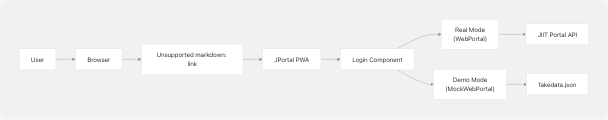
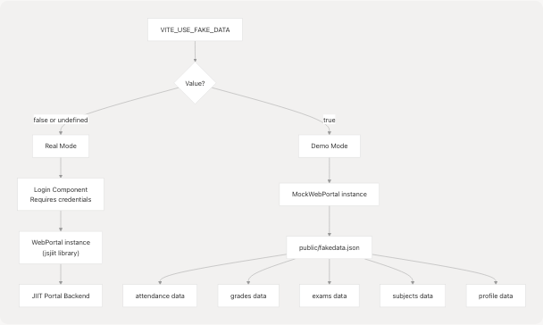
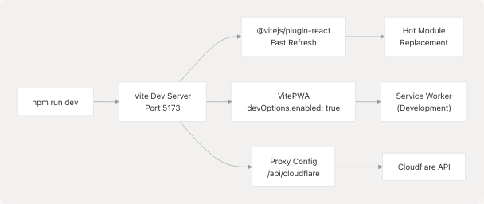
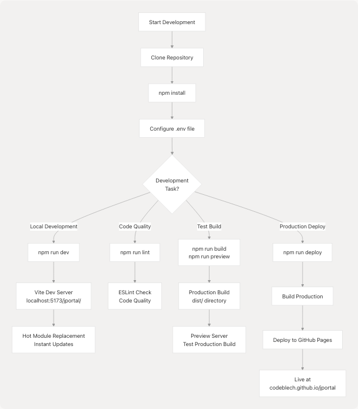

# Getting Started

Relevant source files

* [README.md](https://github.com/codeblech/jportal/blob/4df0fde4/README.md)
* [jportal/.env.example](https://github.com/codeblech/jportal/blob/4df0fde4/jportal/.env.example)
* [jportal/package-lock.json](https://github.com/codeblech/jportal/blob/4df0fde4/jportal/package-lock.json)
* [jportal/package.json](https://github.com/codeblech/jportal/blob/4df0fde4/jportal/package.json)
* [jportal/public/pwa-icons/j-yuvraj.svg](https://github.com/codeblech/jportal/blob/4df0fde4/jportal/public/pwa-icons/j-yuvraj.svg)
* [jportal/vite.config.ts](https://github.com/codeblech/jportal/blob/4df0fde4/jportal/vite.config.ts)
* [screenshots/mobile-8.png](https://github.com/codeblech/jportal/blob/4df0fde4/screenshots/mobile-8.png)

This document provides instructions for running JPortal locally for development, configuring the application, and deploying it. It covers installation of dependencies, environment configuration, development workflows, and building the Progressive Web App for production.

For information about the overall architecture and design patterns, see [Architecture Overview](/codeblech/jportal/3-architecture-overview). For details about individual feature modules, see [Feature Modules](/codeblech/jportal/4-feature-modules).

---

## Prerequisites

Before setting up JPortal locally, ensure you have the following installed:

| Requirement | Minimum Version | Purpose |
| --- | --- | --- |
| Node.js | 18.x or higher | JavaScript runtime |
| npm | 9.x or higher | Package manager |
| Git | Any recent version | Version control |
| Modern Browser | Latest Chrome/Firefox/Safari | Development and testing |

**Sources:** [jportal/package.json1-66](https://github.com/codeblech/jportal/blob/4df0fde4/jportal/package.json#L1-L66)

---

## Quick Start: Using the Live Application

JPortal is deployed as a Progressive Web App and can be accessed immediately without local setup.

### Accessing the Application

1. Navigate to <https://codeblech.github.io/jportal/>
2. Login with your JIIT credentials (real mode) or use demo mode


```

**Diagram 1: Application Access Flow**

**Sources:** [README.md36-38](https://github.com/codeblech/jportal/blob/4df0fde4/README.md#L36-L38) [jportal/package.json6](https://github.com/codeblech/jportal/blob/4df0fde4/jportal/package.json#L6-L6)

### Installing as PWA

JPortal can be installed on various platforms for app-like experience:

| Platform | Installation Steps |
| --- | --- |
| **Android (Chrome)** | 1. Tap the three-dot menu icon 2. Tap "Add to Home screen" 3. Press "Install" in the popup |
| **iOS (Safari)** | 1. Tap the Share button 2. Select "Add to Home Screen" 3. Tap "Add" |
| **Windows (Chrome/Edge)** | 1. Click the install icon in the URL bar 2. Click "Install" |

**Sources:** [README.md39-44](https://github.com/codeblech/jportal/blob/4df0fde4/README.md#L39-L44)

---

## Local Development Setup

### Step 1: Clone the Repository

```
```
git clone https://github.com/codeblech/jportal.git
cd jportal
```
```

### Step 2: Navigate to Project Directory

The main application code is located in the `jportal` subdirectory:

```
```
cd jportal
```
```

### Step 3: Install Dependencies

```
```
npm install
```
```

This installs all dependencies defined in [jportal/package.json15-43](https://github.com/codeblech/jportal/blob/4df0fde4/jportal/package.json#L15-L43) including:

* **React 18.3.1** - UI framework
* **Vite 5.4.10** - Build tool and dev server
* **VitePWA 0.20.5** - Progressive Web App plugin
* **Radix UI** - Accessible component primitives
* **TanStack Query** - Server state management
* **Zustand** - Theme state management

```

```

**Diagram 2: Dependency Installation Process**

**Sources:** [jportal/package.json15-65](https://github.com/codeblech/jportal/blob/4df0fde4/jportal/package.json#L15-L65)

---

## Environment Configuration

JPortal uses environment variables for configuration. Create a `.env` file in the `jportal` directory.

### Creating the Environment File

Copy the example file:

```
```
cp .env.example .env
```
```

### Environment Variables

| Variable | Purpose | Default | Required |
| --- | --- | --- | --- |
| `VITE_USE_FAKE_DATA` | Enable demo mode with mock data | `false` | No |
| `VITE_CLOUDFLARE_API_TOKEN` | Cloudflare Analytics API token | (example token) | For stats page |
| `VITE_CLOUDFLARE_PROXY_URL` | CORS proxy for Cloudflare API | (worker URL) | For stats page |
| `VITE_CLOUDFLARE_BASE_URL` | Cloudflare GraphQL endpoint | `https://api.cloudflare.com/client/v4/graphql` | For stats page |
| `VITE_CLOUDFLARE_ACCOUNT_TAG` | Cloudflare account identifier | (example tag) | For stats page |
| `VITE_CLOUDFLARE_SITE_TAG` | Cloudflare site identifier | (example tag) | For stats page |

**Configuration File Structure:**

```
VITE_USE_FAKE_DATA=false
VITE_CLOUDFLARE_API_TOKEN=your_token_here
VITE_CLOUDFLARE_PROXY_URL=https://cors-header-proxy.my-malikyash.workers.dev
VITE_CLOUDFLARE_BASE_URL=https://api.cloudflare.com/client/v4/graphql
VITE_CLOUDFLARE_ACCOUNT_TAG=your_account_tag
VITE_CLOUDFLARE_SITE_TAG=your_site_tag
```

**Sources:** [jportal/.env.example1-7](https://github.com/codeblech/jportal/blob/4df0fde4/jportal/.env.example#L1-L7)

### Demo Mode vs Real Mode

The `VITE_USE_FAKE_DATA` variable controls which data source the application uses:

```

```

**Diagram 3: Mode Selection and Data Flow**

The mode is determined in `App.jsx` where either `WebPortal` or `MockWebPortal` is instantiated based on the environment variable.

**Sources:** [jportal/.env.example1](https://github.com/codeblech/jportal/blob/4df0fde4/jportal/.env.example#L1-L1) [jportal/vite.config.ts10](https://github.com/codeblech/jportal/blob/4df0fde4/jportal/vite.config.ts#L10-L10)

---

## Running the Application

### Development Server

Start the Vite development server with hot module replacement:

```
```
npm run dev
```
```

This executes the `dev` script defined in [jportal/package.json8](https://github.com/codeblech/jportal/blob/4df0fde4/jportal/package.json#L8-L8) The application will be available at:

* Local: `http://localhost:5173/jportal/`
* Network: `http://<your-ip>:5173/jportal/`

**Note:** The base path `/jportal/` is configured in [jportal/vite.config.ts13](https://github.com/codeblech/jportal/blob/4df0fde4/jportal/vite.config.ts#L13-L13)

```

```

**Diagram 4: Development Server Architecture**

**Sources:** [jportal/package.json8](https://github.com/codeblech/jportal/blob/4df0fde4/jportal/package.json#L8-L8) [jportal/vite.config.ts1-99](https://github.com/codeblech/jportal/blob/4df0fde4/jportal/vite.config.ts#L1-L99)

### Development Server Features

The Vite configuration provides:

1. **Hot Module Replacement (HMR)** - Instant updates without full page reload
2. **PWA in Development** - Service worker enabled via `devOptions.enabled: true` ([jportal/vite.config.ts20-22](https://github.com/codeblech/jportal/blob/4df0fde4/jportal/vite.config.ts#L20-L22))
3. **API Proxy** - Cloudflare API proxy to avoid CORS issues ([jportal/vite.config.ts81-96](https://github.com/codeblech/jportal/blob/4df0fde4/jportal/vite.config.ts#L81-L96))
4. **Path Aliases** - `@/` resolves to `./src` ([jportal/vite.config.ts76-78](https://github.com/codeblech/jportal/blob/4df0fde4/jportal/vite.config.ts#L76-L78))

### Preview Production Build

To preview the production build locally:

```
```
npm run build
npm run preview
```
```

The `preview` command serves the `dist/` directory on a local server.

**Sources:** [jportal/package.json9-11](https://github.com/codeblech/jportal/blob/4df0fde4/jportal/package.json#L9-L11)

### Linting

Run ESLint to check code quality:

```
```
npm run lint
```
```

**Sources:** [jportal/package.json10](https://github.com/codeblech/jportal/blob/4df0fde4/jportal/package.json#L10-L10)

---

## Building for Production

### Build Process

Create an optimized production build:

```
```
npm run build
```
```

This command:

1. Compiles TypeScript to JavaScript
2. Bundles React components with Vite
3. Minifies and tree-shakes code
4. Generates PWA manifest and service worker
5. Outputs to `dist/` directory

```

```

**Diagram 5: Production Build Pipeline**

**Sources:** [jportal/package.json9](https://github.com/codeblech/jportal/blob/4df0fde4/jportal/package.json#L9-L9) [jportal/vite.config.ts17-73](https://github.com/codeblech/jportal/blob/4df0fde4/jportal/vite.config.ts#L17-L73)

### Build Configuration Details

The production build is configured in [jportal/vite.config.ts1-99](https://github.com/codeblech/jportal/blob/4df0fde4/jportal/vite.config.ts#L1-L99) with:

#### PWA Configuration

* **Register Type:** `autoUpdate` - Automatically updates service worker
* **Inject Register:** `auto` - Automatically injects service worker registration
* **Maximum Cache Size:** 30MB ([jportal/vite.config.ts24](https://github.com/codeblech/jportal/blob/4df0fde4/jportal/vite.config.ts#L24-L24))
* **Glob Patterns:** Caches all `*.js`, `*.css`, `*.html`, `*.ico`, `*.png`, `*.svg`, `*.whl` files

#### Cached Resources

The service worker pre-caches:

1. **Pyodide Runtime:** `https://cdn.jsdelivr.net/pyodide/v0.23.4/full/pyodide.js`
2. **Python Wheels:**
   * `/jportal/artifact/jiit_marks-0.2.0-py3-none-any.whl`
   * `/jportal/artifact/PyMuPDF-1.24.12-cp311-abi3-emscripten_3_1_32_wasm32.whl`

These are used by the Grades module for client-side PDF parsing.

**Sources:** [jportal/vite.config.ts23-42](https://github.com/codeblech/jportal/blob/4df0fde4/jportal/vite.config.ts#L23-L42)

#### Manifest Configuration

The PWA manifest ([jportal/vite.config.ts44-72](https://github.com/codeblech/jportal/blob/4df0fde4/jportal/vite.config.ts#L44-L72)) defines:

```
```
{
  "name": "JPortal",
  "short_name": "JPortal",
  "start_url": "/jportal/",
  "display": "standalone",
  "background_color": "#191c20",
  "theme_color": "#191c20",
  "orientation": "portrait",
  "icons": [...]
}
```
```

**Sources:** [jportal/vite.config.ts44-72](https://github.com/codeblech/jportal/blob/4df0fde4/jportal/vite.config.ts#L44-L72)

---

## Deployment

### Deploying to GitHub Pages

JPortal uses `gh-pages` for automated deployment:

```
```
npm run deploy
```
```

This command:

1. Runs `npm run build` (via `predeploy` hook)
2. Deploys the `dist/` directory to the `gh-pages` branch
3. Makes the app available at `https://codeblech.github.io/jportal`

```

```

**Diagram 6: Deployment Process**

**Sources:** [jportal/package.json12-13](https://github.com/codeblech/jportal/blob/4df0fde4/jportal/package.json#L12-L13)

### Deployment Configuration

Key configuration for GitHub Pages:

| Setting | Value | File Reference |
| --- | --- | --- |
| Homepage URL | `https://codeblech.github.io/jportal` | [jportal/package.json6](https://github.com/codeblech/jportal/blob/4df0fde4/jportal/package.json#L6-L6) |
| Base Path | `/jportal/` | [jportal/vite.config.ts13](https://github.com/codeblech/jportal/blob/4df0fde4/jportal/vite.config.ts#L13-L13) |
| Deploy Command | `gh-pages -d dist` | [jportal/package.json13](https://github.com/codeblech/jportal/blob/4df0fde4/jportal/package.json#L13-L13) |
| Build Output | `dist/` directory | [jportal/vite.config.ts9-99](https://github.com/codeblech/jportal/blob/4df0fde4/jportal/vite.config.ts#L9-L99) |

**Sources:** [jportal/package.json6-13](https://github.com/codeblech/jportal/blob/4df0fde4/jportal/package.json#L6-L13) [jportal/vite.config.ts13](https://github.com/codeblech/jportal/blob/4df0fde4/jportal/vite.config.ts#L13-L13)

---

## Development Workflow Summary

```


**Diagram 7: Complete Development Workflow**

**Sources:** [jportal/package.json7-13](https://github.com/codeblech/jportal/blob/4df0fde4/jportal/package.json#L7-L13)

---

## Common Commands Reference

| Command | Purpose | When to Use |
| --- | --- | --- |
| `npm install` | Install all dependencies | Initial setup, after pulling changes |
| `npm run dev` | Start development server | Active development |
| `npm run build` | Create production build | Before deployment, testing build |
| `npm run preview` | Preview production build | Test production build locally |
| `npm run lint` | Run ESLint | Code quality checks, before commits |
| `npm run deploy` | Deploy to GitHub Pages | Production deployment |

**Sources:** [jportal/package.json7-13](https://github.com/codeblech/jportal/blob/4df0fde4/jportal/package.json#L7-L13)

---

## Project Structure Overview

After setup, the project structure is:

```
jportal/
├── public/              # Static assets
│   ├── fakedata.json   # Mock data for demo mode
│   ├── pwa-icons/      # PWA icons
│   └── artifact/       # Python wheels for PDF parsing
├── src/                # Application source code
│   ├── components/     # React components
│   ├── lib/           # Utilities and helpers
│   └── main.jsx       # Application entry point
├── .env               # Environment variables (create from .env.example)
├── package.json       # Dependencies and scripts
├── vite.config.ts     # Vite and PWA configuration
└── index.html         # HTML shell for PWA
```

**Sources:** [jportal/package.json1-66](https://github.com/codeblech/jportal/blob/4df0fde4/jportal/package.json#L1-L66) [jportal/vite.config.ts1-99](https://github.com/codeblech/jportal/blob/4df0fde4/jportal/vite.config.ts#L1-L99)

---

## Next Steps

After completing the setup:

1. **Understand the Architecture** - See [Architecture Overview](/codeblech/jportal/3-architecture-overview) for system design patterns
2. **Explore Feature Modules** - See [Feature Modules](/codeblech/jportal/4-feature-modules) for detailed component documentation
3. **Learn the Theme System** - See [Theme System](/codeblech/jportal/3.4-theme-system) for customization options
4. **Review State Management** - See [State Management Strategy](/codeblech/jportal/3.2-state-management-strategy) for data flow patterns
5. **Study the Build Pipeline** - See [Build & Deployment](/codeblech/jportal/6-build-and-deployment) for advanced build configuration

**Sources:** [README.md1-61](https://github.com/codeblech/jportal/blob/4df0fde4/README.md#L1-L61) [jportal/package.json1-66](https://github.com/codeblech/jportal/blob/4df0fde4/jportal/package.json#L1-L66) [jportal/vite.config.ts1-99](https://github.com/codeblech/jportal/blob/4df0fde4/jportal/vite.config.ts#L1-L99)