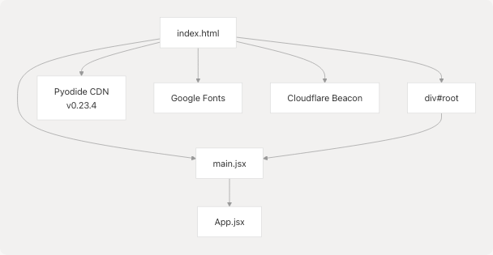
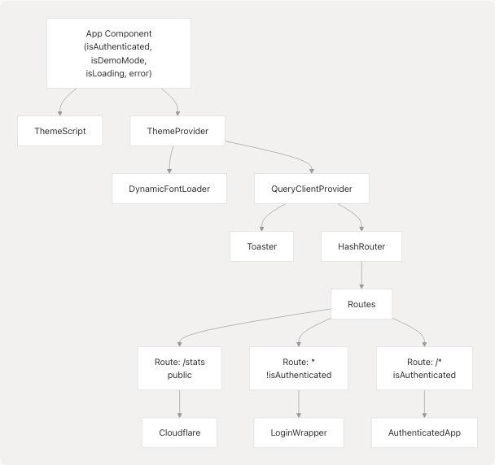
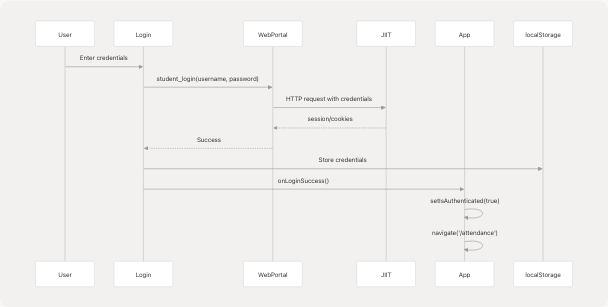
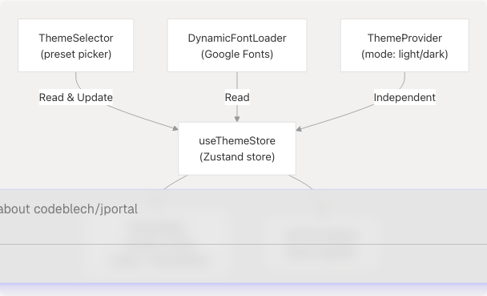
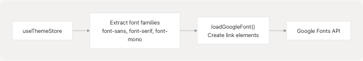
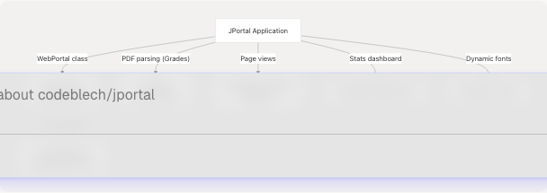

# Architecture Overview

Relevant source files

* [jportal/index.html](https://github.com/codeblech/jportal/blob/4df0fde4/jportal/index.html)
* [jportal/package-lock.json](https://github.com/codeblech/jportal/blob/4df0fde4/jportal/package-lock.json)
* [jportal/package.json](https://github.com/codeblech/jportal/blob/4df0fde4/jportal/package.json)
* [jportal/src/App.jsx](https://github.com/codeblech/jportal/blob/4df0fde4/jportal/src/App.jsx)
* [jportal/src/components/DynamicFontLoader.tsx](https://github.com/codeblech/jportal/blob/4df0fde4/jportal/src/components/DynamicFontLoader.tsx)
* [jportal/src/components/Login.jsx](https://github.com/codeblech/jportal/blob/4df0fde4/jportal/src/components/Login.jsx)
* [jportal/src/utils/fonts.ts](https://github.com/codeblech/jportal/blob/4df0fde4/jportal/src/utils/fonts.ts)

## Purpose and Scope

This document describes the high-level architecture of JPortal, including the technology stack, application structure, component organization, routing system, and key design patterns. For detailed information about specific subsystems, refer to:

* Authentication flow and routing: [Application Structure & Authentication](/codeblech/jportal/3.1-application-structure-and-authentication)
* State management patterns: [State Management Strategy](/codeblech/jportal/3.2-state-management-strategy)
* Data access layer: [Data Layer & API Integration](/codeblech/jportal/3.3-data-layer-and-api-integration)
* Theme infrastructure: [Theme System](/codeblech/jportal/3.4-theme-system)
* Individual feature modules: [Feature Modules](/codeblech/jportal/4-feature-modules)

## Technology Stack

JPortal is built as a single-page application (SPA) using modern web technologies:

| Category | Technologies | Purpose |
| --- | --- | --- |
| **Frontend Framework** | React 18.3.1 | UI component library and rendering |
| **Build Tool** | Vite 5.4.10 | Development server and production bundler |
| **Routing** | React Router DOM 6.27.0 | Client-side navigation with `HashRouter` |
| **UI Components** | Radix UI primitives | Accessible, unstyled component primitives |
| **Styling** | Tailwind CSS 4.1.12, Class Variance Authority | Utility-first CSS framework with component variants |
| **State Management** | React hooks (useState, useEffect), Zustand 5.0.8 | Local state + global theme store |
| **Forms** | React Hook Form 7.53.1, Zod 3.23.8 | Form handling and validation |
| **Data Visualization** | Recharts 2.15.4 | Charts for grades and analytics |
| **Server State** | TanStack Query 5.90.2 | Available but minimally used |
| **PWA** | VitePWA Plugin 0.20.5, Workbox | Offline capabilities and installability |
| **External APIs** | jsjiit 0.0.20 (CDN), Pyodide 0.23.4 | JIIT portal integration, Python in browser |

**Sources:** [package.json1-66](https://github.com/codeblech/jportal/blob/4df0fde4/package.json#L1-L66) [index.html1-25](https://github.com/codeblech/jportal/blob/4df0fde4/index.html#L1-L25)

## Application Entry Point and Bootstrap

### HTML and Script Loading

The application bootstraps from `index.html`, which defines critical resources:


```

**Sources:** [index.html1-25](https://github.com/codeblech/jportal/blob/4df0fde4/index.html#L1-L25)

### Main Entry Point

The `main.jsx` file renders the root `App` component into the DOM:

```

```

**Sources:** [src/main.jsx1-10](https://github.com/codeblech/jportal/blob/4df0fde4/src/main.jsx#L1-L10) (implied from standard Vite React setup)

## Application Architecture

### Top-Level Component Structure

The `App` component serves as the authentication gatekeeper and application shell:

```

```

**Key State Variables in App:**

* `isAuthenticated`: Boolean indicating user authentication status
* `isDemoMode`: Boolean determining whether to use `mockPortal` or `realPortal`
* `isLoading`: Boolean for auto-login attempt on mount
* `error`: String for displaying login errors

**Sources:** [src/App.jsx243-376](https://github.com/codeblech/jportal/blob/4df0fde4/src/App.jsx#L243-L376)

### Portal Instance Management

Two portal instances are created at the module level and conditionally passed to child components:

```

```

**Sources:** [src/App.jsx18-30](https://github.com/codeblech/jportal/blob/4df0fde4/src/App.jsx#L18-L30) [src/App.jsx250](https://github.com/codeblech/jportal/blob/4df0fde4/src/App.jsx#L250-L250) [src/App.jsx350](https://github.com/codeblech/jportal/blob/4df0fde4/src/App.jsx#L350-L350) [src/App.jsx360](https://github.com/codeblech/jportal/blob/4df0fde4/src/App.jsx#L360-L360)

## Routing Architecture

### Route Structure

JPortal uses `HashRouter` for client-side routing with route guards based on authentication:

```

```

**Sources:** [src/App.jsx334-367](https://github.com/codeblech/jportal/blob/4df0fde4/src/App.jsx#L334-L367) [src/App.jsx107-216](https://github.com/codeblech/jportal/blob/4df0fde4/src/App.jsx#L107-L216)

### AuthenticatedApp Internal Routing

The `AuthenticatedApp` component defines protected routes and provides global UI chrome:

```

```

**Sources:** [src/App.jsx102-218](https://github.com/codeblech/jportal/blob/4df0fde4/src/App.jsx#L102-L218)

## State Management Architecture

### State Hierarchy

JPortal implements a hierarchical state management pattern with extensive props drilling:

```

```

**State Persistence:**

* `attendanceGoal`: Saved to `localStorage` with default value of 75
* Login credentials: Stored in `localStorage` for auto-login

**Sources:** [src/App.jsx32-101](https://github.com/codeblech/jportal/blob/4df0fde4/src/App.jsx#L32-L101) [src/App.jsx52-61](https://github.com/codeblech/jportal/blob/4df0fde4/src/App.jsx#L52-L61)

### State Flow to Feature Components

All feature states are passed as props to their respective components:

```

```

**Sources:** [src/App.jsx110-214](https://github.com/codeblech/jportal/blob/4df0fde4/src/App.jsx#L110-L214)

## Data Access Layer: Portal Abstraction

### Portal Strategy Pattern

The application uses a strategy pattern through the `w` prop to abstract data access:

```

```

**Common Portal Methods:**

* `student_login(username, password)`
* `get_attendance(stud_id, sem_id)`
* `get_grades()`
* `get_subject_faculty(stud_id, sem_id)`
* `get_exam_schedule()`
* `get_header()`
* `get_exam_events()`
* Additional methods for marks and grade cards

**Sources:** [src/App.jsx18](https://github.com/codeblech/jportal/blob/4df0fde4/src/App.jsx#L18-L18) [src/components/Login.jsx24](https://github.com/codeblech/jportal/blob/4df0fde4/src/components/Login.jsx#L24-L24) [src/components/MockWebPortal.jsx1-200](https://github.com/codeblech/jportal/blob/4df0fde4/src/components/MockWebPortal.jsx#L1-L200) (implied)

### Login Flow

```

```

**Auto-Login on Mount:**
The `App` component attempts auto-login using stored credentials in `localStorage`:

**Sources:** [src/App.jsx252-288](https://github.com/codeblech/jportal/blob/4df0fde4/src/App.jsx#L252-L288) [src/components/Login.jsx46-87](https://github.com/codeblech/jportal/blob/4df0fde4/src/components/Login.jsx#L46-L87)

## Theme Infrastructure

### Theme State Management with Zustand

The theme system uses Zustand for global state, separate from React component state:

```

```

**Sources:** [src/stores/theme-store.ts1-50](https://github.com/codeblech/jportal/blob/4df0fde4/src/stores/theme-store.ts#L1-L50) (implied), [src/components/DynamicFontLoader.tsx1-34](https://github.com/codeblech/jportal/blob/4df0fde4/src/components/DynamicFontLoader.tsx#L1-L34)

### Dynamic Font Loading

The `DynamicFontLoader` component monitors theme changes and loads Google Fonts dynamically:

```

```

**Key Functions:**

* `extractFontFamily(fontFamilyValue)`: Parses CSS font-family string, filters out system fonts
* `buildFontCssUrl(family, weights)`: Constructs Google Fonts API URL
* `loadGoogleFont(family, weights)`: Injects `<link>` element into document head

**Default Font Weights:** `["400", "500", "600", "700"]`

**Sources:** [src/components/DynamicFontLoader.tsx1-34](https://github.com/codeblech/jportal/blob/4df0fde4/src/components/DynamicFontLoader.tsx#L1-L34) [src/utils/fonts.ts1-35](https://github.com/codeblech/jportal/blob/4df0fde4/src/utils/fonts.ts#L1-L35)

## Component Architecture Patterns

### Feature Module Pattern

All feature modules follow a consistent pattern:

| Aspect | Implementation |
| --- | --- |
| **Props Interface** | Receive `w` (portal), state variables, and setters from `AuthenticatedApp` |
| **Data Fetching** | Call `w.method()` in `useEffect` hooks |
| **State Updates** | Use setter props to update parent state |
| **Caching** | Store fetched data in parent state to avoid re-fetching |
| **Loading States** | Manage via boolean state variables (e.g., `gradesLoading`) |
| **Error Handling** | Try/catch blocks with error state variables |

**Example: Attendance Component Props**

```
w, attendanceData, setAttendanceData, semestersData, setSemestersData,
selectedSem, setSelectedSem, attendanceGoal, setAttendanceGoal,
subjectAttendanceData, setSubjectAttendanceData, selectedSubject,
setSelectedSubject, isAttendanceMetaLoading, setIsAttendanceMetaLoading,
isAttendanceDataLoading, setIsAttendanceDataLoading, activeTab,
setActiveTab, dailyDate, setDailyDate, calendarOpen, setCalendarOpen,
isTrackerOpen, setIsTrackerOpen, subjectCacheStatus, setSubjectCacheStatus
```

**Sources:** [src/App.jsx110-142](https://github.com/codeblech/jportal/blob/4df0fde4/src/App.jsx#L110-L142)

### Global UI Components

```

```

The `Header` component handles theme switching and logout. The `Navbar` provides bottom navigation to feature routes.

**Sources:** [src/components/Header.jsx1-100](https://github.com/codeblech/jportal/blob/4df0fde4/src/components/Header.jsx#L1-L100) (implied), [src/components/Navbar.jsx1-100](https://github.com/codeblech/jportal/blob/4df0fde4/src/components/Navbar.jsx#L1-L100) (implied)

## External Service Integration

### Service Dependencies

```

```

**jsjiit Library Usage:**

* Imported via CDN: `https://cdn.jsdelivr.net/npm/jsjiit@0.0.20/dist/jsjiit.esm.js`
* Provides `WebPortal` class and `LoginError` exception
* Handles authentication and data retrieval from JIIT portal

**Pyodide Usage:**

* Loaded from CDN in `index.html`
* Used in Grades module for parsing marks PDFs with PyMuPDF
* Enables client-side Python execution

**Sources:** [src/App.jsx18](https://github.com/codeblech/jportal/blob/4df0fde4/src/App.jsx#L18-L18) [index.html17](https://github.com/codeblech/jportal/blob/4df0fde4/index.html#L17-L17) [index.html14-15](https://github.com/codeblech/jportal/blob/4df0fde4/index.html#L14-L15)

## Error Handling and Loading States

### Authentication Error Handling

```


**Error States:**

* App-level `error` state for auto-login failures
* Feature-level error states (e.g., `gradesError`)
* Toast notifications via `sonner` library

**Sources:** [src/App.jsx265-284](https://github.com/codeblech/jportal/blob/4df0fde4/src/App.jsx#L265-L284) [src/components/Login.jsx65-82](https://github.com/codeblech/jportal/blob/4df0fde4/src/components/Login.jsx#L65-L82)

## Summary

JPortal's architecture is characterized by:

1. **Authentication-first design**: The `App` component acts as a gatekeeper, controlling access to all features
2. **Portal abstraction**: The `w` prop provides a clean interface to switch between real and demo data sources
3. **Props drilling pattern**: All state is lifted to `AuthenticatedApp`, then passed down to feature modules
4. **Hybrid state management**: React hooks for feature state, Zustand for theme, TanStack Query available but underutilized
5. **Component composition**: Radix UI primitives composed into custom feature components
6. **Hash-based routing**: Client-side routing without server configuration requirements
7. **Progressive enhancement**: PWA features, offline caching, installability
8. **External service integration**: Seamless integration with jsjiit, Pyodide, and Cloudflare services

This architecture supports rapid feature development through consistent patterns while maintaining separation of concerns between authentication, data access, and presentation layers.