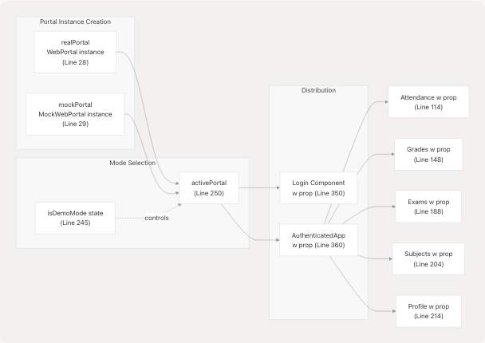
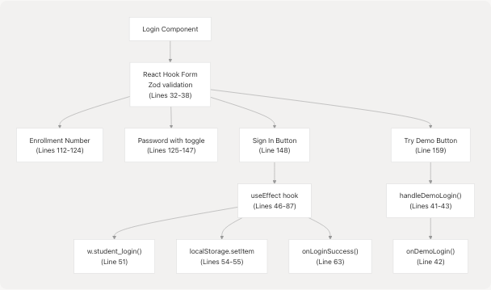
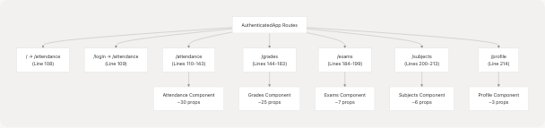
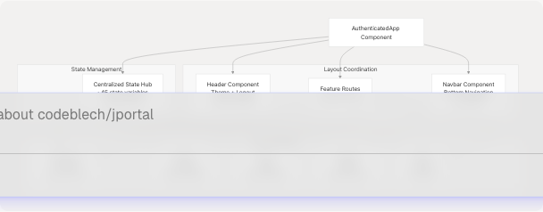
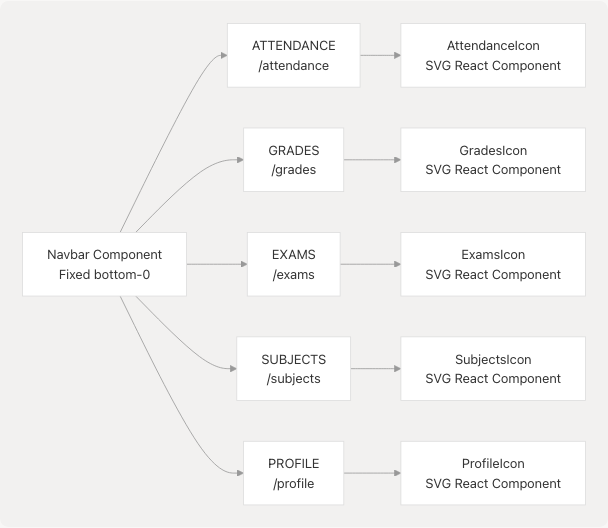
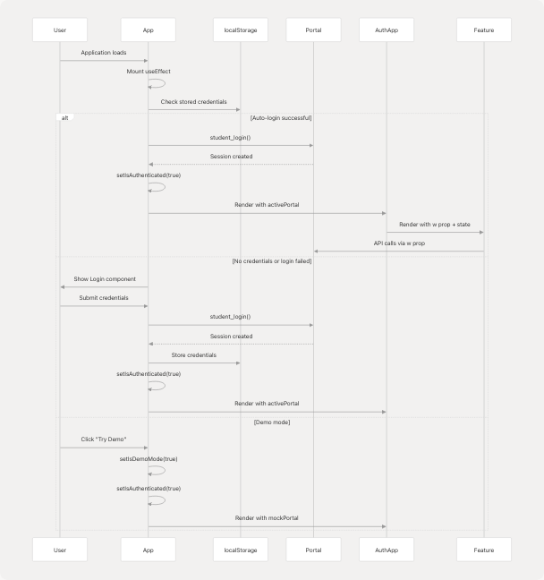

# Application Structure & Authentication

This document provides a detailed explanation of the application's core structure, authentication mechanisms, and routing system. It covers the `App` component hierarchy, authentication flows (real and demo modes), route guards, and the `AuthenticatedApp` wrapper that coordinates all feature modules.

For state management patterns across feature modules, see [State Management Strategy](3.2-state-management-strategy). For details on the data access abstraction layer, see [Data Layer & API Integration](3.3-data-layer-and-api-integration).

---

## Application Entry Point

The application entry point is defined in [src/App.jsx243-374](https://github.com/codeblech/jportal/blob/4df0fde4/src/App.jsx#L243-L374) The `App` component serves as the root coordinator, managing authentication state and determining which component tree to render based on user authentication status.

### Core Component Structure


**Sources:** [src/App.jsx243-376](https://github.com/codeblech/jportal/blob/4df0fde4/src/App.jsx#L243-L376)

### Global Providers

The `App` component establishes several global providers that wrap the entire application:

| Provider | Purpose | Configuration |
| --- | --- | --- |
| `ThemeScript` | Prevents flash of unstyled content | Injected before React hydration (line 303, 316) |
| `ThemeProvider` | Manages light/dark mode and theme presets | Wraps entire app (lines 304, 317) |
| `DynamicFontLoader` | Loads Google Fonts dynamically based on theme | Subscribes to theme changes (lines 305, 318) |
| `QueryClientProvider` | Provides TanStack Query client for server state | Created at line 25, provided at line 319 |
| `Toaster` | Global toast notification system | Configured with custom styles (lines 320-333) |
| `HashRouter` | Client-side routing | Uses hash-based routing for GitHub Pages (line 334) |

**Sources:** [src/App.jsx1-26](https://github.com/codeblech/jportal/blob/4df0fde4/src/App.jsx#L1-L26) [src/App.jsx302-334](https://github.com/codeblech/jportal/blob/4df0fde4/src/App.jsx#L302-L334)

---

## Authentication System

The authentication system supports two operational modes: **real mode** (connecting to JIIT portal) and **demo mode** (using mock data). This dual-mode architecture enables offline development and user demonstration without requiring actual credentials.

### Portal Instance Architecture



**Sources:** [src/App.jsx18-29](https://github.com/codeblech/jportal/blob/4df0fde4/src/App.jsx#L18-L29) [src/App.jsx243-250](https://github.com/codeblech/jportal/blob/4df0fde4/src/App.jsx#L243-L250)

### Authentication State Management

The `App` component maintains three critical state variables:

```
// From App.jsx lines 244-247
const [isAuthenticated, setIsAuthenticated] = useState(false);
const [isDemoMode, setIsDemoMode] = useState(false);
const [isLoading, setIsLoading] = useState(true);
const [error, setError] = useState(null);
```

| State Variable | Type | Purpose |
| --- | --- | --- |
| `isAuthenticated` | boolean | Controls access to protected routes |
| `isDemoMode` | boolean | Determines which portal instance to use |
| `isLoading` | boolean | Shows loading screen during auto-login |
| `error` | string/null | Displays authentication errors |

**Sources:** [src/App.jsx244-247](https://github.com/codeblech/jportal/blob/4df0fde4/src/App.jsx#L244-L247)

### Auto-Login Flow

On application mount, the `App` component attempts to authenticate using stored credentials:


**Sources:** [src/App.jsx252-288](https://github.com/codeblech/jportal/blob/4df0fde4/src/App.jsx#L252-L288)

The auto-login implementation handles several error scenarios:

* **Server unavailable**: Displays error message indicating JIIT portal is down
* **Network issues**: Prompts user to check internet connection
* **Invalid credentials**: Clears stored credentials and requires re-login

Error handling logic is found at [src/App.jsx265-282](https://github.com/codeblech/jportal/blob/4df0fde4/src/App.jsx#L265-L282)

### Login Component

The `Login` component [src/components/Login.jsx24-174](https://github.com/codeblech/jportal/blob/4df0fde4/src/components/Login.jsx#L24-L174) provides the user interface for authentication:



**Sources:** [src/components/Login.jsx1-174](https://github.com/codeblech/jportal/blob/4df0fde4/src/components/Login.jsx#L1-L174)

#### Login Form Schema

The form validation is defined using Zod [src/components/Login.jsx15-22](https://github.com/codeblech/jportal/blob/4df0fde4/src/components/Login.jsx#L15-L22):

```
const formSchema = z.object({
  enrollmentNumber: z.string({
    required_error: "Enrollment number is required",
  }),
  password: z.string({
    required_error: "Password is required",
  }),
});
```

#### Login Process Flow

1. **User submits credentials**: Form calls `onSubmit` [src/components/Login.jsx90-95](https://github.com/codeblech/jportal/blob/4df0fde4/src/components/Login.jsx#L90-L95)
2. **State update triggers effect**: Sets `loginStatus.credentials`
3. **Effect performs login**: Calls `w.student_login()` [src/components/Login.jsx51](https://github.com/codeblech/jportal/blob/4df0fde4/src/components/Login.jsx#L51-L51)
4. **Credentials persisted**: Stored in localStorage [src/components/Login.jsx54-55](https://github.com/codeblech/jportal/blob/4df0fde4/src/components/Login.jsx#L54-L55)
5. **Success callback invoked**: `onLoginSuccess()` triggers [src/components/Login.jsx63](https://github.com/codeblech/jportal/blob/4df0fde4/src/components/Login.jsx#L63-L63)
6. **Navigation occurs**: `LoginWrapper` navigates to `/attendance` [src/App.jsx228](https://github.com/codeblech/jportal/blob/4df0fde4/src/App.jsx#L228-L228)

**Sources:** [src/components/Login.jsx46-87](https://github.com/codeblech/jportal/blob/4df0fde4/src/components/Login.jsx#L46-L87) [src/App.jsx221-241](https://github.com/codeblech/jportal/blob/4df0fde4/src/App.jsx#L221-L241)

---

## Routing Architecture

JPortal uses React Router DOM with hash-based routing to enable deployment on GitHub Pages without server-side configuration.

### Route Guard Implementation


**Sources:** [src/App.jsx334-369](https://github.com/codeblech/jportal/blob/4df0fde4/src/App.jsx#L334-L369)

### Route Configuration

The route guard logic uses React Router's conditional rendering based on authentication state:

| Condition | Route Pattern | Component | Purpose |
| --- | --- | --- | --- |
| Always accessible | `/stats` | `Cloudflare` | Public analytics dashboard |
| `!isAuthenticated` | `*` | `LoginWrapper` | Redirect all paths to login |
| `isAuthenticated` | `/*` | `AuthenticatedApp` | Access to all features |

**Sources:** [src/App.jsx336-367](https://github.com/codeblech/jportal/blob/4df0fde4/src/App.jsx#L336-L367)

### AuthenticatedApp Route Definitions

Inside `AuthenticatedApp`, feature routes are defined [src/App.jsx107-215](https://github.com/codeblech/jportal/blob/4df0fde4/src/App.jsx#L107-L215):



**Sources:** [src/App.jsx107-215](https://github.com/codeblech/jportal/blob/4df0fde4/src/App.jsx#L107-L215)

---

## AuthenticatedApp Wrapper

The `AuthenticatedApp` component [src/App.jsx32-219](https://github.com/codeblech/jportal/blob/4df0fde4/src/App.jsx#L32-L219) serves as a state management hub and layout coordinator for all authenticated features.

### Component Responsibilities



**Sources:** [src/App.jsx32-219](https://github.com/codeblech/jportal/blob/4df0fde4/src/App.jsx#L32-L219)

### State Organization

The `AuthenticatedApp` maintains separate state slices for each feature module:

| Feature | State Variables | Examples |
| --- | --- | --- |
| **Attendance** | 12 variables | `attendanceData`, `selectedAttendanceSem`, `attendanceGoal`, `isAttendanceMetaLoading` |
| **Grades** | 14 variables | `gradesData`, `gradeCards`, `marksData`, `gradesLoading` |
| **Exams** | 4 variables | `examSchedule`, `examSemesters`, `selectedExamSem`, `selectedExamEvent` |
| **Subjects** | 3 variables | `subjectData`, `subjectSemestersData`, `selectedSubjectsSem` |
| **Profile** | 1 variable | `profileData` |
| **Shared** | 1 variable | `w` (portal instance passed from parent) |

**Sources:** [src/App.jsx33-97](https://github.com/codeblech/jportal/blob/4df0fde4/src/App.jsx#L33-L97)

### Props Drilling Pattern

Each feature component receives its state and setters as props. Example from Attendance route [src/App.jsx110-142](https://github.com/codeblech/jportal/blob/4df0fde4/src/App.jsx#L110-L142):

```
<Attendance
  w={w}
  attendanceData={attendanceData}
  setAttendanceData={setAttendanceData}
  semestersData={attendanceSemestersData}
  setSemestersData={setAttendanceSemestersData}
  selectedSem={selectedAttendanceSem}
  setSelectedSem={setSelectedAttendanceSem}
  attendanceGoal={attendanceGoal}
  setAttendanceGoal={setAttendanceGoal}
  // ... 6 more props
/>
```

This pattern enables:

* **Centralized state persistence**: State survives navigation between routes
* **Cross-feature coordination**: Multiple features can share state if needed
* **Simplified debugging**: All state mutations traceable to AuthenticatedApp

**Sources:** [src/App.jsx110-214](https://github.com/codeblech/jportal/blob/4df0fde4/src/App.jsx#L110-L214)

### LocalStorage Integration

Specific state values are persisted to localStorage for user preferences:

```
// Attendance goal persistence (lines 53-61)
const [attendanceGoal, setAttendanceGoal] = useState(() => {
  const savedGoal = localStorage.getItem("attendanceGoal");
  return savedGoal ? parseInt(savedGoal) : 75;
});

useEffect(() => {
  localStorage.setItem("attendanceGoal", attendanceGoal.toString());
}, [attendanceGoal]);
```

**Sources:** [src/App.jsx53-61](https://github.com/codeblech/jportal/blob/4df0fde4/src/App.jsx#L53-L61)

---

## Navigation System

The navigation system consists of two persistent components rendered by `AuthenticatedApp`:

### Header Component

Located at [src/App.jsx104-106](https://github.com/codeblech/jportal/blob/4df0fde4/src/App.jsx#L104-L106) the `Header` component:

* Provides theme selection and light/dark mode toggle
* Displays logout button
* Receives `setIsAuthenticated` and `setIsDemoMode` for logout functionality
* Positioned with sticky positioning (`top-0 z-30`)

### Navbar Component

The bottom navigation bar [src/components/Navbar.jsx8-50](https://github.com/codeblech/jportal/blob/4df0fde4/src/components/Navbar.jsx#L8-L50) provides primary navigation:



**Sources:** [src/components/Navbar.jsx1-51](https://github.com/codeblech/jportal/blob/4df0fde4/src/components/Navbar.jsx#L1-L51)

#### Navbar Implementation Details

* **Component**: Fixed position at bottom of screen [src/components/Navbar.jsx18](https://github.com/codeblech/jportal/blob/4df0fde4/src/components/Navbar.jsx#L18-L18)
* **Navigation**: Uses React Router's `NavLink` with active state detection [src/components/Navbar.jsx20-27](https://github.com/codeblech/jportal/blob/4df0fde4/src/components/Navbar.jsx#L20-L27)
* **Icons**: SVG icons imported as React components [src/components/Navbar.jsx2-6](https://github.com/codeblech/jportal/blob/4df0fde4/src/components/Navbar.jsx#L2-L6)
* **Active state styling**: Highlights current route with `bg-primary` and full opacity [src/components/Navbar.jsx32](https://github.com/codeblech/jportal/blob/4df0fde4/src/components/Navbar.jsx#L32-L32)
* **Responsive text**: Font size adapts for small screens [src/components/Navbar.jsx39](https://github.com/codeblech/jportal/blob/4df0fde4/src/components/Navbar.jsx#L39-L39)

**Sources:** [src/components/Navbar.jsx1-51](https://github.com/codeblech/jportal/blob/4df0fde4/src/components/Navbar.jsx#L1-L51)

---

## Component Lifecycle

The complete authentication and routing lifecycle:



**Sources:** [src/App.jsx252-376](https://github.com/codeblech/jportal/blob/4df0fde4/src/App.jsx#L252-L376) [src/components/Login.jsx46-87](https://github.com/codeblech/jportal/blob/4df0fde4/src/components/Login.jsx#L46-L87)
