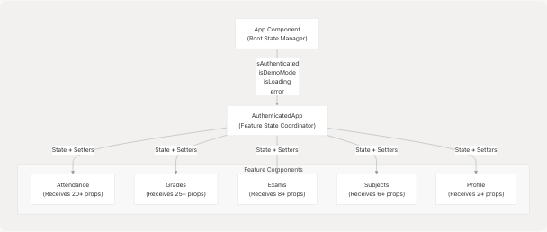
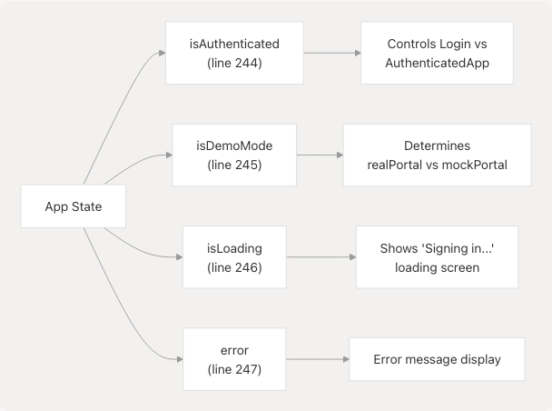
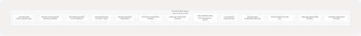
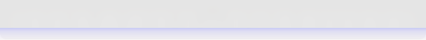
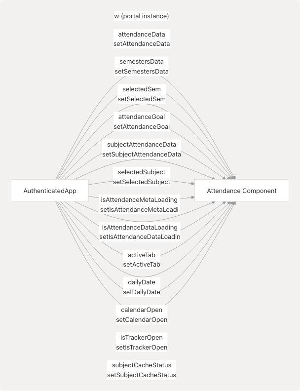
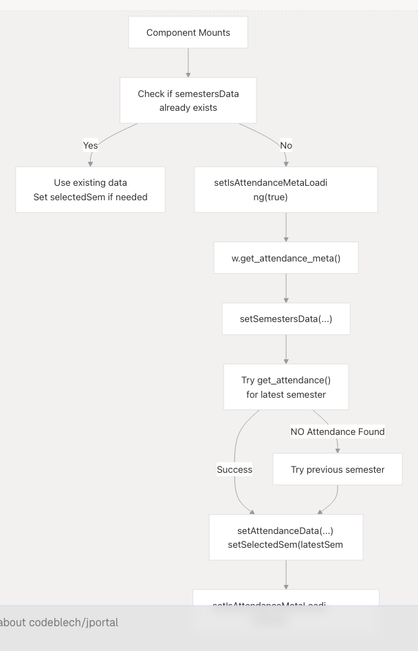
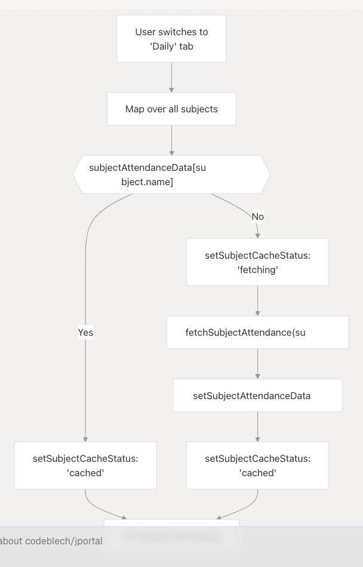

# State Management Strategy

This page documents the state management architecture in JPortal, including how application state is organized, stored, and passed through the component hierarchy. The focus is on the multi-layer React state pattern used throughout the application, persistence mechanisms, and the relationship between component state and data fetching.

For information about data fetching and the portal abstraction layer, see [Data Layer & API Integration](/codeblech/jportal/3.3-data-layer-and-api-integration). For theme-specific state management using Zustand, see [Theme System](/codeblech/jportal/3.4-theme-system).

---

## Overview

JPortal uses a **hybrid state management approach** combining:

* **React `useState` hooks** for local component state
* **Extensive props drilling** from root components to feature modules
* **Zustand store** for global theme state
* **localStorage** for persistence of credentials and user preferences
* **TanStack Query** (available but minimally used in current implementation)

The application does not use a centralized state management library like Redux. Instead, state is **colocated with components** and passed down through props. The root `App` component manages authentication state, while `AuthenticatedApp` acts as a **state coordinator** for all feature modules.

---

## State Hierarchy

The state management architecture follows a three-tier hierarchy:


```

---

## App-Level State

The `App` component manages **authentication and loading state** at the application root:

| State Variable | Type | Purpose | Persistence |
| --- | --- | --- | --- |
| `isAuthenticated` | `boolean` | Whether user is logged in | No |
| `isDemoMode` | `boolean` | Whether using mock data | No |
| `isLoading` | `boolean` | Initial authentication check | No |
| `error` | `string | null` | Auto-login error messages | No |



The `App` component also manages **portal instance selection**:

* `realPortal` - Instance of `WebPortal` from `jsjiit` library
* `mockPortal` - Instance of `MockWebPortal` for demo mode
* `activePortal` - Computed based on `isDemoMode` state

---

## AuthenticatedApp State Coordination

`AuthenticatedApp` serves as a **state hub**, declaring and managing state for all feature modules. This component contains **90+ lines of state declarations** organized by feature domain.

### Attendance State Cluster



The `attendanceGoal` state includes **localStorage persistence**:

```
// Initial load from localStorage
const [attendanceGoal, setAttendanceGoal] = useState(() => {
  const savedGoal = localStorage.getItem("attendanceGoal");
  return savedGoal ? parseInt(savedGoal) : 75;
});

// Persistence effect
useEffect(() => {
  localStorage.setItem("attendanceGoal", attendanceGoal.toString());
}, [attendanceGoal]);
```

### Grades State Cluster



### Other Feature State Clusters

**Subjects State:**

* `subjectData` - Registered subjects by semester
* `subjectSemestersData` - Available semesters
* `selectedSubjectsSem` - Currently selected semester

**Exams State:**

* `examSchedule` - Exam schedule data by semester/event
* `examSemesters` - Available semesters
* `selectedExamSem` - Selected semester
* `selectedExamEvent` - Selected exam event

**Profile State:**

* `profileData` - User profile information

---

## Props Drilling Pattern

Feature components receive state and setter functions through props. The `Attendance` component demonstrates the extensive props drilling:

### Attendance Component Props



### Grades Component Props

The `Grades` component receives **25+ props**:

* Core data: `gradesData`, `semesterData`, `gradeCards`, `marksData`
* UI state: `activeTab`, `gradeCardLoading`, `isDownloadDialogOpen`
* Selection state: `selectedGradeCardSem`, `selectedMarksSem`
* Available options: `gradeCardSemesters`, `marksSemesters`
* All corresponding setter functions

---

## Data Caching Strategy

Feature components implement **client-side caching** by storing fetched data in state objects keyed by identifiers:

### Cache-by-ID Pattern


**Cache Check Pattern** (from Attendance component):

```
const handleSemesterChange = async (value) => {
  const semester = semestersData.semesters.find(sem => sem.registration_id === value);
  setSelectedSem(semester);
  setIsAttendanceDataLoading(true);

  try {
    // Check cache first
    if (attendanceData[value]) {
      setIsAttendanceDataLoading(false);
      return;  // Use cached data
    }

    // Fetch and cache
    const data = await w.get_attendance(header, semester);
    setAttendanceData(prev => ({
      ...prev,
      [value]: data
    }));
  } finally {
    setIsAttendanceDataLoading(false);
  }
}
```

---

## Persistence Mechanisms

JPortal uses **localStorage** for persisting specific state across sessions:

### Persisted State Table

| Key | Type | Location | Purpose |
| --- | --- | --- | --- |
| `username` | `string` | Login flow | Auto-login credentials |
| `password` | `string` | Login flow | Auto-login credentials |
| `attendanceGoal` | `string` | Attendance | User's attendance target % |
| Theme state | JSON | Zustand persist | Theme preset and mode |

### Auto-Login Flow


---

## State Initialization Patterns

Feature components follow a **fetch-on-mount** pattern with conditional initialization:

### Example: Attendance Initialization



This pattern prevents **redundant fetches** when navigating between routes, as `AuthenticatedApp` maintains state across route changes.

---

## State Update Patterns

### Immutable Updates

All state updates follow React's **immutable update pattern**:

```
// Adding to cache
setAttendanceData(prev => ({
  ...prev,
  [semesterId]: newData
}));

// Updating nested state
setGradeCards(prev => ({
  ...prev,
  [value]: data
}));
```

### Async State Updates

Components manage **loading states** around async operations:

```
setMarksLoading(true);
try {
  // Fetch data
  const result = await processPdfMarks();
  setMarksSemesterData(result);
  setMarksData(prev => ({
    ...prev,
    [selectedMarksSem.registration_id]: result
  }));
} catch (error) {
  console.error("Failed to load marks:", error);
} finally {
  setMarksLoading(false);
}
```

---

## TanStack Query Integration

While **TanStack Query** is installed and configured, the current implementation uses minimal server state management through it:

```
const queryClient = new QueryClient();

// Wrapped in App.jsx
<QueryClientProvider client={queryClient}>
  {/* App content */}
</QueryClientProvider>
```

The `queryClient` is available for use but most data fetching is handled through **manual state management** with `useState` and `useEffect` hooks.

---

## Subject-Specific Caching: Daily Attendance

The `Attendance` component implements a sophisticated **progressive loading pattern** for daily attendance data:



The `subjectCacheStatus` state tracks fetch status for each subject, enabling a **progress indicator UI** displayed in a bottom sheet:

---

## Refactoring Opportunities

The current state management strategy has several characteristics that suggest **potential refactoring**:

### Observed Patterns

1. **Excessive Props Drilling**: Components receive 20+ props, making the component interface verbose
2. **State Duplication**: Similar caching patterns repeated across features (attendance, grades, exams)
3. **Mixed Concerns**: UI state (dialogs, tabs) mixed with data state in the same component
4. **No Separation**: Loading and error states managed separately for each feature

### Alternative Approaches

```


The application already includes **TanStack Query** in dependencies, suggesting migration to server state management patterns may be planned for future iterations.

---

## Summary

JPortal's state management follows a **colocated, props-based architecture**:

* **App Component**: Authentication and portal selection
* **AuthenticatedApp**: Central state coordinator for all features
* **Feature Components**: Receive state/setters via props, implement caching
* **Persistence**: localStorage for credentials and user preferences
* **Theme**: Separate Zustand store (see [Theme System](/codeblech/jportal/3.4-theme-system))

This approach prioritizes **simplicity and explicit data flow** at the cost of verbose component interfaces. The pattern works well for the application's current scale but exhibits characteristics that may benefit from more sophisticated state management as the application grows.
