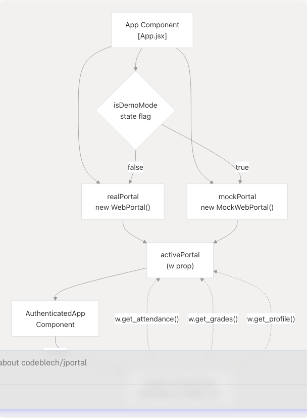
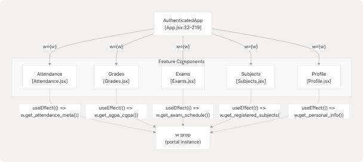

# Data Layer & API Integration

## Purpose and Scope

This document describes the data access layer in JPortal, which abstracts backend communication through a portal interface. The system supports two operational modes: **real mode** (connecting to the actual JIIT Web Portal via the `jsjiit` library) and **demo mode** (using local mock data). This abstraction allows seamless switching between modes without changing feature component code.

For information about how authentication state is managed at the application level, see [Application Structure & Authentication](3.1-application-structure-and-authentication). For details on how feature components manage data retrieved from the portal, see [State Management Strategy](3.2-state-management-strategy).

---

## Portal Abstraction Layer

JPortal implements a **strategy pattern** where all feature components interact with a uniform portal interface through the `w` prop. This prop contains either a `WebPortal` instance (real mode) or a `MockWebPortal` instance (demo mode), both implementing the same API surface.

**Portal Instantiation and Mode Switching**



**Sources:** [src/App.jsx27-29](https://github.com/codeblech/jportal/blob/4df0fde4/src/App.jsx#L27-L29) [src/App.jsx243-250](https://github.com/codeblech/jportal/blob/4df0fde4/src/App.jsx#L243-L250) [src/App.jsx359-360](https://github.com/codeblech/jportal/blob/4df0fde4/src/App.jsx#L359-L360)

The portal instances are created at the top level of `App.jsx`:

* `realPortal = new WebPortal()` - Imported from jsjiit CDN at [src/App.jsx18](https://github.com/codeblech/jportal/blob/4df0fde4/src/App.jsx#L18-L18)
* `mockPortal = new MockWebPortal()` - Local implementation at [src/components/MockWebPortal.js](https://github.com/codeblech/jportal/blob/4df0fde4/src/components/MockWebPortal.js)

The `activePortal` is determined by the `isDemoMode` state at [src/App.jsx250](https://github.com/codeblech/jportal/blob/4df0fde4/src/App.jsx#L250-L250) and passed to `AuthenticatedApp` as the `w` prop at [src/App.jsx360](https://github.com/codeblech/jportal/blob/4df0fde4/src/App.jsx#L360-L360)

**Sources:** [src/App.jsx1-376](https://github.com/codeblech/jportal/blob/4df0fde4/src/App.jsx#L1-L376)

---

## Portal Interface Contract

Both portal implementations expose identical async methods. Feature components consume these methods through the `w` prop without knowledge of the underlying implementation.

### Core API Methods

| Method | Parameters | Returns | Used By |
| --- | --- | --- | --- |
| `student_login()` | `username`, `password` | `Promise<boolean>` | Login |
| `get_attendance_meta()` | - | `{semesters, latest_header, latest_semester}` | Attendance |
| `get_attendance()` | `header`, `semester` | `{studentattendancelist}` | Attendance |
| `get_subject_daily_attendance()` | `semester`, `subjectid`, `individualsubjectcode`, `subjectcomponentids` | `{studentAttdsummarylist}` | Attendance |
| `get_sgpa_cgpa()` | - | `{gradecard}` | Grades |
| `get_semesters_for_grade_card()` | - | `Array<semester>` | Grades |
| `get_grade_card()` | `semester` | `{gradecard}` | Grades |
| `get_semesters_for_marks()` | - | `Array<semester>` | Grades |
| `download_marks()` | `semester` | `{courses}` | Grades |
| `get_registered_semesters()` | - | `Array<semester>` | Subjects |
| `get_registered_subjects_and_faculties()` | `semester` | `{subjects, registered_subject_faculty}` | Subjects |
| `get_semesters_for_exam_events()` | - | `Array<semester>` | Exams |
| `get_exam_events()` | `semester` | `Array<event>` | Exams |
| `get_exam_schedule()` | `event` | `{subjectinfo}` | Exams |
| `get_personal_info()` | - | `{personal, academic, contact, family, address}` | Profile |

**Sources:** [src/components/MockWebPortal.js1-114](https://github.com/codeblech/jportal/blob/4df0fde4/src/components/MockWebPortal.js#L1-L114)

---

## Real Mode: WebPortal (jsjiit Library)

### Integration and Session Management


**Sources:** [src/App.jsx18](https://github.com/codeblech/jportal/blob/4df0fde4/src/App.jsx#L18-L18) [src/components/Login.jsx51](https://github.com/codeblech/jportal/blob/4df0fde4/src/components/Login.jsx#L51-L51)

The `WebPortal` class is imported from the jsjiit library via CDN:

```
import { WebPortal, LoginError } from 
  "https://cdn.jsdelivr.net/npm/jsjiit@0.0.20/dist/jsjiit.esm.js";
```

**Authentication Flow:**

1. User submits credentials via `Login` component at [src/components/Login.jsx90-95](https://github.com/codeblech/jportal/blob/4df0fde4/src/components/Login.jsx#L90-L95)
2. `w.student_login(enrollmentNumber, password)` is called at [src/components/Login.jsx51](https://github.com/codeblech/jportal/blob/4df0fde4/src/components/Login.jsx#L51-L51)
3. If successful, credentials are stored in `localStorage` at [src/components/Login.jsx54-55](https://github.com/codeblech/jportal/blob/4df0fde4/src/components/Login.jsx#L54-L55)
4. The `WebPortal` instance maintains a `session` object with authentication state

**Auto-login on App Load:**
The app attempts auto-login using stored credentials at [src/App.jsx252-264](https://github.com/codeblech/jportal/blob/4df0fde4/src/App.jsx#L252-L264) If successful, `realPortal.session` is populated and `isAuthenticated` is set to `true`.

**Error Handling:**
The `LoginError` exception is caught and handled with specific error messages:

* Server unavailable: [src/App.jsx266-270](https://github.com/codeblech/jportal/blob/4df0fde4/src/App.jsx#L266-L270)
* Network issues: [src/App.jsx271-274](https://github.com/codeblech/jportal/blob/4df0fde4/src/App.jsx#L271-L274)
* Invalid credentials: [src/components/Login.jsx74-76](https://github.com/codeblech/jportal/blob/4df0fde4/src/components/Login.jsx#L74-L76)

**Sources:** [src/App.jsx252-288](https://github.com/codeblech/jportal/blob/4df0fde4/src/App.jsx#L252-L288) [src/components/Login.jsx46-87](https://github.com/codeblech/jportal/blob/4df0fde4/src/components/Login.jsx#L46-L87)

---

## Demo Mode: MockWebPortal

### Implementation Architecture


**Sources:** [src/components/MockWebPortal.js1-114](https://github.com/codeblech/jportal/blob/4df0fde4/src/components/MockWebPortal.js#L1-L114) [src/assets/fakedata.json1-3199](https://github.com/codeblech/jportal/blob/4df0fde4/src/assets/fakedata.json#L1-L3199)

### Key Implementation Details

**Mock Session Object:**
The constructor creates a fake session at [src/components/MockWebPortal.js4-6](https://github.com/codeblech/jportal/blob/4df0fde4/src/components/MockWebPortal.js#L4-L6):

```
this.session = { get_headers: async () => ({}) };
```

**Semester Ordering Logic:**
The `get_attendance_meta()` method includes intelligent semester ordering based on the current month at [src/components/MockWebPortal.js13-45](https://github.com/codeblech/jportal/blob/4df0fde4/src/components/MockWebPortal.js#L13-L45):

* January-July: Even semester (EVESEM) appears first
* August-December: Odd semester (ODDSEM) appears first

This provides a realistic demo experience where the "current" semester is pre-selected.

**Lookup Strategy:**
Most methods perform key-based lookups into the `fakeData` object:

```
// Example from get_attendance() at line 48-50
async get_attendance(header, semester) {
  const semKey = semester.registration_code || semester;
  return fakeData.attendance.attendanceData[semKey] || { studentattendancelist: [] };
}
```

**Sources:** [src/components/MockWebPortal.js3-114](https://github.com/codeblech/jportal/blob/4df0fde4/src/components/MockWebPortal.js#L3-L114)

---

## Authentication Flow Comparison


**Sources:** [src/components/Login.jsx40-43](https://github.com/codeblech/jportal/blob/4df0fde4/src/components/Login.jsx#L40-L43) [src/components/Login.jsx49-63](https://github.com/codeblech/jportal/blob/4df0fde4/src/components/Login.jsx#L49-L63) [src/App.jsx290-298](https://github.com/codeblech/jportal/blob/4df0fde4/src/App.jsx#L290-L298)

### Auto-Login on Startup

When the app loads, it attempts auto-login using stored credentials (real mode only):

1. Check `localStorage` for `username` and `password` at [src/App.jsx253-254](https://github.com/codeblech/jportal/blob/4df0fde4/src/App.jsx#L253-L254)
2. If found, call `realPortal.student_login()` at [src/App.jsx259](https://github.com/codeblech/jportal/blob/4df0fde4/src/App.jsx#L259-L259)
3. On success, set `isAuthenticated = true` and `isDemoMode = false` at [src/App.jsx261-262](https://github.com/codeblech/jportal/blob/4df0fde4/src/App.jsx#L261-L262)
4. On failure, clear stored credentials at [src/App.jsx279-280](https://github.com/codeblech/jportal/blob/4df0fde4/src/App.jsx#L279-L280)

Demo mode has no auto-login; users must explicitly click "Try Demo".

**Sources:** [src/App.jsx252-288](https://github.com/codeblech/jportal/blob/4df0fde4/src/App.jsx#L252-L288)

---

## Data Flow in Feature Components

### Consumption Pattern

All feature components receive the `w` prop and call portal methods to fetch data. The pattern is consistent across features:



**Sources:** [src/App.jsx110-214](https://github.com/codeblech/jportal/blob/4df0fde4/src/App.jsx#L110-L214)

### Example: Attendance Component

The Attendance component demonstrates the typical data fetching pattern:

**Props received at [src/App.jsx113-141](https://github.com/codeblech/jportal/blob/4df0fde4/src/App.jsx#L113-L141):**

* `w` - Portal instance
* State variables and setters for caching data
* Loading and error state management

**Data fetching flow (pseudocode from typical feature component pattern):**

```
useEffect(() => {
  const fetchData = async () => {
    setLoading(true);
    try {
      const meta = await w.get_attendance_meta();
      setSemestersData(meta.semesters);
      setSelectedSem(meta.latest_semester());

      const data = await w.get_attendance(meta.latest_header(), meta.latest_semester());
      setAttendanceData({ [meta.latest_semester().registration_code]: data });
    } catch (error) {
      setError(error.message);
    } finally {
      setLoading(false);
    }
  };
  fetchData();
}, [w]);
```

The component never checks whether `w` is real or mock - it simply calls the methods.

**Sources:** [src/App.jsx110-142](https://github.com/codeblech/jportal/blob/4df0fde4/src/App.jsx#L110-L142)

### Example: Grades Component

The Grades component shows multiple portal calls for different data types:

**Props received at [src/App.jsx146-181](https://github.com/codeblech/jportal/blob/4df0fde4/src/App.jsx#L146-L181):**

* `w` - Portal instance
* Separate state slices for: `gradesData`, `gradeCards`, `marksData`
* Multiple semester selectors for different tabs

**Multiple API calls pattern:**

* `w.get_sgpa_cgpa()` for CGPA trends
* `w.get_semesters_for_grade_card()` to populate semester selector
* `w.get_grade_card(semester)` when user selects a semester
* `w.download_marks(semester)` for PDF parsing

Each call stores results in its own state slice, preventing conflicts between different data types.

**Sources:** [src/App.jsx144-182](https://github.com/codeblech/jportal/blob/4df0fde4/src/App.jsx#L144-L182)

---

## Mock Data Structure

The `fakedata.json` file contains comprehensive mock data organized into five domains corresponding to the five main features.

### Data Organization


**Sources:** [src/assets/fakedata.json1-3199](https://github.com/codeblech/jportal/blob/4df0fde4/src/assets/fakedata.json#L1-L3199)

### Attendance Domain Structure

**Semesters metadata** at [src/assets/fakedata.json3-18](https://github.com/codeblech/jportal/blob/4df0fde4/src/assets/fakedata.json#L3-L18):

* Array of semester objects with `registration_id` and `registration_code`
* `latest_header` identifier for API compatibility
* `latest_semester` pointer

**Attendance data** at [src/assets/fakedata.json20-284](https://github.com/codeblech/jportal/blob/4df0fde4/src/assets/fakedata.json#L20-L284):

* Keyed by semester code (e.g., `"2025EVESEM"`)
* Contains `studentattendancelist` array
* Each subject has: `subjectcode`, `subjectdesc`, L/T/P totals and percentages

**Subject-level attendance** at [src/assets/fakedata.json286-2090](https://github.com/codeblech/jportal/blob/4df0fde4/src/assets/fakedata.json#L286-L2090):

* Keyed by `individualsubjectcode` (e.g., `"15B11EC611"`)
* Array of attendance records with: `datetime`, `classtype`, `present`, `attendanceby`
* Detailed daily attendance data for the Attendance tracker feature

**Sources:** [src/assets/fakedata.json2-2090](https://github.com/codeblech/jportal/blob/4df0fde4/src/assets/fakedata.json#L2-L2090)

### Grades Domain Structure

**SGPA/CGPA data** at [src/assets/fakedata.json2092-2145](https://github.com/codeblech/jportal/blob/4df0fde4/src/assets/fakedata.json#L2092-L2145):

* `gradecard` array with semester-wise GPA records
* Used for the Overview tab trend chart

**Grade cards** at [src/assets/fakedata.json2153-2576](https://github.com/codeblech/jportal/blob/4df0fde4/src/assets/fakedata.json#L2153-L2576):

* Keyed by semester code
* Contains `gradecard` array with course-wise grades
* Subject-level SGPA information

**Marks data** at [src/assets/fakedata.json2625-2965](https://github.com/codeblech/jportal/blob/4df0fde4/src/assets/fakedata.json#L2625-L2965):

* Keyed by semester code
* Contains `courses` array mimicking PDF export structure
* Component-wise marks breakdown for each course

**Sources:** [src/assets/fakedata.json2091-2965](https://github.com/codeblech/jportal/blob/4df0fde4/src/assets/fakedata.json#L2091-L2965)

### Subjects, Exams, and Profile Domains

**Subjects** at [src/assets/fakedata.json2967-3086](https://github.com/codeblech/jportal/blob/4df0fde4/src/assets/fakedata.json#L2967-L3086):

* `semestersData` with available semesters
* `subjectData` keyed by semester with course info, credits, faculty details

**Exams** at [src/assets/fakedata.json3088-3173](https://github.com/codeblech/jportal/blob/4df0fde4/src/assets/fakedata.json#L3088-L3173):

* `examSemesters` array
* `examEvents` keyed by semester (e.g., Mid-term, End-term)
* `examSchedule` keyed by event ID with exam timing and venue details

**Profile** at [src/assets/fakedata.json3175-3198](https://github.com/codeblech/jportal/blob/4df0fde4/src/assets/fakedata.json#L3175-L3198):

* Flat structure with five sections: `personal`, `academic`, `contact`, `family`, `address`
* Comprehensive student information

**Sources:** [src/assets/fakedata.json2967-3199](https://github.com/codeblech/jportal/blob/4df0fde4/src/assets/fakedata.json#L2967-L3199)

---

## Data Caching Strategy

### Component-Level Caching

Feature components maintain their own data caches using React state, lifted to `AuthenticatedApp`. This prevents redundant API calls:

**Example: Attendance caching pattern**

```
// In AuthenticatedApp at <FileRef file-url="https://github.com/codeblech/jportal/blob/4df0fde4/src/App.jsx#L34-L35" min=34 max=35 file-path="src/App.jsx">Hii</FileRef>
const [attendanceData, setAttendanceData] = useState({});
const [attendanceSemestersData, setAttendanceSemestersData] = useState(null);
```

The `attendanceData` object is keyed by semester code:

```
{
  "2025EVESEM": { studentattendancelist: [...] },
  "2025ODDSEM": { studentattendancelist: [...] }
}
```

When switching semesters, components check if data exists before fetching:

```
if (!attendanceData[selectedSem.registration_code]) {
  const data = await w.get_attendance(header, selectedSem);
  setAttendanceData({ ...attendanceData, [selectedSem.registration_code]: data });
}
```

**Sources:** [src/App.jsx32-89](https://github.com/codeblech/jportal/blob/4df0fde4/src/App.jsx#L32-L89)

### LocalStorage Persistence

Only authentication credentials and user preferences are persisted:

**Stored items:**

* `username` - Enrollment number for auto-login at [src/components/Login.jsx54](https://github.com/codeblech/jportal/blob/4df0fde4/src/components/Login.jsx#L54-L54)
* `password` - Password for auto-login at [src/components/Login.jsx55](https://github.com/codeblech/jportal/blob/4df0fde4/src/components/Login.jsx#L55-L55)
* `attendanceGoal` - User's target attendance percentage at [src/App.jsx53-56](https://github.com/codeblech/jportal/blob/4df0fde4/src/App.jsx#L53-L56)

API response data is **not** persisted to localStorage; it's fetched fresh on each session.

**Sources:** [src/App.jsx52-61](https://github.com/codeblech/jportal/blob/4df0fde4/src/App.jsx#L52-L61) [src/components/Login.jsx54-55](https://github.com/codeblech/jportal/blob/4df0fde4/src/components/Login.jsx#L54-L55)

---

## Error Handling and Network Resilience

### Error Types

The application handles three categories of errors from the real portal:

1. **Server Unavailability:** JIIT portal is down

   * Detected via `LoginError` message check at [src/App.jsx266-270](https://github.com/codeblech/jportal/blob/4df0fde4/src/App.jsx#L266-L270)
   * User message: "JIIT Web Portal server is temporarily unavailable"
2. **Network Errors:** User has no internet connection

   * Detected via "Failed to fetch" message at [src/App.jsx271-274](https://github.com/codeblech/jportal/blob/4df0fde4/src/App.jsx#L271-L274)
   * User message: "Please check your internet connection"
3. **Authentication Errors:** Invalid credentials

   * Generic catch-all at [src/components/Login.jsx74-76](https://github.com/codeblech/jportal/blob/4df0fde4/src/components/Login.jsx#L74-L76)
   * User message: "Login failed. Please check your credentials"

### Fallback to Demo Mode

When the real portal is unavailable, users can switch to demo mode via the "Try Demo" button on the login screen at [src/components/Login.jsx159-167](https://github.com/codeblech/jportal/blob/4df0fde4/src/components/Login.jsx#L159-L167) This provides a functional demo experience without backend connectivity.

**Sources:** [src/App.jsx265-281](https://github.com/codeblech/jportal/blob/4df0fde4/src/App.jsx#L265-L281) [src/components/Login.jsx64-82](https://github.com/codeblech/jportal/blob/4df0fde4/src/components/Login.jsx#L64-L82) [src/components/Login.jsx159-167](https://github.com/codeblech/jportal/blob/4df0fde4/src/components/Login.jsx#L159-L167)

---

## Summary

The JPortal data layer provides a clean abstraction that:

1. **Decouples** feature components from backend implementation details via the `w` prop strategy pattern
2. **Enables** seamless switching between real and demo modes without code changes
3. **Provides** comprehensive mock data in `fakedata.json` covering all five feature domains
4. **Implements** component-level caching to minimize redundant API calls
5. **Handles** network errors gracefully with clear user feedback

This architecture allows offline development, easy testing, and a fully functional demo mode while maintaining production compatibility with the actual JIIT Web Portal.

**Sources:** [src/App.jsx1-376](https://github.com/codeblech/jportal/blob/4df0fde4/src/App.jsx#L1-L376) [src/components/MockWebPortal.js1-114](https://github.com/codeblech/jportal/blob/4df0fde4/src/components/MockWebPortal.js#L1-L114) [src/assets/fakedata.json1-3199](https://github.com/codeblech/jportal/blob/4df0fde4/src/assets/fakedata.json#L1-L3199) [src/components/Login.jsx1-174](https://github.com/codeblech/jportal/blob/4df0fde4/src/components/Login.jsx#L1-L174)
