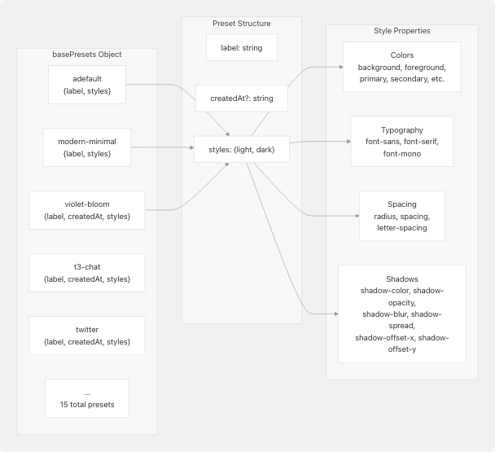
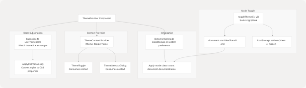
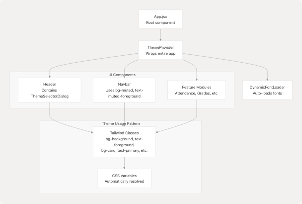

# Theme System

The Theme System provides comprehensive theming capabilities for JPortal, including a curated collection of theme presets, dynamic light/dark mode switching, custom font loading, and smooth visual transitions. This system manages all visual styling through CSS custom properties that integrate with Tailwind CSS utilities.

For UI component styling patterns, see [Styling System](5.4-styling-system). For theme-related UI components themselves, see [Theme & Navigation Components](5.2-theme-and-navigation-components).

---

## Architecture Overview

The theme system operates through multiple layers: theme presets defined as TypeScript objects, a Zustand store for state management, a React context provider for theme operations, CSS custom properties for runtime styling, and dynamic font loading for Google Fonts.

### Theme System Architecture


**Sources:** [jportal/src/utils/theme-presets.ts1-1348](https://github.com/codeblech/jportal/blob/4df0fde4/jportal/src/utils/theme-presets.ts#L1-L1348) [jportal/src/components/theme-provider.tsx](https://github.com/codeblech/jportal/blob/4df0fde4/jportal/src/components/theme-provider.tsx) (referenced), [jportal/src/stores/theme-store.ts](https://github.com/codeblech/jportal/blob/4df0fde4/jportal/src/stores/theme-store.ts) (referenced), [jportal/src/components/theme-selector-dialog.tsx1-195](https://github.com/codeblech/jportal/blob/4df0fde4/jportal/src/components/theme-selector-dialog.tsx#L1-L195) [jportal/src/index.css1-240](https://github.com/codeblech/jportal/blob/4df0fde4/jportal/src/index.css#L1-L240)

---

## Theme Presets Configuration

Theme presets are defined in a central configuration file as a `Record<string, ThemePreset>` object. Each preset contains a label, optional creation date, and complete style definitions for both light and dark modes.

### Theme Preset Structure



**Preset Inventory**

| Preset Key | Label | Features |
| --- | --- | --- |
| `adefault` | Default | System default, blue primary, neutral grays |
| `modern-minimal` | Modern Minimal | Clean whites/blacks, Inter font family |
| `violet-bloom` | Violet Bloom | Purple primary (#7033ff), Plus Jakarta Sans |
| `t3-chat` | T3 Chat | Pink/purple tones, custom shadow settings |
| `twitter` | Twitter | Twitter blue (#1e9df1), rounded corners (1.3rem) |
| `mocha-mousse` | Mocha Mousse | Warm browns/tans, DM Sans font |
| `bubblegum` | Bubblegum | Pink/cyan pastels, hard shadows (3px offset) |
| `amethyst-haze` | Amethyst Haze | Purple/pink palette, Geist font |
| `notebook` | Notebook | Paper-like, Architects Daughter handwriting font |
| `doom-64` | Doom 64 | Dark retro gaming, Oxanium font, 0px radius |
| `catppuccin` | Catppuccin | Popular community theme, Montserrat font |
| `graphite` | Graphite | Monochrome grays, minimal styling |
| `perpetuity` | Perpetuity | Teal/cyan focus colors |

Each preset defines 40+ CSS properties for light mode and 35+ for dark mode, including comprehensive color tokens, typography settings, and shadow configurations.

**Sources:** [jportal/src/utils/theme-presets.ts4-1348](https://github.com/codeblech/jportal/blob/4df0fde4/jportal/src/utils/theme-presets.ts#L4-L1348)

### Color Token System

All presets implement a standardized token structure derived from Shadcn design system:

| Token Category | Properties | Usage |
| --- | --- | --- |
| **Base** | `background`, `foreground` | Page background and primary text |
| **Surface** | `card`, `card-foreground`, `popover`, `popover-foreground` | Container surfaces |
| **Interactive** | `primary`, `primary-foreground`, `secondary`, `secondary-foreground` | Buttons, links, active states |
| **Semantic** | `muted`, `muted-foreground`, `accent`, `accent-foreground`, `destructive`, `destructive-foreground` | Contextual elements |
| **Inputs** | `border`, `input`, `ring` | Form elements and focus rings |
| **Charts** | `chart-1` through `chart-5` | Data visualization colors |
| **Sidebar** | `sidebar-*` (8 properties) | Sidebar-specific tokens |
| **Custom** | `grade-*`, `marks-*` | JPortal-specific grade colors |

**Sources:** [jportal/src/index.css7-88](https://github.com/codeblech/jportal/blob/4df0fde4/jportal/src/index.css#L7-L88) [jportal/src/utils/theme-presets.ts8-83](https://github.com/codeblech/jportal/blob/4df0fde4/jportal/src/utils/theme-presets.ts#L8-L83)

---

## State Management with Zustand

Theme state is managed globally using a Zustand store (`useThemeStore`) that persists the current preset selection and merged style configurations.

### Theme Store Data Flow


**Store Interface:**

* `themeState`: Contains current `preset` key and complete `styles` object with both light and dark variants
* `setThemeState(newState)`: Updates the theme state and triggers all subscribers

**Theme Selection Process** ([jportal/src/components/theme-selector.tsx13-25](https://github.com/codeblech/jportal/blob/4df0fde4/jportal/src/components/theme-selector.tsx#L13-L25)):

1. User clicks a theme button in `ThemeSelector`
2. `handleThemeSelect(presetKey)` is called
3. Preset is retrieved from `defaultPresets[presetKey]`
4. Store is updated with new preset key and deep-copied style objects
5. All subscribed components re-render with new theme values

**Sources:** [jportal/src/components/theme-selector.tsx1-69](https://github.com/codeblech/jportal/blob/4df0fde4/jportal/src/components/theme-selector.tsx#L1-L69) [jportal/src/components/theme-selector-dialog.tsx14-41](https://github.com/codeblech/jportal/blob/4df0fde4/jportal/src/components/theme-selector-dialog.tsx#L14-L41) [jportal/src/stores/theme-store.ts](https://github.com/codeblech/jportal/blob/4df0fde4/jportal/src/stores/theme-store.ts) (referenced)

---

## CSS Architecture

The theme system uses a two-layer CSS architecture: CSS custom properties on `:root` provide runtime values, while Tailwind CSS utilities consume these properties through the `@theme inline` block.

### CSS Variable Flow


**Default Values** ([jportal/src/index.css91-160](https://github.com/codeblech/jportal/blob/4df0fde4/jportal/src/index.css#L91-L160)):
The `:root` selector defines fallback values for all theme properties. These serve as the initial theme before JavaScript loads and ensure graceful degradation.

**Tailwind Integration** ([jportal/src/index.css7-88](https://github.com/codeblech/jportal/blob/4df0fde4/jportal/src/index.css#L7-L88)):
The `@theme inline` block maps CSS custom properties to Tailwind's design token system:

* `--color-*` tokens map to Tailwind color utilities
* `--radius-*` tokens define border radius scales
* `--shadow-*` tokens construct box-shadow values dynamically
* `--font-*` tokens define font family stacks

**Dynamic Shadow System** ([jportal/src/index.css65-72](https://github.com/codeblech/jportal/blob/4df0fde4/jportal/src/index.css#L65-L72)):
Shadows are composed from multiple CSS variables:

```
--shadow: var(--shadow-offset-x, 0) 
          var(--shadow-offset-y, 2px) 
          var(--shadow-blur, 6px) 
          var(--shadow-spread, 0) 
          color-mix(in srgb, var(--shadow-color, #000000) 
          calc(var(--shadow-opacity, 0.1) * 100%), transparent)
```

This allows themes to customize shadow appearance through component variables.

**Sources:** [jportal/src/index.css1-240](https://github.com/codeblech/jportal/blob/4df0fde4/jportal/src/index.css#L1-L240)

---

## Theme Provider and Context

The `ThemeProvider` component wraps the application and provides theme-related functionality through React Context, including the current mode (light/dark) and the `toggleTheme` function.

### Theme Provider Responsibilities



**Mode Detection Logic:**

1. Check `localStorage.getItem('theme-mode')` for saved preference
2. Fall back to `window.matchMedia('(prefers-color-scheme: dark)')` for system preference
3. Default to `'dark'` if no preference found

**CSS Variable Application:**
The provider subscribes to theme state changes and applies all style properties as CSS custom properties on `document.documentElement.style`. Properties are converted from hex/rgb to HSL format where necessary.

**View Transition API** ([jportal/src/index.css163-189](https://github.com/codeblech/jportal/blob/4df0fde4/jportal/src/index.css#L163-L189)):
When toggling modes, the provider uses the View Transition API (if supported) to create a circular reveal animation:

```
::view-transition-new(root) {
  clip-path: circle(0 at var(--x, 50%) var(--y, 50%));
  animation-name: expand;
}
```

The `{x, y}` coordinates from the click event position the animation origin.

**Sources:** [jportal/src/components/theme-provider.tsx](https://github.com/codeblech/jportal/blob/4df0fde4/jportal/src/components/theme-provider.tsx) (referenced), [jportal/src/index.css163-189](https://github.com/codeblech/jportal/blob/4df0fde4/jportal/src/index.css#L163-L189)

---

## User Interface Components

Three primary components handle user interaction with the theme system: `ThemeSelectorDialog`, `ThemeSelector`, and `ThemeToggle`.

### Theme UI Component Hierarchy


**ThemeSelectorDialog** ([jportal/src/components/theme-selector-dialog.tsx18-195](https://github.com/codeblech/jportal/blob/4df0fde4/jportal/src/components/theme-selector-dialog.tsx#L18-L195)):

* **Button Gestures:**
  + **Click**: Opens theme selection dialog
  + **Hold (500ms)**: Toggles light/dark mode at click coordinates
  + **Swipe horizontal**: Cycles to next/previous theme preset
  + **Swipe vertical**: Cycles to next/previous theme preset
* **Gesture Implementation**: Uses refs to track touch/mouse state and prevent dialog opening after gesture actions ([jportal/src/components/theme-selector-dialog.tsx21-143](https://github.com/codeblech/jportal/blob/4df0fde4/jportal/src/components/theme-selector-dialog.tsx#L21-L143))
* **Theme Cycling**: Maintains sorted array of theme keys for predictable navigation

**ThemeSelector** ([jportal/src/components/theme-selector.tsx10-69](https://github.com/codeblech/jportal/blob/4df0fde4/jportal/src/components/theme-selector.tsx#L10-L69)):

* Renders grid of theme buttons (2 cols mobile, 3 tablet, 4 desktop)
* Each button displays 4-color preview stripe from preset's light mode colors
* Active preset highlighted with `variant="default"` and reduced opacity
* Sorted alphabetically by preset label for consistent ordering

**ThemeToggle** ([jportal/src/components/theme-toggle.tsx8-31](https://github.com/codeblech/jportal/blob/4df0fde4/jportal/src/components/theme-toggle.tsx#L8-L31)):

* Simple icon button showing Sun (light) or Moon (dark)
* Calls `toggleTheme({x, y})` with click coordinates
* Icon transitions with rotation animations via Tailwind classes

**Sources:** [jportal/src/components/theme-selector-dialog.tsx1-195](https://github.com/codeblech/jportal/blob/4df0fde4/jportal/src/components/theme-selector-dialog.tsx#L1-L195) [jportal/src/components/theme-selector.tsx1-69](https://github.com/codeblech/jportal/blob/4df0fde4/jportal/src/components/theme-selector.tsx#L1-L69) [jportal/src/components/theme-toggle.tsx1-31](https://github.com/codeblech/jportal/blob/4df0fde4/jportal/src/components/theme-toggle.tsx#L1-L31) [jportal/src/components/Header.jsx1-43](https://github.com/codeblech/jportal/blob/4df0fde4/jportal/src/components/Header.jsx#L1-L43)

---

## Dynamic Font Loading

The `DynamicFontLoader` component monitors theme changes and dynamically loads Google Fonts specified in the theme's typography settings.

### Font Loading Architecture


**Font Family Extraction** ([jportal/src/utils/fonts.ts3-16](https://github.com/codeblech/jportal/blob/4df0fde4/jportal/src/utils/fonts.ts#L3-L16)):

1. Split font stack by comma: `"Plus Jakarta Sans, sans-serif".split(",")`
2. Take first font: `"Plus Jakarta Sans"`
3. Remove quotes and trim whitespace
4. Check against system font list (ui-sans-serif, system-ui, etc.)
5. Return `null` if system font, otherwise return cleaned name

**Font Loading Process** ([jportal/src/utils/fonts.ts24-35](https://github.com/codeblech/jportal/blob/4df0fde4/jportal/src/utils/fonts.ts#L24-L35)):

```
buildFontCssUrl(family: string, weights: string[])
  → https://fonts.googleapis.com/css2?family=Plus+Jakarta+Sans:wght@400;500;600;700&display=swap

loadGoogleFont(family, DEFAULT_FONT_WEIGHTS)
  → Check if already loaded
  → Create <link rel="stylesheet" href="...">
  → Append to document.head
```

**Default Weight Loading** ([jportal/src/utils/fonts.ts1](https://github.com/codeblech/jportal/blob/4df0fde4/jportal/src/utils/fonts.ts#L1-L1)):
The system requests four standard weights for all fonts: `["400", "500", "600", "700"]`, balancing coverage with performance.

**Pre-loaded Fonts** ([jportal/index.html8-12](https://github.com/codeblech/jportal/blob/4df0fde4/jportal/index.html#L8-L12)):
The HTML includes a comprehensive Google Fonts preload covering all theme fonts to avoid flash of unstyled text (FOUT). This includes ~20 font families used across all presets.

**Sources:** [jportal/src/components/DynamicFontLoader.tsx1-34](https://github.com/codeblech/jportal/blob/4df0fde4/jportal/src/components/DynamicFontLoader.tsx#L1-L34) [jportal/src/utils/fonts.ts1-35](https://github.com/codeblech/jportal/blob/4df0fde4/jportal/src/utils/fonts.ts#L1-L35) [jportal/index.html8-12](https://github.com/codeblech/jportal/blob/4df0fde4/jportal/index.html#L8-L12)

---

## View Transition Animations

The theme system leverages the View Transition API to create smooth, animated transitions when toggling between light and dark modes.

**Animation Configuration** ([jportal/src/index.css163-189](https://github.com/codeblech/jportal/blob/4df0fde4/jportal/src/index.css#L163-L189)):

```
@supports (view-transition-name: none) {
  ::view-transition-old(root),
  ::view-transition-new(root) {
    animation-duration: 1s;
  }

  ::view-transition-new(root) {
    clip-path: circle(0 at var(--x, 50%) var(--y, 50%));
    animation-name: expand;
  }

  ::view-transition-old(root) {
    animation-name: shrink;
  }

  @keyframes expand {
    to {
      clip-path: circle(100vmax at var(--x, 50%) var(--y, 50%));
    }
  }

  @keyframes shrink {
    to {
      clip-path: circle(0 at var(--x, 50%) var(--y, 50%));
    }
  }
}
```

**Transition Trigger:**
When `toggleTheme({x, y})` is called:

1. CSS variables `--x` and `--y` are set on the root element to the click coordinates
2. `document.startViewTransition(() => { /* apply new mode */ })` is invoked
3. Browser captures current state snapshot
4. New mode is applied (class toggle on root)
5. Browser animates from old to new state using circular reveal
6. Animation originates from the click position, creating a natural "spreading" effect

**Fallback Behavior:**
On browsers without View Transition API support, the mode switch is instant with no animation, ensuring functionality is preserved.

**Sources:** [jportal/src/index.css163-189](https://github.com/codeblech/jportal/blob/4df0fde4/jportal/src/index.css#L163-L189) [jportal/src/components/theme-provider.tsx](https://github.com/codeblech/jportal/blob/4df0fde4/jportal/src/components/theme-provider.tsx) (referenced)

---

## Integration with Application

The theme system integrates with the broader application through strategic placement in the component hierarchy and consistent use of Tailwind utility classes.

### Application Integration Points



**Component Usage Pattern:**
All components use semantic Tailwind classes that reference theme tokens:

* Backgrounds: `bg-background`, `bg-card`, `bg-muted`, `bg-primary`
* Text: `text-foreground`, `text-muted-foreground`, `text-primary-foreground`
* Borders: `border-border`, `border-input`
* Accents: `bg-accent`, `text-accent-foreground`

**Example from Navbar** ([jportal/src/components/Navbar.jsx18-46](https://github.com/codeblech/jportal/blob/4df0fde4/jportal/src/components/Navbar.jsx#L18-L46)):

```
<div className="bg-muted">  {/* Uses --color-muted */}
  <item.IconComponent 
    className={`${isActive ? "fill-primary-foreground" : "fill-muted-foreground"}`} 
  />  {/* Responds to theme colors */}
</div>
```

**Custom JPortal Colors** ([jportal/src/index.css74-88](https://github.com/codeblech/jportal/blob/4df0fde4/jportal/src/index.css#L74-L88)):
The system extends standard Shadcn tokens with JPortal-specific grade and marks colors:

* Grade colors: `--grade-aa` through `--grade-f` (8 levels)
* Marks colors: `--marks-outstanding`, `--marks-good`, `--marks-average`, `--marks-poor`

These are used in feature modules for data visualization with consistent theming.

**Sources:** [jportal/src/components/Header.jsx1-43](https://github.com/codeblech/jportal/blob/4df0fde4/jportal/src/components/Header.jsx#L1-L43) [jportal/src/components/Navbar.jsx1-51](https://github.com/codeblech/jportal/blob/4df0fde4/jportal/src/components/Navbar.jsx#L1-L51) [jportal/src/index.css74-88](https://github.com/codeblech/jportal/blob/4df0fde4/jportal/src/index.css#L74-L88) [jportal/src/components/Profile.jsx1-157](https://github.com/codeblech/jportal/blob/4df0fde4/jportal/src/components/Profile.jsx#L1-L157)
