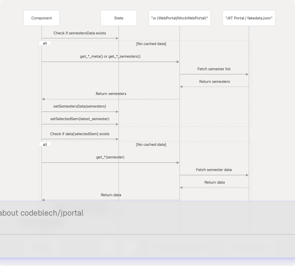
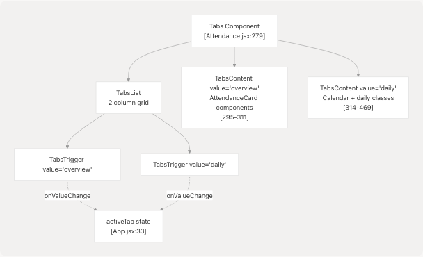
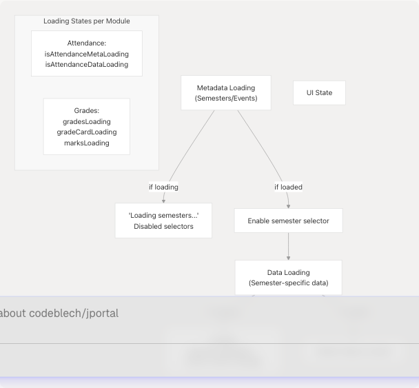
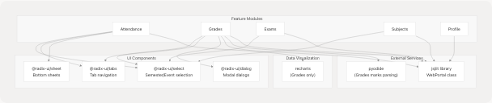

# Feature Modules

## Purpose and Scope

This page provides an overview of JPortal's five core feature modules: **Attendance**, **Grades**, **Exams**, **Subjects**, and **Profile**. It documents the common architecture patterns, integration mechanisms, and data flow shared across these modules. For detailed documentation of each individual module's functionality and components, see:

* [Attendance Module](4.1-attendance-module) - Daily and overview attendance tracking
* [Grades Module](4.2-grades-module) - SGPA/CGPA trends and semester grade cards
* [Exams Module](4.3-exams-module) - Examination schedules and events
* [Subjects Module](4.4-subjects-module) - Registered courses and faculty information
* [Profile Module](4.5-profile-module) - Student personal and academic information
* [Analytics Dashboard](4.6-analytics-dashboard) - Cloudflare analytics integration

For navigation and UI infrastructure, see [Theme & Navigation Components](5.2-theme-and-navigation-components). For authentication and routing mechanics, see [Application Structure & Authentication](3.1-application-structure-and-authentication).

---

## Feature Module Architecture

### Module Coordination

All feature modules are coordinated by the `AuthenticatedApp` component, which serves as the central state management hub. Each module is rendered as a route and receives its state and data access layer as props.

**Feature Module Integration Architecture**


---

### Data Access Layer

All feature modules access data through the `w` prop, which contains either a `WebPortal` or `MockWebPortal` instance depending on authentication mode. This abstraction enables seamless switching between real and demo modes without changing component code.

**Data Access Pattern**


---

## Common Patterns

### State Management Pattern

Feature modules follow a consistent state management pattern where state is lifted to `AuthenticatedApp` and passed down as props. This creates extensive props drilling but centralizes state management.

| Module | Primary State Variables | Location |
| --- | --- | --- |
| **Attendance** | `attendanceData`, `attendanceSemestersData`, `selectedAttendanceSem`, `attendanceGoal`, `subjectAttendanceData` | [App.jsx34-50](https://github.com/codeblech/jportal/blob/4df0fde4/App.jsx#L34-L50) |
| **Grades** | `gradesData`, `gradesSemesterData`, `gradeCards`, `marksData`, `selectedGradeCardSem` | [App.jsx40-96](https://github.com/codeblech/jportal/blob/4df0fde4/App.jsx#L40-L96) |
| **Exams** | `examSchedule`, `examSemesters`, `selectedExamSem`, `selectedExamEvent` | [App.jsx80-83](https://github.com/codeblech/jportal/blob/4df0fde4/App.jsx#L80-L83) |
| **Subjects** | `subjectData`, `subjectSemestersData`, `selectedSubjectsSem` | [App.jsx37-45](https://github.com/codeblech/jportal/blob/4df0fde4/App.jsx#L37-L45) |
| **Profile** | `profileData` | [App.jsx64](https://github.com/codeblech/jportal/blob/4df0fde4/App.jsx#L64-L64) |

**State Flow Pattern**


---

### Data Fetching Pattern

All feature modules follow a similar data fetching lifecycle:

1. **Initial Load**: Fetch metadata (semesters/events) on component mount
2. **Semester Selection**: Load data for selected semester
3. **Caching**: Store fetched data in state to avoid redundant API calls
4. **Loading States**: Display loading indicators during API calls

**Common Data Fetching Flow**



---

### Semester Selection Pattern

Four of the five modules (all except Profile) implement semester selection with consistent UI and behavior:

**Semester Selection Component Structure**


**Implementation Examples:**

| Module | Semester Selector | Handler Function | API Method |
| --- | --- | --- | --- |
| **Attendance** | [Attendance.jsx248-261](https://github.com/codeblech/jportal/blob/4df0fde4/Attendance.jsx#L248-L261) | `handleSemesterChange` [100-132](https://github.com/codeblech/jportal/blob/4df0fde4/100-132) | `w.get_attendance()` |
| **Grades** | [Grades.jsx417-430](https://github.com/codeblech/jportal/blob/4df0fde4/Grades.jsx#L417-L430) | `handleSemesterChange` [211-233](https://github.com/codeblech/jportal/blob/4df0fde4/211-233) | `w.get_grade_card()` |
| **Exams** | [Exams.jsx86-99](https://github.com/codeblech/jportal/blob/4df0fde4/Exams.jsx#L86-L99) | `handleSemesterChange` [36-48](https://github.com/codeblech/jportal/blob/4df0fde4/36-48) | `w.get_exam_events()` |
| **Subjects** | [Subjects.jsx109-122](https://github.com/codeblech/jportal/blob/4df0fde4/Subjects.jsx#L109-L122) | `handleSemesterChange` [63-84](https://github.com/codeblech/jportal/blob/4df0fde4/63-84) | `w.get_registered_subjects_and_faculties()` |

---

### Tab-Based Navigation Pattern

Three modules (Attendance, Grades, and optionally others) use Radix UI Tabs for internal navigation between different views of the same data:

**Tab Pattern Structure**

| Module | Tabs | Purpose |
| --- | --- | --- |
| **Attendance** | `overview`, `daily` | Switch between semester overview and day-to-day attendance view |
| **Grades** | `overview`, `semester`, `marks` | View SGPA/CGPA trends, grade cards, or detailed marks |

**Tab Implementation Example (Attendance)**



---

## Loading State Management

Feature modules implement consistent loading state patterns with separate loading indicators for different data layers:

**Loading State Hierarchy**



**Module-Specific Loading States:**

| Module | Loading States | Location |
| --- | --- | --- |
| **Attendance** | `isAttendanceMetaLoading`, `isAttendanceDataLoading` | [App.jsx99-100](https://github.com/codeblech/jportal/blob/4df0fde4/App.jsx#L99-L100) |
| **Grades** | `gradesLoading`, `gradeCardLoading`, `marksLoading` | [App.jsx92-96](https://github.com/codeblech/jportal/blob/4df0fde4/App.jsx#L92-L96) |
| **Exams** | `loading` (local state) | [Exams.jsx22](https://github.com/codeblech/jportal/blob/4df0fde4/Exams.jsx#L22-L22) |
| **Subjects** | `loading`, `subjectsLoading` (local state) | [Subjects.jsx12-13](https://github.com/codeblech/jportal/blob/4df0fde4/Subjects.jsx#L12-L13) |

---

## Feature Module Summary

### Module Capabilities Matrix

| Feature | Route | Primary API Methods | Key Components | Caching Strategy |
| --- | --- | --- | --- | --- |
| **Attendance** | `/attendance` | `get_attendance_meta()`, `get_attendance()`, `get_subject_daily_attendance()` | `AttendanceCard`, `CircleProgress`, Calendar | By `registration_id` and subject name |
| **Grades** | `/grades` | `get_sgpa_cgpa()`, `get_grade_card()`, `get_semesters_for_marks()` | `GradeCard`, `MarksCard`, LineChart | By `registration_id` for grade cards and marks |
| **Exams** | `/exams` | `get_semesters_for_exam_events()`, `get_exam_events()`, `get_exam_schedule()` | Select dropdowns, schedule list | By `exam_event_id` |
| **Subjects** | `/subjects` | `get_registered_semesters()`, `get_registered_subjects_and_faculties()` | `SubjectInfoCard` | By `registration_id` |
| **Profile** | `/profile` | `get_profile()` | Profile display cards | Single profile object |

---

### Module Dependencies

**Common Dependencies Across All Modules:**



---

## Integration Points

### AuthenticatedApp Coordination

The `AuthenticatedApp` component coordinates all feature modules through:

1. **State Centralization**: All feature state is managed at this level [App.jsx33-96](https://github.com/codeblech/jportal/blob/4df0fde4/App.jsx#L33-L96)
2. **Portal Instance Distribution**: The `w` prop is distributed to all modules [App.jsx114-214](https://github.com/codeblech/jportal/blob/4df0fde4/App.jsx#L114-L214)
3. **Shared UI Infrastructure**: Header and Navbar components wrap the routes [App.jsx103-217](https://github.com/codeblech/jportal/blob/4df0fde4/App.jsx#L103-L217)
4. **Navigation Control**: React Router manages transitions between modules [App.jsx107-215](https://github.com/codeblech/jportal/blob/4df0fde4/App.jsx#L107-L215)

**AuthenticatedApp Component Structure:**


---

### Props Drilling Architecture

The current architecture uses extensive props drilling from `AuthenticatedApp` to feature modules. Each module receives 10-20+ props:

**Example: Attendance Module Props**

```
// From App.jsx:110-141
<Attendance
  w={w}                                                    // Data access layer
  attendanceData={attendanceData}                          // Semester data cache
  setAttendanceData={setAttendanceData}                    // Cache setter
  semestersData={attendanceSemestersData}                  // Semester metadata
  setSemestersData={setAttendanceSemestersData}            // Metadata setter
  selectedSem={selectedAttendanceSem}                      // Selected semester
  setSelectedSem={setSelectedAttendanceSem}                // Semester selector
  attendanceGoal={attendanceGoal}                          // Goal percentage
  setAttendanceGoal={setAttendanceGoal}                    // Goal setter
  subjectAttendanceData={subjectAttendanceData}            // Daily attendance cache
  setSubjectAttendanceData={setSubjectAttendanceData}      // Daily cache setter
  selectedSubject={selectedSubject}                        // Selected subject
  setSelectedSubject={setSelectedSubject}                  // Subject selector
  isAttendanceMetaLoading={isAttendanceMetaLoading}        // Meta loading state
  setIsAttendanceMetaLoading={setIsAttendanceMetaLoading}  // Meta loading setter
  isAttendanceDataLoading={isAttendanceDataLoading}        // Data loading state
  setIsAttendanceDataLoading={setIsAttendanceDataLoading}  // Data loading setter
  activeTab={activeAttendanceTab}                          // Active tab state
  setActiveTab={setActiveAttendanceTab}                    // Tab setter
  dailyDate={attendanceDailyDate}                          // Calendar date
  setDailyDate={setAttendanceDailyDate}                    // Date setter
  calendarOpen={isAttendanceCalendarOpen}                  // Calendar open state
  setCalendarOpen={setIsAttendanceCalendarOpen}            // Calendar setter
  isTrackerOpen={isAttendanceTrackerOpen}                  // Tracker sheet state
  setIsTrackerOpen={setIsAttendanceTrackerOpen}            // Tracker setter
  subjectCacheStatus={attendanceSubjectCacheStatus}        // Subject cache status
  setSubjectCacheStatus={setAttendanceSubjectCacheStatus}  // Cache status setter
/>
```

This pattern enables state persistence across route changes but creates tight coupling between `AuthenticatedApp` and feature modules. For potential refactoring approaches using context or state management libraries, see [State Management Strategy](3.2-state-management-strategy).
