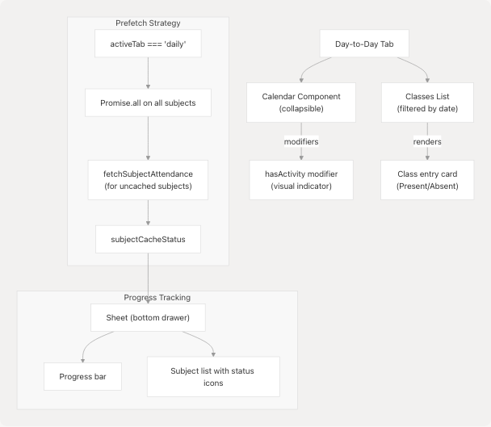
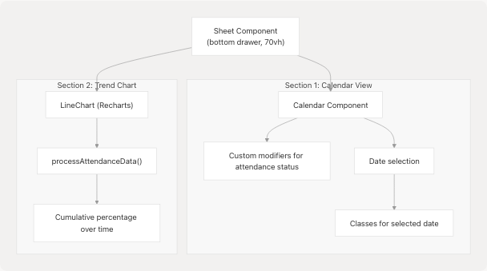

# Attendance Module

## Purpose and Scope

The Attendance Module provides students with a comprehensive view of their class attendance across all registered subjects. This module displays attendance statistics, calculates how many classes a student can miss or must attend to maintain a target percentage, and offers detailed day-by-day attendance tracking with historical trends.

This document covers the implementation of attendance tracking and visualization. For information about overall application architecture and state management patterns, see [Architecture Overview](3-architecture-overview). For details on the data layer and API integration, see [Data Layer & API Integration](3.3-data-layer-and-api-integration).

---

## Component Architecture

The Attendance Module consists of three primary React components that work together to provide attendance tracking functionality:


**Sources:** [jportal/src/components/Attendance.jsx1-477](https://github.com/codeblech/jportal/blob/4df0fde4/jportal/src/components/Attendance.jsx#L1-L477) [jportal/src/components/AttendanceCard.jsx1-359](https://github.com/codeblech/jportal/blob/4df0fde4/jportal/src/components/AttendanceCard.jsx#L1-L359) [jportal/src/components/CircleProgress.jsx1-53](https://github.com/codeblech/jportal/blob/4df0fde4/jportal/src/components/CircleProgress.jsx#L1-L53)

---

## State Management and Props Interface

The `Attendance` component receives an extensive set of state variables and setters via props drilling from `AuthenticatedApp`. This design allows the parent to persist attendance data across navigation.

### Props Structure

| Prop Name | Type | Purpose |
| --- | --- | --- |
| `w` | `WebPortal | MockWebPortal` | Portal API instance for data fetching |
| `attendanceData` | `Object` | Cached attendance data keyed by `registration_id` |
| `semestersData` | `Object` | Available semesters metadata |
| `selectedSem` | `Object` | Currently selected semester object |
| `attendanceGoal` | `Number` | Target attendance percentage (0-100) |
| `subjectAttendanceData` | `Object` | Daily attendance records per subject |
| `selectedSubject` | `Object` | Subject selected in detail view |
| `activeTab` | `String` | Active tab: `"overview"` or `"daily"` |
| `dailyDate` | `Date` | Selected date in Day-to-Day view |
| `calendarOpen` | `Boolean` | Calendar visibility state |
| `isTrackerOpen` | `Boolean` | Fetch progress sheet visibility |
| `subjectCacheStatus` | `Object` | Per-subject fetch status tracking |

Each state variable has a corresponding setter function passed as a prop (e.g., `setAttendanceData`, `setSelectedSem`).

**Sources:** [jportal/src/components/Attendance.jsx12-40](https://github.com/codeblech/jportal/blob/4df0fde4/jportal/src/components/Attendance.jsx#L12-L40)

---

## Data Flow and Fetching Strategy


**Sources:** [jportal/src/components/Attendance.jsx41-98](https://github.com/codeblech/jportal/blob/4df0fde4/jportal/src/components/Attendance.jsx#L41-L98) [jportal/src/components/Attendance.jsx100-132](https://github.com/codeblech/jportal/blob/4df0fde4/jportal/src/components/Attendance.jsx#L100-L132)

### Initial Data Fetch

On component mount, the `Attendance` component executes a multi-step data fetching process [jportal/src/components/Attendance.jsx41-98](https://github.com/codeblech/jportal/blob/4df0fde4/jportal/src/components/Attendance.jsx#L41-L98):

1. **Fetch Semester Metadata**: Calls `w.get_attendance_meta()` to retrieve available semesters
2. **Extract Latest Semester**: Uses `meta.latest_semester()` to identify the current semester
3. **Fetch Attendance Data**: Calls `w.get_attendance(header, latestSem)` for the selected semester
4. **Error Handling**: If latest semester returns "NO Attendance Found", falls back to previous semester [jportal/src/components/Attendance.jsx73-87](https://github.com/codeblech/jportal/blob/4df0fde4/jportal/src/components/Attendance.jsx#L73-L87)

### Semester Change Handling

When a user selects a different semester [jportal/src/components/Attendance.jsx100-132](https://github.com/codeblech/jportal/blob/4df0fde4/jportal/src/components/Attendance.jsx#L100-L132):

1. **Immediate UI Update**: Selected semester updates immediately for responsive UX
2. **Cache Check**: Verifies if `attendanceData[registration_id]` exists
3. **Conditional Fetch**: Only fetches from API if data is not cached
4. **Error State**: Stores error message in cache if attendance is unavailable

**Sources:** [jportal/src/components/Attendance.jsx41-132](https://github.com/codeblech/jportal/blob/4df0fde4/jportal/src/components/Attendance.jsx#L41-L132)

---

## Subject Data Processing

The component transforms raw API response data into a structured format for display [jportal/src/components/Attendance.jsx141-185](https://github.com/codeblech/jportal/blob/4df0fde4/jportal/src/components/Attendance.jsx#L141-L185):

```
// Extracted subject processing logic
const subjects = attendanceData[selectedSem.registration_id]?.studentattendancelist?.map((item) => {
  const { attended, total } = {
    attended: (Ltotalpres || 0) + (Ttotalpres || 0) + (Ptotalpres || 0),
    total: (Ltotalclass || 0) + (Ttotalclass || 0) + (Ptotalclass || 0),
  };

  return {
    name: subjectcode,
    attendance: { attended, total },
    combined: LTpercantage,
    lecture: Lpercentage,
    tutorial: Tpercentage,
    practical: Ppercentage,
    classesNeeded: Math.ceil((goal * total - 100 * attended) / (100 - goal)),
    classesCanMiss: Math.floor((100 * attended - goal * total) / goal),
  };
});
```

### API Response Structure

The `studentattendancelist` array contains objects with the following structure:

| Field | Type | Description |
| --- | --- | --- |
| `subjectcode` | String | Subject name/code |
| `Ltotalclass`, `Ltotalpres` | Number | Lecture total and present count |
| `Ttotalclass`, `Ttotalpres` | Number | Tutorial total and present count |
| `Ptotalclass`, `Ptotalpres` | Number | Practical total and present count |
| `LTpercantage` | Number | Combined attendance percentage |
| `Lpercentage`, `Tpercentage`, `Ppercentage` | Number | Component-wise percentages |
| `subjectid`, `individualsubjectcode` | String | Identifiers for detailed fetch |

**Sources:** [jportal/src/components/Attendance.jsx141-185](https://github.com/codeblech/jportal/blob/4df0fde4/jportal/src/components/Attendance.jsx#L141-L185) [jportal/src/assets/fakedata.json22-183](https://github.com/codeblech/jportal/blob/4df0fde4/jportal/src/assets/fakedata.json#L22-L183)

---

## Attendance Goal Calculation

The module calculates actionable metrics based on the user-defined `attendanceGoal`:

### Classes Needed Formula

```
classesNeeded = ceil((goal × total - 100 × attended) / (100 - goal))
```

This formula determines how many consecutive classes a student must attend to reach their goal percentage.

### Classes Can Miss Formula

```
classesCanMiss = floor((100 × attended - goal × total) / goal)
```

This formula determines how many consecutive classes a student can miss while maintaining their goal percentage.

### Goal Input Validation

The goal input field accepts values between 1 and 100, with special handling [jportal/src/components/Attendance.jsx134-139](https://github.com/codeblech/jportal/blob/4df0fde4/jportal/src/components/Attendance.jsx#L134-L139):

```
const handleGoalChange = (e) => {
  const value = e.target.value === "" ? "" : parseInt(e.target.value);
  if (value === "" || (!isNaN(value) && value > 0 && value <= 100)) {
    setAttendanceGoal(value);
  }
};
```

**Sources:** [jportal/src/components/Attendance.jsx134-139](https://github.com/codeblech/jportal/blob/4df0fde4/jportal/src/components/Attendance.jsx#L134-L139) [jportal/src/components/Attendance.jsx164-169](https://github.com/codeblech/jportal/blob/4df0fde4/jportal/src/components/Attendance.jsx#L164-L169)

---

## Feature: Overview Tab

The Overview tab displays a summary card for each subject showing attendance statistics and goal-based recommendations.


### AttendanceCard Component

Each subject is rendered using `AttendanceCard` [jportal/src/components/AttendanceCard.jsx102-129](https://github.com/codeblech/jportal/blob/4df0fde4/jportal/src/components/AttendanceCard.jsx#L102-L129) Key features include:

* **Subject Name Cleaning**: Removes trailing parenthetical content using regex `name.replace(/\s*\([^)]*\)\s*$/, "")` [jportal/src/components/AttendanceCard.jsx17](https://github.com/codeblech/jportal/blob/4df0fde4/jportal/src/components/AttendanceCard.jsx#L17-L17)
* **Component Breakdown**: Displays Lecture, Tutorial, and Practical percentages if non-zero
* **Circular Progress**: Shows combined percentage using `CircleProgress` component
* **Actionable Metric**: Displays either "Attend X" or "Can miss Y" based on goal calculation

### Click Interaction

Clicking an `AttendanceCard` opens a `Sheet` component with detailed attendance history [jportal/src/components/AttendanceCard.jsx22-29](https://github.com/codeblech/jportal/blob/4df0fde4/jportal/src/components/AttendanceCard.jsx#L22-L29):

1. Sets `selectedSubject` to trigger sheet open state
2. Checks if detailed data exists in `subjectAttendanceData[subject.name]`
3. If not cached, calls `fetchSubjectAttendance(subject)` to load daily records

**Sources:** [jportal/src/components/Attendance.jsx295-311](https://github.com/codeblech/jportal/blob/4df0fde4/jportal/src/components/Attendance.jsx#L295-L311) [jportal/src/components/AttendanceCard.jsx1-129](https://github.com/codeblech/jportal/blob/4df0fde4/jportal/src/components/AttendanceCard.jsx#L1-L129)

---

## Feature: Day-to-Day Tab

The Day-to-Day tab provides a calendar-based view of all classes for all subjects, with automatic prefetching of daily attendance data.



### Prefetching Implementation

When the user switches to the Day-to-Day tab, the component automatically fetches daily attendance for all subjects [jportal/src/components/Attendance.jsx214-231](https://github.com/codeblech/jportal/blob/4df0fde4/jportal/src/components/Attendance.jsx#L214-L231):

```
useEffect(() => {
  if (activeTab !== "daily") return;

  const loadAllSubjects = async () => {
    await Promise.all(
      subjects.map(async (subj) => {
        if (subjectAttendanceData[subj.name]) {
          setSubjectCacheStatus((p) => ({ ...p, [subj.name]: "cached" }));
          return;
        }
        setSubjectCacheStatus((p) => ({ ...p, [subj.name]: "fetching" }));
        await fetchSubjectAttendance(subj);
        setSubjectCacheStatus((p) => ({ ...p, [subj.name]: "cached" }));
      })
    );
  };
  loadAllSubjects();
}, [activeTab]);
```

### Cache Status Tracking

The `subjectCacheStatus` object tracks three states per subject:

* `"idle"`: Not yet fetched
* `"fetching"`: Currently fetching
* `"cached"`: Data available locally

### Progress Sheet

A floating button displays fetch progress [jportal/src/components/Attendance.jsx407-468](https://github.com/codeblech/jportal/blob/4df0fde4/jportal/src/components/Attendance.jsx#L407-L468) The button shows a `CircleProgress` indicator with a fraction label (e.g., "8/10"). Clicking it opens a bottom sheet with:

* **Progress bar**: Visual representation of overall completion
* **Subject list**: Individual subject status with icons:
  + `Check` icon (from lucide-react) for cached
  + `Loader2` icon (animated spinner) for fetching
  + `AlertCircle` icon for idle

### Calendar Display

The calendar uses the `react-day-picker` library (via shadcn/ui `Calendar` component) with custom modifiers [jportal/src/components/Attendance.jsx333-341](https://github.com/codeblech/jportal/blob/4df0fde4/jportal/src/components/Attendance.jsx#L333-L341):

```
modifiers={{
  hasActivity: (date) => subjects.some((s) => getClassesFor(s.name, date).length > 0),
}}
modifiersStyles={{
  hasActivity: {
    boxShadow: "inset 0 -2px 0 0 var(--color-primary)",
    borderRadius: "3px",
  },
}}
```

The `hasActivity` modifier adds a bottom border to dates that have classes scheduled.

### Class List Display

For the selected date, classes are grouped by subject [jportal/src/components/Attendance.jsx374-396](https://github.com/codeblech/jportal/blob/4df0fde4/jportal/src/components/Attendance.jsx#L374-L396) Each class entry shows:

* Subject name
* Class type (Lecture/Tutorial/Practical)
* Present/Absent status (color-coded: `text-chart-1` for present, `text-chart-2` for absent)
* Date and time

**Sources:** [jportal/src/components/Attendance.jsx214-404](https://github.com/codeblech/jportal/blob/4df0fde4/jportal/src/components/Attendance.jsx#L214-L404) [jportal/src/components/Attendance.jsx233-242](https://github.com/codeblech/jportal/blob/4df0fde4/jportal/src/components/Attendance.jsx#L233-L242)

---

## Feature: Subject Detail Sheet

Clicking an `AttendanceCard` in the Overview tab opens a bottom sheet with two scrollable sections:



### Calendar Modifiers for Attendance Status

The detail calendar uses sophisticated modifiers to visually represent attendance patterns [jportal/src/components/AttendanceCard.jsx145-191](https://github.com/codeblech/jportal/blob/4df0fde4/jportal/src/components/AttendanceCard.jsx#L145-L191) The `getDayStatus` function returns an array of boolean values (true = Present, false = Absent) for each class on a given date.

#### Modifier Categories

| Modifier Name | Condition | Visual Style |
| --- | --- | --- |
| `presentSingle` | 1 class, Present | Green circle background |
| `absentSingle` | 1 class, Absent | Red circle background |
| `presentDouble` | 2 classes, both Present | Green circle background |
| `absentDouble` | 2 classes, both Absent | Red circle background |
| `mixedDouble` | 2 classes, 1 Present, 1 Absent | Linear gradient (90deg, green/red split) |
| `presentTriple` | 3 classes, all Present | Green circle background |
| `absentTriple` | 3 classes, all Absent | Red circle background |
| `mixedTripleAllPresent` | 3 classes, 2 Present | Conic gradient (240° green, 120° red) |
| `mixedTripleAllAbsent` | 3 classes, 2 Absent | Conic gradient (240° red, 120° green) |
| `mixedTripleEqual` | 3 classes, mixed equally | Conic gradient (alternating) |

The visual styles use CSS `color-mix()` function with CSS variables [jportal/src/components/AttendanceCard.jsx193-246](https://github.com/codeblech/jportal/blob/4df0fde4/jportal/src/components/AttendanceCard.jsx#L193-L246):

```
presentSingle: {
  backgroundColor: "color-mix(in srgb, var(--chart-3) 30%, transparent)",
  borderRadius: "50%",
}
```

### Selected Date Display

When a user clicks a date with classes, the component displays detailed information for each class [jportal/src/components/AttendanceCard.jsx277-293](https://github.com/codeblech/jportal/blob/4df0fde4/jportal/src/components/AttendanceCard.jsx#L277-L293):

```
{selectedDate && (
  <div className="mt-4 space-y-2 w-full pb-4">
    {getClassesForDate(selectedDate).map((classData, index) => (
      <div key={index} className={`p-2 rounded ${
        classData.present === "Present" ? "bg-chart-3/30" : "bg-chart-5/30"
      }`}>
        <p className="text-sm">{classData.attendanceby}</p>
        <p className="text-xs">{classData.classtype} - {classData.present}</p>
        <p className="text-xs">{classData.datetime}</p>
      </div>
    ))}
  </div>
)}
```

### Attendance Trend Chart

The second section of the sheet displays a cumulative attendance trend [jportal/src/components/AttendanceCard.jsx298-350](https://github.com/codeblech/jportal/blob/4df0fde4/jportal/src/components/AttendanceCard.jsx#L298-L350) The `processAttendanceData` function [jportal/src/components/AttendanceCard.jsx68-100](https://github.com/codeblech/jportal/blob/4df0fde4/jportal/src/components/AttendanceCard.jsx#L68-L100):

1. **Sorts** all attendance records chronologically
2. **Calculates** cumulative present/total counts
3. **Computes** percentage after each class
4. **Groups** by date to avoid duplicate points

The resulting `LineChart` shows how attendance percentage evolved over time:

```
<LineChart data={processAttendanceData()}>
  <XAxis dataKey="date" tickFormatter={(value) => {
    const [day, month] = value.split("/");
    return `${day}/${month}`;
  }} />
  <YAxis domain={[0, 100]} tickFormatter={(value) => `${value}%`} />
  <Line type="monotone" dataKey="percentage" stroke="var(--chart-5)" />
</LineChart>
```

**Sources:** [jportal/src/components/AttendanceCard.jsx131-353](https://github.com/codeblech/jportal/blob/4df0fde4/jportal/src/components/AttendanceCard.jsx#L131-L353)

---

## Data Fetching Methods

### Fetching Subject Daily Attendance

The `fetchSubjectAttendance` function retrieves day-by-day attendance records for a specific subject [jportal/src/components/Attendance.jsx187-212](https://github.com/codeblech/jportal/blob/4df0fde4/jportal/src/components/Attendance.jsx#L187-L212):

```
const fetchSubjectAttendance = async (subject) => {
  const attendance = attendanceData[selectedSem.registration_id];
  const subjectData = attendance.studentattendancelist.find(
    (s) => s.subjectcode === subject.name
  );

  const subjectcomponentids = ["Lsubjectcomponentid", "Psubjectcomponentid", "Tsubjectcomponentid"]
    .filter((id) => subjectData[id])
    .map((id) => subjectData[id]);

  const data = await w.get_subject_daily_attendance(
    selectedSem,
    subjectData.subjectid,
    subjectData.individualsubjectcode,
    subjectcomponentids
  );

  setSubjectAttendanceData((prev) => ({
    ...prev,
    [subject.name]: data.studentAttdsummarylist,
  }));
};
```

### API Method Signature

The `get_subject_daily_attendance` method is implemented in both `WebPortal` (real mode) and `MockWebPortal` (demo mode) [jportal/src/components/MockWebPortal.js53-57](https://github.com/codeblech/jportal/blob/4df0fde4/jportal/src/components/MockWebPortal.js#L53-L57):

**Parameters:**

* `semester`: Semester object with `registration_id` and `registration_code`
* `subjectid`: Unique subject identifier
* `individualsubjectcode`: Subject code for lookup
* `subjectcomponentids`: Array of component IDs (Lecture, Tutorial, Practical)

**Returns:**

```
{
  studentAttdsummarylist: [
    {
      datetime: "01/01/2025 (10:00:AM - 10:50:AM)",
      classtype: "Lecture",
      present: "Present",
      attendanceby: "FACULTY NAME"
    },
    // ... more entries
  ]
}
```

**Sources:** [jportal/src/components/Attendance.jsx187-212](https://github.com/codeblech/jportal/blob/4df0fde4/jportal/src/components/Attendance.jsx#L187-L212) [jportal/src/components/MockWebPortal.js53-57](https://github.com/codeblech/jportal/blob/4df0fde4/jportal/src/components/MockWebPortal.js#L53-L57) [jportal/src/assets/fakedata.json287-504](https://github.com/codeblech/jportal/blob/4df0fde4/jportal/src/assets/fakedata.json#L287-L504)

---

## UI Components Used

The Attendance Module leverages components from the application's UI library (shadcn/ui + Radix UI primitives) and Recharts for visualization.

### Component Import Map

| Component | Source | Usage in Attendance Module |
| --- | --- | --- |
| `Select`, `SelectContent`, `SelectItem`, `SelectTrigger`, `SelectValue` | `@/components/ui/select` | Semester selection dropdown |
| `Input` | `@/components/ui/input` | Attendance goal percentage input |
| `Calendar` | `@/components/ui/calendar` | Date picker for Day-to-Day tab and subject details |
| `Tabs`, `TabsList`, `TabsTrigger`, `TabsContent` | `@/components/ui/tabs` | Overview/Day-to-Day tab switching |
| `Sheet`, `SheetTrigger`, `SheetContent`, `SheetHeader`, `SheetTitle` | `@/components/ui/sheet` | Subject detail drawer and progress tracker |
| `Progress` | `@/components/ui/progress` | Fetch progress indicator |
| `LineChart`, `Line`, `XAxis`, `YAxis`, `CartesianGrid`, `Tooltip`, `ResponsiveContainer` | `recharts` | Attendance trend visualization |

### Icon Components

Lucide React icons are used for visual feedback [jportal/src/components/Attendance.jsx10](https://github.com/codeblech/jportal/blob/4df0fde4/jportal/src/components/Attendance.jsx#L10-L10):

* `Check`: Indicates cached data
* `Loader2`: Animated spinner for fetching state
* `AlertCircle`: Indicates idle/pending state
* `ChevronDown`, `ChevronUp`: Calendar toggle indicators

**Sources:** [jportal/src/components/Attendance.jsx1-11](https://github.com/codeblech/jportal/blob/4df0fde4/jportal/src/components/Attendance.jsx#L1-L11) [jportal/src/components/AttendanceCard.jsx1-6](https://github.com/codeblech/jportal/blob/4df0fde4/jportal/src/components/AttendanceCard.jsx#L1-L6)

---

## Styling and Responsiveness

### Sticky Header

The semester selector and goal input are positioned in a sticky header [jportal/src/components/Attendance.jsx246-272](https://github.com/codeblech/jportal/blob/4df0fde4/jportal/src/components/Attendance.jsx#L246-L272):

```
<div className="sticky top-14 bg-background z-20">
  <div className="flex gap-2 py-2 px-3">
    <Select>{/* Semester selector */}</Select>
    <Input type="number" className="w-32" placeholder="Goal %" />
  </div>
</div>
```

The `top-14` offset accounts for the application's main header height.

### Responsive Design

The module uses responsive Tailwind classes extensively:

* **CircleProgress sizing**: `w-[80px] h-[80px]` with font size `text-[13px] max-[390px]:text-[12px]` [jportal/src/components/CircleProgress.jsx24-46](https://github.com/codeblech/jportal/blob/4df0fde4/jportal/src/components/CircleProgress.jsx#L24-L46)
* **Subject cards**: Font sizes adjust at 390px breakpoint: `text-sm max-[390px]:text-xs` [jportal/src/components/AttendanceCard.jsx109-112](https://github.com/codeblech/jportal/blob/4df0fde4/jportal/src/components/AttendanceCard.jsx#L109-L112)
* **Calendar**: Cell sizing adapts with `max-[390px]:h-6 max-[390px]:w-6 max-[390px]:text-xs` [jportal/src/components/Attendance.jsx359](https://github.com/codeblech/jportal/blob/4df0fde4/jportal/src/components/Attendance.jsx#L359-L359)

### Theme Integration

All components use CSS custom properties for theming:

* Colors: `var(--foreground)`, `var(--background)`, `var(--chart-1)`, etc.
* Interactive states: `hover:bg-accent hover:text-accent-foreground`
* Chart colors: `stroke="var(--chart-5)"` for Recharts compatibility

**Sources:** [jportal/src/components/Attendance.jsx246-272](https://github.com/codeblech/jportal/blob/4df0fde4/jportal/src/components/Attendance.jsx#L246-L272) [jportal/src/components/CircleProgress.jsx24-46](https://github.com/codeblech/jportal/blob/4df0fde4/jportal/src/components/CircleProgress.jsx#L24-L46) [jportal/src/components/AttendanceCard.jsx105-129](https://github.com/codeblech/jportal/blob/4df0fde4/jportal/src/components/AttendanceCard.jsx#L105-L129)

---

## Demo Mode Data Structure

For development and demonstration purposes, the `MockWebPortal` class provides fake attendance data from `fakedata.json`.

### Semester Ordering Logic

The mock implementation intelligently reorders semesters based on the current date [jportal/src/components/MockWebPortal.js13-45](https://github.com/codeblech/jportal/blob/4df0fde4/jportal/src/components/MockWebPortal.js#L13-L45):

```
const currentMonth = new Date().getMonth() + 1; // 1-12
const isEvenSemesterPeriod = currentMonth >= 1 && currentMonth <= 7;

orderedSemesters.sort((a, b) => {
  const aIsEven = a.registration_code.includes("EVESEM");
  const bIsEven = b.registration_code.includes("EVESEM");

  if (isEvenSemesterPeriod) {
    // EVESEM first during Jan-July
    if (aIsEven && !bIsEven) return -1;
  } else {
    // ODDSEM first during Aug-Dec
    if (!aIsEven && bIsEven) return -1;
  }
  return 0;
});
```

This ensures the demo displays the currently active academic semester by default.

### Mock Data Structure

The fake data is organized hierarchically in `fakedata.json` [jportal/src/assets/fakedata.json2-285](https://github.com/codeblech/jportal/blob/4df0fde4/jportal/src/assets/fakedata.json#L2-L285):

```
{
  "attendance": {
    "semestersData": {
      "semesters": [ /* semester objects */ ],
      "latest_header": "header2025EVESEM",
      "latest_semester": { /* semester object */ }
    },
    "attendanceData": {
      "2025EVESEM": {
        "studentattendancelist": [ /* subject attendance objects */ ]
      },
      "2025ODDSEM": { /* ... */ }
    },
    "subjectAttendanceData": {
      "15B11EC611": [ /* daily attendance records */ ],
      "15B17EC671": [ /* ... */ ]
    }
  }
}
```

**Sources:** [jportal/src/components/MockWebPortal.js12-57](https://github.com/codeblech/jportal/blob/4df0fde4/jportal/src/components/MockWebPortal.js#L12-L57) [jportal/src/assets/fakedata.json1-578](https://github.com/codeblech/jportal/blob/4df0fde4/jportal/src/assets/fakedata.json#L1-L578)

---

## Error Handling

The module implements several error handling strategies:

### Missing Attendance Data

If the latest semester has no attendance data, the component falls back to the previous semester [jportal/src/components/Attendance.jsx73-88](https://github.com/codeblech/jportal/blob/4df0fde4/jportal/src/components/Attendance.jsx#L73-L88):

```
catch (error) {
  if (error.message.includes("NO Attendance Found")) {
    const previousSem = meta.semesters[1];
    if (previousSem) {
      const data = await w.get_attendance(header, previousSem);
      setAttendanceData((prev) => ({ ...prev, [previousSem.registration_id]: data }));
      setSelectedSem(previousSem);
    }
  } else {
    throw error;
  }
}
```

### Error State Display

When semester-specific data is unavailable, an error message is cached and displayed [jportal/src/components/Attendance.jsx120-127](https://github.com/codeblech/jportal/blob/4df0fde4/jportal/src/components/Attendance.jsx#L120-L127):

```
catch (error) {
  if (error.message.includes("NO Attendance Found")) {
    setAttendanceData((prev) => ({
      ...prev,
      [value]: { error: "Attendance not available for this semester" },
    }));
  }
}
```

The UI checks for this error state and displays it [jportal/src/components/Attendance.jsx296-300](https://github.com/codeblech/jportal/blob/4df0fde4/jportal/src/components/Attendance.jsx#L296-L300):

```
{selectedSem && attendanceData[selectedSem.registration_id]?.error ? (
  <div className="flex items-center justify-center py-4">
    {attendanceData[selectedSem.registration_id].error}
  </div>
) : /* render subject cards */}
```

**Sources:** [jportal/src/components/Attendance.jsx73-88](https://github.com/codeblech/jportal/blob/4df0fde4/jportal/src/components/Attendance.jsx#L73-L88) [jportal/src/components/Attendance.jsx120-127](https://github.com/codeblech/jportal/blob/4df0fde4/jportal/src/components/Attendance.jsx#L120-L127) [jportal/src/components/Attendance.jsx296-311](https://github.com/codeblech/jportal/blob/4df0fde4/jportal/src/components/Attendance.jsx#L296-L311)

---

## Performance Optimizations

### Caching Strategy

The module implements multi-level caching:

1. **Semester-level cache**: `attendanceData` object keyed by `registration_id` stores fetched attendance data
2. **Subject-level cache**: `subjectAttendanceData` object keyed by subject name stores daily attendance
3. **Cache status tracking**: `subjectCacheStatus` prevents redundant fetches

### Conditional Rendering

Loading states are managed efficiently [jportal/src/components/Attendance.jsx274-278](https://github.com/codeblech/jportal/blob/4df0fde4/jportal/src/components/Attendance.jsx#L274-L278):

```
{isAttendanceMetaLoading || isAttendanceDataLoading ? (
  <div className="flex items-center justify-center py-4">
    Loading attendance...
  </div>
) : /* render tabs */}
```

### Lazy Loading

Subject detail data is only fetched when:

* User clicks an `AttendanceCard` in Overview tab
* User switches to Day-to-Day tab (batch fetch)

This approach minimizes initial load time and API calls.

**Sources:** [jportal/src/components/Attendance.jsx100-132](https://github.com/codeblech/jportal/blob/4df0fde4/jportal/src/components/Attendance.jsx#L100-L132) [jportal/src/components/Attendance.jsx214-231](https://github.com/codeblech/jportal/blob/4df0fde4/jportal/src/components/Attendance.jsx#L214-L231) [jportal/src/components/AttendanceCard.jsx22-29](https://github.com/codeblech/jportal/blob/4df0fde4/jportal/src/components/AttendanceCard.jsx#L22-L29)

---

## Integration Points

### Parent Component (AuthenticatedApp)

The Attendance Module is instantiated within `AuthenticatedApp` as a route component. All state is managed at the parent level and passed via props, enabling:

* **State persistence** across navigation
* **Shared state** with other modules (e.g., `attendanceGoal` persisted in localStorage)
* **Centralized loading states** coordinated with app-level loading indicators

For details on how AuthenticatedApp coordinates state, see [State Management Strategy](3.2-state-management-strategy).

### Data Layer

The module interfaces with the data layer exclusively through the `w` prop, which implements the portal API abstraction. This allows seamless switching between:

* **Production mode**: `WebPortal` instance (from jsjiit library) communicating with JIIT backend
* **Demo mode**: `MockWebPortal` instance reading from `fakedata.json`

For details on the data layer architecture, see [Data Layer & API Integration](3.3-data-layer-and-api-integration).

### UI Component Library

The module depends on base UI components documented in [Base UI Components](5.3-base-ui-components) and custom components documented in [Custom Feature Components](5.1-custom-feature-components).

**Sources:** [jportal/src/components/Attendance.jsx12-40](https://github.com/codeblech/jportal/blob/4df0fde4/jportal/src/components/Attendance.jsx#L12-L40)
