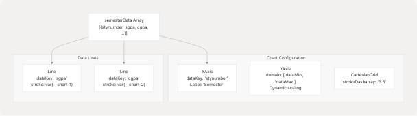
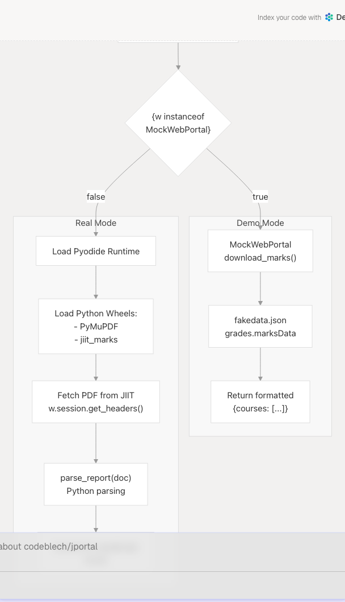

# Grades Module

> Source: https://deepwiki.com/codeblech/jportal/4.2-grades-module

# Grades Module

Relevant source files

* [color.txt](https://github.com/codeblech/jportal/blob/4df0fde4/color.txt)
* [jportal/public/pwa-icons/j-yuvraj.svg](https://github.com/codeblech/jportal/blob/4df0fde4/jportal/public/pwa-icons/j-yuvraj.svg)
* [jportal/src/assets/fakedata.json](https://github.com/codeblech/jportal/blob/4df0fde4/jportal/src/assets/fakedata.json)
* [jportal/src/components/Attendance.jsx](https://github.com/codeblech/jportal/blob/4df0fde4/jportal/src/components/Attendance.jsx)
* [jportal/src/components/Grades.jsx](https://github.com/codeblech/jportal/blob/4df0fde4/jportal/src/components/Grades.jsx)
* [jportal/src/components/MarksCard.jsx](https://github.com/codeblech/jportal/blob/4df0fde4/jportal/src/components/MarksCard.jsx)
* [jportal/src/components/MockWebPortal.js](https://github.com/codeblech/jportal/blob/4df0fde4/jportal/src/components/MockWebPortal.js)
* [jportal/src/components/ui/progress.jsx](https://github.com/codeblech/jportal/blob/4df0fde4/jportal/src/components/ui/progress.jsx)
* [jportal/vite.config.ts](https://github.com/codeblech/jportal/blob/4df0fde4/jportal/vite.config.ts)

## Purpose and Scope

The Grades Module provides students with comprehensive academic performance tracking across three main views: semester-wise SGPA/CGPA trends, detailed grade cards, and examination marks. This module supports both real-time data fetching from the JIIT portal and demo mode using mock data. The module implements client-side PDF parsing for marks extraction using Pyodide and PyMuPDF.

For information about other feature modules, see [Attendance Module](/codeblech/jportal/4.1-attendance-module), [Exams Module](/codeblech/jportal/4.3-exams-module), [Subjects Module](/codeblech/jportal/4.4-subjects-module), and [Profile Module](/codeblech/jportal/4.5-profile-module).

---

## Module Overview

The Grades Module is implemented as a tab-based interface with three distinct views:

| Tab | Purpose | Data Source Method |
| --- | --- | --- |
| **Overview** | Displays SGPA/CGPA trends across all semesters with a line chart | `w.get_sgpa_cgpa()` |
| **Semester** | Shows subject-wise grade cards for a selected semester | `w.get_grade_card(semester)` |
| **Marks** | Displays detailed examination marks parsed from PDF reports | `w.download_marks(semester)` + Pyodide PDF processing |

The module maintains separate state caches for each data type to minimize redundant API calls and provides a consistent loading/error experience across all tabs.

**Sources:** [src/components/Grades.jsx1-531](https://github.com/codeblech/jportal/blob/4df0fde4/src/components/Grades.jsx#L1-L531)

---

## Component Architecture


```

**Sources:** [src/components/Grades.jsx1-531](https://github.com/codeblech/jportal/blob/4df0fde4/src/components/Grades.jsx#L1-L531) [src/components/GradeCard.jsx1-42](https://github.com/codeblech/jportal/blob/4df0fde4/src/components/GradeCard.jsx#L1-L42) [src/components/MarksCard.jsx1-42](https://github.com/codeblech/jportal/blob/4df0fde4/src/components/MarksCard.jsx#L1-L42)

---

## State Management

The Grades component receives 24 props from `AuthenticatedApp`, following the props drilling pattern used throughout JPortal. State is organized into functional groups:

### Core Data State

```

```

### State Caching Pattern

The module implements client-side caching to prevent redundant API calls:

* **`gradeCards`**: Object keyed by `registration_id`, stores fetched grade cards
* **`marksData`**: Object keyed by `registration_id`, stores parsed marks data

When a user switches semesters, the component checks the cache first before making an API request.

**Sources:** [src/components/Grades.jsx13-47](https://github.com/codeblech/jportal/blob/4df0fde4/src/components/Grades.jsx#L13-L47)

---

## Data Flow and API Integration

### Initial Data Loading

```

```

### Semester Selection Flow

The component implements optimistic UI updates with cache checking:

```
```
// Grade Card Semester Change
handleSemesterChange(value)
  -> setGradeCardLoading(true)
  -> setSelectedGradeCardSem(semester)
  -> if (gradeCards[value]) { use cached data }
  -> else { fetch w.get_grade_card(semester) }
  -> setGradeCards cache
  -> setGradeCardLoading(false)
```
```

**Sources:** [src/components/Grades.jsx48-77](https://github.com/codeblech/jportal/blob/4df0fde4/src/components/Grades.jsx#L48-L77) [src/components/Grades.jsx79-105](https://github.com/codeblech/jportal/blob/4df0fde4/src/components/Grades.jsx#L79-L105) [src/components/Grades.jsx107-119](https://github.com/codeblech/jportal/blob/4df0fde4/src/components/Grades.jsx#L107-L119) [src/components/Grades.jsx211-233](https://github.com/codeblech/jportal/blob/4df0fde4/src/components/Grades.jsx#L211-L233)

---

## Overview Tab

The Overview tab displays SGPA/CGPA trends using a Recharts `LineChart` component.

### Data Visualization

```

```

### Semester Data Structure

Each semester object contains:

| Field | Type | Description |
| --- | --- | --- |
| `stynumber` | number | Semester number (1, 2, 3, ...) |
| `sgpa` | number | Semester Grade Point Average |
| `cgpa` | number | Cumulative Grade Point Average |
| `earnedgradepoints` | number | Total grade points earned |
| `totalcoursecredit` | number | Total credits for semester |

### Chart Theming

The chart uses CSS custom properties for theming:

* Grid lines: `var(--border)`
* Axis labels: `var(--muted-foreground)`
* SGPA line: `var(--chart-1)` (displayed with `.text-chart-1` class)
* CGPA line: `var(--chart-2)` (displayed with `.text-chart-2` class)
* Tooltip background: `var(--card)`

**Sources:** [src/components/Grades.jsx304-405](https://github.com/codeblech/jportal/blob/4df0fde4/src/components/Grades.jsx#L304-L405)

---

## Semester Tab

The Semester tab displays subject-wise grade information for a selected semester.

### Grade Card Structure

```

```

### Grade Color Mapping

The `getGradeColor()` function maps letter grades to theme colors:

| Grade | CSS Class | Color Variable |
| --- | --- | --- |
| A+ | `text-grade-aa` | Outstanding |
| A | `text-grade-a` | Excellent |
| B+ | `text-grade-bb` | Very Good |
| B | `text-grade-b` | Good |
| C+ | `text-grade-cc` | Average |
| C | `text-grade-c` | Below Average |
| D | `text-grade-d` | Pass |
| F | `text-grade-f` | Fail |

### GradeCard Component

The `GradeCard` component ([src/components/GradeCard.jsx](https://github.com/codeblech/jportal/blob/4df0fde4/src/components/GradeCard.jsx)) displays individual subject grades with the following layout:

1. **Header**: Subject code and description
2. **Grade Display**: Large, color-coded letter grade
3. **Metrics**: Credits and earned grade points

**Sources:** [src/components/Grades.jsx235-247](https://github.com/codeblech/jportal/blob/4df0fde4/src/components/Grades.jsx#L235-L247) [src/components/Grades.jsx408-446](https://github.com/codeblech/jportal/blob/4df0fde4/src/components/Grades.jsx#L408-L446)

---

## Marks Tab

The Marks tab displays detailed examination marks parsed from PDF reports. This is the most complex tab due to PDF processing requirements.

### Dual-Mode Operation

```

```

### Pyodide PDF Processing Pipeline

When in real mode, the marks tab executes the following Python code in the browser:

```
```
# Executed in Pyodide environment
await pyodide_js.loadPackage("/jportal/artifact/PyMuPDF-1.24.12-...")
await pyodide_js.loadPackage("/jportal/artifact/jiit_marks-0.2.0-...")

import pymupdf
from jiit_marks import parse_report

r = await pyodide.http.pyfetch(API+ENDPOINT, **(fetchOptions.to_py()))
data = await r.bytes()

doc = pymupdf.Document(stream=data)
marks = parse_report(doc)
```
```

The endpoint is constructed as:

```
/studentsexamview/printstudent-exammarks/{instituteid}/{registration_id}/{registration_code}
```

**Key Implementation Details:**

1. **Pyodide Loading**: Uses global `loadPyodide()` function
2. **Wheel Files**: Precached by service worker (see [vite.config.ts38-42](https://github.com/codeblech/jportal/blob/4df0fde4/vite.config.ts#L38-L42))
3. **Authentication**: Uses `w.session.get_headers()` with `generate_local_name()`
4. **Data Conversion**: `toJs({dict_converter: Object.fromEntries, create_pyproxies: false})`

**Sources:** [src/components/Grades.jsx121-209](https://github.com/codeblech/jportal/blob/4df0fde4/src/components/Grades.jsx#L121-L209) [vite.config.ts38-42](https://github.com/codeblech/jportal/blob/4df0fde4/vite.config.ts#L38-L42)

---

## Marks Data Structure

The parsed marks data follows this structure:

```

```

Example structure:

```
```
{
  "courses": [
    {
      "code": "15B11EC611",
      "name": "TELECOMMUNICATION NETWORKS",
      "exams": {
        "Mid Term": { "OM": 18, "FM": 25 },
        "End Term": { "OM": 42, "FM": 50 }
      }
    }
  ]
}
```
```

### MarksCard Component

The `MarksCard` component renders marks with visual progress indicators:

1. **Progress Bar**: Shows percentage (OM/FM × 100)
2. **Color Coding**: Based on performance
   * Outstanding (≥80%): `bg-marks-outstanding`
   * Good (≥60%): `bg-marks-good`
   * Average (≥40%): `bg-marks-average`
   * Poor (<40%): `bg-marks-poor`
3. **Marks Display**: Shows "OM/FM" format

**Sources:** [src/components/MarksCard.jsx1-42](https://github.com/codeblech/jportal/blob/4df0fde4/src/components/MarksCard.jsx#L1-L42) [src/components/Grades.jsx460-506](https://github.com/codeblech/jportal/blob/4df0fde4/src/components/Grades.jsx#L460-L506)

---

## Download Marks Dialog

The Download Marks button opens a dialog listing all available semesters. Clicking a semester triggers the download via:

```
```
handleDownloadMarks(semester)
  -> w.download_marks(semester)
  -> (Browser triggers download)
```

In **real mode**, this downloads the actual PDF from the JIIT portal. In **demo mode**, the `MockWebPortal` simulates the download without actual file creation.

The dialog is accessible from all three tabs and uses the `marksSemesters` list to populate options.

**Sources:** [src/components/Grades.jsx249-256](https://github.com/codeblech/jportal/blob/4df0fde4/src/components/Grades.jsx#L249-L256) [src/components/Grades.jsx509-527](https://github.com/codeblech/jportal/blob/4df0fde4/src/components/Grades.jsx#L509-L527)

---

## UI Components and Styling

### Tab System

The module uses Radix UI's `Tabs` component with custom styling:

```
TabsList: grid-cols-3, bg-background
TabsTrigger: 
  - Default: text-muted-foreground, bg-background
  - Active: data-[state=active]:bg-muted, data-[state=active]:text-foreground
```

### Select Components

Both Semester and Marks tabs use Radix UI `Select` with consistent theming:

* Trigger: `bg-background`, `text-foreground`, `border-foreground`
* Hover: `hover:bg-accent`, `hover:text-accent-foreground`
* Content: Same background and border as trigger

### Responsive Chart

The `ResponsiveContainer` wraps the LineChart with:

* Width: 100%
* Height: 250px
* Margins: `{top: 0, right: 10, left: 0, bottom: 20}`

**Sources:** [src/components/Grades.jsx280-302](https://github.com/codeblech/jportal/blob/4df0fde4/src/components/Grades.jsx#L280-L302) [src/components/Grades.jsx314-368](https://github.com/codeblech/jportal/blob/4df0fde4/src/components/Grades.jsx#L314-L368)

---

## Error Handling

The module implements three levels of error handling:

### 1. Overview Tab Errors

```
```
if (err.message.includes("Unexpected end of JSON input")) {
  setGradesError("Grade sheet is not available")
} else {
  setGradesError("Failed to fetch grade data")
}
```
```

Displays centered error message with helper text "Please check back later".

### 2. Empty State Handling

Each tab checks for empty data:

* **Semester tab**: `gradeCardSemesters.length === 0`
* **Marks tab**: `marksSemesters.length === 0`

Displays appropriate "not available yet" message.

### 3. PDF Processing Errors

PDF processing errors are caught and logged to console. The `marksLoading` state is always reset in the `finally` block to prevent UI lock.

**Sources:** [src/components/Grades.jsx65-74](https://github.com/codeblech/jportal/blob/4df0fde4/src/components/Grades.jsx#L65-L74) [src/components/Grades.jsx193-199](https://github.com/codeblech/jportal/blob/4df0fde4/src/components/Grades.jsx#L193-L199) [src/components/Grades.jsx272-278](https://github.com/codeblech/jportal/blob/4df0fde4/src/components/Grades.jsx#L272-L278)

---

## Integration with Mock Data System

The mock data system provides comprehensive fake data for all three tabs. The structure in `fakedata.json`:

```
```
{
  "grades": {
    "gradesData": {
      "semesterList": [...]
    },
    "gradeCardSemesters": [...],
    "gradeCards": {
      "2025EVESEM": {...},
      "2025ODDSEM": {...}
    },
    "marksSemesters": [...],
    "marksData": {
      "2025EVESEM": {
        "courses": [...]
      }
    }
  }
}
```
```

The `MockWebPortal` class provides matching methods:

* `get_sgpa_cgpa()` → returns `fakeData.grades.gradesData`
* `get_semesters_for_grade_card()` → returns `fakeData.grades.gradeCardSemesters`
* `get_grade_card(semester)` → returns `fakeData.grades.gradeCards[semKey]`
* `get_semesters_for_marks()` → returns `fakeData.grades.marksSemesters`
* `download_marks(semester)` → returns `fakeData.grades.marksData[semKey]`

**Sources:** [src/components/MockWebPortal.js59-79](https://github.com/codeblech/jportal/blob/4df0fde4/src/components/MockWebPortal.js#L59-L79) [src/assets/fakedata.json](https://github.com/codeblech/jportal/blob/4df0fde4/src/assets/fakedata.json)

---

## Performance Considerations

### 1. Caching Strategy

The module maintains separate cache objects (`gradeCards`, `marksData`) to minimize API calls. Cache keys use `registration_id` for uniqueness.

### 2. Lazy Loading

Data is fetched on-demand:

* Overview data loads immediately on mount
* Grade card data loads when tab is accessed
* Marks data loads only when a semester is selected

### 3. Pyodide Optimization

Pyodide wheels are precached by the service worker to avoid repeated downloads:

* `pyodide.js` (runtime)
* `PyMuPDF-1.24.12-cp311-abi3-emscripten_3_1_32_wasm32.whl`
* `jiit_marks-0.2.0-py3-none-any.whl`

Maximum cache file size is set to 30MB to accommodate these large files.

**Sources:** [vite.config.ts23-42](https://github.com/codeblech/jportal/blob/4df0fde4/vite.config.ts#L23-L42)

---

## Theme Integration

The Grades module integrates with JPortal's theme system (see [Theme System](/codeblech/jportal/3.4-theme-system)) using CSS custom properties:

### Chart Colors

* `--chart-1`: SGPA line (green tone)
* `--chart-2`: CGPA line (blue tone)
* `--border`: Chart grid lines
* `--muted-foreground`: Axis labels and secondary text

### Grade Colors

* `--grade-aa` through `--grade-f`: Letter grade color scale

### Marks Colors

* `--marks-outstanding`: ≥80% performance
* `--marks-good`: 60-79% performance
* `--marks-average`: 40-59% performance
* `--marks-poor`: <40% performance

All color variables respond to light/dark mode toggles managed by the theme system.

**Sources:** [src/components/Grades.jsx324-366](https://github.com/codeblech/jportal/blob/4df0fde4/src/components/Grades.jsx#L324-L366) [src/components/MarksCard.jsx5-10](https://github.com/codeblech/jportal/blob/4df0fde4/src/components/MarksCard.jsx#L5-L10)