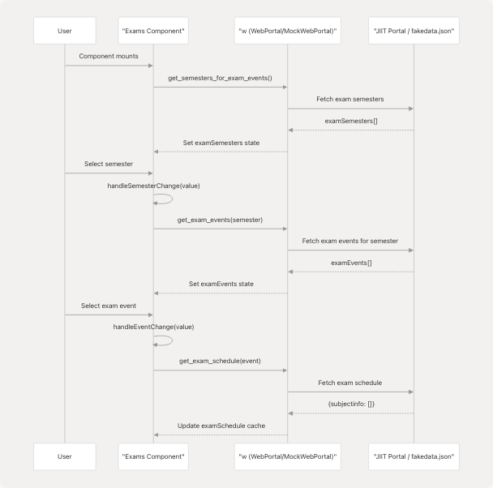
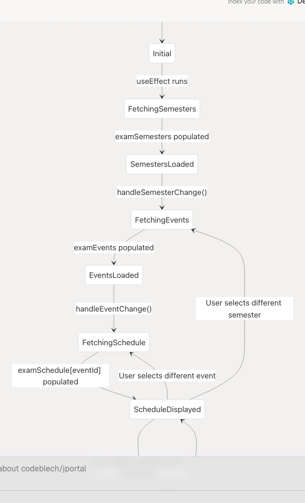
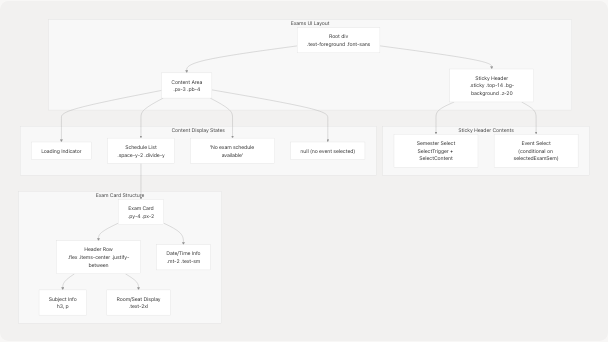

# Exams Module

## Purpose and Scope

The Exams Module displays examination schedules for students, organized by semester and exam event. It allows users to select an academic semester, choose an exam event (such as Mid-Term, End-Term, or Supplementary exams), and view the complete schedule including exam dates, times, room assignments, and seat numbers.

For information about other academic data features, see [Attendance Module](4.1-attendance-module), [Grades Module](4.2-grades-module), and [Subjects Module](4.4-subjects-module). For details on the data abstraction layer used by this module, see [Data Layer & API Integration](3.3-data-layer-and-api-integration).

## Component Architecture

The Exams Module is implemented as a single React component located at [jportal/src/components/Exams.jsx1-165](https://github.com/codeblech/jportal/blob/4df0fde4/jportal/src/components/Exams.jsx#L1-L165) The component follows the established pattern of receiving the `w` prop (WebPortal or MockWebPortal instance) for data access and several state management props from its parent `AuthenticatedApp`.


**Sources:** [jportal/src/components/Exams.jsx10-20](https://github.com/codeblech/jportal/blob/4df0fde4/jportal/src/components/Exams.jsx#L10-L20)

## State Management

The Exams component manages state through a combination of props passed from `AuthenticatedApp` and local component state. This follows the props drilling pattern used throughout JPortal.

| State Variable | Type | Source | Purpose |
| --- | --- | --- | --- |
| `examSchedule` | Object | Parent prop | Maps event IDs to exam schedule arrays |
| `examSemesters` | Array | Parent prop | List of available semesters for exam events |
| `selectedExamSem` | Object | Parent prop | Currently selected semester |
| `selectedExamEvent` | Object | Parent prop | Currently selected exam event |
| `examEvents` | Array | Local state | Exam events for selected semester |
| `loading` | Boolean | Local state | Loading indicator for async operations |

The component uses a caching strategy where fetched exam schedules are stored in the `examSchedule` object keyed by event ID, preventing redundant API calls when users switch between previously viewed events.

**Sources:** [jportal/src/components/Exams.jsx10-22](https://github.com/codeblech/jportal/blob/4df0fde4/jportal/src/components/Exams.jsx#L10-L22) [jportal/src/components/Exams.jsx57-63](https://github.com/codeblech/jportal/blob/4df0fde4/jportal/src/components/Exams.jsx#L57-L63)

## Data Flow and API Integration

The Exams module interacts with three API methods provided by the `w` prop:



### API Methods

#### `get_semesters_for_exam_events()`

Called on component mount to fetch available semesters that have exam events.

**Sources:** [jportal/src/components/Exams.jsx24-33](https://github.com/codeblech/jportal/blob/4df0fde4/jportal/src/components/Exams.jsx#L24-L33) [jportal/src/components/MockWebPortal.js97-99](https://github.com/codeblech/jportal/blob/4df0fde4/jportal/src/components/MockWebPortal.js#L97-L99)

#### `get_exam_events(semester)`

Fetches exam events (Mid-Term, End-Term, etc.) for the selected semester. Called when user changes semester selection.

**Sources:** [jportal/src/components/Exams.jsx36-48](https://github.com/codeblech/jportal/blob/4df0fde4/jportal/src/components/Exams.jsx#L36-L48) [jportal/src/components/MockWebPortal.js101-104](https://github.com/codeblech/jportal/blob/4df0fde4/jportal/src/components/MockWebPortal.js#L101-L104)

#### `get_exam_schedule(event)`

Retrieves the detailed exam schedule for a specific event, including subject details, dates, times, room codes, and seat numbers.

**Sources:** [jportal/src/components/Exams.jsx50-67](https://github.com/codeblech/jportal/blob/4df0fde4/jportal/src/components/Exams.jsx#L50-L67) [jportal/src/components/MockWebPortal.js106-109](https://github.com/codeblech/jportal/blob/4df0fde4/jportal/src/components/MockWebPortal.js#L106-L109)

## Component Lifecycle and Event Handlers



### Initial Load

The `useEffect` hook at [jportal/src/components/Exams.jsx24-33](https://github.com/codeblech/jportal/blob/4df0fde4/jportal/src/components/Exams.jsx#L24-L33) runs on component mount and fetches exam semesters if not already loaded:

```
useEffect(() => {
  const fetchSemesters = async () => {
    if (examSemesters.length === 0) {
      const examSems = await w.get_semesters_for_exam_events()
      setExamSemesters(examSems)
    }
  }
  fetchSemesters()
}, [])
```

### Semester Selection

The `handleSemesterChange` function at [jportal/src/components/Exams.jsx36-48](https://github.com/codeblech/jportal/blob/4df0fde4/jportal/src/components/Exams.jsx#L36-L48) manages semester changes:

1. Sets loading state
2. Updates `selectedExamSem` state
3. Fetches exam events for the semester
4. Resets `selectedExamEvent` and clears `examSchedule`

### Event Selection

The `handleEventChange` function at [jportal/src/components/Exams.jsx50-67](https://github.com/codeblech/jportal/blob/4df0fde4/jportal/src/components/Exams.jsx#L50-L67) handles event selection with caching:

1. Sets loading state
2. Updates `selectedExamEvent` state
3. Checks if schedule is already cached in `examSchedule[eventId]`
4. Fetches schedule if not cached, otherwise uses cached data

**Sources:** [jportal/src/components/Exams.jsx24-67](https://github.com/codeblech/jportal/blob/4df0fde4/jportal/src/components/Exams.jsx#L24-L67)

## User Interface Structure

The Exams component renders a sticky header with selection controls and a scrollable schedule display area.



### Select Components

Both semester and event selectors use the Radix UI-based `Select` component from [jportal/src/components/ui/select](https://github.com/codeblech/jportal/blob/4df0fde4/jportal/src/components/ui/select):

* Semester selector: [jportal/src/components/Exams.jsx86-99](https://github.com/codeblech/jportal/blob/4df0fde4/jportal/src/components/Exams.jsx#L86-L99)
* Event selector: [jportal/src/components/Exams.jsx101-124](https://github.com/codeblech/jportal/blob/4df0fde4/jportal/src/components/Exams.jsx#L101-L124) (conditionally rendered)

### Schedule Display

The schedule is rendered as a list of exam cards at [jportal/src/components/Exams.jsx128-162](https://github.com/codeblech/jportal/blob/4df0fde4/jportal/src/components/Exams.jsx#L128-L162) Each exam entry displays:

* **Subject Name**: Extracted from `exam.subjectdesc`, truncated at first parenthesis
* **Subject Code**: `exam.subjectcode`
* **Room and Seat**: Combined as `roomcode-seatno` in large font
* **Date**: Formatted using the `formatDate()` helper
* **Time**: Displayed as `exam.datetimeupto`

**Sources:** [jportal/src/components/Exams.jsx82-164](https://github.com/codeblech/jportal/blob/4df0fde4/jportal/src/components/Exams.jsx#L82-L164)

## Date Formatting

The `formatDate` function at [jportal/src/components/Exams.jsx72-80](https://github.com/codeblech/jportal/blob/4df0fde4/jportal/src/components/Exams.jsx#L72-L80) converts date strings from `DD/MM/YYYY` format to a human-readable format:

```
const formatDate = (dateStr) => {
  const [day, month, year] = dateStr.split('/')
  return new Date(`${month}/${day}/${year}`).toLocaleDateString('en-US', {
    weekday: 'long',
    year: 'numeric',
    month: 'long',
    day: 'numeric'
  })
}
```

Example: `"25/12/2024"` becomes `"Monday, December 25, 2024"`

**Sources:** [jportal/src/components/Exams.jsx72-80](https://github.com/codeblech/jportal/blob/4df0fde4/jportal/src/components/Exams.jsx#L72-L80)

## Data Structures

### Semester Object

```
{
  registration_id: "2025EVESEM",
  registration_code: "2025EVESEM"
}
```

**Sources:** [jportal/src/assets/fakedata.json1405-1421](https://github.com/codeblech/jportal/blob/4df0fde4/jportal/src/assets/fakedata.json#L1405-L1421)

### Exam Event Object

The event object structure differs slightly between real and mock implementations, so the code handles both field naming conventions:

```
{
  exameventid: "string" || exam_event_id: "string",
  exameventdesc: "string" || exam_event_desc: "string"
}
```

The component accesses these fields using `event.exameventid || event.exam_event_id` at [jportal/src/components/Exams.jsx54](https://github.com/codeblech/jportal/blob/4df0fde4/jportal/src/components/Exams.jsx#L54-L54) and [jportal/src/components/Exams.jsx69](https://github.com/codeblech/jportal/blob/4df0fde4/jportal/src/components/Exams.jsx#L69-L69)

**Sources:** [jportal/src/components/Exams.jsx54](https://github.com/codeblech/jportal/blob/4df0fde4/jportal/src/components/Exams.jsx#L54-L54) [jportal/src/components/Exams.jsx69](https://github.com/codeblech/jportal/blob/4df0fde4/jportal/src/components/Exams.jsx#L69-L69) [jportal/src/components/Exams.jsx105](https://github.com/codeblech/jportal/blob/4df0fde4/jportal/src/components/Exams.jsx#L105-L105) [jportal/src/components/Exams.jsx115](https://github.com/codeblech/jportal/blob/4df0fde4/jportal/src/components/Exams.jsx#L115-L115)

### Exam Schedule Entry

Each exam in the schedule contains:

```
{
  subjectdesc: "Subject Name (Additional Info)",
  subjectcode: "SUBCODE123",
  datetime: "DD/MM/YYYY",
  datetimeupto: "HH:MM AM/PM - HH:MM AM/PM",
  roomcode: "ROOM-123",      // optional
  seatno: "45"                // optional
}
```

**Sources:** [jportal/src/assets/fakedata.json1423-1695](https://github.com/codeblech/jportal/blob/4df0fde4/jportal/src/assets/fakedata.json#L1423-L1695) [jportal/src/components/Exams.jsx137-155](https://github.com/codeblech/jportal/blob/4df0fde4/jportal/src/components/Exams.jsx#L137-L155)

## Mock Data Implementation

The MockWebPortal class at [jportal/src/components/MockWebPortal.js](https://github.com/codeblech/jportal/blob/4df0fde4/jportal/src/components/MockWebPortal.js) provides demo mode support by reading from [jportal/src/assets/fakedata.json](https://github.com/codeblech/jportal/blob/4df0fde4/jportal/src/assets/fakedata.json) The exam data structure in `fakedata.json` includes:

* `exams.examSemesters`: Array of semester objects
* `exams.examEvents`: Object mapping semester keys to arrays of exam events
* `exams.examSchedule`: Object mapping event IDs to arrays of exam schedule entries

The mock implementation matches the real API contract, enabling seamless switching between demo and production modes.

**Sources:** [jportal/src/components/MockWebPortal.js97-109](https://github.com/codeblech/jportal/blob/4df0fde4/jportal/src/components/MockWebPortal.js#L97-L109) [jportal/src/assets/fakedata.json1397-1695](https://github.com/codeblech/jportal/blob/4df0fde4/jportal/src/assets/fakedata.json#L1397-L1695)

## Conditional Rendering Logic

The component implements a three-tier conditional rendering strategy at [jportal/src/components/Exams.jsx129-161](https://github.com/codeblech/jportal/blob/4df0fde4/jportal/src/components/Exams.jsx#L129-L161):

1. **Loading state**: Displays "Loading..." when `loading === true`
2. **Schedule available**: Renders exam cards when `currentSchedule?.length > 0`
3. **No schedule**: Shows "No exam schedule available" when `selectedExamEvent` is set but schedule is empty
4. **No event selected**: Renders `null` when no event has been selected yet

**Sources:** [jportal/src/components/Exams.jsx129-161](https://github.com/codeblech/jportal/blob/4df0fde4/jportal/src/components/Exams.jsx#L129-L161)

## Styling and Responsiveness

The component uses Tailwind CSS utility classes for styling, consistent with the application's styling system (see [Styling System](5.4-styling-system)). Key styling patterns include:

* **Sticky header**: `.sticky .top-14` keeps selectors visible during scroll
* **Z-index management**: `.z-20` ensures header stays above content
* **Spacing**: `.space-y-2` between exam cards, `.divide-y .divide-muted` for visual separation
* **Typography**: Subject names use `.font-medium`, room/seat numbers use `.text-2xl .font-medium`
* **Theme integration**: Uses theme tokens like `.bg-background`, `.text-foreground`, `.text-muted-foreground`

**Sources:** [jportal/src/components/Exams.jsx83-163](https://github.com/codeblech/jportal/blob/4df0fde4/jportal/src/components/Exams.jsx#L83-L163)
