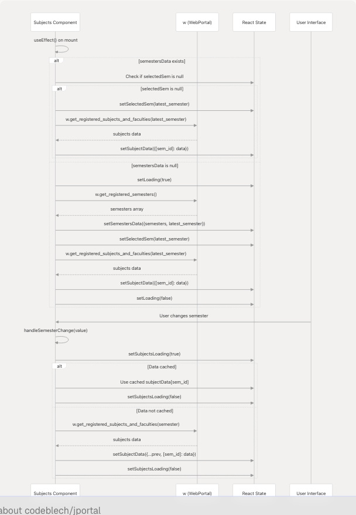
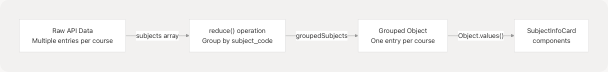
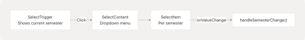
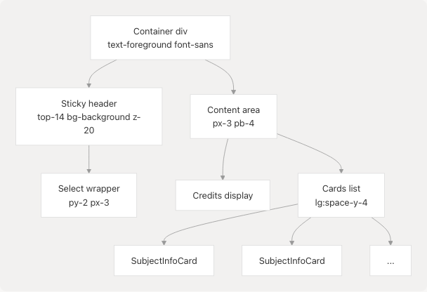

# Subjects Module

## Purpose and Scope

The Subjects Module displays registered courses and faculty assignments for each academic semester. Users can view course details including subject codes, credits, component types (Lecture, Tutorial, Practical), and assigned instructors. The module supports semester selection and groups subject components that share the same course code.

For attendance tracking per subject, see [Attendance Module](4.1-attendance-module). For exam schedules by subject, see [Exams Module](4.3-exams-module).

---

## Component Architecture

The Subjects Module consists of two React components in a parent-child hierarchy:


**Sources:** [jportal/src/components/Subjects.jsx1-143](https://github.com/codeblech/jportal/blob/4df0fde4/jportal/src/components/Subjects.jsx#L1-L143) [jportal/src/components/SubjectInfoCard.jsx1-26](https://github.com/codeblech/jportal/blob/4df0fde4/jportal/src/components/SubjectInfoCard.jsx#L1-L26)

---

## Component: Subjects.jsx

The `Subjects` component serves as the feature coordinator, managing data fetching, state updates, and semester selection.

### Props Interface

| Prop | Type | Direction | Purpose |
| --- | --- | --- | --- |
| `w` | WebPortal/MockWebPortal | In | Data access layer instance |
| `subjectData` | Object | In/Out | Cache of subject data by semester ID |
| `setSubjectData` | Function | In | State setter for subject data |
| `semestersData` | Object | In/Out | Contains semesters array and latest\_semester |
| `setSemestersData` | Function | In | State setter for semesters data |
| `selectedSem` | Object | In/Out | Currently selected semester object |
| `setSelectedSem` | Function | In | State setter for selected semester |

**Sources:** [jportal/src/components/Subjects.jsx11](https://github.com/codeblech/jportal/blob/4df0fde4/jportal/src/components/Subjects.jsx#L11-L11)

### Data Fetching Flow



**Sources:** [jportal/src/components/Subjects.jsx15-61](https://github.com/codeblech/jportal/blob/4df0fde4/jportal/src/components/Subjects.jsx#L15-L61) [jportal/src/components/Subjects.jsx63-84](https://github.com/codeblech/jportal/blob/4df0fde4/jportal/src/components/Subjects.jsx#L63-L84)

### Data Caching Strategy

The component implements client-side caching to avoid redundant API calls:

* **Cache Key:** `semester.registration_id` (e.g., `"2025EVESEM"`)
* **Cache Structure:** `{ [registration_id]: { subjects: [...], total_credits: number } }`
* **Cache Check:** Before fetching, component checks `subjectData?.[semester.registration_id]`
* **Cache Population:** After successful fetch, data is merged into state using spread operator

This pattern is seen at [jportal/src/components/Subjects.jsx69-72](https://github.com/codeblech/jportal/blob/4df0fde4/jportal/src/components/Subjects.jsx#L69-L72) where the component returns early if cached data exists.

**Sources:** [jportal/src/components/Subjects.jsx69-78](https://github.com/codeblech/jportal/blob/4df0fde4/jportal/src/components/Subjects.jsx#L69-L78) [jportal/src/components/Subjects.jsx21-27](https://github.com/codeblech/jportal/blob/4df0fde4/jportal/src/components/Subjects.jsx#L21-L27)

### Subject Grouping Logic

Raw subject data from the API contains separate entries for each subject component (Lecture, Tutorial, Practical). The component groups these by base subject code:



The grouping algorithm at [jportal/src/components/Subjects.jsx87-103](https://github.com/codeblech/jportal/blob/4df0fde4/jportal/src/components/Subjects.jsx#L87-L103):

1. Uses `reduce()` to iterate through `subjects` array
2. Groups by `subject.subject_code` as the key
3. For each unique code, creates an object with:
   * `name`: `subject.subject_desc`
   * `code`: `subject.subject_code`
   * `credits`: `subject.credits`
   * `isAudit`: `subject.audtsubject === "Y"`
   * `components`: Array of `{ type, teacher }` objects
4. Each component is pushed to the `components` array with:
   * `type`: `subject.subject_component_code` (L/T/P)
   * `teacher`: `subject.employee_name`

**Sources:** [jportal/src/components/Subjects.jsx86-103](https://github.com/codeblech/jportal/blob/4df0fde4/jportal/src/components/Subjects.jsx#L86-L103)

---

## Component: SubjectInfoCard.jsx

A presentational component that renders a single subject's information in a card layout.

### Component Structure


### Prop Interface

| Field | Type | Description |
| --- | --- | --- |
| `subject.name` | string | Full subject description |
| `subject.code` | string | Subject code (e.g., "15B11EC611") |
| `subject.credits` | number | Credit value (displayed with 1 decimal) |
| `subject.isAudit` | boolean | Whether this is an audit subject |
| `subject.components` | Array | List of component objects |
| `subject.components[].type` | string | Component type: 'L', 'T', or 'P' |
| `subject.components[].teacher` | string | Faculty member name |

**Sources:** [jportal/src/components/SubjectInfoCard.jsx1-26](https://github.com/codeblech/jportal/blob/4df0fde4/jportal/src/components/SubjectInfoCard.jsx#L1-L26)

### Component Type Display Logic

The component maps abbreviated codes to full labels at [jportal/src/components/SubjectInfoCard.jsx10-17](https://github.com/codeblech/jportal/blob/4df0fde4/jportal/src/components/SubjectInfoCard.jsx#L10-L17):

| Code | Display Label |
| --- | --- |
| `'L'` | Lecture |
| `'T'` | Tutorial |
| `'P'` | Practical |

Each component is rendered as: `{type}: {teacher}` (e.g., "Lecture: HARLEEN KAUR")

**Sources:** [jportal/src/components/SubjectInfoCard.jsx10-17](https://github.com/codeblech/jportal/blob/4df0fde4/jportal/src/components/SubjectInfoCard.jsx#L10-L17)

---

## Data Layer Integration

### WebPortal API Methods

The module interacts with two methods from the `w` prop (WebPortal or MockWebPortal instance):

#### Method: `get_registered_semesters()`

```
Returns: Array<Semester>

Semester {
  registration_id: string,    // e.g., "2025EVESEM"
  registration_code: string   // e.g., "2025EVESEM" (display name)
}
```

Called once on component mount if `semestersData` is not already populated.

**Sources:** [jportal/src/components/Subjects.jsx35](https://github.com/codeblech/jportal/blob/4df0fde4/jportal/src/components/Subjects.jsx#L35-L35) [jportal/src/components/MockWebPortal.js111-113](https://github.com/codeblech/jportal/blob/4df0fde4/jportal/src/components/MockWebPortal.js#L111-L113)

#### Method: `get_registered_subjects_and_faculties(semester)`

```
Parameters:
  semester: Semester object

Returns: {
  subjects: Array<Subject>,
  registered_subject_faculty: Array<Subject>  // Same as subjects
}

Subject {
  subject_code: string,            // e.g., "15B11EC611"
  subject_desc: string,            // Full name
  credits: number,                 // Credit value
  subject_component_code: string,  // 'L', 'T', or 'P'
  employee_name: string,           // Faculty name
  audtsubject: string             // 'Y' or 'N'
}
```

Called when a semester is selected. Result is cached in `subjectData[semester.registration_id]`.

**Sources:** [jportal/src/components/Subjects.jsx46](https://github.com/codeblech/jportal/blob/4df0fde4/jportal/src/components/Subjects.jsx#L46-L46) [jportal/src/components/Subjects.jsx74](https://github.com/codeblech/jportal/blob/4df0fde4/jportal/src/components/Subjects.jsx#L74-L74) [jportal/src/components/MockWebPortal.js81-91](https://github.com/codeblech/jportal/blob/4df0fde4/jportal/src/components/MockWebPortal.js#L81-L91)

### Mock Data Structure

In demo mode, data is sourced from [jportal/src/assets/fakedata.json](https://github.com/codeblech/jportal/blob/4df0fde4/jportal/src/assets/fakedata.json) under the `subjects` key:

```
{
  "subjects": {
    "semestersData": {
      "semesters": [
        {
          "registration_id": "2025EVESEM",
          "registration_code": "2025EVESEM"
        },
        {
          "registration_id": "2025ODDSEM",
          "registration_code": "2025ODDSEM"
        }
      ]
    },
    "subjectData": {
      "2025EVESEM": {
        "subjects": [
          {
            "subject_code": "15B11EC611",
            "subject_desc": "TELECOMMUNICATION NETWORKS",
            "credits": 3,
            "subject_component_code": "L",
            "employee_name": "HARLEEN KAUR",
            "audtsubject": "N"
          },
          ...
        ]
      }
    }
  }
}
```

The `MockWebPortal.get_registered_subjects_and_faculties()` method extracts data using the semester's `registration_code` as the key.

**Sources:** [jportal/src/assets/fakedata.json1766-2136](https://github.com/codeblech/jportal/blob/4df0fde4/jportal/src/assets/fakedata.json#L1766-L2136) [jportal/src/components/MockWebPortal.js81-91](https://github.com/codeblech/jportal/blob/4df0fde4/jportal/src/components/MockWebPortal.js#L81-L91)

---

## State Management Pattern

The Subjects Module follows the application-wide props drilling pattern. State is owned by the `AuthenticatedApp` component and passed down through props.

### State Ownership Diagram


### State Shape

| State Variable | Type | Purpose |
| --- | --- | --- |
| `subjectData` | `{ [registration_id]: { subjects: Array, total_credits: number } }` | Cached subject data per semester |
| `semestersData` | `{ semesters: Array<Semester>, latest_semester: Semester }` | Available semesters |
| `selectedSem` | `Semester | null` | Currently displayed semester |

Local component state:

* `loading`: Boolean flag for initial semester fetch
* `subjectsLoading`: Boolean flag for subject data fetch

**Sources:** [jportal/src/components/Subjects.jsx12-13](https://github.com/codeblech/jportal/blob/4df0fde4/jportal/src/components/Subjects.jsx#L12-L13)

---

## UI Components

### Semester Selector

The component uses the Radix UI-based `Select` component from [jportal/src/components/ui/select](https://github.com/codeblech/jportal/blob/4df0fde4/jportal/src/components/ui/select):



* **Position:** Sticky at `top-14` (below header)
* **Background:** Uses `bg-background` from theme
* **Disabled State:** When `loading` is true
* **Value:** `selectedSem?.registration_id`
* **Display:** `selectedSem?.registration_code`

**Sources:** [jportal/src/components/Subjects.jsx107-124](https://github.com/codeblech/jportal/blob/4df0fde4/jportal/src/components/Subjects.jsx#L107-L124)

### Subject Cards List

Subject cards are rendered from the grouped subjects object:

```
Object.values(groupedSubjects).map((subject) => (
  <SubjectInfoCard key={subject.code} subject={subject} />
))
```

* **Layout:** Vertical stack with `lg:space-y-4` spacing
* **Loading State:** Centered "Loading subjects..." message
* **Empty State:** No explicit empty state (renders empty div)

**Sources:** [jportal/src/components/Subjects.jsx134-138](https://github.com/codeblech/jportal/blob/4df0fde4/jportal/src/components/Subjects.jsx#L134-L138)

### Credits Display

Total credits are shown above the subject list at [jportal/src/components/Subjects.jsx127](https://github.com/codeblech/jportal/blob/4df0fde4/jportal/src/components/Subjects.jsx#L127-L127):

```
<p className="text-sm lg:text-base">
  Total Credits: {currentSubjects?.total_credits || 0}
</p>
```

This value is computed from the API response's `total_credits` field.

**Sources:** [jportal/src/components/Subjects.jsx126-127](https://github.com/codeblech/jportal/blob/4df0fde4/jportal/src/components/Subjects.jsx#L126-L127)

---

## Styling and Layout

### Responsive Design

The module uses Tailwind CSS utility classes with breakpoint-specific styling:

| Breakpoint | Element | Style Changes |
| --- | --- | --- |
| `max-[390px]` | Subject name | `text-xs` (smaller font) |
| `max-[390px]` | Subject code/components | `text-xs` (smaller font) |
| `max-[390px]` | Credits badge | `text-2xl` (down from `text-3xl`) |
| `lg` | Component text | `text-base` (up from `text-sm`) |
| `lg` | Subject list | `space-y-4` spacing |

**Sources:** [jportal/src/components/SubjectInfoCard.jsx5-21](https://github.com/codeblech/jportal/blob/4df0fde4/jportal/src/components/SubjectInfoCard.jsx#L5-L21)

### Component Layout Structure



**Card Layout:**

* Border bottom: `border-b border-border`
* Padding: `py-1`
* Flexbox: `flex justify-between items-center`
* Left section: Subject info with `flex-1` and `mr-4`
* Right section: Credits badge in large font

**Sources:** [jportal/src/components/Subjects.jsx106-141](https://github.com/codeblech/jportal/blob/4df0fde4/jportal/src/components/Subjects.jsx#L106-L141) [jportal/src/components/SubjectInfoCard.jsx2-23](https://github.com/codeblech/jportal/blob/4df0fde4/jportal/src/components/SubjectInfoCard.jsx#L2-L23)

---

## Data Flow Summary


**Sources:** [jportal/src/components/Subjects.jsx15-84](https://github.com/codeblech/jportal/blob/4df0fde4/jportal/src/components/Subjects.jsx#L15-L84) [jportal/src/components/Subjects.jsx86-103](https://github.com/codeblech/jportal/blob/4df0fde4/jportal/src/components/Subjects.jsx#L86-L103)

---

## Integration Points

### Authentication Context

The `w` prop contains either a `WebPortal` or `MockWebPortal` instance, determined by authentication mode. This abstraction is set up in the parent `AuthenticatedApp` component (see [Application Structure & Authentication](3.1-application-structure-and-authentication)).

### Shared State

The Subjects Module shares `semestersData` state with other modules:

* **Attendance Module** ([#4.1](4.1-attendance-module)) may use similar semester selection
* **Grades Module** ([#4.2](4.2-grades-module)) uses separate semester lists but similar patterns

The state is lifted to `AuthenticatedApp` to enable potential state sharing and avoid duplicate API calls if multiple modules need the same semester list.

**Sources:** [jportal/src/components/Subjects.jsx11](https://github.com/codeblech/jportal/blob/4df0fde4/jportal/src/components/Subjects.jsx#L11-L11)
